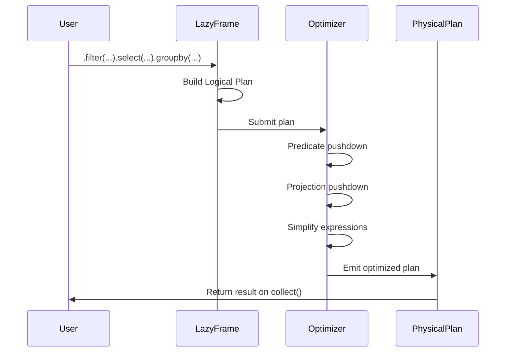
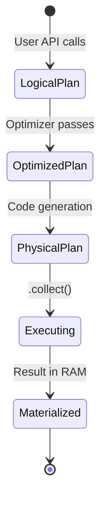

# 🦀 01 - Lazy Evaluation and Query Optimization

**Course type: Language/Framework (Rust)**

## 🎯 Learning Objectives
- Master the difference between eager and lazy execution in Polars
- Understand how the query optimizer rewrites logical plans into efficient physical plans
- Implement predicate pushdown, projection pushdown, and common subexpression elimination
- Diagnose performance bottlenecks by reading optimized query plans

## Introduction

In data engineering, the most expensive resource is not CPU cycles or memory—it is data movement. Every time a system reads an unused column from disk, shuffles an intermediate result across memory boundaries, or recomputes the same expression twice, it pays a tax that compounds across billions of rows. Lazy evaluation is the compiler-inspired technique of building a computation graph before execution, allowing an optimizer to eliminate these taxes. For ML engineers, this means feature engineering pipelines that scale from prototype to production without rewriting code.

The theoretical roots of lazy evaluation trace to lambda calculus and functional programming: an expression is not evaluated when defined, but when its value is actually needed ("call by need"). For DataFrame libraries, this decouples intent from execution strategy. When you write `df.filter(...).select(...)`, an eager engine materializes the entire filtered DataFrame before selecting columns. A lazy engine observes the whole sequence and reads only the selected columns while applying the filter simultaneously.

This decoupling enables optimizations impossible in imperative APIs. Database optimizers have exploited this for decades—the Volcano/Cascades framework (Graefe, 1990s) showed how to enumerate equivalent query plans and cost them. DataFrame operations are relational algebra: selection (σ), projection (π), join (⋈), aggregation (γ)—and relational algebra obeys algebraic laws. Selection distributes over join: σ(A ⋈ B) = σ(A) ⋈ B if the predicate only references A. This is the mathematical justification for predicate pushdown. This module connects to [[00 - Welcome to Polars Internals]] and prepares for [[02 - Memory Mapping and Zero-Copy Reads]].

---

## 1. Lazy Execution

The `LazyFrame` API mirrors `DataFrame` while deferring execution. Every method before `.collect()` is pure graph manipulation; `.collect()` is the effectful boundary where computation occurs and memory is allocated.

```rust
use polars::prelude::*;

fn lazy_vs_eager(path: &str) -> Result<DataFrame, PolarsError> {
    // LazyCsvReader starts building the graph at the source—no data touched yet
    let lazy_df = LazyCsvReader::new(path)
        .has_header(true)
        .finish()?;

    // Each method returns a NEW LazyFrame, not data
    let optimized = lazy_df
        .filter(col("timestamp").gt(lit("2023-01-01")))
        .select([
            col("user_id"),
            col("event_type"),
            col("value"),
        ])
        .with_column(
            col("value").cast(DataType::Float64)
        );

    // explain() prints the logical/optimized plan without running
    println!("{}", optimized.explain(true)?);

    // collect() is the ONLY point where memory is allocated for results
    optimized.collect()
}
```

Eager execution moves data through multiple intermediate buffers—reading, filtering, selecting, and aggregating all create separate copies. Lazy execution fuses these steps:

```text
Eager (Pandas):
  Step 1: Read CSV        --→ 10GB in RAM
  Step 2: Filter          --→ 2GB copied
  Step 3: Select          --→ 500MB copied
  Step 4: GroupBy         --→ 50MB result
  Total moved: 12.55GB

Lazy (Polars):
  Step 1: Build recipe
  Step 2: Optimizer rewrites recipe
  Step 3: Execute fused ops
  Data touched: 500MB (projected columns), filter applied at scan
```

The query graph is a directed acyclic graph (DAG) where nodes are operations and edges are data dependencies. The optimizer sees the entire DAG before any data is read.

```rust
use polars::prelude::*;

fn streaming_lazy_example() -> Result<DataFrame, PolarsError> {
    let df = df!(
        "city" => &["NY", "LA", "NY", "SF", "LA"],
        "sales" => &[100.0, 200.0, 150.0, 300.0, 250.0],
        "region" => &["East", "West", "East", "West", "West"]
    )?;

    let result = df.lazy()
        .filter(col("sales").gt(lit(120.0)))
        .groupby([col("city")])
        .agg([col("sales").mean().alias("avg_sales")])
        .collect()?;

    println!("{:?}", result);
    Ok(())
}
```

❌ **Antipattern**: Collecting inside a loop. Materializing intermediate results in a multi-step pipeline defeats lazy optimization. ✅ Build the entire graph, then collect once—treat `.collect()` like a database COMMIT.

❌ **Antipattern**: Side effects in lambdas. Using `.apply()` with closures or UDFs forces materialization and disables vectorization. ✅ Prefer native expressions that compose into the logical plan.

> **Caso real**: Spotify's daily feature engineering pipeline joins billions of user listening events with millions of track metadata records. Their legacy Pandas pipeline required intermediate CSV dumps and manual chunking. A single Polars lazy graph with predicate pushdown skipped 70% of Parquet row groups, and projection pushdown eliminated 30 unused metadata columns. Runtime dropped from 45 to 4 minutes on the same hardware.

⚠️ **Collecting too early**: Each `.collect()` is a full execution cycle. If you collect, transform, and collect again, you lose the opportunity to fuse operations. 💡 "Collect once, collect wisely."

⚠️ **Ignoring `.explain()`**: The single best debugging tool for lazy performance is `.explain(true)`. It shows exactly what the optimizer did. Make it a habit to inspect it for every non-trivial query.

The transformation from user code to optimized plan follows this sequence:



---

## 2. Query Optimization

Query optimization bridges declarative intent and efficient execution. The optimizer's job is to find the cheapest equivalent expression according to a cost model. In Polars, the cost model is simplified compared to full SQL planners—no indexes, no disk-vs-memory tradeoffs for intermediates, no distributed network costs—but the algebraic laws are identical.

**Predicate pushdown** is the most impactful optimization. Formally, if R is a relation and p is a predicate, then σ_p(R) can be pushed below a join if p only references attributes of R: σ_p(R ⋈ S) = σ_p(R) ⋈ S. Joins are expensive (O(n log n) or O(n²)), so reducing input size before a join multiplicatively reduces cost. **Projection pushdown** works similarly: π_A(R) means only attributes in A are needed, so upstream operations producing other attributes can be eliminated. **Common subexpression elimination** builds a DAG of expressions rather than a tree—if two branches compute `col("x") * 2`, the result is stored once.

Join reordering is another powerful transformation. In multi-way joins, order affects intermediate result sizes dramatically. A greedy optimizer estimates cardinalities using row counts and distinct value counts, then selects the order minimizing total intermediate size. This matters in ML feature pipelines where dimension tables join against large fact tables.

Constant folding replaces `lit(2) + lit(3)` with `lit(5)` at plan time. Boolean simplification applies De Morgan's laws. These micro-optimizations accumulate across millions of rows, turning per-row branching into pre-computed constants. In ML pipelines with complex feature crosses, expression simplification can eliminate 20-30% of arithmetic operations before the first row is read.

```rust
use polars::prelude::*;

fn optimized_join_demo() -> Result<DataFrame, PolarsError> {
    let events = df!(
        "user_id" => &[1, 2, 3, 1, 2],
        "event_date" => &["2024-01-01", "2024-01-02", "2024-01-03", "2024-01-04", "2024-01-05"],
        "value" => &[10.0, 20.0, 30.0, 40.0, 50.0]
    )?;

    let users = df!(
        "user_id" => &[1, 2, 3],
        "name" => &["Alice", "Bob", "Charlie"],
        "signup_date" => &["2023-01-01", "2023-06-15", "2023-12-01"]
    )?;

    let result = events.lazy()
        .join(
            users.lazy(),
            [col("user_id")],
            [col("user_id")],
            JoinType::Inner,
        )
        .filter(col("event_date").gt(lit("2024-01-02")))
        .select([
            col("name"),
            col("value"),
            col("event_date"),
        ])
        .groupby([col("name")])
        .agg([col("value").sum().alias("total_value")])
        .with_streaming(false)
        .collect()?;

    println!("{:?}", result);
    Ok(())
}
```

The filter contains two predicates joined by `and`. The optimizer splits these and pushes each to the most efficient point—one to the events scan, another to the join output.

❌ **Antipattern**: Over-joining without filtering. Joining two large tables before filtering prevents the optimizer from reducing input sizes. ✅ Filter each table independently before the join.

❌ **Antipattern**: Assuming all optimizations are automatic. If you use `.apply()` or Python UDFs, the optimizer cannot see inside the black box and disables pushdown. ✅ Stay in expression land.

> **Caso real**: Zillow's Zestimate model joins property listings with tax records, school ratings, and geographic features. Their Spark pipeline suffered shuffle storms. Polars automatically reordered joins to process the smallest table first (county tax records) and pushed the county filter into every scan. Prototype iteration cycles dropped from 20 minutes to 90 seconds.

The optimization pipeline can be visualized as a series of rewriting passes:

```text
Input: User's Logical Plan
    |
    ▼
 --------------------- 
| Pass 1: Predicate   |--→ Push filters to scans
| Pushdown            |
 --------------------- 
    |
    ▼
 --------------------- 
| Pass 2: Projection  |--→ Remove unused columns
| Pushdown            |
 --------------------- 
    |
    ▼
 --------------------- 
| Pass 3: Join        |--→ Reorder joins by size
| Reordering          |
 --------------------- 
    |
    ▼
Output: Physical Plan
```

The effect on data movement is dramatic:

```text
Without Optimization:
  Read 100 cols --→ Filter --→ Select 2 cols
  100GB read        100GB processed

With Optimization:
  Read 2 cols + Filter --→ Aggregate
  2GB read               2GB processed
```

```rust
use polars::prelude::*;

fn inspect_plan(path: &str) -> Result<(), PolarsError> {
    let q = LazyCsvReader::new(path)
        .has_header(true)
        .finish()?
        .filter(col("category").eq(lit("electronics")))
        .select([col("product_id"), col("price")])
        .groupby([col("product_id")])
        .agg([col("price").mean()]);

    // Print the optimized plan without executing
    println!("Optimized plan:\n{}", q.explain(true)?);
    Ok(())
}
```

⚠️ **Not using `.explain(true)` in CI**: Add a step to your CI pipeline that validates that the optimized plan contains pushed-down filters. Catch optimization regressions automatically.

⚠️ **Micro-batching defeats optimization**: If you split a large file into tiny chunks and process each independently, the optimizer never sees the full picture. Let Polars handle chunking.

💡 **Mental shortcut**: Read your query bottom-up from `.collect()`. If you see a large scan after an expensive operation like a join, the optimizer missed a pushdown opportunity.



---

## 🎯 Key Takeaways
- Lazy evaluation builds a DAG of operations; `.collect()` is the single execution boundary
- Predicate pushdown filters at the scan level, skipping irrelevant data before it is read
- Projection pushdown eliminates unused columns, reducing I/O by up to 97%
- Common subexpression elimination deduplicates repeated computations in the plan
- `.explain(true)` reveals exactly what optimizations were applied—always use it

## References
- [[00 - Welcome to Polars Internals]]
- [[02 - Memory Mapping and Zero-Copy Reads]]
- [Polars lazy API docs](https://docs.pola.rs/user-guide/lazy/)
- [Materialization strategies in DBMS (VLDB)](https://www.vldb.org/pvldb/vol13/p2937-kersten.pdf)

## 📦 Código de compresión

```rust
use polars::prelude::*;

fn main() -> Result<(), PolarsError> {
    let events = LazyCsvReader::new("events.csv")
        .has_header(true)
        .finish()?;

    let users = LazyCsvReader::new("users.csv")
        .has_header(true)
        .finish()?;

    let result = events
        .join(users, [col("user_id")], [col("user_id")], JoinType::Inner)
        .filter(col("event_date").gt(lit("2024-01-01")))
        .select([col("user_id"), col("event_type"), col("value")])
        .groupby([col("event_type")])
        .agg([col("value").sum().alias("total_value")])
        .collect()?;

    println!("{:?}", result);
    Ok(())
}
```
