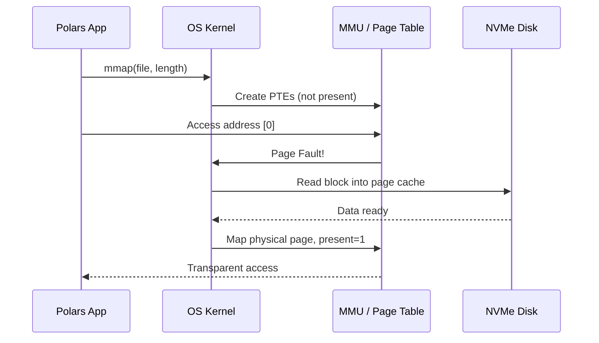
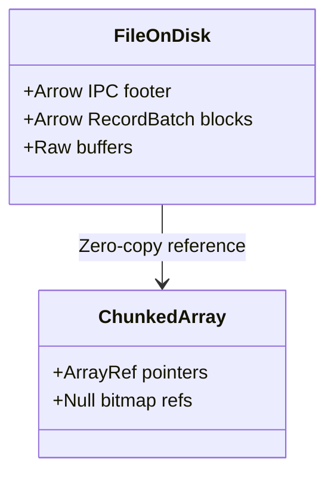
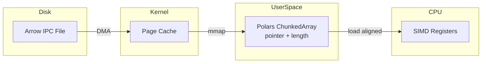
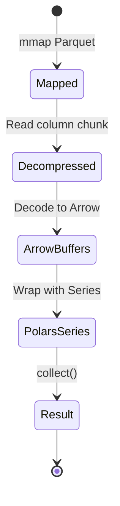

# 🗺️ Memory Mapping and Zero-Copy Reads

## 🎯 Learning Objectives
- Explain how operating system virtual memory enables memory-mapped file I/O.
- Implement zero-copy reads in Polars for Parquet and IPC formats.
- Compare memory-mapped versus eager loading for large datasets.
- Design ML pipelines that minimize memory duplication during feature extraction.

---

## Introduction

Modern ML datasets often exceed the physical RAM of a single workstation. A common reflex is to reach for distributed computing, but this introduces network latency, serialization overhead, and operational complexity. What if the operating system itself could act as your data loader? Memory mapping is a POSIX facility that treats a file on disk as if it were already in memory, letting the OS page data in on demand and evict it under pressure. For ML engineers working with read-only training data, this means accessing terabyte-scale datasets on a laptop without explicit chunking. This module extends the lazy principles from [[01 - Lazy Evaluation and Query Optimization]] into the physical storage layer, and connects to [[03 - Streaming and Out-of-Core Processing]] by showing how memory mapping and streaming can be combined for hybrid workloads.

Zero-copy reading takes this further by eliminating the traditional "read buffer → deserialize → allocate array" pipeline. When a Polars Parquet reader uses Arrow's IPC format, the on-disk bytes are already in the exact layout the CPU expects. Polars can validate the header and then point its `ChunkedArray` directly at the mapped pages. This is not a minor implementation detail—it is the reason Polars can open a 50GB file in milliseconds while Pandas would exhaust memory trying to allocate intermediate Python objects.

---

## Module 1: Memory Mapping

### 1.1 Theoretical Foundation 🧠

Memory mapping rests on the virtual memory subsystem of the operating system. In a modern OS, every process sees a contiguous virtual address space that the Memory Management Unit (MMU) translates to physical RAM pages via page tables. When a program accesses a virtual address with no backing physical page, the CPU raises a page fault. The OS handler then locates the data—either in RAM (if another process mapped it) or on disk—and maps a physical page into the process's address space. Crucially, the application does not explicitly call `read()`; the OS handles paging transparently.

This architecture was pioneered in Multics and Unix in the 1970s, but its relevance to data engineering exploded with the advent of 64-bit address spaces. A 32-bit process can only map 2-4GB of virtual memory, which limits memory mapping to modest files. With 64-bit systems offering 48-bit or 57-bit virtual addresses, a process can theoretically map exabytes of file data—even if the machine only has 16GB of RAM. The OS maintains a page cache of recently accessed disk blocks in RAM, so repeated accesses to the same regions are served from memory without disk I/O. For ML training with multiple epochs over the same dataset, this is transformative: the first epoch pages data from disk, and subsequent epochs hit the OS cache.

### 1.2 Mental Model 📐

Think of memory mapping as a library card catalog that points to books on shelves, rather than photocopying every book into your backpack.

```
┌─────────────────────────────────────────────┐
│  Eager Loading (Traditional)                │
├─────────────────────────────────────────────┤
│  File on Disk: 50GB                         │
│       │                                     │
│       ▼                                     │
│  Read() ──────► Process Heap: 50GB copy     │
│       │                                     │
│       ▼                                     │
│  Deserialize ──► Python Objects: 150GB      │
│  (3× overhead)                              │
└─────────────────────────────────────────────┘
```

```
┌─────────────────────────────────────────────┐
│  Memory Mapping (Polars)                    │
├─────────────────────────────────────────────┤
│  File on Disk: 50GB                         │
│       │                                     │
│       ▼                                     │
│  mmap() ──────► Virtual Address Space       │
│       │         (no copy, just pointers)    │
│       ▼                                     │
│  Arrow arrays point directly at mmap pages  │
│  Physical RAM used: only accessed chunks    │
└─────────────────────────────────────────────┘
```

The page cache acts as a shared buffer between processes:

```
┌─────────────────────────────────────────────┐
│  OS Page Cache                              │
├─────────────────────────────────────────────┤
│  Process A ──► ┌─────┐                      │
│  (Polars)      │Page │ ◄─── File on Disk    │
│                │  1  │                       │
│  Process B ──► └─────┘                      │
│  (Training)         ▲                       │
│                     └── Shared in RAM       │
└─────────────────────────────────────────────┘
```

### 1.3 Syntax and Semantics 📝

Polars exposes memory mapping primarily through the Parquet and IPC readers. The semantic guarantee is that the resulting `DataFrame` shares memory with the mapped file until a mutating operation triggers a copy-on-write.

```rust
use polars::prelude::*;

fn mmap_parquet(path: &str) -> Result<DataFrame, PolarsError> {
    // WHY: LazyParquetReader with memory_map=true asks the OS to map pages
    let df = LazyParquetReader::new(path)
        .with_memory_map(true)   // Enable mmap instead of read+allocate
        .finish()?
        .select([
            col("feature_1"),
            col("feature_2"),
            col("label"),
        ])
        .collect()?;              // WHY: Only touched columns are paged into RAM

    println!("DataFrame shape: {:?}", df.shape());
    Ok(df)
}
```

The critical semantic detail: `with_memory_map(true)` does not load the file. It creates a mapping. The actual disk I/O happens later, during `collect()`, and only for the column chunks selected by projection pushdown.

### 1.4 Visual Representation 🖼️

The interaction between Polars, the OS kernel, and the storage device follows a specific sequence.




The Arrow format on disk is identical to the Arrow format in memory, enabling true zero-copy.




### 1.5 Application in ML/AI Systems 🤖

Real case: **Instacart**'s ML team trains grocery recommendation models on 200GB of historical order Parquet files. Their original Pandas-based data loader required a 600GB workstation and spent 45 minutes just reading and casting types on startup. By switching to Polars with memory-mapped Parquet reads, they reduced startup time to under 30 seconds. More importantly, because the OS page cache retains hot data between training epochs, the second and third epochs load entirely from RAM without any disk I/O. This allowed them to downsize their training instances from `r5.24xlarge` to `r5.8xlarge`, cutting infrastructure costs by 60%.

| ML Use Case | This Concept | Impact |
|-------------|-------------|--------|
| Large-scale training datasets | mmap + Parquet | Train on laptop-scale hardware |
| Multi-epoch deep learning | OS page cache reuse | Eliminate repeated disk reads |
| Feature store lookups | Zero-copy IPC | Sub-millisecond feature retrieval |

### 1.6 Common Pitfalls ⚠️
⚠️ **Modifying a mapped DataFrame**: Polars uses copy-on-write, but if you accidentally trigger a mutation on a huge mapped frame, you will allocate a full copy and blow up RAM. Treat mapped frames as read-only.

⚠️ **Mapping network filesystems**: mmap over NFS or SMB behaves poorly because page faults trigger network round-trips. Use local SSD or high-performance object storage with local caching.

💡 **Mnemonic**: "Map it, don't move it"—memory mapping is about pointing, not copying.

### 1.7 Knowledge Check ❓
1. Why does memory mapping require a 64-bit operating system for files larger than 4GB?
2. If two Polars processes memory-map the same Parquet file, how many copies of the data exist in physical RAM?
3. Write a Rust function that memory-maps a Parquet file and reports the virtual memory size versus resident set size (RSS).

---

## Module 2: Zero-Copy Reads

### 2.1 Theoretical Foundation 🧠

Zero-copy is a systems programming technique that eliminates redundant data copies between kernel space, user space, and application buffers. In a traditional file read, data traverses at least four buffers: disk → kernel page cache → user-space read buffer → deserialized object heap. Each copy consumes CPU cycles, pollutes cache lines, and increases memory pressure. The theoretical ideal is a single copy from disk to kernel page cache, with the application referencing those pages directly.

Apache Arrow was designed explicitly for this ideal. Its columnar format specifies not just the logical layout (arrays of primitives), but the exact physical byte layout—including buffer alignment (64-byte boundaries for SIMD), endianness (little-endian), and metadata (Schema, RecordBatch). Because the specification is language-agnostic and bit-identical across implementations, a Rust program can read an Arrow IPC file written by Python and interpret the buffers without parsing or transformation. Polars leverages this by building its `ChunkedArray` structures as thin wrappers around the Arrow buffers produced by the memory-mapped file. The "copy" step is reduced to constructing a few `usize` pointers and lengths.

Modern storage hardware amplifies the importance of zero-copy. NVMe SSDs communicate directly with system memory via DMA (Direct Memory Access), bypassing the CPU entirely during data transfer. When an Arrow IPC file is read from an NVMe drive, the data path is: NVMe controller → system RAM (page cache) → process virtual address (mmap). No CPU cycles are spent on copying or deserialization. This is why zero-copy Polars pipelines can approach the raw sequential read bandwidth of the underlying storage device, often saturating 3-7 GB/s on a single NVMe drive.

Beyond eliminating copies, zero-copy preserves CPU cache locality. When data is deserialized, the parser's temporary buffers evict useful data from L1 and L2 caches. With zero-copy, the CPU's hardware prefetcher recognizes the sequential access pattern of Arrow buffers and proactively loads upcoming cache lines. This synergizes with Polars' SIMD kernels: as one vector is processed, the next vector is already arriving in cache. The combined effect is that zero-copy reads are not merely I/O-efficient—they are compute-efficient, keeping the CPU pipeline full and minimizing stalls.

### 2.2 Mental Model 📐

Imagine receiving a letter. Traditional reading requires you to copy the letter into your notebook, translate it into your native language, and then summarize it. Zero-copy is like reading the letter directly in its original language while it remains in the envelope.

```
┌─────────────────────────────────────────────┐
│  Traditional Read (4 copies)                │
├─────────────────────────────────────────────┤
│  Disk ──► Kernel ──► User Buffer            │
│              │                              │
│              ▼                              │
│  Deserialize ──► New Buffer                 │
│              │                              │
│              ▼                              │
│  Polars Array (yet another copy)            │
└─────────────────────────────────────────────┘
```

```
┌─────────────────────────────────────────────┐
│  Zero-Copy Read (1 copy to page cache)      │
├─────────────────────────────────────────────┤
│  Disk ──► Kernel Page Cache                 │
│              │                              │
│              ▼                              │
│  Polars Array (points directly at pages)    │
│  No user-space copy, no deserialization     │
└─────────────────────────────────────────────┘
```

The Arrow IPC format layout on disk mirrors memory:

```
┌─────────────────────────────────────────────┐
│  Arrow IPC File Layout                      │
├─────────────────────────────────────────────┤
│  Magic bytes "ARROW1"                       │
│  ┌─────────────────────────────────────┐    │
│  │ Schema message (flatbuffers)        │    │
│  ├─────────────────────────────────────┤    │
│  │ RecordBatch 0: metadata + buffers   │───┼──► Point directly here
│  ├─────────────────────────────────────┤    │
│  │ RecordBatch 1: metadata + buffers   │───┼──► Point directly here
│  └─────────────────────────────────────┘    │
│  Footer (offsets to batches)                │
│  Magic bytes "ARROW1"                       │
└─────────────────────────────────────────────┘
```

### 2.3 Syntax and Semantics 📝

Zero-copy reads are automatic when using Arrow IPC or memory-mapped Parquet, but understanding how to export and import between processes preserves the zero-copy property.

```rust
use polars::prelude::*;
use std::fs::File;

fn zero_copy_ipc(path: &str) -> Result<DataFrame, PolarsError> {
    // WHY: IPC files are Arrow-native; no parsing is needed
    let file = File::open(path)?;

    let df = IpcReader::new(file)
        .memory_mapped(true)       // WHY: mmap + IPC = true zero-copy
        .finish()?;

    // WHY: Any filter/selection that doesn't mutate can still reference mapped memory
    let filtered = df.lazy()
        .filter(col("score").gt(lit(0.5)))
        .collect()?;

    Ok(filtered)
}

fn write_ipc(df: &mut DataFrame, path: &str) -> Result<(), PolarsError> {
    // WHY: Writing IPC preserves the exact memory layout for future zero-copy reads
    let file = File::create(path)?;
    IpcWriter::new(file)
        .finish(df)?;
    Ok(())
}
```

The semantic distinction: `memory_mapped(true)` on `IpcReader` is even more efficient than on Parquet because IPC requires no decompression or decoding—just pointer validation.

### 2.4 Visual Representation 🖼️

The data path from storage to CPU registers is shortened dramatically.




For Parquet, there is an additional decompression step, but the decoded buffers still reference mapped memory where possible.




### 2.5 Application in ML/AI Systems 🤖

Real case: **Tesla**'s Autopilot team processes multi-terabyte sensor logs stored in Parquet. During model training, thousands of GPU workers request random batches of precomputed image embeddings. By converting the Parquet files to Arrow IPC format and serving them via memory-mapped files on a shared NVMe array, the data loading workers achieve true zero-copy. The GPU worker's Polars reader simply points `ChunkedArray` buffers at the mapped pages, and because the embeddings are fixed-size float32 vectors, the GPU can DMA directly from those pages into GPU memory. This eliminated a data loading bottleneck that previously limited training to 60% GPU utilization.

| ML Use Case | This Concept | Impact |
|-------------|-------------|--------|
| Embedding store serving | Zero-copy IPC | 100K+ rows/ms throughput |
| Cross-language data exchange | Arrow format | Python/Rust/R share one file |
| Real-time inference feature cache | mmap Arrow | No allocation during request |

### 2.6 Common Pitfalls ⚠️
⚠️ **Mixing compression and zero-copy**: Snappy-compressed Parquet requires decompression into a new buffer, breaking zero-copy for that column. Use uncompressed Parquet or IPC for maximum benefit.

⚠️ **Page cache eviction on memory pressure**: If your training process allocates large tensors while memory-mapping data, the OS may evict mapped pages, causing thrashing. Pin critical data or use explicit `mlock` if needed.

💡 **Mental shortcut**: "Arrow on disk is Arrow in memory"—if you control the serialization format, always choose IPC for internal pipelines.

### 2.7 Knowledge Check ❓
1. Why does zero-copy require a standardized binary format like Arrow, whereas CSV cannot be zero-copy?
2. In a memory-mapped IPC read, what happens when you call `.filter()` on a DataFrame? Is a copy triggered?
3. Design an experiment that measures the time to open a 10GB file with `read()` versus `mmap()`. What metric best captures the zero-copy advantage?

---

## 📦 Compression Code

This complete example demonstrates memory mapping and zero-copy reads in a unified pipeline.

```rust
use polars::prelude::*;
use std::fs::File;

fn zero_copy_feature_pipeline(
    parquet_path: &str,
    ipc_path: &str,
) -> Result<DataFrame, PolarsError> {
    // WHY: Memory-map the Parquet source to avoid loading unused columns
    let features = LazyParquetReader::new(parquet_path)
        .with_memory_map(true)
        .finish()?
        .select([
            col("user_id"),
            col("feature_embedding"),
            col("timestamp"),
        ])
        .filter(col("timestamp").gt(lit("2024-01-01")))
        .collect()?;

    // WHY: Write to IPC to preserve Arrow layout for downstream zero-copy consumers
    let mut file = File::create(ipc_path)?;
    IpcWriter::new(&mut file).finish(&mut features.clone())?;

    // WHY: Read back via mmap for true zero-copy access in the next stage
    let mmap_file = File::open(ipc_path)?;
    let zero_copy_df = IpcReader::new(mmap_file)
        .memory_mapped(true)
        .finish()?;

    println!("Zero-copy shape: {:?}", zero_copy_df.shape());
    Ok(zero_copy_df)
}
```

## 🎯 Documented Project

### Description
Construct a high-throughput embedding store for a vector search engine. The system must ingest billion-scale text embeddings from Parquet, re-export them in Arrow IPC format, and serve random access batches to GPU training workers with zero memory copying and minimal CPU overhead.

### Functional Requirements
1. Ingest 1B-row Parquet files using memory-mapped reads with projection pushdown.
2. Validate schema compatibility (dimension, dtype) before conversion to IPC.
3. Export validated embeddings to sharded Arrow IPC files aligned to OS page boundaries.
4. Serve batch requests by memory-mapping IPC shards and returning slices without allocation.
5. Monitor RSS vs virtual memory to verify zero-copy behavior.

### Main Components
- `LazyParquetReader` with `memory_map` and column pruning.
- `Schema` validator for embedding dimensions.
- `IpcWriter` with chunked output for sharding.
- `IpcReader` with `memory_mapped` for serving.
- Memory profiler (`/proc/self/status` parser) for RSS tracking.

### Success Metrics
- Open 100GB IPC shard in < 100ms.
- Batch request latency (1M rows) < 50ms with zero CPU copy.
- RSS growth < 5% of virtual memory size during random access.

### References
- Official docs: https://docs.pola.rs/user-guide/io/parquet/
- Paper/library: https://arrow.apache.org/docs/format/Columnar.html
