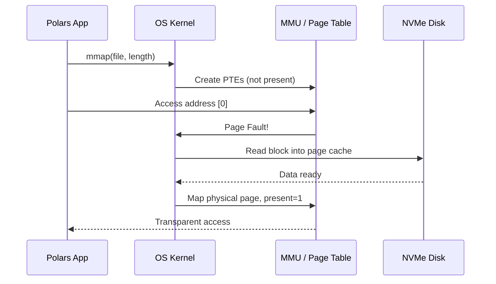
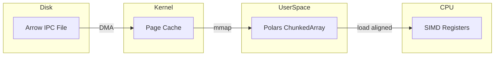

# 🦀 02 - Memory Mapping and Zero-Copy Reads

**Course type: Language/Framework (Rust)**

## 🎯 Learning Objectives
- Explain how virtual memory enables memory-mapped file I/O
- Implement zero-copy reads in Polars for Parquet and IPC formats
- Compare memory-mapped versus eager loading for large datasets
- Design ML pipelines that minimize memory duplication during feature extraction

## Introduction

Modern ML datasets often exceed the physical RAM of a single workstation. The common reflex is to reach for distributed computing, introducing network latency, serialization overhead, and operational complexity. Memory mapping is a POSIX facility that treats a file on disk as if it were already in memory, letting the OS page data in on demand and evict it under pressure. For ML engineers working with read-only training data, this means accessing terabyte-scale datasets on a laptop without explicit chunking.

Memory mapping rests on the virtual memory subsystem. Every process sees a contiguous virtual address space that the Memory Management Unit (MMU) translates to physical RAM pages via page tables. When a program accesses a virtual address with no backing physical page, the CPU raises a page fault; the OS handler locates the data on disk and maps a physical page into the address space. Crucially, the application never calls `read()`—the OS handles paging transparently.

With 64-bit address spaces offering 48-bit or 57-bit virtual addresses, a process can theoretically map exabytes of file data even if the machine only has 16GB of RAM. The OS maintains a page cache of recently accessed disk blocks, so repeated accesses to the same regions hit memory without disk I/O. For ML training with multiple epochs, the first epoch pages data from disk, and subsequent epochs read from the OS cache at RAM speed. This module extends [[01 - Lazy Evaluation and Query Optimization]] into the physical storage layer and connects to [[03 - Streaming and Out-of-Core Processing]].

---

## 1. Memory Mapping with mmap

Zero-copy takes this further by eliminating the "read buffer → deserialize → allocate array" pipeline. When Polars' Parquet reader uses Arrow's IPC format, the on-disk bytes are already in the exact layout the CPU expects. Polars validates the header and points `ChunkedArray` buffers directly at mapped pages. This is why Polars can open a 50GB file in milliseconds while Pandas exhausts memory allocating Python objects.

```rust
use polars::prelude::*;

fn mmap_parquet(path: &str) -> Result<DataFrame, PolarsError> {
    // with_memory_map(true) asks the OS to map pages instead of read+allocate
    let df = LazyParquetReader::new(path)
        .with_memory_map(true)
        .finish()?
        .select([
            col("feature_1"),
            col("feature_2"),
            col("label"),
        ])
        .collect()?; // Only touched columns are paged into RAM

    println!("DataFrame shape: {:?}", df.shape());
    Ok(df)
}
```

The critical semantic detail: `with_memory_map(true)` does not load the file—it creates a mapping. Actual disk I/O happens during `collect()`, and only for the column chunks selected by projection pushdown.

The data flow in eager loading versus memory mapping:

```text
Eager Loading:
  File on Disk: 50GB
    |
    ▼
  read() --→ Process Heap: 50GB copy
    |
    ▼
  Deserialize --→ Python Objects: 150GB (3× overhead)

Memory Mapping:
  File on Disk: 50GB
    |
    ▼
  mmap() --→ Virtual Address Space (no copy, just pointers)
    |
    ▼
  Arrow arrays point directly at mmap pages
  Physical RAM used: only accessed chunks
```

The page cache acts as a shared buffer between processes. Two Polars processes mapping the same Parquet file share the same physical RAM pages—the OS deduplicates the page cache.

```rust
use polars::prelude::*;
use std::fs::File;

fn compare_load_methods(path: &str) -> Result<(), PolarsError> {
    // Memory-mapped: fast open, lazy page-in
    let mmap_start = std::time::Instant::now();
    let mmap_df = LazyParquetReader::new(path)
        .with_memory_map(true)
        .finish()?
        .select([col("id"), col("value")])
        .collect()?;
    println!("mmap: {:?}", mmap_start.elapsed());

    // Eager: read everything into memory immediately
    let eager_start = std::time::Instant::now();
    let file = File::open(path)?;
    let eager_df = ParquetReader::new(file)
        .finish()?;
    println!("eager: {:?}", eager_start.elapsed());

    Ok(())
}
```

❌ **Antipattern**: Modifying a mapped DataFrame. Polars uses copy-on-write for safety, but a mutation triggers a full copy of the mapped data, blowing up RAM. ✅ Treat mapped frames as strictly read-only.

❌ **Antipattern**: Mapping network filesystems (NFS, SMB). Page faults on remote filesystems trigger network round-trips with unpredictable latency. ✅ Use local SSD or high-performance object storage with local caching.

> **Caso real**: Instacart's ML team trains grocery recommendation models on 200GB of historical order Parquet files. Their Pandas-based data loader required a 600GB workstation and spent 45 minutes reading and casting types on startup. With Polars memory-mapped Parquet, startup dropped to 30 seconds. Because the OS page cache retains hot data between epochs, second and third epochs loaded entirely from RAM without disk I/O. They downsized from `r5.24xlarge` to `r5.8xlarge` instances, cutting costs by 60%.

⚠️ **Mapping files larger than virtual address space**: On 32-bit systems, only 2-4GB can be mapped. Modern 64-bit systems handle exabytes. 💡 "Map it, don't move it"—memory mapping is about pointing, not copying.

⚠️ **Page cache eviction**: If your training process allocates large tensors while memory-mapping data, the OS may evict mapped pages, causing thrashing. Pin critical data with `mlock()` if needed.

The interaction between Polars, the OS kernel, and storage follows this sequence:



---

## 2. Zero-Copy Reads with Arrow IPC

Zero-copy is a systems technique that eliminates redundant copies between kernel space, user space, and application buffers. In a traditional file read, data traverses at least four buffers: disk → kernel page cache → user-space read buffer → deserialized object heap. Each copy consumes CPU cycles, pollutes cache lines, and increases memory pressure. The ideal is a single copy from disk to kernel page cache, with the application referencing those pages directly.

Apache Arrow was designed for this ideal. Its columnar format specifies the exact physical byte layout—buffer alignment (64-byte boundaries for SIMD), endianness (little-endian), and metadata (Schema, RecordBatch). Because the specification is bit-identical across implementations, a Rust program can read an Arrow IPC file written by Python and interpret the buffers without any transformation. Polars builds `ChunkedArray` structures as thin wrappers around these Arrow buffers—the "copy" step reduces to constructing pointer-length pairs.

Modern NVMe SSDs amplify zero-copy via DMA (Direct Memory Access), bypassing the CPU entirely during data transfer. When an Arrow IPC file is read from NVMe, the data path is: NVMe controller → system RAM (page cache) → process virtual address (mmap). No CPU cycles spent on copying or deserialization. This is why zero-copy Polars pipelines approach raw sequential read bandwidth, often saturating 3-7 GB/s on a single NVMe drive.

```rust
use polars::prelude::*;
use std::fs::File;

fn zero_copy_ipc(path: &str) -> Result<DataFrame, PolarsError> {
    // IPC files are Arrow-native; no parsing needed
    let file = File::open(path)?;

    let df = IpcReader::new(file)
        .memory_mapped(true)  // mmap + IPC = true zero-copy
        .finish()?;

    // Filter/selection that doesn't mutate can still reference mapped memory
    let filtered = df.lazy()
        .filter(col("score").gt(lit(0.5)))
        .collect()?;

    Ok(filtered)
}

fn write_ipc(df: &mut DataFrame, path: &str) -> Result<(), PolarsError> {
    // Writing IPC preserves the exact memory layout for future zero-copy reads
    let file = File::create(path)?;
    IpcWriter::new(file).finish(df)?;
    Ok(())
}
```

`memory_mapped(true)` on `IpcReader` is even more efficient than on Parquet because IPC requires no decompression or decoding—just pointer validation.

The Arrow IPC file layout on disk mirrors memory, enabling direct pointer referencing:

```text
 --------------------------------------------- 
|  Arrow IPC File Layout                      |
 --------------------------------------------- 
|  Magic bytes "ARROW1"                       |
|   -------------------------------------     |
|  | Schema message (flatbuffers)        |    |
|   -------------------------------------     |
|  | RecordBatch 0: metadata + buffers   |-- --→ Point directly here
|   -------------------------------------     |
|  | RecordBatch 1: metadata + buffers   |-- --→ Point directly here
|   -------------------------------------     |
|  Footer (offsets to batches)                |
|  Magic bytes "ARROW1"                       |
 --------------------------------------------- 
```

```rust
use polars::prelude::*;

fn zero_copy_pipeline(
    parquet_path: &str,
    ipc_path: &str,
) -> Result<DataFrame, PolarsError> {
    // Memory-map the Parquet source
    let features = LazyParquetReader::new(parquet_path)
        .with_memory_map(true)
        .finish()?
        .select([col("user_id"), col("feature_embedding"), col("timestamp")])
        .filter(col("timestamp").gt(lit("2024-01-01")))
        .collect()?;

    // Write to IPC to preserve Arrow layout for downstream zero-copy consumers
    let mut file = std::fs::File::create(ipc_path)?;
    IpcWriter::new(&mut file).finish(&mut features.clone())?;

    // Read back via mmap for true zero-copy access
    let mmap_file = std::fs::File::open(ipc_path)?;
    let zero_copy_df = IpcReader::new(mmap_file)
        .memory_mapped(true)
        .finish()?;

    println!("Zero-copy shape: {:?}", zero_copy_df.shape());
    Ok(zero_copy_df)
}
```

❌ **Antipattern**: Mixing compression and zero-copy. Snappy-compressed Parquet requires decompression into a new buffer, breaking zero-copy for that column. ✅ Use uncompressed Parquet or IPC for maximum benefit.

❌ **Antipattern**: Writing IPC without alignment. Arrow expects 64-byte aligned buffers for SIMD. If the writer produces misaligned data, reads fall back to scalar loops. ✅ Let Polars handle alignment—it always writes aligned IPC.

> **Caso real**: Tesla's Autopilot team processes multi-terabyte sensor logs in Parquet. By converting to Arrow IPC format and serving via memory-mapped files on a shared NVMe array, GPU workers point `ChunkedArray` buffers at mapped pages. The GPU DMAs directly from those pages into GPU memory, eliminating a bottleneck that previously limited training to 60% GPU utilization.

⚠️ **Page cache pollution from other processes**: If other processes on the machine are doing heavy I/O, they can evict your mapped pages. On shared servers, use `mlock()` or processor binding for critical data paths.

⚠️ **IPC file size limits**: Arrow IPC is designed for single-file datasets that fit within virtual address space. For truly massive datasets, combine IPC shards with lazy concatenation.

💡 **Mental shortcut**: "Arrow on disk is Arrow in memory." If you control the serialization format, always choose IPC for internal pipelines.

The data path from storage to CPU registers:



---

## 🎯 Key Takeaways
- `mmap()` creates a virtual mapping without loading data; the OS pages in on demand
- Arrow IPC on disk is identical to Arrow in memory, enabling true zero-copy reads
- Projection pushdown + memory mapping means only touched columns consume RAM
- The OS page cache automatically accelerates multi-epoch training
- NVMe + DMA + mmap + Arrow IPC can saturate 3-7 GB/s without CPU copies

## References
- [[01 - Lazy Evaluation and Query Optimization]]
- [[03 - Streaming and Out-of-Core Processing]]
- [Polars Parquet I/O docs](https://docs.pola.rs/user-guide/io/parquet/)
- [Apache Arrow Columnar Format](https://arrow.apache.org/docs/format/Columnar.html)

## 📦 Código de compresión

```rust
use polars::prelude::*;
use std::fs::File;

fn main() -> Result<(), PolarsError> {
    let features = LazyParquetReader::new("data.parquet")
        .with_memory_map(true)
        .finish()?
        .select([col("embedding"), col("label")])
        .collect()?;

    let mut file = File::create("features.ipc")?;
    IpcWriter::new(&mut file).finish(&mut features.clone())?;

    let mmap_file = File::open("features.ipc")?;
    let zero_copy = IpcReader::new(mmap_file)
        .memory_mapped(true)
        .finish()?;

    println!("Zero-copy read: {:?}", zero_copy.shape());
    Ok(())
}
```
