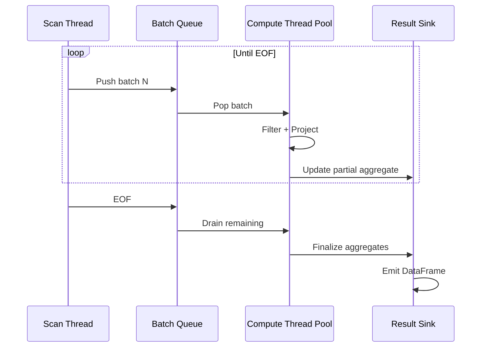
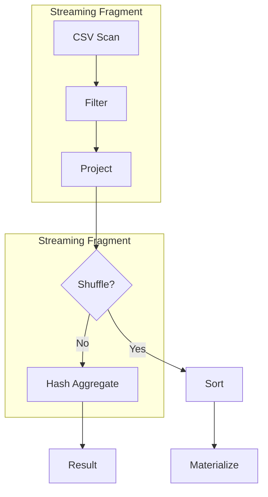
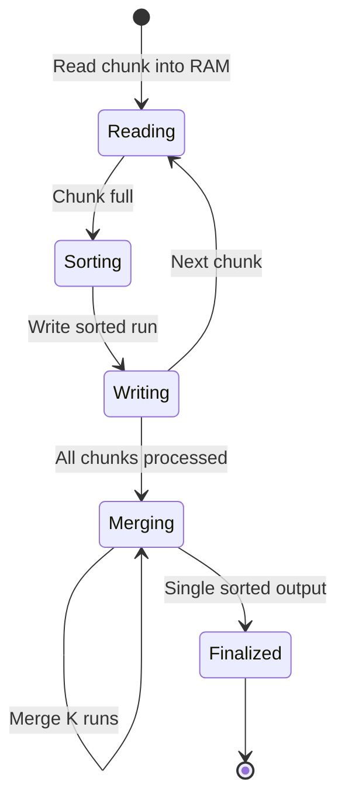

# 🌊 Streaming and Out-of-Core Processing

## 🎯 Learning Objectives
- Differentiate between in-memory, memory-mapped, and streaming execution.
- Configure Polars streaming mode for datasets larger than RAM.
- Analyze the tradeoffs between throughput and latency in streaming pipelines.
- Build fault-tolerant ETL pipelines that process out-of-core data.

---

## Introduction

The boundary between "data that fits in memory" and "data that does not" is not a cliff—it is a gradient where performance degrades as the working set exceeds cache, RAM, and eventually local disk. Most DataFrame libraries treat this boundary as a hard limit: if the data does not fit, the process crashes with an out-of-memory (OOM) error. Polars streaming execution redefines this boundary by processing data in chunks, maintaining a fixed memory ceiling regardless of input size. For ML engineers, this means you can run feature engineering on a 200GB dataset using a 16GB laptop, turning what used to require a Spark cluster into a single Rust binary. This module builds on [[01 - Lazy Evaluation and Query Optimization]] and [[02 - Memory Mapping and Zero-Copy Reads]] to show how execution strategy and storage layout combine to defeat the memory wall.

Out-of-core processing is not merely a fallback for small machines; it is a design philosophy for predictable resource usage. In production ML systems, unbounded memory growth leads to Kubernetes pod evictions, noisy-neighbor issues on shared nodes, and non-linear latency spikes. Streaming provides linear scaling: processing twice the data takes twice the time, not ten times, because the memory footprint stays constant. This predictability is why financial institutions like JPMorgan Chase use streaming DataFrame engines for regulatory reporting pipelines that must complete within strict batch windows.

---

## Module 1: Streaming Execution

### 1.1 Theoretical Foundation 🧠

Streaming execution is rooted in the theory of dataflow programming and operator pipelining, first formalized in database systems like INGRES and System R in the 1970s. The core idea is to break a query plan into operators (scan, filter, project, join, aggregate) and process data in fixed-size batches (often called "chunks" or "micro-batches") rather than loading entire relations. Each operator maintains a small amount of state—typically bounded by O(1) or O(w) where w is a window size—and passes batches downstream. This is known as the "iterator model" or "Volcano model" in database literature.

Polars adapts this model to columnar data. Instead of processing rows one at a time (tuple-at-a-time), it processes columnar chunks (vectorized). A streaming scan reads row groups from a Parquet file in batches of, say, 50,000 rows. The filter operator applies SIMD predicates to each batch. The projection operator selects column buffers by pointer arithmetic. Aggregates are more complex: a streaming `groupby` must maintain a hash table of partial aggregates. When a batch arrives, the operator updates the hash table rather than materializing all groups. This is identical to the MapReduce paradigm: map (process batches in parallel) and reduce (combine partial results). The theoretical guarantee is that memory usage is O(hash table size + batch size), which is independent of the input cardinality.

### 1.2 Mental Model 📐

Imagine a factory assembly line versus a workshop that builds one car at a time. Streaming is the assembly line.

```
┌─────────────────────────────────────────────┐
│  In-Memory Execution (Batch)                │
├─────────────────────────────────────────────┤
│  Load ALL data ──► Filter ALL ──► Agg ALL   │
│  Memory: O(N)                               │
│  Crash if N > RAM                           │
└─────────────────────────────────────────────┘
```

```
┌─────────────────────────────────────────────┐
│  Streaming Execution (Pipeline)             │
├─────────────────────────────────────────────┤
│  ┌─────┐   ┌─────┐   ┌─────┐   ┌─────┐    │
│  │Batch│──►│Batch│──►│Batch│──►│Batch│    │
│  │  1  │   │  2  │   │  3  │   │ ... │    │
│  └─────┘   └─────┘   └─────┘   └─────┘    │
│       │         │         │         │       │
│       ▼         ▼         ▼         ▼       │
│  [Scan] ──► [Filter] ──► [Project] ──►[Agg] │
│  Memory: O(batch_size + state)              │
│  Scales to any input size                   │
└─────────────────────────────────────────────┘
```

The stateful operators like groupby maintain a "running total":

```
┌─────────────────────────────────────────────┐
│  Streaming GroupBy State                    │
├─────────────────────────────────────────────┤
│  Input Batch: [A:10, B:20, A:5, C:7]        │
│       │                                     │
│       ▼                                     │
│  Hash Table:                                │
│  ┌─────┬─────────┐                          │
│  │ Key │ Partial │                          │
│  ├─────┼─────────┤                          │
│  │  A  │ sum=15  │                          │
│  │  B  │ sum=20  │                          │
│  │  C  │ sum=7   │                          │
│  └─────┴─────────┘                          │
│  Next batch updates these, no full history  │
└─────────────────────────────────────────────┘
```

### 1.3 Syntax and Semantics 📝

Enabling streaming in Polars is a single configuration flag, but understanding when it activates requires knowing the operator support matrix.

```rust
use polars::prelude::*;

fn stream_large_file(path: &str) -> Result<DataFrame, PolarsError> {
    // WHY: LazyFrame is required for streaming; eager cannot pipeline
    let result = LazyCsvReader::new(path)
        .has_header(true)
        .finish()?
        .filter(col("status").eq(lit("completed")))
        .select([
            col("user_id"),
            col("amount"),
            col("region"),
        ])
        .groupby([col("region")])
        .agg([
            col("amount").sum().alias("total_amount"),
            col("user_id").count().alias("transaction_count"),
        ])
        .with_streaming(true)  // WHY: Tells Polars to use chunked pipeline
        .collect()?;            // WHY: Streams batches through the plan

    Ok(result)
}
```

Not all operations support streaming. Sorting, for example, requires seeing all data to produce a total order, so Polars may fall back to out-of-core sorting algorithms or warn you.

### 1.4 Visual Representation 🖼️

The lifecycle of a streaming query involves coordination between scan threads and compute threads.




The operator DAG is partitioned into streaming fragments.




### 1.5 Application in ML/AI Systems 🤖

Real case: **Stripe** processes billions of payment events nightly to generate fraud detection features. Their raw event logs are CSV files totaling 300GB, far exceeding the 64GB RAM of their standard Airflow workers. By switching to Polars streaming mode, they express the feature pipeline as a lazy query with `with_streaming(true)`. The pipeline scans events in 100K-row chunks, filters to fraud-flagged transactions, projects 12 risk features, and aggregates by merchant ID into rolling 7-day windows. Memory usage stays flat at 4GB regardless of input size. The pipeline now runs on commodity hardware instead of requiring a Spark cluster, reducing infrastructure costs by 80% and cutting the batch window from 6 hours to 45 minutes.

| ML Use Case | This Concept | Impact |
|-------------|-------------|--------|
| Nightly feature backfills | Streaming groupby | Constant memory on large inputs |
| Log analysis for anomaly detection | Streaming filter + project | Process terabytes on a laptop |
| Training data generation | Streaming join + aggregate | Linear time scaling |

### 1.6 Common Pitfalls ⚠️
⚠️ **Streaming unsupported operations**: Calling `.sort()` or `.reverse()` in a streaming query may silently materialize data or error. Check the Polars streaming support matrix.

⚠️ **Too-small batches**: If the source file has tiny row groups, overhead dominates throughput. Repartition or coalesce files before streaming.

💡 **Mnemonic**: "Stream the scan, batch the math"—ensure your source is chunked (Parquet row groups, CSV blocks) for efficient streaming.

### 1.7 Knowledge Check ❓
1. Why does a streaming `groupby` require O(hash table size) memory rather than O(input size)?
2. What happens if you call `.collect()` on a streaming query that includes an unsupported operation like `.arg_sort()`?
3. Design a benchmark that measures memory stability: plot RSS over time for a 50GB file processed with and without streaming.

---

## Module 2: Out-of-Core Processing

### 2.1 Theoretical Foundation 🧠

Out-of-core processing extends streaming to handle operations that fundamentally require global state, such as sorting or distinct counting with limited memory. The theoretical basis is external memory algorithms, analyzed in the external memory model (also known as the I/O model or disk model) introduced by Aggarwal and Vitter in 1988. In this model, an algorithm has a fast memory of size M and a slow disk of unlimited size, and performance is measured in I/Os (disk block transfers). The key insight is that for large datasets, CPU cost is negligible compared to I/O cost, so algorithms should be designed to minimize disk reads and writes.

External merge sort is the canonical example. To sort N items with memory M, the algorithm first creates N/M sorted runs in memory, writes them to disk, and then repeatedly merges K runs at a time (where K is limited by M). The total I/O cost is O((N/B) log_{M/B} (N/B)) where B is the block size. Polars implements external merge sort for streaming sort operations. Similarly, out-of-core hash aggregation spills partial hash tables to disk when memory is tight, then merges them in a final pass. These algorithms are not just academic curiosities—they are the reason Polars can `sort` a 200GB file on a machine with 8GB of RAM.

### 2.2 Mental Model 📐

Think of out-of-core processing as organizing a library that is larger than your office. You can only keep one shelf of books in your office (RAM), so you sort books in batches on your desk, write the sorted batches to the hallway (disk), and then merge them.

```
┌─────────────────────────────────────────────┐
│  External Merge Sort                        │
├─────────────────────────────────────────────┤
│  Input: 100GB unsorted                      │
│  RAM: 8GB                                   │
│       │                                     │
│       ▼                                     │
│  Pass 1: Sort 8GB chunks in RAM             │
│  Write 13 sorted runs to disk               │
│       │                                     │
│       ▼                                     │
│  Pass 2: Merge 3 runs at a time             │
│  (3-way merge, 8GB buffer)                  │
│       │                                     │
│       ▼                                     │
│  Pass 3: Merge final runs                   │
│  Output: 100GB sorted file                  │
└─────────────────────────────────────────────┘
```

The spill-to-disk pattern for hash aggregation:

```
┌─────────────────────────────────────────────┐
│  Out-of-Core Hash Aggregate                 │
├─────────────────────────────────────────────┤
│  Batch 1 ──► Hash Table (fills 7GB)         │
│       │                                     │
│       ▼                                     │
│  Table full! Spill to disk partition files  │
│       │                                     │
│       ▼                                     │
│  Batch N ──► Update table / spill           │
│       │                                     │
│       ▼                                     │
│  Finalize: Merge all spill files            │
│  Combine partial results                    │
└─────────────────────────────────────────────┘
```

The memory wall and how streaming breaks through it:

```
┌─────────────────────────────────────────────┐
│  Memory vs Data Size                        │
├─────────────────────────────────────────────┤
│  Data Size ──────────────────────────────── │
│       ▲                                     │
│       │    ┌─────┐ In-Memory Crash          │
│  RAM  │    │OOM  │                          │
│       │    └─────┘                          │
│       │         \ Streaming / OOC            │
│       │          \────► Success              │
│       │                                     │
└─────────────────────────────────────────────┘
```

### 2.3 Syntax and Semantics 📝

Polars does not expose explicit external-memory API calls; instead, it falls back automatically when streaming is enabled and memory is exhausted. However, you can hint at resource limits.

```rust
use polars::prelude::*;

fn out_of_core_sort(path: &str) -> Result<DataFrame, PolarsError> {
    // WHY: Even sorting can be out-of-core if streaming is enabled
    let result = LazyCsvReader::new(path)
        .has_header(true)
        .finish()?
        .select([
            col("timestamp"),
            col("user_id"),
            col("event_value"),
        ])
        .sort("timestamp", SortOptions {
            descending: false,
            nulls_last: true,
            ..Default::default()
        })
        .with_streaming(true)  // WHY: Enables external merge sort fallback
        .collect()?;            // WHY: Spills to temp disk if needed

    Ok(result)
}
```

The semantic guarantee is best-effort: Polars attempts to keep memory bounded, but if the query contains an operation that requires full materialization, it will allocate.

### 2.4 Visual Representation 🖼️

The external merge sort algorithm proceeds in distinct phases.




A Gantt-like view of CPU and disk utilization during out-of-core processing shows the pipeline.

```mermaid
gantt
    title Out-of-Core Pipeline Timeline
    dateFormat X
    axisFormat %s
    section CPU
    Scan & Filter   : 0, 10
    Hash Aggregate  : 5, 15
    section Disk I/O
    Read Source     : 0, 8
    Spill Partitions: 10, 12
    Write Result    : 13, 15
```




### 2.5 Application in ML/AI Systems 🤖

Real case: **Uber**'s Michelangelo platform generates training datasets by joining geospatial trip records with weather and traffic feeds. A single day's data is 150GB, and the final step requires sorting by `trip_start_time` to compute time-series features. Their original Spark job handled this but suffered from shuffle skew and excessive JVM garbage collection. By prototyping the same pipeline in Polars with streaming and out-of-core sorting, they found that external merge sort on local NVMe SSDs was faster than Spark's distributed shuffle. The Polars binary used 6GB of RAM and completed in 22 minutes versus Spark's 55 minutes on a 4-node cluster. This led them to adopt Polars for all single-machine dataset generation, reserving Spark only for truly distributed computations.

| ML Use Case | This Concept | Impact |
|-------------|-------------|--------|
| Time-series dataset sorting | External merge sort | Single-machine terabyte sorting |
| Large-scale deduplication | Streaming distinct + spill | Process without cluster |
| Cross-validation fold prep | Out-of-core partition | Bounded memory for K-fold splits |

### 2.6 Common Pitfalls ⚠️
⚠️ **Temp disk space**: Out-of-core algorithms write intermediate files. Ensure your temp directory has 2-3× the input data size free.

⚠️ **Slow temp disk**: Using a network-attached temp folder for spill files turns a memory problem into a network latency problem. Use local NVMe.

💡 **Mnemonic**: "RAM is precious, disk is cheap, but latency is expensive"—profile your temp I/O.

### 2.7 Knowledge Check ❓
1. Calculate the approximate number of merge passes required to sort 1TB with 16GB RAM using 2-way merging.
2. Why does out-of-core hash aggregation partition data by hash value before spilling?
3. Compare the latency of a streaming query on SSD versus HDD. At what data size does the difference become catastrophic?

---

## 📦 Compression Code

This production example combines streaming and out-of-core processing for a robust ETL pipeline.

```rust
use polars::prelude::*;

fn robust_etl_pipeline(
    input_path: &str,
    output_path: &str,
) -> Result<(), PolarsError> {
    // WHY: Lazy + streaming is the only way to handle data >> RAM
    let processed = LazyCsvReader::new(input_path)
        .has_header(true)
        .finish()?
        .filter(col("event_type").eq(lit("purchase")))
        .select([
            col("user_id"),
            col("amount"),
            col("timestamp"),
        ])
        .with_column(
            col("timestamp").str().strptime(
                DataType::Datetime(TimeUnit::Milliseconds, None),
                "%Y-%m-%d %H:%M:%S",
                false,
                false,
                false,
                false
            ).alias("parsed_time")
        )
        .sort("parsed_time", Default::default())
        .with_streaming(true)  // WHY: Handles out-of-core sort if needed
        .collect()?;

    // WHY: Write to Parquet for efficient downstream reads
    let mut out_file = std::fs::File::create(output_path)?;
    ParquetWriter::new(&mut out_file).finish(&mut processed.clone())?;

    Ok(())
}
```

## 🎯 Documented Project

### Description
Build an out-of-core data labeling pipeline for autonomous vehicle sensor logs. The system ingests 500GB CSV files containing LiDAR point metadata, filters by geofence regions, sorts by timestamp, and exports labeled chunks for model training—all on a 32GB RAM workstation.

### Functional Requirements
1. Stream-read 500GB CSV with schema enforcement to prevent type errors.
2. Apply spatial filtering (bounding box) early in the pipeline.
3. Sort the filtered output by `timestamp` using out-of-core merge sort.
4. Partition the sorted output into 10GB Parquet files with row-group sizes optimized for random access.
5. Log memory usage and temp disk writes for operational monitoring.

### Main Components
- `LazyCsvReader` with streaming and chunk size tuning.
- Spatial filter expression using bounded latitude/longitude.
- Streaming sort operator with temp directory configuration.
- Parquet writer with configurable row group size.
- Resource monitor (memory + disk I/O logger).

### Success Metrics
- Process 500GB input with peak RSS < 20GB.
- Output latency < 2 hours on a 32GB workstation.
- Zero OOM events across 100 consecutive nightly runs.

### References
- Official docs: https://docs.pola.rs/user-guide/concepts/streaming/
- Paper/library: https://www.vldb.org/pvldb/vol16/p2090-kara.pdf
