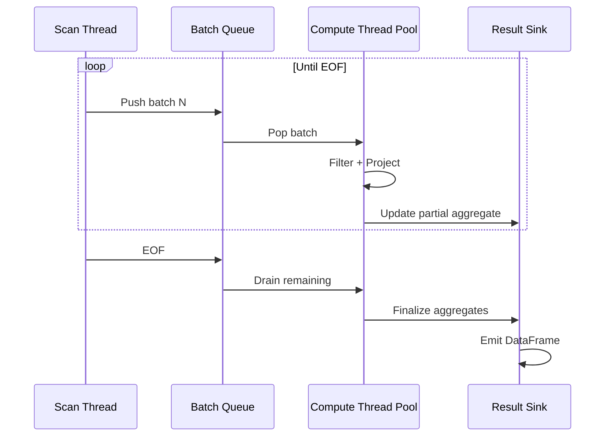
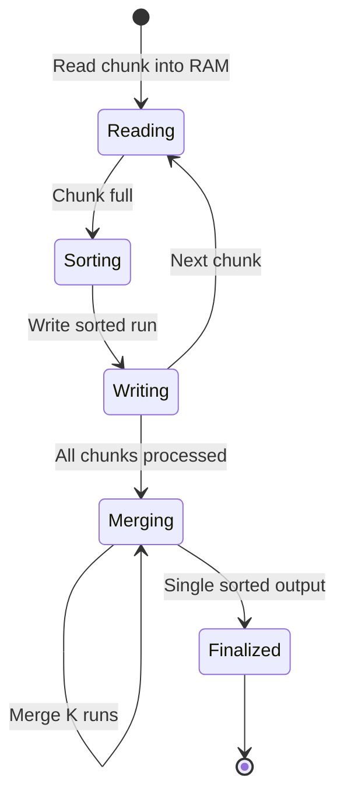

```mermaid
gantt
    title Out-of-Core Pipeline Timeline
    dateFormat X
    axisFormat %s
    section CPU
    Scan & Filter   : 0, 10
    Hash Aggregate  : 5, 15
    section Disk I/O
    Read Source     : 0, 8
    Spill Partitions: 10, 12
    Write Result    : 13, 15
```

# 🦀 03 - Streaming and Out-of-Core Processing

**Course type: Language/Framework (Rust)**

## 🎯 Learning Objectives
- Differentiate between in-memory, memory-mapped, and streaming execution
- Configure Polars streaming mode for datasets larger than RAM
- Analyze tradeoffs between throughput and latency in streaming pipelines
- Build fault-tolerant ETL pipelines that process out-of-core data

## Introduction

The boundary between "data that fits in memory" and "data that does not" is not a cliff—it is a gradient where performance degrades as the working set exceeds cache, RAM, and local disk. Most DataFrame libraries treat this as a hard limit: if data does not fit, the process crashes with OOM. Polars streaming execution redefines this boundary by processing data in chunks, maintaining a fixed memory ceiling regardless of input size. For ML engineers, this means running feature engineering on a 200GB dataset using a 16GB laptop—turning what required a Spark cluster into a single Rust binary.

Streaming execution is rooted in dataflow programming and operator pipelining, first formalized in database systems like INGRES and System R in the 1970s. The core idea: break a query plan into operators (scan, filter, project, join, aggregate) and process data in fixed-size batches (chunks, micro-batches) rather than loading entire relations. Each operator maintains bounded state—typically O(1) or O(window size)—and passes batches downstream. This is the "iterator model" or "Volcano model" in database literature.

Polars adapts this to columnar data: a streaming scan reads Parquet row groups in batches of ~50K rows, the filter applies SIMD predicates to each batch, the projection selects column buffers by pointer arithmetic. Aggregates maintain a hash table of partial aggregates, updated per batch. Memory usage is O(hash table + batch size), independent of input cardinality. This module builds on [[01 - Lazy Evaluation and Query Optimization]] and [[02 - Memory Mapping and Zero-Copy Reads]].

---

## 1. Streaming Execution

Enabling streaming in Polars is a single configuration flag, but understanding its operator support matrix is critical. Not all operators support streaming—sorting requires global state, so Polars falls back to out-of-core algorithms or warns.

```rust
use polars::prelude::*;

fn stream_large_file(path: &str) -> Result<DataFrame, PolarsError> {
    // LazyFrame is required for streaming; eager mode cannot pipeline
    let result = LazyCsvReader::new(path)
        .has_header(true)
        .finish()?
        .filter(col("status").eq(lit("completed")))
        .select([
            col("user_id"),
            col("amount"),
            col("region"),
        ])
        .groupby([col("region")])
        .agg([
            col("amount").sum().alias("total_amount"),
            col("user_id").count().alias("transaction_count"),
        ])
        .with_streaming(true)  // Tells Polars to use chunked pipeline
        .collect()?;            // Streams batches through the plan

    Ok(result)
}
```

Streaming execution pipelines data through operators without materializing intermediate results:

```text
In-Memory Execution (Batch):
  Load ALL data --→ Filter ALL --→ Agg ALL
  Memory: O(N)
  Crash if N > RAM

Streaming Execution (Pipeline):
   -----     -----     -----     ----- 
  |Batch|--→|Batch|--→|Batch|--→|Batch|
  |  1  |   |  2  |   |  3  |   | ... |
   -----     -----     -----     ----- 
      |         |         |         |
      ▼         ▼         ▼         ▼
  [Scan] --→ [Filter] --→ [Project] --→ [Agg]
  Memory: O(batch_size + state)
  Scales to any input size
```

Stateful operators like `groupby` maintain a hash table of partial aggregates. When a batch arrives, the operator updates the hash table rather than materializing all groups. This is identical to the MapReduce paradigm: map processes batches in parallel, reduce combines partial results.

```rust
use polars::prelude::*;

fn streaming_groupby_demo() -> Result<DataFrame, PolarsError> {
    let df = df!(
        "region" => &["North", "South", "North", "East", "South", "East"],
        "sales" => &[100.0, 200.0, 150.0, 300.0, 250.0, 400.0]
    )?;

    // With streaming enabled, groupby maintains partial aggregates per chunk
    let result = df.lazy()
        .groupby([col("region")])
        .agg([
            col("sales").sum().alias("total_sales"),
            col("sales").mean().alias("avg_sales"),
        ])
        .with_streaming(true)
        .collect()?;

    println!("{:?}", result);
    Ok(())
}
```

❌ **Antipattern**: Using streaming on unsupported operations. Calling `.sort()` or `.reverse()` in a streaming query may silently materialize all data or error. ✅ Check the Polars streaming support matrix. Sort with `.with_streaming(true)` triggers external merge sort.

❌ **Antipattern**: Too-small batches. If source files have tiny row groups (a few hundred rows), kernel dispatch overhead dominates throughput. ✅ Repartition or coalesce files before streaming.

> **Caso real**: Stripe processes billions of payment events nightly for fraud detection. Raw CSV logs total 300GB—far exceeding their 64GB Airflow workers. By switching to Polars streaming mode with `with_streaming(true)`, the pipeline scans events in 100K-row chunks, filters to fraud-flagged transactions, projects 12 risk features, and aggregates by merchant ID into rolling windows. Memory stays flat at 4GB regardless of input size. The pipeline now runs on commodity hardware instead of a Spark cluster, reducing costs by 80% and cutting the batch window from 6 to 0.75 hours.

⚠️ **Streaming + Python UDFs**: Using `.apply()` with Python closures forces materialization and breaks the streaming pipeline. All data must be collected in memory before the function runs.

⚠️ **Not tuning chunk size**: The default chunk size may not be optimal for your data shape and hardware. Experiment with `LazyCsvReader` chunk size options for your specific workload.

💡 **Mnemonic**: "Stream the scan, batch the math"—ensure your source is chunked (Parquet row groups, CSV blocks) for efficient streaming.

The lifecycle of a streaming query coordinates scan and compute threads:



---

## 2. Out-of-Core Processing

Out-of-core processing extends streaming to operations requiring global state—sorting, distinct counting, quantiles—when the working set exceeds memory. The theoretical basis is the external memory (I/O) model introduced by Aggarwal and Vitter in 1988. In this model, an algorithm has fast memory of size M and slow disk of unlimited size; performance is measured in I/Os (disk block transfers). For large datasets, CPU cost is negligible compared to I/O cost.

External merge sort is the canonical example. To sort N items with memory M:
1. Create N/M sorted runs in memory, write each to disk
2. Merge K runs at a time (K limited by M)
3. Repeat until one sorted output remains

Total I/O cost: O((N/B) log_{M/B}(N/B)) where B is the block size. Polars implements this for streaming sort. Similarly, out-of-core hash aggregation spills partial hash tables to disk when memory is tight, then merges them in a final pass.

```rust
use polars::prelude::*;

fn out_of_core_sort(path: &str) -> Result<DataFrame, PolarsError> {
    // Even sorting can be out-of-core with streaming enabled
    let result = LazyCsvReader::new(path)
        .has_header(true)
        .finish()?
        .select([
            col("timestamp"),
            col("user_id"),
            col("event_value"),
        ])
        .sort("timestamp", SortOptions {
            descending: false,
            nulls_last: true,
            ..Default::default()
        })
        .with_streaming(true)  // Enables external merge sort fallback
        .collect()?;            // Spills to temp disk if needed

    Ok(result)
}
```

```text
External Merge Sort:
  Input: 100GB unsorted
  RAM: 8GB
    |
    ▼
  Pass 1: Sort 8GB chunks in RAM
  Write 13 sorted runs to disk
    |
    ▼
  Pass 2: Merge 3 runs at a time (3-way merge, 8GB buffer)
    |
    ▼
  Pass 3: Merge final runs
  Output: 100GB sorted file
```

Polars does not expose explicit external-memory API calls—it falls back automatically when streaming is enabled and memory is exhausted. The semantic guarantee is best-effort: Polars attempts to keep memory bounded, but if the query contains an operation requiring full materialization (e.g., a cross join), it will allocate.

```rust
use polars::prelude::*;

fn streaming_with_limit_control(path: &str) -> Result<DataFrame, PolarsError> {
    // You can hint at resource constraints, but Polars manages the fallback
    let result = LazyCsvReader::new(path)
        .has_header(true)
        .finish()?
        .filter(col("event_type").eq(lit("purchase")))
        .select([col("user_id"), col("amount"), col("timestamp")])
        .with_column(
            col("timestamp").str().strptime(
                DataType::Datetime(TimeUnit::Milliseconds, None),
                "%Y-%m-%d %H:%M:%S",
                false, false, false, false,
            ).alias("parsed_time")
        )
        .sort("parsed_time", Default::default())
        .with_streaming(true)  // Out-of-core sort if data exceeds RAM
        .collect()?;

    Ok(result)
}
```

❌ **Antipattern**: Insufficient temp disk space. Out-of-core algorithms write intermediate files up to 2-3× the input size. ✅ Ensure your temp directory has adequate free space, ideally on a local NVMe drive.

❌ **Antipattern**: Slow temp disk. Using a network-attached temp folder for spill files turns a memory problem into a network latency problem. ✅ Use local NVMe.

> **Caso real**: Uber's Michelangelo platform generates training datasets by joining geospatial trip records with weather and traffic feeds—150GB per day, requiring a final sort by `trip_start_time` for time-series features. Their Spark job suffered shuffle skew and excessive JVM GC. Prototyping the same pipeline in Polars with streaming and out-of-core sorting showed that external merge sort on local NVMe was faster than Spark's distributed shuffle: 6GB RAM used, 22 minutes completion vs Spark's 55 minutes on a 4-node cluster. Uber adopted Polars for all single-machine dataset generation.

⚠️ **Silent fallback to in-memory**: Some operations (e.g., `.unique()` on unsorted data) may not support streaming and will silently materialize everything. Check with `.explain(true)`.

⚠️ **Temp directory cleanup**: Aborted streaming jobs may leave spill files in the temp directory. Implement cleanup in your ETL harness.

💡 **Mnemonic**: "RAM is precious, disk is cheap, but latency is expensive." Profile your temp I/O.

The external merge sort algorithm phases:





---

## 🎯 Key Takeaways
- Streaming processes data in fixed-size batches, bounding memory to O(batch + state)
- `.with_streaming(true)` enables chunked pipelines; check operator support for each operation
- Out-of-core algorithms (external merge sort, spillable hash aggregates) handle data >> RAM
- Temp disk performance is critical—use local NVMe for spill files
- Streaming is deterministic: processing 2× data takes 2× time, not 10× (no OOM cliffs)

## References
- [[01 - Lazy Evaluation and Query Optimization]]
- [[02 - Memory Mapping and Zero-Copy Reads]]
- [Polars streaming docs](https://docs.pola.rs/user-guide/concepts/streaming/)
- [Streaming in Polars (VLDB)](https://www.vldb.org/pvldb/vol16/p2090-kara.pdf)

## 📦 Código de compresión

```rust
use polars::prelude::*;

fn main() -> Result<(), PolarsError> {
    let processed = LazyCsvReader::new("transactions.csv")
        .has_header(true)
        .finish()?
        .filter(col("event_type").eq(lit("purchase")))
        .select([col("user_id"), col("amount"), col("timestamp")])
        .sort("timestamp", Default::default())
        .with_streaming(true)
        .collect()?;

    let mut out = std::fs::File::create("output.parquet")?;
    ParquetWriter::new(&mut out).finish(&mut processed.clone())?;

    println!("Streaming ETL complete: {:?}", processed.shape());
    Ok(())
}
```
