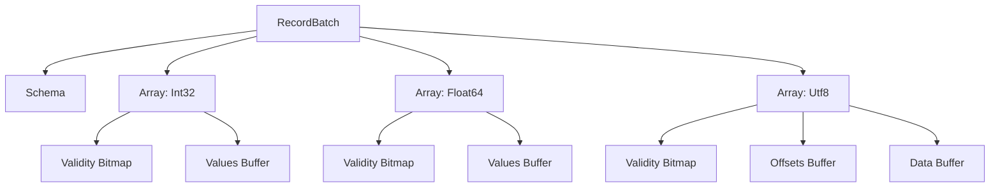
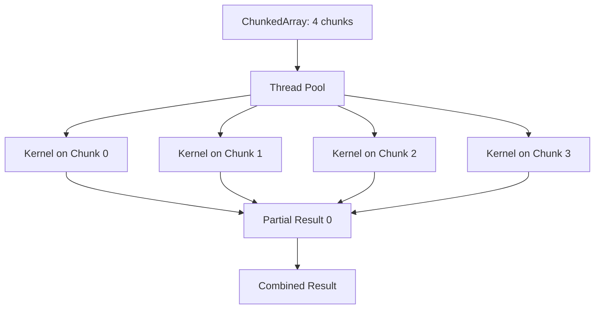

# 🦀 04 - ChunkedArrays and Arrow Internals

**Course type: Language/Framework (Rust)**

## 🎯 Learning Objectives
- Describe the Apache Arrow columnar memory format and its alignment constraints
- Explain how Polars `ChunkedArray` extends Arrow arrays for parallel processing
- Compare contiguous versus chunked storage for mutable append operations
- Optimize ML data pipelines by leveraging Arrow's zero-copy interoperability

## Introduction

Underneath every fast DataFrame library lies a memory format. Pandas sits on NumPy: contiguous C arrays of Python objects or primitive types—revolutionary in 2008, but ill-suited to modern analytics. Strings are pointers to heap-allocated objects, nulls require boolean masks, and appending a row requires reallocating the entire array. Apache Arrow, introduced in 2016, specifies a standardized, columnar, cache-friendly binary layout that is cross-language by design.

Arrow's design rests on two computer architecture truths: memory bandwidth is the bottleneck, and CPU caches love sequential access. Columnar storage combined with vectorized execution outperforms row stores by orders of magnitude on analytical workloads. SIMD instructions operate on 512 bits (16 floats or 32 ints) in one instruction, but only if data is contiguous and aligned. Row-oriented storage interleaves columns, forcing strided access that defeats SIMD prefetchers.

An Arrow array consists of a data buffer (values), a validity bitmap (nulls), and an offsets buffer (for variable-length types). All buffers are 64-byte aligned to match CPU cache lines. The null bitmap uses one bit per value, halving memory overhead compared to Pandas' object-mask approach. For strings, Arrow stores all characters contiguously in one buffer with an offsets array—vastly more cache-efficient than an array of string pointers.

Arrow is the lingua franca of the modern data stack: the wire format between Spark and Pandas (via PyArrow), the memory format in DuckDB, and the serialization layer in Ray. When a Polars DataFrame passes to a PyTorch DataLoader without copying, both sides speak Arrow. This module connects to [[02 - Memory Mapping and Zero-Copy Reads]] by revealing why zero-copy is possible, and to [[03 - Streaming and Out-of-Core Processing]] by showing how chunking enables parallel execution.

---

## 1. Apache Arrow Memory Format

Arrow formalizes the physical layout into a precise specification. An array's buffers are:

- **Validity bitmap**: 1 bit per value (0 = null, 1 = valid), padded to 64 bytes
- **Data buffer**: Contiguous typed values (e.g., `[i32; N]`), 64-byte aligned
- **Offsets buffer** (for `Utf8`, `List`): `[i32; N+1]` marking byte boundaries

Arrow also supports nested types: `List`, `Struct`, `Map`—essential for ML features like embedding vectors and JSON-like metadata. A `List<Float64>` stores child values in a single contiguous buffer with an offsets array marking list boundaries, so variable-length sequences process with the same SIMD efficiency as fixed-length primitives.

Arrow mandates little-endian byte order, eliminating byte-swap when moving between x86_64 servers, ARM laptops, and GPUs. Data produced on one machine is instantly consumable on another.

```rust
use polars::prelude::*;
use arrow::array::{Array, Int32Array};

fn inspect_arrow_buffers() -> Result<(), PolarsError> {
    // A Polars Series wraps one or more Arrow arrays
    let s = Series::new("values", &[1i32, 2, 3, 4, 5]);

    // Downcasting reveals the Arrow array type
    let arrow_array = s.i32()?
        .chunks()
        .first()
        .expect("No chunks");

    let values: &Int32Array = arrow_array
        .as_any()
        .downcast_ref::<Int32Array>()
        .unwrap();

    println!("Null count: {}", values.null_count());
    println!("Values buffer: {:?}", values.values());
    println!("Buffer alignment: 64 bytes (SIMD-ready)");
    Ok(())
}
```

The semantic model: `Series` owns a `Vec<ArrayRef>` (chunks). Each `ArrayRef` is an Arrow array. Operations on `Series` dispatch to vectorized kernels operating on these buffers.

```text
Arrow Primitive Array (Int32):
  Validity Bitmap: [1, 1, 0, 1] (1 bit/value)
  Values Buffer:   [10, 20, _, 40]
  Aligned to 64 bytes for SIMD

Arrow String Array (Utf8):
  Validity Bitmap: [1, 1, 1]
  Offsets:         [0, 5, 11, 15]
  Data Buffer:     ["HelloWorld!!!"]
  Strings are contiguous, not pointers
```

```rust
use polars::prelude::*;

fn arrow_type_checks() -> Result<(), PolarsError> {
    let df = df!(
        "integers" => &[1i32, 2, 3],
        "floats" => &[1.0f64, 2.0, 3.0],
        "strings" => &["a", "b", "c"],
    )?;

    // Each column wraps a different Arrow array type
    println!("integers dtype: {:?}", df.column("integers")?.dtype());
    println!("floats dtype: {:?}", df.column("floats")?.dtype());
    println!("strings dtype: {:?}", df.column("strings")?.dtype());
    Ok(())
}
```

❌ **Antipattern**: Assuming contiguous memory. Arrow arrays may split across chunks—kernels expecting a single slice must rechunk first, which copies data. ✅ Check `.n_chunks()` before FFI or GPU transfer.

❌ **Antipattern**: Ignoring null bitmaps. SIMD kernels have a "fast path" for arrays with no nulls—nulls add a branch penalty. ✅ Fill nulls before compute-heavy operations.

> **Caso real**: Waymo's LiDAR data preprocessing pipeline writes sensor data as Arrow IPC from C++ acquisition software. Polars reads it directly for feature extraction. The elimination of serialization/deserialization saved 40% of pipeline runtime. Because Arrow buffers are 64-byte aligned, AVX-512 instructions process 8 float64 values per cycle without any alignment checks.

⚠️ **Unsafe downcasting**: Using `.as_any().downcast_ref()` on the wrong Arrow type panics. Always verify the DataType before downcasting.

⚠️ **Buffer alignment for FFI**: When passing Arrow buffers to C libraries, ensure 64-byte alignment. Polars handles this internally, but manually constructed arrays may not.

💡 **Mnemonic**: "Align, bitmap, buffer"—check alignment, check nulls, then touch buffers.

The Arrow memory layout for nested types:



---

## 2. ChunkedArrays

Arrow arrays are immutable and fixed-length, but real pipelines require appending and parallel processing. `ChunkedArray` solves this by representing a logical column as a sequence of Arrow arrays (chunks). The theoretical benefit is twofold: immutable chunks enable lock-free parallel reads (multiple threads scan different chunks without synchronization), and appending only adds a new chunk without reallocating.

Chunking introduces fragmentation. Operations needing contiguous memory (FFI to C libraries, GPU transfer) must "rechunk"—an O(N) concatenation. Polars mitigates this with "chunked kernels" that operate on each chunk independently and combine results. For associative operations (`sum`, `min`, `max`) this is trivial: compute per chunk, reduce. For operations requiring global ordering (`sort`), Polars must rechunk or fall back to out-of-core.

Chunk size tuning is a critical performance lever. Too small (100 rows) and kernel dispatch overhead dominates. Too large and parallelization suffers. Polars targets 10K-1M rows per chunk, balancing SIMD efficiency with parallel throughput. Aligning chunk boundaries to cache lines prevents false sharing between cores.

The connection to Rust's ownership model is deep. Each chunk is an `ArrayRef` (atomically reference-counted). Slicing a DataFrame shares the same chunk buffers with adjusted offsets. Filtering references original chunk memory. Only mutations like `append` create new chunks. Copy-on-write is enforced by the borrow checker at compile time.

```rust
use polars::prelude::*;

fn chunk_operations() -> Result<(), PolarsError> {
    // Creating a Series from an iterator produces one chunk
    let s1 = Series::new("a", &[1i32, 2, 3]);
    let s2 = Series::new("a", &[4i32, 5, 6]);

    // append creates a ChunkedArray with two chunks (zero-copy)
    let mut chunked = s1.clone();
    chunked.append(&s2)?;
    println!("Chunks: {}", chunked.n_chunks());

    // rechunk merges into one contiguous array (costly copy)
    let contiguous = chunked.rechunk();
    println!("After rechunk: {}", contiguous.n_chunks());

    // Chunked operations run parallel kernels per chunk
    let sum = chunked.i32()?.into_iter().sum::<i32>();
    println!("Sum: {}", sum);
    Ok(())
}
```

The semantics of `append` are zero-copy for the input data, but the resulting `Series` has multiple chunks. `rechunk` is the escape hatch when contiguous memory is required.

```text
Single Arrow Array:
  [1, 2, 3, 4, 5, 6, 7, 8, 9, 10]
  One buffer, one owner, hard to append

ChunkedArray:
  Chunk 0: [1, 2, 3]  --→ Thread 0
  Chunk 1: [4, 5, 6]  --→ Thread 1
  Chunk 2: [7, 8, 9]  --→ Thread 2
  Chunk 3: [10]       --→ Thread 3
  Append? Just add Chunk 4.
```

```rust
use polars::prelude::*;

fn efficient_append_demo() -> Result<(), PolarsError> {
    // Simulating streaming append: each batch is a new chunk
    let mut s = Series::new("features", &[1.0f64, 2.0, 3.0]);

    for batch in vec![vec![4.0, 5.0], vec![6.0, 7.0]] {
        let chunk = Series::new("features", &batch);
        s.append(&chunk)?; // Zero-copy append
    }

    println!("Chunks after append: {}", s.n_chunks());

    // Before passing to C library or GPU, ensure contiguous memory
    let contiguous = s.rechunk();
    println!("Chunks after rechunk: {}", contiguous.n_chunks());

    // Vectorized operation runs on chunks in parallel
    let doubled = contiguous * 2.0;
    println!("Doubled: {:?}", doubled);
    Ok(())
}
```

```text
Tradeoff: Chunked vs Contiguous
  Operation       | Chunked   | Contiguous
 ----------------- ----------- -------------
  Append          | Fast      | Slow (realloc)
  Parallel Scan   | Fast      | Fast
  SIMD Kernel     | Medium    | Fast
  C FFI Pass      | Slow      | Fast
  Memory Overhead | Some md   | Minimal
```

❌ **Antipattern**: Excessive chunking. Appending thousands of tiny chunks creates metadata overhead and prevents SIMD. ✅ Coalesce chunks periodically with `.rechunk()`.

❌ **Antipattern**: Rechunking in a hot loop. Calling `.rechunk()` after every append turns O(1) append into O(N) copy. ✅ Rechunk only before FFI or GPU handoff.

> **Caso real**: Meta's AI infrastructure team uses Polars ChunkedArrays in their feature preprocessing service. Incoming feature logs arrive as micro-batches from Kafka, each appended as a new chunk. Multiple model serving threads read historical windows from the same `Series` without locks—chunks are immutable. A chunked `mean` kernel computes partial means per chunk in parallel and combines them. This sustains 1M predictions/second with sub-millisecond p99 latency. Without chunking, every Kafka append would copy the entire historical window, and concurrent reads would need read-write locks.

⚠️ **Chunk count explosion**: Over time, repeated appends can create hundreds of chunks. Schedule periodic rechunking based on a threshold (e.g., rechunk when n_chunks > 50).

⚠️ **Chunked filter semantics**: Filtering a chunked `Series` preserves chunk boundaries where possible. If all rows in a chunk match, the chunk is reused without copy. If no rows match, the chunk is dropped.

💡 **Mnemonic**: "Chunk for write, rechunk for compute." Append in chunks, rechunk before heavy kernels.

Parallel execution of chunked kernels:



---

## 🎯 Key Takeaways
- Arrow arrays have three core buffers: validity bitmap, data, offsets—all 64-byte aligned
- `ChunkedArray` enables O(1) append and lock-free parallel reads via immutable chunks
- Rechunking is O(N)—avoid it in hot loops; batch rechunk before FFI/GPU transfers
- Arrow's standardized layout enables zero-copy interop across Python, Rust, C++, and GPU
- Chunk size (10K-1M rows) balances SIMD efficiency with parallel dispatch

## References
- [[02 - Memory Mapping and Zero-Copy Reads]]
- [[03 - Streaming and Out-of-Core Processing]]
- [Polars data structures docs](https://docs.pola.rs/user-guide/concepts/data-structures/)
- [Apache Arrow Columnar Format](https://arrow.apache.org/docs/format/Columnar.html)

## 📦 Código de compresión

```rust
use polars::prelude::*;

fn main() -> Result<(), PolarsError> {
    let mut s = Series::new("features", &[1.0f64, 2.0, 3.0]);

    for batch in vec![vec![4.0, 5.0], vec![6.0, 7.0]] {
        s.append(&Series::new("features", &batch))?;
    }

    println!("Chunks: {}", s.n_chunks());

    let contiguous = s.rechunk();
    let doubled = contiguous * 2.0;
    println!("Result: {:?}", doubled);
    Ok(())
}
```
