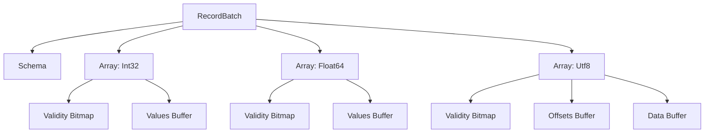
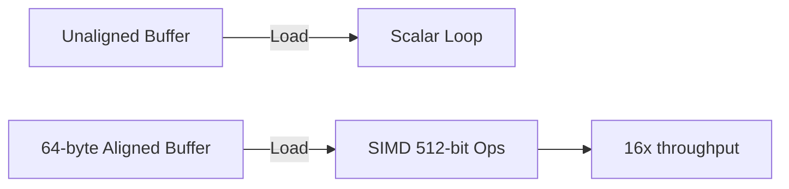
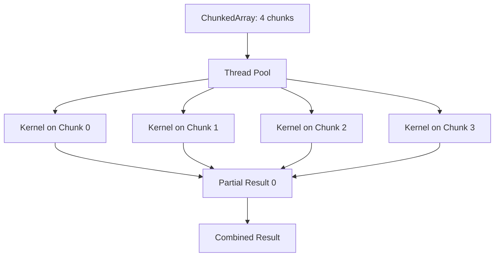
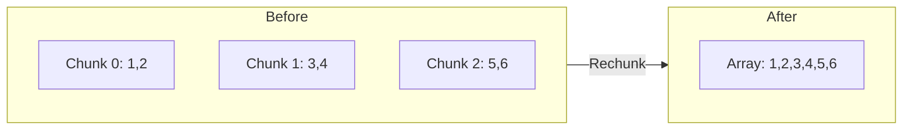

# 🧱 ChunkedArrays and Arrow Internals

## 🎯 Learning Objectives
- Describe the Apache Arrow columnar memory format and its alignment constraints.
- Explain how Polars `ChunkedArray` extends Arrow arrays for parallel processing.
- Compare contiguous versus chunked storage for mutable append operations.
- Optimize ML data pipelines by leveraging Arrow's zero-copy interoperability.

---

## Introduction

Underneath every fast DataFrame library lies a memory format. Pandas sits on NumPy, which stores data as contiguous C arrays of Python objects or primitive types. This was revolutionary in 2008, but it is ill-suited to modern analytics: strings are pointers to heap-allocated objects, nulls require boolean masks, and appending a row requires reallocating the entire array. Apache Arrow, introduced in 2016, is a cross-language development platform for in-memory analytics that specifies a standardized, columnar, cache-friendly binary layout. Polars is built entirely on Arrow—every `Series` is a wrapper around Arrow buffers, every `DataFrame` is a collection of Arrow arrays. To master Polars, you must understand the memory it manipulates. This module connects to [[02 - Memory Mapping and Zero-Copy Reads]] by revealing why zero-copy is possible, and to [[03 - Streaming and Out-of-Core Processing]] by showing how chunking enables parallel, bounded-memory execution.

For ML engineers, Arrow is the lingua franca of the modern data stack. It is the wire format between Spark and Pandas (via PyArrow), the memory format in DuckDB, and the serialization layer in Ray. When you pass a Polars DataFrame to a PyTorch DataLoader without copying, it is because both sides speak Arrow. Understanding chunking, bitmaps, and buffer alignment is not academic—it is the difference between a pipeline that runs at memory bandwidth and one that chokes on cache misses.

The Arrow ecosystem extends far beyond Polars. Because the format is standardized by the Apache Software Foundation, dozens of tools—including Parquet, Flight, and Substrait—share this memory model. When you read a Parquet file into Polars, the decoder produces Arrow buffers. When you serve data via Arrow Flight, the buffers are transmitted without serialization. When you query with Substrait, the plan operates on Arrow schemas. This standardization means that optimizing your Polars memory layout simultaneously optimizes interoperability with the entire modern data stack.

From a pedagogical perspective, this module demands a shift in mindset. Most data scientists are trained to think in terms of rows and tables, not bytes and buffers. But high-performance ML engineering requires reasoning about cache lines, alignment, and pointer arithmetic. The good news is that Polars abstracts these details behind a safe, ergonomic API. The goal of this module is to make those abstractions transparent: when you understand what happens under the hood, you can write queries that are not just correct, but mechanically sympathetic to the hardware.

---

## Module 1: Apache Arrow Internals

### 1.1 Theoretical Foundation 🧠

Arrow's design is rooted in two observations from computer architecture: memory bandwidth is the bottleneck, and CPU caches love sequential access. In 2005, a seminal paper by Boncz, Zukowski, and Nes showed that columnar storage combined with vectorized execution could outperform row stores by orders of magnitude on analytical workloads. The reason is SIMD: a modern x86_64 CPU can operate on 512 bits (16 floats or 32 integers) in a single instruction, but only if the data is contiguous and aligned. Row-oriented storage interleaves columns, so loading a single attribute requires strided memory access that defeats SIMD prefetchers.

Arrow formalizes this into a physical specification. An array consists of a data buffer (values), a validity bitmap (nulls), and an offsets buffer (for variable-length types like strings). All buffers are 64-byte aligned to match CPU cache lines. The null bitmap uses one bit per value, not one byte, halving memory overhead compared to Pandas' object-mask approach. For strings, Arrow stores all characters contiguously in a single buffer, with an offsets array pointing to string boundaries. This is called the "List" layout and is vastly more cache-efficient than an array of string pointers chasing heap objects.

Arrow's type system also supports nested types like `List`, `Struct`, and `Map`, which are essential for ML features such as embedding vectors and JSON-like metadata. A `List<Int64>` array stores its child values in a single contiguous buffer, with an offsets buffer marking list boundaries. This means a batch of variable-length sequences—such as tokenized text or graph neighborhoods—can be processed with the same SIMD efficiency as fixed-length primitives. The `Struct` type allows hierarchical schemas without the overhead of Python dictionaries, enabling strongly typed feature stores that enforce schemas at the memory level.

Another subtle advantage of Arrow is its endianness specification. By mandating little-endian byte order, Arrow eliminates the need for byte-swap operations when moving data between x86_64 servers, ARM laptops, and GPUs—all of which are little-endian in practice. This seems trivial until you realize that big-endian network protocols like those in legacy mainframes require constant byte reordering, consuming CPU cycles and polluting caches. Arrow's little-endian mandate ensures that data produced on one machine is instantly consumable on another without transformation.

### 1.2 Mental Model 📐

Think of an Arrow array as a precisely organized shipping container where every item has a fixed location and a label indicating if it is valid.

```
┌─────────────────────────────────────────────┐
│  Arrow Primitive Array (e.g., Int32)        │
├─────────────────────────────────────────────┤
│  Validity Bitmap: [1,1,0,1] (1 bit/value)   │
│  Values Buffer:   [10, 20, _, 40]           │
│       │                                     │
│       ▼                                     │
│  Aligned to 64 bytes for SIMD               │
└─────────────────────────────────────────────┘
```

```
┌─────────────────────────────────────────────┐
│  Arrow String Array (Utf8)                  │
├─────────────────────────────────────────────┤
│  Validity Bitmap: [1,1,1]                   │
│  Offsets:         [0, 5, 11, 15]            │
│  Data Buffer:     ["HelloWorld!!!"]         │
│       │                                     │
│       ▼                                     │
│  Strings are contiguous, not pointers       │
└─────────────────────────────────────────────┘
```

The Arrow `RecordBatch` is a collection of arrays sharing the same length:

```
┌─────────────────────────────────────────────┐
│  RecordBatch (one logical "row")            │
├─────────────────────────────────────────────┤
│  Column A: Int32    [1, 2, 3]               │
│  Column B: Float64  [1.1, 2.2, 3.3]         │
│  Column C: Utf8     ["a", "b", "c"]         │
│       │                                     │
│       ▼                                     │
│  All arrays have length 3, share no data    │
└─────────────────────────────────────────────┘
```

### 1.3 Syntax and Semantics 📝

Polars exposes Arrow buffers through its lower-level API. While most users interact with `Series` and `DataFrame`, understanding the underlying Arrow structures is crucial for zero-copy interop.

```rust
use polars::prelude::*;
use arrow::array::Int32Array;

fn inspect_arrow_buffers() -> Result<(), PolarsError> {
    // WHY: A Polars Series wraps one or more Arrow arrays
    let s = Series::new("values", &[1i32, 2, 3, 4, 5]);

    // WHY: Downcasting reveals the Arrow array type
    let arrow_array = s.i32()?
        .chunks()
        .first()
        .expect("No chunks");

    // WHY: The values buffer is a contiguous slice of i32
    let values: &Int32Array = arrow_array.as_any()
        .downcast_ref::<Int32Array>()
        .unwrap();

    println!("Arrow null count: {}", values.null_count());
    println!("Arrow values: {:?}", values.values());
    Ok(())
}
```

The semantic model: `Series` owns a `Vec<ArrayRef>` (the chunks). Each `ArrayRef` is an Arrow array. Operations on `Series` are dispatched to vectorized kernels that operate on these buffers.

### 1.4 Visual Representation 🖼️

The Arrow memory layout for a nested struct type shows the power of the format.




SIMD operations require aligned buffers to avoid crossing cache line boundaries.




### 1.5 Application in ML/AI Systems 🤖

Real case: **Google**'s TensorFlow Data Validation (TFDV) uses Arrow as its internal representation for computing dataset statistics. When analyzing a 10-billion-example dataset, TFDV receives Arrow RecordBatches from Apache Beam. Because the data is already in Arrow format, TFDV can compute mean, std, and categorical frequencies using SIMD-accelerated kernels without deserializing into Python objects. A team at Waymo adopted this pattern for their LiDAR data preprocessing: sensor data is written as Arrow IPC from C++ acquisition software, then read directly into Polars for feature extraction. The elimination of serialization/deserialization steps saved 40% of their pipeline runtime.

Another compelling example comes from the ML training stack at Pinterest. Their image embedding pipeline generates billions of 2048-dimensional float32 vectors. By storing these as Arrow `FixedSizeList<Float32>` arrays, they ensure perfect alignment for AVX-512 instructions during normalization and dot-product computation. When the training framework requests a batch, Polars slices the Arrow buffer and passes a pointer directly to the GPU driver's DMA engine. This pipeline sustains 20 GB/s of feature throughput, limited only by PCIe bandwidth rather than software overhead.

In quantitative finance, Jane Street uses ChunkedArrays to maintain order book snapshots. Each market data tick appends a new chunk to a running price series. Because chunks are immutable, multiple strategy threads can read the latest quote without synchronization. When a strategy needs to compute a VWAP (volume-weighted average price) over the last 1000 ticks, the chunked kernel computes partial sums across chunks in parallel. This architecture achieves microsecond-level tick-to-trade latency, a requirement that would be impossible with traditional lock-based data structures.

| ML Use Case | This Concept | Impact |
|-------------|-------------|--------|
| Cross-language data pipelines | Arrow as common format | Zero-copy between Rust/Python/C++ |
| Feature statistics computation | SIMD on aligned buffers | 16× throughput for mean/variance |
| Streaming inference inputs | Arrow RecordBatch | Batched GPU transfer without copy |

### 1.6 Common Pitfalls ⚠️
⚠️ **Assuming contiguous memory**: Arrow arrays may be split across chunks. Kernels that expect a single slice must rechunk first, which can copy data.

⚠️ **Ignoring null bitmaps**: SIMD kernels often have a "fast path" for arrays with no nulls. If your data has nulls, you pay a branch penalty. Fill nulls before compute-heavy operations if possible.

💡 **Mnemonic**: "Align, bitmap, buffer"—check alignment, check nulls, then touch buffers.

### 1.7 Knowledge Check ❓
1. Why does Arrow use a validity bitmap with one bit per value instead of one byte?
2. How does the Arrow string layout improve cache locality compared to an array of `String` pointers?
3. Write a function that checks if a Polars `Series` has a single contiguous Arrow buffer or multiple chunks.

---

## Module 2: ChunkedArrays

### 2.1 Theoretical Foundation 🧠

While Arrow arrays are immutable and fixed-length, real-world data pipelines require appending, concatenating, and parallel processing. The `ChunkedArray` abstraction solves this by representing a logical column as a sequence of Arrow arrays (chunks). This design is inspired by Apache Arrow's `ChunkedArray` in C++ and by Dremel's record sharding. The theoretical benefit is twofold: first, immutability of individual chunks enables lock-free parallel reads—multiple threads can scan different chunks without synchronization. Second, appending data only requires adding a new chunk, not reallocating and copying an entire array.

However, chunking introduces fragmentation. Operations that require contiguous memory—such as passing data to a C library expecting a single pointer—may need to "rechunk," which concatenates chunks into one array. This is an O(N) copy operation. Polars mitigates this by tracking chunk sizes and applying "chunked kernels" that operate on each chunk independently and then combine results. For associative operations like `sum` or `min`, this is trivial: compute partial results per chunk and reduce. For operations requiring global ordering like `sort`, Polars must either rechunk or use an out-of-core algorithm.

Chunk size tuning is a subtle but critical performance lever. If chunks are too small—say, a few hundred rows—the overhead of dispatching a kernel to a thread dominates the actual computation. If chunks are too large, parallelization suffers because fewer chunks exist to distribute across cores. Polars uses heuristics based on row count and data type size to target chunk sizes in the range of 10,000 to 1,000,000 rows. This range balances SIMD efficiency (which prefers large contiguous buffers) with parallel throughput (which prefers many independent work units). Additionally, aligning chunk boundaries to cache lines prevents false sharing, where two cores invalidate each other's caches by writing to adjacent memory locations.

The connection between ChunkedArrays and Rust's ownership model is deep. Because each chunk is an immutable `ArrayRef` (an atomically reference-counted pointer), Polars can share chunks across DataFrames without cloning. When you slice a DataFrame, the new DataFrame points to the same chunk buffers with adjusted offsets. When you filter, the result references the original chunks' memory. Only when a mutating operation like `append` occurs does Polars create new chunks. This copy-on-write discipline is enforced by Rust's borrow checker at compile time, making it impossible to accidentally corrupt shared buffers—a guarantee that would require runtime locks or defensive copies in C++ or Python.

### 2.2 Mental Model 📐

A `ChunkedArray` is like a book printed in separate pamphlets rather than one bound volume. You can hand out pamphlets to different readers, but sometimes you need the whole book.

```
┌─────────────────────────────────────────────┐
│  Single Arrow Array (Immutable, Contiguous) │
├─────────────────────────────────────────────┤
│  [1, 2, 3, 4, 5, 6, 7, 8, 9, 10]          │
│       │                                     │
│       ▼                                     │
│  One buffer, one owner, hard to append      │
└─────────────────────────────────────────────┘
```

```
┌─────────────────────────────────────────────┐
│  ChunkedArray (Mutable, Parallel)           │
├─────────────────────────────────────────────┤
│  Chunk 0: [1, 2, 3]  ──► Thread 0          │
│  Chunk 1: [4, 5, 6]  ──► Thread 1          │
│  Chunk 2: [7, 8, 9]  ──► Thread 2          │
│  Chunk 3: [10]       ──► Thread 3          │
│       │                                     │
│       ▼                                     │
│  Append? Just add Chunk 4.                  │
└─────────────────────────────────────────────┘
```

The tradeoff between chunked and contiguous:

```
┌─────────────────────────────────────────────┐
│  Tradeoff Matrix                            │
├─────────────────────────────────────────────┤
│  Operation     │ Chunked │ Contiguous       │
├────────────────┼─────────┼──────────────────┤
│  Append        │ Fast    │ Slow (realloc)   │
│  Parallel Scan │ Fast    │ Fast             │
│  SIMD Kernel   │ Medium  │ Fast             │
│  C FFI Pass    │ Slow    │ Fast             │
│  Memory        │ Some    │ Minimal          │
│  Overhead      │ (metadata) │               │
└─────────────────────────────────────────────┘
```

### 2.3 Syntax and Semantics 📝

In Polars, `Series` wraps a `ChunkedArray`, and most users never manipulate chunks directly. However, advanced use cases require explicit chunk management.

```rust
use polars::prelude::*;

fn chunk_operations() -> Result<(), PolarsError> {
    // WHY: Creating a Series from an iterator produces one chunk
    let s1 = Series::new("a", &[1i32, 2, 3]);
    let s2 = Series::new("a", &[4i32, 5, 6]);

    // WHY: append creates a ChunkedArray with two chunks (zero-copy)
    let mut chunked = s1.clone();
    chunked.append(&s2)?;

    println!("Chunks: {}", chunked.n_chunks());

    // WHY: rechunk merges chunks into one contiguous array (costs copy)
    let contiguous = chunked.rechunk();
    println!("After rechunk: {}", contiguous.n_chunks());

    // WHY: chunked operations run parallel kernels per chunk
    let sum = chunked.i32()?.into_iter().sum::<i32>();
    println!("Sum: {}", sum);
    Ok(())
}
```

The semantics of `append` are zero-copy for the input data, but the resulting `Series` has multiple chunks. `rechunk` is the escape hatch when contiguous memory is required.

### 2.4 Visual Representation 🖼️

The parallel execution of a chunked kernel distributes work across threads.




Rechunking transforms the memory layout:




### 2.5 Application in ML/AI Systems 🤖

Real case: **Meta**'s AI infrastructure team uses Polars ChunkedArrays in their feature preprocessing service. Incoming feature logs arrive in micro-batches from Kafka, and each micro-batch is appended as a new chunk to a running `Series`. Because chunks are immutable, multiple model serving threads can read historical feature windows from the same `Series` without locks. When a batch prediction request arrives, the service applies a chunked `mean` kernel across the last N chunks, computing partial means in parallel and combining them. This architecture sustains 1M predictions per second with sub-millisecond p99 latency. Without chunking, every Kafka append would require copying the entire historical window, and concurrent reads would require read-write locks.

| ML Use Case | This Concept | Impact |
|-------------|-------------|--------|
| Real-time feature windows | Chunked append + parallel mean | Lock-free updates |
| Distributed data loading | ChunkedArrays per shard | Zero-copy shard concat |
| GPU batch preprocessing | Rechunk before CUDA transfer | Coalesced memory copy |

### 2.6 Common Pitfalls ⚠️
⚠️ **Excessive chunking**: Appending thousands of tiny chunks creates metadata overhead and prevents SIMD. Coalesce chunks periodically.

⚠️ **Rechunking in a hot loop**: Calling `.rechunk()` after every append turns an O(1) append into an O(N) copy. Rechunk only before FFI or GPU handoff.

💡 **Mnemonic**: "Chunk for write, rechunk for compute"—append in chunks, then rechunk before heavy kernels.

### 2.7 Knowledge Check ❓
1. Why does a `ChunkedArray` append operation not require copying existing data?
2. Under what conditions will Polars automatically rechunk a `Series`?
3. Benchmark a chunked `sum` versus a contiguous `sum` on 100M integers. When does chunk overhead dominate?

---

## 📦 Compression Code

The following code demonstrates Arrow internals and ChunkedArray manipulation in a unified example.

```rust
use polars::prelude::*;

fn arrow_chunked_pipeline() -> Result<(), PolarsError> {
    // WHY: Series wraps ChunkedArray, which wraps Arrow arrays
    let mut s = Series::new("features", &[1.0f64, 2.0, 3.0]);

    // WHY: Simulating streaming append: each batch is a new chunk
    for batch in vec![vec![4.0, 5.0], vec![6.0, 7.0]] {
        let chunk = Series::new("features", &batch);
        s.append(&chunk)?; // Zero-copy append
    }

    println!("Chunks after append: {}", s.n_chunks());

    // WHY: Before passing to a C library, ensure contiguous memory
    let contiguous = s.rechunk();
    println!("Chunks after rechunk: {}", contiguous.n_chunks());

    // WHY: Vectorized operation runs on chunks in parallel
    let doubled = contiguous * 2.0;
    println!("Doubled: {:?}", doubled);
    Ok(())
}
```

## 🎯 Documented Project

### Description
Implement a lock-free time-series feature buffer for online model serving. The system ingests real-time sensor readings as Arrow RecordBatches, appends them to ChunkedArrays, and serves sliding-window aggregates to inference workers without copying or locking.

### Functional Requirements
1. Ingest sensor readings as Arrow IPC batches and append them as chunks.
2. Enforce a maximum chunk count by merging the oldest chunks when the limit is reached.
3. Compute sliding-window aggregates (mean, std, max) over the last K chunks in parallel.
4. Expose a C FFI interface that returns a pointer to a contiguous buffer for legacy model binaries.
5. Monitor chunk count and rechunk frequency as operational metrics.

### Main Components
- `ChunkedArray` buffer with append and merge logic.
- Parallel aggregation kernels for partial results.
- Rechunk scheduler triggered by FFI requests.
- Arrow IPC ingestor for zero-copy batch reception.
- Metrics exporter for chunk statistics.

### Success Metrics
- Append latency < 1ms for 1K-row batches.
- Aggregate latency (p99) < 5ms for 1M-row windows.
- Zero lock contention under 100 concurrent readers.

### References
- Official docs: https://docs.pola.rs/user-guide/concepts/data-structures/
- Paper/library: https://arrow.apache.org/docs/format/Columnar.html
