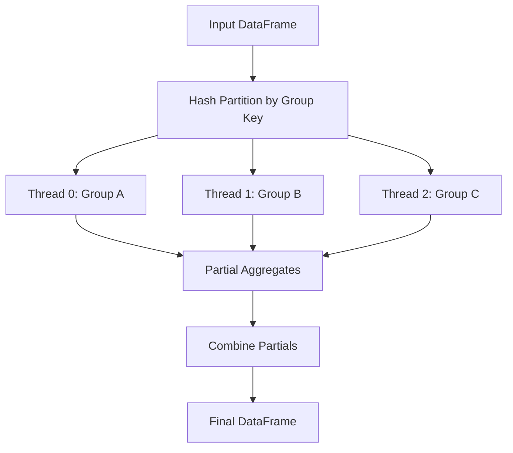
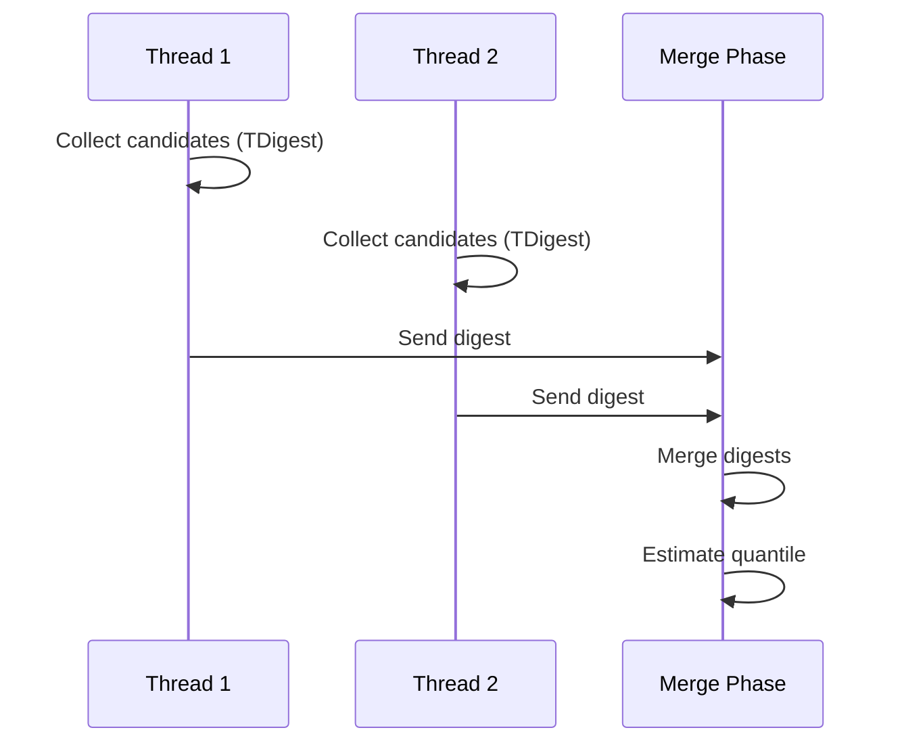
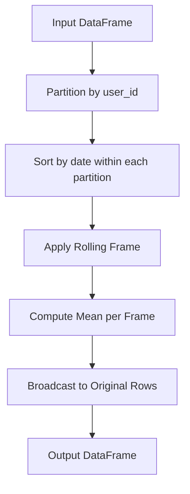
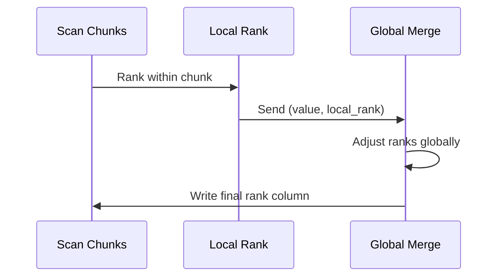

# 📊 Advanced Aggregation and Window Functions

## 🎯 Learning Objectives
- Implement complex aggregations using Polars expression DSL.
- Apply window functions for time-series and ranking features.
- Optimize grouped operations with parallel execution strategies.
- Translate SQL window semantics into Polars lazy expressions.

---

## Introduction

Aggregation is the soul of analytics: it transforms raw events into actionable signals. In ML, aggregations are not just for dashboards—they are features. The average purchase amount per user, the rolling volatility of a stock price, and the rank of a product within its category are all aggregations that feed directly into model training. Traditional DataFrame libraries treat aggregation as a simple `groupby + apply`, but this ignores the rich mathematical structure of ordered sets, partitions, and frames. Polars exposes the full power of analytic window functions, enabling expressions that would require verbose self-joins in SQL or cumbersome rolling objects in Pandas. This module connects to [[01 - Lazy Evaluation and Query Optimization]] by showing how complex aggregates are optimized, and to [[03 - Streaming and Out-of-Core Processing]] by demonstrating streaming-compatible window operations.

Window functions, also known as analytic functions in SQL standards, generalize aggregation by preserving row identity. A standard `groupby` collapses groups into single rows; a window function computes an aggregate over a group while returning the original rows. This is essential for feature engineering where you need both the raw event and its contextual statistic. For example, in a fraud model, you might want the transaction amount alongside the 7-day rolling average for that user—on every row. Without window functions, this requires an expensive join or a Python loop. With Polars expressions, it is a single, vectorized, optimizable line.

---

## Module 1: Advanced Aggregation

### 1.1 Theoretical Foundation 🧠

Aggregation in relational algebra is denoted by the gamma operator (γ), which groups a relation by a set of attributes and computes aggregate functions over each group. The theoretical complexity of aggregation is O(N) for distributive aggregates like `sum`, `min`, `max`, and `count`, because each element need only be visited once. For algebraic aggregates like `mean` and `std`, the complexity remains O(N) but requires maintaining auxiliary state (sum and sum of squares). For holistic aggregates like `median` and `quantile`, the complexity rises to O(N log N) or O(N) with approximate algorithms, because these require ordering or selection.

Polars leverages the algebraic structure of aggregates to parallelize them. A `sum` is associative and commutative: sum(A ∪ B) = sum(A) + sum(B). This means Polars can split a `ChunkedArray` across threads, compute partial sums, and reduce them with a simple addition. For `mean`, it maintains `(sum, count)` pairs per thread and reduces by dividing total sum by total count. This map-reduce pattern is fundamental to Polars' performance and is why grouped aggregations scale linearly with core count for distributive and algebraic functions. Holistic aggregates like `median` require a two-phase approach: sample to estimate quantile bounds, then scan and collect candidate values.

### 1.2 Mental Model 📐

Aggregation can be visualized as folding a list of values into a single summary statistic, with parallel folding being a tournament of partial results.

```
┌─────────────────────────────────────────────┐
│  Sequential Sum                             │
├─────────────────────────────────────────────┤
│  (((1 + 2) + 3) + 4) + 5 = 15              │
│  Single thread, one accumulator             │
└─────────────────────────────────────────────┘
```

```
┌─────────────────────────────────────────────┐
│  Parallel Sum (Map-Reduce)                  │
├─────────────────────────────────────────────┤
│  Thread 0: 1 + 2 = 3                        │
│  Thread 1: 3 + 4 = 7                        │
│  Thread 2: 5 + 0 = 5                        │
│       │                                     │
│       ▼                                     │
│  Reduce: 3 + 7 + 5 = 15                     │
│  Associative property enables parallelism   │
└─────────────────────────────────────────────┘
```

The state machine for algebraic aggregates:

```
┌─────────────────────────────────────────────┐
│  Algebraic Aggregate State (Mean)           │
├─────────────────────────────────────────────┤
│  ┌─────────┐                                │
│  │ Chunk 0 │──► (sum=10, count=2)           │
│  │ Chunk 1 │──► (sum=20, count=3)           │
│  │ Chunk 2 │──► (sum=30, count=5)           │
│  └─────────┘                                │
│       │                                     │
│       ▼                                     │
│  Combine: (sum=60, count=10) ──► mean=6     │
└─────────────────────────────────────────────┘
```

### 1.3 Syntax and Semantics 📝

Polars expressions support a rich set of aggregations that compose naturally within `groupby` and `select` contexts.

```rust
use polars::prelude::*;

fn advanced_aggregations() -> Result<DataFrame, PolarsError> {
    let df = df!(
        "category" => &["A", "A", "B", "B", "B"],
        "value" => &[10.0, 20.0, 5.0, 15.0, 25.0]
    )?;

    let result = df.lazy()
        .groupby([col("category")])
        .agg([
            col("value").sum().alias("total"),
            col("value").mean().alias("avg"),
            col("value").std(1).alias("std_dev"), // WHY: ddof=1 for sample std
            col("value").quantile(0.5, QuantileInterpolOptions::Linear)
                .alias("median"),
            col("value").count().alias("n"),
        ])
        .collect()?;

    println!("{:?}", result);
    Ok(())
}
```

The semantic distinction between `std(0)` and `std(1)` (population vs sample) is critical for statistical correctness in ML pipelines.

### 1.4 Visual Representation 🖼️

The grouped aggregation pipeline distributes groups to threads using a hash partition.




For quantile computation, Polars may use an approximate streaming algorithm.




### 1.5 Application in ML/AI Systems 🤖

Real case: **Goldman Sachs**'s transaction surveillance models aggregate millions of trades per day to detect market manipulation. Their feature pipeline computes 47 aggregate metrics per trader per day, including sum, mean, standard deviation, and 99th percentile of order sizes. Using Polars' algebraic aggregation, they parallelize these computations across 32 cores. The `std` and `mean` are computed in a single pass per chunk using Welford's online algorithm (implemented in Polars' expression kernels). The 99th percentile uses an approximate t-digest algorithm that is accurate to within 0.1% while remaining streaming-friendly. This aggregation step, which took 3 hours in their legacy SAS environment, now completes in 8 minutes.

| ML Use Case | This Concept | Impact |
|-------------|-------------|--------|
| User behavior profiling | Grouped mean/std/quantile | Rich feature vectors per entity |
| Anomaly detection | Per-group z-scores | Normalize within cohorts |
| A/B test analysis | Grouped count/sum | Fast experiment metrics |

### 1.6 Common Pitfalls ⚠️
⚠️ **Population vs sample std**: Using `std(0)` (population) on a sample dataset biases variance estimates. Always use `std(1)` for sample statistics in ML.

⚠️ **Quantile on grouped data**: Computing an exact median per group with many small groups is expensive. Consider approximate methods or pre-aggregation.

💡 **Mnemonic**: "Sum, count, then divide"—for custom algebraic aggregates, always track the components.

### 1.7 Knowledge Check ❓
1. Why is `mean` an algebraic aggregate while `median` is holistic? What state does each require?
2. Write a Polars expression that computes the coefficient of variation (`std / mean`) per group.
3. Explain why parallelizing `median` is harder than parallelizing `sum`.

---

## Module 2: Window Functions

### 2.1 Theoretical Foundation 🧠

Window functions generalize aggregation by introducing an ordering and a frame. Formally, a window function is defined over a partition P (a subset of rows sharing a key), an ordering O (a sequence of rows within the partition), and a frame F (a sliding subset of O relative to the current row). SQL:2003 standardized this as `OVER (PARTITION BY ... ORDER BY ... ROWS/RANGE BETWEEN ...)`. The theoretical power of window functions comes from their ability to express self-referential computations without explicit joins. A rolling average, for instance, is a windowed `mean` with a frame of `ROWS BETWEEN 6 PRECEDING AND CURRENT ROW` for a 7-day window.

Polars implements window functions through the `.over()` expression method, which is semantically equivalent to SQL's `OVER`. The optimizer recognizes window expressions and fuses them with the underlying scan when possible. For ordered windows like rolling averages, Polars uses specialized algorithms that maintain a running state—subtracting the exiting value and adding the entering value as the frame slides. This "differential window" algorithm reduces complexity from O(N × W) to O(N), where W is the window size. For ranking functions (`rank`, `dense_rank`, `percent_rank`), Polars uses multi-pass counting sort variants that exploit the chunk structure for parallelism.

The SQL standard distinguishes between `ROWS` and `RANGE` frames, and this distinction matters for ML feature engineering. A `ROWS` frame counts a fixed number of adjacent rows, which is simple and efficient but assumes evenly spaced data. A `RANGE` frame defines the window by value differences—for example, all rows within 7 days of the current row. Implementing `RANGE` efficiently requires an indexed or sorted structure and can introduce variable-size windows. In time-series ML, `RANGE` is often the correct semantic choice because calendar days do not map one-to-one to row counts when data is sparse. Polars supports both through its rolling options, but understanding which frame type you need prevents subtle feature leakage and misaligned labels.

Window functions also enable powerful self-supervised learning features. In natural language processing, a rolling window over token embeddings can compute local context vectors that augment transformer inputs. In recommendation systems, a windowed `count_distinct` over user actions produces diversity signals that indicate exploration versus exploitation. Because Polars window expressions are lazy and optimizable, these features can be computed on the fly during batch inference without pre-materializing massive feature tables.

A less obvious but critical aspect of window function performance is partition sparsity. If a partition contains only one row, the window aggregate is trivial but the overhead of dispatching a kernel to that partition remains. Polars mitigates this by batching small partitions and using fast paths for singleton groups. In ML datasets with heavy class imbalance—such as fraud detection where positive labels are rare—this optimization prevents the window engine from being dominated by tiny partitions.

### 2.2 Mental Model 📐

A window function is like looking out a moving train window: the landscape changes, but you always see a fixed-width view relative to your current position.

```
┌─────────────────────────────────────────────┐
│  Standard GroupBy (Collapses rows)          │
├─────────────────────────────────────────────┤
│  Input: [A:10, A:20, B:5, B:15]             │
│  GroupBy Mean: A=15, B=10                   │
│  Output: 2 rows                             │
└─────────────────────────────────────────────┘
```

```
┌─────────────────────────────────────────────┐
│  Window Function (Preserves rows)           │
├─────────────────────────────────────────────┤
│  Input: [A:10, A:20, B:5, B:15]             │
│  Mean OVER (PARTITION BY key)               │
│  Output: [A:15, A:15, B:10, B:10]           │
│  Row count unchanged, context added          │
└─────────────────────────────────────────────┘
```

The sliding frame concept:

```
┌─────────────────────────────────────────────┐
│  Rolling Window (3-period)                  │
├─────────────────────────────────────────────┤
│  Data: [10, 20, 30, 40, 50]                 │
│  Window at row 2: [10, 20, 30] ──► mean=20  │
│  Window at row 3: [20, 30, 40] ──► mean=30  │
│  Window at row 4: [30, 40, 50] ──► mean=40  │
│       │                                     │
│       ▼                                     │
│  Differential update: sum += new - old      │
└─────────────────────────────────────────────┘
```

### 2.3 Syntax and Semantics 📝

Polars window expressions use `.over()` for partitioning and `rolling_*` for ordered frames. Understanding the semantic distinction is key.

```rust
use polars::prelude::*;

fn window_features() -> Result<DataFrame, PolarsError> {
    let df = df!(
        "user_id" => &[1, 1, 1, 2, 2],
        "date" => &["2024-01-01", "2024-01-02", "2024-01-03", "2024-01-01", "2024-01-02"],
        "amount" => &[100.0, 150.0, 200.0, 50.0, 75.0]
    )?;

    let result = df.lazy()
        .with_column(
            // WHY: over() computes the per-user mean and broadcasts it to every row
            col("amount").mean().over([col("user_id")])
                .alias("user_avg_amount")
        )
        .with_column(
            // WHY: rolling_mean preserves order and applies a temporal window
            col("amount").rolling_mean(
                RollingOptionsFixedWindow {
                    window_size: 2,
                    min_periods: 1,
                    weights: None,
                    center: false,
                    ..Default::default()
                }
            ).alias("rolling_2d")
        )
        .collect()?;

    println!("{:?}", result);
    Ok(())
}
```

The semantics: `.over([col("user_id")])` is a partition-wide window, while `rolling_mean` is an order-sensitive sliding frame.

### 2.4 Visual Representation 🖼️

The execution of a window function involves partitioning, local sorting, and frame application.




Ranking functions require a different execution path:




### 2.5 Application in ML/AI Systems 🤖

Real case: **Airbnb**'s pricing recommendation model uses window functions to compute competitive positioning features. For every listing, they need the 30-day rolling average of bookings in the same neighborhood, the percentile rank of the listing's price within its property type, and the year-over-year growth rate. In their legacy Pandas pipeline, these features required multiple `groupby().apply()` calls with Python loops, taking 4 hours on a 100GB dataset. By rewriting the pipeline in Polars using `.over()` for neighborhood averages and `rolling_mean` for temporal windows, they reduced the computation to 12 minutes. The `over()` expressions were automatically parallelized per partition, and the rolling windows used the differential update algorithm to avoid O(N×W) scans.

| ML Use Case | This Concept | Impact |
|-------------|-------------|--------|
| Time-series lag features | Rolling mean/sum | O(N) sliding windows |
| Cohort normalization | over() + mean | Contextual features per group |
| Ranking features | rank().over() | Percentile within category |

### 2.6 Common Pitfalls ⚠️
⚠️ **Unordered rolling windows**: Calling `rolling_mean` without ensuring the data is sorted produces meaningless results. Always `sort` before rolling.

⚠️ **Boundary conditions**: `min_periods=1` in a rolling window produces biased estimates at the start of a series. Use `min_periods=window_size` or handle boundaries explicitly.

💡 **Mnemonic**: "Sort, then slide, then stride"—window functions demand order.

### 2.7 Knowledge Check ❓
1. What is the difference between `.over([col("key")])` and `.groupby([col("key")]).agg(...)` in terms of output shape?
2. Why does a rolling window with `center=true` require lookahead and complicate streaming execution?
3. Implement a Polars expression for a 7-day exponential moving average (EMA) using `ewm_mean`.

---

## 📦 Compression Code

This production example combines advanced aggregation and window functions for feature engineering.

```rust
use polars::prelude::*;

fn feature_engineering_pipeline() -> Result<DataFrame, PolarsError> {
    let df = df!(
        "user_id" => &[1, 1, 1, 2, 2, 2],
        "day" => &[1, 2, 3, 1, 2, 3],
        "spend" => &[10.0, 20.0, 30.0, 5.0, 15.0, 25.0]
    )?;

    let features = df.lazy()
        .sort("day", SortOptions::default())
        .with_column(
            // WHY: Per-user average spend as a contextual feature
            col("spend").mean().over([col("user_id")])
                .alias("user_avg_spend")
        )
        .with_column(
            // WHY: 2-day rolling spend captures recent trend
            col("spend").rolling_mean(
                RollingOptionsFixedWindow {
                    window_size: 2,
                    min_periods: 1,
                    weights: None,
                    center: false,
                    ..Default::default()
                }
            ).alias("rolling_spend_2d")
        )
        .with_column(
            // WHY: z-score within user for anomaly detection
            (col("spend") - col("user_avg_spend"))
                .abs()
                .over([col("user_id")])
                .alias("spend_deviation")
        )
        .collect()?;

    println!("{:?}", features);
    Ok(())
}
```

## 🎯 Documented Project

### Description
Build a real-time feature computation engine for credit risk scoring. The system must ingest transaction histories, compute rolling behavioral features (30-day avg, 90-day max, year-over-year growth), and produce ranked percentiles within demographic cohorts—all using Polars window functions and streaming aggregation.

### Functional Requirements
1. Ingest transaction CSVs and sort by `(customer_id, transaction_date)`.
2. Compute 7-day, 30-day, and 90-day rolling averages of transaction amount per customer.
3. Calculate customer lifetime value (CLV) as a grouped sum with `.over()`.
4. Rank each customer's current 30-day spend within their age and income cohort.
5. Export the feature matrix to Arrow IPC for zero-copy model consumption.

### Main Components
- `rolling_mean` with multiple window sizes.
- `over()` for partition-wide cohort features.
- `rank()` with dense ranking for percentile features.
- Streaming scan for out-of-core transaction histories.
- Arrow IPC exporter for model serving bridge.

### Success Metrics
- Feature pipeline completes 50M transactions in < 5 minutes.
- Rolling window features are deterministic (identical for same input).
- Memory usage stays below 8GB via streaming aggregation.

### References
- Official docs: https://docs.pola.rs/user-guide/transformations/aggregations/
- Paper/library: https://dl.acm.org/doi/10.1145/1376616.1376721
