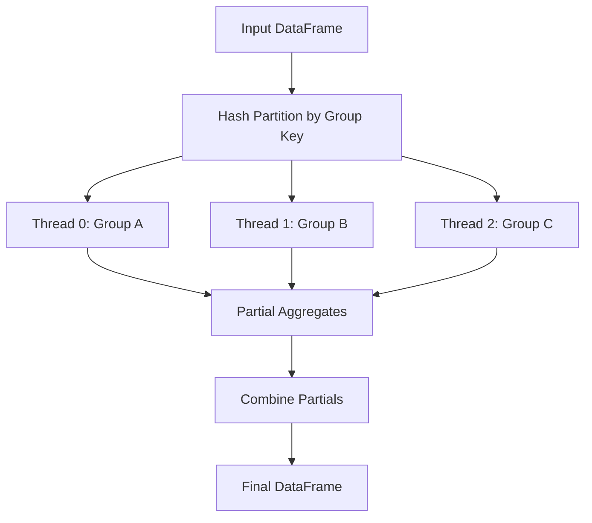
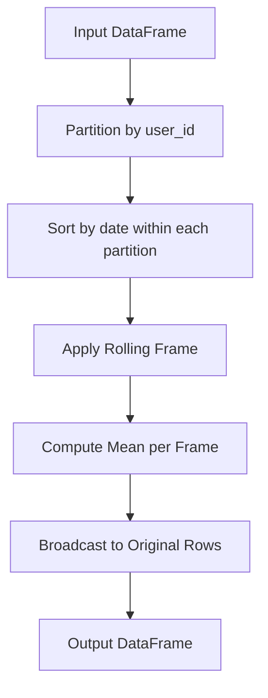

# 🦀 05 - Advanced Aggregation and Window Functions

**Course type: Language/Framework (Rust)**

## 🎯 Learning Objectives
- Implement complex aggregations using Polars expression DSL
- Apply window functions for time-series and ranking features
- Optimize grouped operations with parallel execution strategies
- Translate SQL window semantics into Polars lazy expressions

## Introduction

Aggregation is the soul of analytics—it transforms raw events into actionable signals. In ML, aggregations are features: the average purchase amount per user, the rolling volatility of a stock price, the rank of a product within its category. Traditional libraries treat aggregation as a simple `groupby + apply`, ignoring the rich mathematical structure of ordered sets, partitions, and frames. Polars exposes the full power of analytic window functions, enabling expressions that require verbose self-joins in SQL or cumbersome rolling objects in Pandas.

Aggregation in relational algebra is denoted by γ (gamma): grouping a relation by attributes and computing aggregate functions over each group. Distributive aggregates like `sum`, `min`, `max`, `count` are O(N)—each element visited once. Algebraic aggregates like `mean` and `std` are O(N) but maintain auxiliary state (sum, sum of squares). Holistic aggregates like `median` and `quantile` are O(N log N) or O(N) with approximation, requiring ordering or selection.

Polars exploits the algebraic structure for parallelism. A `sum` is associative and commutative: sum(A ∪ B) = sum(A) + sum(B). Polars splits a `ChunkedArray` across threads, computes partial sums, and reduces via addition. For `mean`, it maintains `(sum, count)` pairs per thread and divides total sum by total count. This map-reduce pattern makes grouped aggregations scale linearly with core count for distributive and algebraic functions.

Window functions (analytic functions in SQL) generalize aggregation by preserving row identity. A standard `groupby` collapses groups into single rows; a window function computes an aggregate over a group while returning the original rows. This is essential for feature engineering: a fraud model needs the transaction amount alongside its 7-day rolling average for that user—on every row. Without window functions, this requires an expensive self-join. With Polars, it is a single, vectorized, optimizable expression. This module connects to [[01 - Lazy Evaluation and Query Optimization]] and [[03 - Streaming and Out-of-Core Processing]].

---

## 1. Advanced Aggregation

Polars expressions support a rich set of aggregations that compose naturally within `groupby` and `select` contexts. The `std(0)` vs `std(1)` distinction (population vs sample) is critical for statistical correctness in ML pipelines.

```rust
use polars::prelude::*;

fn advanced_aggregations() -> Result<DataFrame, PolarsError> {
    let df = df!(
        "category" => &["A", "A", "B", "B", "B"],
        "value" => &[10.0, 20.0, 5.0, 15.0, 25.0]
    )?;

    let result = df.lazy()
        .groupby([col("category")])
        .agg([
            col("value").sum().alias("total"),
            col("value").mean().alias("avg"),
            col("value").std(1).alias("std_dev"), // ddof=1 for sample std
            col("value").quantile(0.5, QuantileInterpolOptions::Linear)
                .alias("median"),
            col("value").count().alias("n"),
        ])
        .collect()?;

    println!("{:?}", result);
    Ok(())
}
```

Parallel aggregation uses map-reduce:

```text
Sequential Sum:
  (((1 + 2) + 3) + 4) + 5 = 15
  Single thread, one accumulator

Parallel Sum (Map-Reduce):
  Thread 0: 1 + 2 = 3
  Thread 1: 3 + 4 = 7
  Thread 2: 5 + 0 = 5
    |
    ▼
  Reduce: 3 + 7 + 5 = 15
  Associative property enables parallelism
```

For quantile computation, Polars uses approximate streaming algorithms (t-digest) that are mergeable and streaming-friendly. The 99th percentile across billions of rows can be computed in bounded memory with 0.1% accuracy.

```rust
use polars::prelude::*;

fn weighted_aggregation() -> Result<DataFrame, PolarsError> {
    let df = df!(
        "group" => &["A", "A", "B", "B"],
        "value" => &[10.0, 20.0, 30.0, 40.0],
        "weight" => &[1.0, 2.0, 3.0, 4.0]
    )?;

    // Custom weighted average using expression composition
    let result = df.lazy()
        .groupby([col("group")])
        .agg([
            (col("value") * col("weight")).sum()
                .alias("weighted_sum"),
            col("weight").sum().alias("total_weight"),
        ])
        .with_column(
            (col("weighted_sum") / col("total_weight"))
                .alias("weighted_avg")
        )
        .collect()?;

    println!("{:?}", result);
    Ok(())
}
```

❌ **Antipattern**: Population vs sample std. Using `std(0)` (population) on a sample dataset biases variance estimates. ✅ Always use `std(1)` for sample statistics in ML.

❌ **Antipattern**: Computing exact median per group with many small groups. The overhead of the selection algorithm per group dominates. ✅ Use `quantile(0.5, Linear)` or approximate methods.

> **Caso real**: Goldman Sachs' transaction surveillance models compute 47 aggregate metrics per trader per day—sum, mean, std, and 99th percentile of order sizes. Using Polars' algebraic aggregation across 32 cores, `std` and `mean` are computed in one pass per chunk via Welford's online algorithm. The 99th percentile uses t-digest, accurate to 0.1% while streaming-friendly. This aggregation dropped from 3 hours in SAS to 8 minutes.

⚠️ **Integer overflow in sums**: `sum()` on a large `i32` column can overflow silently. Cast to `i64` or `f64` before aggregation on high-cardinality data.

⚠️ **Null handling**: By default, Polars ignores nulls in aggregations. If nulls should propagate (SQL-style), use `col("x").agg_null()` or handle explicitly.

💡 **Mnemonic**: "Sum, count, then divide"—for custom algebraic aggregates, always track the components.

The grouped aggregation pipeline:



---

## 2. Window Functions

Window functions are defined over a partition P, an ordering O, and a frame F. SQL:2003 standardized this as `OVER (PARTITION BY ... ORDER BY ... ROWS/RANGE BETWEEN ...)`. A rolling average is a windowed `mean` with frame `ROWS BETWEEN 6 PRECEDING AND CURRENT ROW` (7-day window).

Polars implements window functions through `.over()`, semantically equivalent to SQL's `OVER`. Ordered windows (rolling averages) use a "differential" algorithm: maintain a running sum, subtract the exiting value, add the entering value as the frame slides. This reduces complexity from O(N × W) to O(N). For ranking functions (`rank`, `dense_rank`), Polars uses multi-pass counting sort exploiting the chunk structure.

Polars supports `ROWS` and `RANGE` frames. A `ROWS` frame counts fixed adjacent rows (simple, assumes evenly spaced data). A `RANGE` frame defines the window by value differences (e.g., rows within 7 days of current row). `RANGE` requires sorted data and can produce variable-size windows. In time-series ML, `RANGE` is often the correct semantic choice because calendar days don't map to row counts when data is sparse.

```rust
use polars::prelude::*;

fn window_features() -> Result<DataFrame, PolarsError> {
    let df = df!(
        "user_id" => &[1, 1, 1, 2, 2],
        "date" => &["2024-01-01", "2024-01-02", "2024-01-03", "2024-01-01", "2024-01-02"],
        "amount" => &[100.0, 150.0, 200.0, 50.0, 75.0]
    )?;

    let result = df.lazy()
        .with_column(
            // over() computes per-user mean and broadcasts to every row
            col("amount").mean().over([col("user_id")])
                .alias("user_avg_amount")
        )
        .with_column(
            // rolling_mean preserves order, applies temporal window
            col("amount").rolling_mean(
                RollingOptionsFixedWindow {
                    window_size: 2,
                    min_periods: 1,
                    weights: None,
                    center: false,
                    ..Default::default()
                }
            ).alias("rolling_2d")
        )
        .collect()?;

    println!("{:?}", result);
    Ok(())
}
```

`over([col("user_id")])` is a partition-wide window; `rolling_mean` is an order-sensitive sliding frame.

```text
Standard GroupBy (Collapses rows):
  Input: [A:10, A:20, B:5, B:15]
  GroupBy Mean: A=15, B=10
  Output: 2 rows

Window Function (Preserves rows):
  Input: [A:10, A:20, B:5, B:15]
  Mean OVER (PARTITION BY key)
  Output: [A:15, A:15, B:10, B:10]
  Row count unchanged, context added
```

```rust
use polars::prelude::*;

fn ranking_window() -> Result<DataFrame, PolarsError> {
    let df = df!(
        "department" => &["Eng", "Eng", "Sales", "Sales", "Sales"],
        "employee" => &["Alice", "Bob", "Charlie", "Diana", "Eve"],
        "salary" => &[120000.0, 90000.0, 80000.0, 95000.0, 110000.0]
    )?;

    let result = df.lazy()
        .with_column(
            // Rank salary within each department
            col("salary").rank(RankOptions {
                method: RankMethod::Dense,
                descending: true,
            }).over([col("department")])
                .alias("dept_salary_rank")
        )
        .with_column(
            // Percentile rank within department
            col("salary").rank(RankOptions {
                method: RankMethod::Average,
                descending: false,
            }).over([col("department")])
                .alias("dept_percentile")
        )
        .collect()?;

    println!("{:?}", result);
    Ok(())
}
```

The sliding frame concept:

```text
Rolling Window (3-period):
  Data: [10, 20, 30, 40, 50]
  Window at row 2: [10, 20, 30] --→ mean=20
  Window at row 3: [20, 30, 40] --→ mean=30
  Window at row 4: [30, 40, 50] --→ mean=40
  Differential update: sum += new - old
```

❌ **Antipattern**: Unordered rolling windows. Calling `rolling_mean` without sorting produces meaningless results. ✅ Always `sort` before rolling.

❌ **Antipattern**: Boundary conditions. `min_periods=1` in a rolling window produces biased estimates at the series start. ✅ Use `min_periods=window_size` or handle boundaries explicitly.

> **Caso real**: Airbnb's pricing recommendation model computes 30-day rolling average bookings per neighborhood, percentile rank of price within property type, and year-over-year growth rate. Their Pandas pipeline used multiple `groupby().apply()` calls with Python loops—4 hours on 100GB. With Polars `.over()` for neighborhood averages and `rolling_mean` for temporal windows, the same computation takes 12 minutes. The `over()` expressions parallelize per partition, and rolling windows use the differential update algorithm.

⚠️ **Partition sparsity**: If a partition contains only one row, the window aggregate is trivial but dispatch overhead remains. Polars batches small partitions with fast paths for singleton groups.

⚠️ **Memory blowup with `.over()` on high-cardinality keys**: If the partition key has millions of unique values, each partition's aggregate must be stored. Use `groupby` + `join` as a fallback for very high cardinality.

💡 **Mnemonic**: "Sort, then slide, then stride"—window functions demand order.



---

## 🎯 Key Takeaways
- Algebraic aggregates (sum, mean, std) parallelize via map-reduce; holistic ones (median) need approximation
- `std(0)` = population, `std(1)` = sample—use `std(1)` for ML
- `.over()` broadcasts grouped aggregates to original rows without collapsing
- `rolling_mean`/`rolling_sum` use differential updates for O(N) sliding windows
- Always `.sort()` before rolling window operations

## References
- [[01 - Lazy Evaluation and Query Optimization]]
- [[03 - Streaming and Out-of-Core Processing]]
- [Polars aggregation docs](https://docs.pola.rs/user-guide/transformations/aggregations/)
- [Window functions in SQL standard](https://dl.acm.org/doi/10.1145/1376616.1376721)

## 📦 Código de compresión

```rust
use polars::prelude::*;

fn main() -> Result<(), PolarsError> {
    let df = df!(
        "user_id" => &[1, 1, 1, 2, 2, 2],
        "day" => &[1, 2, 3, 1, 2, 3],
        "spend" => &[10.0, 20.0, 30.0, 5.0, 15.0, 25.0]
    )?;

    let features = df.lazy()
        .sort("day", SortOptions::default())
        .with_column(col("spend").mean().over([col("user_id")]).alias("user_avg"))
        .with_column(
            col("spend").rolling_mean(RollingOptionsFixedWindow {
                window_size: 2, min_periods: 1,
                weights: None, center: false,
                ..Default::default()
            }).alias("rolling_2d")
        )
        .collect()?;

    println!("{:?}", features);
    Ok(())
}
```
