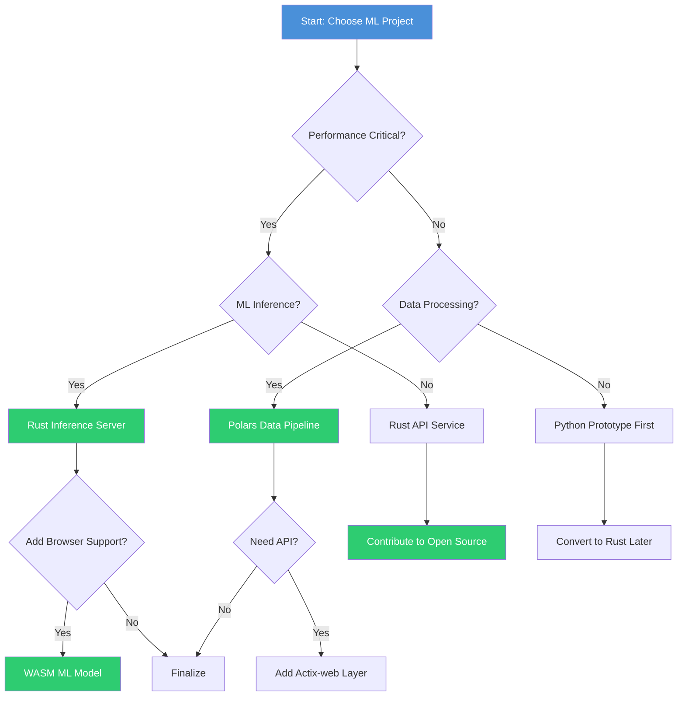

# 📋 Rust Project Planning Guide

## Overview

Strategic project planning is critical for landing your first ML/AI Engineer role. This guide provides a framework for selecting and sequencing Rust projects that demonstrate production-ready skills employers demand. A well-planned portfolio showing progressive complexity beats random projects every time.

## Prerequisites

- Basic Rust syntax (variables, functions, structs, enums)
- Understanding of Cargo and package management
- Git fundamentals
- Familiarity with ML concepts (models, inference, training)
- Command line proficiency

## Learning Objectives

- Design a cohesive 3-project portfolio that tells a story
- Evaluate when Rust is the right choice vs Go or Python
- Plan projects that solve real business problems
- Create a timeline for completing projects that impress recruiters
- Understand how each project builds on previous skills

## Official Resources & Links

| Resource | Type | URL | Why It Matters |
|----------|------|-----|----------------|
| The Rust Programming Language | Book | https://doc.rust-lang.org/book/ | The official Rust reference - start here |
| Rust by Example | Tutorial | https://doc.rust-lang.org/rust-by-example/ | Learn by studying annotated code examples |
| Cargo Documentation | Docs | https://doc.rust-lang.org/cargo/ | Master Rust's package manager and build system |
| Awesome Rust ML | Curated List | https://github.com/chaosprint/awesome-rust-ml | Discover Rust ML libraries and projects |
| Candle Framework | Library | https://github.com/huggingface/candle | Hugging Face's Rust ML framework |
| Qdrant Vector DB | Database | https://github.com/qdrant/qdrant | High-performance vector similarity search |
| GitHub Trends Rust | Analytics | https://github.com/trending/rust | See what Rust projects are popular right now |

## Architecture & Planning

### Rust Project Pyramid

Your portfolio should follow a pyramid structure:

```
          ┌─────────────────┐
          │   Flagship      │  ← 1 complex project
          │   Project       │     (MCP Agent or Full Stack)
          └────────┬────────┘
                   │
        ┌──────────┴──────────┐
        │                     │
   ┌────┴─────┐        ┌─────┴────┐
   │Supporting│        │Supporting│  ← 2 medium projects
   │ Project 1│        │ Project 2│     (Pipeline + WASM)
   └──────────┘        └──────────┘
```

### Rust vs Go vs Python Decision Matrix

| Criteria | Rust | Go | Python |
|----------|------|----|--------|
| Performance critical | ✅ Best | ✅ Good | ❌ Slow |
| Memory safety | ✅ Best | ✅ Good | ✅ GC |
| ML ecosystem | ⚠️ Growing | ❌ Limited | ✅ Best |
| Web services | ✅ Good | ✅ Best | ✅ Good |
| System programming | ✅ Best | ⚠️ Limited | ❌ Poor |
| Job market (ML) | ⚠️ Emerging | ✅ Good | ✅ Best |

**Use Rust when**: Performance matters, you need memory safety without GC, or building ML infrastructure
**Use Python when**: Exploring ML models, rapid prototyping, or leveraging PyTorch/TensorFlow directly
**Use Go when**: Building microservices, DevOps tools, or need fast compilation

### Project Selection Decision Tree



## Step-by-Step Implementation Guide

### Step 1: Audit Your Current Skills
Write down every Rust concept you know and rate your confidence (1-5). Identify gaps that projects will fill. This takes 30 minutes but saves weeks of going in the wrong direction.

### Step 2: Define Your Target Role
Find 5 job postings for ML Engineer roles. Note common requirements. Your projects should address at least 70% of recurring skills across these postings.

### Step 3: Select Flagship Project
Choose the most complex project that matches your target role. This should be the project recruiters ask about in interviews. Plan for 3-4 weeks of focused work.

### Step 4: Choose Supporting Projects
Pick 2 smaller projects that build foundational skills needed for your flagship. These should each take 1-2 weeks and demonstrate different capabilities.

### Step 5: Create Project Charters
For each project, write a one-page charter: problem statement, tech stack, success criteria, and estimated timeline. This is your contract with yourself.

### Step 6: Set Up GitHub Structure
Create repositories with professional README files from day one. Include architecture diagrams, setup instructions, and future roadmap. First impressions matter.

### Step 7: Build Iteratively
Follow the implementation guides for each project. Commit frequently with meaningful messages. Each commit should leave the project in a working state.

### Step 8: Write Tests and Benchmarks
Add unit tests and benchmarks. This shows professionalism and helps catch regressions. Use criterion for benchmarks.

### Step 9: Document as You Go
Write documentation while the code is fresh in your mind. Include examples that show the project solving real problems.

### Step 10: Review and Refine
Before declaring a project complete, review it with fresh eyes. Would you hire someone who built this? If not, keep iterating.

## Guide Class / Example

### Project Charter Template

```rust
// Project Charter: Polars Data Pipeline
// ======================================

// PROBLEM STATEMENT
// Data scientists spend 80% of time cleaning data.
// This pipeline automates ETL for ML training datasets.

// TECH STACK
// - Language: Rust (stable)
// - Core: Polars for data processing
// - I/O: Arrow/Parquet for columnar storage
// - Benchmarking: criterion
// - Testing: proptest for property testing

// SUCCESS CRITERIA
// 1. Process 10GB CSV in under 60 seconds
// 2. Memory usage stays under 2GB
// 3. Handles malformed data gracefully
// 4. 90%+ test coverage
// 5. Clear documentation with examples

// TIMELINE
// Week 1: Core pipeline with basic transforms
// Week 2: Streaming for large files
// Week 3: Benchmarks and optimization
// Week 4: Documentation and portfolio prep

// RISKS AND MITIGATIONS
// Risk: Polars API changes frequently
// Mitigation: Pin version, test against upgrades
//
// Risk: Complex transformations hard to express
// Mitigation: Start simple, add complexity gradually

fn main() {
    println!("Project: Polars Data Pipeline");
    println!("Status: Charter Complete");
    println!("Ready to begin implementation");
}
```

### Portfolio Repository Structure

```
rust-ml-portfolio/
├── README.md                    # Portfolio overview
├── PROJECTS.md                  # Project descriptions
├── 01-polars-pipeline/          # Supporting project
│   ├── README.md
│   ├── src/
│   ├── tests/
│   └── benchmarks/
├── 02-wasm-inference/           # Supporting project
│   ├── README.md
│   ├── src/
│   ├── www/
│   └── tests/
├── 03-mcp-agent/                # Flagship project
│   ├── README.md
│   ├── src/
│   ├── tests/
│   └── docs/
└── docs/                        # Portfolio documentation
    ├── architecture.md
    └── lessons-learned.md
```

## Common Pitfalls & Checklist

### ⚠️ Common Mistakes

1. **Over-scoping your first project**: Start with a minimal viable project and expand. You can always add features but can't easily remove complexity.

2. **Ignoring test coverage**: Employers notice when projects have no tests. Aim for 80%+ coverage on critical paths.

3. **Skipping documentation**: Code that isn't documented might as well not exist for portfolio purposes.

4. **Using outdated dependencies**: Rust evolves quickly. Pin versions but check for updates monthly.

5. **Not deploying anything**: A project that only runs locally is less impressive than one accessible via URL.

### ✅ Pre-Launch Checklist

| Category | Task | Status |
|----------|------|--------|
| Code | All tests pass | ☐ |
| Code | Clippy warnings resolved | ☐ |
| Code | Formatted with rustfmt | ☐ |
| Docs | README with setup instructions | ☐ |
| Docs | Architecture diagram | ☐ |
| Docs | Usage examples | ☐ |
| GitHub | Professional commit history | ☐ |
| GitHub | Clear repository description | ☐ |
| Performance | Benchmarks recorded | ☐ |
| Performance | Memory profiled | ☐ |
| Deployment | CI/CD configured | ☐ |
| Deployment | Accessible (if applicable) | ☐ |

## Deployment & Portfolio Integration

### GitHub Portfolio Setup

1. Create a profile README at `github.com/yourusername/yourusername`
2. Pin your 3 best repositories
3. Add a clear summary of your Rust ML expertise
4. Include links to live demos if available

### Project Presentation for Recruiters

Each project README should include:
- **Problem**: What real-world issue does this solve?
- **Solution**: How does your approach work?
- **Results**: Performance numbers, benchmarks, metrics
- **Tech**: Why did you choose these technologies?
- **Learnings**: What did you discover building this?

### LinkedIn Integration

- Post about each project completion
- Share key learnings and insights
- Use hashtags: #RustLang #MachineLearning #DataEngineering
- Tag relevant companies if you used their tools

## Next Steps

1. Read [[01 - Polars Data Pipeline Project]] to build your first supporting project
2. After completing that, move to [[02 - Rust Inference Server with PyO3]]
3. Then tackle [[03 - WASM ML Model in the Browser]] for frontend skills
4. Build credibility with [[04 - Contributing to Ruff or Polars]]
5. Finally, complete your flagship with [[05 - Building an MCP Agent in Rust]]
