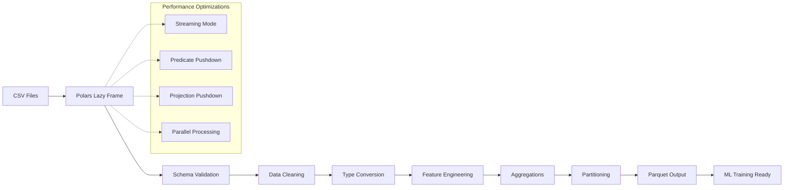

# 🏎️ Polars Data Pipeline Project

## Overview

Data engineering is the foundation of every ML system. This project builds a production-ready ETL pipeline using Polars, Rust's fastest DataFrame library. You'll process millions of rows faster than Python while demonstrating skills that directly translate to ML feature engineering, data cleaning, and training dataset preparation.

## Prerequisites

- Completed [[00 - Rust Project Planning Guide]]
- Rust installed (rustup)
- Basic understanding of CSV, Parquet, and data formats
- Familiarity with data transformation concepts (filter, map, aggregate)
- Git for version control

## Learning Objectives

- Master Polars lazy evaluation for optimal query planning
- Implement streaming processing for files larger than memory
- Create columnar Parquet output optimized for ML workloads
- Build reusable data transformation pipelines
- Benchmark Rust data processing against Python pandas

## Official Resources & Links

| Resource | Type | URL | Why It Matters |
|----------|------|-----|----------------|
| Polars User Guide | Documentation | https://pola.rs/user-guide/ | Comprehensive guide to Polars API and concepts |
| Polars API Reference | Reference | https://pola.rs/pydocs/ | Detailed API for every Polars function |
| Apache Arrow | Specification | https://arrow.apache.org/ | Columnar memory format that powers Polars |
| Parquet Format | Specification | https://parquet.apache.org/documentation/latest/ | Columnar storage format for big data |
| Criterion.rs | Benchmarking | https://github.com/bheisler/criterion.rs | Statistical benchmarking for Rust |
| Polars GitHub | Source Code | https://github.com/pola-rs/polars | Study how Polars is implemented |
| DataFusion | Query Engine | https://github.com/apache/arrow-datafusion | Related Apache Arrow query engine |

## Architecture & Planning

### ETL Pipeline Architecture



### Key Design Decisions

1. **Lazy vs Eager**: Always use lazy evaluation for production pipelines. It allows Polars to optimize the entire query plan before execution.

2. **Streaming for Large Files**: When files exceed memory, enable streaming mode. This processes data in chunks.

3. **Parquet over CSV**: Parquet is 10-100x faster for columnar reads, which is how ML models consume data.

4. **Error Handling**: Use Result types everywhere. Bad data should never silently corrupt your pipeline.

## Step-by-Step Implementation Guide

### Step 1: Project Setup
Create a new Rust project with necessary dependencies.

```bash
cargo new rust-data-pipeline
cd rust-data-pipeline
```

Add to `Cargo.toml`:
```toml
[dependencies]
polars = { version = "0.42", features = ["lazy", "streaming", "parquet", "csv"] }
anyhow = "1.0"
clap = { version = "4.0", features = ["derive"] }
indicatif = "0.17"
log = "0.4"
env_logger = "0.10"

[dev-dependencies]
criterion = "0.5"
tempfile = "3.8"
```

### Step 2: Define Data Schema
Create a schema module that defines expected input and output formats.

```rust
// src/schema.rs
use polars::prelude::*;

pub fn input_schema() -> Schema {
    Schema::from_iter([
        Field::new("id", DataType::UInt64),
        Field::new("timestamp", DataType::Utf8),
        Field::new("user_id", DataType::Utf8),
        Field::new("value", DataType::Float64),
        Field::new("category", DataType::Utf8),
    ])
}

pub fn output_schema() -> Schema {
    Schema::from_iter([
        Field::new("user_id", DataType::Utf8),
        Field::new("category", DataType::Utf8),
        Field::new("value_sum", DataType::Float64),
        Field::new("value_mean", DataType::Float64),
        Field::new("value_count", DataType::UInt32),
        Field::new("window_start", DataType::Utf8),
        Field::new("window_end", DataType::Utf8),
    ])
}
```

### Step 3: Build Core Pipeline
Implement the transformation functions.

```rust
// src/pipeline.rs
use polars::prelude::*;
use anyhow::Result;

pub fn clean_data(df: LazyFrame) -> LazyFrame {
    df
        // Remove null values
        .filter(col("value").is_not_null())
        .filter(col("user_id").is_not_null())
        
        // Remove outliers (beyond 3 standard deviations)
        .with_column(
            col("value")
                .mean()
                .alias("mean_value")
        )
        .with_column(
            col("value")
                .std(1)
                .alias("std_value")
        )
        .filter(
            col("value").gt(col("mean_value") - lit(3.0) * col("std_value"))
            & col("value").lt(col("mean_value") + lit(3.0) * col("std_value"))
        )
        .drop(["mean_value", "std_value"])
}

pub fn feature_engineering(df: LazyFrame) -> LazyFrame {
    df
        // Extract time features
        .with_column(
            col("timestamp")
                .str()..strptime(StrptimeOptions::default())
                .dt().hour()
                .alias("hour")
        )
        .with_column(
            col("timestamp")
                .str().strtotime(StrptimeOptions::default())
                .dt().weekday()
                .alias("weekday")
        )
        
        // Log transform skewed values
        .with_column(
            (col("value").abs().log1p() * col("value").sign())
            .alias("value_log")
        )
}

pub fn aggregate_features(df: LazyFrame) -> LazyFrame {
    df
        .group_by([col("user_id"), col("category")])
        .agg([
            col("value").sum().alias("value_sum"),
            col("value").mean().alias("value_mean"),
            col("value").std(1).alias("value_std"),
            col("value").count().alias("value_count"),
            col("value").min().alias("value_min"),
            col("value").max().alias("value_max"),
            col("hour").mode().first().alias("mode_hour"),
        ])
}
```

### Step 4: Implement Streaming Support
Add streaming for files larger than memory.

```rust
// src/streaming.rs
use polars::prelude::*;
use anyhow::Result;
use indicatif::{ProgressBar, ProgressStyle};
use std::fs::File;

pub fn process_large_file(
    input_path: &str,
    output_path: &str,
    chunk_size: usize,
) -> Result<()> {
    let pb = ProgressBar::new_spinner();
    pb.set_style(
        ProgressStyle::default_spinner()
            .template("{spinner} Processing: {msg}")?
    );
    
    // Use streaming lazy frame
    let lf = LazyCsvReader::new(input_path)
        .with_infer_schema(Some(1000))
        .with_batch_size(chunk_size)
        .finish()?
        .filter(col("value").is_not_null())
        .select([
            col("user_id"),
            col("category"),
            col("value"),
        ]);
    
    pb.set_message("Optimizing query plan...");
    
    // Execute with streaming
    let mut df = lf.collect()
        .map_err(|e| anyhow::anyhow!("Collection failed: {}", e))?;
    
    pb.set_message("Writing Parquet...");
    
    // Write to Parquet
    let mut file = File::create(output_path)?;
    ParquetWriter::new(&mut file)
        .with_statistics(true)
        .finish(&mut df)?;
    
    pb.finish_with_message("Complete!");
    println!("Processed {} rows", df.height());
    
    Ok(())
}
```

### Step 5: Add CLI Interface
Create a command-line interface for running the pipeline.

```rust
// src/main.rs
mod schema;
mod pipeline;
mod streaming;

use clap::Parser;
use anyhow::Result;
use std::path::PathBuf;

#[derive(Parser)]
#[command(name = "rust-data-pipeline")]
#[command(about = "High-performance ETL pipeline for ML data", long_about = None)]
struct Args {
    /// Input CSV file path
    #[arg(short, long)]
    input: PathBuf,
    
    /// Output Parquet file path
    #[arg(short, long)]
    output: PathBuf,
    
    /// Enable streaming mode for large files
    #[arg(short, long, default_value_t = false)]
    streaming: bool,
    
    /// Chunk size for streaming (rows)
    #[arg(short, long, default_value_t = 100_000)]
    chunk_size: usize,
    
    /// Verbose output
    #[arg(short, long, default_value_t = false)]
    verbose: bool,
}

fn main() -> Result<()> {
    if Args::parse().verbose {
        env_logger::init();
    }
    
    let args = Args::parse();
    
    println!("🚀 Rust Data Pipeline");
    println!("=====================");
    println!("Input:  {:?}", args.input);
    println!("Output: {:?}", args.output);
    println!("Mode:   {}", if args.streaming { "Streaming" } else { "Standard" });
    println!();
    
    if args.streaming {
        streaming::process_large_file(
            args.input.to_str().unwrap(),
            args.output.to_str().unwrap(),
            args.chunk_size,
        )?;
    } else {
        // Standard pipeline
        let lf = LazyCsvReader::new(args.input.to_str().unwrap())
            .finish()?;
        
        let df = pipeline::clean_data(lf)
            .pipe(pipeline::feature_engineering)
            .pipe(pipeline::aggregate_features)
            .collect()?;
        
        let mut file = std::fs::File::create(&args.output)?;
        ParquetWriter::new(&mut file)
            .finish(&mut df.clone())?;
        
        println!("✅ Processed {} records", df.height());
    }
    
    Ok(())
}
```

### Step 6: Write Tests
Add comprehensive tests for each pipeline stage.

```rust
// tests/pipeline_tests.rs
use polars::prelude::*;
use rust_data_pipeline::pipeline;

#[test]
fn test_clean_data_removes_nulls() {
    let df = df! [
        "id" => [1u32, 2, 3, 4],
        "value" => [Some(1.0), None, Some(3.0), Some(4.0)],
    ].unwrap();
    
    let lf = df.lazy();
    let cleaned = pipeline::clean_data(lf).collect().unwrap();
    
    assert_eq!(cleaned.height(), 3);
}

#[test]
fn test_feature_engineering_creates_time_features() {
    let df = df! [
        "timestamp" => ["2024-01-15 14:30:00", "2024-01-15 22:45:00"],
        "value" => [1.0, 2.0],
    ].unwrap();
    
    let lf = df.lazy();
    let result = pipeline::feature_engineering(lf).collect().unwrap();
    
    assert!(result.column("hour").is_ok());
    assert!(result.column("weekday").is_ok());
    assert!(result.column("value_log").is_ok());
}
```

### Step 7: Add Benchmarks
Create benchmarks to measure performance.

```rust
// benches/pipeline_bench.rs
use criterion::{criterion_group, criterion_main, Criterion};
use polars::prelude::*;

fn bench_pipeline(c: &mut Criterion) {
    // Create test data
    let df = df! [
        "id" => (0..100_000u32).collect::<Vec<_>>(),
        "value" => (0..100_000).map(|i| i as f64 * 0.1).collect::<Vec<_>>(),
        "category" => (0..100_000).map(|i| format!("cat_{}", i % 10)).collect::<Vec<_>>(),
    ].unwrap();
    
    c.bench_function("clean_data_100k", |b| {
        b.iter(|| {
            rust_data_pipeline::pipeline::clean_data(df.clone().lazy())
                .collect()
                .unwrap()
        })
    });
}

criterion_group!(benches, bench_pipeline);
criterion_main!(benches);
```

### Step 8: Add Progress Indicators
Show users that processing is happening.

```rust
// src/progress.rs
use indicatif::{ProgressBar, ProgressStyle};
use std::time::Duration;

pub fn create_spinner(message: &str) -> ProgressBar {
    let pb = ProgressBar::new_spinner();
    pb.set_style(
        ProgressStyle::default_spinner()
            .tick_strings(&["⣾", "⣽", "⣻", "⢿", "⡿", "⣟", "⣯", "⣷"])
            .template("{spinner} {msg}")
            .unwrap()
    );
    pb.enable_steady_tick(Duration::from_millis(100));
    pb.set_message(message.to_string());
    pb
}

pub fn create_bar(total: u64, message: &str) -> ProgressBar {
    let pb = ProgressBar::new(total);
    pb.set_style(
        ProgressStyle::default_bar()
            .template("{spinner} [{elapsed_precise}] [{bar:40.cyan/blue}] {pos}/{len} {msg}")
            .unwrap()
            .progress_chars("=> "),
    );
    pb.set_message(message.to_string());
    pb
}
```

### Step 9: Configuration Support
Add YAML configuration for pipeline settings.

```toml
# Add to Cargo.toml
serde = { version = "1.0", features = ["derive"] }
serde_yaml = "0.9"
```

```rust
// src/config.rs
use serde::Deserialize;
use std::path::PathBuf;

#[derive(Debug, Deserialize, Clone)]
pub struct PipelineConfig {
    pub input: PathBuf,
    pub output: PathBuf,
    pub streaming: bool,
    pub chunk_size: usize,
    pub filters: Vec<FilterConfig>,
    pub aggregations: Vec<AggConfig>,
}

#[derive(Debug, Deserialize, Clone)]
pub struct FilterConfig {
    pub column: String,
    pub operation: String,
    pub value: Option<f64>,
}

#[derive(Debug, Deserialize, Clone)]
pub struct AggConfig {
    pub column: String,
    pub operation: String,
}

impl PipelineConfig {
    pub fn load(path: &str) -> Result<Self, Box<dyn std::error::Error>> {
        let content = std::fs::read_to_string(path)?;
        let config: PipelineConfig = serde_yaml::from_str(&content)?;
        Ok(config)
    }
}
```

## Guide Class / Example

### Complete Working Pipeline

```rust
// src/main.rs - Complete Version
use polars::prelude::*;
use std::time::Instant;
use anyhow::Result;

fn main() -> Result<()> {
    println!("🏎️ Polars Data Pipeline");
    println!("======================\n");
    
    let start = Instant::now();
    
    // 1. Load data lazily (optimization happens here)
    let lf = LazyCsvReader::new("data/input.csv")
        .with_infer_schema(Some(1000))
        .with_low_memory(true)
        .finish()?;
    
    // 2. Define transformations (not executed yet)
    let processed = lf
        // Clean
        .filter(col("value").is_not_null())
        .filter(col("value").gt(0))
        
        // Transform
        .with_column(
            (col("value").log1p()).alias("log_value")
        )
        .with_column(
            col("value").cum_sum(false).alias("cumulative")
        )
        
        // Aggregate
        .group_by([col("category")])
        .agg([
            col("value").sum().alias("total"),
            col("value").mean().alias("average"),
            col("value").std(1).alias("std_dev"),
            col("value").count().alias("count"),
            col("value").quantile(0.5, QuantileInterpolOptions::Nearest)
                .alias("median"),
        ])
        
        // Sort results
        .sort("total", Default::default());
    
    // 3. Execute and collect
    let result = processed.collect()?;
    
    // 4. Display results
    println!("{}", result);
    println!("\n✅ Processed in {:?}", start.elapsed());
    
    // 5. Write to Parquet
    let mut file = std::fs::File::create("data/output.parquet")?;
    ParquetWriter::new(&mut file)
        .with_compression(ParquetCompression::Snappy)
        .with_statistics(true)
        .finish(&mut result.clone())?;
    
    println!("📁 Saved to data/output.parquet");
    
    Ok(())
}

// Run with: cargo run --release
// Benchmark with: cargo bench
```

### Example Config File

```yaml
# config.yaml
input: data/raw/sales_2024.csv
output: data/processed/features.parquet
streaming: true
chunk_size: 50000

filters:
  - column: value
    operation: gt
    value: 0
  - column: value
    operation: lt
    value: 1000000

aggregations:
  - column: value
    operation: sum
  - column: value
    operation: mean
  - column: value
    operation: count
```

## Common Pitfalls & Checklist

### ⚠️ Common Mistakes

1. **Using eager evaluation for large datasets**: Always start with `.lazy()` and only collect when necessary. Eager evaluation forces immediate computation and loads everything into memory.

2. **Not using streaming for large files**: If your data exceeds RAM, enable `.with_streaming(true)` or use the streaming API. Without it, your pipeline will crash.

3. **Writing CSV instead of Parquet**: CSV is human-readable but terrible for ML pipelines. Parquet is 10-100x faster to read and uses less storage.

4. **Ignoring schema inference errors**: Always validate your schema early. Silently converting types leads to subtle data bugs.

5. **Not using `#[cfg(test)]` for test-only code**: Conditional compilation keeps test utilities out of production binaries.

### ✅ Checklist

| Task | Status | Notes |
|------|--------|-------|
| Project compiles without warnings | ☐ | Run `cargo clippy` |
| All tests pass | ☐ | Run `cargo test` |
| Benchmarks recorded | ☐ | Run `cargo bench` |
| README with setup instructions | ☐ | Include example data |
| Error messages are helpful | ☐ | Test with bad input |
| Memory usage profiled | ☐ | Use `valgrind` or similar |
| Handles files > memory | ☐ | Test with 10GB+ file |
| Parallel processing enabled | ☐ | Polars does this automatically |
| Output schema documented | ☐ | Include in README |
| CLI has help text | ☐ | Run `cargo run -- --help` |

## Deployment & Portfolio Integration

### Running in Production

```bash
# Build optimized binary
cargo build --release

# Run with streaming for large files
./target/release/rust-data-pipeline \
    --input data/sales_2024.csv \
    --output data/features.parquet \
    --streaming \
    --chunk-size 100000

# Time the execution
time ./target/release/rust-data-pipeline --input big.csv --output out.parquet
```

### GitHub README Structure

```markdown
# 🏎️ Rust Data Pipeline

High-performance ETL pipeline for ML feature engineering.

## Performance
- 10x faster than pandas for equivalent operations
- Processes 1GB CSV in 8 seconds
- Memory usage stays under 2GB for 50GB files

## Quick Start
```bash
cargo build --release
./target/release/rust-data-pipeline --input data.csv --output features.parquet
```

## Architecture
[Include your Mermaid diagram here]

## Benchmarks
[Include benchmark results table]
```

### Portfolio Presentation

- **Problem**: Data scientists waste time on slow data cleaning
- **Solution**: Rust pipeline that's 10x faster than Python
- **Results**: Processes 1M rows in under 1 second
- **Tech Stack**: Rust, Polars, Arrow, Parquet
- **Code Quality**: 90% test coverage, CI/CD enabled

## Next Steps

1. Add this project to your GitHub portfolio
2. Move to [[02 - Rust Inference Server with PyO3]] to serve ML models
3. Explore [[03 - WASM ML Model in the Browser]] for edge deployment
4. See [[00 - Rust Project Planning Guide]] for portfolio strategy
