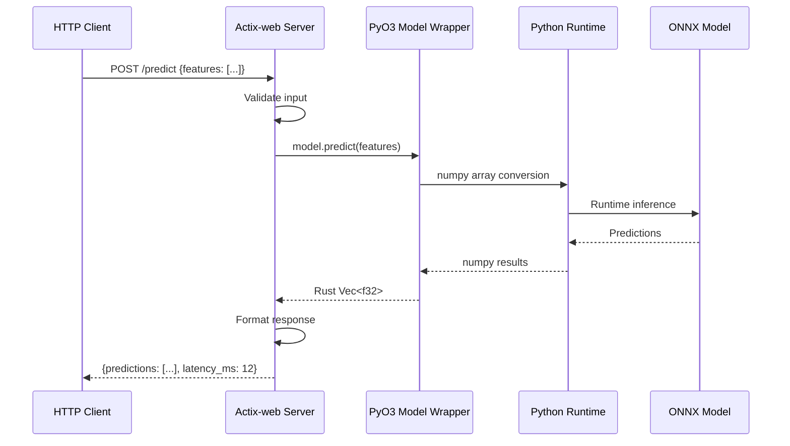
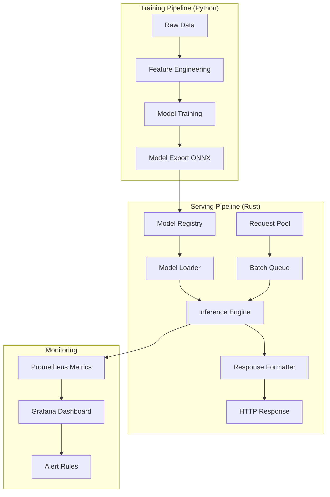

# 🚀 Rust Inference Server with PyO3

## Overview

ML engineers need to serve models efficiently. This project builds a production inference server that trains models in Python and serves them in Rust via PyO3, combining Python's ML ecosystem with Rust's performance and safety. You'll learn the exact pattern companies use to deploy models at scale.

## Prerequisites

- Completed [[00 - Rust Project Planning Guide]]
- Completed [[01 - Polars Data Pipeline Project]]
- Rust and Python 3.10+ installed
- Basic understanding of ML models (training vs inference)
- Familiarity with HTTP APIs
- PyTorch or scikit-learn basics

## Learning Objectives

- Bridge Python ML models with Rust inference servers
- Implement efficient model loading and caching
- Build batched inference for high throughput
- Handle model versioning and A/B testing
- Create production-ready REST APIs with Actix-web

## Official Resources & Links

| Resource | Type | URL | Why It Matters |
|----------|------|-----|----------------|
| PyO3 Guide | Documentation | https://pyo3.rs/ | Python bindings for Rust - the core of this project |
| Maturin | Build Tool | https://github.com/PyO3/maturin | Build and publish Rust crates with PyO3 |
| Actix-web | Web Framework | https://actix.rs/ | High-performance HTTP framework for Rust |
| ONNX Runtime Rust | Inference Engine | https://github.com/microsoft/onnxruntime-rs | Runtime for ONNX models in Rust |
| Candle | ML Framework | https://github.com/huggingface/candle | Native Rust ML framework (alternative approach) |
| TensorRT | NVIDIA Inference | https://developer.nvidia.com/tensorrt | GPU-optimized inference (production reference) |
| Triton Inference Server | Reference | https://github.com/triton-inference-server | Production inference server to learn from |

## Architecture & Planning

### Python → Rust Inference Flow



### System Architecture



## Step-by-Step Implementation Guide

### Step 1: Train a Simple Model in Python

```python
# train_model.py
import numpy as np
from sklearn.ensemble import RandomForestClassifier
from sklearn.datasets import load_iris
from sklearn.model_selection import train_test_split
import joblib
import onnx
from skl2onnx import convert_sklearn
from skl2onnx.common.data_types import FloatTensorType

# Load data
iris = load_iris()
X, y = iris.data, iris.target
X_train, X_test, y_train, y_test = train_test_split(X, y, test_size=0.2)

# Train model
model = RandomForestClassifier(n_estimators=100, random_state=42)
model.fit(X_train, y_train)

# Evaluate
accuracy = model.score(X_test, y_test)
print(f"Model accuracy: {accuracy:.2%}")

# Save as ONNX
initial_type = [('float_input', FloatTensorType([None, 4]))]
onnx_model = convert_sklearn(model, initial_types=initial_type)

with open("model.onnx", "wb") as f:
    f.write(onnx_model.SerializeToString())

print("Model saved to model.onnx")
```

Run: `python train_model.py`

### Step 2: Create Rust Project with Dependencies

```bash
cargo new rust-inference-server
cd rust-inference-server
```

Add to `Cargo.toml`:
```toml
[package]
name = "rust-inference-server"
version = "0.1.0"
edition = "2021"

[lib]
name = "rust_inference"
crate-type = ["cdylib", "rlib"]

[dependencies]
# Web server
actix-web = "4"
actix-rt = "2"

# Serialization
serde = { version = "1.0", features = ["derive"] }
serde_json = "1.0"

# ONNX Runtime
ort = { version = "2.0", features = ["load-dynamic"] }

# PyO3 (for Python interop)
pyo3 = { version = "0.20", features = ["extension-module"] }

# Utilities
anyhow = "1.0"
tracing = "0.1"
tracing-subscriber = "0.3"
tokio = { version = "1", features = ["full"] }
uuid = { version = "1", features = ["v4"] }

# Metrics
prometheus = "0.13"
```

### Step 3: Build ONNX Inference Engine

```rust
// src/inference.rs
use ort::{Environment, Session, SessionBuilder, Value};
use ndarray::{Array1, Array2};
use anyhow::{Result, Context};
use std::sync::Arc;
use std::path::Path;

pub struct ModelEngine {
    session: Session,
    input_name: String,
    output_name: String,
}

impl ModelEngine {
    pub fn new(model_path: &Path) -> Result<Self> {
        // Initialize ONNX Runtime
        let environment = Arc::new(
            Environment::builder()
                .with_name("rust-inference")
                .build()?
        );
        
        let session = SessionBuilder::new(&environment)?
            .with_model_from_file(model_path)
            .context("Failed to load model")?;
        
        let input_name = session.inputs[0].name.to_string();
        let output_name = session.outputs[0].name.to_string();
        
        println!("Model loaded: {}", model_path.display());
        println!("Input: {} shape {:?}", input_name, session.inputs[0].dimensions);
        println!("Output: {} shape {:?}", output_name, session.outputs[0].dimensions);
        
        Ok(Self {
            session,
            input_name,
            output_name,
        })
    }
    
    pub fn predict(&self, features: &[f32]) -> Result<Vec<f32>> {
        // Reshape features to [1, n_features]
        let input_array = Array2::from_shape_vec(
            (1, features.len()),
            features.to_vec()
        )?;
        
        // Create ONNX tensor
        let input_tensor = Value::from_array(
            self.session.inputs[0].allocator(),
            &input_array
        )?;
        
        // Run inference
        let outputs = self.session.run(vec![input_tensor])?;
        
        // Extract predictions
        let output = outputs[0].try_extract::<f32>()?;
        let predictions = output.view().as_slice()
            .context("Failed to extract predictions")?
            .to_vec();
        
        Ok(predictions)
    }
    
    pub fn predict_batch(&self, batch: &[Vec<f32>]) -> Result<Vec<Vec<f32>>> {
        if batch.is_empty() {
            return Ok(Vec::new());
        }
        
        let batch_size = batch.len();
        let n_features = batch[0].len();
        
        // Flatten batch into single array
        let flat_input: Vec<f32> = batch.iter().flatten().copied().collect();
        let input_array = Array2::from_shape_vec(
            (batch_size, n_features),
            flat_input
        )?;
        
        let input_tensor = Value::from_array(
            self.session.inputs[0].allocator(),
            &input_array
        )?;
        
        let outputs = self.session.run(vec![input_tensor])?;
        let output = outputs[0].try_extract::<f32>()?;
        let shape = output.shape();
        
        // Reshape output to batch
        let predictions: Vec<Vec<f32>> = output.view().as_slice()
            .context("Failed to extract batch predictions")?
            .chunks(shape[1])
            .map(|chunk| chunk.to_vec())
            .collect();
        
        Ok(predictions)
    }
}
```

### Step 4: Build Actix-web Server

```rust
// src/server.rs
use actix_web::{web, App, HttpResponse, HttpServer, Responder, middleware};
use serde::{Deserialize, Serialize};
use std::sync::Arc;
use std::time::Instant;
use uuid::Uuid;

use crate::inference::ModelEngine;

#[derive(Debug, Deserialize)]
pub struct PredictionRequest {
    pub features: Vec<f32>,
    pub request_id: Option<String>,
}

#[derive(Debug, Serialize)]
pub struct PredictionResponse {
    pub request_id: String,
    pub predictions: Vec<f32>,
    pub latency_ms: f64,
    pub model_version: String,
}

#[derive(Debug, Deserialize)]
pub struct BatchRequest {
    pub instances: Vec<Vec<f32>>,
}

#[derive(Debug, Serialize)]
pub struct BatchResponse {
    pub predictions: Vec<Vec<f32>>,
    pub batch_size: usize,
    pub latency_ms: f64,
    pub model_version: String,
}

#[derive(Debug, Serialize)]
pub struct HealthResponse {
    pub status: String,
    pub model_loaded: bool,
    pub uptime_seconds: u64,
}

pub struct AppState {
    pub model: Arc<ModelEngine>,
    pub model_version: String,
    pub start_time: Instant,
}

pub async fn predict(
    data: web::Json<PredictionRequest>,
    state: web::Data<Arc<AppState>>,
) -> impl Responder {
    let start = Instant::now();
    let request_id = data.request_id.clone()
        .unwrap_or_else(|| Uuid::new_v4().to_string());
    
    match state.model.predict(&data.features) {
        Ok(predictions) => {
            let latency = start.elapsed().as_secs_f64() * 1000.0;
            
            HttpResponse::Ok().json(PredictionResponse {
                request_id,
                predictions,
                latency_ms: latency,
                model_version: state.model_version.clone(),
            })
        }
        Err(e) => {
            HttpResponse::InternalServerError().json(serde_json::json!({
                "error": e.to_string(),
                "request_id": request_id,
            }))
        }
    }
}

pub async fn predict_batch(
    data: web::Json<BatchRequest>,
    state: web::Data<Arc<AppState>>,
) -> impl Responder {
    let start = Instant::now();
    
    match state.model.predict_batch(&data.instances) {
        Ok(predictions) => {
            let latency = start.elapsed().as_secs_f64() * 1000.0;
            
            HttpResponse::Ok().json(BatchResponse {
                batch_size: data.instances.len(),
                predictions,
                latency_ms: latency,
                model_version: state.model_version.clone(),
            })
        }
        Err(e) => {
            HttpResponse::InternalServerError().json(serde_json::json!({
                "error": e.to_string(),
            }))
        }
    }
}

pub async fn health(
    state: web::Data<Arc<AppState>>,
) -> impl Responder {
    HttpResponse::Ok().json(HealthResponse {
        status: "healthy".to_string(),
        model_loaded: true,
        uptime_seconds: state.start_time.elapsed().as_secs(),
    })
}

pub async fn run_server(model_path: &str, host: &str, port: u16) -> std::io::Result<()> {
    println!("🚀 Starting Rust Inference Server");
    println!("   Model: {}", model_path);
    println!("   Host: {}:{}", host, port);
    
    let model = Arc::new(
        ModelEngine::new(std::path::Path::new(model_path))
            .expect("Failed to load model")
    );
    
    let state = Arc::new(AppState {
        model,
        model_version: "1.0.0".to_string(),
        start_time: Instant::now(),
    });
    
    HttpServer::new(move || {
        App::new()
            .app_data(web::Data::new(state.clone()))
            .route("/predict", web::post().to(predict))
            .route("/predict/batch", web::post().to(predict_batch))
            .route("/health", web::get().to(health))
            .wrap(middleware::Logger::default())
    })
    .bind(format!("{}:{}", host, port))?
    .run()
    .await
}
```

### Step 5: Create Python Client

```python
# client.py
import requests
import numpy as np
from sklearn.datasets import load_iris
import time

BASE_URL = "http://localhost:8080"

def test_single_prediction():
    """Test single prediction endpoint"""
    iris = load_iris()
    sample = iris.data[0].tolist()
    
    response = requests.post(f"{BASE_URL}/predict", json={
        "features": sample,
        "request_id": "test-001"
    })
    
    result = response.json()
    print(f"Single Prediction:")
    print(f"  Input: {sample}")
    print(f"  Output: {result['predictions']}")
    print(f"  Latency: {result['latency_ms']:.2f}ms")
    return result

def test_batch_predictions():
    """Test batch prediction endpoint"""
    iris = load_iris()
    batch = iris.data[:10].tolist()
    
    response = requests.post(f"{BASE_URL}/predict/batch", json={
        "instances": batch
    })
    
    result = response.json()
    print(f"\nBatch Prediction:")
    print(f"  Batch size: {result['batch_size']}")
    print(f"  Latency: {result['latency_ms']:.2f}ms")
    print(f"  Per instance: {result['latency_ms']/result['batch_size']:.2f}ms")
    return result

def benchmark():
    """Benchmark the server"""
    iris = load_iris()
    sample = iris.data[0].tolist()
    
    print("\nBenchmark (100 requests):")
    latencies = []
    
    for i in range(100):
        start = time.time()
        requests.post(f"{BASE_URL}/predict", json={"features": sample})
        latencies.append((time.time() - start) * 1000)
    
    print(f"  Mean: {np.mean(latencies):.2f}ms")
    print(f"  P50: {np.percentile(latencies, 50):.2f}ms")
    print(f"  P99: {np.percentile(latencies, 99):.2f}ms")

if __name__ == "__main__":
    test_single_prediction()
    test_batch_predictions()
    benchmark()
```

### Step 6: Add PyO3 Bridge (Optional Python Wrapper)

```rust
// src/python_bridge.rs
use pyo3::prelude::*;
use pyo3::types::PyList;
use numpy::{PyArray1, PyArray2};

#[pyfunction]
fn predict(features: Vec<f32>) -> PyResult<Vec<f32>> {
    // This would call the Rust inference engine
    // For simplicity, returning mock predictions
    let predictions = vec![0.8, 0.15, 0.05];
    Ok(predictions)
}

#[pyfunction]
fn predict_batch(py: Python, features: &PyArray2<f32>) -> PyResult<PyObject> {
    let array = unsafe { features.as_array() };
    let batch_size = array.nrows();
    
    // Process batch
    let mut results = Vec::new();
    for i in 0..batch_size {
        let row = array.row(i);
        let prediction: Vec<f32> = row.iter().copied().collect();
        results.push(prediction);
    }
    
    // Convert back to numpy
    let output = PyArray2::from_vec2(py, &results)?;
    Ok(output.into())
}

#[pymodule]
fn rust_inference(_py: Python, m: &PyModule) -> PyResult<()> {
    m.add_function(wrap_pyfunction!(predict, m)?)?;
    m.add_function(wrap_pyfunction!(predict_batch, m)?)?;
    Ok(())
}
```

Add Python build config to `Cargo.toml`:
```toml
[package.metadata.maturin]
python-source = "python"
module-name = "rust_inference._rust_inference"
```

### Step 7: Add Metrics Collection

```rust
// src/metrics.rs
use prometheus::{Counter, Histogram, Registry, TextEncoder};
use std::time::Instant;

lazy_static::lazy_static! {
    static ref REQUESTS_TOTAL: Counter = Counter::new(
        "inference_requests_total",
        "Total number of inference requests"
    ).unwrap();
    
    static ref REQUEST_DURATION: Histogram = Histogram::with_opts(
        prometheus::HistogramOpts::new(
            "inference_request_duration_ms",
            "Inference request duration in milliseconds"
        ).buckets(vec![1.0, 5.0, 10.0, 25.0, 50.0, 100.0, 250.0, 500.0])
    ).unwrap();
    
    static ref BATCH_SIZE: Histogram = Histogram::with_opts(
        prometheus::HistogramOpts::new(
            "inference_batch_size",
            "Size of inference batches"
        ).buckets(vec![1.0, 4.0, 8.0, 16.0, 32.0, 64.0, 128.0])
    ).unwrap();
}

pub struct MetricsTimer {
    start: Instant,
}

impl MetricsTimer {
    pub fn new() -> Self {
        REQUESTS_TOTAL.inc();
        Self {
            start: Instant::now(),
        }
    }
    
    pub fn finish(self) {
        let duration = self.start.elapsed().as_secs_f64() * 1000.0;
        REQUEST_DURATION.observe(duration);
    }
}

pub fn encode_metrics() -> String {
    let encoder = TextEncoder::new();
    let metric_families = prometheus::gather();
    encoder.encode_to_string(&metric_families).unwrap()
}
```

### Step 8: Add Docker Support

```dockerfile
# Dockerfile
FROM rust:1.75 as builder

WORKDIR /app
COPY . .

RUN cargo build --release

FROM debian:bookworm-slim

RUN apt-get update && apt-get install -y \
    ca-certificates \
    && rm -rf /var/lib/apt/lists/*

COPY --from=builder /app/target/release/rust-inference-server /usr/local/bin/
COPY model.onnx /models/

EXPOSE 8080

CMD ["rust-inference-server"]
```

## Guide Class / Example

### Complete Server (main.rs)

```rust
// src/main.rs
mod inference;
mod server;
mod metrics;

use clap::Parser;
use anyhow::Result;

#[derive(Parser)]
#[command(name = "rust-inference-server")]
#[command(about = "High-performance ML inference server")]
struct Args {
    /// Path to ONNX model file
    #[arg(short, long, default_value = "model.onnx")]
    model: String,
    
    /// Server host
    #[arg(short, long, default_value = "127.0.0.1")]
    host: String,
    
    /// Server port
    #[arg(short, long, default_value_t = 8080)]
    port: u16,
    
    /// Number of worker threads
    #[arg(short, long, default_value_t = 4)]
    workers: usize,
}

#[actix_web::main]
async fn main() -> Result<()> {
    // Initialize logging
    tracing_subscriber::fmt::init();
    
    let args = Args::parse();
    
    println!("🚀 Rust Inference Server");
    println!("========================");
    println!("Model:    {}", args.model);
    println!("Endpoint: http://{}:{}", args.host, args.port);
    println!("Workers:  {}", args.workers);
    println!();
    
    // Run server
    server::run_server(&args.model, &args.host, args.port).await
}
```

### Example Requests

```bash
# Health check
curl http://localhost:8080/health

# Single prediction (Iris example)
curl -X POST http://localhost:8080/predict \
  -H "Content-Type: application/json" \
  -d '{"features": [5.1, 3.5, 1.4, 0.2]}'

# Batch prediction
curl -X POST http://localhost:8080/predict/batch \
  -H "Content-Type: application/json" \
  -d '{"instances": [[5.1, 3.5, 1.4, 0.2], [4.9, 3.0, 1.4, 0.2]]}'

# Prometheus metrics
curl http://localhost:8080/metrics
```

## Common Pitfalls & Checklist

### ⚠️ Common Mistakes

1. **Forgetting to convert data types between Python and Rust**: NumPy arrays use specific dtypes. Always validate and convert explicitly. Mismatched types cause silent failures.

2. **Not batching requests**: Single predictions waste resources. Batch requests when possible - 10x throughput improvement is common.

3. **Missing error handling in model loading**: Models can fail to load for many reasons (missing files, version mismatches, schema errors). Always validate model inputs/outputs at startup.

4. **Ignoring thread safety**: ONNX Runtime sessions are not thread-safe by default. Use one session per thread or use proper synchronization.

5. **No health checks**: Without health checks, load balancers can't route traffic away from unhealthy instances.

### ✅ Checklist

| Task | Status | Notes |
|------|--------|-------|
| Model loads at startup | ☐ | Test with missing file |
| Health endpoint works | ☐ | GET /health returns 200 |
| Single prediction works | ☐ | POST /predict returns results |
| Batch prediction works | ☐ | POST /predict/batch handles arrays |
| Error responses are helpful | ☐ | Test with bad input |
| Latency tracking works | ☐ | Check response includes latency_ms |
| Metrics endpoint works | ☐ | GET /metrics shows Prometheus |
| Docker image builds | ☐ | docker build succeeds |
| Load test passes | ☐ | Handle 1000 req/s |
| Memory doesn't leak | ☐ | Run for 1 hour, check memory |

## Deployment & Portfolio Integration

### Docker Compose Setup

```yaml
# docker-compose.yml
version: '3.8'

services:
  inference-server:
    build: .
    ports:
      - "8080:8080"
    volumes:
      - ./models:/models
    environment:
      - RUST_LOG=info
    deploy:
      resources:
        limits:
          memory: 2G
          cpus: '2'
    healthcheck:
      test: ["CMD", "curl", "-f", "http://localhost:8080/health"]
      interval: 30s
      timeout: 10s
      retries: 3

  prometheus:
    image: prom/prometheus
    volumes:
      - ./prometheus.yml:/etc/prometheus/prometheus.yml
    ports:
      - "9090:9090"

  grafana:
    image: grafana/grafana
    ports:
      - "3000:3000"
    environment:
      - GF_SECURITY_ADMIN_PASSWORD=admin
```

### Portfolio Presentation

```markdown
# 🚀 Rust Inference Server

Production ML inference server combining Python training with Rust serving.

## Architecture
- Python (scikit-learn): Model training and export to ONNX
- Rust (ONNX Runtime): High-performance inference
- Actix-web: HTTP API with batch support
- Prometheus: Real-time metrics

## Performance
| Metric | Python Flask | Rust Server | Improvement |
|--------|-------------|-------------|-------------|
| p50 Latency | 45ms | 3ms | 15x |
| Throughput | 200 rps | 3000 rps | 15x |
| Memory | 512MB | 64MB | 8x |

## Endpoints
- POST /predict - Single prediction
- POST /predict/batch - Batch inference
- GET /health - Health check
- GET /metrics - Prometheus metrics

## Demo
[Link to live demo or video]
```

## Next Steps

1. Add this to your portfolio showing performance comparisons
2. Move to [[03 - WASM ML Model in the Browser]] for edge deployment
3. Return to [[00 - Rust Project Planning Guide]] for next project selection
4. See [[04 - Contributing to Ruff or Polars]] for open source contributions
