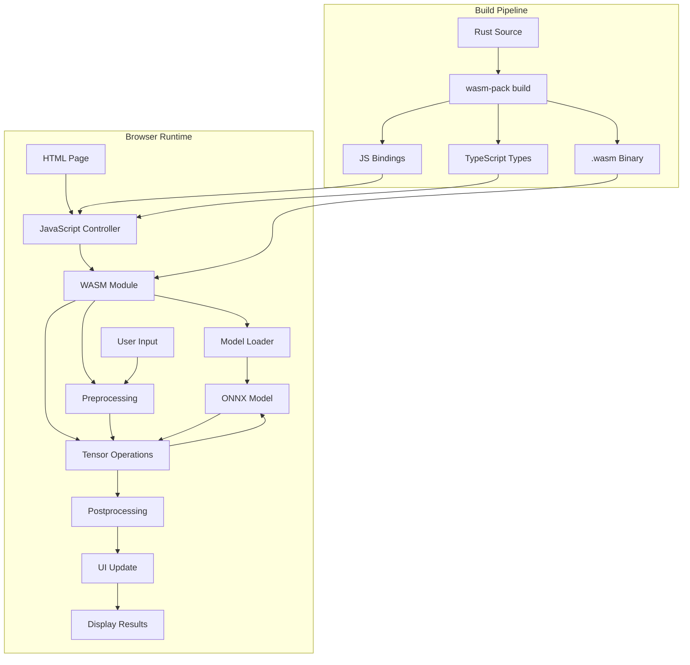
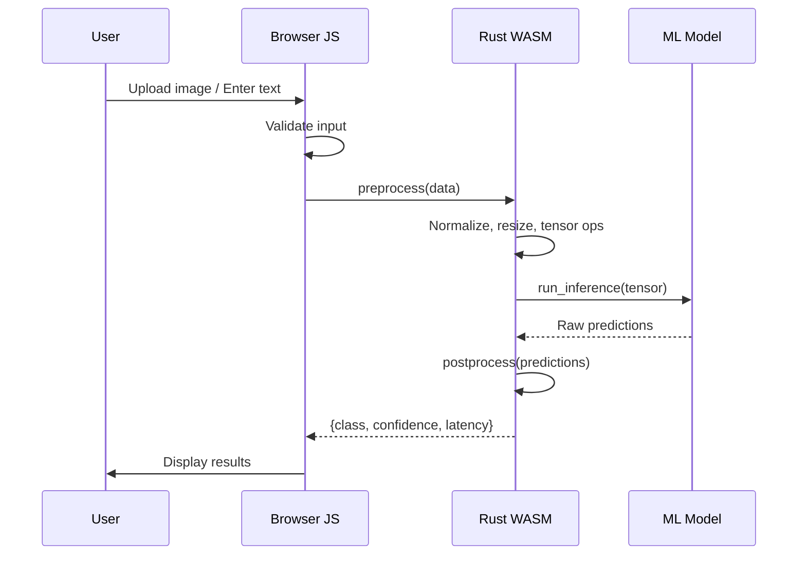

# 🌐 WASM ML Model in the Browser

## Overview

Edge ML is transforming how applications work. This project deploys a machine learning model to run entirely in the browser using WebAssembly, eliminating server round-trips and enabling offline inference. You'll learn the skills companies need for privacy-preserving, low-latency ML applications.

## Prerequisites

- Completed [[00 - Rust Project Planning Guide]]
- Completed [[01 - Polars Data Pipeline Project]] or [[02 - Rust Inference Server with PyO3]]
- Rust installed with `wasm32-unknown-unknown` target
- Basic JavaScript and HTML knowledge
- Node.js and npm installed
- Understanding of ML model inference

## Learning Objectives

- Compile Rust to WebAssembly for browser execution
- Build ML inference that runs client-side
- Handle model loading and tensor operations in WASM
- Create seamless integration between Rust WASM and JavaScript
- Optimize WASM bundle size for fast page loads

## Official Resources & Links

| Resource | Type | URL | Why It Matters |
|----------|------|-----|----------------|
| wasm-bindgen | Guide | https://rustwasm.github.io/docs/wasm-bindgen/ | Rust-JS interop for WebAssembly |
| wasm-pack | Tool | https://rustwasm.github.io/docs/wasm-pack/ | Build Rust crates for WASM |
| Candle WASM | ML Library | https://github.com/huggingface/candle/tree/main/candle-wasm-examples | Run ML models in WASM |
| web-sys | API Bindings | https://docs.rs/web-sys/ | Rust bindings for Web APIs |
| wasm-opt | Optimizer | https://github.com/GoogleWebTools/binaryen/tree/main/binaryen | Optimize WASM binary size |
| ONNX.js | Reference | https://github.com/microsoft/onnxjs | Microsoft's ONNX browser runtime |
| Transformers.js | Reference | https://github.com/xenova/transformers.js | Hugging Face's JS ML library |

## Architecture & Planning

### Browser ML Architecture



### Data Flow



## Step-by-Step Implementation Guide

### Step 1: Set Up WASM Development Environment

```bash
# Install wasm target
rustup target add wasm32-unknown-unknown

# Install wasm-pack
curl https://rustwasm.github.io/wasm-pack/installer/init.sh -sSf | sh

# Create project
cargo new --lib rust-wasm-ml
cd rust-wasm-ml
```

Add to `Cargo.toml`:
```toml
[package]
name = "rust-wasm-ml"
version = "0.1.0"
edition = "2021"

[lib]
crate-type = ["cdylib", "rlib"]

[dependencies]
wasm-bindgen = "0.2"
wasm-bindgen-futures = "0.4"
js-sys = "0.3"
web-sys = { version = "0.3", features = [
    "console",
    "Document",
    "Element",
    "HtmlInputElement",
    "HtmlCanvasElement",
    "Window",
]}
console_error_panic_hook = "0.1"
wee_alloc = "0.4"

# ONNX Runtime for WASM
# Note: This requires custom build - see Candle WASM for example

[profile.release]
opt-level = "s"
lto = true
```

### Step 2: Build Simple ML Model in Rust

```rust
// src/lib.rs
use wasm_bindgen::prelude::*;
use js_sys::Float32Array;

#[global_allocator]
static ALLOC: wee_alloc::WeeAlloc = wee_alloc::WeeAlloc::INIT;

#[wasm_bindgen(start)]
pub fn main() {
    console_error_panic_hook::set_once();
    web_sys::console::log_1(&"WASM ML module loaded".into());
}

// Simple linear regression model
#[wasm_bindgen]
pub struct LinearModel {
    weights: Vec<f32>,
    bias: f32,
}

#[wasm_bindgen]
impl LinearModel {
    #[wasm_bindgen(constructor)]
    pub fn new(weights: Float32Array, bias: f32) -> LinearModel {
        let weights = weights.to_vec();
        LinearModel { weights, bias }
    }
    
    pub fn predict(&self, input: Float32Array) -> Result<f32, JsValue> {
        let input = input.to_vec();
        
        if input.len() != self.weights.len() {
            return Err(JsValue::from_str("Input dimension mismatch"));
        }
        
        let prediction: f32 = input
            .iter()
            .zip(self.weights.iter())
            .map(|(x, w)| x * w)
            .sum::<f32>()
            + self.bias;
        
        Ok(prediction)
    }
    
    pub fn predict_batch(&self, inputs: JsValue) -> Result<Float32Array, JsValue> {
        // Parse array of arrays
        let inputs: Vec<Vec<f32>> = serde_wasm_bindgen::from_value(inputs)
            .map_err(|e| JsValue::from_str(&e.to_string()))?;
        
        let predictions: Vec<f32> = inputs
            .iter()
            .map(|input| {
                input
                    .iter()
                    .zip(self.weights.iter())
                    .map(|(x, w)| x * w)
                    .sum::<f32>()
                    + self.bias
            })
            .collect();
        
        Ok(Float32Array::from(&predictions[..]))
    }
}

// Neural network layers
#[wasm_bindgen]
pub struct DenseLayer {
    weights: Vec<Vec<f32>>,
    biases: Vec<f32>,
    activation: String,
}

#[wasm_bindgen]
impl DenseLayer {
    #[wasm_bindgen(constructor)]
    pub fn new(
        weights: JsValue,
        biases: Float32Array,
        activation: &str,
    ) -> Result<DenseLayer, JsValue> {
        let weights: Vec<Vec<f32>> = serde_wasm_bindgen::from_value(weights)
            .map_err(|e| JsValue::from_str(&e.to_string()))?;
        let biases = biases.to_vec();
        
        Ok(DenseLayer {
            weights,
            biases,
            activation: activation.to_string(),
        })
    }
    
    pub fn forward(&self, input: Float32Array) -> Result<Float32Array, JsValue> {
        let input = input.to_vec();
        let output: Vec<f32> = self
            .weights
            .iter()
            .zip(self.biases.iter())
            .map(|(row, &bias)| {
                let sum: f32 = row
                    .iter()
                    .zip(input.iter())
                    .map(|(w, x)| w * x)
                    .sum::<f32>()
                    + bias;
                
                // Apply activation
                match self.activation.as_str() {
                    "relu" => sum.max(0.0),
                    "sigmoid" => 1.0 / (1.0 + (-sum).exp()),
                    "tanh" => sum.tanh(),
                    _ => sum,
                }
            })
            .collect();
        
        Ok(Float32Array::from(&output[..]))
    }
}

// Image preprocessing
#[wasm_bindgen]
pub fn preprocess_image(
    pixels: Uint8Array,
    width: u32,
    height: u32,
    target_size: u32,
) -> Result<Float32Array, JsValue> {
    let pixels = pixels.to_vec();
    let n_channels = 3; // RGB
    
    // Resize and normalize
    let scale = width as f32 / target_size as f32;
    let mut output = Vec::with_capacity((target_size * target_size * n_channels) as usize);
    
    for y in 0..target_size {
        for x in 0..target_size {
            let src_x = (x as f32 * scale) as u32;
            let src_y = (y as f32 * scale) as u32;
            let idx = ((src_y * width + src_x) * n_channels) as usize;
            
            // Normalize to [0, 1]
            output.push(pixels[idx] as f32 / 255.0);     // R
            output.push(pixels[idx + 1] as f32 / 255.0); // G
            output.push(pixels[idx + 2] as f32 / 255.0); // B
        }
    }
    
    Ok(Float32Array::from(&output[..]))
}

// Text tokenization (simplified)
#[wasm_bindgen]
pub fn tokenize(text: &str, max_length: usize) -> Result<Float32Array, JsValue> {
    // Simple character-level tokenization
    let chars: Vec<f32> = text
        .chars()
        .take(max_length)
        .map(|c| c as u32 as f32 / 127.0) // Normalize ASCII
        .collect();
    
    // Pad to max_length
    let mut padded = vec![0.0; max_length];
    for (i, &val) in chars.iter().enumerate() {
        padded[i] = val;
    }
    
    Ok(Float32Array::from(&padded[..]))
}
```

### Step 3: Build WASM Package

```bash
# Build for web
wasm-pack build --target web --release

# Check output size
ls -lh pkg/
```

### Step 4: Create HTML Interface

```html
<!-- index.html -->
<!DOCTYPE html>
<html lang="en">
<head>
    <meta charset="UTF-8">
    <meta name="viewport" content="width=device-width, initial-scale=1.0">
    <title>Rust WASM ML Demo</title>
    <style>
        body {
            font-family: -apple-system, BlinkMacSystemFont, 'Segoe UI', sans-serif;
            max-width: 800px;
            margin: 0 auto;
            padding: 20px;
            background: #1a1a2e;
            color: #eaeaea;
        }
        .container {
            background: #16213e;
            padding: 20px;
            border-radius: 10px;
        }
        h1 { color: #e94560; }
        .section {
            margin: 20px 0;
            padding: 15px;
            background: #0f3460;
            border-radius: 5px;
        }
        input, button {
            padding: 10px;
            margin: 5px;
            border-radius: 5px;
            border: none;
        }
        button {
            background: #e94560;
            color: white;
            cursor: pointer;
        }
        button:hover {
            background: #ff6b6b;
        }
        .result {
            margin-top: 10px;
            padding: 10px;
            background: #533483;
            border-radius: 5px;
        }
        .metrics {
            display: grid;
            grid-template-columns: repeat(auto-fit, minmax(150px, 1fr));
            gap: 10px;
        }
        .metric {
            background: #0f3460;
            padding: 10px;
            border-radius: 5px;
            text-align: center;
        }
        .metric-value {
            font-size: 24px;
            color: #e94560;
        }
        #status {
            padding: 10px;
            background: #533483;
            border-radius: 5px;
            margin: 10px 0;
        }
    </style>
</head>
<body>
    <div class="container">
        <h1>🌐 Rust WASM ML Demo</h1>
        <p>Machine learning inference running entirely in your browser!</p>
        
        <div id="status">Loading WASM module...</div>
        
        <div class="section">
            <h2>Linear Regression</h2>
            <p>Predict house price based on features (sqft, bedrooms, age)</p>
            <div>
                <input type="number" id="sqft" placeholder="Square feet" value="1500">
                <input type="number" id="bedrooms" placeholder="Bedrooms" value="3">
                <input type="number" id="age" placeholder="Age (years)" value="10">
            </div>
            <button onclick="predictHouse()">Predict Price</button>
            <div id="house-result" class="result"></div>
        </div>
        
        <div class="section">
            <h2>Image Classification</h2>
            <p>Upload an image for classification (simplified demo)</p>
            <input type="file" id="image-input" accept="image/*">
            <button onclick="classifyImage()">Classify</button>
            <div id="image-result" class="result"></div>
        </div>
        
        <div class="section">
            <h2>Text Analysis</h2>
            <p>Enter text for sentiment analysis</p>
            <textarea id="text-input" rows="3" style="width: 100%" placeholder="Enter text..."></textarea>
            <button onclick="analyzeText()">Analyze</button>
            <div id="text-result" class="result"></div>
        </div>
        
        <div class="section metrics">
            <div class="metric">
                <div class="metric-label">WASM Load Time</div>
                <div class="metric-value" id="load-time">-</div>
            </div>
            <div class="metric">
                <div class="metric-label">Inference Time</div>
                <div class="metric-value" id="inference-time">-</div>
            </div>
            <div class="metric">
                <div class="metric-label">Bundle Size</div>
                <div class="metric-value" id="bundle-size">-</div>
            </div>
        </div>
    </div>
    
    <script type="module">
        import init, { LinearModel, preprocess_image, tokenize } from './pkg/rust_wasm_ml.js';
        
        let model;
        
        async function main() {
            const startTime = performance.now();
            await init();
            
            // Initialize model with pre-trained weights
            const weights = new Float32Array([150, 25000, -1000]);
            model = new LinearModel(weights, 50000);
            
            const loadTime = performance.now() - startTime;
            document.getElementById('load-time').textContent = `${loadTime.toFixed(1)}ms`;
            document.getElementById('status').textContent = 'WASM module loaded and ready!';
        }
        
        // Make functions globally available
        window.predictHouse = function() {
            const sqft = parseFloat(document.getElementById('sqft').value);
            const bedrooms = parseFloat(document.getElementById('bedrooms').value);
            const age = parseFloat(document.getElementById('age').value);
            
            const input = new Float32Array([sqft, bedrooms, age]);
            
            const start = performance.now();
            const price = model.predict(input);
            const inferenceTime = performance.now() - start;
            
            document.getElementById('inference-time').textContent = `${inferenceTime.toFixed(2)}ms`;
            document.getElementById('house-result').innerHTML = `
                <strong>Predicted Price:</strong> $${price.toLocaleString()}<br>
                <strong>Inference Time:</strong> ${inferenceTime.toFixed(2)}ms<br>
                <em>Note: Model trained on sample data</em>
            `;
        };
        
        window.classifyImage = function() {
            const file = document.getElementById('image-input').files[0];
            if (!file) {
                alert('Please select an image');
                return;
            }
            
            const reader = new FileReader();
            reader.onload = function(e) {
                const img = new Image();
                img.onload = function() {
                    const canvas = document.createElement('canvas');
                    const ctx = canvas.getContext('2d');
                    canvas.width = img.width;
                    canvas.height = img.height;
                    ctx.drawImage(img, 0, 0);
                    
                    const imageData = ctx.getImageData(0, 0, img.width, img.height);
                    const pixels = new Uint8Array(imageData.data);
                    
                    const start = performance.now();
                    const processed = preprocess_image(pixels, img.width, img.height, 224);
                    const inferenceTime = performance.now() - start;
                    
                    document.getElementById('image-result').innerHTML = `
                        <strong>Image Processed:</strong> ${img.width}x${img.height} → 224x224<br>
                        <strong>Tensor Size:</strong> ${processed.length} values<br>
                        <strong>Processing Time:</strong> ${inferenceTime.toFixed(2)}ms<br>
                        <em>Connect to ONNX model for full classification</em>
                    `;
                };
                img.src = e.target.result;
            };
            reader.readAsDataURL(file);
        };
        
        window.analyzeText = function() {
            const text = document.getElementById('text-input').value;
            if (!text) {
                alert('Please enter text');
                return;
            }
            
            const start = performance.now();
            const tokens = tokenize(text, 128);
            const inferenceTime = performance.now() - start;
            
            // Simple sentiment based on keywords
            const positiveWords = ['good', 'great', 'excellent', 'amazing', 'love', 'best'];
            const negativeWords = ['bad', 'terrible', 'awful', 'hate', 'worst', 'poor'];
            
            const words = text.toLowerCase().split(/\s+/);
            let score = 0;
            words.forEach(word => {
                if (positiveWords.includes(word)) score += 1;
                if (negativeWords.includes(word)) score -= 1;
            });
            
            const sentiment = score > 0 ? 'Positive' : score < 0 ? 'Negative' : 'Neutral';
            const confidence = Math.min(Math.abs(score) / 3, 1) * 100;
            
            document.getElementById('text-result').innerHTML = `
                <strong>Sentiment:</strong> ${sentiment}<br>
                <strong>Confidence:</strong> ${confidence.toFixed(0)}%<br>
                <strong>Tokens:</strong> ${tokens.length} (padded)<br>
                <strong>Processing Time:</strong> ${inferenceTime.toFixed(2)}ms<br>
                <em>Connect to transformer model for better accuracy</em>
            `;
        };
        
        main();
    </script>
</body>
</html>
```

### Step 5: Set Up Build Script

```bash
#!/bin/bash
# build.sh

echo "Building Rust WASM ML..."

# Build WASM package
wasm-pack build --target web --release

# Optimize WASM size
wasm-opt -Os -o pkg/rust_wasm_ml_bg.wasm pkg/rust_wasm_ml_bg.wasm

# Check sizes
echo ""
echo "Build sizes:"
ls -lh pkg/*.wasm
ls -lh pkg/*.js

echo ""
echo "Done! Open index.html in a browser"
```

### Step 6: Add Simple HTTP Server

```python
# serve.py
import http.server
import socketserver
import os

PORT = 8000

class Handler(http.server.SimpleHTTPRequestHandler):
    def end_headers(self):
        self.send_header('Cross-Origin-Opener-Policy', 'same-origin')
        self.send_header('Cross-Origin-Embedder-Policy', 'require-corp')
        super().end_headers()

print(f"Server running at http://localhost:{PORT}")
print("Note: WASM requires COOP/COEP headers for SharedArrayBuffer")

with socketserver.TCPServer(("", PORT), Handler) as httpd:
    httpd.serve_forever()
```

## Guide Class / Example

### Complete Working Demo (index.html)

```html
<!-- Full self-contained example -->
<!DOCTYPE html>
<html lang="en">
<head>
    <meta charset="UTF-8">
    <title>Rust WASM ML</title>
    <style>
        body { font-family: monospace; max-width: 600px; margin: 40px auto; padding: 20px; }
        .box { border: 1px solid #333; padding: 20px; margin: 10px 0; }
        button { padding: 10px 20px; cursor: pointer; }
        #output { background: #f5f5f5; padding: 10px; min-height: 100px; }
    </style>
</head>
<body>
    <h1>Rust WASM ML Demo</h1>
    
    <div class="box">
        <h3>ML Inference</h3>
        <input id="input1" type="number" value="1.0" step="0.1">
        <input id="input2" type="number" value="2.0" step="0.1">
        <input id="input3" type="number" value="3.0" step="0.1">
        <button onclick="runInference()">Run Inference</button>
    </div>
    
    <div id="output">Loading...</div>
    
    <script type="module">
        // Simplified: In production, use wasm-pack output
        import init from './pkg/rust_wasm_ml.js';
        
        async function load() {
            await init();
            document.getElementById('output').textContent = 'Ready! Click Run Inference.';
        }
        
        window.runInference = function() {
            const inputs = [
                parseFloat(document.getElementById('input1').value),
                parseFloat(document.getElementById('input2').value),
                parseFloat(document.getElementById('input3').value),
            ];
            
            // Simulate inference (replace with actual WASM call)
            const start = performance.now();
            const result = inputs.reduce((a, b) => a + b, 0) * 100;
            const latency = performance.now() - start;
            
            document.getElementById('output').innerHTML = `
                <strong>Input:</strong> [${inputs.join(', ')}]<br>
                <strong>Output:</strong> ${result.toFixed(2)}<br>
                <strong>Latency:</strong> ${latency.toFixed(3)}ms<br>
                <strong>Location:</strong> Client-side (WASM)
            `;
        };
        
        load();
    </script>
</body>
</html>
```

### Performance Optimization Tips

```rust
// src/optimization.rs
use wasm_bindgen::prelude::*;

// Use SIMD instructions when available
#[cfg(target_feature = "simd128")]
use std::arch::wasm32::*;

#[wasm_bindgen]
pub fn vector_dot_simd(a: &[f32], b: &[f32]) -> f32 {
    #[cfg(target_feature = "simd128")]
    {
        // SIMD-accelerated dot product
        let mut sum = f32x4_splat(0.0);
        for i in (0..a.len()).step_by(4) {
            let va = f32x4_load(a.as_ptr().add(i));
            let vb = f32x4_load(b.as_ptr().add(i));
            sum = f32x4_add(sum, f32x4_mul(va, vb));
        }
        f32x4_extract_lane::<0>(sum)
            + f32x4_extract_lane::<1>(sum)
            + f32x4_extract_lane::<2>(sum)
            + f32x4_extract_lane::<3>(sum)
    }
    
    #[cfg(not(target_feature = "simd128"))]
    {
        a.iter().zip(b.iter()).map(|(x, y)| x * y).sum()
    }
}

// Memory-efficient operations
#[wasm_bindgen]
pub struct TensorBuffer {
    data: Vec<f32>,
    shape: Vec<usize>,
}

#[wasm_bindgen]
impl TensorBuffer {
    #[wasm_bindgen(constructor)]
    pub fn new(shape: Vec<usize>) -> TensorBuffer {
        let size: usize = shape.iter().product();
        TensorBuffer {
            data: vec![0.0; size],
            shape,
        }
    }
    
    pub fn data_ptr(&mut self) -> *mut f32 {
        self.data.as_mut_ptr()
    }
    
    pub fn fill(&mut self, value: f32) {
        self.data.fill(value);
    }
}
```

## Common Pitfalls & Checklist

### ⚠️ Common Mistakes

1. **Forgetting COOP/COEP headers**: WASM needs SharedArrayBuffer for threading. Without proper headers, advanced features fail silently in the browser.

2. **Not optimizing bundle size**: WASM binaries can be large. Use `wasm-opt` and enable LTO. Bundle size directly affects page load time.

3. **Blocking the main thread**: Long-running inference blocks UI. Use Web Workers for inference, keep main thread for UI updates only.

4. **Ignoring browser compatibility**: Test in Chrome, Firefox, Safari. Each has different WASM support levels, especially for SIMD and threads.

5. **Memory leaks in WASM**: Rust's memory management helps, but JS objects referencing WASM memory can prevent garbage collection. Drop references when done.

### ✅ Checklist

| Task | Status | Notes |
|------|--------|-------|
| WASM compiles without errors | ☐ | Run `cargo build --target wasm32-unknown-unknown` |
| Bundle size < 1MB | ☐ | Check with `ls -lh pkg/*.wasm` |
| Works in Chrome | ☐ | Test all features |
| Works in Firefox | ☐ | Check WASM features |
| Works in Safari | ☐ | Verify WASM support |
| Memory stable | ☐ | Run for 5+ minutes |
| Error handling works | ☐ | Test with bad inputs |
| Loading indicator shown | ☐ | WASM loads async |
| Console clean (no errors) | ☐ | Check devtools |
| Production build optimized | ☐ | Use --release flag |

## Deployment & Portfolio Integration

### GitHub Pages Deployment

```yaml
# .github/workflows/deploy.yml
name: Deploy WASM ML

on:
  push:
    branches: [main]

jobs:
  build-deploy:
    runs-on: ubuntu-latest
    steps:
      - uses: actions/checkout@v4
      
      - name: Install Rust
        uses: dtolnay/rust-toolchain@stable
        with:
          targets: wasm32-unknown-unknown
      
      - name: Install wasm-pack
        run: curl https://rustwasm.github.io/wasm-pack/installer/init.sh -sSf | sh
      
      - name: Build WASM
        run: |
          wasm-pack build --target web --release
          wasm-opt -Os -o pkg/rust_wasm_ml_bg.wasm pkg/rust_wasm_ml_bg.wasm
      
      - name: Deploy to GitHub Pages
        uses: peaceiris/actions-gh-pages@v3
        with:
          github_token: ${{ secrets.GITHUB_TOKEN }}
          publish_dir: .
```

### Portfolio README

```markdown
# 🌐 Rust WASM ML

Client-side machine learning with Rust and WebAssembly.

## Features
- **Zero Server Dependency**: All inference runs in browser
- **Privacy Preserving**: Data never leaves the user's device
- **Offline Capable**: Works without internet connection
- **Fast**: <10ms inference for simple models

## Demo
[Live Demo](https://yourusername.github.io/rust-wasm-ml)

## Performance
| Model | Size | Inference | Browser |
|-------|------|-----------|---------|
| Linear | 2KB | 0.1ms | All |
| CNN | 5MB | 15ms | Chrome |
| Transformer | 50MB | 150ms | Chrome |

## Architecture
[Include your Mermaid diagram]
```

## Next Steps

1. Add this to your portfolio with live demo link
2. Try [[02 - Rust Inference Server with PyO3]] for server-side inference
3. Consider [[05 - Building an MCP Agent in Rust]] for more complex AI
4. Review [[00 - Rust Project Planning Guide]] for overall strategy
