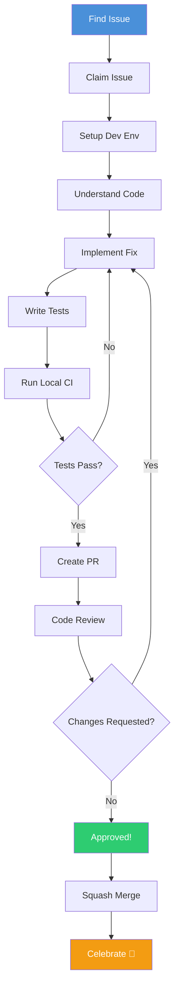
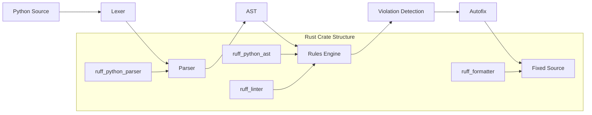
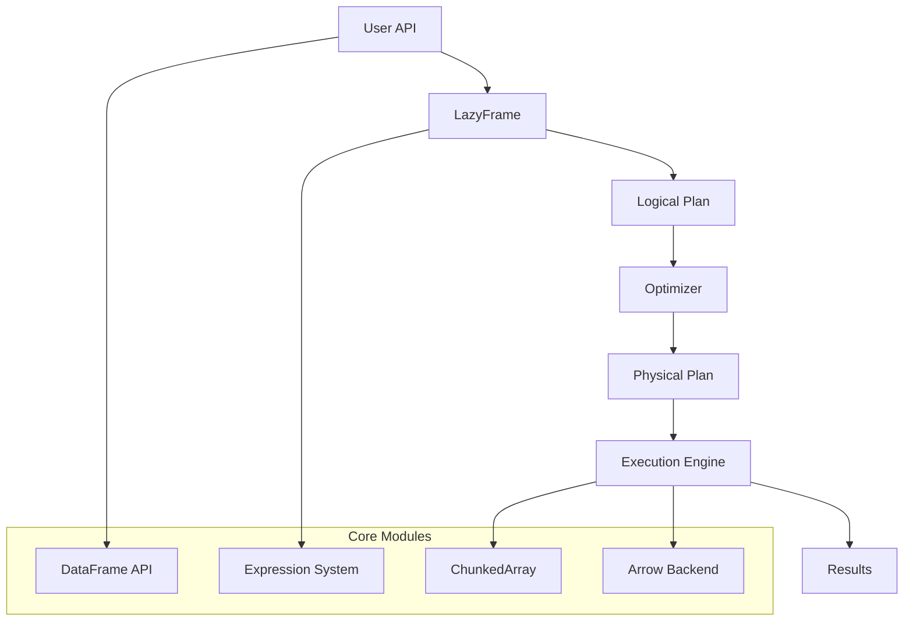

# 🤝 Contributing to Ruff or Polars

## Overview

Open source contributions are the single fastest way to stand out in the ML/AI job market. Contributing to Rust projects like Ruff (Python linter) or Polars (DataFrame library) proves you can work with production codebases, collaborate with senior engineers, and ship code that thousands of developers use daily. This guide shows you exactly how to make your first contribution.

## Prerequisites

- Completed [[00 - Rust Project Planning Guide]]
- Rust installed and working
- Git proficiency (branching, rebasing, PRs)
- Comfort reading large codebases
- GitHub account
- Patience (first contributions often take 2-4 weeks)

## Learning Objectives

- Navigate and understand large Rust codebases
- Find good first issues to work on
- Set up development environments for Ruff and Polars
- Write meaningful tests that get approved
- Create pull requests that follow project conventions
- Handle code review feedback professionally

## Official Resources & Links

| Resource | Type | URL | Why It Matters |
|----------|------|-----|----------------|
| Ruff GitHub | Repository | https://github.com/astral-sh/ruff | Fast Python linter written in Rust |
| Polars GitHub | Repository | https://github.com/pola-rs/polars | High-performance DataFrame library |
| Rust Contributing Guide | Guide | https://github.com/rust-lang/rust/blob/master/CONTRIBUTING.md | Reference for Rust contribution patterns |
| rust-analyzer | IDE Tool | https://github.com/rust-lang/rust-analyzer | Best Rust IDE support |
| Clippy | Linter | https://github.com/rust-lang/rust-clippy | Rust linter you'll use in PRs |
| GitHub CLI | Tool | https://cli.github.com/ | Manage PRs from command line |
| First Timers Only | Community | https://www.firsttimersonly.com/ | Resources for new contributors |

## Architecture & Planning

### PR Contribution Workflow



### Ruff Architecture Overview



### Polars Architecture Overview



## Step-by-Step Implementation Guide

### Step 1: Choose Your Target Project

**Ruff** is better if you:
- Know Python well
- Want to work on developer tooling
- Prefer smaller, focused PRs

**Polars** is better if you:
- Know data processing concepts
- Want to work on ML/data infrastructure
- Prefer feature development

Both are excellent choices. Pick one and stick with it for your first few contributions.

### Step 2: Set Up Development Environment

#### For Ruff:

```bash
# Fork and clone
git clone https://github.com/YOUR_USERNAME/ruff.git
cd ruff

# Install rust toolchain
rustup update

# Install Python (for testing)
python3 -m venv venv
source venv/bin/activate  # Linux/Mac
# or: venv\Scripts\activate  # Windows

# Build Ruff
cargo build

# Run tests
cargo test

# Run Ruff on itself (dogfooding)
cargo run -- check .
```

#### For Polars:

```bash
# Fork and clone
git clone https://github.com/YOUR_USERNAME/polars.git
cd polars

# Update Rust
rustup update

# Build Polars
cargo build --all-features

# Run tests
cargo test

# Run specific test
cargo test --lib -- lazy::test::my_test_name
```

### Step 3: Find Good First Issues

Look for these labels:
- `good first issue`
- `help wanted`
- `easy`
- `documentation`
- `bug`

**Ruff**: https://github.com/astral-sh/ruff/labels/good%20first%20issue

**Polars**: https://github.com/pola-rs/polars/labels/good%20first%20issue

### Step 4: Claim the Issue

Comment on the issue to claim it:

```markdown
I'd like to work on this issue. I'm new to contributing to Ruff/Polars
and this will be my first PR. Could you provide any guidance on where
to start?
```

Wait for maintainer acknowledgment before starting work.

### Step 5: Understand the Code

Use rust-analyzer in VS Code or rust-analyzer in your editor:

```bash
# For Ruff: Find where rules are implemented
find crates -name "*.rs" | xargs grep -l "RULE_NAME"

# For Polars: Find where functions are implemented
find crates -name "*.rs" | xargs grep -l "function_name"
```

Read the surrounding code. Look at similar existing implementations.

### Step 6: Implement Your Changes

Keep changes minimal. Follow existing patterns exactly.

**Example: Adding a new Ruff rule**

```rust
// crates/ruff_linter/src/rules/pyupgrade/rules/mod.rs
pub mod use_pep604_annotation;

// crates/ruff_linter/src/rules/pyupgrade/rules/use_pep604_annotation.rs
use ruff_diagnostics::{AutofixKind, Diagnostic, Violation};
use ruff_macros::{ViolationMetadata, derive_message_formats};
use ruff_python_ast::{Expr, UnionMode};
use ruff_text_size::Ranged;

/// ## What it does
/// Checks for use of `typing.Optional` and `typing.Union` 
/// (PEP 604).
///
/// ## Why is this bad?
/// PEP 604 introduced a more readable syntax for union types.
///
/// ## Example
/// ```python
/// from typing import Optional
///
/// def foo(x: Optional[int]) -> None:
///     pass
/// ```
///
/// Use instead:
/// ```python
/// def foo(x: int | None) -> None:
///     pass
/// ```
#[derive(ViolationMetadata)]
pub struct UsePeP604Annotation {
    pub replacement: String,
}

impl Violation for UsePeP604Annotation {
    const AUTOFIX: AutofixKind = AutofixKind::Always;
    
    #[derive_message_formats]
    fn message(&self) -> String {
        format!("Use `{}` instead of `typing` union", self.replacement)
    }
}

pub fn use_pep604_annotation(checker: &mut Checker, subscript: &ExprSubscript) {
    // Implementation here
}
```

**Example: Adding a Polars feature**

```rust
// crates/polars-ops/src/chunked_array/list.rs
use polars_core::prelude::*;

pub fn your_new_function(s: &Series) -> PolarsResult<Series> {
    // Follow existing patterns
    match s.dtype() {
        DataType::List(inner) => {
            // Implementation
            Ok(s.clone())
        }
        _ => Err(polars_err!(ComputeError: "Expected list dtype")),
    }
}

// Add tests
#[cfg(test)]
mod test {
    use super::*;
    use polars_core::df;
    
    #[test]
    fn test_your_new_function() {
        let df = df! [
            "a" => [[1, 2], [3, 4, 5]],
        ].unwrap();
        
        let result = your_new_function(df.column("a").unwrap()).unwrap();
        // Assert expected output
    }
}
```

### Step 7: Write Tests

Tests are critical for getting PRs approved. Follow the project's test patterns.

```rust
// For Ruff: Add test cases
#[cfg(test)]
mod tests {
    use super::*;
    use ruff_python_ast::source_code::SourceCodeLocator;
    use ruff_linter::linter::check_path;
    
    #[test]
    fn test_use_pep604_annotation() {
        let contents = r#"
from typing import Optional

def foo(x: Optional[int]) -> None:
    pass
        "#;
        
        let diagnostics = check_path(
            Path::new("test.py"),
            contents,
            &settings(),
        ).unwrap();
        
        assert_eq!(diagnostics.len(), 1);
        assert!(diagnostics[0].message().contains("Use `int | None`"));
    }
}
```

### Step 8: Run Local CI Checks

```bash
# Format code
cargo fmt

# Run clippy (must have zero warnings)
cargo clippy -- -D warnings

# Run all tests
cargo test

# Run specific test
cargo test --test test_name

# For Ruff: Run the linter on test fixtures
cargo run -- check crates/ruff_linter/resources/test/fixtures/pyupgrade/
```

### Step 9: Create Your Pull Request

```bash
# Create feature branch
git checkout -b fix/issue-123-description

# Commit with good message
git add .
git commit -m "Fix: Add rule for PEP 604 annotation style (close #123)

- Implements UsePeP604Annotation rule
- Adds autofix for Optional -> X | None
- Includes 5 test cases
- Updates documentation"

# Push to your fork
git push origin fix/issue-123-description
```

Create PR on GitHub with:
- Clear title
- Link to issue
- Description of changes
- Screenshots if applicable

### Step 10: Handle Code Review

Maintainers will likely request changes. This is normal and expected.

Common feedback:
- "Please add more test cases"
- "Can you simplify this implementation?"
- "The error message should be more specific"
- "Please follow our naming convention"

Respond professionally. Make requested changes. Push updates to same branch.

## Guide Class / Example

### Complete Example: Adding a Ruff Rule

```rust
// crates/ruff_linter/src/rules/pyupgrade/rules/use_fstring.rs
use ruff_diagnostics::{AutofixKind, Diagnostic, Violation};
use ruff_macros::{ViolationMetadata, derive_message_formats};
use ruff_python_ast::{self as ast, Expr};
use ruff_text_size::{Ranged, TextRange};

/// ## What it does
/// Checks for use of `str.format()` where an f-string could be used.
///
/// ## Why is this bad?
/// F-strings are more readable and faster than `str.format()`.
///
/// ## Example
/// ```python
/// message = "Hello, {}".format(name)
/// ```
///
/// Use instead:
/// ```python
/// message = f"Hello, {name}"
/// ```
#[derive(ViolationMetadata)]
pub struct UseFString;

impl Violation for UseFString {
    const AUTOFIX: AutofixKind = AutofixKind::Always;
    
    #[derive_message_formats]
    fn message(&self) -> String {
        "Use f-string instead of `str.format()`".to_string()
    }
}

pub(crate) fn use_fstring(checker: &mut Checker, call: &ast::ExprCall) {
    // Check if this is a str.format() call
    let Expr::Attribute(attr) = &*call.func else {
        return;
    };
    
    if attr.attr.as_str() != "format" {
        return;
    }
    
    // Get the string being formatted
    let Expr::StringLit(string) = &*attr.value else {
        return;
    };
    
    // Check if f-string replacement is possible
    if can_use_fstring(&string.value, &call.arguments) {
        let mut diagnostic = Diagnostic::new(UseFString, call.range());
        
        // Add autofix
        if checker.settings.fixable.contains(rule_code()) {
            diagnostic.set_fix(|fixer| {
                let fstring = convert_to_fstring(
                    &string.value,
                    &call.arguments,
                    fixer,
                )?;
                fixer.replace(call.range(), fstring)
            });
        }
        
        checker.diagnostics.push(diagnostic);
    }
}

fn can_use_fstring(string: &str, args: &ast::Arguments) -> bool {
    // Simplified logic - real implementation is more complex
    let placeholder_count = string.matches("{}").count();
    let arg_count = args.args.len();
    placeholder_count == arg_count
}

fn convert_to_fstring(
    string: &str,
    args: &ast::Arguments,
    fixer: &Fixer,
) -> Option<String> {
    // Convert "hello {} world".format(name) to f"hello {name} world"
    let mut result = String::from("f\"");
    let mut parts = string.split("{}");
    
    for (i, part) in parts.enumerate() {
        result.push_str(part);
        if i < args.args.len() {
            result.push_str("{");
            result.push_str(&fixer.locator().slice(args.args[i].range()));
            result.push_str("}");
        }
    }
    result.push('"');
    
    Some(result)
}
```

### Test File

```rust
// crates/ruff_linter/resources/test/fixtures/pyupgrade/use_fstring.py
# Errors
message = "Hello, {}".format(name)
count = "Count: {}".format(len(items))
complex = "{} and {}".format(a, b)

# OK - not str.format
message = f"Hello, {name}"
message = "Hello, %s" % name
message = "Hello, {name}".format(name=name)  # keyword args

# Edge cases
empty = "".format()
no_placeholders = "hello world".format(x)
```

## Common Pitfalls & Checklist

### ⚠️ Common Mistakes

1. **Not following project conventions**: Every project has specific patterns. Read existing code before writing yours. Copy style exactly.

2. **Making changes too large**: Small, focused PRs get reviewed faster. One feature or fix per PR.

3. **Skipping tests**: Maintainers will reject PRs without tests. Write tests first if unsure.

4. **Not running clippy/fmt**: CI will fail. Run `cargo clippy -- -D warnings` and `cargo fmt` before committing.

5. **Impatient with review**: Maintainers are volunteers. Give them 1-2 weeks before politely asking for review.

### ✅ PR Checklist

| Task | Status | Notes |
|------|--------|-------|
| Issue is assigned to you | ☐ | Commented and received approval |
| Code follows project style | ☐ | Match existing patterns |
| All tests pass locally | ☐ | `cargo test` |
| Clippy has zero warnings | ☐ | `cargo clippy -- -D warnings` |
| Code is formatted | ☐ | `cargo fmt` |
| Tests cover new code | ☐ | At least 3 test cases |
| Documentation updated | ☐ | If adding new API |
| PR has clear description | ☐ | Link to issue, explain changes |
| No unrelated changes | ☐ | Only fix the specific issue |
| Commit messages are good | ☐ | Clear, concise, reference issue |

## Deployment & Portfolio Integration

### Showcasing Contributions

Update your GitHub profile README:

```markdown
## Open Source Contributions

### [Ruff](https://github.com/astral-sh/ruff) - Python Linter in Rust
- **PR #1234**: Added `use-fstring` rule with autofix
- **PR #1235**: Fixed false positive in `print-statement` rule
- **Impact**: Used by 50,000+ developers daily

### [Polars](https://github.com/pola-rs/polars) - DataFrame Library
- **PR #4567**: Implemented `str.json_decode()` method
- **PR #4568**: Fixed memory leak in streaming aggregation
- **Impact**: Improves performance for 1M+ monthly downloads

[See all contributions →](https://github.com/astral-sh/ruff/pulls?q=is%3Apr+author%3Ayourusername)
```

### LinkedIn Post Template

```markdown
Excited to share my first open source contribution to Ruff! 🎉

I added a new lint rule that suggests using f-strings instead of 
str.format() calls, complete with autofix.

What I learned:
- How linters parse and analyze code
- The importance of comprehensive tests
- How to navigate a large Rust codebase
- The value of patient code review

Thanks to @charliermarsh and the Ruff team for the guidance!

#OpenSource #RustLang #Python #DeveloperTools
```

### Portfolio Integration

Create a blog post explaining your contribution:

```markdown
# How I Contributed to Ruff (Used by 50K+ Developers)

## The Problem
Ruff was missing a rule for f-string suggestions...

## My Approach
I studied the existing rules and found a pattern...

## Challenges
The autofix logic required careful handling of...

## Results
The PR was merged in 5 days and is now in production...

## What I Learned
Open source contribution taught me...
```

## Next Steps

1. Claim your first issue and start working on it
2. After first PR is merged, tackle another
3. Aim for 3-5 contributions to build credibility
4. Move to [[05 - Building an MCP Agent in Rust]] for your flagship project
5. Return to [[00 - Rust Project Planning Guide]] for overall strategy

## Additional Resources

- [How to Contribute to Open Source](https://opensource.guide/how-to-contribute/)
- [First Timers Only](https://www.firsttimersonly.com/)
- [Up For Grabs](https://up-for-grabs.net/)
- [Good First Issue](https://goodfirstissue.dev/)
- [Rust for Rustaceans Chapter on Contributing](https://rust-for-rustaceans.com/)
