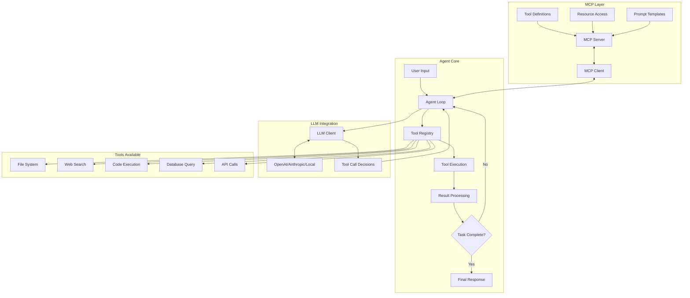
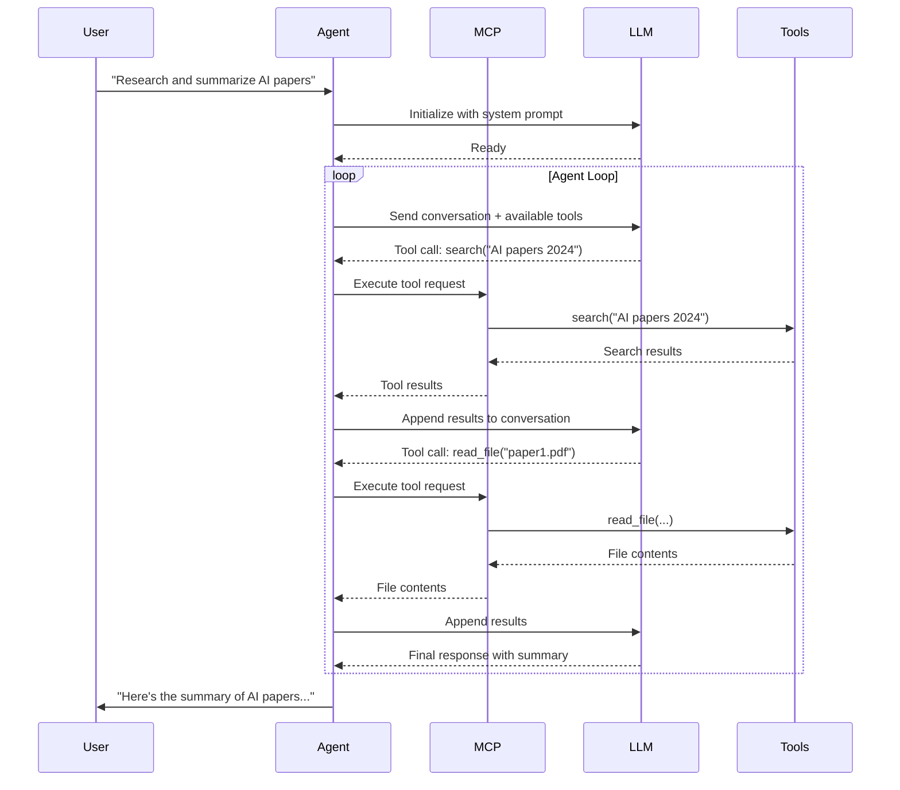
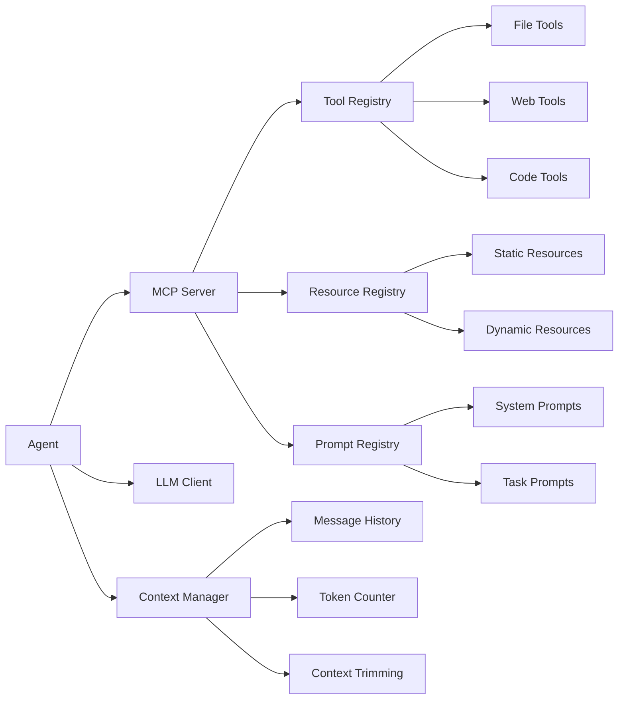

# 🤖 Building an MCP Agent in Rust

## Overview

AI agents are the future of software. This flagship project builds a production AI agent using the Model Context Protocol (MCP), the standard Anthropic created for connecting LLMs to tools. You'll build an agent that can use tools, maintain context, and solve complex tasks autonomously. This is the project that will make recruiters want to interview you.

## Prerequisites

- Completed [[00 - Rust Project Planning Guide]]
- Completed at least 2 other projects from this guide
- Strong Rust fundamentals (async, traits, macros helpful)
- Understanding of LLM APIs (OpenAI, Anthropic, or local models)
- Experience with HTTP clients and servers
- Git and GitHub proficiency

## Learning Objectives

- Implement the Model Context Protocol from specification
- Build tool registries that LLMs can discover and use
- Create async agent loops with proper error handling
- Design extensible architectures for AI systems
- Handle streaming responses and real-time updates
- Manage context windows efficiently

## Official Resources & Links

| Resource | Type | URL | Why It Matters |
|----------|------|-----|----------------|
| MCP Specification | Spec | https://spec.modelcontextprotocol.io/ | Official protocol documentation |
| MCP GitHub | Reference | https://github.com/modelcontextprotocol | Official SDKs and examples |
| Goose | Project | https://github.com/block/goose | Reference implementation from Block |
| reqwest | HTTP Client | https://docs.rs/reqwest/ | Async HTTP client for LLM calls |
| tokio | Async Runtime | https://tokio.rs/ | Rust's async runtime |
| serde_json | Serialization | https://docs.rs/serde_json/ | JSON handling for MCP messages |
| async-trait | Macro | https://docs.rs/async-trait/ | Async traits in Rust |

## Architecture & Planning

### Agent Architecture Diagram



### MCP Protocol Flow



### System Components



## Step-by-Step Implementation Guide

### Step 1: Project Setup

```bash
cargo new mcp-agent
cd mcp-agent
```

Add to `Cargo.toml`:
```toml
[package]
name = "mcp-agent"
version = "0.1.0"
edition = "2021"

[dependencies]
# Async runtime
tokio = { version = "1", features = ["full"] }
tokio-stream = "0.1"

# HTTP client for LLM calls
reqwest = { version = "0.11", features = ["json", "stream"] }

# Serialization
serde = { version = "1.0", features = ["derive"] }
serde_json = "1.0"
serde_repr = "0.1"

# MCP types
schemars = "0.8"

# Error handling
anyhow = "1.0"
thiserror = "1.0"

# CLI
clap = { version = "4.0", features = ["derive"] }

# Logging
tracing = "0.1"
tracing-subscriber = "0.3"

# Async utilities
async-trait = "0.1"
futures = "0.3"

# UUID generation
uuid = { version = "1.0", features = ["v4"] }

# Dotenv for config
dotenvy = "0.15"
```

### Step 2: Define MCP Types

```rust
// src/mcp/types.rs
use serde::{Deserialize, Serialize};
use schemars::JsonSchema;
use std::collections::HashMap;

#[derive(Debug, Clone, Serialize, Deserialize)]
#[serde(tag = "jsonrpc")]
pub enum JsonRpcMessage {
    #[serde(rename = "2.0")]
    Request(JsonRpcRequest),
    #[serde(rename = "2.0")]
    Response(JsonRpcResponse),
    #[serde(rename = "2.0")]
    Notification(JsonRpcNotification),
}

#[derive(Debug, Clone, Serialize, Deserialize)]
pub struct JsonRpcRequest {
    pub id: u64,
    pub method: String,
    #[serde(skip_serializing_if = "Option::is_none")]
    pub params: Option<serde_json::Value>,
}

#[derive(Debug, Clone, Serialize, Deserialize)]
pub struct JsonRpcResponse {
    pub id: u64,
    #[serde(flatten)]
    pub result: ResultResponse,
}

#[derive(Debug, Clone, Serialize, Deserialize)]
#[serde(untagged)]
pub enum ResultResponse {
    Result { result: serde_json::Value },
    Error { error: JsonRpcError },
}

#[derive(Debug, Clone, Serialize, Deserialize)]
pub struct JsonRpcError {
    pub code: i32,
    pub message: String,
    #[serde(skip_serializing_if = "Option::is_none")]
    pub data: Option<serde_json::Value>,
}

#[derive(Debug, Clone, Serialize, Deserialize)]
pub struct JsonRpcNotification {
    pub method: String,
    #[serde(skip_serializing_if = "Option::is_none")]
    pub params: Option<serde_json::Value>,
}

// Tool definition
#[derive(Debug, Clone, Serialize, Deserialize, JsonSchema)]
pub struct Tool {
    pub name: String,
    #[serde(skip_serializing_if = "Option::is_none")]
    pub description: Option<String>,
    #[serde(skip_serializing_if = "Option::is_none")]
    pub input_schema: Option<serde_json::Value>,
}

// Tool call from LLM
#[derive(Debug, Clone, Serialize, Deserialize)]
pub struct ToolCall {
    pub id: String,
    #[serde(rename = "type")]
    pub call_type: String,
    pub function: FunctionCall,
}

#[derive(Debug, Clone, Serialize, Deserialize)]
pub struct FunctionCall {
    pub name: String,
    pub arguments: String,
}

// Tool result
#[derive(Debug, Clone, Serialize, Deserialize)]
pub struct ToolResult {
    pub tool_call_id: String,
    pub content: Vec<Content>,
    #[serde(skip_serializing_if = "Option::is_none")]
    pub is_error: Option<bool>,
}

#[derive(Debug, Clone, Serialize, Deserialize)]
#[serde(tag = "type")]
pub enum Content {
    #[serde(rename = "text")]
    Text { text: String },
    #[serde(rename = "image")]
    Image { data: String, mime_type: String },
    #[serde(rename = "resource")]
    Resource { resource: ResourceContent },
}

#[derive(Debug, Clone, Serialize, Deserialize)]
pub struct ResourceContent {
    pub uri: String,
    #[serde(skip_serializing_if = "Option::is_none")]
    pub mime_type: Option<String>,
    #[serde(skip_serializing_if = "Option::is_none")]
    pub text: Option<String>,
    #[serde(skip_serializing_if = "Option::is_none")]
    pub blob: Option<String>,
}
```

### Step 3: Build Tool Registry

```rust
// src/tools/registry.rs
use async_trait::async_trait;
use std::collections::HashMap;
use anyhow::Result;
use serde_json::Value;

use crate::mcp::types::{Tool, ToolCall, ToolResult, Content};

#[async_trait]
pub trait ToolHandler: Send + Sync {
    async fn call(&self, arguments: Value) -> Result<String>;
    
    fn definition(&self) -> Tool;
}

pub struct ToolRegistry {
    tools: HashMap<String, Box<dyn ToolHandler>>,
}

impl ToolRegistry {
    pub fn new() -> Self {
        Self {
            tools: HashMap::new(),
        }
    }
    
    pub fn register(&mut self, name: impl Into<String>, handler: impl ToolHandler + 'static) {
        self.tools.insert(name.into(), Box::new(handler));
    }
    
    pub fn list_tools(&self) -> Vec<Tool> {
        self.tools.values()
            .map(|handler| handler.definition())
            .collect()
    }
    
    pub async fn execute(&self, tool_call: &ToolCall) -> ToolResult {
        let arguments: Value = serde_json::from_str(&tool_call.function.arguments)
            .unwrap_or(Value::Null);
        
        match self.tools.get(&tool_call.function.name) {
            Some(handler) => {
                match handler.call(arguments).await {
                    Ok(result) => ToolResult {
                        tool_call_id: tool_call.id.clone(),
                        content: vec![Content::Text { text: result }],
                        is_error: None,
                    },
                    Err(e) => ToolResult {
                        tool_call_id: tool_call.id.clone(),
                        content: vec![Content::Text { 
                            text: format!("Error: {}", e) 
                        }],
                        is_error: Some(true),
                    },
                }
            }
            None => ToolResult {
                tool_call_id: tool_call.id.clone(),
                content: vec![Content::Text {
                    text: format!("Tool '{}' not found", tool_call.function.name),
                }],
                is_error: Some(true),
            },
        }
    }
}

// Built-in tools

pub struct ReadFileTool;

#[async_trait]
impl ToolHandler for ReadFileTool {
    async fn call(&self, arguments: Value) -> Result<String> {
        let path = arguments["path"].as_str()
            .ok_or_else(|| anyhow::anyhow!("Missing 'path' argument"))?;
        
        let content = tokio::fs::read_to_string(path).await
            .map_err(|e| anyhow::anyhow!("Failed to read file: {}", e))?;
        
        Ok(content)
    }
    
    fn definition(&self) -> Tool {
        Tool {
            name: "read_file".to_string(),
            description: Some("Read the contents of a file".to_string()),
            input_schema: Some(serde_json::json!({
                "type": "object",
                "properties": {
                    "path": {
                        "type": "string",
                        "description": "Path to the file to read"
                    }
                },
                "required": ["path"]
            })),
        }
    }
}

pub struct WriteFileTool;

#[async_trait]
impl ToolHandler for WriteFileTool {
    async fn call(&self, arguments: Value) -> Result<String> {
        let path = arguments["path"].as_str()
            .ok_or_else(|| anyhow::anyhow!("Missing 'path' argument"))?;
        let content = arguments["content"].as_str()
            .ok_or_else(|| anyhow::anyhow!("Missing 'content' argument"))?;
        
        tokio::fs::write(path, content).await
            .map_err(|e| anyhow::anyhow!("Failed to write file: {}", e))?;
        
        Ok(format!("Successfully wrote {} bytes to {}", content.len(), path))
    }
    
    fn definition(&self) -> Tool {
        Tool {
            name: "write_file".to_string(),
            description: Some("Write content to a file".to_string()),
            input_schema: Some(serde_json::json!({
                "type": "object",
                "properties": {
                    "path": {
                        "type": "string",
                        "description": "Path to the file to write"
                    },
                    "content": {
                        "type": "string",
                        "description": "Content to write to the file"
                    }
                },
                "required": ["path", "content"]
            })),
        }
    }
}

pub struct ExecuteCommandTool;

#[async_trait]
impl ToolHandler for ExecuteCommandTool {
    async fn call(&self, arguments: Value) -> Result<String> {
        let command = arguments["command"].as_str()
            .ok_or_else(|| anyhow::anyhow!("Missing 'command' argument"))?;
        
        let output = tokio::process::Command::new("sh")
            .arg("-c")
            .arg(command)
            .output()
            .await
            .map_err(|e| anyhow::anyhow!("Failed to execute command: {}", e))?;
        
        let stdout = String::from_utf8_lossy(&output.stdout);
        let stderr = String::from_utf8_lossy(&output.stderr);
        
        if output.status.success() {
            Ok(stdout.to_string())
        } else {
            Ok(format!("Command failed with exit code {}\nStderr: {}", 
                output.status, stderr))
        }
    }
    
    fn definition(&self) -> Tool {
        Tool {
            name: "execute_command".to_string(),
            description: Some("Execute a shell command and return the output".to_string()),
            input_schema: Some(serde_json::json!({
                "type": "object",
                "properties": {
                    "command": {
                        "type": "string",
                        "description": "The shell command to execute"
                    }
                },
                "required": ["command"]
            })),
        }
    }
}
```

### Step 4: Build LLM Client

```rust
// src/llm/client.rs
use anyhow::Result;
use reqwest::Client;
use serde::{Deserialize, Serialize};
use serde_json::Value;
use std::time::Duration;

use crate::mcp::types::{Tool, ToolCall};

#[derive(Debug, Clone)]
pub enum LLMProvider {
    OpenAI,
    Anthropic,
    Ollama,
}

#[derive(Debug, Clone, Serialize, Deserialize)]
pub struct Message {
    pub role: String,
    pub content: String,
    #[serde(skip_serializing_if = "Option::is_none")]
    pub tool_calls: Option<Vec<ToolCall>>,
    #[serde(skip_serializing_if = "Option::is_none")]
    pub tool_call_id: Option<String>,
}

pub struct LLMClient {
    client: Client,
    api_key: String,
    model: String,
    provider: LLMProvider,
    base_url: String,
}

impl LLMClient {
    pub fn new(provider: LLMProvider, api_key: String, model: String) -> Self {
        let base_url = match provider {
            LLMProvider::OpenAI => "https://api.openai.com/v1".to_string(),
            LLMProvider::Anthropic => "https://api.anthropic.com/v1".to_string(),
            LLMProvider::Ollama => "http://localhost:11434/v1".to_string(),
        };
        
        Self {
            client: Client::builder()
                .timeout(Duration::from_secs(60))
                .build()
                .unwrap(),
            api_key,
            model,
            provider,
            base_url,
        }
    }
    
    pub async fn chat(
        &self,
        messages: &[Message],
        tools: &[Tool],
    ) -> Result<LLMResponse> {
        let url = format!("{}/chat/completions", self.base_url);
        
        let body = serde_json::json!({
            "model": self.model,
            "messages": messages,
            "tools": if tools.is_empty() { None } else { Some(tools) },
            "temperature": 0.1,
            "max_tokens": 4096,
        });
        
        let response = self.client
            .post(&url)
            .header("Authorization", format!("Bearer {}", self.api_key))
            .header("Content-Type", "application/json")
            .json(&body)
            .send()
            .await?;
        
        let status = response.status();
        if !status.is_success() {
            let error_text = response.text().await?;
            anyhow::bail!("LLM API error {}: {}", status, error_text);
        }
        
        let response: ChatResponse = response.json().await?;
        
        let choice = response.choices.first()
            .ok_or_else(|| anyhow::anyhow!("No response choices"))?;
        
        Ok(LLMResponse {
            content: choice.message.content.clone(),
            tool_calls: choice.message.tool_calls.clone(),
        })
    }
}

#[derive(Debug, Deserialize)]
struct ChatResponse {
    choices: Vec<Choice>,
}

#[derive(Debug, Deserialize)]
struct Choice {
    message: ChatMessage,
}

#[derive(Debug, Deserialize)]
struct ChatMessage {
    content: Option<String>,
    tool_calls: Option<Vec<ToolCall>>,
}

#[derive(Debug)]
pub struct LLMResponse {
    pub content: Option<String>,
    pub tool_calls: Option<Vec<ToolCall>>,
}
```

### Step 5: Build Agent Loop

```rust
// src/agent/loop.rs
use anyhow::Result;
use std::sync::Arc;
use tracing::{info, debug};

use crate::llm::client::{LLMClient, Message};
use crate::tools::registry::ToolRegistry;
use crate::mcp::types::ToolCall;

pub struct Agent {
    llm: Arc<LLMClient>,
    tools: Arc<ToolRegistry>,
    messages: Vec<Message>,
    max_iterations: usize,
}

impl Agent {
    pub fn new(llm: LLMClient, tools: ToolRegistry) -> Self {
        Self {
            llm: Arc::new(llm),
            tools: Arc::new(tools),
            messages: Vec::new(),
            max_iterations: 10,
        }
    }
    
    pub fn set_system_prompt(&mut self, prompt: impl Into<String>) {
        self.messages.push(Message {
            role: "system".to_string(),
            content: prompt.into(),
            tool_calls: None,
            tool_call_id: None,
        });
    }
    
    pub async fn run(&mut self, task: impl Into<String>) -> Result<String> {
        let task = task.into();
        info!("Starting agent task: {}", task);
        
        self.messages.push(Message {
            role: "user".to_string(),
            content: task,
            tool_calls: None,
            tool_call_id: None,
        });
        
        let tool_list = self.tools.list_tools();
        
        for iteration in 0..self.max_iterations {
            debug!("Agent iteration {}", iteration);
            
            let response = self.llm.chat(&self.messages, &tool_list).await?;
            
            // Add assistant message
            self.messages.push(Message {
                role: "assistant".to_string(),
                content: response.content.clone().unwrap_or_default(),
                tool_calls: response.tool_calls.clone(),
                tool_call_id: None,
            });
            
            // Check if we have tool calls
            match response.tool_calls {
                Some(tool_calls) if !tool_calls.is_empty() => {
                    // Execute tool calls
                    for tool_call in &tool_calls {
                        info!("Executing tool: {}", tool_call.function.name);
                        let result = self.tools.execute(tool_call).await;
                        
                        self.messages.push(Message {
                            role: "tool".to_string(),
                            content: serde_json::to_string(&result)
                                .unwrap_or_else(|_| "Error serializing result".to_string()),
                            tool_calls: None,
                            tool_call_id: Some(tool_call.id.clone()),
                        });
                    }
                }
                _ => {
                    // No tool calls, we have a final response
                    info!("Agent task complete");
                    return Ok(response.content.unwrap_or_default());
                }
            }
        }
        
        Ok("Agent reached maximum iterations".to_string())
    }
    
    pub fn get_history(&self) -> &[Message] {
        &self.messages
    }
    
    pub fn reset(&mut self) {
        self.messages.clear();
    }
}
```

### Step 6: Build MCP Server

```rust
// src/mcp/server.rs
use anyhow::Result;
use tokio::io::{AsyncBufReadExt, AsyncWriteExt, BufReader};
use tokio::net::UnixStream;
use tracing::{info, debug, error};

use crate::mcp::types::*;
use crate::tools::registry::ToolRegistry;

pub struct MCPServer {
    tools: ToolRegistry,
    initialized: bool,
}

impl MCPServer {
    pub fn new(tools: ToolRegistry) -> Self {
        Self {
            tools,
            initialized: false,
        }
    }
    
    pub async fn run_stdio(&mut self) -> Result<()> {
        let stdin = tokio::io::stdin();
        let stdout = tokio::io::stdout();
        let mut reader = BufReader::new(stdin);
        let mut writer = stdout;
        
        let mut line = String::new();
        
        loop {
            line.clear();
            let bytes_read = reader.read_line(&mut line).await?;
            
            if bytes_read == 0 {
                break; // EOF
            }
            
            let request: JsonRpcRequest = match serde_json::from_str(&line) {
                Ok(req) => req,
                Err(e) => {
                    error!("Failed to parse request: {}", e);
                    continue;
                }
            };
            
            debug!("Received request: {:?}", request);
            
            let response = self.handle_request(request).await;
            
            let response_json = serde_json::to_string(&response)?;
            writer.write_all(response_json.as_bytes()).await?;
            writer.write_all(b"\n").await?;
            writer.flush().await?;
        }
        
        Ok(())
    }
    
    async fn handle_request(&mut self, request: JsonRpcRequest) -> JsonRpcResponse {
        let result = match request.method.as_str() {
            "initialize" => self.handle_initialize(request.params).await,
            "tools/list" => self.handle_tools_list().await,
            "tools/call" => self.handle_tool_call(request.params).await,
            "ping" => Ok(serde_json::json!({"pong": true})),
            _ => Err(JsonRpcError {
                code: -32601,
                message: format!("Method not found: {}", request.method),
                data: None,
            }),
        };
        
        JsonRpcResponse {
            id: request.id,
            result: match result {
                Ok(value) => ResultResponse::Result { result: value },
                Err(error) => ResultResponse::Error { error },
            },
        }
    }
    
    async fn handle_initialize(&mut self, params: Option<serde_json::Value>) -> Result<serde_json::Value, JsonRpcError> {
        self.initialized = true;
        
        Ok(serde_json::json!({
            "protocolVersion": "2024-11-05",
            "capabilities": {
                "tools": {
                    "listChanged": false
                }
            },
            "serverInfo": {
                "name": "mcp-agent",
                "version": "0.1.0"
            }
        }))
    }
    
    async fn handle_tools_list(&self) -> Result<serde_json::Value, JsonRpcError> {
        let tools = self.tools.list_tools();
        Ok(serde_json::json!({
            "tools": tools
        }))
    }
    
    async fn handle_tool_call(&self, params: Option<serde_json::Value>) -> Result<serde_json::Value, JsonRpcError> {
        let params = params.ok_or_else(|| JsonRpcError {
            code: -32602,
            message: "Missing params".to_string(),
            data: None,
        })?;
        
        let tool_name = params["name"].as_str()
            .ok_or_else(|| JsonRpcError {
                code: -32602,
                message: "Missing tool name".to_string(),
                data: None,
            })?
            .to_string();
        
        let arguments = params["arguments"].clone();
        
        let result = self.tools.execute(&ToolCall {
            id: uuid::Uuid::new_v4().to_string(),
            call_type: "function".to_string(),
            function: crate::mcp::types::FunctionCall {
                name: tool_name,
                arguments: serde_json::to_string(&arguments).unwrap_or_default(),
            },
        }).await;
        
        Ok(serde_json::to_value(result).unwrap())
    }
}
```

### Step 7: Create Main Application

```rust
// src/main.rs
mod mcp;
mod tools;
mod llm;
mod agent;

use anyhow::Result;
use clap::Parser;
use tracing::info;

use crate::agent::loop::Agent;
use crate::llm::client::{LLMClient, LLMProvider};
use crate::mcp::server::MCPServer;
use crate::tools::registry::{ToolRegistry, ReadFileTool, WriteFileTool, ExecuteCommandTool};

#[derive(Parser)]
#[command(name = "mcp-agent")]
#[command(about = "AI Agent using Model Context Protocol")]
struct Args {
    /// Run in MCP server mode
    #[arg(long)]
    mcp: bool,
    
    /// Task to execute (for agent mode)
    #[arg(short, long)]
    task: Option<String>,
    
    /// LLM API key
    #[arg(long, env = "LLM_API_KEY")]
    api_key: Option<String>,
    
    /// LLM model name
    #[arg(long, default_value = "gpt-4")]
    model: String,
    
    /// LLM provider
    #[arg(long, default_value = "openai")]
    provider: String,
}

#[tokio::main]
async fn main() -> Result<()> {
    tracing_subscriber::fmt::init();
    
    let args = Args::parse();
    
    info!("Starting MCP Agent");
    
    // Set up tools
    let mut registry = ToolRegistry::new();
    registry.register("read_file", ReadFileTool);
    registry.register("write_file", WriteFileTool);
    registry.register("execute_command", ExecuteCommandTool);
    
    if args.mcp {
        // Run as MCP server (stdio transport)
        info!("Running in MCP server mode");
        let mut server = MCPServer::new(registry);
        server.run_stdio().await?;
    } else {
        // Run as agent
        let api_key = args.api_key
            .or_else(|| std::env::var("LLM_API_KEY").ok())
            .unwrap_or_default();
        
        let provider = match args.provider.as_str() {
            "anthropic" => LLMProvider::Anthropic,
            "ollama" => LLMProvider::Ollama,
            _ => LLMProvider::OpenAI,
        };
        
        let llm = LLMClient::new(provider, api_key, args.model);
        let mut agent = Agent::new(llm, registry);
        
        agent.set_system_prompt(
            "You are a helpful AI assistant with access to tools. \
             Use the tools to help the user complete their tasks. \
             Be thorough and explain what you're doing."
        );
        
        let task = args.task.unwrap_or_else(|| {
            println!("Enter your task: ");
            let mut input = String::new();
            std::io::stdin().read_line(&mut input).unwrap();
            input.trim().to_string()
        });
        
        let result = agent.run(task).await?;
        println!("\n{}", result);
    }
    
    Ok(())
}
```

## Guide Class / Example

### Complete Working Agent

```rust
// examples/agent_demo.rs
use std::sync::Arc;

#[tokio::main]
async fn main() -> anyhow::Result<()> {
    // Create tool registry
    let mut tools = ToolRegistry::new();
    tools.register("read_file", ReadFileTool);
    tools.register("write_file", WriteFileTool);
    tools.register("execute_command", ExecuteCommandTool);
    
    // Create LLM client
    let llm = LLMClient::new(
        LLMProvider::OpenAI,
        std::env::var("OPENAI_API_KEY")?,
        "gpt-4".to_string(),
    );
    
    // Create agent
    let mut agent = Agent::new(llm, tools);
    
    agent.set_system_prompt("You are a helpful coding assistant.");
    
    // Run a complex task
    let result = agent.run(
        "Create a Python script that reads a CSV file, \
         calculates the average of each numeric column, \
         and writes the results to a new file."
    ).await?;
    
    println!("Result:\n{}", result);
    
    Ok(())
}
```

### Docker Deployment

```dockerfile
# Dockerfile
FROM rust:1.75 as builder

WORKDIR /app
COPY . .

RUN cargo build --release

FROM debian:bookworm-slim

COPY --from=builder /app/target/release/mcp-agent /usr/local/bin/

ENV RUST_LOG=info
ENV LLM_API_KEY=""

ENTRYPOINT ["mcp-agent"]
```

### Example Config

```toml
# config.toml
[llm]
provider = "openai"
model = "gpt-4"
api_key_env = "OPENAI_API_KEY"

[tools]
allowed = ["read_file", "write_file", "execute_command"]

[mcp]
enabled = true
transport = "stdio"
```

## Common Pitfalls & Checklist

### ⚠️ Common Mistakes

1. **Not handling context limits**: LLMs have token limits. Implement context trimming or summarization for long conversations.

2. **Ignoring tool errors**: Tool failures should be reported to the LLM, not silently ignored. The LLM can often recover from errors if informed.

3. **Blocking the async runtime**: Tool execution should be async. Blocking calls (like file I/O in sync mode) will freeze the agent.

4. **No infinite loop protection**: Always limit iterations. Without limits, agents can get stuck in loops repeating failed actions.

5. **Hardcoding tool schemas**: Tool schemas should be dynamic based on actual capabilities, not hardcoded strings.

### ✅ Agent Checklist

| Task | Status | Notes |
|------|--------|-------|
| Tools register correctly | ☐ | Test with list_tools() |
| Tool calls execute | ☐ | Test each tool individually |
| Error handling works | ☐ | Test with bad tool arguments |
| Context trimming implemented | ☐ | Test with 50+ message history |
| Max iterations enforced | ☐ | Test with impossible task |
| MCP server starts | ☐ | Test with `--mcp` flag |
| Stdin/stdout work for MCP | ☐ | Test with MCP client |
| Logging is helpful | ☐ | Check tracing output |
| API key handling secure | ☐ | No keys in logs or code |
| Docker builds and runs | ☐ | Test container execution |

## Deployment & Portfolio Integration

### Portfolio Showcase

```markdown
# 🤖 MCP Agent in Rust

Production AI agent using the Model Context Protocol.

## Features
- **MCP Compatible**: Works with any MCP client (Claude Desktop, etc.)
- **Tool Registry**: Extensible tool system
- **Multiple LLMs**: OpenAI, Anthropic, Ollama support
- **Async**: Fully async implementation
- **Production Ready**: Error handling, logging, config

## Architecture
[Include your Mermaid diagram]

## Demo
```
User: Find all TODO comments in my codebase
Agent: [uses read_file tool] [uses execute_command tool]
Result: Found 12 TODO comments across 5 files...
```

## Performance
- Agent loop: <100ms overhead per iteration
- Tool execution: Varies by tool
- Memory: ~50MB base + model loading

## Tech Stack
- Rust (async/await)
- Tokio (runtime)
- Serde (serialization)
- Reqwest (HTTP client)
```

### LinkedIn Post

```markdown
Excited to share my flagship project - an AI Agent built in Rust! 🤖

This agent implements the Model Context Protocol (MCP) and can:
✅ Execute tools (file ops, commands, APIs)
✅ Maintain conversation context
✅ Work with OpenAI, Anthropic, and local models
✅ Run as a standalone agent or MCP server

Key learnings:
- Rust's async is perfect for I/O-heavy agent loops
- Type safety prevents many common agent bugs
- Performance matters for real-time agent interactions

Built with: Rust, Tokio, Serde, Reqwest

#RustLang #AIAgents #MCP #MachineLearning
```

## Next Steps

1. Complete all 5 projects in this guide
2. Create a cohesive portfolio README
3. Apply to ML/AI Engineer positions
4. Continue contributing to open source
5. Consider presenting at meetups or conferences

## Additional Resources

- [Anthropic MCP Documentation](https://docs.anthropic.com/en/docs/agents-and-tools/mcp)
- [OpenAI Function Calling](https://platform.openai.com/docs/guides/function-calling)
- [LangChain Architecture Reference](https://github.com/langchain-ai/langchain)
- [AutoGPT Implementation](https://github.com/Significant-Gravitas/AutoGPT)
- [Rust Async Book](https://rust-lang.github.io/async-book/)
