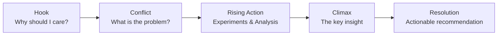
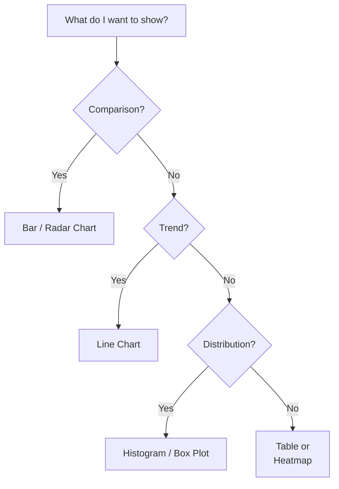

# 🎤 Technical Communication and Storytelling

## Introduction

Engineers who can only code are commodities. Engineers who can code *and* communicate are forces of nature. Technical communication is not about dumbing things down; it is about choosing the right altitude for your audience. Whether you are writing a [[Jira]] ticket, presenting a model architecture, or pitching a project to executives, the underlying skill is the same: structured thinking expressed clearly.

Storytelling is the difference between a dashboard that is ignored and one that changes company strategy. In this course, you will learn frameworks used by top ML engineers and researchers to make complex ideas inevitable in the minds of their listeners.

## 1. The Pyramid Principle

Developed by Barbara Minto at McKinsey, the Pyramid Principle states: start with the answer, then group supporting arguments logically.

- **Top**: The single-sentence recommendation or conclusion.
- **Middle**: 3–5 key arguments, each MECE (Mutually Exclusive, Collectively Exhaustive).
- **Bottom**: Data, code, or evidence for each argument.

Real case: **Andrej Karpathy** uses this structure in nearly every blog post. In "Software 2.0," he opens with the bold claim that neural networks are replacing traditional software. The rest of the post is a pyramid of evidence: data moats, differentiable programming, and the limitations of explicit code. The result is one of the most cited essays in modern ML culture.

⚠️ **Warning:** Do not bury the lede. In technical writing, the worst sin is forcing a reader to hunt for your conclusion. If your TL;DR is at the bottom, rewrite.

💡 **Tip:** Before writing any document, write the one-sentence takeaway in the doc header. If you cannot summarize it in one sentence, you do not understand it well enough yet.

## 2. Data Storytelling and Audience Adaptation

Data without narrative is noise. Narrative without data is opinion.



This narrative arc applies to a model error analysis just as much as it applies to a Netflix series. The difference is the evidence: each beat must be anchored to a metric, a chart, or a code snippet.

| Audience | Format | Depth | Focus | Example |
|----------|--------|-------|-------|---------|
| Recruiter | 1-page summary | High-level | Impact & scope | "Reduced inference latency by 40%" |
| Peer | RFC / Design doc | Deep | Trade-offs & reproducibility | Architecture diagrams, ablation tables |
| Executive | Slide deck | Strategic | Business outcome | Revenue lift, risk mitigation |
| Community | Blog / Thread | Mixed | Novelty & clarity | Animated charts, minimal jargon |

⚠️ **Warning:** A single format never fits all audiences. Sending a 20-page RFC to a VP of Product is as ineffective as sending a 6-slide deck to a reviewer who needs your reproducibility checklist.

## 3. Writing That Travels

In the age of [[Twitter]] / X and [[LinkedIn]], technical writing is a career asset.

- **Blog posts**: 1,500–2,500 words. One big idea, one code walkthrough, one visual.
- **Documentation**: The user is angry and in a hurry. Write for scanning, not reading.
- **Threads**: Each tweet is a beat. Use the first tweet as the hook; the last as the call to action.

Real case: **Chip Huyen** built a massive following and consulting pipeline through her newsletter and blog posts on ML systems. Her writing is dense with insight but light on ego. She uses specific examples — "at Netflix, we did X" — rather than generic advice. That specificity is why her posts are referenced in engineering meetings at top tech companies.

Formula for engagement:

$$
\text{Engagement} = \text{Clarity} \times \text{Relevance} \times \text{Emotion}
$$

If any factor is near zero, the product collapses. A perfectly clear post about an irrelevant topic gets no readers. A relevant, emotional rant that is unclear gets dismissed. Great technical communicators optimize all three variables simultaneously.

## 4. Visualization Choices

The right chart reduces cognitive load. The wrong chart creates confusion.



Image: The classic "Same Stats, Different Graphs" — why visualization choices matter.


---

## 📦 Compression Code

A Markdown template for any technical communication:

```markdown
## TL;DR
<One-sentence conclusion>

## Context
<Why this matters now>

## Analysis
<Data, charts, or code snippets>

## Options Considered
| Option | Pros | Cons | Decision |
|--------|------|------|----------|
| A | ... | ... | Chosen / Rejected |

## Next Steps
1. ...
2. ...
```


