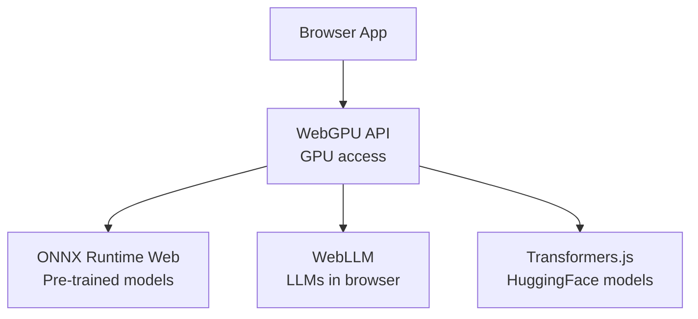

# 🖥️ Welcome to WebGPU and On-Device ML

Your portfolio's RAG system runs on a server. The user uploads a sensitive document; it goes to your GPU, your embedding service, your vector store. **Privacy-conscious users can't use it.** That's the gap WebGPU closes.

**WebGPU** (W3C standard, Chrome 113+, Firefox in roadmap, Safari 17+) gives JavaScript **direct GPU access** in the browser. Combined with **ONNX Runtime Web**, **WebLLM**, and **Transformers.js**, you can run **real ML models on the user's device** — embeddings, classification, even 1-3B parameter LLMs. **Zero server calls, zero data leaving the browser, zero inference cost.**

This is a different paradigm than the rest of the vault's content. Most courses assume a server-side runtime (FastAPI, LangGraph, vLLM). This one assumes **the user's browser is the runtime**. The trade-offs are sharp: model size is limited (~1-3B params practical), first-token latency is high (5-30s for LLMs), and the GPU/CPU landscape is heterogeneous (NVIDIA, AMD, Apple Silicon, integrated). But the wins are also sharp: privacy (data never leaves the device), zero server cost, offline capability, and instant deployment (a static HTML file).

By the end of this course you can deploy a **private, zero-cost, offline-capable LLM** in the browser — useful for portfolio demos, privacy-first products, and edge deployments where server infrastructure is impractical.

## 🎯 Learning Objectives

- Understand the **WebGPU architecture** and what it enables.
- Run **ONNX models** in the browser via ONNX Runtime Web.
- Use **WebLLM** to run 1-3B parameter LLMs in the browser.
- Use **Transformers.js** for HuggingFace models in JS.
- Apply **production patterns** for privacy, offline, and resource constraints.
- Recognize the **limits**: model size, latency, and heterogeneous GPUs.

## Course Map

| # | Note | Core concept | Closes gap |
|:-:|------|--------------|------------|
| 00 | [[00 - Welcome to WebGPU and On-Device ML\|You are here]] | Why on-device ML matters | Course map |
| 01 | [[01 - WebGPU Fundamentals\|WebGPU Basics]] | GPU access from JS, compute shaders | Gap #1 |
| 02 | [[02 - ONNX Runtime Web - ML in the Browser\|ONNX Runtime]] | Pre-trained ONNX models in JS | Gap #2 |
| 03 | [[03 - WebLLM - Full LLMs in Browser\|WebLLM]] | 1-3B LLMs running locally | Gap #3 |
| 04 | [[04 - Transformers.js - HuggingFace in Browser\|Transformers.js]] | HuggingFace models in JS | Gap #4 |
| 05 | [[05 - Production - Privacy Offline Limits\|Production]] | Privacy, offline, limits, deployment | Gap #5 |

## Why WebGPU Matters for AI/ML Engineers

Three use cases drive the on-device ML trend:

1. **Privacy-first products** — healthcare, legal, finance. Data never leaves the user's device.
2. **Zero-cost inference** — no GPU bills, no rate limits. The user's hardware does the work.
3. **Offline capability** — apps that work without internet (field work, privacy-sensitive environments).

For your portfolio specifically:

- **A privacy-first demo** shows you can ship real production AI with HIPAA/GDPR compliance.
- **A browser-based LLM demo** is impressive in interviews ("I built a Llama-3.2-1B chatbot that runs entirely in your browser").
- **On-device embeddings** for sensitive document corpora (legal documents, medical records).

## The Trade-offs

| Aspect | Server-side | Browser (WebGPU) |
|--------|-------------|------------------|
| **Model size** | 1B-405B+ | 0.1B-3B (practical) |
| **Latency (first token)** | 200ms-2s | 5-30s (model load) + 50-500ms (tokens) |
| **Privacy** | Sends data to server | Data stays on device |
| **Cost** | GPU hours, API calls | Zero (uses user's hardware) |
| **Offline** | ❌ Requires server | ✅ Fully offline after first load |
| **GPU access** | Server GPUs (CUDA) | User GPU (varies) |
| **Production scale** | Hundreds to millions | One user at a time |

> ⚠️ **WebGPU is NOT a replacement for server-side inference.** It's a complement for specific use cases (privacy, demo, offline). For production scale, stick with vLLM, SGLang, etc.

## The On-Device ML Stack



All three frameworks (ONNX Runtime Web, WebLLM, Transformers.js) use WebGPU for acceleration when available, fall back to WebGL or CPU otherwise.

## Prerequisites

- **JavaScript/TypeScript** basics. The course uses TypeScript examples.
- **Browser support**: Chrome 113+ (full WebGPU), Safari 17+ (partial), Firefox 130+ (partial).
- **Embedding models**: any ONNX-exported model works for note 02.
- **For WebLLM**: MLC-AI's pre-built models (Llama-3.2-1B, Phi-3-mini, etc.).

## How to Read This Course

1. **Note 01** is the foundation: WebGPU's compute model.
2. **Notes 02-04** are the practical frameworks: ONNX Runtime, WebLLM, Transformers.js.
3. **Note 05** is the production layer: deployment, privacy, limits.

## 📦 Compression Code

```javascript
// 📦 Welcome - WebGPU initialization in 30 lines

// 1. Request GPU adapter
const adapter = await navigator.gpu.requestAdapter();
if (!adapter) {
  throw new Error("WebGPU not supported. Use Chrome 113+ or Safari 17+.");
}

// 2. Request GPU device
const device = await adapter.requestDevice();

// 3. Get canvas context (for rendering) or compute only
const canvas = document.querySelector("#gpu-canvas");
const context = canvas.getContext("webgpu");

// 4. Configure the canvas
const format = navigator.gpu.getPreferredCanvasFormat();
context.configure({
  device,
  format,
});

// 5. Ready to use WebGPU!
console.log("WebGPU initialized");
console.log("Device:", device);
```

That's it. **30 lines** and you have GPU access in the browser. From here, ONNX Runtime Web, WebLLM, and Transformers.js take over.

## References

- WebGPU spec: https://www.w3.org/TR/webgpu/
- ONNX Runtime Web: https://onnxruntime.ai/docs/tutorials/web/
- WebLLM: https://github.com/mlc-ai/web-llm
- Transformers.js: https://huggingface.co/docs/transformers.js
- WebGPU samples: https://webgpu.github.io/webgpu-samples/