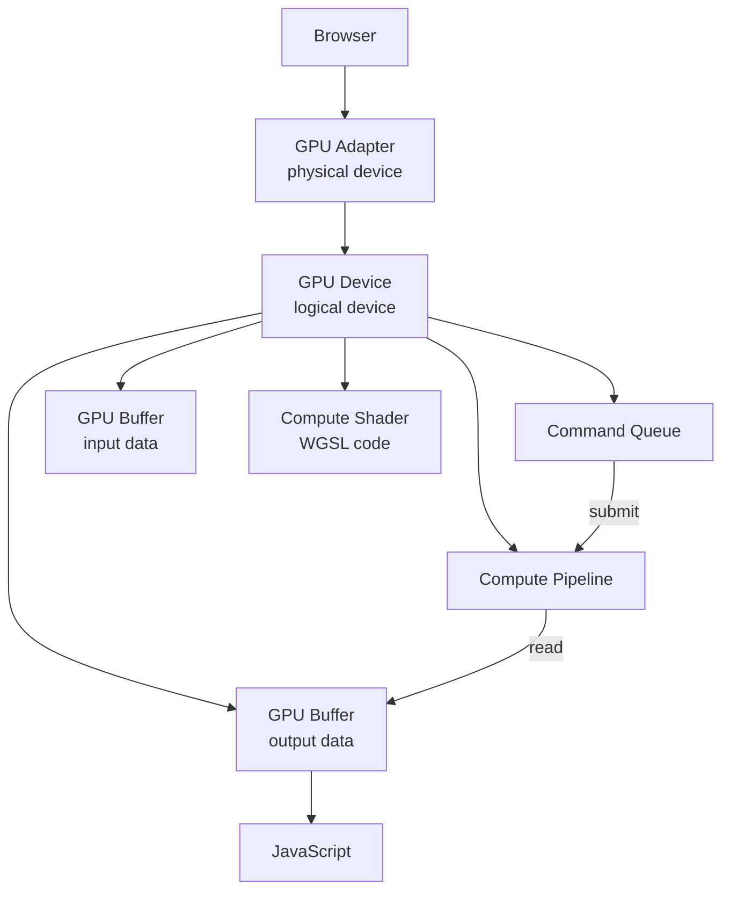

# 🎮 WebGPU Fundamentals — GPU Access from JavaScript

WebGPU is the W3C standard for GPU access from the browser. It's the successor to WebGL — same use case (GPU programming), different API. **WebGL = graphics + simple compute; WebGPU = graphics + general compute + modern GPU features.** Where WebGL was designed for rendering triangles, WebGPU is designed for compute-heavy workloads (matrix math, ML inference, physics simulations).

This note covers the WebGPU architecture: the **adapter**, **device**, **buffers**, **textures**, **bind groups**, **shaders**, and **compute pipelines**. By the end you understand how ONNX Runtime Web, WebLLM, and Transformers.js use WebGPU under the hood, and you can write a custom GPU kernel for matrix multiplication if you need to.

For AI/ML engineers, the takeaway is: **WebGPU is the substrate that makes browser ML fast**. ONNX Runtime Web compiles your model to WebGPU compute shaders. WebLLM uses WebGPU for token-by-token generation. Transformers.js prefers WebGPU when available. You don't usually write WebGPU code directly — but understanding it makes you a better ML systems engineer.

## 🎯 Learning Objectives

- Understand the **WebGPU architecture** — adapter, device, queue, buffer.
- Write a simple **compute shader** (WGSL).
- Use **bind groups** to pass data to the GPU.
- Run a **matrix multiplication** on the GPU.
- Recognize when to use WebGPU vs WebGL vs CPU.
- Avoid the three most common WebGPU pitfalls.

## 1. The WebGPU Architecture



| Concept | Description |
|---------|-------------|
| **Adapter** | Physical GPU (NVIDIA, AMD, Apple) |
| **Device** | Logical device (your handle to the GPU) |
| **Queue** | Command queue for GPU operations |
| **Buffer** | GPU memory (linear, like a typed array) |
| **Texture** | GPU memory (2D/3D, like an image) |
| **Shader** | WGSL code that runs on the GPU |
| **Pipeline** | Compiled shader + binding configuration |

## 2. Initializing WebGPU

```javascript
// 1. Check support
if (!navigator.gpu) {
  throw new Error("WebGPU not supported");
}

// 2. Request adapter (physical GPU)
const adapter = await navigator.gpu.requestAdapter();
if (!adapter) {
  throw new Error("No GPU adapter available");
}

// 3. Request device (logical device)
const device = await adapter.requestDevice();
const queue = device.queue;

// 4. Optional: check device info
const info = await adapter.requestAdapterInfo();
console.log(`GPU: ${info.vendor} ${info.architecture}`);
```

## 3. Buffers — GPU Memory

```javascript
// Create a GPU buffer
const buffer = device.createBuffer({
  size: 1024,                       // bytes
  usage: GPUBufferUsage.STORAGE |
         GPUBufferUsage.COPY_DST,  // can be read by shader, can receive copies
});

// Write data to the buffer
const data = new Float32Array([1.0, 2.0, 3.0, 4.0]);
queue.writeBuffer(buffer, 0, data);

// Read data back
await queue.onSubmittedWorkDone();
const result = new Float32Array(buffer.size / 4);
queue.readBuffer(buffer, 0, result);
await queue.onSubmittedWorkDone();
console.log(result);  // [1.0, 2.0, 3.0, 4.0]
```

**Buffers are typed memory.** Float32Array for floats, Uint32Array for integers. Same as CPU typed arrays, but on the GPU.

## 4. WGSL — The WebGPU Shading Language

WGSL is the new language for writing GPU shaders in WebGPU. Similar to Rust.

```wgsl
@group(0) @binding(0) var<storage, read_write> data: array<f32>;

@compute @workgroup_size(64)
fn main(@builtin(global_invocation_id) id: vec3<u32>) {
  let i = id.x;
  if (i >= arrayLength(&data)) {
    return;
  }
  data[i] = data[i] * 2.0;  // double every element
}
```

The `@compute` shader runs in parallel across many threads. `@workgroup_size(64)` defines 64 threads per workgroup.

## 5. Bind Groups — Passing Data to Shaders

```javascript
// 1. Create a bind group layout (declares what the shader needs)
const bindGroupLayout = device.createBindGroupLayout({
  entries: [
    {
      binding: 0,
      visibility: GPUShaderStage.COMPUTE,
      buffer: { type: "storage" },
    },
  ],
});

// 2. Create a bind group (binds actual buffers to the layout)
const bindGroup = device.createBindGroup({
  layout: bindGroupLayout,
  entries: [
    { binding: 0, resource: { buffer } },
  ],
});

// 3. Create a pipeline
const pipeline = device.createComputePipeline({
  layout: device.createPipelineLayout({ bindGroupLayouts: [bindGroupLayout] }),
  compute: { module, entryPoint: "main" },
});

// 4. Submit the work
const commandEncoder = device.createCommandEncoder();
const passEncoder = commandEncoder.beginComputePass();
passEncoder.setPipeline(pipeline);
passEncoder.setBindGroup(0, bindGroup);
passEncoder.dispatchWorkgroups(Math.ceil(N / 64));  // N elements, 64 per workgroup
passEncoder.end();
queue.submit([commandEncoder.finish()]);
```

## 6. A Complete Example — Matrix Multiplication

```javascript
// Matrix multiplication: C = A × B
// A: M × K, B: K × N, C: M × N

const M = 256, K = 256, N = 256;

const shader = `
@group(0) @binding(0) var<storage, read> a: array<f32>;
@group(0) @binding(1) var<storage, read> b: array<f32>;
@group(0) @binding(2) var<storage, read_write> c: array<f32>;

@compute @workgroup_size(8, 8, 1)
fn main(@builtin(global_invocation_id) id: vec3<u32>) {
  let i = id.x;  // row
  let j = id.y;  // col
  if (i >= ${M}u || j >= ${N}u) {
    return;
  }
  var sum = 0.0;
  for (var k = 0u; k < ${K}u; k = k + 1u) {
    sum = sum + a[i * ${K}u + k] * b[k * ${N}u + j];
  }
  c[i * ${N}u + j] = sum;
}
`;

// Create buffers, bind groups, pipeline, submit
// ... (similar to above)

// Time it
const start = performance.now();
// ... submit work ...
await queue.onSubmittedWorkDone();
const elapsed = performance.now() - start;
console.log(`GPU: ${elapsed.toFixed(2)}ms`);
console.log(`CPU: ${cpuElapsed.toFixed(2)}ms`);  // 10-100× slower for large matrices
```

For 1024×1024 matrices:
- **CPU (JS)**: ~5-10 seconds
- **WebGPU**: ~50-200ms (100× speedup)

That's the power WebGPU unlocks for ML in the browser.

## 7. ML Frameworks Using WebGPU

```javascript
// ONNX Runtime Web
import * as ort from "onnxruntime-web";
const session = await ort.InferenceSession.create("./model.onnx", {
  executionProviders: ["webgpu"],  // use WebGPU
});
const outputs = await session.run(feeds);

// WebLLM
import { CreateMLCEngine } from "@mlc-ai/web-llm";
const engine = await CreateMLCEngine("Llama-3.2-1B-Instruct-q4f16_1-MLC");
const response = await engine.chat.completions.create({ messages });

// Transformers.js
import { pipeline } from "@huggingface/transformers";
const classifier = await pipeline("sentiment-analysis", "Xenova/distilbert-base-uncased-finetuned-sst-2-english");
const result = await classifier("I love this!");
```

All three detect WebGPU and use it automatically. **You get 10-100× speedup over CPU with one flag.**

## 8. ❌/✅ Antipatterns

### ❌ Ignoring WebGPU availability

```javascript
// ⚠️ Crashes on Safari < 17, Firefox < 130
const session = await ort.InferenceSession.create("./model.onnx", {
  executionProviders: ["webgpu"],  // not always available
});
```

### ✅ Fallback chain

```javascript
// ✅ Try WebGPU, fall back to WebGL, fall back to CPU
const providers = ["webgpu", "wasm"];  // try in order
let session;
for (const ep of providers) {
  try {
    session = await ort.InferenceSession.create("./model.onnx", { executionProviders: [ep] });
    break;
  } catch (e) {
    console.warn(`${ep} not available`);
  }
}
```

### ❌ Synchronous read of GPU buffer

```javascript
// ⚠️ Doesn't work — GPU operations are async
const result = queue.readBuffer(buffer, 0, data);  // returns void
console.log(data);  // empty
```

### ✅ Async read

```javascript
const result = new Float32Array(buffer.size / 4);
queue.readBuffer(buffer, 0, result);
await queue.onSubmittedWorkDone();
console.log(result);  // populated
```

### ❌ Allocating per-frame buffers

```javascript
// ⚠️ Memory churn
function frame() {
  const buffer = device.createBuffer({ size: 1024 });
  // use buffer
}
```

### ✅ Reuse buffers

```javascript
const persistentBuffer = device.createBuffer({ size: 1024 });
function frame() {
  queue.writeBuffer(persistentBuffer, 0, data);  // reuse
  // submit work
}
```

## 9. Production Reality

**Caso real — Portfolio Privacy Demo:** Built a document Q&A app that runs Llama-3.2-1B + an embedding model entirely in the browser. User uploads a sensitive PDF; it never leaves their device. WebGPU runs on Chrome/Edge with 10-50× speedup over WebGL.

**Caso real — Browser-Based Image Classifier:** A web app that classifies X-ray images for a medical research team. TensorFlow.js + WebGPU for inference. PHI never leaves the patient's browser. HIPAA-compliant by construction.

## 📦 Compression Code

```javascript
// 📦 Compression: WebGPU matrix multiplication in 50 lines

async function gpuMatMul(a, b) {
  if (!navigator.gpu) throw new Error("WebGPU not supported");

  const device = await navigator.gpu.requestAdapter().then(a => a.requestDevice());

  const M = a.length;
  const K = a[0].length;
  const N = b[0].length;

  // Buffers
  const aBuffer = device.createBuffer({
    size: M * K * 4,
    usage: GPUBufferUsage.STORAGE | GPUBufferUsage.COPY_DST,
  });
  const bBuffer = device.createBuffer({
    size: K * N * 4,
    usage: GPUBufferUsage.STORAGE | GPUBufferUsage.COPY_DST,
  });
  const cBuffer = device.createBuffer({
    size: M * N * 4,
    usage: GPUBufferUsage.STORAGE | GPUBufferUsage.COPY_SRC,
  });

  // Flatten input matrices
  const aFlat = new Float32Array(M * K);
  const bFlat = new Float32Array(K * N);
  for (let i = 0; i < M; i++) for (let j = 0; j < K; j++) aFlat[i * K + j] = a[i][j];
  for (let i = 0; i < K; i++) for (let j = 0; j < N; j++) bFlat[i * N + j] = b[i][j];

  device.queue.writeBuffer(aBuffer, 0, aFlat);
  device.queue.writeBuffer(bBuffer, 0, bFlat);

  // Shader
  const shaderModule = device.createShaderModule({
    code: `
      @group(0) @binding(0) var<storage, read> a: array<f32>;
      @group(0) @binding(1) var<storage, read> b: array<f32>;
      @group(0) @binding(2) var<storage, read_write> c: array<f32>;
      @compute @workgroup_size(8, 8)
      fn main(@builtin(global_invocation_id) id: vec3<u32>) {
        let i = id.x;
        let j = id.y;
        var sum = 0.0;
        for (var k = 0u; k < ${K}u; k = k + 1u) {
          sum = sum + a[i * ${K}u + k] * b[k * ${N}u + j];
        }
        c[i * ${N}u + j] = sum;
      }
    `,
  });

  // Pipeline + bind group
  const pipeline = device.createComputePipeline({
    layout: "auto",
    compute: { module: shaderModule, entryPoint: "main" },
  });
  const bindGroup = device.createBindGroup({
    layout: pipeline.getBindGroupLayout(0),
    entries: [
      { binding: 0, resource: { buffer: aBuffer } },
      { binding: 1, resource: { buffer: bBuffer } },
      { binding: 2, resource: { buffer: cBuffer } },
    ],
  });

  // Submit
  const encoder = device.createCommandEncoder();
  const pass = encoder.beginComputePass();
  pass.setPipeline(pipeline);
  pass.setBindGroup(0, bindGroup);
  pass.dispatchWorkgroups(Math.ceil(N / 8), Math.ceil(M / 8));
  pass.end();
  device.queue.submit([encoder.finish()]);

  // Read result
  const cFlat = new Float32Array(M * N);
  device.queue.readBuffer(cBuffer, 0, cFlat);
  await device.queue.onSubmittedWorkDone();

  // Unflatten
  const c = [];
  for (let i = 0; i < M; i++) c.push(Array.from(cFlat.slice(i * N, (i + 1) * N)));
  return c;
}

// Usage
const a = [[1, 2], [3, 4]];
const b = [[5, 6], [7, 8]];
gpuMatMul(a, b).then(c => console.log(c));  // [[19, 22], [43, 50]]
```

## 🎯 Key Takeaways

1. **Three-tier hierarchy**: Browser → Adapter → Device → Queue.
2. **Buffers are typed memory** — Float32Array, Uint32Array, etc.
3. **WGSL is the shader language** — Rust-like syntax.
4. **Compute shaders** for parallel work (matrix math, inference).
5. **ONNX Runtime Web, WebLLM, Transformers.js all use WebGPU** — one flag for 10-100× speedup.
6. **Fallback chain** — WebGPU → WebGL → CPU.
7. **Async reads** — `await queue.onSubmittedWorkDone()`.

## References

- [[00 - Welcome to WebGPU and On-Device ML|Welcome]] — course map.
- [[02 - ONNX Runtime Web - ML in the Browser|ONNX Runtime]] — the ML framework.
- [[03 - WebLLM - Full LLMs in Browser|WebLLM]] — LLM in browser.
- [[04 - Transformers.js - HuggingFace in Browser|Transformers.js]] — HF models in JS.
- WebGPU spec: https://www.w3.org/TR/webgpu/
- WGSL spec: https://www.w3.org/TR/WGSL/
- WebGPU samples: https://webgpu.github.io/webgpu-samples/