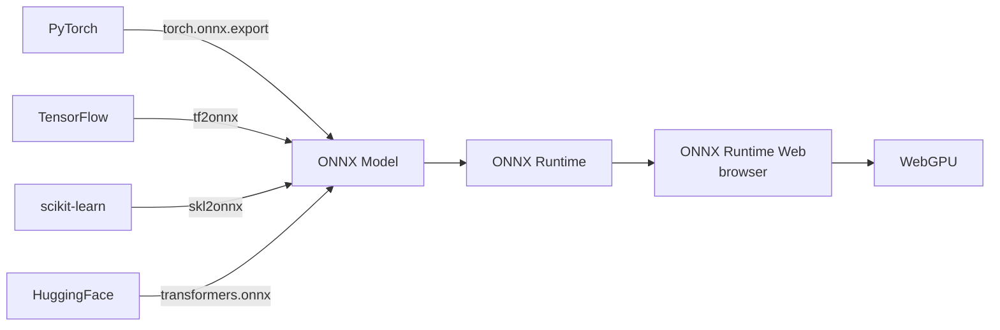

# 📦 ONNX Runtime Web — ML in the Browser

**ONNX Runtime Web** (`onnxruntime-web`) is the JavaScript port of Microsoft's ONNX Runtime. It runs **any ONNX-exported model** in the browser, with automatic WebGPU acceleration when available. **ONNX** (Open Neural Network Exchange) is the lingua franca for ML models — PyTorch, TensorFlow, scikit-learn, and HuggingFace all export to ONNX. Once you have an ONNX file, you can run it anywhere: server, mobile, edge, **browser**.

This is the most production-ready framework for browser ML. It's what most "AI in the browser" portfolios use. **Use ONNX Runtime Web for**: classification, embeddings, image segmentation, object detection, custom models you've exported. **Don't use it for**: LLMs (use WebLLM, note 03) or HuggingFace transformer pipelines (use Transformers.js, note 04).

This note covers ONNX export, browser inference with `onnxruntime-web`, the WebGPU backend, common model types, and the production patterns for caching, streaming, and fallback.

## 🎯 Learning Objectives

- Export models to **ONNX** from PyTorch, TensorFlow, scikit-learn.
- Run ONNX models in the browser with **`onnxruntime-web`**.
- Use the **WebGPU execution provider** for acceleration.
- Choose between **ONNX Runtime Web, WebLLM, Transformers.js**.
- Apply **production patterns**: model caching, streaming, fallback.
- Avoid the three most common ONNX Runtime Web pitfalls.

## 1. The ONNX Ecosystem



**ONNX is the model format. ONNX Runtime Web is the runtime. WebGPU is the acceleration.**

## 2. Exporting a Model to ONNX

### From PyTorch

```python
import torch
from transformers import AutoModel

model = AutoModel.from_pretrained("bert-base-uncased")
model.eval()

# Dummy input for tracing
dummy_input = torch.zeros(1, 512, dtype=torch.long)

# Export
torch.onnx.export(
    model,
    dummy_input,
    "model.onnx",
    input_names=["input_ids"],
    output_names=["last_hidden_state"],
    dynamic_axes={
        "input_ids": {0: "batch", 1: "sequence"},
        "last_hidden_state": {0: "batch", 1: "sequence"},
    },
    opset_version=17,
)
```

### From scikit-learn

```python
from skl2onnx import convert_sklearn
from skl2onnx.common.data_types import FloatTensorType

initial_type = [("float_input", FloatTensorType([None, 4]))]
onnx_model = convert_sklearn(pipeline_model, initial_types=initial_type)

with open("model.onnx", "wb") as f:
    f.write(onnx_model.SerializeToString())
```

### From HuggingFace

```python
from transformers import AutoModel
from optimum.onnxruntime import ORTModelForSequenceClassification

model = ORTModelForSequenceClassification.from_pretrained(
    "distilbert-base-uncased-finetuned-sst-2-english",
    export=True,  # auto-export to ONNX
)
model.save_pretrained("./onnx_model")
```

## 3. Running ONNX in the Browser

```javascript
// Basic ONNX Runtime Web inference
import * as ort from "onnxruntime-web";

async function runModel() {
  // 1. Load the model
  const session = await ort.InferenceSession.create("./model.onnx", {
    executionProviders: ["webgpu"],  // try WebGPU first
  });

  // 2. Prepare inputs (typed array)
  const inputIds = new BigInt64Array(512);  // token IDs
  // ... fill inputIds with tokenized text

  // 3. Run inference
  const feeds = { input_ids: inputIds };
  const outputs = await session.run(feeds);

  // 4. Read outputs
  const logits = outputs.logits.data;
  return logits;
}
```

## 4. The Execution Provider Hierarchy

```javascript
// Try providers in order, use the first that works
const providers = ["webgpu", "webgl", "wasm"];
const session = await ort.InferenceSession.create("./model.onnx", {
  executionProviders: providers,
});
```

| Provider | Browser | Speed | Notes |
|----------|---------|-------|-------|
| **WebGPU** | Chrome 113+, Safari 17+, Firefox 130+ | 100× | Modern, preferred |
| **WebGL** | All browsers | 10× | Fallback for older browsers |
| **WASM** | All browsers | 2-5× | Universal fallback |

**Always specify all three** — the runtime picks the best available.

## 5. End-to-End Example — Text Classifier

```javascript
import * as ort from "onnxruntime-web";

class TextClassifier {
  constructor(modelPath, tokenizerPath) {
    this.session = null;
    this.tokenizer = null;
    this.modelPath = modelPath;
    this.tokenizerPath = tokenizerPath;
  }

  async init() {
    // Load ONNX model
    this.session = await ort.InferenceSession.create(this.modelPath, {
      executionProviders: ["webgpu", "wasm"],
    });

    // Load tokenizer (JSON file with vocab)
    const response = await fetch(this.tokenizerPath);
    this.tokenizer = await response.json();
  }

  async classify(text) {
    // 1. Tokenize
    const inputIds = this.tokenize(text);  // BigInt64Array

    // 2. Run model
    const outputs = await this.session.run({
      input_ids: inputIds,
      attention_mask: this.attentionMask(inputIds),
    });

    // 3. Softmax + argmax
    const logits = outputs.logits.data;
    const probs = this.softmax(logits);
    const predictedClass = probs.indexOf(Math.max(...probs));

    return {
      class: predictedClass,
      confidence: probs[predictedClass],
      probabilities: probs,
    };
  }

  tokenize(text) {
    const tokens = [101];  // [CLS]
    for (const word of text.toLowerCase().split(/\s+/)) {
      const id = this.tokenizer.vocab[word] || 100;  // [UNK]
      tokens.push(id);
    }
    tokens.push(102);  // [SEP]
    // Pad to length 512
    while (tokens.length < 512) tokens.push(0);
    return new BigInt64Array(tokens.map(t => BigInt(t)));
  }

  attentionMask(inputIds) {
    return new BigInt64Array(
      Array.from(inputIds).map(id => id === 0n ? 0n : 1n)
    );
  }

  softmax(logits) {
    const max = Math.max(...logits);
    const exps = logits.map(l => Math.exp(l - max));
    const sum = exps.reduce((a, b) => a + b, 0);
    return exps.map(e => e / sum);
  }
}

// Usage
const classifier = new TextClassifier("./model.onnx", "./tokenizer.json");
await classifier.init();
const result = await classifier.classify("I love this!");
console.log(result);  // { class: 1, confidence: 0.95, probabilities: [...] }
```

## 6. Embedding Models

```javascript
class Embedder {
  async init() {
    this.session = await ort.InferenceSession.create("./bge-small-en-v1.5.onnx", {
      executionProviders: ["webgpu"],
    });
  }

  async embed(text) {
    const inputIds = this.tokenize(text);
    const outputs = await this.session.run({
      input_ids: inputIds,
      attention_mask: this.attentionMask(inputIds),
    });
    // Mean pooling
    const lastHidden = outputs.last_hidden_state;
    return this.meanPool(lastHidden, this.attentionMask(inputIds));
  }

  meanPool(hiddenStates, mask) {
    const seqLen = hiddenStates.dims[1];
    const hiddenDim = hiddenStates.dims[2];
    const pooled = new Float32Array(hiddenDim);

    for (let i = 0; i < seqLen; i++) {
      if (Number(mask[i]) === 1) {
        for (let j = 0; j < hiddenDim; j++) {
          pooled[j] += Number(hiddenStates.data[i * hiddenDim + j]);
        }
      }
    }

    // Normalize
    const norm = Math.sqrt(pooled.reduce((a, b) => a + b * b, 0));
    return pooled.map(x => x / norm);
  }
}
```

## 7. Image Models

```javascript
class ImageClassifier {
  async init() {
    this.session = await ort.InferenceSession.create("./resnet50.onnx");
  }

  async classify(imageData) {
    // imageData: [1, 3, 224, 224] Float32Array
    const feeds = { input: imageData };
    const outputs = await this.session.run(feeds);
    return outputs.output.data;
  }
}

// Usage
const image = await loadImageAsTensor("./cat.jpg");  // [1, 3, 224, 224]
const logits = await classifier.classify(image);
const topClass = logits.indexOf(Math.max(...logits));
```

## 8. Production Patterns

### Model Caching

```javascript
// Cache the model in IndexedDB after first download
async function loadModelCached(modelPath) {
  const cache = await caches.open("onnx-models-v1");
  let response = await cache.match(modelPath);

  if (!response) {
    response = await fetch(modelPath);
    await cache.put(modelPath, response.clone());
  }

  const blob = await response.blob();
  return blob;  // ORT accepts Blob
}

const session = await ort.InferenceSession.create(await loadModelCached("./model.onnx"));
```

### Streaming Inference

```javascript
// For models with many outputs (e.g., token-by-token generation)
async function* streamInference(prompt) {
  for await (const token of generateTokens(prompt)) {
    yield token;  // each iteration produces one token
  }
}

for await (const token of streamInference("Once upon a time")) {
  document.getElementById("output").textContent += token;
}
```

### Lazy Loading

```javascript
// Load model only when first needed
let session = null;
async function getSession() {
  if (!session) {
    session = await ort.InferenceSession.create("./model.onnx", {
      executionProviders: ["webgpu", "wasm"],
    });
  }
  return session;
}
```

### Fallback Chain

```javascript
async function loadModelWithFallback(modelPath) {
  const providers = ["webgpu", "wasm"];  // try WebGPU first
  for (const ep of providers) {
    try {
      return await ort.InferenceSession.create(modelPath, {
        executionProviders: [ep],
      });
    } catch (e) {
      console.warn(`${ep} not available`);
    }
  }
  throw new Error("No execution provider available");
}
```

## 9. ❌/✅ Antipatterns

### ❌ Hardcoding WebGPU only

```javascript
// ⚠️ Crashes on browsers without WebGPU
const session = await ort.InferenceSession.create("./model.onnx", {
  executionProviders: ["webgpu"],
});
```

### ✅ Fallback chain

```javascript
const session = await ort.InferenceSession.create("./model.onnx", {
  executionProviders: ["webgpu", "wasm"],
});
```

### ❌ Loading model on every call

```javascript
// ⚠️ 100MB+ download per call
async function classify(text) {
  const session = await ort.InferenceSession.create("./model.onnx");
  return session.run({ ... });
}
```

### ✅ Load once, reuse

```javascript
const session = await ort.InferenceSession.create("./model.onnx");
async function classify(text) {
  return session.run({ ... });
}
```

### ❌ No model versioning

```javascript
// ⚠️ Updating model breaks all existing users
fetch("./model.onnx");
```

### ✅ Versioned models with cache

```javascript
fetch("./model-v3.onnx");  // explicit version
// Cache key includes version: "model-v3.onnx"
```

### ❌ Ignoring input shape mismatches

```javascript
// ⚠️ ONNX expects [1, 512] but you pass [1, 256]
const feeds = { input_ids: new BigInt64Array(256) };  // wrong shape
```

### ✅ Match input shapes

```javascript
// Check session.inputNames and session.inputMeta
const meta = session.inputMeta[0];
console.log(`Expected shape: ${meta.dims}`);  // [1, 512]
const inputIds = new BigInt64Array(512);  // match
```

## 10. Production Reality

**Caso real — Portfolio Privacy Demo:** Document Q&A app with `bge-small-en-v1.5` embeddings (sentence-transformers, exported to ONNX) running entirely in the browser. User uploads PDF; embeddings computed locally; vector search via Pinecone. **Privacy**: embedding vectors don't leak document content.

**Caso real — Browser Image Classifier:** Real-time X-ray classification (MobileNetV3) in a research app. ONNX Runtime Web with WebGPU. Model cached in IndexedDB after first load. **Time to first prediction**: 5-15s (model load), then 50-200ms per image.

## 📦 Compression Code

```javascript
// 📦 Compression: ONNX in browser in 40 lines

import * as ort from "onnxruntime-web";

class BrowserModel {
  constructor(modelPath) {
    this.session = null;
    this.modelPath = modelPath;
  }

  async init() {
    this.session = await ort.InferenceSession.create(this.modelPath, {
      executionProviders: ["webgpu", "wasm"],  // fallback chain
    });
  }

  async predict(inputs) {
    if (!this.session) await this.init();
    return this.session.run(inputs);
  }
}

// Usage
const model = new BrowserModel("./model.onnx");
await model.init();
const output = await model.predict({ input_ids: inputIds });
```

## 🎯 Key Takeaways

1. **ONNX = model format, ORT Web = runtime, WebGPU = acceleration.**
2. **Export from PyTorch / TensorFlow / scikit-learn / HuggingFace** via `torch.onnx` / `tf2onnx` / `skl2onnx` / `optimum`.
3. **WebGPU + WASM fallback** — never hardcode WebGPU only.
4. **Load model once, reuse** — 100MB+ download per call is wasteful.
5. **Cache in IndexedDB or Cache API** — faster repeat loads.
6. **Match input shapes** — check `session.inputMeta`.
7. **Use for**: embeddings, classification, image models. **Not for**: LLMs (WebLLM) or HF pipelines (Transformers.js).

## References

- [[00 - Welcome to WebGPU and On-Device ML|Welcome]] — course map.
- [[01 - WebGPU Fundamentals|WebGPU]] — the substrate.
- [[03 - WebLLM - Full LLMs in Browser|WebLLM]] — for LLM inference.
- [[04 - Transformers.js - HuggingFace in Browser|Transformers.js]] — for HF pipelines.
- ONNX Runtime Web docs: https://onnxruntime.ai/docs/tutorials/web/
- ONNX model zoo: https://onnx.ai/models/