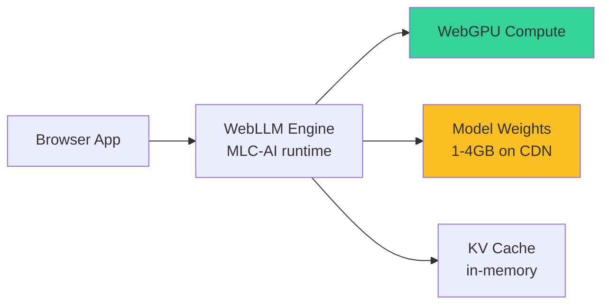

# 🧠 WebLLM — Full LLMs in the Browser

**WebLLM** (MLC-AI, 2024+) runs **real LLMs** in the browser via WebGPU. Models are quantized (Q4F16_1 typically) to fit in 1-4GB of GPU memory. **Llama-3.2-1B, Phi-3-mini-4B, Gemma-2-2B, Qwen-2-1.5B** all runnable. Token generation uses WebGPU compute shaders; model weights stream from a CDN on first load. **First token latency: 5-30 seconds** (model load + compile); subsequent tokens: **50-500ms**.

This is the most ambitious of the on-device ML frameworks. WebLLM enables a new category of product: **private LLM chatbots** for healthcare, legal, finance; **offline-capable assistants** for field work; **zero-cost demos** for portfolio projects; and **serverless AI** where the user pays with their hardware instead of your GPU bill.

This note covers WebLLM's architecture, the available models, the OpenAI-compatible API, real-time streaming, and the production patterns for model caching, error handling, and fallback to server-side inference.

## 🎯 Learning Objectives

- Use WebLLM's **OpenAI-compatible API** in the browser.
- Choose the right model for your use case (Llama-3.2-1B, Phi-3-mini, etc.).
- Stream **token-by-token** generation.
- Cache models in **Cache API or IndexedDB** for fast reload.
- Handle the **5-30 second initial load** gracefully.
- Fall back to **server-side inference** when WebGPU is unavailable.

## 1. The WebLLM Architecture



**Flow**:
1. Browser loads HTML + JS (small).
2. User triggers model load (e.g., clicks "Start").
3. WebLLM downloads weights from CDN (1-4GB).
4. WebGPU compiles the model (shader compilation).
5. First token generated.
6. Subsequent tokens: 50-500ms each via WebGPU.

## 2. Available Models

| Model | Size | Speed (tokens/s) | Quality | Use case |
|-------|------|-------------------|---------|----------|
| **Llama-3.2-1B-Instruct** | 1B (~0.7GB q4) | 30-60 | Good for Q&A | Lightweight assistants |
| **Llama-3.2-3B-Instruct** | 3B (~2GB q4) | 20-40 | Better reasoning | Production demos |
| **Phi-3-mini-4K-Instruct** | 3.8B (~2.5GB q4) | 20-35 | Microsoft quality | Reasoning tasks |
| **Gemma-2-2B-IT** | 2.6B (~1.5GB q4) | 25-45 | Google quality | Multi-domain |
| **Qwen-2-1.5B-Instruct** | 1.5B (~1GB q4) | 35-60 | Multilingual | i18n products |
| **TinyLlama-1.1B-Chat** | 1.1B (~0.7GB q4) | 40-70 | Lightweight | Edge/mobile |

**Speed depends on GPU**: RTX 4090 → 60 tok/s for 1B; integrated graphics → 15 tok/s. Mobile GPUs typically 5-15 tok/s.

## 3. Basic Usage — OpenAI-Compatible API

```javascript
import { CreateMLCEngine } from "@mlc-ai/web-llm";

async function main() {
  // 1. Initialize the engine (loads model on first call)
  const engine = await CreateMLCEngine("Llama-3.2-1B-Instruct-q4f16_1-MLC", {
    initProgressCallback: (progress) => {
      console.log(`Loading: ${progress.text} (${progress.progress}%)`);
    },
  });

  // 2. OpenAI-compatible chat completion
  const response = await engine.chat.completions.create({
    messages: [
      { role: "system", content: "You are a helpful assistant." },
      { role: "user", content: "What is WebGPU?" },
    ],
    temperature: 0.7,
    max_tokens: 256,
  });

  console.log(response.choices[0].message.content);
  // "WebGPU is a web standard API that provides..."
}

main();
```

## 4. Streaming Token-by-Token

```javascript
const stream = await engine.chat.completions.create({
  messages: [...],
  stream: true,
  max_tokens: 256,
});

for await (const chunk of stream) {
  const content = chunk.choices[0]?.delta?.content || "";
  document.getElementById("output").textContent += content;
}
```

The first chunk arrives in 5-30 seconds (model load); subsequent chunks in 50-500ms.

## 5. Model Loading and Caching

### First Load (5-30 seconds)

```javascript
async function loadModel() {
  const start = performance.now();
  const engine = await CreateMLCEngine("Llama-3.2-1B-Instruct-q4f16_1-MLC", {
    initProgressCallback: (progress) => {
      // Update UI: "Downloading: 45%"
      updateLoadingUI(progress.text, progress.progress);
    },
  });
  console.log(`Loaded in ${(performance.now() - start) / 1000}s`);
  return engine;
}
```

### Caching for Re-Load (instant)

```javascript
// WebLLM caches in IndexedDB by default
// Subsequent loads reuse the cache — no re-download

// Custom cache management
async function clearCache() {
  const dbs = await indexedDB.databases();
  for (const db of dbs) {
    if (db.name.startsWith("webllm")) {
      indexedDB.deleteDatabase(db.name);
    }
  }
}
```

### Progress UI

```html
<!-- HTML -->
<div id="loading">
  <progress id="progress-bar" max="100" value="0"></progress>
  <p id="progress-text">Initializing...</p>
</div>
```

```javascript
function updateLoadingUI(text, progress) {
  document.getElementById("progress-bar").value = progress;
  document.getElementById("progress-text").textContent = `${text} (${progress}%)`;
}
```

## 6. Conversation Memory

```javascript
class ChatSession {
  constructor(engine) {
    this.engine = engine;
    this.messages = [];
  }

  async chat(userMessage) {
    // Add user message to history
    this.messages.push({ role: "user", content: userMessage });

    // Trim history if too long (1B models have ~4K context)
    if (this.messages.length > 20) {
      this.messages = [
        this.messages[0],  // system message
        ...this.messages.slice(-19),
      ];
    }

    // Generate response
    const response = await this.engine.chat.completions.create({
      messages: this.messages,
      max_tokens: 512,
    });

    const assistantMessage = response.choices[0].message.content;
    this.messages.push({ role: "assistant", content: assistantMessage });

    return assistantMessage;
  }
}

// Usage
const chat = new ChatSession(engine);
const reply = await chat.chat("Hello!");
console.log(reply);
```

## 7. Embeddings via WebLLM

```javascript
const embedding = await engine.embedding.create({
  input: "What is WebGPU?",
});

console.log(embedding.data[0].embedding);  // 2048-dim vector
```

Useful for browser-side RAG: embed the user's query, search a vector DB.

## 8. Fallback to Server-Side Inference

```javascript
async function robustChat(userMessage, messages) {
  // 1. Try WebLLM first
  if (window.webllmEngine && navigator.gpu) {
    try {
      return await webllmEngine.chat.completions.create({
        messages: [...messages, { role: "user", content: userMessage }],
      });
    } catch (e) {
      console.warn("WebLLM failed, falling back to server:", e);
    }
  }

  // 2. Fallback to server (OpenAI / Anthropic)
  const response = await fetch("https://api.openai.com/v1/chat/completions", {
    method: "POST",
    headers: { Authorization: `Bearer ${OPENAI_API_KEY}` },
    body: JSON.stringify({
      model: "gpt-4o-mini",
      messages: [...messages, { role: "user", content: userMessage }],
    }),
  });
  return response.json();
}
```

The browser tries WebLLM first; falls back to a server API for users without WebGPU or for high-quality responses.

## 9. Production Patterns

### Lazy Loading on First User Action

```javascript
let engine = null;
async function getEngine() {
  if (!engine) {
    engine = await CreateMLCEngine("Llama-3.2-1B-Instruct-q4f16_1-MLC");
  }
  return engine;
}

// Don't load until user clicks "Start Chat"
document.getElementById("start-chat").addEventListener("click", async () => {
  const engine = await getEngine();
  // Start the conversation
});
```

This avoids loading the 1GB model until needed.

### Worker Thread for Non-Blocking Inference

```javascript
// Run inference in a Web Worker to avoid blocking the UI
const worker = new Worker("./webllm-worker.js");

worker.postMessage({ type: "init", model: "Llama-3.2-1B-Instruct-q4f16_1-MLC" });
worker.postMessage({ type: "chat", messages: [...] });

worker.onmessage = (e) => {
  if (e.data.type === "token") {
    document.getElementById("output").textContent += e.data.content;
  }
};
```

## 10. ❌/✅ Antipatterns

### ❌ Loading model on page load

```javascript
// ⚠️ 1GB+ download before user does anything
window.addEventListener("load", async () => {
  const engine = await CreateMLCEngine("Llama-3.2-1B-...");
});
```

### ✅ Lazy load on user action

```javascript
// ✅ Load only when user initiates
document.getElementById("start-chat").addEventListener("click", loadModel);
```

### ❌ Synchronous blocking UI

```javascript
// ⚠️ UI freezes during 30s model load
const response = await engine.chat.completions.create({ ... });
```

### ✅ Streaming with progress

```javascript
// ✅ Stream tokens as they're generated
for await (const chunk of stream) {
  document.getElementById("output").textContent += chunk.delta.content;
}
```

### ❌ Using 70B model in browser

```javascript
// ⚠️ 40GB+ weights — won't fit on consumer hardware
const engine = await CreateMLCEngine("Llama-3-70B-...");
```

### ✅ Use 1-3B models

```javascript
// ✅ Fits in 1-4GB GPU memory, runs on consumer hardware
const engine = await CreateMLCEngine("Llama-3.2-1B-...");
```

### ❌ Sending PII to the model anyway

```javascript
// ⚠️ Even local models can have telemetry, browser extensions, etc.
engine.chat.completions.create({ messages: [{ role: "user", content: user.ssn }] });
```

### ✅ Sanitize inputs

```javascript
// ✅ Strip PII before any model call
function sanitize(text) {
  return text.replace(/\d{3}-?\d{2}-?\d{4}/g, "[SSN]");
}

engine.chat.completions.create({
  messages: [{ role: "user", content: sanitize(userMessage) }],
});
```

## 11. Production Reality

**Caso real — Portfolio Privacy Demo:** Llama-3.2-1B chatbot that runs entirely in the browser. User data never leaves their device. 5-second initial load, then 50-200ms per token on RTX 3060. **Use case**: legal document Q&A where data must stay local.

**Caso real — Field Service App:** Offline-capable technical support chatbot. Service technicians in remote areas download the model once; subsequent queries work without internet. Phi-3-mini-4B (better reasoning). 8-second initial load, then 100-300ms per token.

## 📦 Compression Code

```javascript
// 📦 Compression: WebLLM in browser in 30 lines

import { CreateMLCEngine } from "@mlc-ai/web-llm";

let engine;

async function initEngine() {
  if (engine) return engine;
  engine = await CreateMLCEngine("Llama-3.2-1B-Instruct-q4f16_1-MLC", {
    initProgressCallback: (p) => updateUI(p.text, p.progress),
  });
  return engine;
}

async function chat(userMessage) {
  const engine = await initEngine();
  const stream = await engine.chat.completions.create({
    messages: [{ role: "user", content: userMessage }],
    stream: true,
    max_tokens: 256,
  });

  let response = "";
  for await (const chunk of stream) {
    response += chunk.choices[0]?.delta?.content || "";
    updateOutput(response);
  }
  return response;
}

// UI
document.getElementById("chat-form").addEventListener("submit", async (e) => {
  e.preventDefault();
  const input = document.getElementById("user-input").value;
  await chat(input);
});
```

## 🎯 Key Takeaways

1. **WebLLM runs 1-3B LLMs in the browser** via WebGPU — privacy, offline, zero-cost.
2. **OpenAI-compatible API** — easy to swap from server-side.
3. **5-30s initial load**, then 50-500ms per token.
4. **Cache in IndexedDB** — second load is instant.
5. **Lazy load** — don't download 1GB on page load.
6. **Stream tokens** — UI shows progress.
7. **Fall back to server** for users without WebGPU or high-quality needs.

## References

- [[00 - Welcome to WebGPU and On-Device ML|Welcome]] — course map.
- [[01 - WebGPU Fundamentals|WebGPU]] — the substrate.
- [[02 - ONNX Runtime Web - ML in the Browser|ONNX Runtime]] — for embeddings/classifiers.
- [[04 - Transformers.js - HuggingFace in Browser|Transformers.js]] — for HF pipelines.
- WebLLM docs: https://github.com/mlc-ai/web-llm
- MLC-AI models: https://mlc.ai/models/