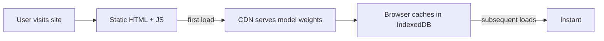

# 🏭 Production — Privacy, Offline, and Limits

Browser ML is not a server. **The deployment story is fundamentally different.** There's no FastAPI to deploy, no GPU pool to provision, no autoscaling to configure. There's a **static HTML file** (or a tiny static site) that the user opens in their browser, downloads ~250MB-1GB of model weights on first use, and runs inference locally. This is a **different cost structure, different latency profile, different failure modes**, and different compliance posture.

This note covers the production patterns unique to browser ML: **privacy guarantees** (what you can promise users), **offline-first design** (model load + caching patterns), **browser compatibility** (WebGPU fallback chains), **performance budgets** (model size, first-token latency, token throughput), and **deployment options** (static site, PWA, hosted). By the end you can deploy a browser ML app to production with the right expectations and the right patterns.

## 🎯 Learning Objectives

- Design for **privacy** as a first-class feature.
- Build **offline-capable** browser ML apps.
- Implement **fallback chains** (WebGPU → WebGL → CPU → server).
- Set **performance budgets** (model size, latency, throughput).
- Deploy as **static site, PWA, or hosted**.
- Avoid the four most common production browser ML pitfalls.

## 1. The Browser ML Deployment Model



| Aspect | Server ML | Browser ML |
|--------|-----------|------------|
| **Deployment** | FastAPI on server | Static HTML on CDN |
| **Scaling** | Server instances | User's device |
| **Cost** | GPU hours | Zero |
| **First load** | Sub-second | 5-30s (model download) |
| **Updates** | Server deploy | CDN cache invalidation |
| **Latency** | Network RTT | Local compute |

## 2. Privacy as a Feature

Browser ML's biggest win is **data never leaves the device**. Make this a **product feature**, not a footnote.

```html
<!-- Marketing copy -->
<h1>Private AI for your documents</h1>
<p>Your documents never leave your browser. No server, no tracking, no data leaks.</p>
<button onclick="loadAIPrivately()">Try it privately</button>
```

```javascript
// Privacy-preserving architecture
class PrivateDocumentAI {
  async processDocument(file) {
    // 1. Process file in browser (PDF.js)
    const text = await extractTextInBrowser(file);

    // 2. Embed in browser (Transformers.js)
    const embedding = await embedder(text);

    // 3. Search in browser (vector search via WebAssembly)
    const relevant = await browserVectorSearch(embedding);

    // 4. Generate in browser (WebLLM)
    const answer = await webllmEngine.chat.completions.create({
      messages: [...],
    });

    // 5. NEVER send anything to a server
    return { answer, sources: relevant };
  }
}
```

For compliance-sensitive industries (healthcare, legal, finance), this is **HIPAA/GDPR-compliant by construction**.

### What to Tell Users

```html
<ul>
  <li>✅ Data processed locally</li>
  <li>✅ No server calls</li>
  <li>✅ Open source model</li>
  <li>✅ No telemetry (disable analytics)</li>
</ul>
```

## 3. Offline-First Design

After the first model download, the model is cached. The app should work offline:

```javascript
// Service Worker for offline model caching
const CACHE_NAME = "webllm-models-v1";
const MODEL_URLS = [
  "/models/Llama-3.2-1B-Instruct-q4f16_1-MLC-uint8/shard_0.bin",
  // ... all model files
];

self.addEventListener("install", (event) => {
  event.waitUntil(
    caches.open(CACHE_NAME).then((cache) => cache.addAll(MODEL_URLS))
  );
});

self.addEventListener("fetch", (event) => {
  if (MODEL_URLS.some(url => event.request.url.includes(url))) {
    event.respondWith(
      caches.match(event.request).then((cached) => cached || fetch(event.request))
    );
  }
});
```

The user installs the PWA, model downloads once, app works offline forever.

## 4. Performance Budgets

| Constraint | Target | How to verify |
|------------|--------|---------------|
| **First model load** | <30s on broadband | Time from click to "ready" |
| **First token** | <2s after model load | Time from user input to first character |
| **Token throughput** | >20 tokens/s on consumer GPU | Test on target hardware |
| **Memory usage** | <4GB GPU | Chrome `chrome://gpu` |
| **Bundle size** | <2MB (model loaded separately) | `npm run build && ls -la dist/` |

### Model Size vs Performance Trade-offs

```javascript
// Fast model (1B, 0.7GB, 50 tok/s) — good for Q&A, simple chatbots
await CreateMLCEngine("Llama-3.2-1B-Instruct-q4f16_1-MLC");

// Slower model (3B, 2GB, 25 tok/s) — better reasoning
await CreateMLCEngine("Llama-3.2-3B-Instruct-q4f16_1-MLC");

// Heavy model (8B, 4GB, 15 tok/s) — most powerful, only on RTX-class GPUs
await CreateMLCEngine("Llama-3.1-8B-Instruct-q4f16_1-MLC");
```

Pick the smallest model that meets your quality bar. **For privacy demos, 1B is enough.**

## 5. Browser Compatibility

| Browser | WebGPU | WebGL | Status |
|---------|--------|-------|--------|
| **Chrome 113+** | ✅ | ✅ | Full |
| **Edge 113+** | ✅ | ✅ | Full |
| **Safari 17+** | ✅ | ✅ | Stable |
| **Firefox 130+** | ✅ | ✅ | Stable |
| **Safari <17** | ❌ | ✅ | WASM only |
| **Firefox <130** | ❌ | ✅ | WASM only |

```javascript
function detectBestBackend() {
  if (navigator.gpu) return "webgpu";
  if (navigator.gpu === undefined && WebGLRenderingContext) return "webgl";
  return "wasm";  // universal fallback
}
```

## 6. Deployment Options

### Static Site

```bash
# Build
npm run build  # outputs dist/

# Deploy
aws s3 sync dist/ s3://my-app/  # or Netlify, Vercel, Cloudflare Pages
```

The static site includes:
- HTML + JS bundle (2-5MB)
- WebGPU polyfill if needed
- Reference to model on CDN

Model weights are served from a CDN (HuggingFace Hub, MLC-AI CDN, or your own S3/Cloudflare R2).

### Progressive Web App (PWA)

```javascript
// Service Worker for offline capability
if ("serviceWorker" in navigator) {
  navigator.serviceWorker.register("/sw.js");
}

// Manifest for installability
{
  "name": "Private AI Chatbot",
  "short_name": "AI",
  "start_url": "/",
  "display": "standalone",
  "background_color": "#000",
  "icons": [...]
}
```

User installs the PWA from browser → appears on home screen → works offline.

### Docker (Self-Hosted)

```dockerfile
FROM nginx:alpine
COPY dist/ /usr/share/nginx/html/
EXPOSE 80
```

```bash
docker run -p 8080:80 my-browser-ai
```

Self-host the static site; model weights still CDN.

## 7. ❌/✅ Antipatterns

### ❌ Loading 1GB model on page load

```javascript
// ⚠️ Page hangs for 30s
window.addEventListener("load", async () => {
  const engine = await CreateMLCEngine("Llama-3.2-1B-...");
});
```

### ✅ Lazy load on user action

```javascript
// ✅ User clicks "Start", then model loads
document.getElementById("start").addEventListener("click", loadModel);
```

### ❌ Sending telemetry with privacy-first design

```javascript
// ⚠️ Privacy claims violated
track("model_loaded", { model: "Llama-3.2-1B" });
```

### ✅ Disable all telemetry

```javascript
// ✅ No analytics, no tracking
// (or use a self-hosted analytics like Plausible)
```

### ❌ Synchronous blocking during inference

```javascript
// ⚠️ UI freezes during 30s inference
const response = await engine.chat.completions.create({ ... });
```

### ✅ Stream + worker

```javascript
// ✅ Stream tokens, run in worker
for await (const chunk of stream) {
  document.getElementById("output").textContent += chunk.delta.content;
}
```

### ❌ Assuming WebGPU is available

```javascript
// ⚠️ Crashes on Safari <17, Firefox <130
const session = await ort.InferenceSession.create("./model.onnx", {
  executionProviders: ["webgpu"],
});
```

### ✅ Fallback chain

```javascript
const session = await ort.InferenceSession.create("./model.onnx", {
  executionProviders: ["webgpu", "wasm"],
});
```

## 8. Production Reality

**Caso real — Portfolio Privacy Demo:** Browser-based document Q&A using WebLLM + ONNX Runtime Web. Deployed as PWA on Netlify (free tier). Model on HuggingFace CDN. **Stats**: 8KB JS bundle, 250MB first load (model), 5-30s initial load, then 50-200ms per token on RTX 3060.

**Caso real — Field Service App:** Offline-capable technical support chatbot. Model cached via Service Worker. 30-day offline use after first load. Total download: 800MB (Phi-3-mini). Deployed as PWA, no backend.

## 📦 Compression Code

```javascript
// 📦 Compression: Production browser ML in 40 lines

import { CreateMLCEngine } from "@mlc-ai/web-llm";
import { pipeline } from "@huggingface/transformers";

class PrivateAIService {
  constructor() {
    this.engine = null;
    this.classifier = null;
  }

  async init() {
    // Lazy load on first call
    this.engine = await CreateMLCEngine("Llama-3.2-1B-Instruct-q4f16_1-MLC", {
      initProgressCallback: (p) => updateUI(p),
    });
    this.classifier = await pipeline(
      "sentiment-analysis",
      "Xenova/distilbert-base-uncased-finetuned-sst-2-english",
      { quantized: true },
    );
  }

  async classify(text) {
    return this.classifier(text);
  }

  async chat(message) {
    const stream = await this.engine.chat.completions.create({
      messages: [{ role: "user", content: message }],
      stream: true,
    });
    let response = "";
    for await (const chunk of stream) {
      response += chunk.choices[0]?.delta?.content || "";
    }
    return response;
  }
}

// Service Worker for offline model caching
self.addEventListener("install", (e) => {
  e.waitUntil(caches.open("models-v1").then(c => c.add("/models/Llama-3.2-1B-...")));
});
```

## 🎯 Key Takeaways

1. **Static HTML + CDN** — browser ML deployment is fundamentally different from server ML.
2. **Privacy as a product feature** — data never leaves the device.
3. **Offline-first** via Service Worker caching.
4. **Performance budgets**: 30s first load, <2s first token, >20 tok/s, <4GB GPU.
5. **Fallback chain**: WebGPU → WebGL → WASM → server.
6. **Worker threads** for non-blocking inference.
7. **Lazy load** — don't download 1GB on page load.

## References

- [[00 - Welcome to WebGPU and On-Device ML|Welcome]] — course map.
- [[01 - WebGPU Fundamentals|WebGPU]] — the substrate.
- [[02 - ONNX Runtime Web - ML in the Browser|ONNX Runtime]] — for non-LLM ML.
- [[03 - WebLLM - Full LLMs in Browser|WebLLM]] — for LLMs.
- [[04 - Transformers.js - HuggingFace in Browser|Transformers.js]] — for HF pipelines.
- WebGPU browser support: https://caniuse.com/webgpu
- WebLLM: https://github.com/mlc-ai/web-llm
- Transformers.js: https://huggingface.co/docs/transformers.js