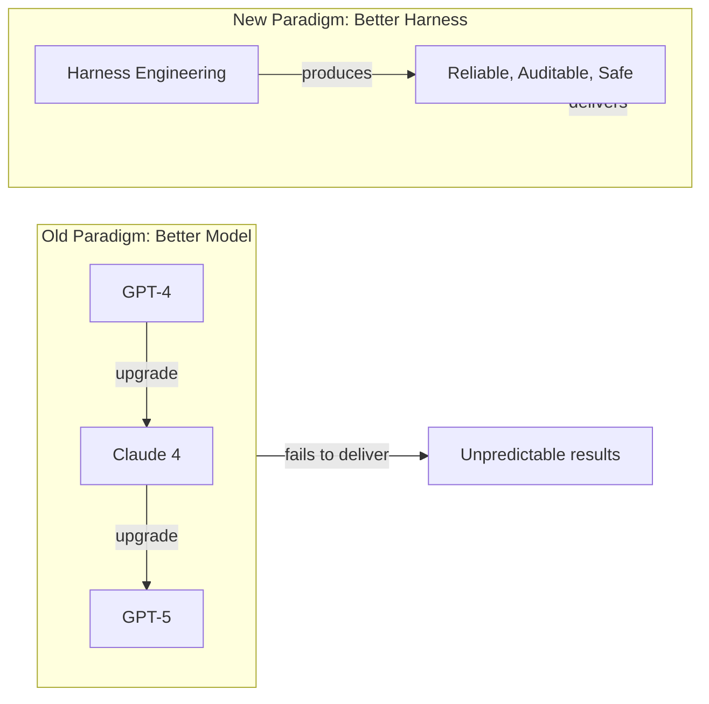
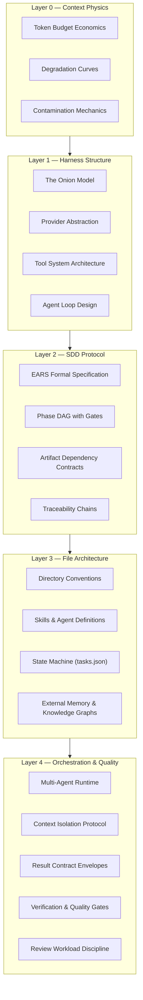

# 00 — Welcome to Harness Engineering and SDD

**Welcome.** You are about to learn the most undervalued skill in AI-assisted development: not writing better prompts, but building the deterministic infrastructure that surrounds and channels the stochastic intelligence of LLMs.

## 🎯 Learning Objectives

- Understand why "better model" stopped being the answer — and what replaced it
- Grasp the three fundamental forces that make AI development fail without control structures
- Map the complete harness stack: from context physics to multi-agent orchestration
- Internalize the paradigm shift: the repository IS the harness, not a service or framework

---

## The Paradigm Shift

For the first two years of LLM-based coding tools, the industry chased a single variable: **model capability**. Every month brought a new model with higher benchmark scores, larger context windows, better reasoning. The assumption was simple: smarter models would write better code.

Reality proved harsher. Teams using the most advanced models still experienced:
- Agents rewriting the wrong files
- Decisions made three turns ago silently forgotten
- Implementations drifting from architecture without warning
- Complete inability to audit why code changed

**The variable that actually matters is not the model — it is the control system around the model.**



This course is about the New Paradigm. It teaches you to build infrastructure that transforms LLMs from brilliant-but-unreliable collaborators into disciplined engineering systems.

---

## The Problem That Created This Discipline

In late 2024 and throughout 2025, AI coding tools reached production capability. Teams integrated them into real workflows. And three failure patterns emerged with brutal consistency:

### 1. Contaminated Context

The agent drags abandoned hypotheses, failed explorations, and dead-end turns into every new interaction. By turn 5, it's attending to debris. By turn 10, it's producing hallucinated hybrids of four different approaches — none of which were fully committed to.

### 2. Unpredictable Execution

Give an agent "add OAuth2 authentication" and it might:
- Refactor your entire middleware architecture
- Add three new dependencies you didn't ask for
- Break the rate limiter while "improving" authentication
- Explore six different approaches before implementing any

The agent doesn't know the difference between exploration mode and implementation mode. Without constraints, it oscillates between both on every turn.

### 3. Zero Traceability

Chat-driven development leaves no record. The conversation that produced the critical architectural decision was summarized away by the context compressor. The rationale for choosing library X over Y disappeared when the session closed. When something breaks three weeks later, you have no way to determine what changed or why.

**These three problems — contaminated context, unpredictable execution, zero traceability — define the problem space of Harness Engineering.** Every concept in this course exists to solve one or more of them.

---

## What Is Harness Engineering?

> Harness Engineering is the discipline of building deterministic control structures around stochastic AI agents, using files as the control plane.

It is NOT:
- **Prompt engineering.** Prompting changes what the model outputs. Harness engineering changes how output is constrained, routed, validated, and recorded.
- **A framework.** (LangChain, CrewAI, etc.) Frameworks impose opinionated abstractions as library dependencies. A harness is a file-based convention in your repository. It has no runtime dependency.
- **RAG.** Retrieval adds information. Harness controls process. They operate at different layers.
- **Just "good practices."** Harness engineering is a formal, layered discipline with proven principles — the Onion Model, the Simplicity Principle, Context Isolation, Phase Gating — not a collection of tips.

The harness provides direction without removing agency. It creates boundaries that channel creativity rather than suppressing it. It turns the agent from a brilliant soloist into a disciplined orchestra member.

---

## The Complete Stack: Five Layers of Control



Every layer constrains the layer below without eliminating it. The LLM's creativity is preserved — but channeled through increasingly precise boundaries. This is the essential insight: **you don't make AI safe by limiting it. You make it safe by giving it structure.**

---

## Course Map

| # | Note | Core Question |
|---|------|---------------|
| 00 | **Welcome** (this) | Why does AI development need control infrastructure? |
| 01 | [[01 - The Context Crisis]] | What happens when attention spans 200K tokens but quality degrades at 40K? |
| 02 | [[02 - The Three Pillars]] | Why are Context, Harness, and SDD an indivisible system? |
| 03 | [[03 - Harness Engineering - Architecture of Control]] | How do we build the control structures from first principles? |
| 04 | [[04 - Specification-Driven Development]] | What formal protocol runs inside the harness? |
| 05 | [[05 - File Architecture]] | Where does everything live on disk — and why it matters? |
| 06 | [[06 - Multi-Agent Orchestration and Capstone]] | How does the complete system operate in motion? |
| 07 | [[07 - Complete Harness Taxonomy]] | What are the ~20 harness patterns and how do they compose? |
| 08 | [[08 - Verification and Quality Gates]] | How do we ensure the harness actually works? |
| 09 | [[09 - Tools, Provider Abstraction, and Memory]] | How do tools, LLM providers, and memory integrate into the system? |

---

## The Core Insight

```
Chat-driven development  →  Fragile, untraceable, unpredictable
Harness-driven development →  Auditable, reproducible, safe
```

The difference is never the model. It is whether the model operates inside a structured control system that manages context deliberately, enforces phases mechanically, and records every decision as a file.

By the end of this course, you will understand every layer of this control system — from the physics of AI attention to the deterministic orchestration of multi-agent systems.

---

## Prerequisites

- **Software engineering fundamentals.** You understand code review, CI/CD, testing, version control, and the difference between specification and implementation.
- **AI coding tools experience.** You have used Claude Code, Cursor, Copilot, or similar on a real project. You have experienced at least one "agent went rogue" moment and felt the absence of control.
- **Command-line comfort.** Harnesses live in bash scripts, directory trees, and file conventions — not GUIs. You should be comfortable with `mkdir`, `chmod`, `git`, and shell scripting.
- **No ML expertise required.** This is software engineering applied to AI tooling — not machine learning research.

---

## Key References

This course synthesizes knowledge from multiple production-grade sources:

| Source | Contribution |
|--------|-------------|
| **Vercel D0 Research** | Context degradation curves, tool minimalism principles |
| **Gentle Framework** | 20-harness taxonomy, orchestrator as state machine, context compiler |
| **Claude Code Architecture** | Subagent spawning, skill systems, provider abstraction patterns |
| **Fazt Code SDD Demonstration** | Practical EARS-to-implementation workflow patterns |
| **Graphify / Knowledge Graphs** | External memory as session-bootstrap optimization |
| **Alan Buscalas (Gentle Creator)** | Complete harness philosophy: phase gating, result contracts, agent isolation |

Cross-references within this vault:
- [[../13 - Go Engineering/13 - Go Engineering]] — Language-level harness patterns (provider abstraction, interfaces)
- [[../07 - AI Agents/07 - AI Agents]] — Agent architecture fundamentals
- [[../09 - MLOps/09 - MLOps]] — Production ML infrastructure patterns
- [[../06 - Large Language Models/17 - ColBERT, SGLang and Next-Gen Inference]] — Inference optimization that benefits from harness control

---

## Navigating This Course

Read linearly. Each note assumes the previous. The stack builds from physics to systems:

```
Context Physics → Control Structures → Formal Protocol → File Layout → Runtime Orchestration → Verification → Integration
```

Layer 0 teaches you what you're working within. Layers 1-4 teach you what you build on top. The capstone (Note 06) demonstrates the complete system in motion.

Let's begin with the physics: [[01 - The Context Crisis]].

---

*Course synthesized from Vercel D0 research, Gentle framework, Claude Code architecture, Fazt Code SDD demonstrations, and production harness engineering patterns. May 2026.*