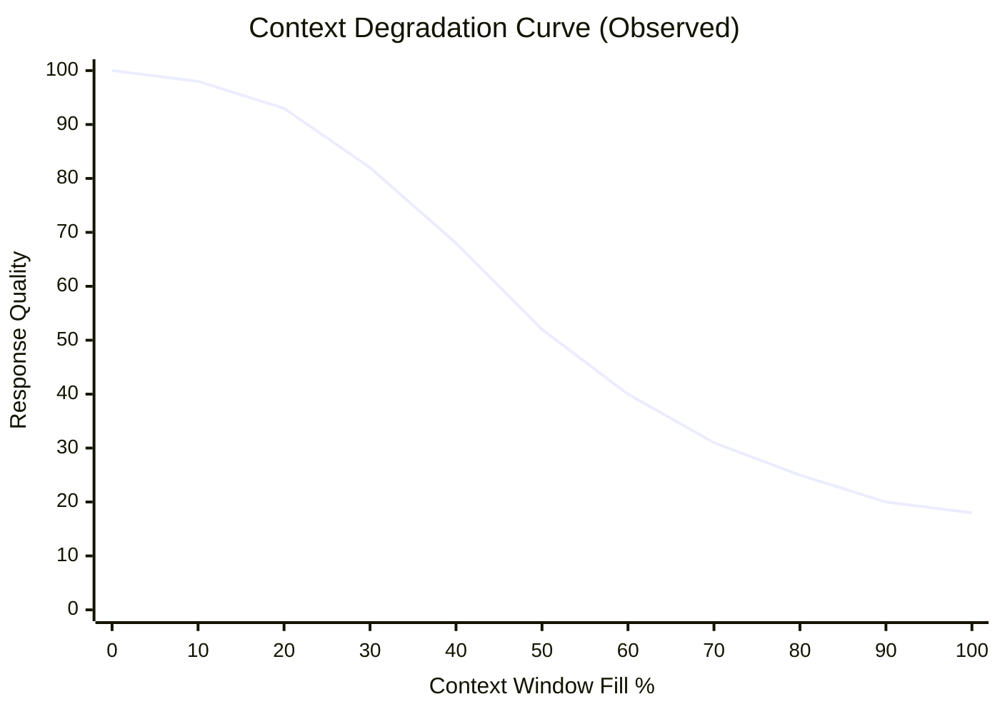
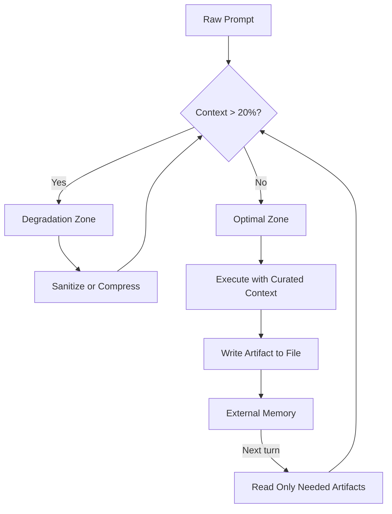

# 01 — The Context Crisis: Why AI Development Fails

## 🎯 Learning Objectives

- Understand the context window as a finite resource — not a dumping ground
- Master the degradation curve: why quality collapses at 20-40% fill, not at capacity
- Internalize the three failure modes that define Harness Engineering: Contaminated Context, Unpredictable Execution, Zero Traceability
- Recognize contamination as a context management failure, not a model failure
- Apply "Lost in the Middle" research to harness design: position within the window matters as much as fill percentage
- Understand the Session Reset Problem — why every new session starts from zero and burns the same tokens
- Execute five context engineering strategies with mechanical justification for each
- Embrace the core paradox: less curated context produces better results than more raw context

## Introduction

Every LLM-powered development tool operates within a context window — a finite sliding buffer of tokens that holds system prompts, tool definitions, conversation history, user messages, and model outputs. This window is the medium through which the model perceives the world. It is the only channel through which information reaches the model's attention mechanism. Every instruction you give, every file you include, every turn of conversation — all of it competes for the same scarce budget. And yet the dominant engineering intuition is catastrophic: "More information equals better results. I'll stuff everything in just in case."

**This intuition is wrong.** It is not merely suboptimal; it is the root cause of the most persistent failure patterns in AI-assisted development. Agents that write code in the wrong files. Decisions made three turns ago silently forgotten. Implementations that drift from architecture without warning. Complete inability to audit why code changed. These are not model failures — they are context management failures. And they happen because the community has treated the context window as infinite storage rather than what it actually is: a degradable resource governed by well-understood physics.

Context Engineering is the discipline of managing this resource deliberately. Before you can build a harness — before you can structure workflows, define phase gates, or orchestrate subagents — you must understand the physics of the medium everything operates within. The context window is not a black box. It has a measurable degradation curve. It has a geometry where position matters as much as volume. It has contamination dynamics that compound silently across turns. These are not mysteries — they are well-characterized properties that can be engineered around, but only if you understand them. This note establishes the foundation. Everything that follows — [[02 - The Three Pillars]], [[03 - Harness Engineering - Architecture of Control]], the SDD protocol, the file architecture, the orchestration layer — assumes you are managing context deliberately. If context is contaminated or degraded, no amount of harness structure can recover from it.

---

## 1. The Context Window Is a Finite Token Budget

Every LLM interaction operates inside the following equation:

```
context_window = system_prompt + tool_definitions + conversation_history + user_message + model_output
```

Think of the context window as a fixed-capacity communication channel between you and the model. At the time of writing (May 2026), state-of-the-art windows reach 200K to 1M tokens — roughly the length of a 400-page novel. This apparent abundance creates a dangerous illusion: the belief that context is essentially infinite and that including more information can only help.

**The critical insight is not the ceiling — it is the degradation curve before the ceiling.**

To understand why, consider the attention mechanism that powers every transformer-based model. When the model processes your prompt, it computes attention weights — numerical scores that determine how much each token "pays attention" to every other token. These weights are computed via the scaled dot-product attention formula:

```
Attention(Q, K, V) = softmax(QK^T / √d_k) × V
```

The softmax function normalizes the raw attention scores into a probability distribution — every token in the window receives some weight, and all weights sum to 1. This is the critical mathematical constraint: the attention budget is exactly 1.0 for each attention head, distributed across every token in the window. You cannot increase the budget. You cannot allocate "extra" attention to important tokens. Every token added to the window dilutes the average weight per token — this is mathematically guaranteed, not an empirical observation.

At 10% fill of a 200K window (20K tokens), the model distributes this fixed budget across ~200 high-relevance tokens — precise, focused, accurate. At 40% fill (80K tokens), the same fixed budget must spread across ~800 tokens. At 100% fill (200K tokens), across ~2000 tokens. The attention weight per relevant token drops proportionally with window fill — a direct consequence of the softmax normalization, not an implementation quirk.

**Every irrelevant token dilutes attention to the relevant ones.** A log line from turn three, a stack trace from an abandoned approach, a tool output that was already handled — each receives its share of the 1.0 attention budget, stealing weight from the current task. Crucially, the model cannot distinguish between "this token is here for historical context" and "this token is critical to the current operation." The softmax function is blind to human concepts of relevance. It distributes weight mechanically across all tokens. You, the harness designer, must enforce relevance by controlling which tokens enter the window in the first place.

This is not a bug. This is a property of the architecture — and it is the correct behavior for the design intent. Transformers were built to process entire sequences uniformly, without built-in assumptions about which parts matter more. The architecture successfully does exactly that. The responsibility for distinguishing relevant from irrelevant falls on the context engineering layer, not the model. If you feed the model a window containing abandoned hypotheses alongside active instructions, the model will attend to all of them — correctly, by design. The error is yours for allowing obsolete tokens into the attention field.

---

## 2. Context Degradation: The Physics of Diluted Attention



The Vercel AI team, building their D0 research coding agent, produced one of the most consequential findings in harness engineering: **response quality begins degrading when the context window reaches only 20-40% capacity.** This is not documented model behavior. It is not a specification on any model card. It is an emergent phenomenon — observed consistently across multiple frontier models through systematic benchmarking of code generation accuracy against context fill percentage.

At 10% fill, models operate in the optimal zone. At 20%, slight quality reduction — barely perceptible, but measurable. At 40%, the degradation becomes material: the model begins missing constraints, introducing inconsistencies, or producing solutions that are syntactically correct but semantically misaligned with the specification. At 60%, hallucination frequency increases sharply — the model generates code referencing APIs that don't exist, files that were never mentioned, or architectural patterns that contradict the stated design. At 80% and above, output is essentially unreliable for production engineering tasks.

The degradation curve has a distinctive shape — not linear, but convex. The first 30% of the window produces near-perfect results. The next 30% produces a moderate decline. The final 40% is a cliff. This shape is mathematically predictable from the attention dilution dynamics. Early tokens reduce per-token attention weight linearly (from 1/200 to 1/400), which has minimal quality impact because the model still allocates sufficient weight to retrieve all critical tokens. Late additions push per-token weight below a retrieval threshold — the point where the model can no longer distinguish which tokens carry the instruction and which are noise. This threshold is the inflection point on the curve: roughly 30-40% fill for current architectures.

The convexity matters because it means the marginal cost of adding context increases with fill level. Adding 10K tokens at 10% fill costs you negligible quality. Adding the same 10K tokens at 60% fill can push you from "noticeable errors" to "frequent hallucinations." Context is not just a scarce resource — it is a resource whose marginal cost increases. This is the economic structure of attention: you pay progressively more in quality for each additional token as fill increases. The practical implication: if you can keep your operating context below 20% fill, you never reach the acceleration zone. Quality stays in the flat, optimal region where marginal attention cost is minimal.

| Fill % | 200K Window | Quality Impact |
|--------|-------------|----------------|
| 0-10%  | 0-20K       | Optimal |
| 10-20% | 20K-40K     | Near-optimal |
| 20-40% | 40K-80K     | **Degradation begins** |
| 40-60% | 80K-120K    | Noticeable errors |
| 60-80% | 120K-160K   | Frequent hallucinations |
| 80-100% | 160K-200K  | Unreliable |

The safe operating zone is below 20% fill. This is not conservative — it is the empirical boundary where models demonstrate consistent, reliable behavior. Every percentage point above 20% that you operate represents a trade-off you are making between context volume and output quality. You may choose to make that trade-off deliberately — but you should never make it accidentally.

---

## 3. The Three Problems That Define the Discipline

Alan Buscalas, creator of the Gentle framework, articulated the three fundamental failure modes that emerge when an AI agent operates without structure. These three problems are not theoretical corner cases — they are the consistent, repeated failure patterns observed across every team that has deployed AI coding tools into production workflows. Together, they define the problem space of Harness Engineering.

> "An Agent Harness is an operational structure around an AI agent. A harness doesn't remove power from the agent — it gives it direction. When you open any coding agent and say 'add feature,' the model has enormous capability. It can read, write, reason, execute commands, navigate code. But that capability without structure generates three fundamental problems." — Alan Buscalas

### Problem 1: Contaminated Context

The agent drags conversation history, mixes decisions across turns, loses focus, and ends up working with noise. After five turns of exploration, the context window contains fragments of four different approaches, none fully committed to and none fully discarded. The model attends to all of them, producing a hallucinated hybrid that combines elements of approach A (abandoned for incompatibility), approach B (rejected by the team), approach C (never formally proposed), and approach D (the actual task). The result is implementation that no one asked for and no one can trace back to a single coherent decision.

The mechanical cause: the model's attention mechanism distributes weight across all tokens in the window. Abandoned hypotheses receive the same computational consideration as active instructions. There is no built-in mechanism for "mark these tokens as obsolete" — that responsibility falls entirely on the context engineering layer.

### Problem 2: Unpredictable Execution

Given an instruction like "add OAuth2 authentication," the agent might: refactor the entire middleware architecture, add three new dependencies, break the rate limiter while "improving" authentication, touch files that had nothing to do with the task, or explore six different approaches before implementing any of them. Sometimes it explores; sometimes it implements; sometimes it invents; sometimes it touches files that were never in scope.

The mechanical cause: the model has no native concept of execution phases. It cannot distinguish between "I am currently exploring the problem space" and "I am now implementing the chosen solution." Without harness structure to enforce this distinction, the model oscillates between exploration and implementation on every turn — sometimes within the same response. The result is behavior that looks erratic but is actually the predictable output of a system operating without phase constraints.

### Problem 3: Zero Traceability

Why did the agent make that architectural decision? What was it trying to validate? What alternatives did it consider? What evidence supported its choice? In chat-driven development, these questions have no answers. The conversation that produced the critical decision was summarized away by context compression. The rationale disappeared when the session closed. When something breaks three weeks later — when a production incident traces back to a design choice made by an agent during a late-night session — there is no audit trail, no decision record, no way to determine what happened or why.

The mechanical cause: chat history is ephemeral. It lives in the context window, which is a sliding buffer that discards old content when new content arrives. Even if you save chat logs externally, they are unstructured prose — not auditable records. They don't encode decisions in a machine-queryable format. They don't link to the code changes those decisions produced. They don't survive the model upgrade cycle (a different model version will interpret the same chat differently). Files, by contrast, are permanent, structured, and version-controlled. They persist across sessions. They survive context resets. They can be reviewed, diff'd, and rolled back. The absence of file-based artifact production — the habit of keeping everything in conversation and nothing on disk — is the root cause of zero traceability.

Imagine auditing a production incident three months after deployment. The code that caused it exists in git. You can find the commit. But the commit message says "implement auth flow." Why was auth flow implemented that way? What alternatives were evaluated? What edge cases were considered and rejected? If those decisions lived only in a chat session that ended in December, they are gone. Not hard to find — gone. The session was ephemeral. The context was disposable. No file was written. No trace remains. This is not a hypothetical scenario — it is the default state of every project that develops with AI agents but without a harness.

**These three problems — contaminated context, unpredictable execution, zero traceability — are the defining challenges of AI-assisted development.** Every concept in Harness Engineering exists to solve one or more of them. Context Engineering addresses Problem 1 directly and enables solutions to Problems 2 and 3. The next layer — harness structure and phase gating — enforces execution predictability. The file architecture layer provides traceability through permanent, auditable artifacts. The entire stack is a layered response to these three fundamental failure modes.

---

## 4. Contaminated Context: The Silent Killer

Even when your context fits within the degradation-safe zone (below 20% fill), it can be **contaminated** — carrying forward abandoned hypotheses, incorrect assumptions, and exploration dead-ends from earlier turns. Contamination is the most insidious form of context failure because it produces output that looks reasonable but is built on foundations that were never validated.

Consider a three-turn interaction:

```
Turn 1: "Try approach A"       → agent explores approach A, discovers it requires a library not in the dependency tree
Turn 2: "Try approach B"       → agent sees the failure of A in context, gets confused about which constraints still apply
Turn 3: "Actually, approach C" → agent sees debris from A and B, produces a hybrid of all three approaches
```

At Turn 3, the model's attention mechanism is processing tokens from: the original instruction (approach A), the failure report (library missing), the revised instruction (approach B), the partial exploration of B (incomplete), and the new instruction (approach C). It attends to all of these. The output is not "approach C" — it is "approach C with vestigial elements of A and B that the model couldn't distinguish from active intent."

**This is not a model failure. This is a context management failure.** The model is doing exactly what it was designed to do: attending to everything in its window. The failure is in not cleaning the window before each new turn. The model has no way to know that Turns 1 and 2 are now irrelevant — it treats them with the same attention weight as Turn 3. If you feed it contaminated context, you get contaminated output. Garbage in, garbage out — but the "garbage" is not low-quality tokens; it is high-quality tokens that are simply no longer relevant.

Contaminated context is the number one cause of "agent went rogue" incidents in production harnesses. The classic pattern: an agent is working through a sequence of tasks, makes a wrong assumption early (perhaps about a file path or an API signature), and that assumption persists in context through subsequent turns. Each new instruction is interpreted through the lens of the wrong assumption. The agent doesn't "forget" the assumption — it actively applies it. By turn seven, the entire trajectory has diverged from the intended path, and the agent is confidently producing code based on a premise that was invalidated four turns ago.

The most dangerous property of contamination is that **it compounds.** Each turn that doesn't clean the context adds more debris. The model's output becomes increasingly disconnected from the current task. By turn five, the agent is operating in a context where 60% of the tokens are archival — old explorations, abandoned approaches, already-handled outputs. By turn ten, 80% is archival. The agent is essentially attending to its own history rather than your current instruction.

The human operator sees the agent "spiraling" and doesn't understand why — the instructions seem clear, the model is capable, but the output gets worse with each turn. The invisible variable is the contamination accumulating silently in the context window. Each turn adds to the pile, and the model faithfully attends to the growing debris field. This is why "start a new session" is often more effective than "try again" — the contamination, not the instruction, is the problem.

A formal way to think about contamination: define the **signal-to-noise ratio** of the context window. Signal tokens are those directly contributing to solving the current task. Noise tokens are everything else — history from resolved subtasks, abandoned explorations, tool outputs already consumed, metadata, repetition. At turn one, the ratio might be 90:10 (signal:noise). By turn five without sanitization, it can degrade to 30:70. Below a 50:50 ratio, the model begins producing output that reflects the noise more than the signal — because the noise outnumbers the signal in the attention field.

The solution is mechanical: before every new turn, strip all tokens that do not directly serve the current objective. Keep the last successful state. Keep the artifact being produced. Keep the current instruction. Discard everything else. This is not aggressive — it is necessary. An agent operating with a 90:10 signal ratio on a 10% fill window produces vastly better results than an agent operating with a 40:60 ratio on a 60% fill window. The former has attention to spare. The latter is drowning in its own history.

---

## 5. Position Matters: The "Lost in the Middle" Effect

In 2024, Liu et al. published a paper titled "Lost in the Middle: How Language Models Use Long Contexts" that revealed an additional dimension of context degradation beyond fill percentage. The researchers designed a controlled experiment: they embedded a single piece of critical information (a key-value pair like "The password is 8492") at varying positions within a long document, then asked the model to retrieve that information. By varying both the position of the critical information and the total length of the surrounding document, they mapped the attention profile across the full geometry of the context window.

The results were striking and asymmetric. Information placed at the very beginning of the context window achieved the highest retrieval accuracy — above 90%. Information placed at the very end achieved similarly high accuracy — also above 90%. But information placed in the middle achieved dramatically lower accuracy — sometimes below 50%, a degradation of 40+ percentage points from the extremes. This U-shaped performance curve (high at both ends, low in the middle) was consistent across multiple model architectures and context lengths.

The "Lost in the Middle" effect has a direct mechanical explanation rooted in the transformer's positional encoding and autoregressive decoding. Tokens at the beginning of the window receive attention from every subsequent token — they are "attended to" by the entire sequence. Tokens at the end of the window are the most recent and therefore most salient for the current prediction task. Tokens in the middle are attended to by neither their predecessors (those tokens have already been processed and their influence diminishes) nor their successors (the model's causal attention mask prevents attending forward). The middle is an attention valley — information placed there receives the minimum effective attention from the model.

This is not a model flaw. It is an architectural characteristic that emerges from the fundamental design of causal (autoregressive) attention. The model cannot "cheat" by looking ahead — the causal mask enforces this constraint. And it cannot retrospectively amplify attention to middle tokens after processing them — attention weights are computed and applied in a single forward pass. The middle-position attention deficit is baked into the architecture at the mathematical level.

The implication for harness design is profound: **position within the window matters as much as fill percentage.** You can be operating at 10% fill (the safe zone) and still get degraded results if your critical instructions are positioned in the middle of a window where model attention is naturally weakest. Conversely, you can be operating at a higher fill percentage and get acceptable results if you ensure that critical content is positioned at the extremes.

This effect has direct design consequences for context engineering:

1. **Critical instructions must be at the beginning or end of the assembled context.** System prompts go at the beginning for a reason — it's the highest-attention zone. Current user messages go at the end for the same reason.

2. **Long conversation histories are doubly harmful.** Not only do they consume token budget and dilute attention through volume, but every turn in the middle of the history receives the lowest possible attention weight. The model may "remember" the conversation incorrectly — not because it forgot, but because the information was positioned in the attention valley.

3. **Artifact injection must be position-aware.** When you inject files, documentation, or previous decisions into context, their position matters. An injected design document placed in the middle of the window will receive less attention than the same document placed at the end.

4. **The "Lost in the Middle" effect compounds with the degradation curve.** At 60% fill, you're suffering both from diluted attention (degradation curve) and from attention asymmetry (Lost in the Middle). The middle 40% of a heavily loaded window is an attention dead zone — information placed there is essentially invisible to the model.

Harness designers must internalize this: the context window is not a uniform container. It has geometry. Information doesn't just compete for total attention budget — it competes for position within the attention gradient. Beginning and end are high-value real estate. The middle is a low-attention zone. Your most critical context must claim the premium positions.

---

## 6. The Session Reset Problem: Starting From Zero Every Time

From the Graphify team's research on AI session architecture, described in the OpenCode + Graphify demonstration, comes an insight that explains why even well-managed context windows still waste enormous resources:

> "Every new session starts from zero. No memory of what it read, no idea how your files connect, no clue which modules are the important ones. Every new session, same thing. Same tokens burned, same files reread, same grepping around in the dark. Think of a regular session as a contractor who walks in on day one with no context. They have to skim everything before they can answer even a basic architecture question. The problem: a pile of mixed content you can never fully reconstruct when you need it."

This is the Session Reset Problem. When a context window fills or a session ends, all the understanding the model accumulated — which files are connected, what architecture decisions were made, which modules are performance-critical, which patterns are idiomatic to the codebase — is discarded. The next session starts from absolute zero. The model must re-read the same core files, re-discover the same module relationships, re-burn the same tokens constructing the same mental model of the codebase.

The contractor analogy makes this concrete. Imagine hiring a contractor to renovate your kitchen. The contractor arrives Monday morning, walks through your house, takes measurements, asks about your preferences, and begins work. Monday evening, you erase their memory. Tuesday morning, the same contractor arrives — but they don't remember your kitchen, your preferences, or Monday's work. They re-measure everything. They re-ask the same questions. They re-establish the same understanding. Monday's productive work is lost — not because it wasn't done, but because the understanding that enabled it was stored in a volatile medium that reset overnight.

This is exactly what happens with AI development sessions. The model spends its first 1,000-3,000 tokens of any new session not solving your problem but reconstructing the context: reading key files, understanding module relationships, identifying the project's conventions and patterns. These are tokens burned on reconstruction, not on production. Over a week of daily sessions, the cumulative overhead of reconstruction can exceed the tokens spent on actual development work.

The Session Reset Problem creates a hidden tax that compounds with session frequency. A developer running 10 sessions a day is burning thousands of tokens per session just reconstructing the same understanding. Multiply that by days, by weeks, by sprints — the cumulative waste is enormous. And because the reconstruction is invisible (it happens inside the model's processing, not in visible output), most developers never see it. They only experience the symptom: agents that seem slow, sessions that feel unfocused, and tokens that disappear into what feels like overhead but is actually reconstruction.

External memory is the only architectural solution. When the model writes its discoveries to files — `decisions.json` for architectural choices, `modules.md` for codebase maps, `conventions.yaml` for project patterns — those discoveries survive the session boundary. A new session reads them once (100-500 tokens) and inherits the accumulated understanding of every previous session. The model doesn't re-discover; it reads and knows. The reconstruction overhead drops from thousands of tokens to hundreds.

This connects directly to [[05 - File Architecture]] and [[09 - Tools, Provider Abstraction, and Memory]]. The file architecture layer of the harness exists precisely to provide persistent, structured storage that survives context resets. Every decision the model makes that has value beyond the current turn should be written to a file, not stored in the context window. The context window is working memory — fast, capacious, but volatile. Files are permanent memory — slower to access, but durable across sessions.

---

## 7. Five Strategies for Context Engineering

### 7.1 Sanitization

**Mechanical justification:** The model attends to every token in its window. Every abandoned exploration, failed approach, and dead-end conversation turn consumes attention weight and contaminates downstream reasoning. Sanitization removes these irrelevant tokens before each new turn, restoring attention focus to the current task.

**Pattern:**
```python
# Keep only last successful artifact + current objective
sanitized = [last_success_artifact, current_objective]
response = llm.chat(sanitized)
```

**Antipattern:**
```python
# Dump everything — abandoned trails receive full attention
response = llm.chat(load_all_history() + [new_instruction])
```

Sanitization is not about being minimalist for its own sake. It is about removing tokens that have zero positive value and measurable negative impact. Every token you remove from context gives the model more attention budget for the tokens that matter.

### 7.2 Progressive Summarization

**Mechanical justification:** Raw conversation contains redundant phrasing, false starts, and unproductive exchanges. A summary compresses 2000-5000 tokens of conversation into 200-500 tokens of structured decisions. The compression ratio (10:1 or better) directly translates to attention budget reclaimed. And because the summary is structured — "Decided X. Chose Y. Blocked on Z." — the model can attend to it more efficiently than to raw dialogue.

**Pattern:**
```
Turn 1-5 raw chat → COMPRESS → "Decided: X. Approach: Y. Blocked: Z. Active: A."
Turn 6-10 + summary → COMPRESS → "Active: B. Works: C. Blocked: D. Next: E."
```

Progressive summarization is a temporal sanitization strategy. It prevents contamination not by removing tokens but by transforming them — converting unstructured, temporally-bound conversation into structured, atemporal decision records. The model doesn't need to know what was said turn-by-turn; it needs to know what was decided, what was attempted, and what remains to be done.

### 7.3 Curated Injection

**Mechanical justification:** Different agent roles need different information. The Implementer needs file paths, function signatures, and the specification — not the five rounds of design debate that produced the specification. Every unnecessary token injected into the Implementer's context is an attention tax on its primary task: writing correct code. By curating injection per role, each agent receives exactly the information it needs and nothing else.

The principle is: **information must be written down in artifacts, not passed through chat.** The Spec Author writes `design.md` and `tasks.md`. The Implementer receives those files, not the chat history of how they were created. The Reviewer receives the spec, the implementation, and the test results — not the Implementer's internal reasoning or the Spec Author's alternative approaches.

This separation is not just organizational — it is mathematical. The Implementer's context is a finite resource. Every token of "background discussion" injected reduces the attention available for the code it must write. Curated injection creates a clean information interface between agent roles: each role produces structured artifacts, and the next role consumes those artifacts directly. Chat is the medium for coordination, not for knowledge transfer. Files are the medium for knowledge transfer.

### 7.4 External Memory (Files Over Context)

**Mechanical justification:** The context window is volatile — it resets when a session ends, it shifts when new content arrives, and every token within it consumes the premium resource (attention budget). Files are stable — they persist across sessions, they're version-controlled, and reading them costs tokens only when the information is needed. Moving state from context to files converts volatile working memory into durable permanent memory.

**Pattern (YAML decision record):**
```yaml
decisions:
  - id: DB-001
    choice: PostgreSQL
    rationale: "JSONB support required by spec 3.2.1"
    rejected: [MongoDB, SQLite]
```

**Antipattern:**
```
"Remember we agreed to use PostgreSQL because we need JSONB support..."
# This consumes context tokens continuously — every turn must "remember"
```

The decision file persists as a permanent artifact. The model reads it on demand — spending tokens only when it needs the rationale, not on every turn where the decision might be peripherally relevant. When the session ends, the file remains — indexed by git, searchable, auditable. A new session picks it up instantly. The information outlives the context that created it.

External memory also enables horizontal scaling of context across agent roles. The Spec Author writes `tasks.md`. The session ends. The Implementer, in a completely separate session with zero shared context, reads `tasks.md` and begins implementation. No chat history was transferred. No context was cross-contaminated. A clean handoff through a persistent artifact. This is not possible if decisions live only in the context window — they would be lost to every agent that wasn't part of the original conversation.

### 7.5 Token Budgeting

**Mechanical justification:** Without explicit budgets, context components grow without constraint. System prompts expand as features are added — each new capability demands another paragraph of instruction. Tool definitions multiply as integrations increase — each new service brings its own function schema. Conversation history accumulates without bound — every turn adds to the pile. This growth is invisible and inexorable. You don't notice 50 tokens here, 100 there — but across a month of development, the system prompt doubles, the tool definitions triple, and the "average context fill" creeps from 15% to 55%.

Token budgeting imposes caps that force deliberate trade-offs. A hard cap on system prompts (1,500 tokens) means every new instruction must displace an old one — you cannot simply add. A hard cap on tool definitions (2,000 tokens) means you must choose which tools earn their context cost — you cannot simply register everything. A soft cap on conversation history (30% of window) triggers compression before history fills the budget — you cannot simply let conversations grow unbounded.

The budgeting discipline creates a design pressure that improves the entire system. When system prompts are capped, you write tighter, more precise instructions. When tool definitions are capped, you design simpler, more general tools. When history is capped, you write better summaries. The constraint, paradoxically, produces better output — the same principle that makes haiku more evocative than prose.

| Component | Budget | Cap |
|-----------|--------|-----|
| System prompt | 1,500 tokens | Hard |
| Tool definitions | 2,000 tokens | Hard |
| Conversation history | 30% of window | Soft — compress at threshold |
| Artifacts (files) | 40% of window | Soft — paginate if needed |
| Model output | As needed | Model default |

Hard caps mean "this component must never exceed this size." If your system prompt grows to 1,600 tokens, you must cut 100 — not justify the overage. The discipline of cutting is the value of the cap. Soft caps mean "compress or paginate when this threshold is reached." The 30% history budget means you don't keep adding raw conversation turns indefinitely — you compress them into structured summaries before hitting the cap. The 40% artifact budget means large files are paginated (split into chunks) and provided on demand rather than injected wholesale.

---

## 8. The Core Paradox: Less Context = Better Results

This is the counterintuitive truth at the heart of Context Engineering, and it inverts the natural engineering instinct:

```
More context ≠ better results
Less, curated context = better results
```

Engineers are trained to provide comprehensive information. Documentation should be thorough. Error reports should be complete. Context should be exhaustive. When you're debugging a distributed system, you want every log line, every metric, every stack trace. When you're reviewing a merge request, you want the full diff, the test results, the design document, and the discussion history. More information has always meant better decisions, better debugging, better outcomes. This principle is so deeply embedded in engineering culture that questioning it feels like professional malpractice.

**AI-assisted development breaks this intuition — fundamentally and irreversibly.** The model is not a debugger scanning log files for a specific error pattern. It is not a human reviewer who can skim a long document and identify the 5% that matters. It is an attention engine with a mathematically fixed budget. Every token you include that is not directly relevant to the current task is a token that steals attention from the tokens that matter. Providing "comprehensive context" doesn't give the model more resources to work with — it dilutes the resources it has across more noise. The model performs best when given precisely what it needs and nothing more. This inverts decades of engineering wisdom.

The paradox has practical implications that run directly counter to instinct. You should delete conversation history before it fills the window — even though "what if I need it later?" screams in protest. You should withhold files from the agent that aren't directly relevant — even though "but it might help to have context" feels reasonable. You should remove tools the agent isn't using — even though "they don't cost anything to include" was true in every other engineering domain you've worked in. In the attention economy of LLMs, having something available "just in case" is a real cost with measurable quality impact. The instinct to be comprehensive, to provide everything, to leave no stone unturned — this instinct is the enemy of AI performance.

The Safe Operating Zone is at or below 20% of the context window's capacity. At 200K window, that's 40K tokens — ample for a curated conversation with injected artifacts. Operating above this threshold doesn't guarantee failure, but it guarantees degraded attention. The question becomes: is the additional context worth the quality cost? In the vast majority of production scenarios, the answer is no. The quality gain from removing 10K tokens of stale history almost always exceeds the quality gain from adding 10K tokens of "potentially useful" context.

---

## 9. Caso Real: Vercel D0 — Tool Minimalism in Practice

Vercel's D0 AI coding agent was designed as a research platform for understanding agent performance at scale. The initial implementation provided the agent with a comprehensive tool set: over 80 specialized tools including API clients, file operations wrappers, test runners, deployment orchestrators, and domain-specific utilities.

The results were disappointing. The agent was sluggish. Its responses were error-prone. It frequently selected the wrong tool for a given task or used a complex tool when a simple one would suffice. The Vercel team hypothesized that the problem was not the quality of the tools — it was the quantity. The 80+ tool definitions were consuming an enormous portion of the context window, leaving insufficient budget for the actual task content.

**The intervention:** They removed 80% of the tools, keeping only Unix primitives: `cat`, `grep`, `ls`, `write`, and `diff`. Five tools. Everything the agent needed to read code, search code, list files, write files, and compute changes — composed from simple, universal primitives rather than specialized wrappers.

The results were dramatic:

- **3x faster execution** — the agent spent fewer cycles processing tool definitions and more cycles on the task
- **37% fewer tokens consumed per task** — tool definitions that were consuming ~40% of the attention budget disappeared
- **Higher accuracy** on code modification tasks — with more attention available for the code itself, the agent made fewer errors


> *Vercel's D0 research demonstrated that tool minimalism directly improves agent performance. Fewer tools mean smaller tool definitions, which means more context budget for the actual task.*

The insight generalizes beyond tool definitions. System prompts, conversation history, injected files — every component of context competes for the same finite attention budget. Vercel's finding was not that "Unix tools are better than specialized tools" (though they may be). It was that **reducing context consumption improves results regardless of what you remove.** The 80 removed tools were not bad tools — they were simply consuming attention that the model needed for its primary task.

This insight yields a general principle: for any component of your context, ask "is this earning its attention cost?" A tool definition costs 50-200 tokens and consumes a fraction of every subsequent attention distribution. Is it used frequently enough to justify that cost? A paragraph in your system prompt costs 100 tokens and receives attention on every turn. Does it improve output enough to justify permanent residence in the attention budget? A conversation turn from six iterations ago costs 500 tokens and occupies attention weight that could go to the current task. Is the "historical record" value worth the quality degradation it introduces?

Vercel demonstrated that the answer to these questions is very often "no." The model performs best when every token in its window has a clear, active purpose — not when every potentially useful token has been included "just in case." This is the Principle of Context Minimalism, and it applies at every layer of the harness stack.

---

## Context Engineering as Foundation



Context Engineering is Layer 0 of the harness stack — the foundation upon which every subsequent layer depends. The Onion Model of the harness ([[03 - Harness Engineering - Architecture of Control]]) assumes clean context. The SDD phase gates ([[04 - Specification-Driven Development]]) assume that each phase's agent receives uncontaminated context. The file architecture ([[05 - File Architecture]]) exists to externalize state that would otherwise pollute the context window. The multi-agent orchestration layer ([[06 - Multi-Agent Orchestration and Capstone]]) assumes that subagents receive curated, role-specific context slices.

If context is contaminated or degraded, no amount of harness structure can recover from it. An orchestrator with a clear phase DAG and strict gates will still produce wrong output if its context is a 70%-filled soup of abandoned approaches and stale hypotheses. A reviewer agent with detailed verification criteria will still miss errors if the code it's reviewing is positioned in the attention valley (the middle of the window) while irrelevant chat history occupies the premium beginning and end positions. The harness structure — the phases, the gates, the contracts, the verification — is only as effective as the context it operates within.

This creates a design dependency that runs through the entire stack. You cannot design your tool system without understanding how tool definitions consume context budget. You cannot design your agent roles without understanding how context isolation prevents contamination. You cannot design your file architecture without understanding how external memory prevents the Session Reset Problem. Every layer above Layer 0 inherits its constraints from the physics of attention. Good harness design begins not with choosing an orchestration pattern or a file layout — it begins with answering the question: "How much attention budget does this design consume, and is that consumption justified by the output quality it enables?"

Context Engineering is therefore not optional — it is prerequisite. Every harness design decision flows downstream from context management choices. Your token budgets determine how much conversation history you can retain. Your sanitization strategy determines what the Implementer sees. Your position-aware injection strategy determines whether the "Lost in the Middle" effect undermines your carefully curated context. Master the physics first. Build the structure on solid ground.

---

## 🎯 Key Takeaways

- The context window operates on a mathematically fixed attention budget (1.0 per head), distributed via softmax across all tokens — dilution is not an empirical quirk but a mathematical certainty
- Context degradation begins at 20-40% fill, far below the window's rated capacity; the degradation curve is convex, with marginal quality cost increasing as fill rises; the Safe Operating Zone is ≤20%
- Three problems define Harness Engineering: Contaminated Context, Unpredictable Execution, Zero Traceability — context engineering directly addresses all three by controlling what enters the attention field
- Contaminated context is not a model failure but a context management failure; the model correctly attends to everything in its window, including abandoned hypotheses — the fix is mechanical (sanitization), not behavioral (better prompting)
- The "Lost in the Middle" effect means token position within the window is as critical as fill percentage; critical instructions must occupy beginning or end positions — the middle is an attention valley where information retrieval accuracy can drop by 40+ percentage points
- Every new session starts from absolute zero — the Session Reset Problem burns thousands of tokens reconstructing understanding that external memory could preserve permanently
- The Core Paradox: less curated context consistently produces better results than more raw context — this inverts standard engineering intuition about the value of comprehensive information
- Tool minimalism (Unix primitives over specialized wrappers) directly improves agent performance by reclaiming context budget: Vercel D0 achieved 3x speed and 37% token reduction by removing 80% of tools

## 🔗 Production Integration

When you understand context physics, your harness design changes at every level — not incrementally, but structurally. The difference between a harness built by someone who understands context degradation and one built by someone who treats the context window as infinite storage is the difference between a bridge designed by someone who understands gravity and one drawn by an architect who assumes materials have unlimited strength.

**System prompts become deliberately lean.** Every paragraph earns its 1,500-token budget by proving it produces better output than the paragraph it displaces. Instructions are surgical — "use Go interfaces for provider abstraction" rather than a 500-word essay on dependency injection philosophy. The prompt is a tool list, a role description, and a set of hard constraints — nothing more. The rest lives in files the agent reads on demand.

**Tool definitions become minimal.** The Vercel lesson is applied rigorously: five Unix primitives cover 95% of agent operations. Specialized tools exist only when composing primitives would cost more tokens than the specialization saves (e.g., a `web_search` tool for external retrieval). Every tool in the registry has a measurable token cost and a demonstrable usage frequency. Tools that fall below 5% usage in a typical session are candidates for removal — not because they're bad tools, but because their context cost isn't justified by their utility.

**Conversation history is aggressively summarized.** Raw turns exist as a temporary buffer — 5-10 turns of recent interaction that provide the model with conversational continuity. Beyond that threshold, raw chat is compressed into structured decision records: what was decided, what was attempted, what succeeded, what remains. The compression is not a convenience — it is a mathematical necessity. Without it, the history buffer grows until it pushes the context window into the degradation zone. The compression ratio (10:1 is typical) directly reclaims attention budget that would otherwise be diluted across conversational noise.

**Agent roles receive context slices, not context buffets.** The Implementer sees the spec, the design, the affected files — not the debates, the alternatives, or the rejected approaches that the Spec Author explored. The Reviewer sees the spec, the implementation, the test results — not the Implementer's reasoning or the design discussions. Each role's context is clean, minimal, and position-aware. Critical instructions go at the extremes (where the "Lost in the Middle" effect doesn't suppress them). Reference material goes in the middle (where degraded attention is acceptable for supplementary information, not for executable commands).

**Files externalize every decision worth preserving.** Architectural choices go to `decisions.json` — structured, version-controlled, auditable. Domain knowledge goes to `modules.md` — a map of the codebase that survives session resets. Task state goes to `tasks.json` — the source of truth for what's been done and what remains. These files are the permanent memory of the system. They don't just record what happened — they enable the system to operate efficiently across session boundaries, surviving context resets and model upgrades. They are the harness's immune system against the Session Reset Problem.

The essential shift is from "knowing in context" to "knowing in files." Context is for computation — the active reasoning the model performs right now. Files are for knowledge — the accumulated understanding that persists across sessions, agents, and model versions. A production harness maintains a clean separation between these two domains. Computation happens in the context window, which is fast but volatile. Knowledge lives in files, which are slow to access but permanent. The harness is the bridge between them — writing knowledge to files before context resets, reading knowledge from files when new sessions begin.

This architectural separation creates downstream benefits that compound over time. New team members onboard by reading the artifact files — not by reconstructing knowledge from chat logs. Old decisions are auditable because they exist as version-controlled files — not as ephemeral conversation snippets. The system improves across sessions because each session reads the accumulated wisdom of every previous session — not because each session starts from zero and independently rediscovers the same ground. External memory transforms AI development from a series of disconnected, amnesiac sessions into a continuous, accumulating process.

This is what separates a production harness from an experimental prototype. Production systems don't just "use AI" — they manage the medium AI operates within. They understand the degradation curve, the position effects, the contamination mechanics, and the session reset economics. They treat context as the scarce, degradable resource that it is, and they design every layer of the harness to protect it. The result is not "AI that works sometimes" — it is AI that works reliably, predictably, and auditably, because the control system around it has been engineered with the same rigor as the model itself was trained.

The next layer — [[02 - The Three Pillars]] — builds on this foundation. Context engineering gives you a clean operating medium. The Three Pillars stack harness structure, formal specification, and verification on top of it. Context doesn't solve everything — but nothing gets solved without it. The quality of your harness is bounded above by the quality of your context management. You can build the most sophisticated phase gating, the most rigorous verification pipeline, the most elegant multi-agent orchestration — and all of it will fail if the context it operates within is contaminated, degraded, or positioned in the attention valley. Context is the foundation. Everything else is architecture.

---

## References

- Liu, N. F., et al. (2024). "Lost in the Middle: How Language Models Use Long Contexts." *Transactions of the Association for Computational Linguistics.*
- Vercel D0 Research — Context degradation curves and tool minimalism findings
- Alan Buscalas — Gentle framework: 20-harness taxonomy, three-problem framework
- Graphify / OpenCode + Graphify demonstration — Session Reset Problem and external memory architecture
- Anthropic — Claude model architecture and attention mechanism documentation

**Cross-references within this vault:**
- [[02 - The Three Pillars]] — How Context, Harness, and SDD form an indivisible system
- [[03 - Harness Engineering - Architecture of Control]] — The harness stack built on clean context
- [[04 - Specification-Driven Development]] — The SDD protocol that consumes curated context
- [[05 - File Architecture]] — Where external memory lives and how it's organized
- [[06 - Multi-Agent Orchestration and Capstone]] — Subagents with isolated, role-specific context
- [[08 - Verification and Quality Gates]] — Ensuring output correctness when context is properly managed
- [[09 - Tools, Provider Abstraction, and Memory]] — How tools and memory integrate into the context-managed system
- [[00 - Welcome to Harness Engineering and SDD]] — Course overview and the complete stack

> **Course progression:** This note establishes the physics of the medium — the immutable constraints within which every harness operates. [[02 - The Three Pillars]] explains why Context, Harness, and SDD must be treated as an indivisible system. [[03 - Harness Engineering - Architecture of Control]] builds the structural layer on top of this physical foundation. The remaining notes in Module 16 extend the architecture through specification formalism, file conventions, multi-agent orchestration, verification, and complete end-to-end workflow integration. Each layer assumes mastery of the layer below. Context is where mastery begins.

---

*Note 01 of Module 16 — Harness Engineering and SDD.*
*May 2026. Synthesized from Vercel D0 research, Liu et al. "Lost in the Middle" (2024), Alan Buscalas / Gentle framework, and Graphify session architecture.*
