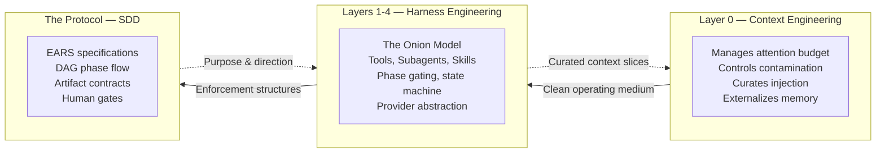
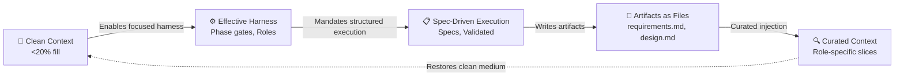

# 02 — The Three Pillars: Context, Harness, SDD

## 🎯 Learning Objectives

- Understand why Context Engineering, Harness Engineering, and Specification-Driven Development form an indivisible system — remove any one and the entire structure collapses
- Map the dependency hierarchy: Context provides the medium, Harness provides the structure, SDD provides the protocol
- Diagnose the three failure modes that emerge when any pillar operates without the other two
- Trace the virtuous cycle that forms when all three pillars compose into a self-reinforcing system
- Draw parallels to safety-critical control systems in aerospace and nuclear engineering where the same three-layer architecture is legally non-negotiable
- Recognize SDD as one protocol among many — not the only workflow the harness can enforce

## Introduction

Most developers encounter these three concepts separately — and fail because they treat them as independent tools rather than an integrated control system. They discover Context Engineering in the form of "keep your prompts short." They encounter Harness Engineering as "use a framework or a custom script to structure agent work." They learn SDD as "write a spec before you code." Each is valuable. Each improves outcomes in isolation. But none of them, deployed alone, produces a production-grade AI development system. The three must be understood as a single, indivisible control architecture.

The reason is structural, not philosophical. Context Engineering without Harness Engineering produces clean context with no control structures — sterile, silent, waiting for direction. Harness Engineering without SDD produces elaborate control structures with no protocol to enforce — a machine with no program. SDD without Context Engineering produces specifications that agents cannot reliably attend to — a blueprint that degrades into noise by turn five. Each pillar depends on the other two to function. Each pillar protects the other two from their characteristic failure modes. Together they form a control system whose output is greater than the sum of its parts. Apart, each is a solution to a problem the other two prevent from being solved.

The practical manifestation of this interdependence is brutal in its simplicity. You can spend weeks perfecting an SDD protocol — EARS specifications, phase DAGs, artifact contracts, human gate definitions. You can produce a specification document of remarkable precision and completeness. Then you hand it to an unharnessed agent with an unmanaged context window, and three turns later the agent is implementing against a specification it can no longer properly perceive. Your weeks of specification work are producing output no better than a two-sentence prompt. The specification didn't fail. The agent didn't fail. The system failed — because the specification was injected into an environment (context window) without management (Context Engineering) and without enforcement (Harness Engineering). The spec was a perfect blueprint dropped into a hurricane.

This note establishes the system-level architecture. It explains not what each pillar does — those explanations live in their dedicated notes — but how they compose into a unified control plane. It names the hierarchy, maps the dependencies, and demonstrates through both theory and analogy why any attempt to deploy only one or two pillars will fail.

> **The architectural truth:** Context is the physics, Harness is the structure, SDD is the protocol. You cannot build a bridge with only one of these. You cannot fly an aircraft with sensors alone, or control computers alone, or control laws alone. The safety properties — reliability, traceability, auditability — emerge from the composition, not from any component in isolation.

The insight is not deep; it is architectural. What makes it challenging is not its complexity — the architecture is simpler than most software stacks — but its counterintuitive nature. Engineering instinct says "add more structure to improve reliability." The three pillars say "add structure in the right order, at the right layer, or your structure makes things worse." A harness added before context management is a machine that amplifies noise. An SDD protocol added before a harness is a script without a runtime. The order matters. The hierarchy matters. Understanding this — not memorizing the components but internalizing the dependency chain — is the transition from AI tool user to AI systems engineer.

---

## 1. The Three Pillars Defined

### Context Engineering: The Physics

Context Engineering is the discipline of managing the medium through which LLMs perceive and reason. The context window is a finite resource governed by well-understood physics: a mathematically fixed attention budget (1.0 per head, distributed via softmax across all tokens), a degradation curve that begins at 20-40% fill, a geometry where position matters as much as volume (the "Lost in the Middle" effect), and contamination dynamics where abandoned hypotheses and dead-end explorations accumulate silently across turns. Context Engineering gives you the tools to operate within these constraints: sanitization, progressive summarization, curated injection, external memory via files, and token budgeting.

**What it solves:** Without Context Engineering, attention degrades. The model dilutes its computational resources across abandoned explorations, stale conversation history, and tool definitions it never uses. Token budget overflows silently — you don't notice the quality decline because it compounds across turns, not within a single turn. By turn five, the agent is attending more to its own historical debris than to your current instruction. Session amnesia resets all accumulated understanding when the context window closes, forcing every new session to burn thousands of tokens reconstructing knowledge that external memory could have preserved permanently.

The critical insight is that context is the ONLY channel of communication between the harness designer and the model. System prompts, tool definitions, injected files, conversation history, user instructions — all of it flows through the context window. There is no side channel. There is no persistent memory that bypasses attention. There is no "system state" the model can query without consuming context tokens. This architectural monopoly — context as the exclusive information conduit — makes context quality the ceiling on system quality. You cannot route around a degraded context. You cannot use a different channel to convey the specification more clearly. You cannot give the model a file path and expect it to access the file outside the context window. Every instruction, every artifact, every piece of knowledge the model possesses at inference time was placed in context by the harness. If the harness places it poorly — contaminated by stale turns, positioned in the attention valley, competing for budget with noise — the model cannot compensate. The model only knows what context tells it, and it only knows it as well as context allows.

**Without it:** Contamination degrades every other layer. A harness with precise phase gates and role separation still produces garbage if the context each agent receives is a 70%-filled soup of abandoned approaches. SDD specifications that define exact requirements are useless if the Implementer is attending to four different specification fragments from four different turns, each with partial overlap and partial contradiction. Context contamination is the root failure that no amount of harness sophistication can recover from. The harness controls process; context controls the medium the process runs within. If the medium is corrupted, no process can produce correct output.

Full treatment: [[01 - The Context Crisis]].

### Harness Engineering: The Structure

Harness Engineering is the discipline of building deterministic control structures around stochastic AI agents. It is not prompt engineering — prompting changes what the model outputs, while the harness changes how output is constrained, routed, validated, and recorded. It is not a framework — frameworks impose opinionated abstractions as library dependencies, while a harness is a file-based control plane in your repository. It is the Onion Model: Layer 0 (the raw LLM), Layer 1 (tools as capability boundaries), Layer 2 (subagents for role separation), Layer 3 (skills and conventions for pattern enforcement), Layer 4 (CI/CD and policy for hard constraints). Each layer constrains the layer below without eliminating its creative capacity.

**What it solves:** Without a harness, agents oscillate between exploration and implementation — sometimes within the same response. They have no concept of execution phases, no state machine tracking which phase is active, and no mechanical enforcement of role boundaries. The same agent that proposes features also writes code that also evaluates output — conflating creation with criticism in a single context window where biases from one role contaminate the reasoning of another. The harness provides phase gating, role separation, tool scoping, and state tracking — the administrative infrastructure that channels stochastic inference into predictable engineering output.

The key architectural insight: the harness provides what the model structurally cannot provide — **state.** LLMs are stateless functions. Each inference call is independent — the model has no memory of previous calls except what is fed back through the context window. The model cannot track which phase of development is active. It cannot remember that it already explored a dead-end approach three turns ago. It cannot maintain a list of files that have been modified and files that remain untouched. State is the responsibility of the harness, not the model. The harness maintains the state machine that tracks phase progression. The harness maintains the task queue that tracks what's been done and what remains. The harness maintains the artifact registry that tracks which files exist and which need creation. The model generates tokens; the harness manages state. This division of labor — stochastic generation vs. deterministic state management — is the fundamental architectural pattern of all effective AI development systems.

**Without it:** You have a brilliant collaborator with no administrative discipline. The agent can do anything but doesn't know what it SHOULD be doing at any given moment. It explores when it should implement. It critiques when it should produce. It touches files outside scope because nothing tells it which files are within scope. The Onion Model provides deterministic boundaries around stochastic intelligence — boundaries that the model itself is incapable of establishing because it has no concept of project governance, role boundaries, or development phases. The harness is the administrative nervous system of AI-assisted development. Without it, you have capability without control. And critically, without the harness providing state, you are stuck in a purely stateless interaction model — every turn must reconstruct from context the entire operational picture, consuming exactly the attention budget that context engineering is trying to protect.

Full treatment: [[03 - Harness Engineering - Architecture of Control]].

### Specification-Driven Development: The Protocol

Specification-Driven Development is a concrete workflow protocol: specify what you want to build first, then implement against that specification. It flows through a strict Directed Acyclic Graph — Init → Proposal → Spec → Design → Tasks → Apply → Verify → Archive — with formal human gates at Spec approval and Design approval. Specifications are written in machine-parseable formats (EARS notation: WHEN trigger THEN system SHALL response). Every phase produces a file artifact (`requirements.md`, `design.md`, `tasks.md`) that becomes the input to the next phase. The spec is the source of truth — chat is disposable, code conforms to spec.

**What it solves:** Without SDD, agents implement without knowing WHAT. The prompt says "add authentication" and the agent infers scope, architecture, dependencies, testing strategy, and edge cases — all simultaneously, all from a probability distribution, all in a single context window where attention is already diluted. The result is implementation that reflects the model's statistical understanding of authentication rather than the project's specific requirements. SDD decouples WHAT from HOW. The spec captures WHAT with precision; the implementation phase focuses exclusively on HOW. This separation is the core insight: specification and implementation require fundamentally different cognitive modes, and conflating them produces output that is half-designed and half-built, satisfying neither the designer nor the builder.

The separation is not arbitrary — it mirrors the distinction that human engineering organizations discovered was necessary decades ago. No professional engineering firm lets the same person write both the specification and the implementation without review. The spec defines correctness; the implementation pursues correctness. When the same mind does both, errors in the spec become invisible to the implementer — the implementer "knows what was meant" and codes to intention rather than text. The AI agent exhibits the same failure mode: when it writes both the spec and the code, specification errors survive implementation because the agent's internal model of the problem overrides the literal specification text. Separation of concerns is not bureaucratic overhead — it is the mechanism by which specification errors become visible to the implementation phase.

**Without it:** The harness asks "what should I enforce?" and there is no answer. Phase gates exist but gate nothing — because no specification defines what constitutes passing a gate. Role separation exists but roles are empty — because no artifacts define what the Spec Author produces that the Implementer consumes. The state machine spins without purpose. SDD is ONE workflow protocol among many possible protocols. You could build harnesses for TDD (test-first → code → refactor), Agile (sprint → story → implement → review), or Waterfall (design → implement → test → deploy). But whatever protocol you choose, you MUST choose one. A harness without a protocol is infrastructure without a mission — a control system with nothing to control. The protocol provides the THELOGY that justifies the harness's existence. Without it, the harness is answer to a question nobody asked.

Full treatment: [[04 - Specification-Driven Development]].

---

## 2. The Hierarchy: How They Stack

The three pillars are not peers. They form a strict dependency chain where each layer enables the next and each layer constrains without eliminating:



Context Engineering is Layer 0 — the foundation. It ensures that every subsequent layer operates within the safe zone of the context window, where attention dilution is minimal and position effects are managed. If context is contaminated, the harness is enforcing a specification that the agent cannot properly attend to. If context is degraded, the most precise EARS specification becomes noise in the attention field — syntactically present, semantically invisible.

Harness Engineering occupies Layers 1-4 — the structure. It provides the control surfaces that Context Engineering feeds and that SDD relies upon. Without harness structures, context engineering has no delivery mechanism — clean context sits unused. Without harness structures, SDD has no enforcement — the specification exists but nothing mechanically enforces its phase gates, its role separations, or its artifact contracts.

SDD is the protocol that gives the harness its purpose. The harness provides capability — tools, subagents, skills, gates. SDD provides the script that tells the harness WHAT to enforce and WHEN. Without SDD, the harness is a general-purpose control system with no specific workflow to execute. SDD fills the harness with meaning.

The dependency chain is unidirectional and non-negotiable:

```
Clean context → Effective enforcement → Faithful execution
```

You can have clean context and a powerful harness, but without SDD you cannot direct them. You can have a powerful harness and precise SDD, but without clean context the agent cannot attend to the specification. You can have clean context and precise SDD, but without a harness you cannot enforce the protocol mechanically — a human must play the harness role, which defeats the purpose of AI assistance. The three pillars form an AND gate — all three must be true for the system to function.

---

## 3. Why Any Two Without the Third Fails

This is the core theoretical contribution of this note. The three failure modes below are not hypothetical — they are observed, consistent, and predictable from the architectural dependencies established in Section 2. Each scenario isolates one pillar as absent and traces the cascade of failures that follows.

### Scenario A: Context + Harness without SDD — Controlled Chaos

You manage context perfectly. Your context window operates at 15% fill. Sanitization runs before every turn. Progressive summarization compresses history into structured decision records. External memory persists knowledge across sessions. Your harness is elegant — the Onion Model is properly layered, tools are minimal and well-scoped, subagents enforce role separation, skills encode project conventions, and CI/CD provides hard constraints.

The system is clean and disciplined. But it has no protocol. No specification defines what each subagent should produce. No phase DAG defines the sequence of operations. No artifact contracts define what the Spec Author's output must contain for the Implementer to consume it. The harness asks "what should I enforce?" and there is no answer.

The result is **controlled chaos.** The agents execute with mechanical discipline — they stay within their tool scopes, they operate within their role boundaries, they follow project conventions — but every decision is ad-hoc. The Spec Author produces requirements based on its best guess about what the prompt meant. The Implementer interprets those requirements loosely because no formal standard defines what a "complete requirement" looks like. The Reviewer evaluates against criteria it invents on each run because no specification establishes pass/fail conditions.

The subtlety is that this failure mode produces output that looks coherent — unlike the degraded output of contaminated context. The code compiles, the tests pass, the commit messages are well-formed. But the output doesn't implement the same thing across sessions. Run the harness twice with the same prompt "add user authentication" and you get two different authentication implementations — both well-structured, both following project conventions, both passing mechanical validation — but structurally different. One uses JWT with middleware. The other uses session cookies with a database table. Both are "correct" in isolation but incompatible with each other and with the rest of the system. The absence of a protocol means the harness cannot converge on a single, consistent implementation across runs. Every execution is a valid execution — but validity is not the goal; consistency is.

The system is reliable in execution but arbitrary in direction. It's like a factory with perfectly calibrated machinery running without a production schedule — the machines work, the quality control is rigorous, but nobody knows what they're supposed to be building today. The harness provides the HOW; SDD provides the WHAT. Without the WHAT, the HOW spins efficiently but aimlessly. This is why SDD is not "a nice addition" to a harness — it is the harness's purpose. A harness without a protocol is a solution waiting for a problem.

### Scenario B: Context + SDD without Harness — Manual Enforcement

You have clean context and a formal specification protocol. The SDD DAG is defined. EARS requirements are precise. Phase gates are documented. Artifact contracts specify exactly what `design.md` must contain. The spec is the source of truth.

But there is no harness. No tool system gates what agents can do. No subagent architecture enforces role separation — the same agent that writes the spec also implements the code, conflating the cognitive modes. No state machine tracks which phase is active. No provider abstraction isolates LLM capabilities behind a stable interface. No CI/CD pipeline hard-enforces policies.

The result is **manual enforcement.** The specification exists on paper (or in files) but nothing mechanically enforces it. Phase gates are human checklists — you must manually verify that the spec is complete before starting implementation, manually verify that the design is approved before writing tasks, manually verify that the Implementer didn't skip a step. Role separation is aspirational — you must manually ensure that the agent isn't oscillating between spec-writing and code-writing within the same conversation. Context isolation is impossible — without subagent spawning with curated context, every phase's context bleeds into the next.

The specific mechanical failures cascade predictably. The agent writes a spec in Turn 1. By Turn 3, the spec is in the middle of the context window — the "Lost in the Middle" attention valley. The agent is now implementing against a specification it cannot properly attend to, but you cannot spawn a fresh subagent with clean context because you have no subagent infrastructure. You must continue with the same session, the same context window, the same accumulating debris. By Turn 5, the agent is implementing against fragments of the spec that survived the attention valley — a subset of requirements, interpreted through the lens of abandoned exploration turns. The spec says "authentication must support OAuth2 and SAML." The agent implements OAuth2 and silently drops SAML — not because it chose to, but because the SAML requirement was in the portion of the spec that fell below the attention threshold. The human must catch this. The human must verify compliance manually. The human IS the harness — and the human's attention has the same finite budget problem, just at a different scale.

A human must play the harness role. This is not AI-assisted development — it is AI-suggested development with a human serving as the control system. The human becomes the phase gate, the role separator, the context curator, the tool scoper, the state tracker. The cognitive load that harness engineering was supposed to eliminate returns — displaced from the model to the developer. The paradox: you have invested in both context engineering and SDD, but the absence of the harness means you are still doing the work the harness would have automated. Every minute spent verifying that the Implementer followed the spec is a minute the harness could have spent doing that mechanically. The spec is precise but unprotected. The context is clean but undirected. The human is the missing layer — and humans are expensive, inconsistent, and fatigable in ways that a file-based state machine is not.

### Scenario C: Harness + SDD without Context Engineering — The Polished Garbage Engine

You have control structures and a protocol. The harness is well-designed — tools are minimal, subagents enforce role separation, the Onion Model is properly layered. SDD is rigorous — EARS specifications are precise, the phase DAG is documented, artifact contracts are clear. The system architecture is textbook.

But context is unmanaged. No sanitization runs between turns. Conversation history accumulates without bound. Abandoned approaches and dead-end explorations remain in the window. External memory is absent — all knowledge lives in context. No token budgets cap system prompts, tool definitions, or injected files. The context window fills with debris — slowly at first, then exponentially as each turn adds to the pile.

By turn five, the harness is enforcing a specification that the agent can't properly attend to. The attention budget, mathematically fixed at 1.0 per head, is distributed across 80% fill — 160K tokens of which perhaps 60K are active instructions and 100K are archival debris. The model attends to all of it with equal mechanical weight. The "Lost in the Middle" effect positions critical specification content in the attention valley where retrieval accuracy drops by 40+ percentage points. The signal-to-noise ratio has degraded below 50:50 — the model is attending more to noise than to signal.

The result is the most dangerous failure mode because it looks like it should work. The harness is elegant. The protocol is rigorous. The output is garbage — but it's polished garbage, generated with the confidence and syntactic correctness of a well-structured system. The agent produces implementation that passes mechanical validation but fails semantic alignment — the code compiles, the tests pass, but the specification's intent is lost because the agent couldn't attend to it clearly. The harness enforced the WRONG interpretation of the specification — faithfully, consistently, and incorrectly.

This is the failure mode that undermines trust in AI-assisted development. Observers see a sophisticated system producing incorrect output and conclude that "AI isn't reliable for engineering." The diagnosis is wrong. The AI is reliable — it's faithfully attending to the tokens in its window. The error is in feeding it a window where 60% of the tokens are noise. The harness and the protocol are not the problem — the unmanaged context is. But because context contamination is invisible (it doesn't produce error messages, it doesn't fail tests, it just silently degrades attention quality), it's the hardest failure mode to diagnose and the most common in production.

This failure mode has a distinctive signature that makes it recognizable in retrospect. When you audit a project that suffered from "Harness + SDD without Context," you find three patterns: (a) the spec is well-written but the implementation doesn't match it — not in gross ways but in subtle omissions of edge cases and constraint details; (b) the harness logs show all phases completed successfully — every gate passed, every artifact produced — but the artifacts were generated from context windows where the specification was partially visible; (c) rerunning the same harness with the same spec on a fresh context window produces a DIFFERENT implementation — not because the model changed but because the context window was no longer contaminated. The variation across runs is the fingerprint of context degradation: a deterministic harness with adequate context should produce consistent output; inconsistent output signals that something is varying — and in a system where the harness, protocol, and model are all fixed, the variable is context quality.

---

### The AND Gate Formalized

The three failure scenarios above demonstrate a formal property: the three pillars form a logical AND gate. Let:

- **C** = Context Engineering is operational (window <20% fill, sanitized, position-aware)
- **H** = Harness Engineering is operational (tools scoped, subagents active, state machine tracking)
- **S** = SDD protocol is operational (DAG defined, artifacts specified, gates documented)

Then the system produces correct, traceable output **iff C ∧ H ∧ S.** Any other boolean combination produces a failure mode:

| C | H | S | Result | Failure Mode |
|---|---|-------|--------|-------------|
| T | T | T | Correct, traceable output | None — system operational |
| T | T | F | Controlled chaos | Scenario A |
| T | F | T | Manual enforcement | Scenario B |
| F | T | T | Polished garbage | Scenario C |
| T | F | F | Clean context, no harness, no protocol — a well-maintained void |
| F | T | F | Structured infrastructure with degraded perception — a machine running blind |
| F | F | T | A spec with no context management and no enforcement — a document in a void |
| F | F | F | Unmanaged session with no structure and no protocol — the default state of chat-driven development |

The asymmetry is instructive. Having only one pillar operational (C=true, H=false, S=false) is the "well-maintained void" — you're managing context perfectly but have no harness and no protocol. Clean context with nothing to do. Having none operational (all false) is the default state — raw, unstructured chat-driven development, which is where most teams start and where most teams fail. The "all false" state is not stable — it degrades into the C-type failure (polished garbage) if you add a harness and protocol without context management, because the natural progression is to add structure (harness) and direction (protocol) before you understand the medium (context). This is the most common trajectory in real-world adoption.

The AND gate property has an important corollary: **improving one pillar cannot compensate for the absence of another.** You cannot "context-engineer harder" to make up for the absence of a harness — 5% fill doesn't help if there's no state machine enforcing phases. You cannot "design a better harness" to compensate for contaminated context — the most elegant Onion Model cannot extract signal from noise. You cannot "write a more precise spec" to compensate for the absence of both — the most rigorous EARS specification is invisible to an agent drowning in debris. The pillars are non-substitutable. Each does something the others structurally cannot do. The AND gate is not a design preference — it is a structural constraint.

---

## 4. The System Dynamics: How They Compose

When all three pillars operate together, they form a virtuous cycle — a self-reinforcing feedback loop where each pillar strengthens the others. This is not a linear assembly line; it is a dynamical system where output from one layer becomes improved input for another:



The cycle operates as follows:

**Clean Context → Effective Harness.** When context is managed — operating below 20% fill, sanitized between turns, with critical instructions positioned at window extremes — the harness structures function at full capacity. Phase gates are enforced on agents that can clearly perceive what they're supposed to do. Role separation produces genuinely different cognitive outputs because each subagent receives a context slice where its role instructions occupy the high-attention zone. Tool scoping is effective because the agent allocates attention to tool selection rather than diffusing it across archival debris. The harness doesn't become more powerful — the context becomes less obstructive, which produces the same net effect.

**Effective Harness → Spec-Driven Execution.** When the harness enforces phase gates, role separation, and tool scoping, SDD phases execute with mechanical discipline. The Spec Author produces specifications without oscillating into implementation. The Implementer writes code against a specification it didn't create — eliminating confirmation bias between design and execution. The Reviewer evaluates against external criteria rather than the Implementer's reasoning. Each phase receives the artifacts it needs and nothing else. The harness transforms SDD from a documented convention into an enforced pipeline.

**Spec-Driven Execution → Artifacts as Files.** When SDD phases execute correctly, they produce structured file artifacts — not chat messages. `requirements.md` captures the EARS specification. `design.md` captures the architecture decisions. `tasks.md` captures the implementation steps. These files are permanent, version-controlled, and auditable. They survive context resets, session boundaries, and model upgrades. They become the institutional memory of the project — not ephemeral conversation history but durable engineering records.

**Artifacts as Files → Curated Context.** When artifacts exist as files, the harness can curate context with surgical precision. The Implementer receives `tasks.md` and `design.md` — not the 15,000 tokens of debate that produced them. The Reviewer receives the spec, the implementation, and the test results — not the Implementer's internal reasoning or the Spec Author's discarded alternatives. Each subagent's context is a clean slice — minimal, position-optimized, high signal-to-noise. The files act as a context firewall: knowledge passes through them, but the noise of knowledge production stays behind.

**Curated Context → Clean Context (cycle closes).** When every phase produces files and every subsequent phase consumes only the files it needs, the context window never accumulates debris. No abandoned approach survives the phase transition. No implementation detail leaks backward into specification. No design debate contaminates the reviewer's evaluation. The context stays clean not because of aggressive sanitization but because the system architecture prevents contamination from entering in the first place. Clean context is not a maintenance burden — it is an emergent property of the file-based artifact pipeline.

This virtuous cycle is the system-level justification for treating the three pillars as indivisible. Remove any pillar and the cycle breaks. Remove Context Engineering and the cycle never starts — the context degrades before the harness can act. Remove Harness Engineering and there is no enforcement — the phases are suggestions, not gates. Remove SDD and there are no artifacts — nothing to curate, nothing to inject, nothing to version-control. The cycle only spins when all three pillars are operational.

The practical consequence: when you improve any one pillar, you improve the entire system. Better context management produces cleaner harness operations, which produce more faithful SDD execution, which produces higher-quality artifacts, which enable even better context curation. When you neglect any one pillar, you degrade the entire system. Contaminated context produces sloppy harness enforcement, which produces misaligned SDD output, which produces corrupted artifacts, which contaminate the next cycle's context. The system amplifies both virtue and vice.

This amplification property has a critical implication for harness operations: **you cannot debug the system by examining one pillar in isolation.** When output quality degrades, the natural instinct is to examine the most visible component — the protocol (did the spec change?), the harness (did a gate fail?), the model (did the provider change?). But the degradation could originate in any pillar and propagate through the cycle. A single session of poorly sanitized context can produce a corrupted `design.md` artifact. That artifact, injected into the Implementer's context, causes misaligned implementation. That implementation, when reviewed, generates a false-positive pass because the Reviewer's evaluation criteria were also based on the corrupted design. The error propagates through every subsequent phase, and tracing it back to the originating context contamination requires auditing the entire artifact chain — not just the final output.

This is why the three pillars must be monitored as a system, not as independent components. Harness telemetry should track context fill percentage, signal-to-noise ratios, and position profiles alongside phase gate success rates and artifact validation scores. When implementation quality declines, the first question should not be "did the model get worse?" — it should be "did context quality decline last session?" The system dynamics teach that the root cause is often two layers removed from the symptom. A phase gate failure in the Verifier may originate in context contamination during the Spec Author phase — three phases earlier, in a different session, with a different subagent. Without system-level monitoring, this causal chain is invisible. With it, the virtuous cycle becomes not just a conceptual model but an operational diagnostic framework.

---

## 5. Analogy: Control Systems in Aerospace and Nuclear Engineering

The three-pillar architecture is not unique to AI-assisted development. It is the standard architecture of safety-critical control systems in aerospace, nuclear engineering, and industrial automation — domains where failure is measured in lives, not lines of code. Drawing these parallels makes the architectural necessities concrete.

### Fly-by-Wire in Modern Aircraft

A modern aircraft's fly-by-wire system has three layers:

**Sensors (Context Engineering).** Hundreds of sensors measure airspeed, angle of attack, altitude, attitude, engine performance, control surface positions, and environmental conditions. Sensor data is the medium through which the flight control computers perceive the aircraft's state. But raw sensor data is noisy — it contains calibration drift, measurement error, transient spikes. Sensor fusion algorithms clean this data: they cross-validate readings, filter noise, and produce a single coherent picture of the aircraft's state. This is Context Engineering — managing the medium to ensure that what the system perceives is accurate, not contaminated.

A critical design pattern in aerospace sensor fusion is **voting**: three independent sensors measure the same parameter, and the system discards the outlier. If two sensors agree and one disagrees, the disagreeing sensor's reading is not used. This is directly analogous to context sanitization: if three turns of conversation explored three different approaches, and only one was committed to, the harness discards the other two — voting out the abandoned hypotheses from the attention field. The principle is identical: multiple sources of information are cross-validated, and contaminated sources are excluded from the downstream computation.

**Flight Control Computers (Harness Engineering).** The control computers are the harness. They enforce flight envelope protection — mechanical limits that prevent the pilot from commanding maneuvers that would stall the aircraft or exceed structural limits. They provide control laws that translate pilot inputs into control surface commands. They monitor system health and switch to redundant channels on failure. They are deterministic computers surrounding a stochastic input stream (pilot commands + sensor noise + environmental variation). The harness constrains without eliminating — the pilot retains authority within the envelope, but the envelope boundaries are mechanically enforced.

The envelope protection system is the direct analog of tool scoping in a harness. Just as the flight computer prevents the pilot from commanding a 9G pull-up that would exceed structural limits, the harness prevents the agent from executing an `rm -rf` command that would destroy the repository. Both are capability boundaries enforced mechanically, not through instruction or persuasion. The pilot cannot override envelope protection by arguing. The agent cannot delete files by reasoning that deletion would be efficient. The boundary is absolute because it is implemented in the control infrastructure, not in the behavioral contract.

**Flight Control Laws (SDD Protocol).** The control laws are the protocol. They define exactly what happens when the pilot moves the stick — which control surfaces move, in what sequence, with what limits, under what conditions. These laws are formal, auditable specifications developed through years of flight testing and certification. They are the WHAT that the control computers enforce. Without them, the harness would have sensors and actuators but no definition of correct behavior.

The three layers are legally inseparable. An aircraft cannot be certified for commercial operation without demonstrating that its sensor systems (Context), its control computers (Harness), and its control laws (Protocol) all function correctly and compose safely. Remove sensors and the system is blind — the most elegant control laws cannot fly an aircraft the computer cannot perceive. Remove control computers and the pilot must translate sensor readings into control surface commands manually — possible at low speed in visual conditions, impossible at Mach 0.85 in instrument conditions. Remove control laws and the computers have nothing to execute — the most sophisticated hardware spins without purpose. The certification requirement that all three layers be present and correct is not bureaucratic — it is the recognition that the three layers form a single control system whose safety properties emerge from their composition.

### Nuclear Reactor Control Systems

A nuclear reactor's control system follows the identical architecture:

**Sensor Instrumentation (Context Engineering).** Neutron flux detectors, temperature sensors, pressure transducers, coolant flow meters. The instrumentation suite provides the data stream that describes the reactor's state. But nuclear instrumentation is hard — sensors degrade under radiation, readings drift, noise spectra change with burn-up. Redundant sensor arrays and cross-validation algorithms clean the data stream. The reactor protection system must know the TRUE state of the core, not the contaminated reading of a degraded sensor. This is Context Engineering applied to the hardest sensor environment on Earth.

**Control Rod Logic (Harness Engineering).** The control rod drive mechanisms and their logic controllers are the harness. They can insert rods (reduce reactivity) or withdraw rods (increase reactivity). They are mechanically limited — rods cannot be withdrawn beyond certain positions, withdrawal rates are capped, and certain combinations of rod positions are interlocked. The harness provides capability boundaries that the control laws operate within. It does not decide WHEN to move rods — it provides the mechanical infrastructure for moving them.

**Operational Procedures (SDD Protocol).** Startup sequences, power ascension schedules, scram conditions, maintenance lockout procedures. These are formal protocols — step-by-step specifications of what operations are permitted under what conditions. A reactor startup procedure specifies exact steps: verify coolant flow, withdraw shutdown rods to intermediate position, monitor neutron count rate, approach criticality on a doubling time of no less than 30 seconds. The procedure is the WHAT. The control rod logic is the HOW. The instrumentation is the from-what.

Remove instrumentation and the operators are blind — controlling a reactor they cannot measure. Remove control rod logic and the procedures have no mechanism to execute through. Remove procedures and the operators have a reactor they can measure and control but no definition of what constitutes safe operation. The three layers are architecturally identical to the AI harness stack — and for the same reason: stochastic processes (nuclear chain reactions, LLM token sampling) require layered control systems where each layer addresses a specific class of failure.

### The Transfer to AI-Assisted Development

The transfer of this architecture to AI-assisted development is direct:

| Domain        | Context (Perception)                 | Harness (Enforcement)         | Protocol (Direction)      |
| ------------- | ------------------------------------ | ----------------------------- | ------------------------- |
| **Aerospace** | Air data sensors, IMU, GPS           | Flight control computers      | Flight control laws       |
| **Nuclear**   | Neutron flux, temperature, pressure  | Control rod logic             | Operational procedures    |
| **AI Dev**    | Token budget, sanitization, curation | Onion Model, tools, subagents | SDD phase DAG, EARS specs |

In all three domains, the architecture is identical: a sensing layer that provides clean operating data, a control layer that mechanically enforces boundaries, and a protocol layer that defines correct behavior. In all three domains, removing any layer makes the system non-operational. In all three domains, the layers are designed, tested, and certified as a single integrated system — not as independent components that happen to be used together.

The certification parallel is worth emphasizing because it exposes a common objection to Harness Engineering: "this seems like over-engineering for software development." The certification regimes in aerospace (DO-178C for software, ARP4754 for systems) and nuclear (IEC 61508, IEC 61513) exist because the consequences of failure are catastrophic. AI-assisted software development does not have direct life-safety consequences in most applications. But it has a different kind of catastrophic failure: systemic unreliability that compounds across sprints. A single agent error in a single session is trivial — a typo, a misunderstood requirement, an edge case missed. But across 100 sessions, 1000 turns, across sprints and releases, the accumulation of undetected, unauditable errors becomes a different class of catastrophe: a codebase nobody fully understands, decisions nobody can trace, behavior nobody can explain. The certification rigor of aerospace and nuclear engineering is proportional to the consequences of failure. Harness Engineering proposes that the same rigor — the same three-layer architecture — is proportional to the consequences of AI-assisted development at scale. The rigor is not excessive. It is the minimum viable control system for stochastic agents operating on production codebases.

The aerospace and nuclear analogies also clarify WHY the three pillars are a hierarchy rather than peers. In a fly-by-wire system, you can test the control computers independently and the control laws independently — but you cannot CERTIFY the system without testing all three layers in composition. The safety properties emerge from the interaction, not from any single layer. The same principle applies to the AI harness stack. You can verify that context sanitization works — context stays below 20% fill across a session. You can verify that phase gates work — the DAG advances only on gate approval. You can verify that EARS specifications are machine-parseable — the parser validates them. But the property you actually care about — "did the system produce correct, traceable implementation?" — can only be verified in composition. This is why the three pillars must be designed, tested, and operated as an integrated system. Component-level verification is necessary but insufficient. System-level verification is the certification standard.

---

## 6. SDD Is ONE Protocol, Not THE Protocol

From the Fazt Code SDD demonstration (ElGlTv2A_bM) comes a critical clarification that prevents Harness Engineering from being conflated with SDD:

> "Harness Engineering is the discipline for automating workflow with artificial intelligence. Workflows are abundant — waterfall, iterative, TDD. Workflows that have existed throughout the entire history of software development. For me, Harness Engineering is taking these workflows and leveraging AI to automate them, generating agents that execute each stage efficiently. What is SDD? It is simply one concrete workflow — a workflow where we first specify what we want to do and then implement it in code. We can create a harness using Harness Engineering to implement the SDD workflow. In the same way, we could create a harness to implement TDD or to follow Agile principles."

This distinction is architecturally essential. Harness Engineering is the discipline — the general methodology for building deterministic control structures around stochastic agents. SDD is one workflow protocol — one specific choreography that runs inside those control structures. The harness design patterns — the Onion Model, provider abstraction, tool system architecture, agent loop design, subagent spawning — work identically regardless of which workflow protocol runs inside:

| Workflow Protocol | Phase Sequence | Artifacts Produced | Harness Patterns Used |
|-------------------|----------------|-------------------|-----------------------|
| **SDD** (Spec-Driven) | Spec → Design → Tasks → Implement → Verify | `requirements.md`, `design.md`, `tasks.md` | Phase gates, subagents, EARS injection |
| **TDD** (Test-Driven) | Write test → Test fails → Implement → Test passes → Refactor | `test_spec.py`, `implementation.py`, `refactor_notes.md` | Phase gates, subagents, test runner tool |
| **Agile** (Sprint) | Sprint plan → Story write → Implement → Code review → Demo | `sprint.md`, `stories/*.md`, `review.md` | Phase gates, subagents, CI/CD integration |
| **Waterfall** | Requirements → Design → Implementation → Verification → Maintenance | Phase-specific documents | Sequential gates, formal handoffs |
| **REQ** (Research-Explore-Quality) | Research topic → Explore solutions → Quality review → Implement | `research.md`, `exploration.md`, `quality.md` | Research subagent, exploration subagent |

The harness is **workflow-agnostic.** Its job is to enforce WHATEVER protocol you choose — not to prescribe which protocol is correct. The Onion Model constrains agent behavior regardless of whether the agent is writing a test first (TDD) or a spec first (SDD). The tool system gates capability regardless of whether the current phase is "implement" or "refactor." Subagents enforce role separation regardless of whether the roles are "Spec Author/Implementer/Reviewer" (SDD) or "Test Writer/Code Writer/Refactorer" (TDD).

SDD is the protocol emphasized in this course for three practical reasons:

1. **Specifications are machine-parseable.** EARS notation (WHEN trigger THEN system SHALL response) produces requirements that can be mechanically validated for completeness. A test in TDD can be evaluated (pass/fail) but the specification behind it lives in human prose. EARS bridges specification and machine-checkability — a property that amplifies harness effectiveness because the harness can validate spec quality programmatically.

2. **The DAG structure maps naturally to phase-gated subagents.** SDD's sequential, artifact-producing phases (each phase consumes the previous phase's file output) map directly to the subagent architecture of the Onion Model. Each phase is a subagent with curated context (the previous phase's artifact) and a single-mode system prompt. Other workflows can be mapped similarly, but SDD's structure makes the mapping immediate — no translation layer required.

3. **Artifacts persist as files with clear dependency contracts.** SDD produces `requirements.md` → `design.md` → `tasks.md` → implementation → `review.md`. Each file is a contract — the downstream phase can validate its input against expected structure. The file chain creates an audit trail from requirement to review, enabling traceability that survives session resets, personnel changes, and model upgrades. Other workflows produce files too, but SDD's DAG makes the file dependency chain explicit and machine-checkable.

None of these properties makes SDD "better" than TDD or Agile. They make SDD **particularly compatible with harness automation**. TDD harnesses exist and are effective. Agile harnesses exist and are effective. The harness design patterns you learn in this course apply to all of them. SDD is the teaching vehicle because its structure makes the harness's role most visible — but the principles transfer universally.

A useful thought experiment: design a TDD harness using the same Onion Model. The Test Writer subagent receives the feature description, produces `test_spec.py`, and passes it to the Implementer subagent. The Implementer writes code until `test_spec.py` passes, then passes both to the Refactorer subagent. The Refactorer improves code quality while keeping tests green, producing `refactor_notes.md`. The same tools, the same agent loop, the same state machine — the only changes are the subagent role definitions and the artifact contracts. This is the practical demonstration that harness design patterns are protocol-agnostic. The Onion Model doesn't care whether the phase is called "Spec" or "Test" — it enforces phase gates identically. The provider abstraction doesn't care whether the agent is writing requirements or test cases — it routes API calls identically. The file architecture doesn't care whether the artifact is `requirements.md` or `test_spec.py` — it provides the same versioning, curation, and injection infrastructure. The harness is the universal runtime. The protocol is the application that runs on it.

This insight prevents the most common misunderstanding among newcomers to Harness Engineering: the belief that "Harness Engineering IS SDD." It is not. Harness Engineering is the general discipline. SDD is one instance of the class "workflow protocols that a harness can automate." Understanding this distinction is what enables you to design harnesses for ANY workflow — not just the one taught in this course.

This distinction has immediate practical implications for harness architecture. When you design a harness, you should ask: "Which components of this design are protocol-specific, and which are protocol-agnostic?" The Onion Model is protocol-agnostic — every workflow needs tools, subagents, skills, and CI/CD gates. The agent loop is protocol-agnostic — every workflow iterates through tool calls and model responses. Provider abstraction is protocol-agnostic — every workflow calls LLMs through an API. What IS protocol-specific is the phase DAG structure, the artifact contracts, the subagent role definitions, and the gate criteria. Separating these concerns produces harnesses that can be reconfigured for different protocols without architectural changes. The same harness infrastructure that runs SDD today can run TDD tomorrow — the tools, subagent spawning, context curation, and state machine are reused; only the protocol definition (the DAG, the artifacts, the gates) changes. This is the architectural payoff of recognizing SDD as one protocol among many: your harness investment is portable across workflows.

---

## 🎯 Key Takeaways

- Context Engineering, Harness Engineering, and SDD form an AND gate — all three must be operational for the system to function; remove any one and the structure collapses into a distinct, predictable failure mode
- The hierarchy is strict: Context provides the clean operating medium (Layer 0), Harness provides the control structures (Layers 1-4), SDD provides the protocol that gives the harness purpose and direction
- The three pillars are non-substitutable: improving one cannot compensate for the absence of another — clean context with no harness is sterile, a powerful harness with no protocol is aimless, a precise spec with no context management is invisible
- Context without Harness and SDD produces sterile, directionless cleanliness — a well-managed medium with nothing running inside it
- Harness without Context and SDD produces controlled chaos — precise enforcement of ad-hoc, undefined workflows where every decision is arbitrary
- SDD without Context and Harness produces manual enforcement — a specification that exists on paper but requires a human to serve as the control system, defeating the purpose of AI assistance
- When all three pillars compose, they form a virtuous cycle: clean context → effective harness → faithful SDD execution → file artifacts → curated context for the next phase
- The system amplifies both virtue and vice — neglect propagates through the cycle as surely as improvement does, which means the pillars must be monitored as an integrated system, not as independent components
- SDD is one workflow protocol among many; Harness Engineering is the general discipline that can automate TDD, Agile, Waterfall, or any structured workflow — SDD is the teaching vehicle, not the only destination

## 🔗 Production Integration

Understanding the three pillars as a system changes how you make harness design decisions. Every decision must be evaluated against all three pillars simultaneously — not just the one it directly affects.

**When you add a new harness component:** Ask: does it interact correctly with context management? A new tool definition consumes 50-200 tokens of context budget — is its utility worth the attention dilution in every subsequent turn? Does it conform to the SDD protocol? A new subagent role must have a defined place in the phase DAG — which phase spawns it, which artifact does it consume, which artifact does it produce? Does it introduce context contamination? A new skill that the Spec Author uses must not leak into the Implementer's context — the skill's output must be captured in artifacts, not passed through chat.

**When you change the SDD protocol:** Ask: does the harness's tool system support the new protocol's phases? A phase that requires external API calls needs a tool that isn't gated behind a scope restriction that blocks it. Does the context engineering strategy handle the new protocol's artifact volume? A protocol that produces 10 intermediate files instead of 3 requires pagination or selective injection to stay within the 20% fill operating zone. Does the phase DAG's gate structure map to the harness's subagent spawning patterns? New phases may need new subagent roles or modified context curation for existing roles.

**When you adjust context engineering parameters:** Ask: does the new token budget for system prompts affect the harness's ability to describe tool schemas? Does the new sanitization threshold affect the SDD phases that need access to prior-turn context? Does the new position strategy for artifact injection affect the "Lost in the Middle" exposure of critical specification content? Context engineering changes propagate upward through the entire stack — a tighter budget on injected files means the SDD protocol must produce more concise artifacts, which means the EARS specifications must be denser, which means the Spec Author subagent needs more precise instructions.

This system-level thinking prevents the "add random harness features" antipattern. A developer discovers subagents and adds 12 specialized roles to their harness. Each role has a 500-token system prompt. Total overhead: 6,000 tokens of system prompts alone — 3% of a 200K window, consumed before any task content enters context. Each role has a 200-token tool definition. Total overhead: 2,400 tokens of tools — plus the base tool set. The harness now consumes 15-20% of the context window before the first user message. The "improvement" of adding 12 subagents has pushed the system from the safe zone into the degradation zone — all because the designer treated each addition as independent rather than as a system-level change that affects context physics.

The three-pillar lens forces you to ask: **what is the system-level cost of this change?** Not just "does this feature improve harness capability?" but "does this feature improve harness capability ENOUGH to justify its context cost, its protocol complexity, and its integration surface area?" In a system where all three pillars are coupled, the answer is often no. The minimalist harness — five Unix tools, three subagent roles, a simple DAG, aggressive context sanitization — outperforms the complex harness not because complexity is inherently bad but because complexity consumes context budget that the simple harness directs toward the task. The three pillars, understood as a system, produce simpler designs. Simpler designs produce better results. The architecture teaches itself.

The ultimate test of whether you understand the three pillars as a system is simple: when something goes wrong, do you check all three? If the Implementer produces code that doesn't match the spec, a single-pillar thinker asks "was the spec unclear?" or "is the model having a bad day?" A three-pillar thinker asks: (1) Was the context the Implementer received clean? What was the fill percentage? Where in the window was the spec positioned? (2) Did the harness enforce the correct phase gate? Did the state machine advance before the Implementer completed? Was the Implementer subagent properly scoped? (3) Was the specification artifact well-formed? Did it survive the handoff from Spec Author to Implementer without corruption? The single-pillar thinker fixes symptoms. The three-pillar thinker fixes systems. The difference is not skill — it is mental model. And the mental model changes everything.

This mental model should also inform how you onboard new team members to AI-assisted development. Most onboarding starts with "here's how to write good prompts." Better onboarding starts with "here's how the three pillars compose — and here's what happens when one is missing." New developers need to see the architecture before they see the details. They need to understand that a "bad session" is rarely a bad model or a bad prompt — it's almost always a system failure where context was contaminated, the harness was misconfigured, or the protocol was undefined. Teaching the three pillars first — before prompt engineering, before tool design, before SDD mechanics — creates developers who debug systems rather than symptoms. And in AI-assisted development, that distinction is the difference between mastery and frustration.

---

## References

- Fazt Code — "Adaptando Claude Code para SDD" (ElGlTv2A_bM): Clarification of Harness Engineering vs. SDD as discipline vs. one workflow
- Fazt Code — "Construyo mi propio arnés de IA" (2B9QTg_-nyc): Onion Model conceptualization
- Fazt Code — "Qué es Harness Engineering" (DOgIFhpndW0): Model as engine, harness as surrounding application
- Alan Buscalas / Gentle Framework — Three-problem framework and 20-harness taxonomy
- Vercel D0 Research — Context degradation curves and tool minimalism principles
- Graphify / OpenCode — Session Reset Problem and external memory architecture
- Liu, N. F., et al. (2024) — "Lost in the Middle: How Language Models Use Long Contexts"

**Cross-references within this vault:**
- [[01 - The Context Crisis]] — The physics of the medium and the five strategies for context engineering
- [[03 - Harness Engineering - Architecture of Control]] — The Onion Model, tools, subagents, and the complete harness structure
- [[04 - Specification-Driven Development]] — The SDD workflow protocol: EARS, DAG, phases, artifacts
- [[05 - File Architecture]] — Where artifacts live on disk and how file conventions enable context curation
- [[06 - Multi-Agent Orchestration and Capstone]] — The complete system in motion: all three pillars operating simultaneously
- [[00 - Welcome to Harness Engineering and SDD]] — Course overview and the five-layer control stack

> **Course progression:** Note 01 established the physics — the immutable constraints of the context window. Note 02 establishes the architecture — why the three pillars of Context, Harness, and SDD must be treated as an indivisible system. Note 03 builds the structural layer: the Onion Model, tools, subagents, and the agent loop. The remaining notes extend the architecture through SDD formalism, file conventions, multi-agent orchestration, verification, and complete workflow integration. Each layer assumes the layers below. The system is only as strong as its weakest pillar.

---

*Note 02 of Module 16 — Harness Engineering and SDD.*
*May 2026. Synthesized from Fazt Code SDD demonstrations, Alan Buscalas / Gentle framework, Vercel D0 research, and production control systems engineering principles.*
