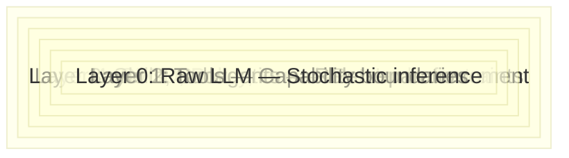
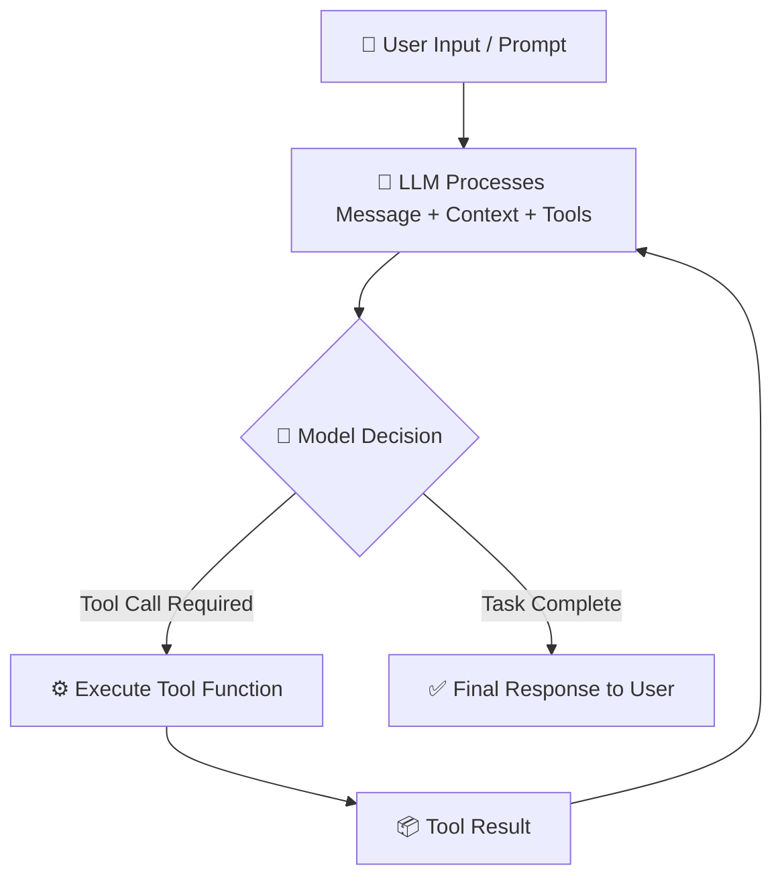

# 03 — Harness Engineering: Architecture of Control

## 🎯 Learning Objectives

- Understand the five-layer Onion Model that channels stochastic AI into deterministic output
- Master the agent loop as the runtime engine within every harness
- Design provider-agnostic architectures that survive SDK churn
- Compose tool systems as capability contracts, not prompt suggestions
- Apply compact strategies and memory architecture to defend against context degradation
- Internalize the Simplicity Principle as the antidote to premature harness complexity

---

## Introduction

If [[01 - The Context Crisis|Context Engineering]] teaches you the physics of the medium, **Harness Engineering teaches you to control the force within it.** Context engineering reveals that attention degrades at 20-40% window fill, that contaminated context is the silent killer, and that every irrelevant token dilutes the tokens that matter. That is the map of the territory. Harness Engineering is the bridge you build across it.

An unharnessed LLM is a stochastic token generator with no guardrails. It produces text from a probability distribution — brilliant one turn, hallucinatory the next, meandering the turn after that. A harness wraps deterministic control structures around that stochastic core, transforming it from a chatbot into a productive engineering agent. The model is the engine; everything else is the harness.

The discipline sits at the intersection of systems engineering and AI infrastructure. It asks: how do you build the operational ecosystem that constrains, routes, validates, and records AI output so that it integrates reliably into production workflows? The answer is not a framework, not a library, not a SaaS product. The answer is a **file-based control plane** — a directory convention in your repository that every layer of control can read, write, and be audited through.

---

## 1. What Harness Engineering Is — And What It Is Not

Before defining what it is, clarity on what it is not:

| Thing | Why it's not Harness Engineering |
|-------|----------------------------------|
| **Prompt engineering** | Prompting changes what the model outputs. Harness changes how output is constrained, routed, validated, and recorded. |
| **RAG (Retrieval-Augmented Generation)** | RAG adds information. Harness controls process. They are complementary but operate at different layers. |
| **A framework** (LangChain, CrewAI) | Frameworks impose opinionated abstractions as library dependencies. A harness is a FILE-BASED convention, not a dependency you import. |
| **Agentic workflow** | Agentic workflow is a design pattern — a way of structuring agent behavior. Harness is the INFRASTRUCTURE that enforces it reliably. |
| **Model fine-tuning** | Fine-tuning changes the model's weight distribution. The harness does not touch weights; it operates entirely outside the model. |

**Harness Engineering is the discipline of building the ecosystem around the LLM that transforms it from a stochastic chatbot into a deterministic engineering agent. The model is the engine; everything else — tools, subagents, skills, memory, policies, CI/CD — is the harness.**

This definition matters because it clarifies scope. Prompt engineering lives inside a single turn. A framework lives as a dependency in your package manager. A harness lives as files in your repository — version-controlled, auditable, legible to humans, and parseable by machines. It is not something you install; it is something you build.

---

## 2. The Onion Model: Five Layers of Deterministic Control

The harness is not a monolithic structure. It is a layered system where each layer constrains the layer below without eliminating it. Visualize it as concentric rings — an onion where the raw LLM sits at the core and deterministic control radiates outward.



### Layer 0: Raw LLM — Pure Stochastic Inference

At the center sits the language model itself. Token by token, it samples from a probability distribution. There are no constraints at this layer — no guardrails, no rules, no memory. It will generate anything the distribution permits. This is the raw material the harness must work with.

**What it constrains:** Nothing. This layer IS the thing being constrained.

**Why it must be wrapped:** The LLM has no concept of correctness, safety, or project convention. It does not know which files exist, which tests must pass, or which patterns the team has adopted. It generates text. The harness transforms that text into engineering output.

### Layer 1: Tools — Capability Boundaries as Mechanical Impossibilities

The first layer of constraint is not a prompt telling the agent "don't delete files." It is a **mechanical boundary**: the agent has a `read_file` tool, a `write_file` tool, a `grep` tool — and no `rm` tool. It literally cannot delete files because the function does not exist in its tool registry.

**How it constrains:** Each tool is a contract — a name, a description, a JSON schema for parameters, and an execute function. The LLM reads the description to decide WHEN to invoke the tool. But it can ONLY invoke tools that are registered. You define the capability surface. Everything outside that surface is mechanically unreachable.

**The mechanism:** Tools are registered before the agent loop begins. The harness passes the tool definitions as part of the system prompt or API call. The LLM sees: "You have these tools available. Use them when appropriate." If a tool is not in the list, the LLM cannot use it — not because it chooses not to, but because the API contract does not include it.

### Layer 2: Subagents — Role Separation Through Curated Context

A subagent is an LLM instance with a specific role, a curated subset of context, and a limited tool set. The key insight: each subagent operates in exactly **one mode**. The Spec Author produces requirements; it does not implement. The Implementer writes code; it does not propose features. The Reviewer evaluates output; it does neither.

**How it constrains:** The constraint is behavioral, not mechanical. The subagent's system prompt defines its role. Its context window is curated — the Implementer receives `tasks.md`, `design.md`, and the relevant source files, but NEVER sees the proposal debates or alternative designs that were considered and rejected. This prevents context contamination and eliminates the oscillation between exploration and implementation that plagues single-agent workflows.

**The mechanism:** The harness spawns subagents with `spawn` or `task` tools. Each spawn call passes a role definition, a curated context payload, and a tool whitelist. The subagent runs the agent loop independently and returns its result to the orchestrator.

### Layer 3: Skills and Conventions — Pattern Enforcement

Skills encode reusable patterns as structured documents. A `SKILL.md` file might define how to write tests in this codebase, how to structure a commit message, or how to deploy to staging. Conventions captured in `CLAUDE.md` or `.cursorrules` define project-wide style rules.

**How it constrains:** These are soft constraints — they shape output through instruction rather than mechanical prevention. The agent reads the skill file as part of its context and follows the pattern. It can deviate (unlike with tools, where deviation is impossible), but well-written skills make the right path the path of least resistance.

**The mechanism:** Skills are files on disk. The harness injects relevant skill files into the agent's context based on the task. A task tagged `testing` gets the test-writing skill. A task tagged `deployment` gets the deployment skill. The agent sees the pattern and follows it.

### Layer 4: CI/CD, Policy, Human Gates — Hard External Constraints

The outermost layer operates entirely outside the LLM's awareness. A pre-commit hook runs `ruff` or `eslint` and rejects unformatted code regardless of what the agent produced. A CI pipeline runs the test suite and blocks merge if tests fail. A human approves the spec before implementation begins.

**How it constrains:** These are mechanical gates in the traditional software engineering sense. The agent may produce output that fails CI. The harness does not prevent this in real time — it catches it at the gate and forces a retry. This is the same pattern that has governed software quality for decades, now applied to AI-generated code.

**The mechanism:** Git hooks, CI/CD pipelines, code review processes. These tools do not know or care that the code was written by an LLM. They enforce the same standards they would enforce on human-written code. This is the harness's ultimate guarantee: even if all inner layers fail, the outer layer catches it.

| Layer | Function | Constraint Type | Failure Mode |
|-------|----------|----------------|--------------|
| **0: Raw LLM** | Stochastic token generation | None — pure probability | Hallucination, drift, inconsistency |
| **1: Tools** | Which system calls are allowed | Capability boundary | Agent cannot perform unregistered actions |
| **2: Subagents** | Role separation, mode enforcement | Behavioral | Implementer cannot propose; spec-author cannot execute |
| **3: Skills/Conventions** | Reusable patterns and style rules | Pattern enforcement | Soft — agent may deviate if skill is ambiguous |
| **4: CI/CD/Policy** | Pre-commit hooks, linters, tests, human gates | Hard constraint | Code that fails CI is rejected; spec that fails review is blocked |

> Each layer constrains WITHOUT eliminating the layer below. Layer 1 does not remove the LLM's stochasticity — it gates what the stochastic output can DO. Layer 2 does not prevent the implementer from having ideas — it routes those ideas nowhere. The goal is never to eliminate AI agency; it is to channel it safely into productive output.

---

## 3. The Agent Loop: The Game Engine Within the Harness

The Onion Model describes static structure — the layers of files and policies that constrain the agent. But the harness is not just files on disk. It is an **active execution environment**. The mechanism that makes it active is the agent loop.

### The Game Loop Analogy

If you have programmed video games, the agent loop will feel immediately familiar. A game running at 60 frames per second executes this cycle on every frame:

1. **Read Input** — Did the player press a key? Move the controller?
2. **Update State** — Based on input, move the character, trigger the shot, apply physics, update health.
3. **Render** — Draw the new state to the screen.
4. **Repeat** — Next frame.

The agent loop follows the exact same structure, but instead of rendering pixels, it produces engineering output:

1. **Read Input** — The user's prompt or message enters the system.
2. **LLM Processes** — The model reasons about the input, the available tools, and the current context.
3. **Decision Point** — The model produces ONE of two outcomes:
   - **Final Response:** The model has completed the task. Return the response to the user.
   - **Tool Call:** The model needs to interact with the system. It specifies which tool to invoke and with what parameters.
4. **Execute Tool (if called)** — The harness runs the tool function, captures the result, and feeds it back into the LLM as a new message. This re-enters step 2.
5. **Loop Until Done** — The cycle repeats until the model emits a final response.



### Why the Loop Matters

The loop is what makes the harness fundamentally different from a static prompt template. A prompt template is a single pass: input → output. The agent loop is an iterative convergence: input → thought → action → observation → thought → action → ... → output.

This iterative structure enables **emergent behavior**. The agent can:
- Read a file, discover it needs another file, read that too.
- Run a test, see it fail, fix the code, run it again.
- Search the codebase, find a pattern, replicate it across multiple files.

None of these behaviors can emerge from a single-pass system. They require the loop. The harness's job is to ensure the loop converges usefully rather than diverging into chaos.

### What the Harness Adds Around the Loop

The raw agent loop is powerful but unconstrained. The harness wraps it:

- **Before the loop:** Curate the context. Which files does this subagent need? What skills apply to this task? What memory should be loaded? The harness answers these questions deterministically before the first LLM call.
- **During the loop:** Gate tool execution. Validate parameters against schemas. Enforce rate limits. Log every tool call for traceability. Handle errors gracefully so a single tool failure does not crash the session.
- **After the loop:** Validate the output. Did the implementer write code that passes the tests? Did the spec author produce all three required files? Write artifacts to disk. Update the state machine. Record decisions in memory.

The loop is the engine. The harness is the chassis, steering, brakes, and dashboard wrapped around it.

---

## 4. Provider Abstraction: The Port That Makes the Harness Model-Agnostic

The agent loop makes LLM calls. But which LLM? Anthropic's Claude? OpenAI's GPT? A local model via Ollama? A mock for testing? If the harness's core logic is entangled with a specific provider's SDK, every model migration becomes a rewrite.

Provider abstraction solves this through a polymorphic interface — the adapter pattern applied to LLM infrastructure.

### The Interface Contract

At its simplest, the provider interface defines three operations:

```go
type Provider interface {
    SetModel(model string)
    GetModel() string
    SendMessage(messages []Message, tools []Tool, context Context) (Response, error)
}
```

The types — `Message`, `Tool`, `Context`, `Response` — are harness-internal formats. They are generic structures defined once, independent of any SDK. They represent the minimal shared concepts across all LLM APIs: messages have a role and content. Tools have a name, description, and parameters schema. Responses contain either a text message or a tool call request.

### One File Per Provider

Each provider gets a single file implementing the interface:

- `anthropic.go` wraps the Anthropic SDK, translates between Anthropic's message format and the harness's `Message` type
- `openai.go` wraps the OpenAI SDK, doing the same translation for a different API shape
- `ollama.go` wraps the local Ollama client
- `mock.go` returns deterministic or randomized responses for testing without API costs

The key design principle: **the translation logic lives in the provider file, not in the harness core.** When Anthropic changes their API, only `anthropic.go` is affected. When you add a new model, you write one file. The rest of the harness — the agent loop, the tool system, the compact strategies — remains untouched.

### Generic Types as the Universal Adapter

Every SDK exposes different structures. Anthropic uses `MessagesAPI`, `ToolUseBlock`, `TextBlock`. OpenAI uses `ChatCompletionMessage`, `FunctionCall`, `ToolCall`. The harness does not care. It defines its own:

```
Message = { Role: "user"|"assistant"|"system"|"tool", Content: string | ToolCall[] }
ToolDef  = { Name: string, Description: string, Parameters: JSONSchema }
Response = { Type: "text"|"tool_call", Text?: string, ToolCalls?: ToolCall[] }
```

The provider's `SendMessage` implementation converts: Anthropic response → harness `Response`. The rest of the harness only ever sees the harness types. This is the architectural decoupling that makes model migration a configuration change rather than a rewrite.

### Benefits Beyond Model Migration

- **Testing without API costs:** The mock provider returns controlled responses, enabling deterministic integration tests of the entire harness pipeline.
- **A/B model comparison:** Send the same input to two providers simultaneously and compare outputs — useful for evaluating model upgrades.
- **Cost routing:** Use a cheap model for simple tasks (spec formatting) and an expensive model for complex tasks (architecture design). Same harness, different provider instance.

---

## 5. The Tool System: Capability Boundaries as Contracts

Tools are the mechanism by which the agent interacts with the world. They are not prompt decorations. They are **contracts** — structured definitions that the LLM reads to decide whether and how to invoke an action.

### Tool Anatomy

Every tool has four components:

```yaml
name: read_file
description: "Read the contents of a file at the given path."
parameters:
  type: object
  properties:
    path:
      type: string
      description: "Absolute path to the file to read"
  required: ["path"]
```

Plus an **execute function** — the actual code that runs when the tool is invoked. The LLM only sees the definition (name, description, parameters schema). The harness owns the execution.

### How the LLM Decides to Use a Tool

The decision is entirely inference-based. The LLM reads the tool descriptions as part of its system prompt. When it encounters a situation where a tool would help — "I need to see what's in that file" — it emits a tool call with the tool name and parameters. The harness intercepts this, validates the parameters against the schema, executes the function, and feeds the result back as a new message in the agent loop.

This means the **quality of tool descriptions directly determines tool usage quality**. A poorly described tool will be invoked at the wrong time, with the wrong parameters, or not at all. A well-described tool becomes an intuitive extension of the agent's reasoning.

### MCP Integration: External Tools, Same Interface

The Model Context Protocol (MCP) enables tools to be defined and served externally. An MCP server might expose a `browser_navigate` tool or a `database_query` tool. The harness wraps these behind the same tool interface:

```go
type MCPTool struct {
    Definition ToolDef
    ServerURL  string
}

func (t *MCPTool) Execute(params map[string]any) (string, error) {
    // Forward to remote MCP server via HTTP fetch
}
```

The harness reads an `mcp.json` configuration file to discover available MCP servers, registers their tools, and exposes them to the agent. Because MCP servers require HTTP requests to initialize, the harness loads them in parallel — using goroutines or async patterns — so that server latency does not block the main initialization sequence.

The architectural insight: tools from MCP servers and tools defined locally are indistinguishable to the agent. They share the same interface. The LLM does not know or care whether `browser_navigate` runs locally or on a remote server. This is the power of the tool contract abstraction.

---

## 6. Compact Strategies: Keeping the Context Budget Under Control

The agent loop accumulates messages. Each tool call adds a request-response pair. Each turn adds user and assistant messages. As the conversation grows, it fills the context window, and — as covered in [[01 - The Context Crisis|Context Engineering]] — quality degrades long before the token limit is reached. The harness needs a defense.

### The Compaction Interface

Compact strategies are pluggable modules that reduce conversation history:

```go
type CompactStrategy interface {
    Compact(messages []Message) []Message
}
```

Three strategies ship by default. Each is a single file implementing this interface. The harness selects the strategy at initialization time.

### No-op: Let It Grow

The simplest strategy: do nothing. Return the messages unchanged. This works for short sessions — a single spec generation, a small bug fix. It fails gracefully when context grows too large: the model will eventually hit the token limit, and the error is handled by the harness (typically by restarting with a summary).

**When to use:** Quick, isolated tasks where context accumulation is minimal.
**Trade-off:** Zero overhead, but zero protection against degradation.

### Sliding Window: Keep Only the Recent Past

Discard all messages outside the last N turns. If N=10, only the 10 most recent message pairs are kept. This is deterministic — no LLM call needed to compact. It is fast and predictable.

**When to use:** Tasks where recent context is sufficient and early context was only scaffolding (initial exploration, file discovery).
**Trade-off:** Deterministic and fast, but loses early decisions. If the agent discovered critical information 15 turns ago, that information is gone.

### Summarization: Compress with Intelligence

Use the LLM itself to compress the conversation. Send a system prompt: "Summarize this conversation. Preserve all decisions made, facts discovered, and unresolved questions." The LLM returns a concise summary that replaces the full history.

**When to use:** Long-running sessions where early context remains valuable — multi-file refactors, complex debugging sessions.
**Trade-off:** Preserves rich context but adds latency (an extra LLM call) and cost (the summarization call itself). The summary is only as good as the summarization prompt.

### Why Pluggable Matters

Compaction is not a one-size-fits-all solution. Different tasks have different context retention needs. Different models degrade at different rates. By making the strategy pluggable, the harness enables experimentation. If sliding window loses too much context, swap to summarization — change one configuration value, not the harness architecture. If you invent a new strategy (e.g., hybrid: summarize old turns, keep recent turns verbatim), implement the interface in one file and register it.

---

## 7. Memory Architecture: Remember and Recall as First-Class Tools

Context is ephemeral — it lives for the duration of a session and dies when the window resets. Memory is persistent — it survives sessions and accumulates across tasks. The harness implements memory not as a database the agent queries, but as **two tools the agent decides to use**.

### The Two-Tool Model

```yaml
- name: remember
  description: "Store a fact, decision, or insight for future sessions. Use when you learn something that may be relevant later."
  parameters:
    key: "Unique identifier for this memory"
    value: "The content to store"
    tags: ["Optional categorization tags"]

- name: recall
  description: "Retrieve previously stored memories. Use when past context is needed for the current task."
  parameters:
    query: "What to search for in memory"
    tags: ["Optional filter by tags"]
```

The agent decides WHEN to remember and WHAT to recall. The tool descriptions guide this judgment: "Use when you learn something that may be relevant later." The LLM's inference determines whether a particular insight warrants persistence. The harness does not force memory usage — it offers memory as a capability and trusts the agent's reasoning.

### Why Tools, Not Automatic Storage

Automatic memory — dumping every conversation into a vector database — creates the same problem as stuffing everything into the context window: noise drowns signal. By making memory opt-in through tools, the agent self-curates. It remembers the architecture decision that shaped the codebase. It does not remember the three failed attempts before the correct solution. The memory store stays lean and relevant because the agent chooses what goes in.

### Backend Abstraction

The memory backend is abstracted behind the same tool interface pattern:

```yaml
# JSON file (simplest)
.harness/memory/decisions.json

# SQLite (structured queries)
.harness/memory/store.db

# Vector database (semantic search)
chromadb or pgvector instance
```

The `remember` and `recall` tool implementations are the only code that touches the backend. Swap the backend by changing the tool implementation — the agent's interface (the tool definitions) remains identical. Start with JSON files for a solo project. Migrate to SQLite when you need structured queries. Migrate to a vector database when semantic similarity search becomes valuable. The architecture supports evolution without disruption.

### Memory vs. Context: The Fundamental Distinction

| Dimension | Context | Memory |
|-----------|---------|--------|
| **Lifetime** | One session | Across sessions |
| **Capacity** | Token limit | Unlimited (disk-bound) |
| **Access** | Automatic (all in window) | Explicit (agent decides) |
| **Curation** | Harness curates | Agent self-curates |
| **Storage** | RAM | Disk / Database |

This distinction is what separates a harness from a chatbot. A chatbot starts over every session. A harness accumulates knowledge. Over weeks and months, the memory store becomes a knowledge base of architectural decisions, discovered patterns, and hard-won insights — all accessible to every future agent session.

---

## 8. The Repository IS the Harness: Files as the Control Plane

This is the most profound architectural decision in Harness Engineering. The harness is not a service, not a SaaS product, not a runtime daemon. **The harness is a directory convention in your repository.**

### Why Files, Not Services

A service-based harness (a server running somewhere, managing agent state) introduces:
- **Deployment complexity:** You now have infrastructure to maintain.
- **Network dependency:** Agents cannot work offline or in air-gapped environments.
- **Vendor lock-in:** The harness service becomes a dependency you cannot easily replace.
- **Opaque state:** Agent decisions live in a database you do not directly control.

A file-based harness eliminates all of these:
- **Zero deployment:** The harness is directories and files. It lives wherever the repository lives.
- **Offline operation:** Agents read from disk, write to disk. No network calls needed except the LLM API itself.
- **No vendor lock-in:** The harness IS your repo. You can move it, fork it, rewrite it.
- **Transparent state:** Every decision is a file. `git log` shows the history of every change. `git diff` shows what changed and why.

### The Directory Structure

Every layer of the Onion Model is represented as a file or directory:

```
.harness/
├── agents/              # Layer 2: Role definitions
│   ├── leader.md        #   Orchestrator prompt
│   ├── spec-author.md   #   Requirements writer prompt
│   ├── implementer.md   #   Code writer prompt
│   └── reviewer.md      #   Validator prompt
├── skills/              # Layer 3: Reusable patterns
│   ├── test/SKILL.md
│   ├── deploy/SKILL.md
│   └── review/SKILL.md
├── memory/              # Layer 2.5: Persistent knowledge
│   ├── decisions.json
│   └── sessions/
├── tools.json           # Layer 1: Tool registry
├── policy.yaml          # Layer 4: Hard constraints
├── tasks.json           # State machine
└── init.sh              # Environment verification
```

| Path | Purpose | Onion Layer |
|------|---------|-------------|
| `agents/` | Role definitions — who does what with what constraints | Layer 2: Subagents |
| `skills/` | Reusable technique patterns | Layer 3: Skills/Conventions |
| `memory/` | Persistent decisions, session logs, accumulated learnings | Cross-layer: feeds into context |
| `tools.json` | Which capabilities are available to the agent | Layer 1: Tools |
| `policy.yaml` | Hard rules — forbidden operations, required checks | Layer 4: CI/CD/Policy |
| `tasks.json` | State machine — current status of all work items | Cross-layer: orchestrator state |
| `init.sh` | Environment verification — validates prerequisites before any agent runs | Layer 4: Policy |

### The Power of Git as a Harness Audit Trail

Every file in the harness is version-controlled. This means:
- `git log -- .harness/memory/decisions.json` shows the history of every architectural decision.
- `git diff HEAD~1 -- .harness/specs/` shows exactly what changed in the last spec iteration.
- `git blame .harness/agents/implementer.md` shows who (or which process) modified the implementer prompt and when.

No agent action is invisible. Every file write is a commit. Every decision is traceable. This is the audit trail that chat-driven development can never provide.

---

## 9. The Simplicity Principle: Start with Three, Grow When It Hurts

> "You don't need 20 harnesses. Start with 3: one for feature work, one for bug fixes, one for research. Add more when the existing ones fail."

This principle, articulated by the creator of the Gentle framework, is the antidote to the #1 harness failure mode: **premature complexity.**

### The Failure Mode

Teams discover harness engineering and immediately design elaborate systems: 10 specialized subagents, 50 tools, vector databases for memory, custom compact strategies. They spend weeks building infrastructure before running a single SDD cycle. When they finally use it, they discover:
- Half the tools are never called.
- Subagents receive the wrong context because the curation logic is over-engineered.
- The memory system stores noise because no one tuned the relevance threshold.
- The harness is so complex that debugging agent behavior is harder than writing the code manually.

The team abandons the harness. The conclusion: "this doesn't work." The real problem: **they built the wrong harness.**

### The Minimal Bootstrap

Start with what you can justify by observed pain:

```
.harness/
├── init.sh              # Verify: python3, git, required CLIs
├── tasks.json           # Track: what's in progress, what's done
└── specs/               # Define: one spec directory per work item
    └── feature-x/
        └── tasks.md     # 3-7 atomic, verifiable steps
```

That is it. **Three files + one directory.** No subagents. No memory. No compact strategies. No MCP servers. Just a state machine, a list of steps, and an environment check.

### Pain-Driven Growth

Add components only when you observe specific pain:

| Pain Observed | Component to Add |
|---------------|------------------|
| Agent oscillates between exploring and implementing on every turn | Add `agents/` — separate spec-author from implementer |
| Decisions made in session 1 are forgotten in session 2 | Add `memory/` — decisions.json for persistence |
| Agent writes code in the wrong style or misses required test patterns | Add `skills/` — capture the pattern once, reuse |
| Context window overflows on long tasks | Add compact strategy — start with sliding window |
| Agent performs dangerous operations (rm, force push) | Add `policy.yaml` — hard block dangerous tools |
| Same mistakes repeat across different tasks | Add reviewer subagent — validate before merge |

**The principle: every harness component must be justified by observed pain, not anticipated need.** If you have not personally watched the agent fail in a specific way, you do not yet know what constraint to build. Build the constraint after the failure, not before.

### The Three Harnesses Rule

Having three harness patterns is optimal for most teams:
1. **Feature harness:** Full SDD pipeline. Spec → Design → Tasks → Implement → Review → Archive. For new functionality.
2. **Bug-fix harness:** Abbreviated pipeline. Bug report → Investigation → Fix → Test → Archive. No design phase needed for known code.
3. **Research harness:** Exploration pipeline. Question → Investigate → Report. No implementation — output is a research document.

Four harnesses if you need them. Five if the fifth genuinely solves a new pain. Twenty only if you are building a platform for other teams — and even then, the principle holds: each addition must be earned.

---

## 10. Real-World Case: The Gentle Framework — Production Harness at Scale

The Gentle framework is a production harness system that applies every concept in this note. It is a YAML + bash harness designed for Claude Code, defining approximately 20 harness patterns. But its creator explicitly warns against deploying all 20.

### The Deterministic Orchestrator

The orchestrator — the component that coordinates the SDD pipeline — is **not an AI.** It is a bash script. A pure state machine with zero stochastic components. It does:

1. Read `tasks.json` to find the next pending task.
2. Determine which phase the task is in (proposal, spec, implement, verify, archive).
3. Spawn the appropriate subagent with curated context (the subagent's role definition + the task-specific spec files + the relevant source files).
4. Wait for the subagent to produce output.
5. Validate the output against the spec (does `tasks.md` exist? does each task have a verifiable acceptance criterion?).
6. Write artifacts to `memory/`.
7. Update `tasks.json` status.
8. Loop.

No LLM call in the orchestrator. The intelligence is in the subagents. The harness is pure state machine — deterministic, auditable, debuggable with `echo` statements.

### Why Deterministic Orchestration Matters

If the orchestrator used an LLM, you would have stochastic control over stochastic output. The orchestrator might "decide" to skip the verification phase, or "creatively interpret" the spec's requirements, or spawn the wrong subagent for the task. A stochastic orchestrator amplifies the very uncertainty the harness exists to eliminate.

A deterministic orchestrator — a bash script, a Python module with no LLM calls, a Go program — provides a fixed, predictable execution path. When something fails, you debug the script. When something succeeds, you get the same result every time for the same input. This is engineering discipline applied to AI infrastructure.

### The Linux Kernel Analogy


> *Like the Linux kernel's layered architecture — where each subsystem (memory management, process scheduling, filesystem drivers) operates within strictly defined boundaries and communicates through well-specified interfaces — a production harness provides deterministic boundaries around complex, concurrent AI operations.*

The kernel does not trust a process to manage its own memory — it enforces memory protection at the hardware level (MMU). The harness does not trust an agent to follow process — it enforces process through tool boundaries, role separation, and deterministic orchestration. Same principle, different domain.

---

## 🎯 Key Takeaways

- **The harness is the ecosystem around the LLM** — not the model itself. Every component outside the raw inference engine is harness engineering.
- **The Onion Model captures the control hierarchy:** Raw LLM (Layer 0) → Tools → Subagents → Skills → CI/CD (Layer 4). Each layer constrains without eliminating the layer below.
- **The agent loop is the runtime engine** — a game-loop cycle of Input → LLM → Decision → Tool Execution → Repeat → Output. The harness wraps this loop with curation, validation, and state management.
- **Provider abstraction isolates SDK dependencies** behind a polymorphic interface. One file per provider. Generic types translate between formats. Model migration becomes a configuration change.
- **Tools are capability contracts, not prompt suggestions.** An unregistered tool is mechanically unreachable. Tool descriptions determine whether the agent uses them correctly.
- **Compaction and memory are complementary defenses against context degradation.** Compaction keeps the current session lean. Memory persists knowledge across sessions. Both use pluggable interfaces for experimentation.
- **Files are the control plane.** The harness is a directory convention in your repository — version-controlled, auditable via git, portable, and legible to humans and machines.
- **Start with three harnesses. Add more when you feel pain.** The Simplicity Principle is the #1 defense against premature complexity, which is the #1 harness failure mode.

---

## 🔗 Production Integration

When these concepts are deployed in a real codebase, the architecture comes alive:

- **The Onion Model** manifests as: `tools.json` (Layer 1), `agents/*.md` (Layer 2), `skills/*/SKILL.md` (Layer 3), and CI/CD pipelines (Layer 4). Together they create a defense-in-depth system where every layer catches failures the layer below might miss.

- **The agent loop** runs inside each subagent. The orchestrator (deterministic bash/Python) spawns subagents, feeds them curated context, and collects results. The orchestrator itself never calls the LLM.

- **Provider abstraction** enables the practical reality of model selection: use Haiku for spec formatting (cheap, fast), Sonnet for implementation (balanced), Opus for architecture decisions (strongest reasoning). Same harness, different provider instances.

- **Memory** accumulates across all sessions. After 50 features, `decisions.json` contains the project's architectural knowledge base — why PostgreSQL was chosen over MongoDB, why the gateway uses Redis for rate limiting, why the authentication middleware is structured as middleware rather than a decorator. New agents inherit this knowledge without consuming context budget.

- **The Simplicity Principle** governs deployment: start with `init.sh` + `tasks.json` + `specs/`. When the agent oscillates between design and implementation, add `agents/`. When decisions vanish between sessions, add `memory/`. When patterns repeat, add `skills/`.

For the full SDD workflow that runs inside this architecture, see [[04 - Specification-Driven Development]]. For how multiple subagents coordinate through the orchestrator, see [[06 - Multi-Agent Orchestration and Capstone]]. For deep dives into tool system architecture and provider patterns, see [[09 - Tools, Provider Abstraction, and Memory]].

---

## References

- Gentle Framework: YAML + bash harness system for Claude Code (Vercel D0 research lineage)
- [[01 - The Context Crisis]] — The physics of context degradation that the harness defends against
- [[02 - The Three Pillars]] — The foundational disciplines that harness engineering sits atop
- [[04 - Specification-Driven Development]] — The workflow that runs inside the harness architecture
- [[05 - File Architecture]] — Deep dive into harness directory structures and conventions
- [[06 - Multi-Agent Orchestration and Capstone]] — How the orchestrator coordinates subagents
- [[08 - Verification and Quality Gates]] — How Layer 4 hard constraints validate AI output
- [[09 - Tools, Provider Abstraction, and Memory]] — Deep technical implementation of Layers 1 and memory
