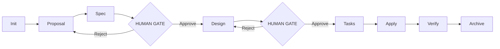
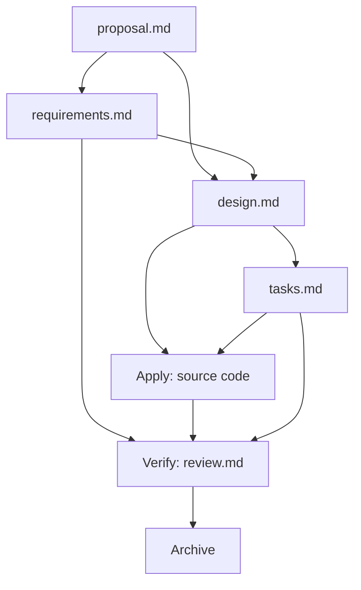

# 04 — Specification-Driven Development: The Formal Method

## 🎯 Learning Objectives

- Define Specification-Driven Development (SDD) as the formal protocol layer that runs inside a harness
- Explain why SDD treats specifications as the source of truth rather than reference documents
- Apply EARS notation to write requirements that both humans and machines can parse
- Distinguish the three spec files — requirements, design, tasks — by the type of decisions each contains
- Justify exactly two human gates in the SDD pipeline
- Trace how the Phase DAG and Artifact Dependency together form a constraint system the harness enforces

---

## Introduction

Specification-Driven Development formalizes what every senior engineer does instinctively: specify before you implement. What changes under SDD is that the specification becomes a *machine-consumable artifact*, not an ephemeral conversation that disappears with your chat history.

SDD is the choreography layer. If Harness Engineering ([[03 - Harness Engineering - Architecture of Control]]) provides the control structures — phase enforcement, role separation, state machines — then SDD provides the step-by-step protocol that moves work through them. Without SDD, the harness has nothing to enforce. Without the harness, SDD is a document, not a protocol.

The opening move of SDD is a single conviction: **the spec is the permanent artifact.** Code conforms to it. Chat transports it. But the spec persists. This inverts the natural instinct to treat chat as the conversation that matters and instead elevates structured specification files as the engineering ground truth.

The author of the Claude Code SDD system describes building specialized agents — Spec Author, Implementer, Reviewer, Leader — each receiving only curated context. The Implementer never sees the debates that happened during the proposal phase. It receives only `tasks.md`, `design.md`, and the affected source files. This is context isolation applied through the SDD protocol: every agent sees exactly what it needs and nothing more.

---

## 1. The Hierarchy: Where SDD Sits in the Stack

SDD does not exist in isolation. It occupies a specific position in a three-layer stack:

```
Context Engineering (Layer 0 — the physics of attention)
    └─→ Harness Engineering (Layers 1-4 — the control structures)
            └─→ SDD (the protocol running INSIDE those structures)
```

**Context Engineering** gives you clean attention. It ensures that when an agent opens its context window, it sees curated, relevant information — not 80,000 tokens of irrelevant history. Without this layer, subagent contexts become contaminated on the first round-trip, and the SDD protocol collapses because agents make decisions on stale or misleading information.

**Harness Engineering** gives you control structures: phase enforcement, role separation, state machines, artifact gates. It answers "what must happen before an agent can proceed?" and "who is allowed to do what?" It provides the scaffolding.

**SDD** gives you the step-by-step choreography that runs inside those structures. It answers: "what should the agent produce at each phase?" and "what format must that output take?" It is the protocol that defines workflow — the sequence of phases, the shape of deliverables, the handoff contracts between agents.

If you try SDD without context engineering, your agents hallucinate against irrelevant history. If you try SDD without a harness, you have no phase enforcement, no role separation, no state machine. You have a methodology document, not an executable protocol. SDD is only as strong as the layers beneath it.

---

## 2. The SDD Directed Acyclic Graph (DAG)

SDD is a strict DAG. Phases flow in one direction. No phase can be skipped. Rejection loops back to the immediately preceding phase — never further. The DAG structure is not a suggestion; it is the shape of the constraint system the harness enforces.



### Why a DAG?

Directed: phases have a defined predecessor and successor. You cannot enter Design without completing Spec. You cannot enter Apply without completing Tasks. The directionality prevents the agent from inventing its own route through the process — a common failure mode in unconstrained AI systems.

Acyclic: no phase can return to an earlier phase directly. If Spec is rejected, the flow returns to Proposal — not to Init, not to some arbitrary checkpoint. This constraint prevents indefinite backtracking, which would defeat the purpose of a harness by allowing the agent to re-litigate settled decisions.

Gate placement: exactly two human gates — after Spec and after Design — at the highest-leverage decision points. Before the gates, the process is automated. After the second gate, the process is automated. The gates concentrate human judgment where it uniquely adds value: verifying requirements capture intent correctly, and verifying the proposed design is sound.

### Phase Details

| Phase | Input | Output | Agent | Gate |
|-------|-------|--------|-------|------|
| **Init** | Request from human | Structured scope statement | Leader | None — automated intake |
| **Proposal** | User story, project context | `proposal.md` (scope, impact areas, affected files, risk assessment) | Spec Author | None |
| **Spec** | `proposal.md` | `requirements.md` (EARS format, pure WHAT and WHY) | Spec Author | None |
| **Design** | `requirements.md` + `proposal.md` | `design.md` (exact files, architecture, approach, rejected alternatives) | Spec Author | **HUMAN GATE 1** — verify requirements capture intent |
| **Tasks** | `design.md` + `requirements.md` | `tasks.md` (3-7 atomic, ordered, dependent steps with validation criteria) | Spec Author | None |
| **Apply** | `tasks.md` + `design.md` + source files | Modified source code + tests | Implementer | None — automated execution |
| **Verify** | Modified code + `design.md` + `tasks.md` | `review.md` (pass/fail, evidence, coverage, edge cases found) | Reviewer | **HUMAN GATE 2** — verify design was implemented correctly |
| **Archive** | All artifacts from all phases | Archived in `memory/<feature>/` | Leader | Auto-archival — no gate needed |

Why only two human gates? These two decisions — "does the spec capture what we actually mean?" and "does the design make sound engineering decisions?" — are the highest-leverage points in any software development process. Everything else — task decomposition, code generation, test execution, verification — operates within boundaries defined by these two decisions and can therefore be automated.

Why not more gates? Each additional human gate adds latency. If a human must approve task decomposition, the harness defeats its own purpose: automation becomes bottlenecked on human availability. If a human must approve implementation, the Implementer agent becomes a glorified autocomplete rather than an autonomous executor. The two-gate architecture concentrates human oversight precisely where it generates the highest return: making sure the *specification* and *design* are correct — the two documents from which all downstream artifacts derive.

Why not fewer gates? Eliminate the spec gate, and requirements drift goes undetected until verification — when rework is most expensive. Eliminate the design gate, and architectural decisions are never reviewed — the Implementer commits to an approach that may be fundamentally unsound. Zero gates means zero human oversight, and agents left to their own constraints will optimize for completion, not correctness.

---

## 3. EARS Notation: Requirements as Machine-Parseable Contracts

EARS (Easy Approach to Requirements Syntax) is a structured natural language format. It is the bridge between the human gate and the AI implementer: humans read it as prose, machines parse it as structured data.

### The Formal Grammar

EARS defines four requirement patterns, each with a distinct syntactic shape:

```
Pattern 1 — Ubiquitous (always true):
    THE <system> SHALL <response>.

Pattern 2 — Event-driven (trigger-response):
    WHEN <trigger> THE <system> SHALL <response>.

Pattern 3 — State-driven (condition during a state):
    WHILE <state> THE <system> SHALL <response>.

Pattern 4 — Unwanted behavior (error/edge case):
    IF <condition> THEN THE <system> SHALL <response>.
```

The grammar is constrained enough to be parseable — a regex-based parser can extract trigger, system, and response from each line — yet natural enough that a non-technical stakeholder can read a `requirements.md` file and understand what the system must do.

### Why EARS Over Alternatives

**User stories** ("As a user I want to log in so that I can access my dashboard") are narrative, not structural. They describe motivation but not behavior. An Implementer agent reading a user story must guess what exact response the system should produce. EARS eliminates the guess by specifying trigger, system, and response in a fixed pattern.

**Use cases** capture flow but are verbose and unstructured. A use case might describe the happy path, alternate paths, and exceptions across three paragraphs. An Implementer agent must parse those paragraphs to extract actionable requirements. EARS compresses the same information into one sentence per requirement.

**Natural language** has no constraint on ambiguity. "The system should handle authentication" tells the Implementer nothing about what "handle" means — redirect? validate? block? EARS forces specificity: WHEN a new user requests authentication THEN the Gateway SHALL redirect to the configured OAuth2 provider.

### EARS Example: OAuth2 Feature

```markdown
# requirements.md

## Event-driven
WHEN a new user requests authentication
THEN the Gateway SHALL redirect to the configured OAuth2 provider.

## State-driven
WHILE an access token is valid
THE Gateway SHALL allow requests to protected endpoints.

## Unwanted behavior
IF an access token is expired
THEN THE Gateway SHALL return HTTP 401 with a WWW-Authenticate header.

## Ubiquitous
THE Gateway SHALL support Google, GitHub, and generic OIDC providers.

## Event-driven (additional)
WHEN a user requests logout
THEN the Gateway SHALL invalidate the access token within 5 seconds.
```

Each requirement is a single, testable assertion. The Implementer can parse the trigger (`WHEN a user requests logout`), identify the system (`THE Gateway`), extract the expected response (`SHALL invalidate the access token within 5 seconds`), and generate a test case that validates exactly this behavior. The Reviewer can read the same file and verify: does the code produce this response for this trigger? The contract is shared.

### The Dual Readability Property

The central insight of EARS is its dual readability. A human reviewer reads:

> *"WHEN a new user requests authentication THEN the Gateway SHALL redirect to the configured OAuth2 provider."*

...and understands the intended behavior as natural prose.

A machine parses:

> `pattern=event, trigger="a new user requests authentication", system="the Gateway", response="redirect to the configured OAuth2 provider"`

...and can generate test stubs, validate coverage against the requirement list, or flag requirements that have no corresponding implementation.

This dual readability makes EARS the ideal format for the spec file in an SDD pipeline: it is simultaneously a human-auditable contract and a machine-consuming interface. No other requirement format achieves both properties with this minimal syntax.

---

## 4. The Three Spec Files: The Formal Contract

The three spec files are not three sections of one document. They are three separate files because each serves a different audience, a different phase, and a different type of decision. Conflating them is the most common SDD antipattern.

### 4.1 `requirements.md` — The Problem Space

`requirements.md` contains **what** the system must do and **why** it matters. It uses EARS notation exclusively for behavioral requirements. It may include a brief "Context and Motivation" section, but this section explains the problem domain — not the solution.

**What it must NOT contain:** implementation details. No file names. No data structures. No algorithm choices. No code patterns. No "we should use a factory pattern here."

**Why this separation matters:** If `requirements.md` leaks implementation details, the design phase is pre-committed before alternatives are evaluated. The Spec Author has already chosen the approach, and the Design phase becomes rubber-stamping rather than genuine engineering deliberation. This is the #1 SDD antipattern — and it is subtle, because including a file path in a requirement feels helpful. It is not helpful. It contaminates the design space.

```markdown
# requirements.md

## Context
This feature adds OAuth2 authentication to the gateway so that
users can sign in with their existing Google, GitHub, or OIDC accounts
instead of maintaining a separate credential system.

## Requirements

WHEN a new user requests authentication
THEN the Gateway SHALL redirect to the configured OAuth2 provider.

WHILE an access token is valid
THE Gateway SHALL allow requests to protected endpoints.

IF an access token is expired
THEN THE Gateway SHALL return HTTP 401 with a WWW-Authenticate header.

THE Gateway SHALL support Google, GitHub, and generic OIDC providers.

WHEN a user requests logout
THEN the Gateway SHALL invalidate the access token within 5 seconds.
```

Note: no mention of `src/auth/oauth2.py`, no mention of middleware vs. decorators, no mention of factory patterns. Pure problem space.

### 4.2 `design.md` — The Solution Space

`design.md` contains **how** the system will be built and **where** the changes live. It answers: what files will be created or modified? What architecture will be used? What algorithms and data structures? What alternatives were considered and why were they rejected?

**What it must NOT contain:** new requirements. If a requirement was not in `requirements.md`, it does not belong in `design.md`. The design answers requirements — it does not invent them.

**Why this separation matters:** The same set of requirements can have multiple valid designs. A requirements file for OAuth2 could be implemented via middleware chaining, via a decorator pattern, or via a proxy pattern. If requirements and design are one file, only one design is ever visible — the one the author happened to think of first. Separation enables A/B testing of approaches: two designers can produce two `design.md` files from the same `requirements.md`, and the human gate can select the superior one.

```markdown
# design.md

## Files to modify
- `src/auth/providers/oauth2.py` (NEW) — OAuth2 provider abstraction with ABC
- `src/auth/providers/google.py` (NEW) — Google provider implementation
- `src/auth/providers/github.py` (NEW) — GitHub provider implementation
- `src/auth/providers/oidc.py` (NEW) — Generic OIDC provider implementation
- `src/gateway/middleware.py:45-120` — Inject auth check into middleware chain
- `config/providers.yaml` (NEW) — Declarative provider configuration
- `tests/auth/test_oauth2.py` (NEW) — Integration tests covering all EARS requirements

## Architecture
Provider pattern with abstract base class and factory method:
- `OAuth2Provider` ABC defines `authenticate(token) -> User` interface
- Each provider (Google, GitHub, OIDC) subclasses the ABC
- Factory function selects provider based on configuration or token issuer claim
- Gateway middleware calls `provider.authenticate(token)` at a single injection point

## Key decisions
- Token validation: verify signature + expiry + issuer at Gateway layer, not at individual endpoints
- Session management: stateless — no server-side session store. Token carries all claims.
- Rate limiting: applied AFTER authentication (authenticated users get different rate limits)

## Alternatives considered
- **Decorator pattern per route**: rejected because it clutters route definitions and makes
  it easy to forget the decorator on new routes. Single middleware injection is safer.
- **Server-side session store**: rejected because it adds infrastructure dependency (Redis)
  and makes horizontal scaling more complex. Stateless tokens eliminate this.
- **Library-based OAuth2 (e.g., Authlib)**: rejected for this feature because the
  providers we need are simple enough that no library overhead is justified.
```

### 4.3 `tasks.md` — The Execution Space

`tasks.md` breaks the design into 3-7 atomic, ordered, explicitly dependent steps. Each task has: a description, a dependency list, and validation criteria.

**Why 3-7 tasks:** Fewer than 3 means the tasks are not atomic enough — each task carries too much scope to validate independently. More than 7 means the proposal has too many dependencies — it should be split into sub-proposals. The 3-7 range is the empirical sweet spot: enough granularity for validation at each step, not so much granularity that dependency management becomes a separate problem.

**Why tasks are separate from design:** The design answers "what is the solution?" The tasks answer "in what order do we build it?" These are different questions. A single design can be decomposed into tasks in multiple valid orders, depending on the Implementer's preferences and the existing codebase state.

```markdown
# tasks.md

## Task 1
**Description:** Create `src/auth/providers/oauth2.py` with `OAuth2Provider` ABC.
The ABC must define `authenticate(token: str) -> User` as an abstract method.
Add a factory function `get_provider(provider_name: str) -> OAuth2Provider`.
**Depends on:** None.
**Validation:** ABC defines `authenticate` as abstract. Factory returns correct subclass.

## Task 2
**Description:** Implement Google provider in `src/auth/providers/google.py`.
Subclass `OAuth2Provider`. Validate Google-issued JWT tokens using Google's public JWKS endpoint.
Extract user claims (sub, email, name) and return a User object.
**Depends on:** Task 1.
**Validation:** `provider.authenticate(valid_token)` returns User. Invalid token raises AuthError.

## Task 3
**Description:** Implement GitHub provider in `src/auth/providers/github.py`.
Subclass `OAuth2Provider`. Exchange GitHub OAuth code for token, then validate.
**Depends on:** Task 1.
**Validation:** GitHub OAuth flow produces valid token. Token validation returns User.

## Task 4
**Description:** Implement generic OIDC provider in `src/auth/providers/oidc.py`.
Subclass `OAuth2Provider`. Support any OIDC-compliant provider via discovery endpoint.
**Depends on:** Task 1.
**Validation:** OIDC discovery resolves. Token validation works for any compliant provider.

## Task 5
**Description:** Inject auth middleware into gateway request pipeline at `src/gateway/middleware.py:45-120`.
Extract token from Authorization header. Call provider.authenticate(). Attach User to request context.
Return 401 if authentication fails.
**Depends on:** Task 1 (ABC must exist for middleware to import).
**Validation:** Requests with valid tokens reach protected endpoints. Requests with invalid tokens get 401.

## Task 6
**Description:** Write integration tests in `tests/auth/test_oauth2.py`.
Cover all EARS requirements from `requirements.md`. Include valid-token, expired-token,
unsupported-provider, and missing-header scenarios.
**Depends on:** Tasks 2, 3, 4, 5.
**Validation:** All tests pass. Coverage exceeds 85% on auth module.
```

The Implementer consumes **only** `tasks.md` and `design.md`. It never sees `requirements.md` — that file belongs to the Spec phase, and the Implementer works within boundaries already set by the approved design. This is curated context in action: the Implementer sees exactly what it needs to write code, and nothing that would confuse or distract it.

---

## 5. Spec > Code > Chat: The Hierarchy of Truth

SDD enforces a non-negotiable hierarchy:

```
SPEC  (permanent, source of truth)
  ↓
CODE  (conforms to spec, auditable against spec)
  ↓
CHAT  (ephemeral transport, never the record)
```

**The spec is permanent.** It lives in version control. It outlives the chat session, the sprint, and the developer who wrote it. Decisions captured only in the spec survive.

**Code conforms.** If the spec says "SHALL return HTTP 401" and the code returns 403, the code is wrong — not the spec. The spec is always the arbiter. This means code reviews compare code against `design.md` and `requirements.md`, not against the reviewer's intuition.

**Chat is transport.** Chat is the medium through which humans and agents communicate, but it is never the record. If a decision is made in chat and not written to a spec file, the decision never happened. This is the hardest inversion for teams accustomed to scrolling through Slack history to reconstruct decisions. Under SDD, the chat log is disposable. The spec file is not.

This hierarchy works identically for human and AI executors. Give the same `tasks.md` and `design.md` to a junior developer and an AI agent. Both can implement the feature. The quality difference traces back to the spec, not the executor's skill. A precise spec produces consistent output regardless of who (or what) implements it. An ambiguous spec produces variable output — and the variability is not the executor's fault.

The spec is the difference.

---

## 6. Phase Gating: The Hard Constraints

The Phase DAG defines **order** — which phases precede which. But order alone is insufficient. The harness must also enforce **artifact dependency** — which artifacts must exist before a phase can begin.

### The Constraint System

| Phase | Required Predecessor Phases | Required Artifacts |
|-------|---------------------------|--------------------|
| Init | None | User request |
| Proposal | Init | Structured scope |
| Spec | Proposal | `proposal.md` |
| Design | Spec | `proposal.md` + `requirements.md` |
| Tasks | Design (approved) | `requirements.md` + `design.md` |
| Apply | Tasks | `tasks.md` + `design.md` |
| Verify | Apply | `tasks.md` + `requirements.md` + modified code + test results |
| Archive | Verify | All artifacts from all phases |

The Phase DAG + Artifact Dependency together form a **constraint system**. You cannot proceed to a phase unless (a) the previous phase is complete and (b) all required artifacts from earlier phases exist at expected paths.

### What "Hard Constraint" Means

A hard constraint is not a warning. It is not a suggestion that the agent can override with "I'll skip that for now." The harness **stops** if artifacts are missing. If `design.md` does not exist at the expected path, the Tasks phase does not start — the agent receives a blocking error and the human is notified.

Without hard constraints, the harness degrades into a suggestion system. An agent that can skip phases will skip phases — AI systems optimize for completion velocity, not process fidelity. The harness exists precisely to prevent this optimization from occurring.

### The Artifact Dependency DAG



Each artifact feeds into specific downstream phases. `proposal.md` feeds Spec and Design. `requirements.md` feeds Design and Verify. `design.md` feeds Tasks and Apply. `tasks.md` feeds Apply and Verify. If an artifact is missing from its expected position in the graph, the downstream phase cannot execute. The harness enforces this — it does not pretend everything is fine.

---

## 7. Result Contracts: What Passes Between Phases

Between phases, agents must return structured envelopes — not free-form text. The author of the Claude Code SDD system specifies a consistent contract that every phase agent must fulfill:

```json
{
  "status": "pass" | "fail" | "blocked",
  "executive_summary": "One-paragraph summary of what was produced or why it failed",
  "artifact": "Path to the produced artifact file",
  "next_recommended_action": "Continue to <next_phase>" | "Retry current phase" | "Escalate to human",
  "risk_assessment": {
    "level": "low" | "medium" | "high",
    "details": "Specific risk identified during this phase"
  },
  "skill_resolution": {
    "skills_used": ["list of skills that successfully executed"],
    "skills_unresolved": ["list of skills that failed to resolve or were unavailable"]
  }
}
```

### Why Contracts Matter

**Without contracts, the orchestrator guesses.** The Leader agent reads the output of the Spec Author and must decide: is this ready for Design? If the Spec Author returned free-form prose, the Leader must interpret prose to make a deterministic decision. That interpretation is fallible. The Leader becomes a tech lead who guesses what their team produced.

**With contracts, the orchestrator makes deterministic decisions.** If `status` is `"fail"`, the Leader knows to retry the phase or escalate. If `status` is `"blocked"`, the Leader knows a dependency is missing and must be resolved before proceeding. If `status` is `"pass"` and `next_recommended_action` is `"Continue to design"`, the Leader advances the state machine. No interpretation required.

**The `risk_assessment` field** gives the human gate a signal. A Design phase that returned `"status": "pass"` but `"risk_level": "high"` tells the human: the agent completed the phase but identified something concerning. The human can then read the `risk_details` and decide whether to approve or question.

**The `skill_resolution` field** provides operational visibility. If a phase agent tried to use a skill that failed to resolve, the orchestrator knows there is a dependency problem in the skill infrastructure. This is not a phase failure — it is an infrastructure failure that the orchestrator can surface to the human without halting the pipeline.

A guessing orchestrator is a guessing tech lead. A contract-driven orchestrator is a deterministic state machine.

---

## 8. Human-in-the-Loop: Why Only TWO Gates

The placement of human gates in the SDD pipeline is a deliberate optimization, not an arbitrary choice. The pipeline has eight phases. Only two have human gates. This is not because the other phases are unimportant — it is because the two gated phases are the highest-leverage decision points.

### Gate 1: Spec Approval (after Spec, before Design)

**What the human checks:** Do the EARS requirements capture the correct intent? Are there missing requirements? Are there over-specified requirements that constrain design unnecessarily? Does the spec capture edge cases and failure modes, not just happy paths?

**Why this gate matters:** Every downstream artifact — design, tasks, code, tests, verification — derives from the spec. If the spec is wrong, every downstream artifact is wrong. Catching a spec error at the Spec gate costs minutes. Catching the same error at the Verify gate costs a full development cycle.

### Gate 2: Design Approval (after Design, before Tasks)

**What the human checks:** Is the architecture sound? Are the chosen files and patterns appropriate? Were alternatives genuinely considered and reasonably rejected? Does the design have hidden complexity or unnecessary abstraction?

**Why this gate matters:** The design is the last creative decision point. After Design approval, the process becomes deterministic: task decomposition is mechanical (given a design, any competent engineer can break it into 3-7 atomic steps), implementation is execution (given tasks + design, any competent engineer can write the code), and verification is comparison (does the code satisfy the spec?). There is no new engineering judgment required after the Design gate.

### Why Not More Gates?

**More gates = slower iteration.** Each human gate adds latency proportional to human availability. If a human must approve task decomposition, tasks become a bottleneck. If a human must approve implementation, the Implementer agent cannot operate autonomously and the harness loses its velocity advantage. Humans become the bottleneck, and the harness defeats its own purpose.

**More gates = diffusion of responsibility.** When every phase requires human approval, no single decision point carries the full weight of oversight. The human reviewer at Gate 4 thinks "Gate 3 already approved this." The cumulative effect is that oversight weakens rather than strengthens.

**Fewer gates = no human oversight.** Zero gates means the agent pipeline runs end-to-end without human judgment. This works for well-defined, low-risk changes. It fails catastrophically when the agent makes an assumption that is technically correct but semantically wrong — something that passes automated checks but violates user intent. The two gates catch these semantic failures.

### The Optimal Balance

Two gates at the highest-leverage decision points — spec correctness and design soundness — is the optimal balance. Everything before the gates is automated preparation. Everything between the gates is automated execution. Everything after the second gate is automated production. Human judgment is concentrated precisely where it generates the highest return.

---

## 9. Case Study: Fazt Code — SDD in 4 Minutes

Fazt Code, a YouTube educator specializing in AI-assisted development, demonstrated a complete SDD cycle in 4 minutes using a Claude Code harness. The demonstration is notable not for the feature complexity (it was a straightforward code change) but for the **density of the workflow** — how many structured phases the harness executed in a compressed time window.

### The Timeline

| Phase | Duration | What Happened |
|-------|----------|---------------|
| **Proposal** | ~30s | User story entered into harness. Leader parses, creates structured scope. |
| **Spec** | ~60s | Spec Author reads context, produces `requirements.md` (EARS), `design.md` (file paths, approach), `tasks.md` (5 ordered steps). Three spec files generated in parallel where dependencies allow. |
| **Human Gate 1** | ~30s | Human reviews `design.md` — checks file list, approach, rejected alternatives. Approves. |
| **Apply** | ~90s | Implementer receives curated context: `tasks.md` + `design.md` + affected source files. Modifies 5 files, writes tests. Implementer never saw the proposal debate. |
| **Verify** | ~30s | Reviewer produces `review.md`: all tasks complete, tests pass, coverage threshold met. |

Total: 4 minutes from proposal to verified implementation.

### What Made the Speed Possible

The speed is not the point — it is a **consequence** of the structure. Four architectural decisions made this density possible:

**Curated context.** The Implementer received exactly three inputs: `tasks.md`, `design.md`, and the files listed in `design.md`. Nothing else. No chat history. No proposal debates. No exploration dead-ends. The Implementer's context window was pure signal. This is context isolation applied through the SDD protocol — and it is what makes sub-agent execution fast and reliable.

**Phase-gated agents.** Each agent does exactly one thing, in one phase. The Spec Author does not implement. The Implementer does not design. The Reviewer does not fix. This single-responsibility constraint eliminates the context-switching cost that dominates human developer workflows.

**Artifact persistence.** Everything is a file. The proposal is a file. The spec is three files. The review is a file. Nothing is lost to chat history. If the Implementer fails, the Leader re-invokes it with the same `tasks.md` + `design.md` — no reconstitution from memory required.

**Human gates at the right points.** The human spent 30 seconds on the only two decisions that required human judgment: "does this spec capture what I meant?" and "is this design sound?" Everything else ran autonomously.

### The Traceability Guarantee

Because every phase produces a file, the entire development history is auditable. To understand why a particular line of code exists:

1. Read `review.md` — see which task produced it
2. Read `tasks.md` — see which design decision mandated it
3. Read `design.md` — see which requirement drove the decision
4. Read `requirements.md` — see the original intent

Rollback is trivial: read `design.md` for the file list, `git checkout` those files. No archaeology required.


---

## 🎯 Key Takeaways

- **SDD is the protocol layer that runs inside the harness.** The harness provides control structures; SDD provides the choreography that moves work through them.
- **The spec is the source of truth — permanently.** Code conforms. Chat is disposable. If it is not in a spec file, it did not happen.
- **The SDD DAG enforces unidirectional flow.** No phase skipping. Rejection loops back only to the preceding phase. The DAG is a contract, not a suggestion.
- **EARS notation bridges human and machine readability.** Four patterns (Ubiquitous, Event-driven, State-driven, Unwanted) are parseable by regex, readable by stakeholders.
- **Three spec files, not one.** `requirements.md` = WHAT/WHY (problem space). `design.md` = HOW/WHERE (solution space). `tasks.md` = execution plan. Conflating them is the #1 SDD antipattern.
- **Exactly two human gates at the highest-leverage decision points.** More gates create bottlenecks; fewer gates eliminate oversight. Spec and Design approval is the optimal balance.
- **Phase Gating = Phase DAG + Artifact Dependency.** Order defines what comes next. Artifacts define what must exist. Together they form a constraint system the harness enforces.
- **Result contracts eliminate orchestrator guesswork.** Structured envelopes (status, summary, artifact, risk, skills) mean the Leader makes deterministic phase-transition decisions.

---

## 🔗 Production Integration

SDD is not an isolated protocol. It is the choreography that makes every other layer in the harness meaningful.

**File Architecture ([[05 - File Architecture]]):** The three spec files — `requirements.md`, `design.md`, `tasks.md` — must live at predictable paths for the harness to find them. The File Architecture layer defines those paths and ensures each spec file exists in the right directory for its feature. SDD defines *what* the files contain; File Architecture defines *where* they live.

**Multi-Agent Orchestration ([[06 - Multi-Agent Orchestration and Capstone]]):** The SDD Phase DAG is the orchestrator's execution plan. The Leader agent reads `tasks.md`, spawns the Implementer with curated context, receives the result contract, and transitions the state machine. SDD provides the choreography; the orchestrator executes it.

**Verification and Quality Gates ([[08 - Verification and Quality Gates]]):** The Verify phase in SDD produces `review.md`, but the quality gate system determines whether `review.md` meets the threshold for archival. SDD defines the verification *process*; Quality Gates define the verification *criteria*.

Together, these layers form a complete production pipeline: SDD defines what to build and in what order, File Architecture defines where everything lives, Orchestration executes the plan, and Quality Gates certify the result.

---

## References

- Alistair Mavin et al., "Easy Approach to Requirements Syntax (EARS)," *RE 2009* — the original EARS paper establishing the four-pattern notation
- The Claude Code SDD system by the video author — specialized agents (Spec Author, Implementer, Reviewer, Leader), three spec files, EARS notation, human-in-the-loop gates
- "20 Agent Harness" (5Q7jV8TpMXA) — Phase DAG, Artifact Dependency Harness, Result Contract Harness concepts and constraint enforcement design
- "Adaptando Claude Code para SDD" (ElGlTv2A_bM) — SDD as a compiler analogy: the spec is source code, AI is the compiler, the developer works on the specification, not on the generated code
