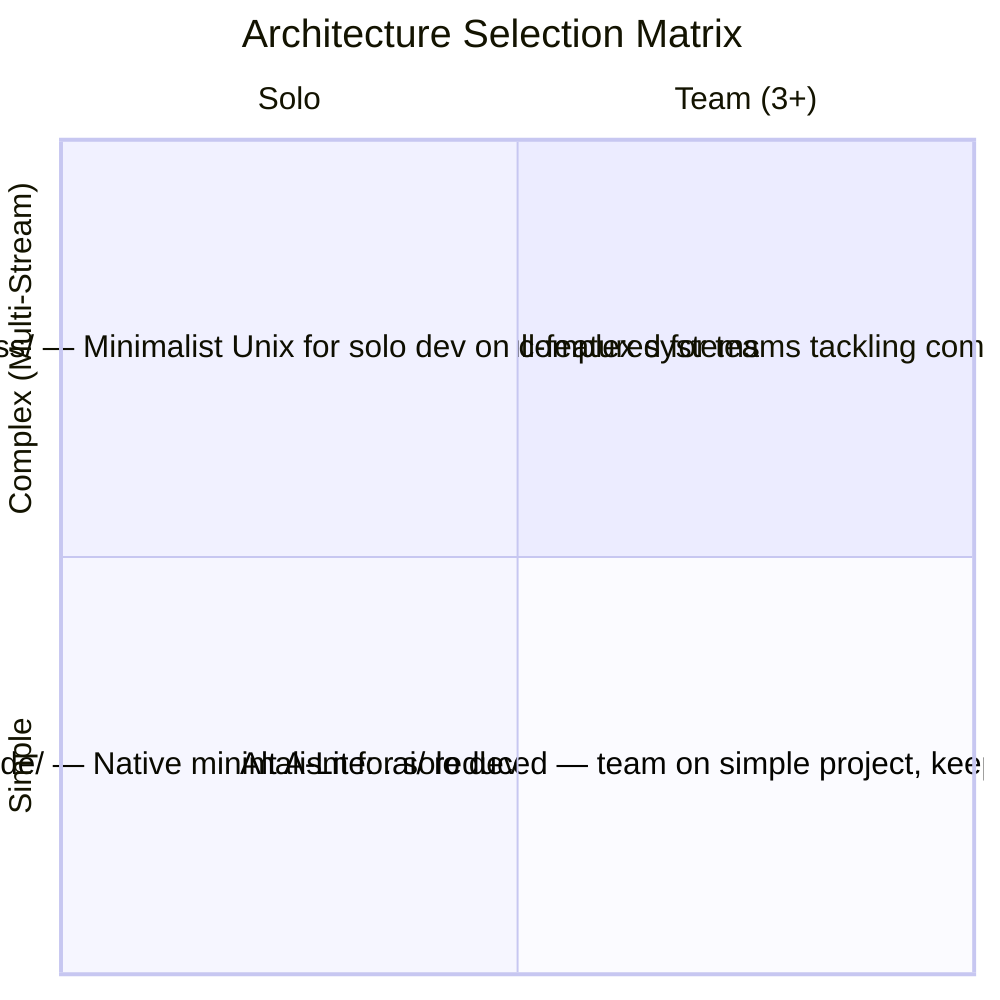

# 05 — File Architecture: The Structural Foundation

## 🎯 Learning Objectives

- Explain why file architecture in a harness is **context engineering**, not project organization
- Compare four reference architectures and select the right one using the quadrant decision matrix
- Categorize every harness file into one of three functional groups: structural, knowledge, memory
- Design agent definition files as contracts between orchestrator and subagent
- Implement the complete skill lifecycle: registry, injection, resolution, and resolution feedback
- Build external memory systems (decisions, learnings, knowledge graphs) that persist across sessions
- Justify `init.sh` as an idempotent, fail-fast environment gate — the first line of defense

---

## Introduction

The file system is the harness's control plane. Every layer of the Onion Model from [[03 - Harness Engineering - Architecture of Control]] — tools, subagents, skills, CI/CD — manifests as files and directories. Not services. Not runtimes. Not databases. Files. A **directory convention** in your repository — version-controlled, auditable via `git log`, portable across machines, legible to both humans and AI agents.

The implication is profound: **the directory layout IS the API surface of the harness.** If agents cannot find their role definitions, they operate without constraints. If they read the wrong files, their context becomes contaminated. If they cannot locate the skill registry, they fall back to generic behavior. The file architecture determines which information enters the context window, in what order, and at what cost in tokens. Wrong layout equals contaminated context. Right layout equals agents reading precisely what they need.

---

## 1. Why File Architecture Is NOT Just "Project Organization"

Traditional project organization groups code for human navigability — `src/` for source, `tests/` for tests, `docs/` for documentation. A human glances at the tree, builds a mental map, navigates.

A harness file architecture groups **context** for AI agents. An agent reads files — every file burns tokens. Every file it does NOT read could contain information needed for a correct decision. Every file read unnecessarily wastes context budget — the most precious resource in AI engineering.

The layout becomes a **context budget allocation strategy:**

- **Top-level files** (CLAUDE.md, rules/) are read every session — must be short, high-signal, and justify their recurring token cost.
- **Files in `memory/`** are read on demand — the agent pulls history rather than carrying it in every context.
- **Files in `specs/`** are read by specific agents at specific phases — isolated context, no contamination.

A human organizes a project to find things quickly. A harness architect organizes a project to **control what enters the context window, when, and at what token cost.** When the primary consumer of the file system is a token-budgeted language model, this is operational reality, not analogy.

---

## 2. The Four Reference Architectures

There is no one correct harness directory. There are four reference architectures, each optimized for a different constraint surface. The choice is not aesthetic — it determines how much context your agents consume, how many files your orchestrator must track, and how well the harness survives team growth.

### Alt A: `.ai/` — Full-Featured Gentle Style

```
.ai/
├── agents/
│   ├── leader.md          # Orchestrator agent: routes, spawns, validates
│   ├── spec-author.md     # Requirements and design specialist
│   ├── implementer.md     # Code generation, context-isolated
│   └── reviewer.md        # Quality verification agent
├── skills/
│   ├── sdd-workflow/
│   │   └── SKILL.md       # SDD phase protocol as reusable skill
│   ├── testing-patterns/
│   │   └── SKILL.md       # Test generation conventions
│   └── code-review/
│       └── SKILL.md       # Review checklist and patterns
├── harnesses/
│   ├── spec-harness.yaml  # Spec Author spawn configuration
│   ├── impl-harness.yaml  # Implementer spawn configuration
│   └── rev-harness.yaml   # Reviewer spawn configuration
├── memory/
│   ├── decisions.json     # Architectural Decision Records
│   ├── learnings.md       # Accumulated patterns and gotchas
│   └── sessions/          # Session state preservation
│       └── YYYY-MM-DD/
├── specs/                 # Per-feature specification artifacts
│   └── feature-name/
│       ├── proposal.md
│       ├── requirements.md
│       ├── design.md
│       └── tasks.md
├── tasks.json             # Global state machine
└── init.sh                # Environment verification gate
```

**Why for teams and complex multi-stream projects.** `agents/` provides role separation — each role is a discrete contract file, version-controlled independently. `skills/` offers reusable patterns that multiple agents consume. `memory/` accumulates institutional knowledge across all team members' sessions. `harnesses/` defines spawn parameters (context budget limits, model selection, tool allowances) per agent. This layout targets the largest constraint surface: multiple humans, multiple AI agents, multiple concurrent features, and a project lifetime measured in years.

The cost: more files to navigate, more state to track, higher token budget for file reading. But for a team of three or more on a complex system, the alternative — agents missing role definitions, skills, or memory — costs more in both tokens (repeated corrections) and outcomes (wrong decisions from incomplete context).

### Alt B: `.claude/` — Cloud Code Native

```
.claude/
├── CLAUDE.md                  # Single file: project context, conventions, rules
├── skills/
│   ├── sdd-workflow/
│   │   └── SKILL.md
│   └── code-review/
│       └── SKILL.md
└── docs/                      # Project documentation (generated by AI)
    ├── architecture.md
    ├── api-conventions.md
    └── testing-patterns.md
```

**Why minimalism works.** This is the solo-developer architecture. One CLAUDE.md file loads every session — it contains project overview, tech stack, conventions, critical rules. The `docs/` directory is AI-generated and maintained. Skills are minimal. There is no `memory/`, no `agents/`, no state machine file — the solo developer IS the orchestrator.

**Fewer files equals fewer tokens burned on file reading.** Every file the agent opens to understand its environment costs tokens before it produces a single line of code. In solo development, the budget saved by eliminating agent role files, memory, and harness configs redirects to the actual task. CLAUDE.md acts as a compressed representation of information distributed across multiple files in Alt A.

This architecture fails when a second developer joins — no role separation, no shared memory, no orchestrator to coordinate concurrent work. But for its target — a single developer, a simple project, short cycles — it is optimal.

### Alt C: `.harness/` — Minimalist Unix

```
.harness/
├── agents/
│   ├── spec-agent.md
│   ├── impl-agent.md
│   └── review-agent.md
├── specs/
│   └── feature-name/
│       ├── requirements.md
│       ├── design.md
│       └── tasks.md
├── config.yaml           # Environment configuration
└── tools.json            # Tool registry and permissions
```

**Why the Unix philosophy — each directory does one thing well.** The middle ground between Alt A and Alt B, inspired by the Vercel/D0 research lineage. `agents/` defines roles as concise markdown contracts. `specs/` holds permanent artifacts. `config.yaml` provides environment variables, model selection, provider configuration. `tools.json` defines the tool registry and permissions.

No explicit `memory/` directory — memory is optional. No `skills/` directory — patterns embed in agent definitions. The philosophy: a harness needs agents (who does what), specs (what is produced), config (where and how), and tools (with what capabilities). Everything else is optional until proven necessary by pain.

An agent role change only touches `agents/`. A tool permission change only touches `tools.json`. A spec update only touches `specs/`. The layout minimizes blast radius — a characteristic inherited from decades of Unix filesystem convention design.

### Alt D: `.ai-harness/` — ML/AI Production

```
.ai-harness/
├── agents/
│   ├── trainer.md        # Model training orchestration
│   ├── evaluator.md      # Model quality assessment
│   ├── deployer.md       # Docker/K8s deployment specialist
│   └── monitor.md        # Production metrics tracking
├── skills/
│   ├── hyperparameter-search/
│   │   └── SKILL.md
│   ├── data-pipeline/
│   │   └── SKILL.md
│   └── model-registry/
│       └── SKILL.md
├── memory/
│   ├── experiments.json  # Experiment tracking: params, metrics, results
│   ├── model-registry.json  # Model versions, lineage, deployment status
│   └── decisions.json    # Architecture decisions specific to ML infra
├── specs/
│   └── experiment-name/
│       ├── hypothesis.md
│       ├── design.md
│       └── results.md
├── tasks.json
└── init.sh
```

**Why ML projects need a different structure.** ML development has concerns general-purpose harnesses cannot address: experiments (not features) are the unit of work; datasets are living artifacts; model registries track lineage across versions; evaluation is continuous, not a one-time gate.

The agent roles map to the ML lifecycle: training (model development), evaluation (quality assessment), deployment (production serving), monitoring (drift and degradation). The memory system tracks experiments — hyperparameters, dataset versions, metric curves, model artifacts. The spec system captures hypotheses — what we expect to happen, what we measure, what threshold defines success.

This architecture is not an extension of Alt A. It is a different design because the core abstractions differ. An ML project does not produce source files that satisfy requirements — it produces models that satisfy metrics. The harness must reflect this fundamental difference.

---

## 3. Architecture Selection: The Decision Matrix

The four architectures are not slots on a preference spectrum. They solve different constraint equations. The selection matrix makes the mapping explicit:



**The constraint equations that drive the mapping:**

**Team Size (x-axis):** More team members → more concurrent sessions → need role separation. If two developers spawn agents simultaneously, those agents must not share context. Role separation in `agents/` is the mechanism. Single developer → no concurrent sessions → no role separation required.

**Project Complexity (y-axis):** More complexity → more decisions that must persist → need memory. A complex multi-stream project generates architectural decisions faster than a human can remember. `decisions.json` and `learnings.md` become the project's institutional memory. Simple project → fewer decisions → CLAUDE.md suffices as compressed memory.

**The ML exception:** ML projects occupy a different plane. The unit of work (experiments), artifact type (models), and success criteria (metrics) are fundamentally different from general software engineering. Alt D exists because neither team size nor general complexity captures ML-specific concerns.

**The quadrant logic, formalized:**
- **Q3 (Solo, Simple) → Alt B:** Minimal constraint surface. One developer, one stream, short cycles. Overhead is waste.
- **Q2 (Solo, Complex) → Alt C:** Complexity demands structure (agents, specs, tools), but team size does not demand role separation or memory.
- **Q1 (Team, Complex) → Alt A:** Full constraint surface. Roles, skills, memory, harness configs — every subsystem earns its keep.
- **Q4 (Team, Simple) → Alt A minus skills/:** Teams need role separation and memory even for simple projects — shared state is the coordination surface. Skills deferred until patterns repeat enough to justify extraction.

---

## 4. The Three Categories of Harness Files

Every file in a harness directory falls into exactly one of three categories. This taxonomy is not academic — it determines when a file is read, by whom, and at what cost to the context budget.

### Structural Files (the Skeleton)

Structural files do not contain AI-relevant content. They are the infrastructure that makes the harness run — the engine, not the fuel.

- **`init.sh`:** The environment verification gate. Runs before any agent spawns. Checks that required tools exist, environment variables are set, directories exist. Idempotent. Fail-fast. Does not burn agent context tokens because it runs outside the LLM entirely.
- **`tasks.json`:** The state machine. Tracks which features are in which phase, which agent is assigned, what artifacts have been produced. The orchestrator reads this file — it is deterministic logic, not AI reasoning.
- **`config.yaml` / `tools.json`:** Environment and tool configuration. These are parsed by the orchestrator when spawning agents to set context limits, model selection, and tool permissions.

Structural files are consumed by the deterministic orchestrator, not by the AI agents. They are the mechanical skeleton that makes the harness operational.

### Knowledge Files (the Brain)

Knowledge files define WHAT agents should know and HOW they should behave. They are consumed by AI agents at runtime — directly burning context tokens.

- **Agent definitions** (`agents/*.md`): Role contracts specifying responsibilities, input/output constraints, tools, and behavioral rules. Read once per agent spawn.
- **Skills** (`skills/*/SKILL.md`): Reusable patterns — step-by-step workflows, conventions, checklists. Injected into agent context during the spawn phase based on relevance.
- **Conventions** (`CLAUDE.md`, project standards): Global rules that apply to all agents. Read every session. Must be short because they carry a recurring token cost.
- **Spec files** (`specs/**/*.md`): The permanent artifacts of SDD — proposals, requirements, designs, tasks. Read by specific agents at specific phase transitions.

Knowledge files are the most expensive category in context budget. Their design — what goes where, how concise, how specific — directly determines agent performance. A CLAUDE.md that is 5,000 tokens long costs 5,000 tokens every session before any work begins. A skill file that is never used still cost the token to check if it was relevant. Knowledge file architecture is token budget architecture.

### Memory Files (the History)

Memory files record what happened so future sessions benefit. They are read on demand, not every session.

- **`decisions.json`:** Architectural Decision Records. Why PostgreSQL over MongoDB. Why Redis for rate limiting. Why middleware over decorator pattern. Each record: decision, alternatives considered, rationale, consequences. Accumulates across all sessions and all developers.
- **`learnings.md`:** Accumulated wisdom. Patterns that work. Gotchas to avoid. "Never use X library with Y configuration because of Z." Written by agents as a post-mortem after each feature completion.
- **`sessions/`:** Session state preservation. If a session is interrupted, the state is recoverable from disk. The chat is disposable. The artifacts in `specs/` and the records in `memory/` persist.

Memory files are the counterweight to context degradation. When the context window compacts, the current session's history is lost — but the knowledge in `decisions.json` and `learnings.md` survives. Future agents inherit the project's accumulated wisdom without consuming the tokens that produced it.

---

## 5. Agent Definition Files: The Contract Pattern

An agent definition file is a **contract between the orchestrator and the subagent.** It is not a prompt. It is not a system message. It is a specification that constrains agent behavior through mechanical boundaries enforced by the harness at spawn time.

The contract exists as a file — not embedded in orchestrator code — for three reasons:

1. **Version control.** Agent behavior changes are auditable via `git log agents/implementer.md`. When an agent starts producing wrong output, you can trace exactly when its contract changed.
2. **Modifiability without code.** Changing what the Implementer is allowed to do should not require changing the orchestrator's source code. It should require editing `agents/implementer.md` — a configuration change, not a code change.
3. **Portability.** The same agent contract works across different orchestrators, different models, different providers. The contract defines what the agent does; the orchestrator enforces it.

**The contract template:**

```
# Agent: [Name]

## Role
One sentence. What this agent is responsible for.

## Responsibilities
- Specific, measurable duties. Not "writes code" but "writes code that passes existing tests."
- Maximum 5-7 bullets. Beyond this, the role is too broad.

## Inputs
- What files this agent is allowed to read
- Format: `specs/feature-name/tasks.md` (task list)
- Explicit paths, not patterns. Prevents context contamination.

## Outputs
- What files this agent must produce
- Format: `src/feature/file.py` (modified source)
- The orchestrator validates these exist after agent execution.

## Tools
- Exact tool names this agent can invoke
- Tool restriction is mechanical: unregistered tool = unreachable function

## Constraints
- MUST NOT: hard constraints enforced by the harness
- SHOULD NOT: soft constraints enforced by agent behavior
- Example: MUST NOT modify files outside listed input paths
```

The contract is validated at spawn. The orchestrator reads `agents/implementer.md`, extracts the input paths, curates exactly those files into the subagent's context, and provides exactly the listed tools. The agent literally cannot access files or tools outside its contract — not because it was instructed not to, but because the mechanical boundary prevents it.

This is the file-architecture expression of Layer 2 (Subagents) from the Onion Model in [[03 - Harness Engineering - Architecture of Control]]. The agent definition file IS the role boundary.

---

## 6. The Skill System: Registry, Injection, Resolution

Skills are reusable patterns — not agents, not tools, not conventions. A skill is "how to do X in this project." The skill system has three stages and one critical feedback loop. Deep theory from the Agent Harness research (5Q7jV8TpMXA) informs each stage.

### Skill Registry

The skill registry answers: **what skills exist for this project?**

Each skill is a `SKILL.md` file in `skills/<skill-name>/`. The format:

```
# Skill: [Name]

## Purpose
What problem this skill solves. One paragraph.

## When to Use
Conditions that trigger this skill. "When the agent needs to generate tests for a Python module."

## Input Checklist
What must exist before this skill can be applied.
- [ ] `design.md` exists for the current feature
- [ ] Source files to test are listed in `design.md`
- [ ] Test framework is configured (pytest, jest, etc.)

## Steps
Numbered, actionable. Each step produces something verifiable.
1. Read the source file listed in `design.md`.
2. Identify public functions and methods.
3. For each: generate test for happy path, edge case, error condition.
4. Write tests to `tests/` mirroring source structure.
5. Run tests. If fail, fix implementation. Re-run. Repeat until green.

## Output Format
What the agent should produce. "Test file at `tests/<module>/test_<file>.py` with coverage of all public functions."
```

The registry is a directory. To check if a skill exists, the orchestrator checks `skills/<name>/SKILL.md`. If the file exists, the skill is registered. If it doesn't, the skill is not available for this project. This is simpler and more auditable than any database, API, or in-memory registry.

### Skill Injection

Skill injection answers: **which skills does this agent receive?**

The orchestrator selects skills based on the agent's role and the current phase. The Spec Author receives the `sdd-workflow` skill. The Implementer receives `testing-patterns` and `code-review`. The Reviewer receives `code-review` only.

The critical principle: **not all skills for everything.** If the orchestrator injected every skill into every agent, the context budget would be consumed by skill descriptions, not by actual work. The injection is selective — based on role, phase, and task.

The Context Compiler concept from the Agent Harness research applies here: the orchestrator does not hand the subagent a pile of SKILL.md files and say "read these 1000 pages and behave." The orchestrator digests the relevant skills and produces **4-5 concrete, compact rules** for the subagent. The harness transforms reusable knowledge into operational instructions.

### Skill Resolution and Feedback

Skill resolution answers: **did the skill actually apply?**

This is the feedback loop. The result contract (returned by the subagent to the orchestrator after task completion) includes:

```
## Skill Resolution
- sdd-workflow: APPLIED (spec produced in expected format)
- testing-patterns: APPLIED (tests generated per conventions)
- code-review: NOT_AVAILABLE (skill file missing for this project)
```

Without this feedback, the orchestrator is blind. It cannot know whether the subagent followed project standards or fell back to generic behavior. It cannot know whether skills are missing and need to be created. It cannot audit which sessions used which skills.

The resolution feedback enables **continuous harness improvement.** If `code-review` consistently shows `NOT_AVAILABLE`, the team knows to create the skill file. If `testing-patterns` consistently shows `FALLBACK` (skill exists but subagent couldn't apply it), the skill description needs improvement. The harness learns from its own operation.

---

## 7. External Memory: The Knowledge That Persists

The chat is disposable. The artifacts persist. This is the central conviction that separates professional harness engineering from casual AI experimentation.

Every harness session burns tokens. When the context window fills, the oldest tokens are compacted or lost. The chat history — all the exploration, false starts, corrected mistakes, and refined understanding — vanishes from the active context. If that knowledge was only in the chat, it is gone forever. The next session starts from zero.

External memory is the antidote. It writes knowledge to files so that the tokens used to acquire it are amortized across all future sessions.

### decisions.json — Architectural Decision Records

Schema:
```json
{
  "decisions": [
    {
      "id": "ADR-001",
      "date": "2026-05-29",
      "title": "PostgreSQL over MongoDB for user data",
      "context": "User data requires relational integrity for orders, payments, profiles.",
      "decision": "Use PostgreSQL 16 with UUID primary keys.",
      "alternatives": [
        "MongoDB: rejected — no foreign key enforcement across collections",
        "DynamoDB: rejected — query patterns unpredictable during prototyping"
      ],
      "consequences": "Must maintain migration files. Cannot use document-first access patterns."
    }
  ]
}
```

Each ADR records the **decision, alternatives considered, and rationale.** The format is inspired by the ADR pattern from Michael Nygard — lightweight, structured, parseable. Agents write ADRs after significant architecture decisions. Future agents read them to understand WHY the codebase is structured the way it is, without reverse-engineering intent from implementation.

### learnings.md — Accumulated Intelligence

Pattern:
```markdown
## 2026-05-29 — Redis Rate Limiting Gotcha
**Context:** Implemented rate limiting for the LLM Edge Gateway.
**Pattern that worked:** Use sorted sets with sliding window — simpler than token bucket for per-user limits.
**Gotcha to avoid:** Do NOT use Redis KEYS command in hot path. Use SCAN with cursor or maintain a separate index set.
**Agent:** Implementer (session 47a3)
```

Learnings are append-only. Each entry is a pattern that worked or a gotcha to avoid. Over time, `learnings.md` becomes the project's tribal knowledge — the things every developer eventually learns the hard way, now available to every agent on its first session.

### The Knowledge Graph Concept (Graphify)

The problem identified in the OpenCode + Graphify research (-L_faOE-H5g): every new session starts from zero. The agent has no memory of what it read, no idea how files connect, no knowledge of the codebase's structure. Every session, the same tokens are burned re-reading the same files, re-grepping the same patterns, re-discovering the same relationships.

The solution: a knowledge graph that reads the project once and persists the structural understanding.

**Pass 1 — Scan:** Read every file in the repository. Not the content — the structure. File names, imports, exports, function signatures, class hierarchies.

**Pass 2 — Analyze relationships:** Build a graph of dependencies. `src/auth.py` imports from `src/db.py`. `src/db.py` depends on `config.yaml`. Tests in `tests/auth/` cover `src/auth.py`. Skills in `skills/sdd-workflow/` reference `specs/` conventions.

**Pass 3 — Generate knowledge graph:** Store the graph as a file in `memory/knowledge-graph.json`. Load it at session start. When an agent asks "what files handle authentication?", the graph answers without re-scanning the codebase.

The knowledge graph is external memory applied to project structure. It amortizes the token cost of codebase exploration — the most expensive operation an agent performs — across all sessions. The first session pays the cost of building the graph. Every subsequent session benefits from it.

---

## 8. `init.sh`: The Environment Gate

`init.sh` is the most important file in the harness — and it contains zero AI logic. It is a bash script that runs before any agent spawns. It verifies that the environment is correct. If it is not, the harness refuses to start. This is the first line of defense.

**Three properties define a correct `init.sh`:**

**Idempotent.** Run it once, run it a hundred times — same result. No side effects accumulate. It checks state, does not modify it. (Exception: it may create directories that must exist, like `specs/` or `memory/`. These are additive, idempotent operations.)

**Fail-fast.** The first check that fails causes an immediate exit with a specific error message. No "collect all errors and report at the end." Fail-fast prevents cascading failures — if Python 3.11 is not installed, there is no point checking which pip packages are available.

**Informative.** Every error tells the user WHAT failed and WHY it matters. Not "Error: check failed." But "Error: `jq` not found. Required for parsing `decisions.json` in the memory system. Install with `apt install jq`."

```
#!/usr/bin/env bash
# init.sh — Environment verification gate
# Idempotent. Fail-fast. Informative.
set -euo pipefail

# --- Required binaries ---
command -v python3 >/dev/null 2>&1 || {
  echo "❌ python3 not found. Required for agent orchestration."
  exit 1
}

command -v jq >/dev/null 2>&1 || {
  echo "❌ jq not found. Required for parsing tasks.json state machine."
  echo "   Install: apt install jq"
  exit 1
}

# --- Required directories ---
for dir in specs memory agents skills; do
  mkdir -p ".ai/$dir"
done

# --- Required files ---
[[ -f .ai/tasks.json ]] || {
  echo '{"tasks": [], "active": null}' > .ai/tasks.json
  echo "✅ Created .ai/tasks.json (empty state machine)"
}

echo "✅ Environment verified. Harness ready."
```

Without `init.sh`, agents fail silently. A missing binary produces an obscure error deep in the agent's execution — the agent hallucinates a fix, or fails, or produces incorrect output from a misconfigured environment. With `init.sh`, the harness refuses to start until the environment is correct. The failure is at the gate, not inside the agent's reasoning — where it would be invisible, unreproducible, and expensive to debug.

`init.sh` is the deterministic boundary between the environment and the AI. Everything above it is AI territory. Everything below it must be correct before AI enters.

---

## 9. Case Study: LLM Edge Gateway — Architecture Selection in Practice

The LLM Edge Gateway project illustrates how the decision matrix produces an architecture choice and how that choice cascades into agent design, memory structure, and skill selection.

**The project:** A production gateway that routes LLM requests across multiple model-serving endpoints (Docker and Kubernetes), tracks experiment metrics, maintains a model registry with version lineage, and monitors production models for drift and degradation. It involves container orchestration, metric pipelines, artifact storage, and deployment manifests.

**The constraint analysis:**

| Constraint | Value | Implication |
|-----------|-------|------------|
| Team size | 3 engineers | Need role separation, shared memory |
| Project complexity | Multi-stream (serving + training + monitoring) | Need skills system, per-stream specs |
| Domain | ML/AI Production | Need experiment tracking, model registry, evaluation agents |
| Lifetime | Years, with model evolution | Need persistent decisions and learnings |

**The selection: Alt D (`.ai-harness/`).** The quadrant map places this in Q1 (team, complex), which suggests Alt A. But the ML domain override triggers Alt D. The project is not building software that satisfies requirements — it is building infrastructure that trains, evaluates, deploys, and monitors models. The abstractions are fundamentally different.

**Agent role design:**

- **Trainer agent:** Receives experiment hypotheses from `specs/experiment/hypothesis.md`, reads datasets, generates training code, records hyperparameters and metrics to `memory/experiments.json`. Constraint: MUST NOT modify deployment configurations.
- **Evaluator agent:** Receives trained model paths from `memory/model-registry.json`, runs evaluation suites, compares against baseline metrics from `memory/experiments.json`, produces evaluation report. Constraint: MUST NOT modify training code or datasets.
- **Deployer agent:** Receives approved models from `memory/model-registry.json` (status: `evaluated`), generates Docker/K8s manifests, updates serving configuration. Constraint: MUST NOT modify model artifacts.
- **Monitor agent:** Reads production metrics, compares against evaluation baselines, flags drift. Writes alerts to `memory/learnings.md`. Constraint: MUST NOT modify deployment or model registry.

**Why this role separation matters:** In a general-purpose harness (Alt A), you would have Spec Author, Implementer, Reviewer — roles organized around the development process. In an ML harness, you need roles organized around the ML lifecycle. The Deployer does not know how to train. The Trainer does not know how to deploy. Each agent's contract limits its scope to one lifecycle stage — mechanical impossibility of crossing concerns.

**Skill selection:**

- `hyperparameter-search/` → Trainer (how to optimize learning rate, batch size)
- `data-pipeline/` → Trainer (how to version, preprocess, and validate datasets)
- `model-registry/` → Deployer (how to register, version, and promote models)
- `drift-detection/` → Monitor (how to compare production distributions to training distributions)

Each skill maps to exactly one agent. This is not coincidence — it is the skill injection system applying the principle that agents receive only the skills relevant to their role. The Trainer never sees deployment skills. The Deployer never sees hyperparameter search skills.

**Memory design:**

`memory/experiments.json` tracks every training run — hyperparameters, dataset version, metric curves, artifact path. This enables two critical operations: (1) the Evaluator can compare a new model against all previous experiments to determine if it is an improvement, and (2) the Trainer can learn from past experiments without consuming the tokens that produced them.

`memory/model-registry.json` tracks model lineage — which experiment produced which model version, which model is currently deployed, which models were deprecated and why. This is the source of truth for the Deployer and Monitor.

Without this memory structure, the project would have no way to answer "which model is better?" or "what changed between v2 and v3?" — questions that are existential for an ML production system.

---

## 🎯 Key Takeaways

- **File architecture is context engineering at the filesystem level.** The directory layout determines what enters the context window, when, and at what token cost. It is not project organization — it is a budget allocation strategy for the most expensive resource in AI engineering.
- **Four reference architectures map to different constraint surfaces.** Alt B (`.claude/`) for solo/simple. Alt C (`.harness/`) for solo/complex. Alt A (`.ai/`) for team/complex. Alt D (`.ai-harness/`) for ML production. The quadrant matrix formalizes the selection logic.
- **Every harness file belongs to exactly one of three categories.** Structural files (init.sh, tasks.json) are the skeleton — consumed by the orchestrator, not the AI. Knowledge files (agent definitions, skills, specs) are the brain — consumed by agents, burning tokens. Memory files (decisions, learnings, knowledge graph) are the history — consumed on demand, amortizing token costs across sessions.
- **Agent definition files are contracts, not prompts.** They specify role, inputs, outputs, tools, and constraints as a file — version-controlled, auditable, modifiable without code changes. The orchestrator enforces contracts through mechanical boundaries at spawn time.
- **The skill system has three stages and a feedback loop.** Registry: what skills exist (SKILL.md files). Injection: which skills a specific agent receives (role + phase based). Resolution: did each skill apply or fall back? Without resolution feedback, the orchestrator is blind.
- **External memory is the antidote to disposable chat.** decisions.json preserves architectural rationale. learnings.md accumulates patterns and gotchas. The knowledge graph amortizes codebase exploration costs. The chat vanishes; the files persist.
- **init.sh is the deterministic boundary between environment and AI.** It is idempotent, fail-fast, and informative. It prevents silent failures by refusing to start the harness until the environment is correct. No AI logic — pure engineering defense.
- **Architecture choice cascades into every other design decision.** Agent roles, skill selection, memory structure, and init.sh content all derive from which reference architecture the project adopts. The choice is not aesthetic — it determines the shape of the entire harness.

---

## 🔗 Production Integration

File architecture is not an isolated concern. It is the foundation upon which every other harness layer operates:

**Harness Architecture ([[03 - Harness Engineering - Architecture of Control]]):** The Onion Model's five layers map directly to files. Tools (`tools.json`) are Layer 1. Agent definitions (`agents/*.md`) are Layer 2. Skills (`skills/*/SKILL.md`) are Layer 3. CI/CD pipelines (not in the harness directory but referenced) are Layer 4. File architecture is the physical manifestation of the Onion Model — the control hierarchy made concrete in a directory tree.

**Specification-Driven Development ([[04 - Specification-Driven Development]]):** SDD defines WHAT each spec file contains. File architecture defines WHERE each spec file lives. The `specs/` directory tree must be discoverable for the orchestrator to feed the right artifacts to the right agent at the right phase. If the paths are wrong, agents read the wrong specs — contaminated context, wrong output.

**Multi-Agent Orchestration ([[06 - Multi-Agent Orchestration and Capstone]]):** The orchestrator relies on file paths to spawn agents with curated context. It reads `agents/*.md` for role contracts, `skills/*/SKILL.md` for context injection, `tasks.json` for state machine transitions, and `specs/**/*.md` for phase artifacts. File architecture is the API that the orchestrator consumes.

**Verification and Quality Gates ([[08 - Verification and Quality Gates]]):** The quality gate system reads agent output from predictable paths — `review.md`, test results, modified source files. If file architecture changes, the quality gates break. The file layout is the contract between the harness and the CI/CD pipeline.

**Tools and Memory ([[09 - Tools, Provider Abstraction, and Memory]]):** The `tools.json` file and the `memory/` directory are part of the file architecture. Their location, format, and content determine how agents access capabilities and how knowledge persists across sessions.

A well-designed file architecture makes every other layer more efficient — fewer tokens burned on file discovery, less state lost to context compaction, faster agent spawn with curated context. A poorly designed file architecture undermines every other investment in the harness.

---

## References

- Gentle Framework: YAML + bash harness system for Claude Code, Vercel D0 research lineage — origin of the `.ai/` directory convention
- "Estructura de proyecto para IA" (5jCF5KG2xOk) — Project structure optimized for AI development: `src/`, `tools/`, `.claude/`, `docs/` as AI-generated documentation
- "20 Agent Harness" (5Q7jV8TpMXA) — Skill Registry, Skill Injection, Skill Resolution Feedback, Context Compiler, Artifact Store Harness concepts
- "OpenCode + Graphify" (-L_faOE-H5g) — Knowledge graph as external memory: scan, analyze relationships, generate graph once; load at session start
- Michael Nygard, "Documenting Architecture Decisions" — ADR pattern adapted for `decisions.json` schema
- [[03 - Harness Engineering - Architecture of Control]] — The Onion Model that file architecture physically manifests
- [[04 - Specification-Driven Development]] — The protocol that determines what goes in `specs/`
- [[06 - Multi-Agent Orchestration and Capstone]] — How the orchestrator consumes file architecture at spawn time
- [[08 - Verification and Quality Gates]] — How CI/CD consumes file architecture for quality enforcement
- [[09 - Tools, Provider Abstraction, and Memory]] — Deep implementation of `tools.json` and `memory/` systems
