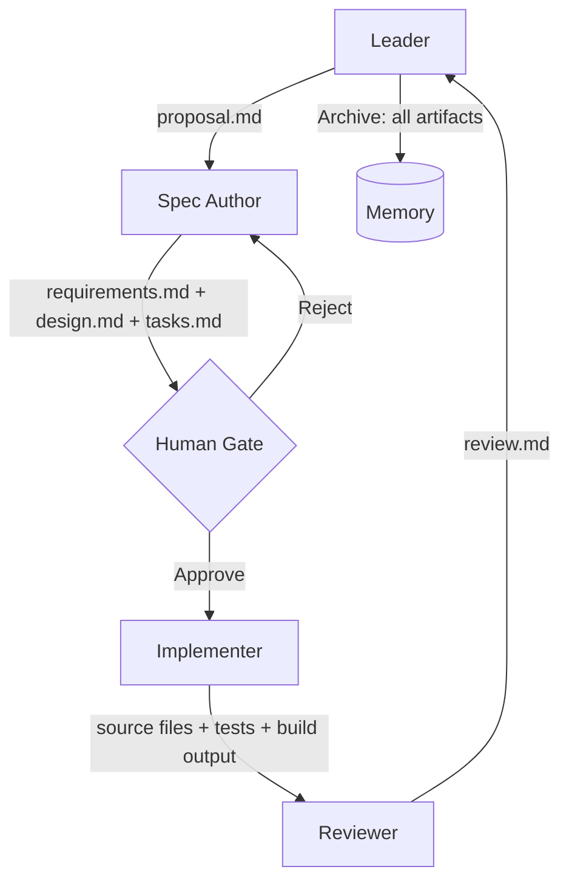
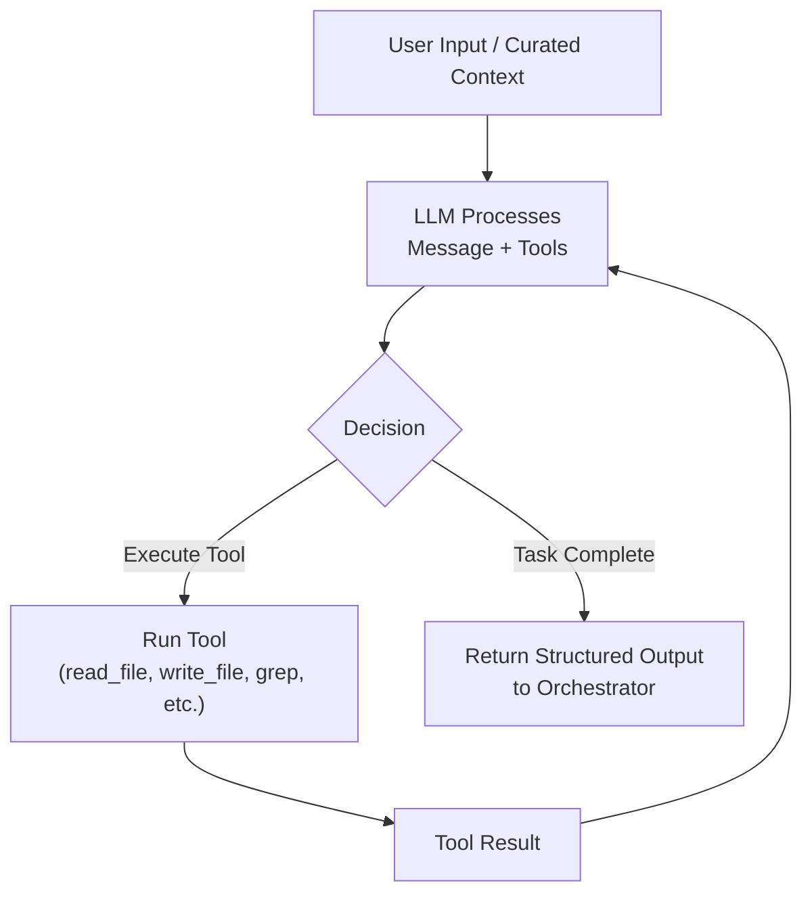
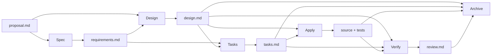
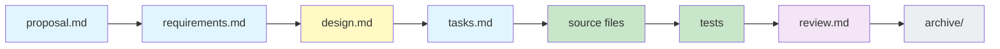

# 06 — Multi-Agent Orchestration and Capstone

## 🎯 Learning Objectives

- Explain why the orchestrator must be a pure deterministic state machine — zero intelligence, zero LLM calls
- Design agent I/O contracts where each role receives only curated context and produces validated artifacts
- Implement context isolation as a mechanical boundary enforced at spawn time, not a prompt instruction
- Distinguish execution modes (interactive vs. automatic) and decide which applies by risk assessment
- Map artifact dependencies across the SDD phase DAG and recognize when missing artifacts must halt the pipeline
- Design result contracts as structured envelopes that enable deterministic orchestration decisions
- Apply the Context Compiler pattern to transform reusable knowledge into compact operational rules
- Walk the complete traceability chain forward (what was built) and backward (why it was built)

---

## Introduction

The preceding notes built the harness layer by layer. [[03 - Harness Engineering - Architecture of Control]] defined the Onion Model — concentric layers of deterministic control around a stochastic core. [[04 - Specification-Driven Development]] defined the protocol — the phase-gated pipeline from proposal to archive. [[05 - File Architecture]] defined the structural foundation.

This note completes the system. **Orchestration is the runtime that brings all layers to life.** Without it, the harness is a static file structure — well-organized, meticulously defined, but inert. With it, the harness transforms a human request into verified, archived, traceable engineering output.

Every principle in this note — context isolation, artifact dependency, result contracts — is demonstrated in the capstone walkthrough. Every concept has been tested in production frameworks like Gentle. Every rule exists because its absence caused a measurable failure.

---

## 1. The Orchestrator Is NOT AI

The orchestrator has zero intelligence. It does not call an LLM. It does not make judgment calls. It does not decide which phase comes next — the phase DAG decides. It does not decide which files a subagent needs — the artifact dependency table decides. It does not decide whether output is correct — the result contract schema decides.

The orchestrator is a deterministic state machine. It reads a configuration, checks preconditions, spawns a subagent, waits for output, validates the output against a contract, and advances state.

```pseudocode
while tasks has tasks with status != "archived":
    for each task in ready state:
        if task.dependencies are satisfied:
            context = curate_context(task.phase, task.assignee)
            result = spawn_subagent(task.assignee, context)
            if validate_contract(result):
                write_artifacts(result.artifact)
                advance_phase(task)
                update_tasks_json(task)
            else:
                halt_with_error("Contract violation")
```

No LLM call in that loop. No inference. No creativity. Pure state machine.

### Why Deterministic Orchestration Matters

If the orchestrator used an LLM, you would have stochastic control over stochastic output — the orchestrator might "decide" to skip verification or "creatively interpret" the phase DAG. A deterministic orchestrator — a bash script, a Python module with no LLM calls — provides a fixed, predictable execution path. When something fails, you debug the script. Same input, same result, every time.

### Case Study: Gentle Framework's Orchestrator

The Gentle framework embodies this principle as YAML + bash:

```yaml
# harness.yaml (simplified)
orchestrator:
  engine: sequential
  max_parallel: 3
phases:
  - name: spec
    agent: spec-author
    gate: human
  - name: implement
    agent: implementer
    depends_on: [spec]
    context: [tasks.md, design.md]
  - name: review
    agent: reviewer
    depends_on: [implement]
    context: [diff, design.md, tasks.md]
```

The orchestrator reads this YAML, spawns the assigned subagent with the specified context, validates the output, and advances. It does not interpret the YAML creatively. It executes it. **The creative work is in the subagents. The control work is in the orchestrator. Separation of concerns at the architectural level.**

Enforced rules: dependencies (Task B waits for Task A), phase transitions (no skipping), parallel limits (configurable max), gate checks (human approval at critical phases), artifact validation (output files must exist and match schema).


> *Like a conductor, the orchestrator does not play an instrument. It ensures every section enters at the right moment, with the right context, producing a coherent whole.*

---

## 2. Agent Roles as Runtime: The I/O Contract Pattern

Each agent is a runtime persona with a defined I/O contract. The contracts are validated at phase boundaries — if an agent produces invalid output, the next agent refuses to consume it. Agent roles are NOT prompts — they are **contracts enforced by the orchestrator.**



| Agent | Inputs | Outputs | Validation Gate |
|-------|--------|---------|-----------------|
| **Leader** | `tasks.json`, user request | `proposal.md`, spawned subagents | Init phase — proposal must exist |
| **Spec Author** | `proposal.md`, codebase (exploration) | `requirements.md`, `design.md`, `tasks.md` | **Human Gate** — design must be approved |
| **Implementer** | `tasks.md`, `design.md`, listed source files | Modified code, tests, build output | Verify phase — tests must pass |
| **Reviewer** | Modified code, `design.md`, `tasks.md`, test output | `review.md` (pass/fail + findings) | Archive phase — contract must match |
| **Memory** | All phase outputs | Persistent artifacts | Archive — files must exist in expected paths |

**The key insight:** the contracts are not enforced by asking the agent to follow instructions. They are enforced by the orchestrator at the mechanical level. The Implementer receives ONLY the context listed in its input column. If `design.md` is missing, the orchestrator does not spawn the Implementer — it halts. If the Reviewer produces output that does not match the `review.md` schema, the orchestrator rejects it and requests a retry.

---

## 3. The Agent Loop: The Game Engine Within Each Agent

Every subagent runs the same internal loop — the fundamental execution unit of multi-agent orchestration. Not special AI magic, but a **deterministic loop that happens to call an LLM.**

### The Game Loop Analogy

A video game at 60 FPS executes: Read Input → Update State → Render → Repeat. The agent loop follows the same structure but produces engineering output:

1. **Read Input** — Curated context enters the agent's window.
2. **LLM Processes** — The model reasons about input, tools, and state.
3. **Decision** — The model emits either a final response (task complete) or a tool call.
4. **Execute Tool** — The harness runs the tool function, captures the result, feeds it back. Re-enters step 2.
5. **Loop Until Done** — Repeats until the model emits a final response.



### What the Harness Provides Around the Loop

Before the loop: the Context Compiler digests skills into 4-5 concrete rules. During the loop: the tool registry gates capability mechanically. After the loop: the result contract validates output structure. The loop is the engine; the harness is the chassis and brakes; the orchestrator decides which engine runs next.

### Subagent Spawning Is Recursive

A subagent can spawn its own subagents. The Spec Author might spawn a "codebase analyzer" to explore authentication middleware independently. Each subagent gets its own isolated loop, context, and tool set. Recursion terminates at configurable depth — typically 2-3 levels.

---

## 4. Context Isolation Protocol: One Agent's Trash Is Not Another Agent's Context

This is the most critical orchestration rule. **Each agent receives ONLY the context relevant to its phase.** The Spec Author sees the proposal and explores the codebase. The Implementer sees the tasks and design — and NOTHING else. The Reviewer sees the code diff, the design, and the test results — but not the proposal debates.

```
Spec Author context   = proposal.md + codebase (exploration phase)
Implementer context   = tasks.md + design.md + listed source files ONLY
Reviewer context      = modified code (diff) + design.md + tasks.md + test results
Memory context        = all artifacts (for archive)
```

**Information MUST be written down in artifacts, not passed through chat.** The Spec Author's internal reasoning about why Alternative B was rejected stays in the Spec Author's session — unless it is written to `design.md`. If it is not in `design.md`, the Implementer cannot know it, cannot use it, and should not care.

This is the principle of "one agent's context is not another agent's context" applied as a mechanical boundary. The orchestrator curates the context at spawn time. It reads the agent contract (from `agents/implementer.md`), extracts the input path list, and assembles exactly those files into the subagent's context. The subagent never receives the full project. It receives precisely what it needs for its phase.

### Why Chat-Based Multi-Agent Fails

Without isolation, every subagent inherits the full conversation history — proposal debates, abandoned alternatives, off-topic comments, preliminary thoughts. This causes three failures:

1. **Token budget wasted** — irrelevant history fills the window before any work begins.
2. **Behavioral confusion** — the Implementer reads Reviewer feedback and crosses role boundaries.
3. **Decision contamination** — reading "we considered FastAPI but rejected it" in a proposal makes the Implementer hesitate to use FastAPI even though the design specifies it.

Context isolation solves all three by treating each agent session as a fresh start with curated inputs — enforced by the orchestrator's spawn mechanism, not by suggestion.

---

## 5. Execution Modes: Interactive vs. Automatic

Not all changes need the same rhythm. Interactive mode: the agent proposes and stops at every critical junction for human decision. Automatic mode: the pipeline advances phase by phase with minimal interruption because risk is contained.

### Interactive Mode

Human gates block at every major decision. The Spec Author produces a proposal and waits before proceeding. The design finishes and waits for human approval before implementation.

**When to use:** New features with uncertain scope. Refactors touching critical infrastructure. Any task where wrong-decision cost exceeds review time cost.

### Automatic Mode

The pipeline advances with minimal interruption. The orchestrator reads a confidence threshold — if artifact quality from previous cycles exceeds it, gates are skipped.

**When to use:** Well-understood bug fixes. Routine dependency updates. Isolated, well-tested modules. Controlled risk, familiar patterns.

### The Mode Is a Deliberate Contract

The mode is set before the pipeline starts — by human or risk assessment:

```yaml
task:
  id: "feat-oauth2"
  mode: interactive
  gates:
    spec: human
    design: human
    implement: auto
    verify: auto
```

**The harness must stop even if the agent wants to continue.** The orchestrator enforces the state machine, not the agent's ambition.

---

## 6. Artifact Dependency: The Mandatory Input Chain

The phase DAG defines the ORDER in which phases execute. Artifact dependencies define the INPUTS required at each phase. Together they form a constraint system that prevents execution without the necessary preconditions.

### The Dependency Map

- **Spec phase** needs: `proposal.md`
- **Design phase** needs: `proposal.md` + `requirements.md`
- **Tasks phase** needs: `requirements.md` + `design.md`
- **Apply phase** needs: `design.md` + `tasks.md` + acceptance criteria
- **Verify phase** needs: `design.md` + `tasks.md` + source code + test evidence
- **Archive phase** needs: all phase artifacts



### What Happens When an Artifact Is Missing

The harness does not proceed. It stops and reports:

```
ERROR: Phase [implement] blocked — missing required artifact 'tasks.md'
Expected at: specs/feat-oauth2/tasks.md
```

If the harness proceeded without mandatory inputs, agents would hallucinate requirements, designs would be unmotivated, and the traceability chain would have a missing link. The harness fails loudly so failures are visible, auditable, and fixable.

---

## 7. Result Contracts: Structured Envelopes Between Phases

Between phases, the orchestrator does not pass raw prose. It passes **contract envelopes** — structured, parseable result objects:

```yaml
contract:
  status: pass                    # pass | fail | blocked
  executive_summary: "Created design.md with Factory + Strategy pattern for OAuth2 providers"
  artifact: specs/feat-oauth2/design.md
  next_recommended_action: "Human approval required before implementation"
  risk: low
  skill_resolution:
    sdd-workflow: applied
    code-review: not_applicable
```

Without contracts, the orchestrator must interpret natural language novels to determine what happened. The orchestrator cannot "read" — it is a state machine. Contracts bridge the gap between LLM output and machine-readable state.

### The Contract Schema

| Field | Type | Purpose |
|-------|------|---------|
| status | enum | Did the phase complete successfully? |
| executive_summary | string | One-sentence summary |
| artifact | path | Where the phase output was written |
| next_recommended_action | string | What the orchestrator should do next |
| risk | enum | How risky is proceeding? |
| skill_resolution | map | Which skills were applied or unavailable |

The orchestrator reads five fields deterministically. If `status` is not "pass," it retries or blocks. If `artifact` does not exist at the specified path, it blocks. If `next_recommended_action` indicates a gate, it halts. A guessing orchestrator is guesswork — contracts make orchestration deterministic, and failures are identified exactly where they occur.

---

## 8. Context Compiler: Rules, Not Raw Documents

The Context Compiler transforms reusable knowledge — skills, project standards, architectural conventions — into compact, actionable instructions for each subagent. This is what separates harness engineering from "just good prompting."

A project accumulates knowledge: `decisions.json` with 50 ADRs, `learnings.md` with patterns, `skills/` with definitions, `CLAUDE.md` with conventions. If the orchestrator injected all of this into every subagent, the context window would be consumed before any work began.

The Compiler reads from the knowledge store, selects what is relevant, and produces **4-5 compact, specific rules:**

```
## Project Standards for This Task
1. All new code must have passing tests at tests/auth/ before merge.
2. Use FastAPI dependency injection for middleware — not decorator pattern.
3. Configuration files are YAML, not JSON.
4. No external auth libraries — implement token validation manually.
5. All public functions must have type annotations.
```

Five rules. Not 1000 pages. The Compiler reads task metadata, the skill registry, relevant ADRs, and relevant learnings — then compresses into operational instructions. If the subagent needs more detail, it has the tool to read files. By default, it receives the compressed version.

**The harness transforms reusable knowledge into operational instructions.** A checklist that fits in a context window, not a library that exhausts it.

---

## 9. Traceability Chain: Every Decision Is a File

The traceability chain is the guarantee that every decision in the pipeline leaves a permanent record. Every link in the chain is a **file on disk** — not a chat message, not a fleeting thought, not a transient state in an LLM's context window.



| Link | Answers | Who Reads It |
|------|---------|--------------|
| `proposal.md` | What problem? What scope? | Spec Author, human reviewers |
| `requirements.md` | What MUST the system do? | Spec Author (for design), Reviewer (for validation) |
| `design.md` | HOW and WHERE? Which files? Why this approach? | **Human Gate**, Implementer, Reviewer |
| `tasks.md` | What are the atomic implementation steps? | Implementer |
| Source files | The code that satisfies the design | Reviewer, future developers |
| `review.md` | Did implementation match design? | Human, Leader (for archive decision) |
| `archive/` | Complete record for auditing and learning | Future agents, post-mortem analysis |

### Walk Forward: What Was Built

Starting from `proposal.md`, follow the chain forward. The proposal defines the problem. The requirements define what the system must do. The design defines how. The tasks define the steps. The source code implements them. The tests prove they work. The review certifies the proof. The archive preserves everything.

### Walk Backward: Why It Was Built

Starting from a source file, follow the chain backward. The source file was written because a task in `tasks.md` specified it. The task exists because the design allocated it. The design chose that approach because the requirements demanded specific behavior. The requirements derive from the proposal's scope. The proposal exists because a human identified a need.

Every decision is linked to its justification. No orphan code. No unmotivated design. No "we don't know why this is here."

---

## 10. Capstone: End-to-End Walkthrough — Adding OAuth2

This walkthrough demonstrates every concept from this note. Feature: "Add OAuth2 to LLM Gateway." Each phase calls out which harness concept is active.

### Phase 1: Proposal — Leader

**Input:** Human request: "The LLM Edge Gateway needs OAuth2 authentication with Google and GitHub support."

**Context Isolation:** Leader sees only `tasks.json` and the request, not the full codebase. Creates `proposal.md`:

```
# Proposal: Add OAuth2 Authentication
## Problem
LLM Gateway has no authentication. Any request reaches any endpoint.
## Scope
OAuth2 flow with Google and GitHub. Token validation middleware. Provider config.
## Affected Areas
src/gateway/middleware.py, src/auth/ (new), config/providers.yaml, tests/auth/ (new)
## Out of Scope
Rate limiting, user management UI, session management beyond tokens.
```

**Artifact Dependency active:** proposal is mandatory input for next phase.

---

### Phase 2: Spec — Spec Author

Spec Author reads `proposal.md`, explores codebase (isolated context). Produces three files:

**requirements.md** (EARS):
```
WHEN a request lacks an Authorization header THEN Gateway SHALL return HTTP 401.
WHEN a valid token is presented THEN Gateway SHALL extract user identity and forward.
WHILE a token is expired THE Gateway SHALL return HTTP 401 with token_expired error.
THE Gateway SHALL support Google OAuth2 and GitHub OAuth2 as identity providers.
IF provider config is missing THEN Gateway SHALL refuse to start with clear error.
```

**design.md** — Factory + Strategy pattern. Files: `src/auth/base.py` (ABC), `src/auth/google.py`, `src/auth/github.py`, `src/auth/factory.py`, middleware injection at `middleware.py:42`, `config/providers.yaml`.

**tasks.md** — 7 atomic steps: ABC → config → Google provider → GitHub provider → Factory → middleware injection → tests.

**Context Compiler active:** Spec Author receives compact rules on EARS format and spec conventions. **Artifact Dependency:** spec phase requires proposal.md. **Result Contract:** returns envelope with status, artifact path, next action.

---

### Phase 3: Human Gate (Interactive Mode)

**Execution Mode:** interactive. Orchestrator halts. Human reviews design.md:
- Right files? ✅ — Factory + Strategy approach? ✅ — 7 tasks atomic and ordered? ✅

Human approves. `tasks.json`: `"human_gate_approved": true`. **Phase DAG enforcement:** orchestrator will NOT spawn Implementer until gate is passed — state machine precondition, not suggestion.

---

### Phase 4: Apply — Implementer

**Context Isolation:** Implementer receives ONLY `tasks.md` + `design.md` + listed source files. NO proposal, NO requirements, NO abandoned alternatives. Executes tasks sequentially with checkpoints.

**Context Compiler active:** Implementer receives 5 compact project rules (testing, DI, YAML config, no external libs, type annotations). **Result Contract active:** returns structured envelope on completion.

---

### Phase 5: Verify — Reviewer

**Context Isolation:** Reviewer sees diff, design.md, tasks.md, test output — nothing else.

**Output — review.md:**
```
# Review: Add OAuth2 Authentication
## Pass/Fail: PASS
## Task Completion
- [x] Task 1-7: All complete. Test coverage 92%.
## Issues: None
## Recommendation: APPROVE
```

**Artifact Dependency:** Reviewer requires design.md, tasks.md, source files, test evidence. Missing any → orchestrator refuses to spawn.

---

### Phase 6: Archive — Memory

All artifacts to `memory/sessions/2026-05-29-oauth2/`. `tasks.json` → `status: "archived"`.

**Final artifact tree:**
```
specs/feat-oauth2/{proposal,requirements,design,tasks,review}.md
src/auth/{__init__,base,google,github,factory}.py
tests/auth/{test_google,test_github,test_middleware}.py
memory/sessions/2026-05-29-oauth2/{tasks.json, proposal.md, ..., session-log.json}
```

Every decision is a file. The chain is complete. Walk forward: proposal → requirements → design → tasks → source → tests → review. Walk backward: any source file links to a task, which links to a design decision, which links to a requirement, which links to a problem statement.

---

## 🎯 Key Takeaways

- **The orchestrator is NOT an AI agent.** It is a pure deterministic state machine — no LLM calls, no creativity, no judgment. It reads state, checks conditions, delegates, validates contracts, and advances. The creative work is in the subagents. The control is in the orchestrator.
- **Agent roles are I/O contracts enforced at phase boundaries.** Each role receives curated context and produces validated artifacts. The contracts are not prompt suggestions — they are mechanical boundaries validated by the orchestrator at spawn time and at phase completion.
- **Context isolation is the most critical orchestration rule.** Each agent receives ONLY the context relevant to its phase. Information must be written to artifacts, not passed through chat. One agent's reasoning stays in its session unless externalized to a file.
- **Execution modes define the rhythm of control.** Interactive mode gates at every critical decision for high-risk work. Automatic mode advances with minimal interruption for low-risk, well-understood tasks. The mode is a deliberate contract, not an accident.
- **Artifact dependencies form a constraint system with the phase DAG.** The DAG defines order. Dependencies define inputs. Missing artifacts halt the pipeline — the harness does not proceed without mandatory preconditions.
- **Result contracts make orchestration deterministic.** Each phase returns a structured envelope (status, summary, artifact path, next action, risk, skill resolution). The orchestrator reads structured data — it does not interpret natural language novels.
- **The Context Compiler transforms knowledge into operational rules.** The subagent receives 4-5 compact, specific rules — not 1000 pages of documentation. The harness compresses project knowledge into actionable instructions.
- **The traceability chain guarantees auditability.** Every decision from proposal through archive is a file. Walk forward to see what was built. Walk backward to see why. No orphan code, no unmotivated decisions.

---

## 🔗 Production Integration

Orchestration is the runtime that makes every layer of the harness execute. The connections:

**Verification and Quality Gates ([[08 - Verification and Quality Gates]]):** The orchestrator's verify phase invokes the quality gate system. It runs tests, lints, type checks, and browser automation — then feeds the results into the Reviewer agent's context. The quality gates are the outermost layer of deterministic control; the orchestrator is the mechanism that invokes them at the correct phase.

**Tools, Provider Abstraction, and Memory ([[09 - Tools, Provider Abstraction, and Memory]]):** The orchestrator does not directly use tools or memory — it spawns subagents that do. Each subagent receives a curated tool set (defined in its agent contract) and access to memory tools (`remember`/`recall`) as needed. The orchestrator configures the tool and memory environment; the subagent executes within it.

**File Architecture ([[05 - File Architecture]]):** The orchestrator IS the consumer of the file architecture. It reads `agents/*.md` for role contracts, `skills/*/SKILL.md` for context injection, `tasks.json` for state machine transitions, and `specs/**/*.md` for phase artifacts. The file architecture is the API that the orchestrator consumes. If the file architecture changes (e.g., moving from Alt A to Alt C), the orchestrator's path resolution is the primary code that must adapt.

**SDD Protocol ([[04 - Specification-Driven Development]]):** The orchestrator executes the SDD protocol. The phases, gates, and artifact expectations defined in SDD are the orchestrator's state machine transitions. SDD defines WHAT happens. The orchestrator defines WHEN and WHO.

**Harness Architecture ([[03 - Harness Engineering - Architecture of Control]]):** The Onion Model's layers map to orchestrator responsibilities. Layer 0-1 (LLM + tools) are inside subagents. Layer 2 (subagents) is what the orchestrator spawns. Layer 3 (skills) is what the Context Compiler digests. Layer 4 (CI/CD) is what the orchestrator invokes after the verify phase.

**Complete Harness Taxonomy ([[07 - Complete Harness Taxonomy]]):** The 20 harness patterns catalog every mechanism referenced in this note — Execution Mode Harness, Artifact Dependency Harness, Result Contract Harness, Context Sanitization Harness, and others. This note implements the orchestration subset; the taxonomy note provides the full reference.

The orchestrator is the runtime that makes the harness a machine. Without it, the harness is a static file structure — well-organized, meticulously defined, but inert. With it, every phase executes in order, every agent receives correct context, every artifact is validated, and every decision leaves a permanent trace.

---

## References

- Gentle Framework: YAML + bash harness system for Claude Code — the canonical example of the orchestrator as pure deterministic state machine
- "20 Agent Harness" (5Q7jV8TpMXA) — Execution Mode Harness, Agent Isolation Harness, Context Compiler, Artifact Dependency Harness, Result Contract Harness
- "Construyo mi propio arnés de IA" (2B9QTg_-nyc) — Agent game loop (Read Input → LLM → Tool → LLM → Output), subagent spawning as recursive tool call
- [[03 - Harness Engineering - Architecture of Control]] — Onion Model layers that orchestration connects at runtime
- [[04 - Specification-Driven Development]] — The SDD phase DAG that the orchestrator executes
- [[05 - File Architecture]] — The structural foundation that the orchestrator reads and writes to
- [[07 - Complete Harness Taxonomy]] — Full catalog of all 20 harness patterns referenced throughout this note
- [[08 - Verification and Quality Gates]] — How the orchestrator invokes quality gates during the verify phase
- [[09 - Tools, Provider Abstraction, and Memory]] — The tool and memory environment that subagents execute within
