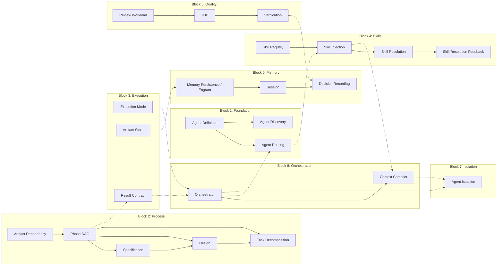

# 07 — Complete Harness Taxonomy

## 🎯 Learning Objectives

- Catalog all ~20+ harness patterns from the Gentle framework into a single reference taxonomy
- Understand how harnesses compose across eight functional blocks
- Apply the Simplicity Principle: start with 3, add when you observe pain
- Use the taxonomy as a diagnostic tool for identifying gaps in real implementations

## Introduction

A single harness solves one constraint. A taxonomy of harnesses solves the design problem: *which constraints do I need, in what order, and how do they fit together?*

The Gentle framework (Alan Buscalas, "20 Agent Harness" video 5Q7jV8TpMXA) identifies 23 individual harness patterns organized into 8 functional blocks. These patterns were extracted from production multi-agent deployments and represent the complete known design space for controlling autonomous coding agents. Each harness is an independent, composable constraint — a rule enforced by configuration and code, not by prompting.

Not every project needs all 23. The Simplicity Principle says: start with 3, add when you observe pain. A harness that solves a problem you do not have is not preparation — it is overhead. The taxonomy therefore serves three purposes:

- **(a)** A reference for what is possible — the full menu of harnesses available
- **(b)** A diagnostic tool — when something fails, which harness is missing or underpowered?
- **(c)** A design vocabulary — precise names for patterns so teams can discuss architecture without ambiguity

This note synthesizes every harness from [[03 - Harness Engineering - Architecture of Control]] through [[06 - Multi-Agent Orchestration and Capstone]] into one comprehensive reference.

---

## How to Use This Taxonomy

This document is a reference, not a tutorial. Use it in three modes:

- **Design mode:** When building a new harness system, read through the blocks in order. Block 1 must exist before Block 2, Block 2 before Block 3, and so on. The taxonomy tells you what is possible and what each harness requires.
- **Diagnostic mode:** When a running system fails, identify the symptom, locate it in the Production Integration checklist, and inspect the corresponding harness. The taxonomy maps symptoms to missing constraints.
- **Vocabulary mode:** When discussing architecture with a team, use the harness names. Saying "Agent Isolation is weak" communicates more precisely than "agents keep getting confused." The taxonomy gives engineering teams a shared language.

For each harness, the format is: name, purpose, operating phase, contract (what it requires and guarantees), and a concrete example.

---

## The Harness Design Vocabulary

### Block 1: Foundation — The Agent as a Contracted Unit

The three Foundation harnesses define *who the agents are* and *how they relate*. Without these, the system has no agent structure — it is just a raw LLM with tools. Every other harness depends on agents being defined, routable, and discoverable. They are the first harnesses to implement in any multi-agent system.

- **Agent Definition Harness** — Defines each agent role (Leader, Spec Author, Implementer, Reviewer) with explicit I/O contracts, allowed tools, constraints, and responsibility boundaries. Operating phase: initialization and design time. Each agent gets a definition file specifying its purpose, the artifacts it produces, the tools it may call, and the constraints it must obey. Without this harness, agents have ambiguous scope and frequently overstep or underperform. Example: a Leader agent is defined with `tools: [read, route]` and explicitly prohibited from writing files, ensuring it orchestrates but never implements.

- **Agent Routing Harness** — Routes incoming work to the correct agent based on current phase and task type. Operating phase: every phase transition. The routing harness inspects the phase, the artifact required, and the task description, then selects the registered agent whose contract matches. It prevents the Leader from doing Implementer work or the Reviewer from writing code. Example: when the Phase DAG signals "enter Design," routing directs the work to the Spec Author agent, not the Implementer.

- **Agent Discovery Harness** — Agents can discover each other's registered capabilities for delegation. Operating phase: during execution, especially Task Decomposition. When an agent encounters work outside its contract, it queries the registry for an agent that can handle it. This enables dynamic delegation without hardcoded routing. Example: during Task Decomposition, the Leader discovers that a task requires database schema changes and routes it to a DBA-specialized agent.

### Block 2: Process — The SDD Protocol Layer

The five Process harnesses implement the SDD protocol described in [[04 - Specification-Driven Development]]. They define *what* happens, *when* it happens, and *what each phase requires* before it can start. These are the harnesses that transform an LLM chat session into a disciplined engineering process.

- **Specification Harness** — Enforces EARS format (Event-driven, Always, Reaction, State-driven) for requirements and validates completeness against a checklist. Operating phase: Spec. Every requirement must parse into one of the EARS types. Missing preconditions, unclear actors, or untestable statements are rejected before Design begins. Example: a requirement like "the system should be fast" is rejected as untestable; "when a user submits a form, the system responds within 200ms" passes EARS validation as an Event-driven type.

- **Design Harness** — Enforces a structured `design.md` with required sections: files to be changed, technical approach, alternatives considered with rejection reasons. Operating phase: Design. The harness validates that the design document exists, that each section meets minimum content thresholds, and that no implementation work starts before design approval. Example: a design that proposes a solution without listing at least two alternatives is rejected and returned to the Spec Author for revision.

- **Task Decomposition Harness** — Breaks design work into 3-7 atomic, dependency-ordered tasks. Operating phase: Tasks. Each task must be a single logical change, testable in isolation, with a clear definition of done. The harness rejects tasks that mix concerns, exceed scope, or lack dependency declarations. Example: "Refactor auth module and add tests and update docs" is split into three separate tasks with explicit dependency edges between them.

- **Phase DAG Harness** — Enforces strict phase ordering: Init → Proposal → Spec → Design → Tasks → Apply → Verify → Archive. Phases cannot be skipped and cannot execute out of order. Operating phase: all phases, as gatekeeper. This is the backbone of the SDD protocol — without it, agents collapse into unstructured chat. The DAG is typically implemented as a topological sort that the Orchestrator consults before every transition.

- **Artifact Dependency Harness** — Each phase requires specific input artifacts from the previous phase. If an artifact is missing, the harness stops and requests confirmation. Operating phase: every phase transition. Spec requires a Proposal artifact, Design requires a Spec artifact, Apply requires a Tasks artifact, Verify requires an Apply artifact. This ensures no phase builds on nothing. The dependency check happens before the routing decision, so agents are never invoked without the context they need.

### Block 3: Execution — The Runtime Mode

The three Execution harnesses define *how* the system behaves at runtime: the interaction mode, where state lives, and what format output takes as it moves between phases.

- **Execution Mode Harness** — Selects Interactive (human-in-the-loop, confirm every step) vs. Automatic (full autonomy) mode based on risk assessment. Operating phase: Init and every phase boundary. High-risk operations (destructive file changes, external API calls) force Interactive mode. Low-risk operations (reading files, generating tests) run Automatic. This harness balances speed against safety. Example: creating a new file with test code runs automatically; deleting a database migration is paused for human confirmation.

- **Artifact Store Harness** — Defines where state lives: `artifacts/SDD/` directory for structured artifacts, engram persistent memory for cross-session context, or ephemeral (no persistence). Operating phase: all phases. Every artifact written by a phase is stored according to this harness's rules. Without it, agents lose their own outputs between phases. The choice of backend determines how much context survives crashes: file system for most projects, engram for long-running sessions, ephemeral for stateless exploration.

- **Result Contract Harness** — Defines a structured envelope passed between phases containing: status (pass/fail/blocked), summary, artifact reference, next phase, risk assessment, and skill resolution metadata. Operating phase: every phase transition. This envelope is the formal handshake — the receiving phase knows exactly what it received, from whom, and what state the system is in. The Result Contract is the single data structure that the Orchestrator reads to make routing decisions; without it, the orchestrator has no basis for determinism.

### Block 4: Skills — The Reusable Knowledge System

The four Skills harnesses cover the complete skill lifecycle: registration, injection, execution, and audit. Skills are the mechanism for injecting domain knowledge without retraining the LLM.

- **Skill Registry Harness** — Maintains the registry of available skills for the project via `SKILL.md` files. Operating phase: Init and ongoing. Each skill declares its trigger conditions, its phase affinity, its rules, and its fallback behavior. The registry is queried by the injection harness. Example: a "Python type hints" skill registers with phase affinity "Apply" and triggers when any file ending in `.py` is modified.

- **Skill Injection Harness** — Injects only the skills relevant to the *current phase* into the agent's context, not the entire skill library. Operating phase: every phase start. If the phase is Design, only Design-affiliated skills are injected. This keeps context windows small and relevant. Example: during the Spec phase, only requirements-writing skills are injected; linting and testing skills are deferred until Apply and Verify.

- **Skill Resolution Harness** — For each injected skill, determines whether it applied to the current task or fell back. Operating phase: during and after each phase. Skills that match trigger conditions execute their rules; skills that do not match are recorded as "not applied." Example: a "Dockerfile best practices" skill is injected during Apply but triggers only if a Dockerfile is among the changed files.

- **Skill Resolution Feedback Harness** — Produces an audit trail: which skills applied, which did not, and the compact rules that were used. Operating phase: end of each phase or session. This feedback loop lets developers see which skills are earning their context cost and which are noise. Example: after a session, the feedback shows that "CSS naming conventions" never triggered across 47 tasks, suggesting it should be removed.

### Block 5: Quality — The Assurance Layer

The three Quality harnesses implement gates that ensure output meets minimum standards before it proceeds to the next phase.

- **Review Workload Harness** — Before implementation begins, evaluates whether the planned change is reviewable. If the change exceeds ~400 lines, it is rejected and must be split into smaller units. Operating phase: Tasks → Apply boundary. This prevents the "one gigantic PR" failure mode. Example: the Task Decomposition produces a task estimated at 600 lines of changes; the Review Workload harness rejects it and forces the task to be split into two sub-tasks of ~300 lines each.

- **TDD Harness** — Enforces test-first workflow: red (write failing test) → green (write minimal code to pass) → triangulation (add 2 edge cases). "Ultra cubierto" — over-covered. Operating phase: Apply. The harness rejects implementation code that lacks a corresponding test. Tests are not an afterthought; they are the entry condition. Example: an Implementer writes a sorting function; the harness rejects it until a test exists that calls the function with a known input and asserts the expected output.

- **Verification Harness** — Runs automated checks plus spec compliance validation. Executes `init.sh`, test suite, linter, and spec compliance checker. Operating phase: Verify. If the artifact does not match the spec, it is rejected and routed back to Apply. This is the final gate before Archive. Example: the spec requires "the API returns 201 on success"; the implementation returns 200 — the Verification harness rejects and routes back to Apply with a specific failure reason.

### Block 6: Memory — The Persistent Context Across Sessions

The three Memory harnesses solve the fundamental weakness of LLM-based agents: they forget everything when the chat window closes. These harnesses make context persistent across sessions.

- **Memory Persistence Harness (Engram)** — Maintains persistent files: `decisions.json` (architecture decisions), `learnings.md` (lessons learned), `sessions/` directory (per-session snapshots). Operating phase: all phases, ongoing. Every significant decision, every lesson, and every session boundary is recorded to disk so the next session starts fully caught up. Example: an agent learns that a particular library causes version conflicts; it writes this to `learnings.md` so every agent in every future session begins with that knowledge.

- **Session Harness** — Each session is a complete snapshot of state. When a session closes, all artifacts, decisions, and learnings are preserved. When a new session opens, state is loaded from the snapshot. Operating phase: session boundaries. This is the temporal equivalent of the Artifact Dependency Harness — it ensures time discontinuities do not break the workflow. Example: a developer closes a session on Friday; on Monday they open a new session and the agent resumes exactly where it left off, with full artifact history and accumulated learnings.

- **Decision Recording Harness (bonus)** — Architecture Decision Records (ADRs): for every significant decision, records why it was made, what alternatives were considered, and why they were rejected. Operating phase: Design and Verify. This prevents "why did we do it this way?" questions weeks later. Example: the team chooses PostgreSQL over MongoDB; the ADR records the decision context (relational data, ACID requirements), alternatives evaluated (MongoDB, SQLite), and the rejection rationale for each.

### Block 7: Isolation — The Context Discipline

A single harness but arguably the most important. Poor context isolation is the root cause of more agent failures than any other single factor.

- **Agent Isolation Harness** — Each subagent receives a *clean context* containing only the artifacts, instructions, and skills relevant to its current task — not the full conversation history. Operating phase: every agent invocation. The metaphor: "operating room, not WhatsApp group." An implementer does not need to see the three-hour discussion that led to the design decision; it needs the design document, the task list, and the relevant skills. This harness is what makes the orchestrator architecture viable — without it, context windows fill with noise and agents hallucinate. Example: when the Orchestrator invokes the Implementer for Task 3 of 5, the context contains only: the design doc, task 3's description, the affected files, and the TDD skill rules — nothing from Task 2's conversation or the Spec phase debate. This single rule eliminates more agent failures than any other individual harness.

### Block 8: Orchestration — The Deterministic Runtime

The two Orchestration harnesses form the runtime that ties everything together. Crucially, the orchestrator itself is not an AI — it is a deterministic state machine.

- **Orchestrator Harness** — A pure state machine. No AI. It reads configuration, spawns agents, validates phase transitions, and advances the DAG. Operating phase: every phase, continuously. The orchestrator does not write code, does not make decisions, does not generate artifacts. It reads the Result Contract envelope, checks the Phase DAG, routes to the correct agent via Agent Routing, and waits for the agent to complete. Example: the orchestrator receives a Result Contract with status "pass" from the Design phase; it consults the Phase DAG, determines the next phase is Tasks, reads the Task Decomposition rules, and invokes the appropriate agent — all without generating a single token.

- **Context Compiler Harness** — The orchestrator digests all applicable skills, rules, and artifact dependencies into a compact instruction set for the subagent. Operating phase: before each agent invocation. The Context Compiler takes the bloated skill library, the phase rules, and the artifact history, and compiles them into a minimal prompt that fits the subagent's context window. This is the enabler of the Agent Isolation Harness — without it, isolation would starve the agent of necessary context. Example: before invoking the Implementer, the Context Compiler processes 12 registered skills but only 2 are phase-affiliated with Apply; it discards the other 10 and compiles the 2 relevant skills plus the task description into a 500-word prompt instead of a 5000-word skill dump.

---

### Anti-Patterns by Block

Each block has characteristic failure modes that appear when its harnesses are misapplied or missing:

- **Foundation anti-pattern:** One agent does everything. No separation of concerns. The "Spec Author" also implements, also reviews. This collapses the architecture into a single-agent system with multiple names. Fix: implement Agent Definition and Agent Routing to enforce boundaries.
- **Process anti-pattern:** Phases exist in name only. The system claims to have a Spec phase but allows the agent to skip it or produce a one-line spec. Fix: enforce Specification Harness validation and Artifact Dependency checks.
- **Execution anti-pattern:** All operations run in Automatic mode. The agent deletes files, pushes to production, or runs destructive commands without confirmation. Fix: implement Execution Mode with a risk matrix that forces Interactive for high-risk operations.
- **Skills anti-pattern:** All skills are injected into every phase. The context window fills with irrelevant rules, and the agent ignores or misapplies them. Fix: implement Skill Injection with phase-affinity filtering.
- **Quality anti-pattern:** Verification only runs a linter. The Verify phase passes even when the output contradicts the spec. Fix: implement spec compliance checking in the Verification Harness, not just syntax checks.
- **Memory anti-pattern:** Sessions are isolated silos. Each session starts from scratch, and no knowledge accumulates. The agent relearns the same lessons every session. Fix: implement Memory Persistence with at minimum `learnings.md`.
- **Isolation anti-pattern:** Full conversation history is passed to every agent. The first agent's context is clean, but by agent 5 the context contains all prior conversations. Fix: enforce Agent Isolation at every invocation, not just the first.
- **Orchestration anti-pattern:** The orchestrator uses an LLM to decide the next phase. This introduces nondeterminism — the same state can produce different transitions. Fix: make the orchestrator a pure state machine with no AI calls.

---

## How Blocks Relate: The Layer Model

The eight blocks form a dependency hierarchy. Foundation (Block 1) is the base: agents must exist before they can execute a process. Process (Block 2) defines the sequence: phases must be ordered before execution mode matters. Execution (Block 3) defines the runtime behavior for the process phases. Skills (Block 4) are knowledge injected into the process. Quality (Block 5) gates the outputs of execution. Memory (Block 6) persists everything across time. Isolation (Block 7) protects each step from context pollution. Orchestration (Block 8) wraps everything in a deterministic runtime.

This layering is not arbitrary — it mirrors the dependency graph. You cannot run Block 8 without Blocks 1-7 defined first. The harnesses are not a menu to pick from; they are a stack with structural dependencies.

## How Harnesses Compose: Interaction Diagram

The following Mermaid diagram shows how the blocks and individual harnesses feed into each other. Arrows indicate data flow or dependency direction. Harnesses from earlier blocks feed forward into later blocks, and the Orchestrator (Block 8) closes the loop by routing back through Agent Routing.

The interaction graph reveals a key architectural property: the Orchestrator sits at the center, but it has no AI intelligence — it is a pure state machine routing data between harnesses. The Context Compiler and Agent Isolation form the critical path from skills to execution. Memory and Quality are peripheral but essential feedback loops.

Several specific composition patterns emerge:

- **Routing → Injection → Compilation → Isolation** is the critical path. Agent Routing selects the right agent; Skill Injection provides phase-scoped knowledge; Context Compiler optimizes it into minimal instructions; Agent Isolation delivers a clean context. Break any link in this chain and the agent operates with wrong or insufficient context.

- **Phase DAG → Result Contract → Orchestrator** is the control loop. The Phase DAG defines valid transitions; the Result Contract carries the outcome of each phase; the Orchestrator reads the contract, consults the DAG, and decides the next action. This loop is entirely deterministic — no AI involvement.

- **Quality gates loop back into the process.** When Verification fails, the Result Contract carries a "fail" status back to the Orchestrator, which routes back to the Apply phase. This feedback loop is the mechanism for iterative refinement.

- **Memory is written asynchronously.** Memory Persistence does not block the critical path. It observes phase completions and writes decisions, learnings, and session snapshots in the background. The critical path does not wait for disk I/O.

---

## Selection Guide: Which Harnesses for Which Need

### The Minimum Viable Harness (3 harnesses)

Three harnesses prevent the most failures with the least complexity:

1. **Phase DAG Harness** — Without phase ordering, agents wander. They write code before specs, verify before testing, or skip design entirely. The DAG is the single non-negotiable structure for any SDD workflow.
2. **Artifact Dependency Harness** — Without artifact dependencies, phases build on nothing. A missing spec produces a blind design. A missing design produces random code. This harness enforces that each phase has the inputs it needs.
3. **Agent Isolation Harness** — Without isolation, context pollution destroys reliability. Each agent must see only what it needs. This single rule eliminates the majority of hallucination failures in production deployments.

Start with these three. Add nothing else until you observe a specific, measurable pain that a harness would solve.

### The Growth Path: Add When You Observe Pain

| When you observe... | Add this harness |
|---|---|
| Tasks repeat but approaches vary | Skill Registry + Skill Injection |
| Sessions lose context between chats | Memory Persistence + Session |
| Code quality degrades over time | Review Workload + TDD + Verification |
| Need speed vs. control tradeoff | Execution Mode |
| Phase transitions are unreliable | Result Contract |
| Subagents get too much noise | Context Compiler |
| Agents do work outside their role | Agent Definition + Agent Routing |
| Requirements are ambiguous | Specification Harness |
| Designs are incomplete | Design Harness |
| Tasks are too large or poorly scoped | Task Decomposition |
| Decisions are revisited repeatedly | Decision Recording |
| You need to prove which skills help | Skill Resolution + Feedback |
| Multi-agent with delegation | Agent Discovery |

The Simplicity Principle is not optional: every harness added increases system complexity and prompt overhead. Only add a harness when you can point to a concrete failure or friction that it would resolve.

### Recommended Phase-In Order

When building up from the minimum 3 to a full system, add harnesses in this order — each builds on the previous:

1. **Phase DAG + Artifact Dependency + Agent Isolation** — The minimum viable harness set. Enforces structure and prevents context pollution.
2. **Agent Definition + Agent Routing** — Once phases are stable, define agent boundaries and enforce them.
3. **Specification + Design + Task Decomposition** — Once agents are routed correctly, ensure the artifacts they produce meet quality standards.
4. **Review Workload + TDD + Verification** — Once artifact quality is enforced, gate the outputs with quality checks.
5. **Execution Mode** — Once quality gates exist, decide which operations need human approval.
6. **Result Contract** — Once phases are stable and quality gates exist, formalize the handshake between them.
7. **Skill Registry + Skill Injection + Skill Resolution + Feedback** — Once the core loop is reliable, inject reusable knowledge.
8. **Memory Persistence + Session + Decision Recording** — Once skills are working, persist knowledge across sessions.
9. **Context Compiler** — Once skills and memory multiply, optimize context windows.
10. **Agent Discovery + Orchestrator** — The final additions for full multi-agent autonomy.

This phase-in order follows the dependency hierarchy: each step assumes the previous steps are stable. Attempting step 7 before step 2 means skills are injected into agents that are not properly defined and routed.

---

## 🎯 Key Takeaways

- There are ~23 harness patterns in the Gentle framework organized into 8 functional blocks covering Foundation, Process, Execution, Skills, Quality, Memory, Isolation, and Orchestration — this is the complete design space for multi-agent control
- The Minimum Viable System requires only 3 harnesses: Phase DAG, Artifact Dependency, and Agent Isolation — these prevent the most failures with the least complexity. All other harnesses are additive
- Each harness solves exactly one constraint; harnesses compose through data flow (Result Contract envelopes), dependency (the Phase DAG), and layering (Foundation → Process → Execution → Orchestration)
- The Orchestrator is not an AI — it is a deterministic state machine that reads config, routes work, and validates transitions without generating a single token
- Skill harnesses follow a complete lifecycle: registration (Skill Registry) → phase-scoped injection (Skill Injection) → execution (Skill Resolution) → audit feedback (Skill Resolution Feedback)
- The critical path for reliable execution is Agent Routing → Skill Injection → Context Compiler → Agent Isolation — break any link and the agent operates with wrong or insufficient context
- The taxonomy serves as a diagnostic tool: when a multi-agent system fails, identify which harness is missing or underpowered, add it, and observe whether the failure disappears. If it does not, the diagnosis was wrong

## 🔗 Production Integration

This taxonomy is not theoretical — every harness listed here has been extracted from real production deployments. Use it as a diagnostic checklist:

- **If agents produce inconsistent output:** Check Agent Isolation and Context Compiler. Context pollution is the #1 cause of agent hallucination. Ensure each agent sees only its task, not the entire conversation. Run the diagnostic: capture the prompt sent to the agent — does it contain irrelevant history or skills?
- **If phases produce unusable artifacts:** Check Specification, Design, and Task Decomposition harnesses. The input quality determines output quality. Run the diagnostic: does the spec pass EARS validation? Does the design list alternatives? Are tasks atomic and dependency-ordered?
- **If the system feels chaotic:** Check Phase DAG and Artifact Dependency. Without structure, agents have no guardrails. Run the diagnostic: can an agent skip from Spec directly to Apply? Can it start a phase without the required artifact from the previous phase?
- **If quality degrades over time:** Check Review Workload, TDD, and Verification. Without gates, quality is a hope, not a policy. Run the diagnostic: does every Apply phase produce tests before code? Does Verify check spec compliance or only run the linter?
- **If context is lost between sessions:** Check Memory Persistence and Session. LLM agents have no inherent memory. Run the diagnostic: close the session, reopen it — does the agent remember decisions and learnings from the previous session?
- **If the orchestrator makes bad decisions:** Check if the orchestrator contains AI. It should not. Make it a pure state machine. Run the diagnostic: trace a transition decision — is it made by reading a configuration map or by asking an LLM?
- **If too many skills are injected:** Check Skill Injection filtering. Run the diagnostic: examine the prompt received by an agent during the Apply phase — are Spec-phase skills present? They should not be.

For implementation details, see [[06 - Multi-Agent Orchestration and Capstone]] (orchestrator patterns), [[08 - Verification and Quality Gates]] (quality harness deep-dive), and [[09 - Tools, Provider Abstraction, and Memory]] (memory and tool harnesses). The [[05 - File Architecture]] note describes the file layout that all harnesses operate on.

## References

- Gentle framework: Alan Buscalas, "20 Agent Harness" video 5Q7jV8TpMXA
- [[03 - Harness Engineering - Architecture of Control]]
- [[04 - Specification-Driven Development]]
- [[05 - File Architecture]]
- [[06 - Multi-Agent Orchestration and Capstone]]
- [[08 - Verification and Quality Gates]]
- [[09 - Tools, Provider Abstraction, and Memory]]
- SDD protocol: [[04 - Specification-Driven Development]]
- Simplicity Principle: start with 3, add when you observe pain
