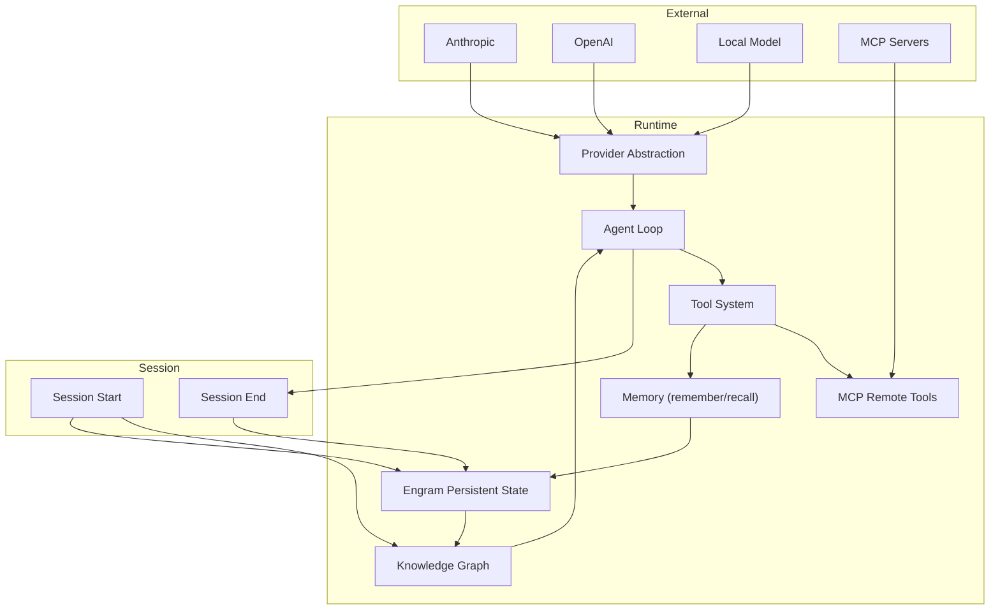

# 09 — Tools, Provider Abstraction, and Memory

## 🎯 Learning Objectives

- Design a provider abstraction layer that isolates SDK dependencies behind a generic interface
- Implement the tool-as-contract pattern: discoverable, predictable, auditable capability boundaries
- Apply the Vercel D0 lesson to tool selection — treat definition size as a context budget cost
- Distinguish compact strategies (no-op, sliding window, summarization) and when each applies
- Architect memory as two tools (remember + recall) that let the agent decide what persists
- Explain how Engram and knowledge graphs create persistent context across sessions
- Diagram the full integration: provider → agent loop → tools → memory → knowledge graph

---

## Introduction

The preceding notes built the harness layer by layer — architecture ([[03 - Harness Engineering - Architecture of Control]]), specification ([[04 - Specification-Driven Development]]), files ([[05 - File Architecture]]), orchestration ([[06 - Multi-Agent Orchestration and Capstone]]), and taxonomy ([[07 - Complete Harness Taxonomy]]). Every layer depends on infrastructure that cross-cuts all of them.

Three systems form the runtime foundation:

- **Provider abstraction** makes the harness model-agnostic. Swap GPT-4 for Claude for DeepSeek for a local model — the agent loop does not change.
- **The tool system** defines what agents can *do*. Tools are the agent's interface to the world — file system, shell, network, memory, subagents — all expressed as discoverable, schema-validated contracts.
- **Memory** makes knowledge economical. Without it, every session starts from zero. With it, the agent resumes from the exact state the previous session left behind.

This note covers these three cross-cutting systems and shows how they compose into the runtime that makes the complete harness execute.

---

## 1. Provider Abstraction: The Adapter Pattern for LLMs

Every SDK has its own data structures, its own API conventions, its own error types. A harness that imports Anthropic's SDK directly into the agent loop is a harness that cannot switch to OpenAI without rewriting core code. The provider abstraction prevents that.

### The Generic Interface

The provider layer defines a single polymorphic contract:

```
send(message, tools[], context) → response
```

The input is always an API message, an array of tool definitions, and a context window. The output is always an API response — structured, typed, and harness-native. The agent loop never touches an SDK-specific type.

### The Three-Level Abstraction

**Level 1 — Type Definitions (generic):** `APIMessage`, `APIToolDef`, `APIResponse`. These are harness-defined structs that represent the minimum common vocabulary across every LLM provider. They do not include SDK-specific fields. They define the contract that every provider must fulfill.

**Level 2 — Provider Interface (agnostic):** `Provider` interface with `SetModel()`, `GetModel()`, and the core `Send()` method. The agent loop depends on this interface, never on a concrete implementation. The interface lives in a single file — `provider.go` in the Go reference implementation — and changes only when the contract changes.

**Level 3 — Provider Implementation (SDK-specific):** One file per provider. `anthropic.go` imports the Anthropic SDK, translates generic requests into Anthropic format, translates Anthropic responses back into `APIResponse`. `openai.go` does the same for OpenAI. `mock.go` returns canned responses for testing — zero API costs, deterministic output for integration tests.

### Why This Matters

Three forces make provider lock-in dangerous:

- **Model changes.** A model you use today may be deprecated, rate-limited, or cost-restructured tomorrow.
- **Provider shifts.** Pricing, latency, and capability landscapes shift quarterly. The harness should follow advantage without rewrites.
- **Testing.** Without a mock provider, every test calls a paid API. Tests become slow, expensive, and non-deterministic.

The provider abstraction limits the impact of any SDK change to a single file. Add a provider = add a file. No core changes. No agent loop edits.

---

## 2. The Tool System: Capability Boundaries as First-Class Contracts

Tools are not functions. Tools are **contracts** between the agent and the system. Each tool has three components that make it a contract rather than a function call:

### Tool Definition

The definition is what the LLM sees: `name` (unique identifier), `description` (the semantic explanation that tells the LLM when to invoke this tool), `parameters` (JSON Schema that defines valid inputs). The quality of the description determines whether the agent uses the tool correctly or ignores it. The schema determines whether the invocation is valid.

### Tool Execution

The execution is what the harness runs: a function that receives validated parameters and returns a result. The harness enforces the schema before execution — invalid invocations are rejected, not forwarded. Execution is logged for audit, debugging, and verification ([[08 - Verification and Quality Gates]]).

### The Three Properties

A well-designed tool set makes every capability:

- **Discoverable** — the agent reads tool definitions at system prompt time and knows exactly what it can do.
- **Predictable** — schema validation ensures parameters conform. The agent cannot pass a string where an integer is expected.
- **Auditable** — every invocation is logged with timestamp, parameters, result, and token cost.

### Tools Are the Interface

Tools are NOT "things the agent can do." Tools are the **agent's interface to the system**. A harness without tools is a harness that can talk but not act. A harness with poorly designed tools is a harness that acts incorrectly. The tool set determines, more than any other design decision, whether the harness succeeds or fails.

### Tool Design Heuristics

- **One responsibility per tool.** A tool that reads files AND searches content AND lists directories is three tools merged into one. The agent cannot independently invoke the specific capability it needs.
- **Descriptions are part of the prompt.** A poor description means the agent never invokes the tool. Invest in descriptions as carefully as system prompts.
- **Return structured data.** Raw text output forces the agent to parse. Structured JSON returns reduce parsing errors and token waste.
- **Fail gracefully.** Every tool returns a result — success or error. Errors include enough context for the agent to retry or escalate.

---

## 3. Tool Selection and Context Budget: The Vercel D0 Lesson

[[01 - The Context Crisis]] introduced the Vercel D0 finding: 80 tools consumed ~40% of the context budget. Reducing to 5 minimal Unix primitives (read, write, glob, grep, bash) consumed ~8% — 3x faster execution, 37% fewer tokens.

### The Cost Formula

Every tool definition in the system prompt has a cost:

```
cost(tool) = token_count(definition) × invocation_probability
```

Tools with large definitions AND low invocation probability are negative-ROI. The definition burns tokens on every turn, but the tool is rarely or never used. The Vercel D0 lesson restated: **tool selection is context budget allocation.**

### Pruning Strategy

1. **Measure.** Log the token cost of the full tool definitions section. If it exceeds 15-20% of context budget, prune.
2. **Rank.** Sort tools by invocation probability × value per invocation.
3. **Cut.** Remove tools below the threshold. Do not keep "just in case" tools — the agent can request tool additions if needed.
4. **Monitor.** Re-evaluate every major prompt change. New tools creep in over time.

---

## 4. MCP Integration: Remote Tools Through the Same Interface

The Model Context Protocol (MCP) extends the tool system to remote servers. An MCP wrapper transforms external service definitions into harness-native tools. The agent does not know if a tool is local or remote — it calls the same `execute()` interface either way.

### Architecture

The MCP layer consists of:

- **MCP Client.** Connects to remote MCP servers via HTTP or stdio transport. Fetches tool definitions, sends execution requests.
- **MCP Registry.** Maps tool names to their remote origins. Loaded from `mcp.json` configuration at startup.
- **Parallel Loading.** Remote HTTP calls block if loaded sequentially. Production MCP registries load servers in parallel — goroutines in Go, `asyncio.gather` in Python — so one slow server does not delay the entire startup.

### Protocol Benefits

MCP is not just a networking layer. It defines a standard for tool discovery, invocation, and error handling that any MCP-compatible server speaks. As the MCP ecosystem grows, harnesses gain access to thousands of pre-built tools — databases, APIs, search engines, code analyzers — all through the same interface.

---

## 5. Compact Strategies: Keeping Context Under Control

Context windows fill. Conversations grow. Token costs rise. Compact strategies decide what to do when the context budget is exhausted.

### The Interface

Compact is a pluggable strategy. It receives the full message array, returns a smaller array. The agent loop calls compact when the context exceeds a threshold.

```
compact(messages[]) → messages'[]
```

### Three Strategies

**No-op.** Do nothing. Let the context grow. Execution quality degrades as the window fills, but no information is lost. Useful for short sessions or high-context-budget models.

**Sliding Window.** Keep the last N turns. Deterministic — same input always produces the same output. No quality loss on recent content; total loss on anything outside the window. Useful for stateless interactions where only the latest turns matter.

**Summarization.** Send the full context to the LLM with a compaction prompt. The LLM returns a condensed version. Retains semantic meaning — the agent knows what happened. Loses precision — exact file paths, exact error messages, exact parameter values may be simplified or omitted.

### Compact Is a Trade

Compact is NOT compression. Compression preserves all information in fewer bytes. Compact discards information to stay within a budget. The three strategies represent three different trade-offs:

- **No-op:** zero information loss, unbounded cost
- **Sliding window:** high information loss on old content, zero cost overhead
- **Summarization:** medium information loss, high cost overhead (one extra LLM call)

The interface makes strategies swappable at configuration time. Test different strategies on real workloads. Swap if one degrades quality.

---

## 6. Memory Systems: The Tool Pattern for Persistence

Memory in a harness is not RAG. It is not a vector database. It is not a long-term context window. Memory is **two tools** that the agent decides to use:

### Remember

```
remember(content) → confirmation
```

The agent calls `remember` when it encounters something worth persisting — a decision, a finding, a lesson learned, a file structure map. The tool accepts free-form content and stores it in the memory backend. The agent decides what is important enough to remember based on the tool's description.

### Recall

```
recall(query) → results[]
```

The agent calls `recall` when it needs information it may have stored earlier. The tool accepts a query string, searches the memory backend, and returns relevant results. The agent decides when to search based on the tool's description.

### The Memory Backend

The backend is abstracted behind the tool interface. JSON files for simple projects. SQLite for medium-scale needs. Vector database for semantic search at scale. The agent does not know which backend is in use. The backend can be swapped without changing tool definitions or agent behavior.

This is fundamentally different from injecting all history into the prompt. Instead of paying the token cost of the full context window every turn, the agent pays O(1) for the tool definitions and O(n) only when it explicitly retrieves. Memory becomes economical.

### Memory vs. Context Injection

| Approach | Cost per turn | Information available | Agent control |
|----------|--------------|----------------------|---------------|
| Full context injection | O(window) | Everything | None |
| Sliding window | O(window_size) | Recent only | None |
| Memory tools | O(definitions) + O(retrieval) | Agent-decided | Full |

Memory tools invert the cost model. The agent pays the base rate every turn and the retrieval cost only when it decides history matters. This is the only approach that scales past a single session without unbounded cost growth.

---

## 7. Engram: Persistent Context Across Sessions

Engram (from the Gentle "20 Agent Harness" framework, 5Q7jV8TpMXA) is the persistent state layer. It ensures that when a session ends, the work does not disappear.

### The Artifact Store

The artifact store harness defines where state lives:

- `decisions.json` — every architectural decision with rationale and timestamp. Agents append to this file when they resolve a trade-off. The orchestrator reads it when spawning downstream agents to ensure design consistency.
- `learnings.md` — aggregated lessons extracted during the session. Accumulated insights that do not belong in any single artifact but inform every subsequent phase.
- `sessions/` — per-session logs, tool execution traces, compact summaries. Each session gets a timestamped subdirectory with full execution traces for audit and debugging.

Every SDD phase produces state. Every phase reads state from previous phases. The artifact store is not optional — it is the persistent backbone that decouples session lifetime from knowledge lifetime.

### How Engram Works

End of session:

1. The harness calls `compact(messages[])` on the full conversation to produce a session summary.
2. Tool execution logs are written to `sessions/<session-id>/`.
3. Decisions and learnings are extracted and merged into `decisions.json` and `learnings.md`.

Start of session:

1. The harness loads the Engram directory.
2. `decisions.json` and `learnings.md` are injected into the system prompt.
3. The agent resumes from where the previous session left off — no day zero.

### Without Engram

Every session is Day Zero. The agent does not know what was built, why decisions were made, or what problems remain. The context crisis restated every session is worse, not better.

---

## 8. Knowledge Graphs: The Third Memory Tier

Memory tools store what the agent learns. Engram stores session state. Knowledge graphs store the **structure of the codebase itself** — the relationships between files, modules, dependencies, and functions.

### Graphify (from -L_faOE-H5g)

Graphify runs in three passes:

- **Pass 1 — Structure.** Scan all project files, directories, and entry points. Map the file tree.
- **Pass 2 — Relationships.** Analyze imports, function calls, type references, module dependencies. Determine which modules talk to which.
- **Pass 3 — Semantics.** Generate descriptions of what each module does, its responsibilities, and its dependencies.

The output is a knowledge graph — a structured representation of the entire codebase.

### Session Bootstrapping

Instead of scanning files at the start of every session (expensive, repetitive, token-heavy), the harness loads the pre-built knowledge graph. The agent receives the graph as part of the system prompt bootstrapping sequence.

A regular session is a contractor who walks in on day one with no context. Graphify is the internal wiki handed to them before they start. Build the wiki once; every future session reads it for free.

### The Bridge

The knowledge graph is the bridge between the harness file architecture ([[05 - File Architecture]]) and the agent's context window. It gives the agent a pre-built mental model of the codebase without burning tokens on file scanning.

---

## 9. System Integration: How Tools, Providers, and Memory Compose

None of these systems exists in isolation. They compose into the runtime that makes the harness execute.



### The Composition Chain

1. **Session starts.** Engram loads persistent state. Knowledge graph loads codebase structure. Both are injected into the system prompt.
2. **Agent loop begins.** The provider abstraction stands between the agent loop and the LLM. The loop calls `Send()` — it does not know if the model is Anthropic, OpenAI, or local.
3. **Agent decides to act.** The tool system presents discoverable contracts. The agent selects a tool from the available definitions.
4. **Tool executes.** The execution may be local (read a file), remote (call an MCP server), or introspective (remember a memory).
5. **Memory is invoked.** `remember()` writes to Engram. `recall()` reads from Engram. The agent decides what to persist.
6. **Session ends.** Engram compact runs. State is serialized. Next session resumes from this state.

### The Harness Is the Runtime

Without provider abstraction, the harness is model-locked. Without the tool system, the harness can talk but not act. Without memory, every session starts from zero. Without integration, these systems are isolated features — with integration, they are a runtime.

---

## 🎯 Key Takeaways

- The provider abstraction limits SDK impact to one file per provider — the agent loop never touches a provider-specific type
- Tools are contracts, not functions — discoverable by definition, predictable by schema, auditable by execution log
- Tool selection is context budget allocation — measure definition cost, prune low-probability tools, re-evaluate over time
- MCP makes remote tools indistinguishable from local tools through the same interface
- Compact strategies (no-op, sliding window, summarization) are a trade between precision and budget, not compression
- Memory as two tools (remember + recall) lets the agent decide what persists — the backend is an invisible implementation detail
- Engram and knowledge graphs make context economical — build once, read every session, never start from Day Zero

---

## 🔗 Production Integration

This note ties together the entire course. The preceding notes built architecture, specifications, files, orchestration, and taxonomy — the structural layers of the harness. Tools, providers, and memory are the infrastructure layer that makes those structures execute.

The provider abstraction makes the harness survive model deprecation, pricing shifts, and testing requirements. The tool system defines what agents can actually *do* — the boundary between thought and action. Memory makes knowledge persistent and economical — the difference between a harness that learns and a harness that forgets.

Without these three systems, the harness has no runtime. With them, it has a complete, production-ready execution environment.

---

## References

- **Alan Buscalas, "Construyo mi propio arnés de IA"** (2B9QTg_-nyc) — Provider abstraction, tool interface, MCP integration, compact strategies, and memory system architecture in Go
- **Alan Buscalas, "OpenCode + Graphify"** (-L_faOE-H5g) — Knowledge graph passes, session bootstrapping, codebase mental models
- **Alan Buscalas, "20 Agent Harness"** (5Q7jV8TpMXA) — Engram persistent state, artifact store, session lifecycle
- **Vercel D0 Case Study** — Tool minimalism findings: 80 tools → 5 tools, 3x faster, 37% fewer tokens (referenced in [[01 - The Context Crisis]])
- **[[03 - Harness Engineering - Architecture of Control]]** — Provider abstraction as Layer 0 of the Onion Model
- **[[05 - File Architecture]]** — tools.json definition format, memory/ directory structure
- **[[06 - Multi-Agent Orchestration and Capstone]]** — Orchestrator uses tools for subagent spawning and memory for inter-session state
- **[[07 - Complete Harness Taxonomy]]** — Tool harnesses, memory harnesses, provider harnesses in the taxonomy
- **[[08 - Verification and Quality Gates]]** — Verification consumes tool execution logs for quality gates
