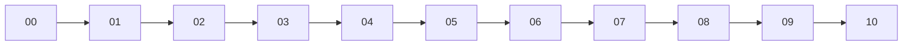
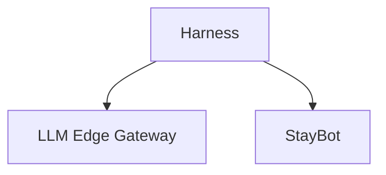

# 🎓 Welcome to SDD and Harness Engineering
## 🎯 Learning Objectives
- Master harness engineering as the discipline that directs AI agents
- Apply SDD workflows to production ML/AI systems
- Connect course concepts to portfolio projects and existing vault modules
## Introduction
AI agents write code, but without discipline they produce chaos. This course teaches you to build a **harness** — the operational structure that controls, directs, and verifies agents — and to implement **Specification-Driven Development (SDD)** as a professional workflow. You will treat specs as the single source of truth, externalize memory beyond the context window, and orchestrate multi-agent teams with strict phase gates. For ML/AI engineers in Medellín, these skills bridge [[03 - Advanced Python]], [[13 - Go Engineering]], [[07 - AI Agents y Agentic Systems]], [[09 - MLOps y Produccion]], and [[10 - Cloud, Infra y Backend]]. Your portfolio — LLM Edge Gateway, Automated LLM Evaluation Suite, Multi-Agent Research System, and StayBot — benefits directly from this rigor.
---
## Module 1: Course Overview
### 1.1 Theoretical Foundation 🧠
Engineering disciplines evolve from craft to systematic process. Software moved from Waterfall to Agile to DevOps. The AI era adds agents that write code. Agents without structure are skilled workers without blueprints — fast but dangerous. Harness Engineering provides the blueprints; SDD provides the workflow. Together they transform AI from a toy into a reliable team member.
### 1.2 Mental Model 📐
Course arc:
```
┌─────────────────┐
│ 10 - End-to-End │
├─────────────────┤
│ 05-09 - Harness │
├─────────────────┤
│ 02-04 - Core    │
├─────────────────┤
│ 01 - Fundament. │
├─────────────────┤
│ 00 - Welcome    │
└─────────────────┘
```
Safety net:
```
┌───────────────┐
│   Harness     │
│ ┌───────────┐ │
│ │ AI Agent  │ │
│ └───────────┘ │
└───────────────┘
```
Pipeline:
```
┌─────┐   ┌─────┐   ┌─────┐
│READ │──>│BUILD│──>│DEPLOY│
└─────┘   └─────┘   └─────┘
```
### 1.3 Syntax and Semantics 📝
```markdown
- Next: [[01 - Harness Engineering Fundamentals]]
- Related: [[07 - AI Agents y Agentic Systems]]
```
### 1.4 Visual Representation 🖼️


### 1.5 Application in ML/AI Systems 🤖
| ML Use Case | Concept | Impact |
|-------------|---------|--------|
| RAG System  | SDD spec | Prevents drift |
| Agent Team  | Harness | Stable execution |
| MLOps       | Verify gates | CI/CD for AI code |
### 1.6 Common Pitfalls ⚠️
⚠️ **Skipping to Note 10** — assumes mastery of phase gates.
💡 **Mnemonic: "HARNES" — Harness, Agents, Roles, Notes, External memory, Specs, SDD.**
### 1.7 Knowledge Check ❓
1. Why is a harness necessary if the AI is already smart?
2. Name two portfolio projects that benefit from SDD.
3. Which vault module covers Go engineering?
---
## 📦 Compression Code
```python
#!/usr/bin/env python3
NOTES = [f"{i:02d}" for i in range(11)]
print(" -> ".join(NOTES))
```
## 🎯 Documented Project
### Description
Single-page navigator listing the 11-note arc.
### Functional Requirements
- Display ordered note list
### Main Components
- Note sequence array
### Success Metrics
- Reader recites the arc in <60s
## 🎯 Key Takeaways
- Harness Engineering directs AI agents without replacing them.
- SDD makes the specification the single source of truth.
- The course bridges Python, Go, and agentic workflows.
- Portfolio projects benefit from external memory and phase gates.
- The 11-note arc moves from theory to production harnesses.
## References
1. Alan Buscalas — Gentle Framework
2. Fazt Code — Project structure for AI coding
3. Vercel D0 — Context degradation research
