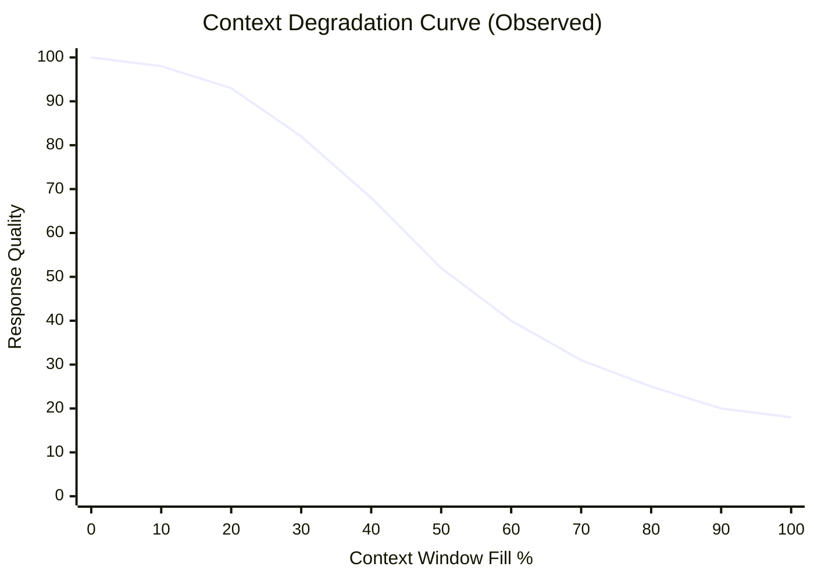
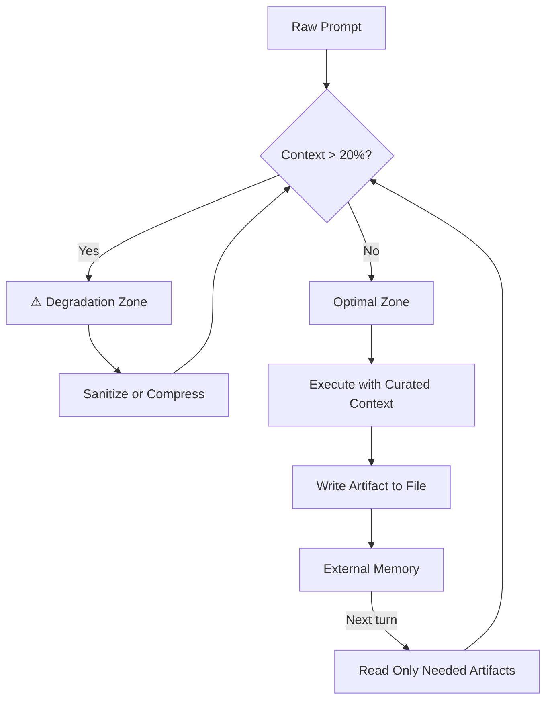

# 01 — Context Engineering: The Physics of AI Attention

**Core thesis:** Before you can build a harness, you must understand the MEDIUM the harness operates within — the context window. You don't engineer a bridge without understanding gravity. You don't engineer AI control systems without understanding context degradation.

---

## The Context Window Is a Finite Token Budget

Every LLM interaction operates inside a **context window** — a fixed-capacity sliding buffer of tokens. Everything competes for this budget:

```
context_window = system_prompt + tool_definitions + conversation_history + user_message + model_output
```

At the time of writing (May 2026), state-of-the-art windows reach 200K-1M tokens. But the critical insight is not the ceiling — it's the **degradation curve before the ceiling**.

A 200K window seems vast. You might think: "I'll stuff everything in. More information = better results." **This intuition is catastrophically wrong.**

---

## Context Degradation: The Vercel D0 Discovery



> ¡Sorpresa! Degradation starts at 20-40% fill — long before hitting the token limit. At 200K, quality drops at 40K-80K tokens.

The Vercel AI team, building their D0 research coding agent, discovered that **response quality begins degrading when the context window reaches only 20-40% capacity**. This is not a documented model behavior — it is an emergent phenomenon observed across multiple frontier models.

Why? The attention mechanism must spread finite "attention weight" across all tokens. At 10% fill (20K tokens), the model allocates attention to roughly 200 tokens. At 40% fill (80K tokens), the same attention budget is spread across 800 tokens. **Every irrelevant token dilutes attention to the relevant ones.**

| Fill % | 200K Window | Quality Impact |
|--------|-------------|----------------|
| 0-10%  | 0-20K       | Optimal         |
| 10-20% | 20K-40K     | Near-optimal    |
| 20-40% | 40K-80K     | **Degradation begins** ⚠️ |
| 40-60% | 80K-120K    | Noticeable errors |
| 60-80% | 120K-160K   | Frequent hallucinations |
| 80-100% | 160K-200K  | Unreliable      |

💡 The safe operating zone is below 20% fill. Budget accordingly.

---

## Contaminated Context: The Silent Killer

Even when your context fits within the degradation-safe zone, it can be **contaminated** — carrying forward abandoned hypotheses, incorrect assumptions, and exploration dead-ends from earlier turns.

```
Turn 1: "Try approach A"       → agent explores, fails
Turn 2: "Try approach B"       → agent sees A's failure, gets confused
Turn 3: "Actually, approach C" → agent sees A+B debris, hallucinates hybrid
```

The agent drags abandoned ideas into every new turn. This is NOT a model failure. **This is a context management failure.** The model is doing exactly what it's designed to do: attending to everything in its window. If abandoned ideas are in the window, they receive attention weight.

> ⚠️ Contaminated context is the #1 cause of "agent went rogue" incidents in production harnesses.

---

## Five Strategies for Context Engineering

### 1. Sanitization

**Strip irrelevant turns before each new turn.** Keep only: the current objective, the last successful state, and the artifact being produced.

```
Before: [Turn1:explore] [Turn2:explore-dead-end] [Turn3:explore] [Turn4:success] [Turn5:current]
After:  [Turn4:success-artifact] [Turn5:current-objective]
```

❌ **Antipattern:**
```python
# Dump entire conversation history into every turn
messages = load_all_history()  # 50K tokens of abandoned trails
messages.append(new_instruction)
response = llm.chat(messages)  # Context at 70% fill — degraded
```

✅ **Pattern:**
```python
# Sanitize: keep only last success + current objective
history = load_all_history()
sanitized = [
    find_last_success_artifact(history),  # ¡Sorpresa! Only successful state
    build_current_objective(task)         # Current instruction
]
response = llm.chat(sanitized)  # Context at 8% fill — optimal
```

### 2. Progressive Summarization

Every N turns, **compress the conversation** into a structured summary. The summary replaces the raw conversation.

```
Turn 1-5 raw chat → [COMPRESS] → "<summary> Decided X. Chose approach Y. Failed: Z,W. Active: A.</summary>"
Turn 6-10 raw chat + summary → [COMPRESS] → "<summary> Decided A. B works. C blocked on D. Next: E.</summary>"
```

### 3. Curated Injection

**The implementer does NOT receive the full chat history.** It receives ONLY:
- `tasks.md` — the 3-7 atomic steps it must execute
- `design.md` — the files and patterns it needs
- The affected source files

Everything else is withheld. The implementer doesn't need to see the proposal debates, the design alternatives considered, or the reviewer's marginalia.

> 💡 "Information must be written down in artifacts, not passed through chat." — Harness Principle #3

### 4. External Memory (Files > Context)

Write state to files. Read from files. Don't store intermediate reasoning in the context window.

```
❌ memory = "We agreed to use PostgreSQL because..." stored in context
✅ memory = decisions.json containing {"decision": "PostgreSQL", "rationale": "..."}
```

The agent reads `decisions.json` when it needs to know WHY. The file persists. The context is disposable.

### 5. Token Budgeting

Allocate token budgets per component:

| Component | Budget | Cap |
|-----------|--------|-----|
| System prompt | 1,500 tokens | Hard |
| Tool definitions | 2,000 tokens | Hard |
| Conversation history | 30% of window | Soft — compress at threshold |
| Artifacts (files) | 40% of window | Soft — paginate |
| Output | As needed | Model default |

---

## The Paradox: More Context Can Degrade Results

This is the counterintuitive truth at the heart of harness engineering:

```
More context ≠ better results
Less, curated context = better results
```

The model performs best with **curated, minimal context** — not maximal. Every token not directly relevant to the current task is a token that steals attention from the tokens that matter. This inverts the natural engineering instinct to "provide everything just in case."

---

## Caso Real: Vercel D0

Vercel's D0 AI coding agent initially used a comprehensive tool set (80+ tools: API clients, file operations, test runners, deployers). Performance was sluggish and error-prone.

**The intervention:** They removed 80% of tools, keeping only Unix primitives (`cat`, `grep`, `ls`, `write`, `diff`). The result:

- **3x faster** execution
- **37% fewer tokens** consumed per task
- **Higher accuracy** on code modification tasks

The insight: **fewer tools → smaller tool definitions → more context budget for the actual task.** The 80 removed tools were consuming ~40% of the model's attention budget without being used in 95% of turns.


> *Vercel's D0 research demonstrated that tool minimalism directly improves agent performance.*

---

## Context Engineering as Foundation

Context Engineering is Layer 0 of the harness stack. Every subsequent layer — harnesses, SDD, file architecture, orchestration — assumes you are managing context deliberately. If context is contaminated or degraded, no amount of harness structure can recover from it.



---

## Código de Compresión

```python
"""Token counter with degradation estimation for context engineering."""
import tiktoken
from dataclasses import dataclass
from typing import Sequence
import json
import sys


@dataclass
class WindowBudget:
    total_tokens: int = 200_000
    safe_zone_pct: float = 0.20  # ¡Sorpresa! Safe at ≤20% fill


class ContextEngineer:
    def __init__(self, model: str = "claude-sonnet-4-20250514"):
        self.enc = tiktoken.encoding_for_model("gpt-4o")  # approximation
        self.budget = WindowBudget()

    def count(self, text: str) -> int:
        return len(self.enc.encode(text))

    def degradation(self, used: int) -> float:
        ratio = used / self.budget.total_tokens
        if ratio < 0.10:
            return 1.0  # perfect
        if ratio < 0.20:
            return 1.0 - (ratio - 0.10) * 2.0
        return max(0.0, 1.0 - (ratio - 0.10) * 1.5)

    def sanitize(self, turns: list[dict], keep_last_n: int = 2) -> list[dict]:
        return turns[-keep_last_n:]

    def should_compress(self, turns: list[dict]) -> bool:
        total = sum(self.count(json.dumps(t)) for t in turns)
        return total > self.budget.total_tokens * self.budget.safe_zone_pct

    def report(self, system_prompt: str, tools: str,
               history: list[dict]) -> dict:
        sys_t = self.count(system_prompt)
        tool_t = self.count(tools)
        hist_t = sum(self.count(json.dumps(t)) for t in history)
        used = sys_t + tool_t + hist_t
        return {
            "used": used,
            "free": self.budget.total_tokens - used,
            "pct_fill": round(used / self.budget.total_tokens * 100, 1),
            "quality_factor": round(self.degradation(used), 2),
            "safe": used < self.budget.total_tokens * self.budget.safe_zone_pct
        }


if __name__ == "__main__":
    ce = ContextEngineer()
    sample_turns = [{"role": "user", "content": "echo hello " * 100}]
    rep = ce.report("You are an engineer.", "cat grep ls write diff",
                    sample_turns)
    print(json.dumps(rep, indent=2))
```

---

[[01 - Context Engineering - The Physics of AI Attention]] | [[02 - Harness Engineering - Directing AI Force]] | [[07 - AI Agents]]
