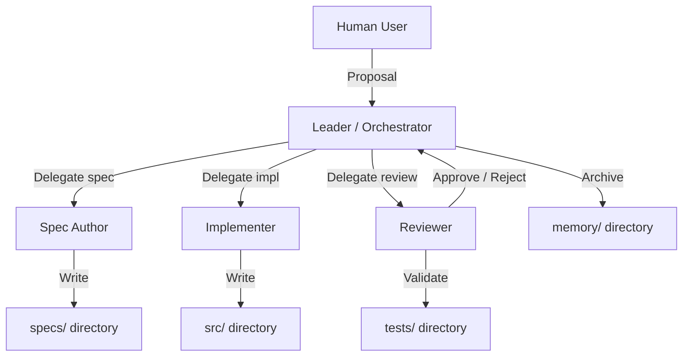
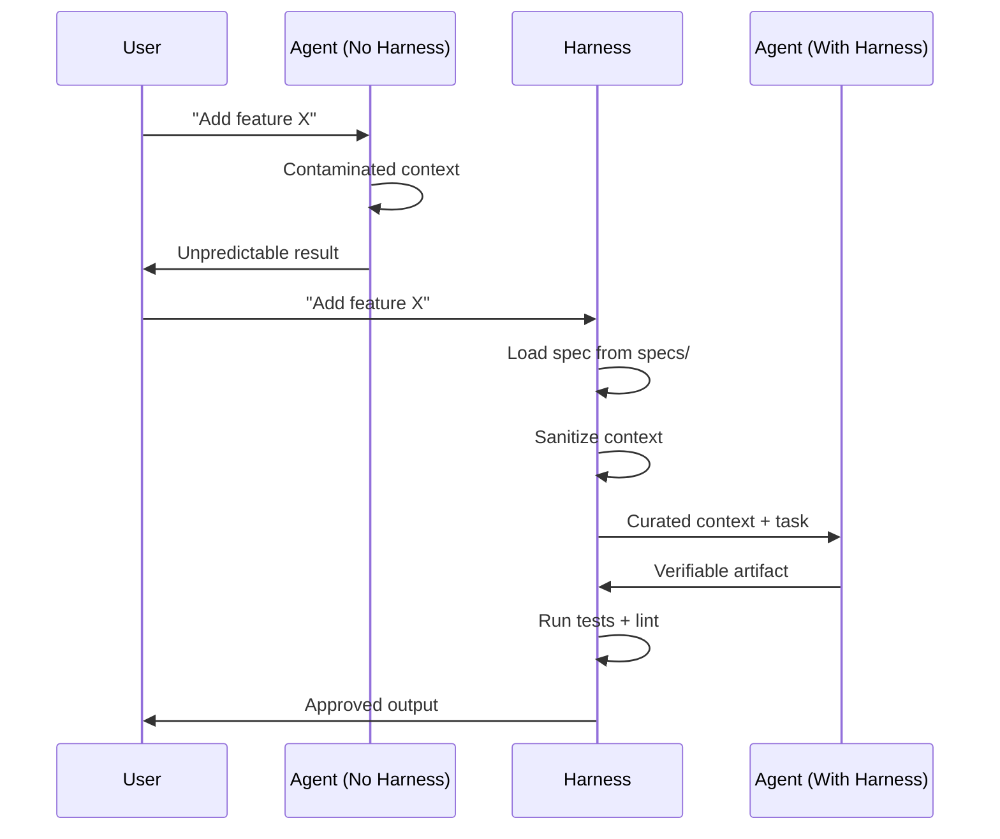
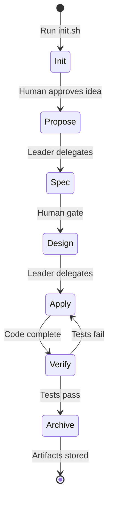

# 🔧 Harness Engineering Fundamentals

## 🎯 Learning Objectives

- Define Harness Engineering as a discipline distinct from prompt engineering and RAG
- Diagnose the three core problems that appear when agents run without a harness
- Apply the simplicity principle (Vercel D0) to your own AI tool selection
- Design a layered harness architecture using onion-layer mental models
- Connect harness fundamentals to production ML/AI systems like the LLM Edge Gateway

## Introduction

When you ask a large language model to "add a feature," you are not delegating to an engineer — you are releasing a force of nature into your codebase. Without boundaries, that force will rewrite files you did not ask it to touch, forget decisions it made three turns ago, and produce code that passes a surface read but fails under load. Harness Engineering is the discipline of building the operational structure around that force so it becomes a reliable team member rather than a liability.

This note defines the harness, distinguishes it from related disciplines like prompt engineering and RAG, and introduces the three foundational problems that every harness must solve: contaminated context, unpredictable execution, and zero traceability. We will examine the Vercel D0 case study, where removing eighty percent of specialized tools actually tripled speed and reduced token usage by thirty-seven percent. The lessons here underpin every subsequent note in this course, from [[02 - SDD: The Specification-First Workflow]] to [[06 - The 20 Harnesses: Phase Control and Contracts]].

For ML/AI engineers in Medellín building systems like the [[LLM Edge Gateway]], the harness is what keeps your Go/Fiber service and Redis semantic cache from being corrupted by an agent that decides to "improve" the middleware chain while you only asked for a new eviction policy. It is the invisible infrastructure that makes AI-assisted development production-grade.

---

## Module 1: The Harness as an Engineering Discipline

### 1.1 Theoretical Foundation 🧠

The term "harness" originates from physical engineering: a set of straps and fixtures that directs the force of a draft animal without diminishing its strength. In software, the animal is the AI model, and the harness is the combination of specifications, tool definitions, memory systems, and orchestration rules that channel its capabilities toward predictable outcomes. Harness Engineering is not about making the model smarter; it is about making its output usable in production.

Historically, we have seen three waves of AI integration. The first wave was **prompt engineering**, where developers carefully crafted strings to nudge models toward correct answers. This is analogous to giving a worker verbal instructions — effective for simple tasks, fragile for complex ones. The second wave was **RAG (Retrieval-Augmented Generation)**, where external documents were injected into the context window to ground responses in facts. This is like giving the worker a reference manual — better, but still no process. The third wave, which this course addresses, is **Harness Engineering**, where the entire development workflow — from requirement to verified artifact — is structured as a controlled process. Prompt engineering optimizes the question; RAG optimizes the facts; Harness Engineering optimizes the system.

The three problems that make harnesses mandatory were codified by the Vercel D0 team and popularized through the Gentle framework. **Contaminated context** occurs when an agent drags the entire conversation history into every new turn, mixing abandoned ideas with current objectives. Imagine asking a colleague to fix a bug, but every time they reply they also re-discuss the architecture debate from last week. That is contaminated context, and it starts degrading performance when the context window is only twenty to forty percent full. **Unpredictable execution** happens when the agent alternates between exploration, implementation, and invention without clear mode boundaries, often touching files that have nothing to do with the current task. One moment it is writing tests, the next it is refactoring your deployment pipeline. **Zero traceability** means you cannot reconstruct why the agent made a specific decision, which makes debugging impossible. Each of these problems destroys productivity at scale.

The design motivation for harnesses comes from a simple observation: AI models are generalists, but software engineering is a specialist discipline. A generalist with no structure will produce generalist output — superficially correct but lacking the consistency, testability, and traceability that production systems demand. The harness imposes structure without removing creativity. It is the difference between a wild horse and a carriage horse: both are powerful, but only one can reliably transport cargo.

Why does this matter specifically for ML/AI engineers? Because the systems we build — RAG pipelines, agent orchestration graphs, model evaluation suites — are themselves meta-systems that orchestrate other components. If the code that orchestrates your AI is itself produced by an uncontrolled AI, you have a recursion of chaos. The harness breaks that recursion by inserting deterministic gates between the model and the production environment.

Consider the horse analogy in more detail. A skilled carpenter without blueprints might build a beautiful table, but its dimensions will be inconsistent, its joinery unrepeatable, and its structural limits unknown. Give the same carpenter precise blueprints, material specifications, and quality checkpoints, and every table becomes a product. The carpenter's skill did not increase; the system around the carpenter improved. Harness Engineering does the same for AI agents. It does not ask the agent to be a better coder; it asks the environment to be a better manager.

This mindset shift is critical for practitioners in Medellín and beyond. When you treat the agent as a force to be directed rather than an oracle to be consulted, you stop chasing the perfect prompt and start building the perfect process. The perfect process scales; the perfect prompt does not. A process built on harness principles can be handed to a junior engineer, an AI agent, or a distributed team with equal confidence.

### 1.2 Mental Model 📐

The harness as an onion of control layers, each adding direction without removing power from the core LLM:

```
┌─────────────────────────────────────────────┐
│  Layer 4: Skills & Conventions              │
│  ├─ Coding standards (PEP 8, Go fmt)        │
│  ├─ Review checklists (security, perf)      │
│  ├─ Architecture decision records (ADRs)      │
│  └─ Project-specific rules (no raw SQL)       │
├─────────────────────────────────────────────┤
│  Layer 3: Sub-Agent & Orchestration         │
│  ├─ Leader / Orchestrator (tech lead)       │
│  ├─ Spec Author (writes requirements)       │
│  ├─ Implementer (writes code)               │
│  └─ Reviewer (validates against spec)       │
├─────────────────────────────────────────────┤
│  Layer 2: Tool & SDK Abstraction              │
│  ├─ Provider abstraction (Claude, OpenAI)   │
│  ├─ Unix tool suite (bash, grep, cat, ls)   │
│  ├─ MCP servers (context protocol)          │
│  └─ Browser automation (Playwright)         │
├─────────────────────────────────────────────┤
│  Layer 1: Core LLM Inference                │
│  └─ The raw model (Claude 3.5, GPT-4, etc.) │
└─────────────────────────────────────────────┘
```

Each layer wraps the one below it. The LLM at the center is unchanged; the layers around it provide context, tools, roles, and conventions that turn raw inference into engineered output. The outermost layer is the most project-specific, while the inner layers are reusable across projects.

The three problems visualized as leaks in a container that the harness must seal:

```
┌─────────────────────────────────────────┐
│           Agent Session                 │
│  ┌─────────────────────────────────┐  │
│  │   Contaminated Context          │  │
│  │   ██████████████████████████    │  │
│  │   (old decisions, aborted ideas)│  │
│  │                                 │  │
│  │   Unpredictable Execution       │  │
│  │   ████████████████████████      │  │
│  │   (wrong files, mixed modes)    │  │
│  │                                 │  │
│  │   Zero Traceability             │  │
│  │   ██████████████████████████    │  │
│  │   (no logs, no rationale)       │  │
│  └─────────────────────────────────┘  │
└─────────────────────────────────────────┘
```

If you imagine the agent session as a bucket, each problem is a hole. Contaminated context leaks focus, unpredictable execution leaks scope, and zero traceability leaks knowledge. The harness patches all three holes by replacing the bucket with a pipeline.

The repository-as-harness principle: the files in the repo replace the conversation history as the source of truth. This is the most important shift in mindset for AI-assisted development.

```
┌──────────────────────────────────────────┐
│  Repository = Harness                      │
│  ├─ specs/        ← External memory       │
│  ├─ agents/       ← Role definitions      │
│  ├─ skills/       ← Reusable commands      │
│  ├─ memory/       ← Session logs          │
│  ├─ tasks.json    ← Project state         │
│  ├─ harness.json  ← Stack configuration   │
│  └─ init.sh       ← Calibration script    │
└──────────────────────────────────────────┘
```

Context degradation curve — why external memory must kick in early:

```
Performance
    │  ████
    │ ████████
    │███████████████ ← Degradation starts here (20-40%)
    │████████████████████
    │█████████████████████████
    └─────────────────────────────> Context Fill %
         10   20   30   40   50   60   70   80   90  100
```

### 1.3 Syntax and Semantics 📝

A minimal harness calibration script (`init.sh`) that verifies the environment before any agent runs. This is the first file every SDD project needs because it externalizes stack knowledge that agents otherwise guess from conversation context.

```bash
#!/usr/bin/env bash
# WHY: Fails fast if the environment is wrong, preventing agents from
#      generating code for the wrong stack or test runner.
set -euo pipefail

echo "=== Harness Calibration ==="

# WHY: Verify stack so the agent knows which patterns to use.
python --version || { echo "ERROR: Python not found"; exit 1; }

# WHY: Confirm test runner so verification phases know how to prove correctness.
pytest --version || { echo "ERROR: pytest not found"; exit 1; }

# WHY: Check linting tools so the reviewer agent has objective quality gates.
ruff --version || { echo "WARN: ruff not found"; }

# WHY: Validate Git state so agents do not operate on dirty histories.
if [ -n "$(git status --porcelain)" ]; then
    echo "WARN: Uncommitted changes detected"
fi

echo "=== Calibration Complete ==="
```

A Go struct defining the harness configuration. The harness is data, not magic. By serializing configuration into JSON, we make it readable by both human engineers and agent orchestrators.

```go
// WHY: Centralizing config prevents agents from guessing stack details.
type HarnessConfig struct {
    Stack          string   `json:"stack"`          // e.g. "python-fastapi"
    TestCommand    string   `json:"test_command"`    // e.g. "pytest -q"
    LintCommand    string   `json:"lint_command"`    // e.g. "ruff check ."
    Conventions    []string `json:"conventions"`     // e.g. ["use-pydantic-v2"]
    AgentRoles     []string `json:"agent_roles"`     // ["leader", "spec-author", ...]
    MaxContextPct  int      `json:"max_context_pct"` // 20-40% warning threshold
}

// WHY: Loading from disk makes the repo self-describing.
func LoadConfig(path string) (*HarnessConfig, error) {
    data, err := os.ReadFile(path)
    if err != nil {
        return nil, fmt.Errorf("missing harness config: %w", err)
    }
    var cfg HarnessConfig
    if err := json.Unmarshal(data, &cfg); err != nil {
        return nil, fmt.Errorf("invalid harness config: %w", err)
    }
    return &cfg, nil
}
```

A Python validator that reads `harness.json` and reports missing tools. This is the runtime check that prevents agents from proceeding into uncalibrated territory.

```python
import json
import shutil
from pathlib import Path

# WHY: Agents must not guess which tools exist; they must verify.
def validate_harness(config_path: str = "harness.json") -> bool:
    cfg = json.loads(Path(config_path).read_text())
    ok = True
    for tool in cfg["test_command"].split()[:1]:
        if not shutil.which(tool):
            print(f"MISSING: {tool}")
            ok = False
    for tool in cfg["lint_command"].split()[:1]:
        if not shutil.which(tool):
            print(f"MISSING: {tool}")
            ok = False
    # WHY: Warn if context window threshold is not set.
    if cfg.get("max_context_pct", 100) > 40:
        print("WARN: max_context_pct > 40% risks degradation")
    return ok

if __name__ == "__main__":
    import sys
    sys.exit(0 if validate_harness() else 1)
```

A YAML harness manifest declares the full control plane. This is what the Gentle framework uses to activate all 20 harnesses.

```yaml
# harness-manifest.yaml
# WHY: A single declarative file is easier to validate than scattered prompts.
harness_version: "gentle-v1.0"
project: "llm-edge-gateway"

orchestration:
  leader:
    executes_code: false
    max_subagents: 4
  init:
    required_checks: ["detect_stack", "verify_tests", "load_conventions"]
  phase_dag:
    strict: true
    phases: ["init", "proposal", "spec", "design", "tasks", "apply", "verify", "archive"]

artifact_management:
  artifact_store:
    backend: "repo"
    specs_path: "specs/"
  context_sanitization:
    strip_chat_history: true
    preserve_files: ["CLAUDE.md", "agents.md"]
```

### 1.4 Visual Representation 🖼️

Harness architecture as a control flow between roles and artifacts. The Leader never writes code; it only coordinates. This separation of concerns is what prevents the orchestrator from becoming a bottleneck.



Vercel D0 tool simplification impact. The paradox: removing tools made the system faster and cheaper.

```mermaid
xychart-beta
    title "Vercel D0: Tool Simplification Results"
    x-axis ["Before (Complex Tools)", "After (Unix Tools)"]
    y-axis "Relative Metric"
    bar [100, 300]
    bar [100, 63]
    bar [100, 80]
```



Agent session state with and without harness. The harness inserts a deterministic control layer that sanitizes context before each turn.



State transitions of a harnessed agent session:



### 1.5 Application in ML/AI Systems 🤖

Real case: **LLM Edge Gateway** — Your Go/Fiber + Redis semantic caching gateway is a perfect harness laboratory. Without a harness, an agent adding a new cache eviction policy might:
- Contaminate context by mixing Redis ACL discussions with cache algorithm design, causing the agent to suggest an ACL change when you only asked for LRU tuning.
- Execute unpredictably by modifying the Fiber middleware chain instead of the cache layer, breaking request routing.
- Lose traceability by failing to document why `maxmemory-policy` changed, leaving the next engineer to guess.

With a harness, the workflow becomes deterministic. The Leader creates a task in `tasks.json`. The Spec Author writes `specs/001-cache-eviction/requirements.md` using EARS notation and `design.md` detailing the exact files to touch. The Implementer receives only the cache package context, not the entire gateway history. The Reviewer validates that `pytest` passes and that no middleware files were modified. Finally, the Leader archives the decision in `memory/decisions.json`. The result is that your gateway remains stable even as AI agents continuously evolve it.

The same discipline applies to your other portfolio projects. The Automated LLM Evaluation Suite needs a traceability harness so that every judgment made by the Gemma 4 Golden Judge is logged with the prompt, the response, and the rationale. The Multi-Agent Research System needs context isolation so that Tavily search results do not leak into the writer agent's memory and cause hallucinated citations. StayBot needs repository-as-harness so that every new feature — from booking logic to notification rules — is specified before it is implemented.

| ML Use Case | Harness Concept | Impact |
|-------------|-----------------|--------|
| LLM Edge Gateway | init.sh calibration | Prevents Redis misconfig on wrong environment |
| StayBot | Repository-as-harness | Agents read conventions from repo, not chat |
| Eval Suite | Traceability harness | Every judge decision logged with rationale |
| Research System | Context isolation | Tavily results sanitized before passing to writer |

### 1.6 Common Pitfalls ⚠️

⚠️ **Over-engineering the harness** — Building twenty harnesses for a weekend prototype is like installing a CI/CD pipeline for a one-page site. The root cause is confusing "production discipline" with "production complexity." The Vercel D0 lesson applies here too: start simple. Your first harness should be an `init.sh` script and a `tasks.json` file. Add orchestration only when you observe the three problems in your own workflow. A harness that takes longer to maintain than the code it produces has failed its primary purpose.
💡 **Mnemonic: "Start with a rope, not a suspension bridge."**

⚠️ **Under-engineering the harness** — Letting the agent freestyle because "it usually works" is gambling with your codebase. The root cause is optimism bias about model consistency. Models are stochastic; harnesses are deterministic. The context window degrades measurably at twenty to forty percent fill. If you do not externalize memory, you are already losing quality. The most expensive bug is the one introduced by an agent that had no guardrails.
💡 **Mnemonic: "Trust the harness, not the horse."**

### 1.7 Knowledge Check ❓

1. Explain the difference between prompt engineering, RAG, and Harness Engineering in one sentence each.
2. Write a three-line `init.sh` check that verifies `docker compose` is available before an agent generates container files.
3. Identify which of the three core problems (contaminated context, unpredictable execution, zero traceability) would most likely cause an agent to revert a bug fix it made earlier in the conversation.
4. Calculate the token savings if a harness reduces context usage by 37% on a 100k token window.
5. Name two layers of the harness onion and explain what each protects against.

---

## 📦 Compression Code

```bash
#!/usr/bin/env bash
# harness-init.sh — Minimal production harness bootstrap
# WHY: Every agent session must start from a known, verified state.
set -euo pipefail

CONFIG="harness.json"

# WHY: If config is missing, the agent has no ground truth.
if [[ ! -f "$CONFIG" ]]; then
    cat > "$CONFIG" << 'JSON'
{
  "stack": "python-fastapi",
  "test_command": "pytest -q",
  "lint_command": "ruff check .",
  "conventions": ["use-pydantic-v2", "async-everywhere"],
  "agent_roles": ["leader", "spec-author", "implementer", "reviewer"],
  "max_context_pct": 35
}
JSON
fi

# WHY: Validate every tool the harness expects.
python --version
pytest --version 2>/dev/null || echo "WARN: pytest missing"
ruff --version 2>/dev/null || echo "WARN: ruff missing"

# WHY: Create the external memory directories.
mkdir -p specs agents skills memory

# WHY: Seed the task tracker so the orchestrator knows project state.
[[ ! -f tasks.json ]] && echo '{"tasks":[],"version":"1.0"}' > tasks.json

echo "Harness initialized. Repository is now the source of truth."
```

```python
# harness_validator.py — Runtime check before agent session
import json
import shutil
import sys
from pathlib import Path

# WHY: Fail fast if environment does not match harness declaration.
def validate(config_path: str = "harness.json") -> int:
    cfg = json.loads(Path(config_path).read_text())
    ok = True
    for tool in (cfg["test_command"].split()[0], cfg["lint_command"].split()[0]):
        if not shutil.which(tool):
            print(f"MISSING: {tool}")
            ok = False
    if cfg.get("max_context_pct", 100) > 40:
        print("WARN: max_context_pct > 40% risks degradation")
    return 0 if ok else 1

if __name__ == "__main__":
    sys.exit(validate())
```

## 🎯 Documented Project

### Description
A harness bootstrap system for a Python/FastAPI microservice that prevents agents from operating without calibrated environment checks. The system creates a self-describing repository that any AI agent — or human engineer — can enter and immediately understand the stack, conventions, and role structure.

### Functional Requirements
- Verify Python, pytest, and ruff are installed before any agent session begins
- Generate `harness.json` with stack metadata, test commands, and conventions
- Create directory scaffold for specs, agents, skills, and memory
- Seed `tasks.json` with a versioned empty task list
- Emit clear warnings for missing tools rather than failing cryptically
- Validate that `max_context_pct` is set to a safe threshold (20-40%)
- Support both Bash and Python validation entry points for CI/CD flexibility
- Guarantee idempotency: running the script twice produces the same state
- Include a `harness.json` schema version for future migrations

### Main Components
- `harness-init.sh` — calibration and bootstrap script run once per clone
- `harness.json` — single source of truth for stack, conventions, and role list
- `tasks.json` — project state tracker consumed by the orchestrator harness
- `harness_validator.py` — Python runtime validator for CI/CD integration
- `specs/` — external memory for requirements, designs, and task breakdowns
- `agents/` — role definition files (leader.md, spec-author.md, etc.)
- `skills/` — reusable command definitions (test, build, deploy)
- `memory/` — session logs, decisions, and accumulated learnings
- `CLAUDE.md` — project context file consumed by Claude Code and similar tools

### Success Metrics
- New contributor can run `./harness-init.sh` and have a fully calibrated harness in under 5 seconds
- Agent sessions never start without verified tool presence
- Stack changes are reflected in `harness.json` before any code is generated
- Zero agent sessions operate on uncommitted changes without explicit warning
- Context window threshold is enforced at the harness level, not left to the agent's judgment
- Harness bootstrap is idempotent and safe to run in CI pipelines
- `harness_validator.py` returns non-zero exit codes on any calibration failure

## 🎯 Key Takeaways

- Harness Engineering is the discipline of directing AI force, not increasing AI intelligence.
- The three killer problems are contaminated context, unpredictable execution, and zero traceability.
- Vercel D0 proved that simpler tools (Unix philosophy) outperform specialized wrappers.
- Context window degradation begins at 20–40% fill; externalize memory early.
- The repository itself is the harness — files in repo define the system, not the model.
- Start with `init.sh`, `tasks.json`, and one spec directory; grow the harness organically.
- Your LLM Edge Gateway already needs a harness to keep Redis and Fiber configurations isolated.
- A harness that costs more to maintain than the code it protects has failed.
- The onion-layer model helps you choose which layer to add when diagnosing failures.

## References

1. Vercel D0 — "Why we removed 80% of our tools and got 3x faster" (tool minimalism, context degradation)
2. Gentle Framework / Alan Buscalas — Harness Engineering intro (q9Vaoz0hd0U)
3. Fazt Code — "Si programas con IA, necesitas esta estructura de proyecto" (repository-as-harness)
4. [[02 - SDD: The Specification-First Workflow]] — The workflow that harnesses direct
5. [[03 - Agent Loop Architecture: Building the Core]] — The REPL loop inside the harness
6. [[13 - Go Engineering]] — Go implementation of harness layers
7. [[04 - AI Agents y Agentic Systems]] — Multi-agent orchestration fundamentals
