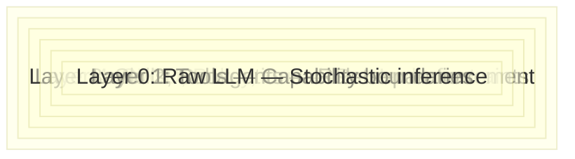

# 02 — Harness Engineering: Directing AI Force

**Core thesis:** Context Engineering teaches you the physics of the medium. Harness Engineering CONTROLS the force within it. This is the control plane that channels stochastic AI output into deterministic engineering workflows.

---

## What Harness Engineering Is NOT

Before defining what it is, clarity on what it is not:

| Thing | Why it's not Harness Engineering |
|-------|----------------------------------|
| **Prompt engineering** | Prompting changes what the model outputs. Harness changes how output is constrained, routed, validated, and recorded. |
| **RAG (Retrieval-Augmented Generation)** | RAG adds information. Harness controls process. They're complementary but different layers. |
| **A framework** (LangChain, CrewAI) | Frameworks impose opinionated abstractions. A harness is a FILE-BASED convention, not a library dependency. |
| **Agentic workflow** | Agentic workflow is a design pattern. Harness is the INFRASTRUCTURE that enforces it reliably. |

**Harness Engineering = building deterministic control structures around stochastic AI agents, using files as the control plane.**

---

## The Three Problems

### Problem 1: Contaminated Context

Solved by Context Engineering ([[01 - Context Engineering - The Physics of AI Attention]]). The harness's first job is preventing contamination before it starts. Every subagent gets isolated context curated by the harness — not raw conversation history.

### Problem 2: Unpredictable Execution

An agent given the prompt "add a feature" has no **mode boundaries**. It explores when it should implement. It refactors architecture when it should scope a single function. It decides to "improve" code unrelated to the task.

> ⚠️ Without mode boundaries, agents oscillate between exploration and implementation on every turn.

The harness solves this with **phase-gated subagents**: the Spec Author produces a spec (spec mode), the Implementer consumes the spec (implementation mode), the Reviewer evaluates the output (review mode). Each subagent operates in exactly one mode.

### Problem 3: Zero Traceability

In chat-driven development, there is NO record of WHY the agent chose implementation X over Y. The decision was made in a turn that was later summarized away or context-sanitized out.

The harness solves this with **artifact persistence**: every decision is written to a file. `design.md` records alternatives considered and choices made. `decisions.json` records architectural decisions. The traceability chain is:

```
proposal.md → requirements.md → design.md → tasks.md → source_code → tests → review.md → archive/
```

Every link is a FILE. Walk forward to see what was decided. Walk backward to see why.

---

## The Repository IS the Harness

This is the most profound shift from chat-driven development. The harness is not a service, a SaaS product, or a runtime. **The harness is a directory convention in your repository.**

```
.harness/
  specs/              # WHAT to build
  agents/             # WHO does what
  skills/             # HOW techniques work
  memory/             # WHY decisions were made
  tasks.json          # State machine tracking progress
  init.sh             # Environment verification (¡Sorpresa! Most important file)
```

| Directory | Purpose | Format |
|-----------|---------|--------|
| `specs/` | Defines WHAT — features, bugs, refactors | EARS-formatted requirements, design docs, task lists |
| `agents/` | Defines WHO — leader, spec-author, implementer, reviewer | Role + inputs + outputs + constraints files |
| `skills/` | Defines HOW — reusable technique patterns | SKILL.md format |
| `memory/` | Records WHY — decisions, session logs, accumulated learnings | JSON + markdown |
| `tasks.json` | State machine — current state of all work items | JSON schema with status transitions |

---

## The Onion Model: Layered Constraints

Each layer constrains without eliminating. The goal is never to remove AI agency — it's to channel it safely.



| Layer | Function | Constraint Type |
|-------|----------|----------------|
| **0: Raw LLM** | Stochastic token generation | None — pure probability |
| **1: Tools** | Which system calls are allowed | Capability boundary: `cat`, `grep`, `write` — NOT `rm -rf` |
| **2: Subagents** | Role separation, mode enforcement | Behavioral: implementer CANNOT propose feature scope |
| **3: Skills/Conventions** | Reusable patterns and style rules | Pattern enforcement: SKILL.md, CLAUDE.md |
| **4: CI/CD/Policy** | Pre-commit hooks, linters, tests | Hard: code that doesn't pass CI is rejected |

> 💡 Each layer is a file or directory in the repo. The harness is entirely legible — no hidden state, no runtime, no opaque "agent memory."

---

## The Simplicity Principle

**Start with the absolute minimum, then add complexity only when you OBSERVE pain.**

This principle comes directly from Vercel D0's research and the Gentle framework's creator:

> "Start with 3 harnesses, add more when you feel pain." — Gentle framework creator

The minimal bootstrap:

```
.harness/
  init.sh           # Verify environment
  tasks.json        # Current state
  specs/            # One spec per work item
    feature-x/
      tasks.md      # 3-7 atomic steps
```

That's it. **Three files + one directory.** Add `agents/` when you need role separation. Add `memory/` when decisions span multiple sessions. Add `skills/` when patterns repeat 3+ times.

> ⚠️ The #1 harness failure mode is premature complexity. Teams build elaborate agent hierarchies before they've run a single SDD cycle.

---

## ❌/✅ Antipatterns

❌ **Antipattern: Chat-driven feature development**
```bash
# Human types: "add OAuth2 to the gateway"
# Agent: rewrites auth middleware, breaks rate limiter, adds 3 new dependencies
# Agent: "Done!" — but what files? Why those choices? No record.
# Production: outage. Rollback: impossible (what even changed?).
```

✅ **Pattern: Harness-driven feature development**
```bash
# 1. Proposal: "add OAuth2 to gateway" → proposal.md
# 2. Spec Author: proposal.md → requirements.md, design.md, tasks.md
# 3. HUMAN GATE: approve design.md (exact files listed)
# 4. Implementer: receives ONLY tasks.md + design.md + source files
#    # ¡Sorpresa! Implementer never sees proposal debates
# 5. Reviewer: receives code + design.md → review.md
# 6. Archive: all artifacts preserved
# Rollback: read design.md, see every file touched, revert
```

---

## Caso Real: Gentle Framework

The Gentle framework is a YAML + bash harness system for Claude Code. It defines ~20 harness patterns, but the creator explicitly advises:

> "You don't need 20 harnesses. Start with 3: one for feature work, one for bug fixes, one for research. Add more when the existing ones fail."

The framework's orchestrator is purely deterministic — a bash script that:
1. Reads `tasks.json` to find the next task
2. Spawns a subagent with curated context (task-specific files only)
3. Validates output against the spec
4. Writes artifacts to `memory/`
5. Updates `tasks.json` status

**No AI in the orchestrator.** The intelligence is in the subagents. The harness is pure state machine.


> *Like the Linux kernel's layered architecture, a harness provides deterministic boundaries around complex, concurrent operations.*

---

## Código de Compresión

```python
"""Minimal harness bootstrap: init.sh + tasks.json + specs scaffold."""
import os
import json
import argparse
from pathlib import Path
import subprocess
import sys


HARNESS_DIR = ".harness"
DEFAULT_DIRS = ["specs", "agents", "skills", "memory"]

INIT_SH_TEMPLATE = """#!/usr/bin/env bash
set -euo pipefail
# ¡Sorpresa! init.sh is THE most important harness file
echo "[init] Verifying environment..."
python3 --version || { echo "ERROR: python3 required"; exit 1; }
git rev-parse --git-dir 2>/dev/null || { echo "ERROR: git repo required"; exit 1; }
for d in {}; do mkdir -p "$d"; done
echo "[init] Environment ready. tasks.json: {} open items."
"""

TASKS_JSON_TEMPLATE = {
    "version": "1.0",
    "tasks": [],
    "schema": {
        "id": "string",
        "title": "string",
        "phase": "proposal|spec|design|tasks|apply|verify|archive",
        "spec_path": "string (relative to specs/)",
        "status": "pending|active|blocked|done|archived",
        "assignee": "string (agent role)"
    }
}


def bootstrap(path: str = ".") -> dict:
    """Initialize harness directory and return status."""
    root = Path(path) / HARNESS_DIR
    root.mkdir(exist_ok=True)

    created = []
    for d in DEFAULT_DIRS:
        full = root / d
        if not full.exists():
            full.mkdir()
            created.append(str(full))

    init_sh = root / "init.sh"
    dirs_arg = " ".join(f"{HARNESS_DIR}/{d}" for d in DEFAULT_DIRS)
    init_sh.write_text(INIT_SH_TEMPLATE.format(dirs_arg, HARNESS_DIR))
    init_sh.chmod(0o755)

    tasks_path = root / "tasks.json"
    if not tasks_path.exists():
        tasks_path.write_text(json.dumps(TASKS_JSON_TEMPLATE, indent=2))

    return {"harness_root": str(root), "created": created, "init_sh": str(init_sh)}


def add_task(title: str, harness_path: str = ".") -> str:
    """Add a new task to tasks.json."""
    tasks_path = Path(harness_path) / HARNESS_DIR / "tasks.json"
    with open(tasks_path) as f:
        data = json.load(f)
    task_id = f"task-{len(data['tasks']) + 1:03d}"
    spec_dir = f"{task_id}-{title.lower().replace(' ', '-')[:40]}"
    task = {
        "id": task_id,
        "title": title,
        "phase": "proposal",
        "spec_path": spec_dir,
        "status": "pending",
        "assignee": "spec-author"
    }
    data["tasks"].append(task)
    with open(tasks_path, "w") as f:
        json.dump(data, f, indent=2)
    return task_id


if __name__ == "__main__":
    p = argparse.ArgumentParser()
    p.add_argument("command", choices=["init", "add"])
    p.add_argument("--title", default="")
    p.add_argument("--path", default=".")
    args = p.parse_args()
    if args.command == "init":
        print(json.dumps(bootstrap(args.path), indent=2))
    elif args.command == "add":
        tid = add_task(args.title, args.path)
        print(f"Created {tid}")
```

---

[[01 - Context Engineering - The Physics of AI Attention]] | [[02 - Harness Engineering - Directing AI Force]] | [[03 - Specification-Driven Development - The Workflow Inside the Harness]]
