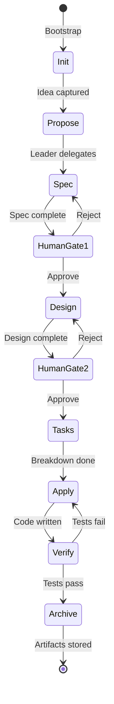
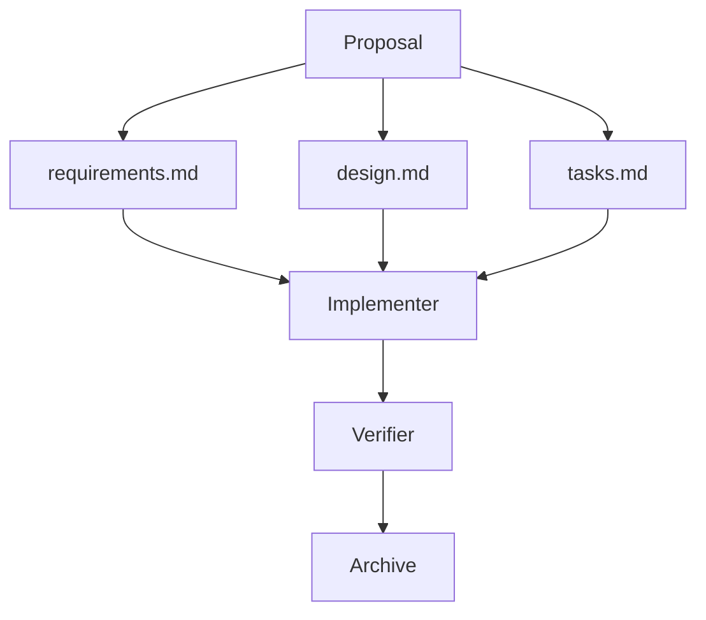
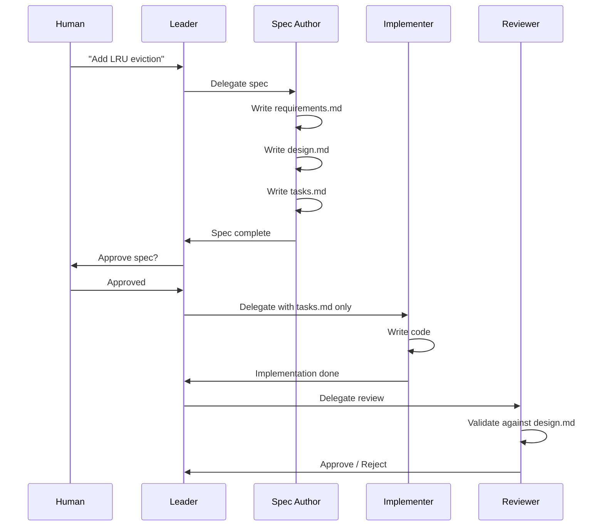
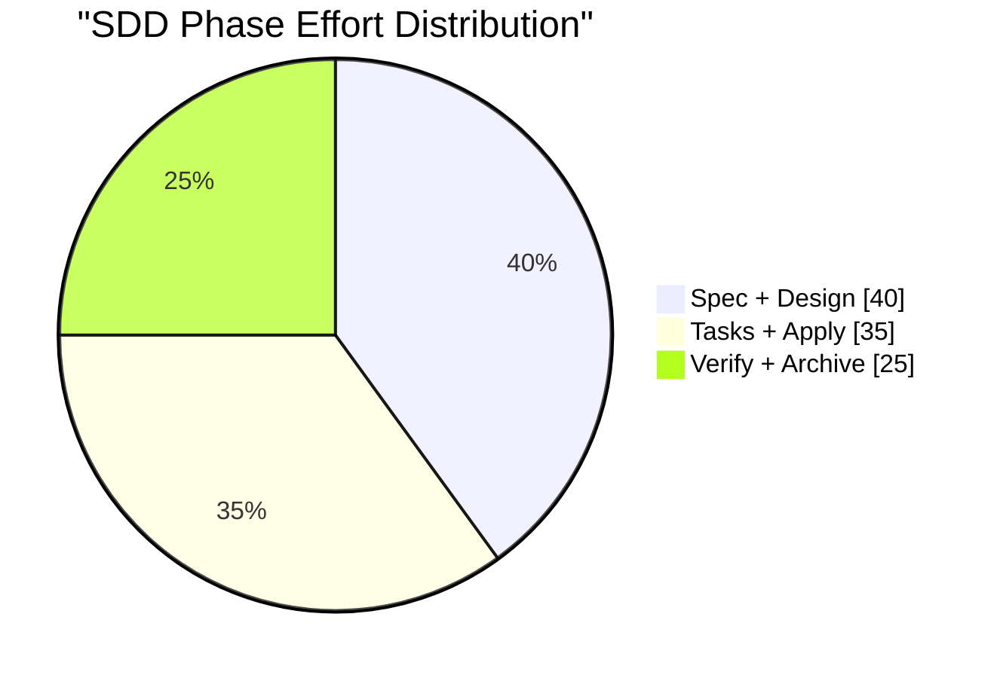

# 📋 SDD: The Specification-First Workflow

## 🎯 Learning Objectives

- Master the Specification-Driven Development (SDD) workflow from proposal to archive
- Write requirements using EARS notation and user stories with acceptance criteria
- Construct a phase-gated DAG that prevents skipping design before implementation
- Apply human approval gates at the spec stage to prevent expensive rework
- Integrate SDD with multi-agent teams where the spec author, implementer, and reviewer operate from the same source of truth

## Introduction

Before a single line of code is written, a decision must be made: what is being built, why it matters, and how success will be measured. In traditional engineering, this decision was captured in a specification. Agile movements later de-emphasized heavy specs in favor of lightweight stories. The AI era brings us full circle: specifications are not bureaucratic overhead; they are the machine-readable contracts that allow agents to work autonomously. Specification-Driven Development (SDD) is the workflow that treats the spec as the single source of truth for every phase that follows.

This note traces the history of specifications from Waterfall to Agile to AI-era SDD, introduces the EARS notation for unambiguous requirements, and walks through the complete SDD loop: Propose, Spec, Design, Task, Apply, Verify, Archive. We will see why maximum SDD maturity means developers — human or AI — never touch code without an approved spec. This connects directly to [[01 - Harness Engineering Fundamentals]], where we established that the repository is the harness, and to [[04 - Multi-Agent Orchestration and Roles]], where the spec author writes the three files that define an implementer's world.

For ML/AI engineers, SDD is the bridge between exploratory research and production engineering. Your RAG pipeline, your agent orchestration graph, and your evaluation suite all benefit from specs that outlive the chat session. This note also links to [[07 - AI Agents y Agentic Systems]] and [[09 - MLOps y Produccion]] because SDD is the governance layer that makes agentic systems deployable.

---

## Module 2: The SDD Loop and Spec as Source of Truth

### 2.1 Theoretical Foundation 🧠

The history of software specifications is a pendulum. Waterfall projects demanded hundreds of pages of upfront documentation that were obsolete before implementation began. The cost of change was so high that teams avoided change, producing systems that solved yesterday's problems. Agile reacted with user stories on index cards — lightweight, conversational, but often ambiguous. A story card that says "as a user, I want fast search" tells the developer nothing about latency thresholds, indexing strategies, or failure modes.

AI-assisted development requires a third way: specifications that are rigorous enough to be executable by an agent, yet lightweight enough to evolve with the codebase. SDD is that third way. It does not reject Agile; it elevates it. The user story becomes the seed, but the EARS requirement and the design document become the trunk and branches. The agent is not a substitute for clarity; it is an amplifier of clarity. A clear spec becomes clear code. A vague spec becomes a expensive debugging session.

At its core, SDD asserts a simple hierarchy: **Spec > Code > Chat**. The specification is the source of truth. The code must conform to the spec. The conversation context is disposable. This hierarchy inverts the default mode of AI coding, where the conversation often becomes the implicit spec. When the conversation is the spec, you cannot reproduce the result, you cannot review it against objective criteria, and you cannot hand it off to another agent. SDD externalizes the spec into files — `requirements.md`, `design.md`, `tasks.md` — so that it outlives any single chat session.

SDD is often confused with TDD, BDD, and DDD. **TDD (Test-Driven Development)** says write the test before the code; it is an implementation discipline, not a requirements discipline. **BDD (Behavior-Driven Development)** says express requirements as executable scenarios; it overlaps with SDD but focuses on behavior rather than architecture. **DDD (Domain-Driven Design)** says model the problem domain in code; it is a design philosophy, not a workflow. SDD is the umbrella that can incorporate TDD, BDD, and DDD: the spec defines what to build, TDD verifies how it behaves, BDD captures user scenarios, and DDD guides the model. Without SDD, these disciplines lack a north star.

The SDD loop consists of seven phases. **Init** calibrates the project stack and conventions. **Proposal** captures the high-level idea. **Spec** writes the requirements. **Design** details the technical approach. **Tasks** breaks work into actionable steps. **Apply** writes the code. **Verify** runs tests and reviews. **Archive** stores artifacts and updates memory. Strict gating means you cannot move from Spec to Design without human approval, and you cannot move from Design to Apply without a completed `tasks.md`. This is not bureaucracy; it is the mechanism that prevents the three harness problems from infecting your workflow.

Maximum SDD maturity means the implementer — whether human or AI — never writes code without reading an approved spec. The spec is not a suggestion; it is a contract. Violating the contract is a bug, even if the code works. This is the discipline that separates prototype hacking from professional engineering.

The economic argument for SDD is simple: the cost of fixing a requirement error grows exponentially with each downstream phase. A mistake caught in spec costs minutes to fix. The same mistake caught in verification costs hours or days. When an AI agent generates code from a vague spec, it multiplies that cost because the agent produces code faster than a human, and therefore produces wrong code faster. SDD is the brake that prevents high-speed derailment.

### 2.2 Mental Model 📐

The SDD pipeline as a directed acyclic graph with locked gates:

```
┌────────┐    ┌────────┐    ┌────────┐    ┌────────┐    ┌────────┐    ┌────────┐    ┌────────┐    ┌────────┐
│  INIT  │───→│PROPOSE │───→│ SPEC   │───→│ DESIGN │───→│ TASKS  │───→│ APPLY  │───→│ VERIFY │───→│ARCHIVE │
└────────┘    └────────┘    └───┬────┘    └───┬────┘    └────────┘    └────────┘    └───┬────┘    └────────┘
                                │             │                                         │
                          HUMAN GATE    HUMAN GATE                                REVIEW CARD
                          (locked)      (locked)                                  GATE (locked)
```

The three spec files as the contract between human intent and agent execution:

```
┌──────────────────────────────────────────┐
│  Human Intent                            │
│     ↓                                    │
│  requirements.md  (WHAT + WHY)           │
│     ↓                                    │
│  design.md        (HOW + WHERE)            │
│     ↓                                    │
│  tasks.md         (STEPS + ORDER)        │
│     ↓                                    │
│  Agent Execution                         │
└──────────────────────────────────────────┘
```

The spec hierarchy inverted from chat-driven development:

```
┌─────────────────────────────────────────┐
│  Chat-Driven Default                    │
│  Chat Context  ←  Source of Truth         │
│  Code          ←  Secondary               │
│  Spec          ←  None / Implicit         │
├─────────────────────────────────────────┤
│  SDD Hierarchy                          │
│  Spec          ←  Source of Truth       │
│  Code          ←  Must Conform            │
│  Chat          ←  Disposable              │
└─────────────────────────────────────────┘
```

Phase effort distribution for a typical ML feature (StayBot example):

```
┌─────────────────────────────────────────┐
│  Spec + Design      ████████████████    │  40%
│  Tasks + Apply      ██████████████      │  35%
│  Verify + Archive   ███████████         │  25%
└─────────────────────────────────────────┘
```

### 2.3 Syntax and Semantics 📝

EARS (Easy Approach to Requirements Syntax) notation eliminates ambiguity by forcing requirements into structured sentences. The Spec Author uses EARS to write `requirements.md` so that both humans and agents can parse the intent without inference.

```markdown
<!-- requirements.md -->
# Cache Eviction Policy

## EARS Requirements

WHEN the Redis memory usage exceeds 80%
THEN the LRU eviction policy SHALL remove the oldest key
AND log the eviction event to stdout.

WHILE the gateway is under high load
THE system SHALL maintain p99 latency below 50ms.

WHERE the request contains a semantic cache hit
THE system SHALL return the cached response
AND skip the upstream LLM call.
```

A `design.md` file translates requirements into technical decisions. It is the bridge between WHAT and HOW.

```markdown
<!-- design.md -->
# Design: LRU Eviction for Semantic Cache

## Files to Modify
- `internal/cache/lru.go` — add eviction logic
- `internal/cache/metrics.go` — add eviction counter

## Interface Changes
```go
type Evictor interface {
    Evict(keys []string) error
}
```

## Acceptance Criteria
- [ ] `TestLRUEviction` passes
- [ ] p99 latency < 50ms under load test
```

The `tasks.md` file breaks the design into atomic steps. Each step is a single agent turn.

```markdown
<!-- tasks.md -->
# Tasks: LRU Eviction

1. Implement `LRUEvictor.Evict` in `internal/cache/lru.go`
2. Add `EvictionCounter` to `internal/cache/metrics.go`
3. Write `TestLRUEviction` in `internal/cache/lru_test.go`
4. Run `go test ./internal/cache/...` and verify pass
5. Update `design.md` checkboxes
```

A user story with acceptance criteria provides the Agile complement to EARS. Use stories for human empathy; use EARS for machine precision.

```markdown
## User Story
As a gateway operator,
I want the semantic cache to evict old keys automatically,
So that memory usage stays bounded under load.

### Acceptance Criteria
- Given memory usage > 80%, when a new key is written, then the oldest key is evicted.
- Given an eviction event, when the gateway logs, then the log contains the key name and timestamp.
- Given high load (1000 req/s), when evictions occur, then p99 latency remains < 50ms.
```

A Python dataclass representing a spec artifact. This is the internal representation that the orchestrator passes between agents.

```python
from dataclasses import dataclass
from pathlib import Path
from typing import List

# WHY: Structured specs are parseable by both humans and machines.
@dataclass
class SpecArtifact:
    name: str
    requirements: Path
    design: Path
    tasks: Path
    status: str  # "proposed", "spec", "design", "approved", "applied", "verified"

    # WHY: Agents must not proceed without checking phase prerequisites.
    def can_proceed_to(self, next_phase: str) -> bool:
        transitions = {
            "proposed": ["spec"],
            "spec": ["design"],
            "design": ["approved"],
            "approved": ["applied"],
            "applied": ["verified"],
        }
        return next_phase in transitions.get(self.status, [])

    # WHY: The spec author must know what is missing.
    def missing_artifacts(self) -> List[str]:
        missing = []
        for field, path in [
            ("requirements", self.requirements),
            ("design", self.design),
            ("tasks", self.tasks),
        ]:
            if not path.exists():
                missing.append(field)
        return missing
```

### 2.4 Visual Representation 🖼️

The SDD phase flow as a state machine with human gates:



The spec-author output as a document hierarchy:



Multi-agent SDD workflow with context isolation:



SDD phase duration estimate for a typical ML feature:



### 2.5 Application in ML/AI Systems 🤖

Real case: **StayBot** — Your LangGraph + CrewAI + FastAPI property management system needs a new feature: automated late-rent reminders. Without SDD, an agent might embed the reminder logic directly into the booking graph, mixing notification concerns with state-machine logic. With SDD, the Spec Author writes:

- `requirements.md`: "WHEN a tenant is 3 days overdue THEN the system SHALL send a WhatsApp reminder AND log the attempt."
- `design.md`: "Add `LateRentReminder` node to `graphs/rental.py`; create `services/reminder.py`; do NOT modify `BookingState` enum."
- `tasks.md`: "1. Implement reminder service. 2. Add node to graph. 3. Write test. 4. Verify state machine still passes."

The Implementer receives only `tasks.md` and `design.md`, not the full CrewAI conversation history. The Reviewer validates that `BookingState` was not touched. The result is a clean, traceable feature that does not contaminate the core state machine.

The same workflow powers your Automated LLM Evaluation Suite. A new evaluation metric — say, "response empathy score" — goes through the same SDD loop. The Spec Author defines the rubric in `requirements.md`. The Design document specifies the judge prompt template and the dataset slice. The Tasks file breaks the implementation into dataset loading, prompt construction, judge invocation, and score aggregation. Without SDD, the evaluator agent might reuse a toxicity-check prompt for empathy scoring, producing meaningless results.

In the Multi-Agent Research System, SDD ensures that the retriever agent and the writer agent do not corrupt each other's context. The retriever's `design.md` might specify: "Output only a JSON list of sources; do NOT summarize." The writer's `tasks.md` then says: "Read sources from retriever output; write summary." This contract prevents the writer from hallucinating citations that the retriever never found.

For the LLM Edge Gateway, SDD prevents middleware contamination. A spec for "add OAuth2 middleware" must explicitly list `internal/middleware/oauth.go` as the only file to touch. The design.md must state: "Do NOT modify `internal/cache/*`." The Reviewer then has an objective checklist. Without these constraints, the agent might "optimize" the cache while adding OAuth, introducing a subtle race condition.

| ML Use Case | SDD Concept | Impact |
|-------------|-------------|--------|
| StayBot | EARS requirements | Prevents state-machine contamination |
| Eval Suite | tasks.md atomicity | Each eval metric gets isolated implementation |
| Research System | design.md file list | Writer never touches retriever code |
| LLM Gateway | spec approval gate | Prevents unauthorized middleware changes |

### 2.6 Common Pitfalls ⚠️

⚠️ **Vague specs** — Writing "make it faster" as a requirement is like telling a chef "make it tasty." The root cause is confusing intent with specification. EARS forces you to define the trigger, the condition, and the response. If you cannot write it in EARS, you do not understand the requirement.
💡 **Mnemonic: "EARS hear details."**

⚠️ **Skipping the design phase** — Jumping from requirements to code because "the agent knows what to do" is like removing the scaffolding from a building because the walls look stable. The root cause is impatience. Design.md is where architectural decisions live. Skip it, and every implementer will make different assumptions.
💡 **Mnemonic: "Design is the conversation you have so you do not have to have it again."**

⚠️ **Over-specifying** — Writing a hundred tasks for a ten-line change creates drag. The root cause is fear of ambiguity. A good `tasks.md` has 3-7 atomic steps. If a task exceeds 150 lines of code, it needs to be broken down or promoted to its own spec.
💡 **Mnemonic: "Specs guide, they do not suffocate."**

### 2.7 Knowledge Check ❓

1. Write an EARS requirement for "the system should retry failed LLM calls."
2. Why is human approval required at the spec stage but not at the task stage?
3. Convert the following vague requirement into a user story with acceptance criteria: "Improve cache hit rate."
4. Identify which SDD phase produces each of the three spec files.
5. What is the maximum number of tasks recommended in a single `tasks.md` file?

---

## 📦 Compression Code

```python
#!/usr/bin/env python3
"""EARS parser and SDD phase validator.

WHY: Machines should validate specs, not just humans.
"""
import re
import sys
from pathlib import Path

EARS_PATTERN = re.compile(
    r"^(WHEN|WHILE|WHERE|IF)\s+(.+?)\s+"
    r"(THEN\s+(.+?))?(SHALL|SHOULD|MUST)\s+(.+)$",
    re.IGNORECASE,
)

# WHY: A spec is invalid if it contains no structured requirements.
def validate_ears(path: str) -> bool:
    text = Path(path).read_text()
    matches = EARS_PATTERN.findall(text)
    if not matches:
        print(f"ERROR: No EARS requirements found in {path}")
        return False
    print(f"OK: {len(matches)} EARS requirements in {path}")
    return True

# WHY: Enforce that design.md exists before tasks.md is written.
def validate_phase(spec_dir: str) -> bool:
    d = Path(spec_dir)
    req = d / "requirements.md"
    des = d / "design.md"
    tsk = d / "tasks.md"
    ok = True
    if not req.exists():
        print("MISSING: requirements.md")
        ok = False
    if tsk.exists() and not des.exists():
        print("VIOLATION: tasks.md without design.md")
        ok = False
    if tsk.exists():
        steps = [line for line in tsk.read_text().splitlines() if line.strip().startswith(("1.", "2.", "3.", "4.", "5.", "6.", "7."))]
        if len(steps) > 7:
            print("WARN: tasks.md has >7 steps; consider decomposition")
    return ok

if __name__ == "__main__":
    ok = validate_ears(sys.argv[1]) and validate_phase(Path(sys.argv[1]).parent)
    sys.exit(0 if ok else 1)
```

## 🎯 Documented Project

### Description
An SDD orchestration system for a LangGraph property-management backend. The system enforces that no code is written until `requirements.md`, `design.md`, and `tasks.md` exist and have passed automated validation. The orchestrator reads `tasks.json` to know which phase each feature is in and only advances the phase when gates are satisfied.

### Functional Requirements
- Parse EARS requirements from `requirements.md`
- Validate that `design.md` exists before `tasks.md` is created
- Check that `tasks.md` contains 3-7 atomic steps
- Reject any task that references files not listed in `design.md`
- Emit structured JSON reports for the Leader agent
- Block the Apply phase until human approval is recorded in `tasks.json`
- Archive artifacts to `memory/` after Verify phase passes
- Support batch validation of an entire `specs/` directory tree

### Main Components
- `ears_parser.py` — regex-based EARS validator
- `phase_validator.py` — DAG gate enforcer (spec → design → tasks)
- `specs/<feature>/` — directory containing the three spec files
- `tasks.json` — orchestrator state tracker with phase labels
- `human_gates.json` — signed approvals for spec and design phases
- `memory/` — archived specs and decisions after completion
- `batch_validator.py` — CI-ready validator for all specs in the repo

### Success Metrics
- 100% of features have `requirements.md` before implementation begins
- Zero commits to `src/` without an accompanying `tasks.md`
- EARS parser catches ambiguous requirements in under 100ms
- Human review time at spec stage is under 10 minutes per feature
- Design phase never skipped for features >50 lines of change
- Batch validator runs in CI in under 5 seconds for 20 specs

## 🎯 Key Takeaways

- SDD treats the spec as the single source of truth; code conforms to the spec, not the chat.
- The three spec files — requirements.md, design.md, tasks.md — form a contract between human intent and agent execution.
- EARS notation eliminates ambiguity by forcing structured requirement sentences.
- Human approval gates at spec and design prevent expensive rework downstream.
- Maximum SDD maturity means no agent — human or AI — writes code without an approved spec.
- The SDD loop is a DAG: skipping phases creates the three harness problems.
- Atomic tasks (3-7 steps) keep the implementer focused and the reviewer efficient.
- StayBot and your other portfolio projects become maintainable when every feature is spec-driven.
- A vague spec is more expensive than no spec because it creates false confidence.

## References

1. Fazt Code — "Harness para SDD" (ElGlTv2A_bM) — EARS notation, three spec files, tasks.json
2. Gentle Framework / Alan Buscalas — SDD Orchestrator Harness (5Q7jV8TpMXA)
3. [[01 - Harness Engineering Fundamentals]] — The harness that makes SDD possible
4. [[04 - Multi-Agent Orchestration and Roles]] — How spec author, implementer, and reviewer interact
5. [[03 - Agent Loop Architecture: Building the Core]] — The REPL loop that executes tasks.md
6. [[09 - MLOps y Produccion]] — CI/CD gates for AI-generated code
7. [[10 - Cloud, Infra y Backend]] — Where SDD-designed backends deploy
