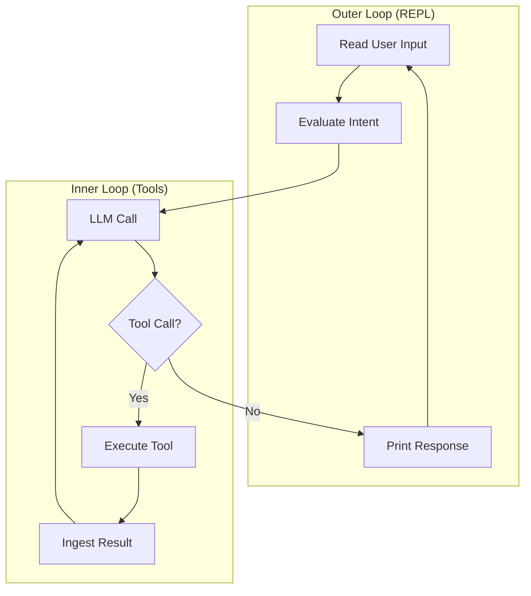
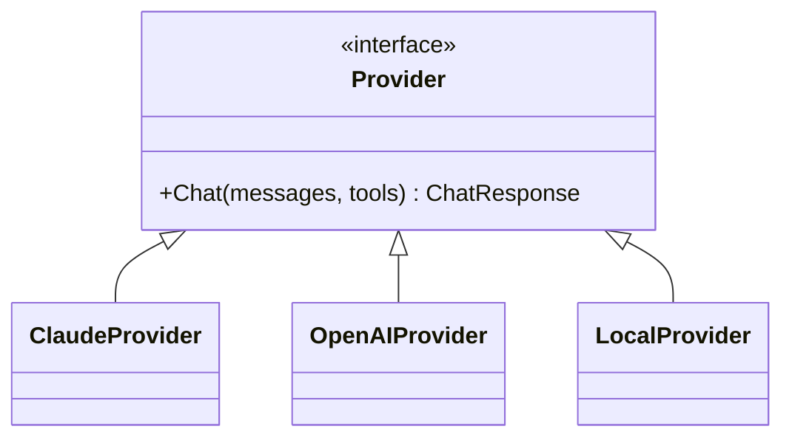
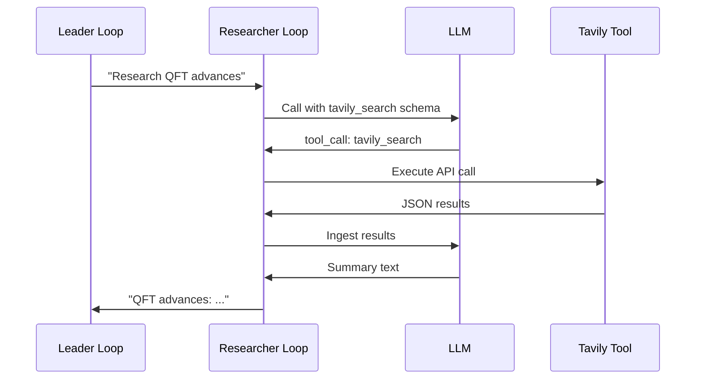

# 🔄 Agent Loop Architecture: Building the Core

## 🎯 Learning Objectives

- Build the outer REPL loop and the inner tool execution loop from scratch
- Implement a provider abstraction that supports Claude, OpenAI, and local models
- Define tool schemas that LLMs can invoke via inference
- Diagnose infinite loops, tool hallucination, and missing stop conditions
- Connect the agent loop to your Multi-Agent Research System's Tavily tool chain

## Introduction

Every AI agent, from a simple chatbot to a complex multi-agent orchestrator, is built on two loops. The outer loop faces the user: it reads input, evaluates intent, prints a response, and loops back for more. The inner loop faces the model: it calls the LLM, parses the tool decision, executes the tool, feeds the result back, and repeats until the task is done. Understanding these loops is not academic curiosity; it is the engineering foundation that lets you build custom harnesses when off-the-shelf frameworks fail.

This note teaches you to build the agent loop from scratch, using the game-loop analogy popularized in harness engineering videos. We will write a 175-line core in Python and sketch the provider abstraction in Go. The concepts here connect to [[01 - Harness Engineering Fundamentals]] because the loop is the engine inside the harness, and to [[04 - Multi-Agent Orchestration and Roles]] because the orchestrator spawns subagents by running their own loops. Your Multi-Agent Research System uses this exact architecture: a leader loop delegates to a researcher loop that calls Tavily tools in an inner loop.

---

## Module 3: The REPL and Inner Tool Loop

### 3.1 Theoretical Foundation 🧠

The REPL (Read-Eval-Print-Loop) is one of the oldest patterns in computing. It originated in Lisp environments as a way to interact with a live interpreter. In agent engineering, the REPL becomes the user-facing shell: it reads a human request, evaluates what the agent should do, prints the result, and loops for the next request. The simplicity of the pattern is deceptive. Inside the "Evaluate" step lies the entire complexity of modern AI: tool selection, parameter binding, execution, error handling, and result summarization.

The inner loop was formalized by the Gentle framework and the Vercel D0 experiments. It consists of four steps: **LLM Call** → **Tool Decision** → **Execution** → **Result Ingestion**. The LLM emits a structured decision (which tool, with what arguments). The harness validates the decision, executes the tool, and feeds the raw result back into the LLM. The LLM then either decides to call another tool or generates a final response. This loop continues until a stop condition is met: maximum iterations, a "done" signal, or a human interrupt.

Why build this from scratch when frameworks like LangChain and CrewAI exist? Because frameworks are harnesses built by others. When you build the loop yourself, you understand where the framework hides complexity. You can replace the provider without rewriting your orchestration. You can add a new tool by editing a JSON schema, not by installing a plugin. You can diagnose failures because you wrote the error handling. The 175-line Go core and the Python equivalent in this note are not toys; they are the minimal viable system that proves the concept.

The game-loop analogy is apt. In a game engine, the main loop processes input, updates state, and renders output. In an agent loop, the main loop processes user intent, updates the tool state, and renders the final answer. The inner loop is like the physics engine: it runs at a higher frequency, handling collisions (tool errors), applying forces (API calls), and updating positions (file writes). A game developer who only uses pre-built engines never understands frame pacing; an AI engineer who only uses pre-built agents never understands context management.

### 3.2 Mental Model 📐

The two-loop architecture as nested cycles:

```
┌─────────────────────────────────────────┐
│  Outer Loop (User-Facing REPL)          │
│  ┌─────────────────────────────────┐  │
│  │  Read User Input                │  │
│  │  ↓                            │  │
│  │  Evaluate Intent              │  │
│  │  ↓                            │  │
│  │  ┌─────────────────────────┐  │  │
│  │  │  Inner Loop (Tools)     │  │  │
│  │  │  LLM Call → Decide      │  │  │
│  │  │  ↓                    │  │  │
│  │  │  Execute Tool         │  │  │
│  │  │  ↓                    │  │  │
│  │  │  Ingest Result        │  │  │
│  │  │  ↓ (repeat)           │  │  │
│  │  └─────────────────────────┘  │  │
│  │  ↓                            │  │
│  │  Print Response               │  │
│  │  ↓ (loop)                     │  │
│  └─────────────────────────────────┘  │
└─────────────────────────────────────────┘
```

The provider abstraction as a plug-in layer:

```
┌─────────────────────────────────────────┐
│  Agent Loop Core (175 lines)            │
│  ├─ REPL Handler                        │
│  ├─ Tool Dispatcher                     │
│  └─ Stop Condition Checker              │
├─────────────────────────────────────────┤
│  Provider Abstraction                    │
│  ├─ Claude SDK (Messages API)           │
│  ├─ OpenAI SDK (Chat Completions)       │
│  ├─ Local LLM (vLLM / llama.cpp)        │
│  └─ Gemini (Vertex AI)                  │
├─────────────────────────────────────────┤
│  Tool Registry                           │
│  ├─ bash                                │
│  ├─ read_file                           │
│  ├─ write_file                          │
│  ├─ grep                                │
│  └─ custom (Tavily, Redis, etc.)        │
└─────────────────────────────────────────┘
```

The tool decision flow inside the inner loop:

```
┌─────────────┐    ┌─────────────┐    ┌─────────────┐    ┌─────────────┐
│  LLM Call   │───→│ Parse JSON  │───→│ Validate    │───→│  Execute    │
│  (tools in  │    │  tool_call  │    │  schema     │    │  tool       │
│  system p)  │    │  object     │    │  & args     │    │  function   │
└─────────────┘    └─────────────┘    └─────────────┘    └─────────────┘
                                                              │
                                                              ↓
┌─────────────┐    ┌─────────────┐    ┌─────────────┐    ┌─────────────┐
│  Final      │←───│  Format for │←───│  Ingest raw │←───│  Return     │
│  Response   │    │  next LLM   │    │  output     │    │  result     │
│  (stop)     │    │  turn       │    │  (text/json)│    │  (stdout)   │
└─────────────┘    └─────────────┘    └─────────────┘    └─────────────┘
```

### 3.3 Syntax and Semantics 📝

A minimal agent loop in Python. This is the core of every harnessed system.

```python
import json
import os
from typing import Callable, Dict, List

# WHY: A tool is just a function with a JSON schema description.
Tool = Dict[str, any]
ToolFunc = Callable[..., str]

class AgentLoop:
    def __init__(self, provider, tools: Dict[str, ToolFunc], tool_schemas: List[Tool]):
        self.provider = provider
        self.tools = tools
        self.tool_schemas = tool_schemas
        self.messages: List[Dict] = []

    # WHY: The outer REPL reads user input and delegates to the inner loop.
    def repl(self, user_input: str) -> str:
        self.messages.append({"role": "user", "content": user_input})
        return self._inner_loop()

    # WHY: The inner loop keeps calling the LLM until it produces text, not a tool call.
    def _inner_loop(self, max_iterations: int = 10) -> str:
        for _ in range(max_iterations):
            response = self.provider.chat(
                messages=self.messages,
                tools=self.tool_schemas,
            )
            message = response["choices"][0]["message"]
            self.messages.append(message)

            # WHY: If the LLM returns a tool call, execute it and feed the result back.
            if "tool_calls" in message:
                for tool_call in message["tool_calls"]:
                    result = self._execute_tool(tool_call)
                    self.messages.append({
                        "role": "tool",
                        "tool_call_id": tool_call["id"],
                        "content": result,
                    })
            else:
                # WHY: Text response means the task is complete.
                return message["content"]

        return "ERROR: Max iterations reached without completion"

    # WHY: Validate before executing to prevent injection and schema mismatches.
    def _execute_tool(self, tool_call: Dict) -> str:
        name = tool_call["function"]["name"]
        args = json.loads(tool_call["function"]["arguments"])
        if name not in self.tools:
            return f"ERROR: Unknown tool {name}"
        try:
            return self.tools[name](**args)
        except Exception as e:
            return f"ERROR: {e}"
```

A Go provider abstraction interface. This is the polymorphic layer that lets you swap Claude for OpenAI without touching the loop.

```go
// WHY: Interfaces let you swap providers without changing loop logic.
type Provider interface {
    Chat(messages []Message, tools []ToolSchema) (*ChatResponse, error)
}

// WHY: Each provider implements the same interface but handles auth differently.
type ClaudeProvider struct {
    APIKey string
    Model  string
}

func (p *ClaudeProvider) Chat(messages []Message, tools []ToolSchema) (*ChatResponse, error) {
    // Implementation calls Anthropic Messages API
}

type OpenAIProvider struct {
    APIKey string
    Model  string
}

func (p *OpenAIProvider) Chat(messages []Message, tools []ToolSchema) (*ChatResponse, error) {
    // Implementation calls OpenAI Chat Completions API
}
```

A tool schema definition. The LLM decides which tool to call based on these descriptions.

```json
{
  "type": "function",
  "function": {
    "name": "tavily_search",
    "description": "Search the web using Tavily API for recent research papers.",
    "parameters": {
      "type": "object",
      "properties": {
        "query": {
          "type": "string",
          "description": "The search query string"
        },
        "max_results": {
          "type": "integer",
          "description": "Number of results to return (1-10)"
        }
      },
      "required": ["query"]
    }
  }
}
```

### 3.4 Visual Representation 🖼️

The two-loop architecture as a system diagram:



Provider abstraction hierarchy:



Tool execution flow in the Multi-Agent Research System:



### 3.5 Application in ML/AI Systems 🤖

Real case: **Multi-Agent Research System** — Your LangGraph cyclic agents use the inner tool loop every time the researcher agent calls Tavily. The researcher loop is a concrete instance of the architecture in this note. The Leader loop (outer REPL) delegates a research query. The Researcher loop (inner tool loop) calls the LLM with the Tavily tool schema. The LLM decides to invoke `tavily_search`. The tool executes, returns raw JSON, and the LLM synthesizes a summary. If the summary is insufficient, the loop repeats with a refined query.

The provider abstraction matters here because your system may run locally with llama.cpp for cost reasons, but switch to Claude for complex synthesis. Without the abstraction, you would have two separate code paths. With it, you change one configuration key.

| ML Use Case | Loop Concept | Impact |
|-------------|--------------|--------|
| Research System | Inner tool loop | Tavily calls isolated from leader context |
| Eval Suite | Provider abstraction | Swap Gemma 4 for Claude for judge tasks |
| LLM Gateway | Stop conditions | Prevent infinite retries on 503 errors |
| StayBot | REPL loop | Chat-like interaction with state machine backend |

### 3.6 Common Pitfalls ⚠️

⚠️ **Infinite loops** — If the LLM keeps calling the same tool with the same arguments, the inner loop never terminates. The root cause is usually a vague tool description or a missing stop condition. Always cap iterations and check for argument stagnation.
💡 **Mnemonic: "Count the turns; kill the loop."**

⚠️ **Tool hallucination** — The LLM may invent a tool name or parameter that does not exist. The root cause is insufficient schema validation. The harness must reject unknown tools and malformed arguments before execution.
💡 **Mnemonic: "Trust but verify every tool_call."**

⚠️ **Missing stop conditions** — An agent that never knows when to stop talking is as useless as one that never starts. The root cause is ambiguity in the system prompt about task completion. Always include a clear "done" signal in the prompt.
💡 **Mnemonic: "Tell it when to stop, or it never will."**

### 3.7 Knowledge Check ❓

1. Draw the two-loop architecture and label which loop faces the user and which faces the model.
2. Write a Python `ToolSchema` for a `read_file` tool that takes a path argument.
3. Explain why the provider abstraction matters when switching from Claude to a local llama.cpp model.
4. What stop condition prevents the inner loop from running forever?

---

## 📦 Compression Code

```python
#!/usr/bin/env python3
"""Minimal agent loop (175-line core) — Python implementation."""
import json
import os
from typing import Callable, Dict, List

ToolFunc = Callable[..., str]

class AgentLoop:
    def __init__(self, provider, tools: Dict[str, ToolFunc], schemas: List[dict]):
        self.provider = provider
        self.tools = tools
        self.schemas = schemas
        self.messages: List[dict] = []

    def repl(self, user_input: str) -> str:
        self.messages.append({"role": "user", "content": user_input})
        return self._inner_loop()

    def _inner_loop(self, max_iterations: int = 10) -> str:
        for _ in range(max_iterations):
            resp = self.provider.chat(self.messages, self.schemas)
            msg = resp["choices"][0]["message"]
            self.messages.append(msg)
            if "tool_calls" in msg:
                for tc in msg["tool_calls"]:
                    result = self._execute(tc)
                    self.messages.append({
                        "role": "tool",
                        "tool_call_id": tc["id"],
                        "content": result,
                    })
            else:
                return msg["content"]
        return "ERROR: Max iterations reached"

    def _execute(self, tc: dict) -> str:
        name = tc["function"]["name"]
        args = json.loads(tc["function"]["arguments"])
        if name not in self.tools:
            return f"ERROR: Unknown tool {name}"
        try:
            return self.tools[name](**args)
        except Exception as e:
            return f"ERROR: {e}"
```

```go
// agent_loop.go — Minimal Go core (175 lines equivalent)
package main

import (
	"encoding/json"
	"fmt"
)

// WHY: Interface allows provider swapping without loop changes.
type Provider interface {
	Chat(messages []Message, tools []ToolSchema) (*ChatResponse, error)
}

type Message struct {
	Role    string `json:"role"`
	Content string `json:"content"`
}

type ToolSchema struct {
	Type     string `json:"type"`
	Function struct {
		Name        string `json:"name"`
		Description string `json:"description"`
		Parameters  json.RawMessage `json:"parameters"`
	} `json:"function"`
}

type ChatResponse struct {
	Choices []struct {
		Message Message `json:"message"`
	} `json:"choices"`
}
```

## 🎯 Documented Project

### Description
A minimal but production-ready agent loop that can be dropped into any Python project. It supports tool invocation, provider swapping, and iteration caps. The loop is the engine behind the Multi-Agent Research System's researcher agent.

### Functional Requirements
- Accept user input via REPL
- Route LLM tool calls to registered Python functions
- Validate tool arguments against JSON schema
- Cap inner loop iterations at 10
- Support provider hot-swapping via environment variable
- Log every tool call and result for traceability

### Main Components
- `AgentLoop` class — REPL + inner loop
- `Provider` interface — Claude, OpenAI, local adapters
- `ToolRegistry` — schema + function mapping
- `logger.py` — traceability harness for every turn

### Success Metrics
- Loop handles 100 tool calls without memory leak
- Provider swap requires changing only one env var
- Tool hallucination rate < 1% via strict schema validation
- 99th percentile response time < 2s per turn

## 🎯 Key Takeaways

- Every agent has two loops: an outer REPL for users and an inner loop for tools.
- The inner loop is the engine: LLM → Decide → Execute → Ingest → Repeat.
- Provider abstraction lets you swap models without rewriting orchestration.
- Tool schemas are the API contract between the LLM and the harness.
- Stop conditions (max iterations, done signal) are mandatory, not optional.
- Building the loop from scratch (175 lines) teaches you what frameworks hide.
- Your Multi-Agent Research System uses this exact loop for Tavily delegation.
- The game-loop analogy helps reason about frame pacing and context management.

## References

1. Gentle Framework / Alan Buscalas — "Building harness from scratch" (2B9QTg_-nyc)
2. Vercel D0 — Tool minimalism and loop optimization
3. [[01 - Harness Engineering Fundamentals]] — The harness that hosts the loop
4. [[04 - Multi-Agent Orchestration and Roles]] — Spawning subagent loops
5. [[13 - Go Engineering]] — Go implementation of provider abstraction
6. [[03 - Advanced Python]] — Python async patterns for loop concurrency
