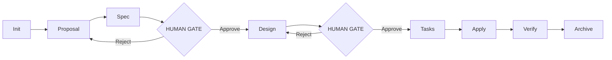

# 03 — Specification-Driven Development: The Workflow Inside the Harness

**Core thesis:** SDD is the SPECIFIC workflow protocol that runs inside the harness. If Harness Engineering provides the control structures, SDD defines the step-by-step choreography that moves work through them.

---

## The Hierarchy

```
Context Engineering (Layer 0 — the physics)
    └─→ Harness Engineering (Layer 1-4 — the control structure)
            └─→ SDD (the protocol running INSIDE the structure)
```

SDD assumes the layers below exist. If you try SDD without context engineering, you'll contaminate subagent contexts on the first round-trip. If you try SDD without a harness, you have no phase enforcement, no role separation, and no state machine.

---

## The SDD Directed Acyclic Graph (DAG)

SDD is a strict DAG. Phases flow in one direction. No phase can be skipped. No phase can loop back (except through a formal rejection gate).



### Phase Details

| Phase | Input | Output | Agent | Gate |
|-------|-------|--------|-------|------|
| **Init** | Request from human | `proposal.md` | Leader | None |
| **Proposal** | User story, context | `proposal.md` (scope, impact, affected files) | Spec Author | None |
| **Spec** | `proposal.md` | `requirements.md` (EARS format) | Spec Author | None |
| **Design** | `requirements.md` | `design.md` (exact files, patterns, data flow) | Spec Author | **HUMAN GATE** ⚠️ |
| **Tasks** | `design.md` | `tasks.md` (3-7 atomic, ordered steps) | Spec Author | None |
| **Apply** | `tasks.md` + `design.md` + source files | Modified source + tests | Implementer | None |
| **Verify** | Modified code + `design.md` | `review.md` (pass/fail + findings) | Reviewer | None |
| **Archive** | All artifacts | Archived in `memory/` | Leader | Automatic |

> 💡 Only two human gates: Spec approval and Design approval. These are the highest-leverage decisions. Everything else is automated.

---

## EARS Notation: Requirements That Machines Can Parse

EARS (Easy Approach to Requirements Syntax) is a structured natural language format:

```
WHEN <trigger> THEN <system> SHALL <response>
```

Patterns:

```
# Ubiquitous: System must always do X
THE <system> SHALL <response>.

# Event-driven: When X occurs, do Y
WHEN <trigger> THE <system> SHALL <response>.

# State-driven: While in state S, do X
WHILE <state> THE <system> SHALL <response>.

# Unwanted behavior: If X, then Y must not happen
IF <condition> THEN THE <system> SHALL <response>.
```

**Why EARS?** It's parseable by both humans and machines. A Python parser can validate syntax and extract triggers/systems/responses for test generation. A human can read it as plain prose. This dual readability is essential for the Spec → Design → Tasks pipeline — the Implementer consumes structured requirements, not ambiguous product-speak.

### EARS Example: OAuth2 Feature

```markdown
# requirements.md

WHEN a new user requests authentication
THEN the Gateway SHALL redirect to the configured OAuth2 provider.

WHILE an access token is valid
THE Gateway SHALL allow requests to protected endpoints.

IF an access token is expired
THEN THE Gateway SHALL return HTTP 401 with WWW-Authenticate header.

THE Gateway SHALL support Google, GitHub, and generic OIDC providers.
```

---

## The Three Spec Files

### 1. `requirements.md` — WHAT + WHY

Contains ONLY requirements in EARS notation and a brief "why this matters" section. No implementation details. No file names. No code patterns. This file is pure PROBLEM space.

> ⚠️ The #1 SDD antipattern: `requirements.md` that includes implementation details. This contaminates the design phase by pre-committing to solutions before alternatives are evaluated.

### 2. `design.md` — HOW + WHERE

Contains exact file paths to modify, data structures, algorithm choices, and alternative approaches considered. This is the ENGINEERING decision document. It answers: "What files will change? What approach? Why this approach over alternatives?"

```markdown
# design.md

## Files to modify
- `src/auth/oauth2.py` (NEW) — OAuth2 provider abstraction
- `src/gateway/middleware.py:45-120` — Inject auth check
- `config/providers.yaml` (NEW) — Provider configuration
- `tests/auth/test_oauth2.py` (NEW) — Integration tests

## Approach
Provider pattern with factory method. Each provider (Google, GitHub, OIDC) implements
`OAuth2Provider` ABC. Gateway middleware calls `provider.authenticate(token)`.

## Alternatives considered
- Decorator pattern: rejected — too many decorators clutter route definitions
- Middleware chain: selected — single injection point, clean separation
```

### 3. `tasks.md` — 3-7 atomic steps

Each task is ONE atomic action. Tasks are ordered. Dependencies are explicit.

```markdown
# tasks.md

1. Create `src/auth/oauth2.py` with OAuth2Provider ABC and factory method.
   Depends on: none.
   Validate: ABC has `authenticate(token) -> User` abstract method.

2. Implement Google provider in `src/auth/providers/google.py`.
   Depends on: task 1.

3. Implement GitHub provider in `src/auth/providers/github.py`.
   Depends on: task 1.

4. Add auth middleware to `src/gateway/middleware.py`.
   Depends on: task 1.

5. Write integration tests in `tests/auth/test_oauth2.py`.
   Depends on: tasks 2, 3, 4.

6. Run full test suite and verify coverage > 85%.
   Depends on: task 5.
```

---

## Spec > Code > Chat Hierarchy

This is a non-negotiable hierarchy in SDD:

```
SPEC (source of truth)
  ↓
CODE (conforms to spec)
  ↓
CHAT (disposable, ephemeral)
```

Chat is a TRANSPORT layer, not a RECORD layer. If a decision is made in chat and not written to a spec file, the decision never happened.

> ¡Sorpresa! SDD works identically for humans AND AI — the spec is the difference, not the executor's skill. Give the same `tasks.md` + `design.md` to a human junior developer and an AI agent. Both can implement it. The quality difference traces back to the SPEC, not the executor.

---

## ❌/✅ Side by Side

❌ **Antipattern: Spec-less development**
```python
# Human: "add OAuth2"
# Agent: writes code, no record of decisions
# Three weeks later: "Why did we use middleware instead of decorators?"
# Answer: nobody knows. Chat history is gone.
# Bug: rate limiter broke. Rollback? Which files changed?
```

✅ **Pattern: SDD with 3 spec files**
```python
# 1. requirements.md: 4 EARS statements defining what OAuth2 MUST do
# 2. design.md: exact files, approach chosen, alternatives rejected
# 3. tasks.md: 6 ordered, atomic tasks with validation criteria
# 4. Implementer consumes ONLY tasks.md + design.md # ¡Sorpresa! Curated context
# 5. Reviewer checks: does code match design.md? Are all tasks complete?
# 6. Archive: all files in memory/oauth2-feature/ — forever auditable
```

---

## Caso Real: Fazt Code's Harness Demonstration

Fazt Code, a YouTube educator, demonstrated a complete SDD cycle in 4 minutes:

1. **Proposal** (30s): User story entered into harness
2. **Spec** (60s): Spec Author produces `requirements.md` + `design.md` + `tasks.md` — 3 files
3. **Human Gate** (30s): Human reviews `design.md`, approves specific files and approach
4. **Implement** (90s): Implementer receives curated context, modifies 5 files, writes tests
5. **Verify** (30s): Reviewer produces `review.md` — all tasks complete, tests pass

Total: 4 minutes from proposal to verified implementation. Traceability: complete. Rollback: trivial (read `design.md` for file list).


> *SDD formalizes the software development process into a deterministic, file-driven protocol.*

---

## Código de Compresión

```python
"""EARS parser + SDD phase validator."""
import re
from dataclasses import dataclass, field
from enum import Enum
from typing import Optional
import sys
import json


class EARS_PATTERNS:
    UBIQUITOUS = re.compile(r"^THE\s+(.+?)\s+SHALL\s+(.+)$", re.I)
    EVENT = re.compile(r"^WHEN\s+(.+?)\s+THE\s+(.+?)\s+SHALL\s+(.+)$", re.I)
    STATE = re.compile(r"^WHILE\s+(.+?)\s+THE\s+(.+?)\s+SHALL\s+(.+)$", re.I)
    UNWANTED = re.compile(r"^IF\s+(.+?)\s+THEN\s+THE\s+(.+?)\s+SHALL\s+(.+)$", re.I)


class Phase(str, Enum):
    INIT = "init"
    PROPOSAL = "proposal"
    SPEC = "spec"
    DESIGN = "design"
    TASKS = "tasks"
    APPLY = "apply"
    VERIFY = "verify"
    ARCHIVE = "archive"


VALID_TRANSITIONS = {
    Phase.INIT: [Phase.PROPOSAL],
    Phase.PROPOSAL: [Phase.SPEC],
    Phase.SPEC: [Phase.DESIGN],
    Phase.DESIGN: [Phase.TASKS],
    Phase.TASKS: [Phase.APPLY],
    Phase.APPLY: [Phase.VERIFY],
    Phase.VERIFY: [Phase.ARCHIVE],
}


@dataclass
class EARS_Requirement:
    pattern: str
    trigger: Optional[str]
    system: str
    response: str
    raw: str


@dataclass
class SDD_Task:
    id: str
    phase: Phase = Phase.INIT
    status: str = "pending"


class EARSParser:
    @staticmethod
    def parse(text: str) -> list[EARS_Requirement]:
        results = []
        for line in text.strip().split("\n"):
            line = line.strip()
            if not line or line.startswith("#"):
                continue
            for name, pattern in [("ubiquitous", EARS_PATTERNS.UBIQUITOUS),
                                   ("event", EARS_PATTERNS.EVENT),
                                   ("state", EARS_PATTERNS.STATE),
                                   ("unwanted", EARS_PATTERNS.UNWANTED)]:
                m = pattern.match(line)
                if m:
                    groups = m.groups()
                    if name == "ubiquitous":
                        trigger, system, resp = None, groups[0], groups[1]
                    else:
                        trigger, system, resp = groups[0], groups[-2], groups[-1]
                    results.append(EARS_Requirement(
                        pattern=name, trigger=trigger, system=system,
                        response=resp, raw=line))
                    break
        return results


class SDDValidator:
    @staticmethod
    def validate_phase(current: Phase, next_phase: Phase) -> bool:
        return next_phase in VALID_TRANSITIONS.get(current, [])

    @staticmethod
    def validate_spec_files(reqs_count: int, design_has_files: bool,
                            tasks_count: int) -> list[str]:
        warnings = []
        if reqs_count < 2:
            warnings.append("⚠️ Fewer than 2 EARS requirements — scope too narrow?")
        if not design_has_files:
            warnings.append("⚠️ design.md must list exact files to modify")
        if tasks_count < 3:
            warnings.append("⚠️ Fewer than 3 tasks — not atomic enough?")
        if tasks_count > 7:
            warnings.append("⚠️ More than 7 tasks — split into sub-proposals")
        return warnings


if __name__ == "__main__":
    sample = """
    WHEN user requests auth THEN Gateway SHALL redirect to OAuth2 provider.
    WHILE token is valid THE Gateway SHALL allow requests.
    IF token is expired THEN THE Gateway SHALL return HTTP 401.
    """
    reqs = EARSParser.parse(sample)
    print(f"Parsed {len(reqs)} EARS requirements:")
    for r in reqs:
        print(f"  [{r.pattern}] sys={r.system} resp={r.response[:40]}...")

    v = SDDValidator()
    warnings = v.validate_spec_files(len(reqs), True, 6)
    for w in warnings:
        print(w)
    print(f"Phase PROPOSAL → SPEC valid: {v.validate_phase(Phase.PROPOSAL, Phase.SPEC)}")
    print(f"Phase SPEC → APPLY valid: {v.validate_phase(Phase.SPEC, Phase.APPLY)}")
```

---

[[02 - Harness Engineering - Directing AI Force]] | [[03 - Specification-Driven Development - The Workflow Inside the Harness]] | [[04 - File Architecture - Organizing Harness Infrastructure]]
