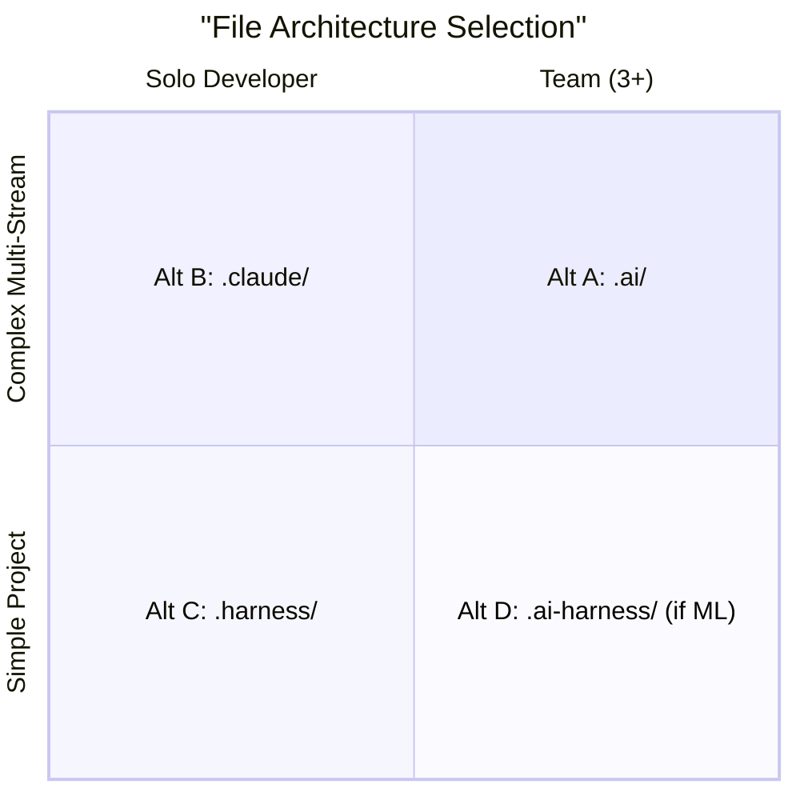

# 04 — File Architecture: Organizing Harness Infrastructure

**Core thesis:** SDD defines WHAT happens. File architecture defines WHERE it lives. This is the blueprint for organizing `.md` files, agent definitions, memory stores, and the state machine on disk.

---

## Why File Architecture Matters

In chat-driven development, there is no file architecture because there are no files. In harness-driven development, every decision, requirement, task, and review is a FILE. The organization of these files determines:

- **Discoverability**: Can a new agent find the right spec?
- **Context isolation**: Can the implementer read ONLY what it needs?
- **Traceability**: Can you walk backward from a code change to the design decision?
- **Scalability**: Can you have 50 concurrent features without chaos?

---

## Four Reference Architectures

### Alt A: `.ai/` directory — Gentle-style, Full-featured

```
.ai/
  agents/
    leader.md              # Role: route tasks, manage state machine
    spec-author.md         # Role: produce requirements, design, tasks
    implementer.md         # Role: consume spec, produce code
    reviewer.md            # Role: review code against spec
  skills/
    code-review.md         # SKILL.md: systematic review pattern
    react-component.md     # SKILL.md: component creation pattern
    api-endpoint.md        # SKILL.md: API scaffolding pattern
  harnesses/
    feature-work/          # One harness per workflow type
      harness.yaml
    bug-fix/
      harness.yaml
    research/
      harness.yaml
  memory/
    decisions.json         # ADR log: every architectural decision
    sessions/
      2026-05-29-feature-x.json  # Per-session execution log
      2026-05-28-bug-y.json
    learnings.md           # Accumulated patterns and gotchas
  specs/
    feature-oauth2/
      proposal.md
      requirements.md
      design.md
      tasks.md
  tasks.json              # Federated state machine
  init.sh                 # Environment bootstrap and verification
```

**Pros:** Complete role separation, formal harness definitions, rich memory store. **Cons:** Overhead for small projects. **When to use:** Teams of 3+, multiple concurrent work streams, project lifespan > 6 months.

---

### Alt B: `.claude/` directory — Cloud Code Native, Simple

```
.claude/
  CLAUDE.md               # System instructions: conventions, rules, context
  skills/
    code-review.md
    test-generation.md
    deployment.md
  docs/
    architecture.md       # High-level architecture decisions
    patterns.md           # Code patterns and conventions
    api-reference.md      # External API documentation
```

**Pros:** Minimal, familiar to Claude Code users, zero ceremony. **Cons:** No agent role definitions, no formal state machine, no memory store. **When to use:** Solo developers, projects < 3 months, quick prototypes.

---

### Alt C: `.harness/` directory — Minimalist Unix, Vercel-inspired

```
.harness/
  agents/
    leader
    spec-author
    implementer
    reviewer
  tools.json              # Tool allowlist: {"allowed": ["cat","grep","write","diff","test"]}
  config.yaml             # Runtime config: model, max_tokens, parallel_limit
  specs/
    feature-oauth2/
      tasks.md            # ONLY tasks.md — minimal spec
```

**Pros:** Fast, focused, Unix-philosophy. **Cons:** No formal design docs, no memory, no decisions log. **When to use:** Rapid iteration, single-feature work, Vercel-style "just ship it" teams.

---

### Alt D: `.ai-harness/` directory — ML/AI Production

```
.ai-harness/
  agents/
    trainer.md             # Role: manage training pipelines
    evaluator.md           # Role: evaluate model quality
    deployer.md            # Role: Docker/K8s deployment
    monitor.md             # Role: production monitoring
  memory/
    experiments.json       # Experiment tracking
    model-registry.json    # Model version registry
    decisions.json         # ADRs for ML infrastructure
    sessions/
  skills/
    fine-tuning.md
    quantize-model.md
    bench-eval.md
  deployer.md              # Exact Dockerfile + K8s manifest patterns
```

**Pros:** ML-specific agent roles, experiment tracking, model registry. **Cons:** Specialized — not for non-ML projects. **When to use:** ML/AI systems in production, training pipelines, model serving infrastructure.

---

## Decision Matrix



| Project Size | Team Size | Complexity | Architecture |
|-------------|-----------|-----------|--------------|
| Small | Solo | Low | Alt B (.claude/) |
| Small | Team | Low | Alt C (.harness/) |
| Medium | Solo | Medium | Alt B → Alt A when pain |
| Medium | Team | Medium | Alt A (.ai/) |
| Large | Team | High | Alt A with memory/ extension |
| ML/AI specific | Any | Medium+ | Alt D (.ai-harness/) |

---

## Agent Definition Files

Every agent MUST have a definition file. The minimum schema:

```markdown
# leader.md

## Role
Orchestrator. Routes tasks based on tasks.json state. Does NOT modify code.

## Inputs
- tasks.json (current state of all work items)
- specs/{task-id}/proposal.md (scope and requirements)

## Outputs
- Updated tasks.json (phase transitions, assignments)
- Spawned subagent contexts (curated)

## Tools
- cat, grep, ls, write, diff, spawn-subagent

## MUST NOT
- Modify any source code
- Skip phases
- Make architectural decisions

## Stop Conditions
- All tasks in "archived" or "blocked" status
- Human abort signal received

---
# implementer.md

## Role
Code executor. Implements tasks.md against design.md. Does NOT propose features.

## Inputs
- specs/{task-id}/tasks.md (3-7 atomic steps) — ONLY this and design.md
- specs/{task-id}/design.md (exact files, patterns) # ¡Sorpresa! Curated context
- Source files referenced in design.md

## Outputs
- Modified source files
- New/updated test files
- Build output (if applicable)

## Tools
- cat, grep, ls, write, diff, test-runner, lint

## MUST NOT
- Modify files NOT listed in design.md
- Propose new features or scope changes
- Delete files without design.md authorization

## Stop Conditions
- All tasks.md items completed and validated
- Test suite passes with coverage >= threshold
- Any task fails unrecoverably
```

> ⚠️ The "MUST NOT" section is as important as the "Inputs/Outputs" section. It defines the agent's constraint boundary.

---

## Skills Directory

A skill is a reusable pattern. Create one when a workflow is used **3+ times** across different features.

### SKILL.md Format

```markdown
# Skill: Code Review

## Purpose
Systematic code review against design.md. Checks correctness, style, tests, security.

## When to Use
After Implementer completes tasks and before archive phase.

## Input Checklist
- [ ] design.md present
- [ ] tasks.md present (all items checked)
- [ ] All modified source files accessible
- [ ] Test suite output available

## Review Steps
1. Diff against design.md: did code modify ONLY listed files?
2. Task completion: is every tasks.md item implemented?
3. Style check: does code follow repo conventions?
4. Test coverage: are new paths tested? Coverage > 85%?
5. Security check: no hardcoded secrets, SQL injection, etc.

## Output Format
```markdown
# review.md
## Pass/Fail: [PASS/FAIL]
## Findings
- [ ] Task 1: ...
- [ ] Task 2: ...
## Issues (if any)
- Line 45: ...
## Recommendation: [APPROVE/REVISE]
```
```

**Rule of thumb:** Max ~20 skills. Beyond that, skills overlap, and the system prompt becomes bloated (recall context degradation from [[01 - Context Engineering - The Physics of AI Attention]]).

---

## Memory Directory

### `decisions.json` — Architectural Decision Records

```json
{
  "version": "1.0",
  "decisions": [
    {
      "id": "ADR-001",
      "date": "2026-05-29",
      "title": "Use middleware pattern for OAuth2",
      "context": "Need to inject auth checks across 12 route handlers",
      "decision": "Middleware pattern with single injection point",
      "alternatives": ["Decorator pattern — rejected: too many decorators"],
      "consequences": "All routes behind middleware. Rate limiter runs before auth.",
      "status": "accepted"
    }
  ]
}
```

### `sessions/` — Per-Session Execution Logs

One JSON file per SDD session. Records: start time, end time, agent assignments, tokens consumed, phase transitions, artifacts produced, errors encountered. Used for post-mortems and continuous improvement.

### `learnings.md` — Accumulated Knowledge

```markdown
# Learnings

## 2026-05-29: OAuth2 provider pattern
- Factory method pattern works well for multiple providers
- ⚠️ Google OAuth2 returns `sub` claim, not `email` — handle this
- 💡 Always test with expired tokens — 401 path often missed

## 2026-05-28: Middleware ordering
- Auth middleware MUST run AFTER rate limiter
- Otherwise, unauthenticated requests consume rate limit budget
```

---

## `tasks.json` — The State Machine Schema

This is the project's CENTRAL STATE MACHINE. Every harness reads it. Every phase transition writes to it.

```json
{
  "$schema": "https://harness.dev/schemas/tasks.json",
  "version": "1.0",
  "tasks": [
    {
      "id": "task-001",
      "title": "Add OAuth2 to LLM Gateway",
      "phase": "design",
      "spec_path": "specs/task-001-add-oauth2-to-llm-gateway/",
      "status": "active",
      "assignee": "spec-author",
      "dependencies": [],
      "created": "2026-05-29T10:00:00Z",
      "updated": "2026-05-29T10:15:00Z",
      "human_gate_approved": true,
      "artifacts": {
        "proposal": "specs/task-001-add-oauth2-to-llm-gateway/proposal.md",
        "requirements": "specs/task-001-add-oauth2-to-llm-gateway/requirements.md",
        "design": "specs/task-001-add-oauth2-to-llm-gateway/design.md",
        "tasks": "specs/task-001-add-oauth2-to-llm-gateway/tasks.md"
      },
      "metrics": {
        "tokens_consumed": 0,
        "duration_seconds": 0,
        "agent_calls": 0
      }
    }
  ]
}
```

---

## `init.sh` — The Most Important File

> ¡Sorpresa! More harness failures trace to missing or broken `init.sh` than any other cause.

```bash
#!/usr/bin/env bash
set -euo pipefail

echo "[init] Harness environment verification..."

# 1. Language runtime
python3 --version >/dev/null 2>&1 || { echo "ERROR: python3 required"; exit 1; }
node --version >/dev/null 2>&1 || echo "[warn] node not found — JS/TS tasks will fail"

# 2. Build tools
git --version >/dev/null 2>&1 || { echo "ERROR: git required"; exit 1; }
make --version >/dev/null 2>&1 || echo "[warn] make not found"

# 3. Test runner (project-specific)
pytest --version >/dev/null 2>&1 || echo "[warn] pytest not found"
npx jest --version >/dev/null 2>&1 || echo "[warn] jest not found"

# 4. Lint tools
ruff --version >/dev/null 2>&1 || echo "[warn] ruff not found"
eslint --version >/dev/null 2>&1 || echo "[warn] eslint not found"

# 5. Git status
if [[ -n $(git status --porcelain) ]]; then
    echo "[warn] Uncommitted changes exist"
fi

# 6. Directory structure
HARNESS_DIR="${HARNESS_DIR:-.harness}"
for d in agents specs skills memory; do
    mkdir -p "$HARNESS_DIR/$d"
done

# 7. Required files
for f in tasks.json; do
    test -f "$HARNESS_DIR/$f" || echo "[warn] $f not found — run 'harness init'"
done

echo "[init] Verification complete."
```

**init.sh properties:**
- **Idempotent**: Running twice produces the same result
- **Fail-fast**: First error exits immediately
- **Informative**: Warnings for optional tools, errors for required ones
- **Zero dependencies**: Bash + coreutils only

---

## Subagent Spawning Rules

The orchestrator (Leader agent) follows these rules:

| Rule | Value | Rationale |
|------|-------|-----------|
| 1 task = 1 subagent | Always | Context isolation per task |
| Independent tasks | 2-3 in parallel | Respect token budget |
| Dependent tasks | Sequential | Task 2 MUST wait for Task 1 output |
| Max parallel subagents | 5 | Beyond 5, context competition degrades all |
| Context per subagent | Isolated | Implementer gets ONLY tasks.md + design.md + source files |

---

## ❌/✅ Side by Side

❌ **Antipattern: Flat root directory**
```
my-project/
  README.md
  CLAUDE.md          # growing, unstructured context dump
  feature-oauth2.md  # spec? proposal? both?
  bug-login-fix.md
  notes.md           # random thoughts scattered
  src/               # where's the traceability?
  tests/
```
**Result:** Agent reads everything, contaminates context, modifies wrong files.

✅ **Pattern: Structured harness**
```
my-project/
  .harness/
    agents/leader.md, spec-author.md, implementer.md, reviewer.md
    specs/feature-oauth2/{proposal,requirements,design,tasks}.md
    memory/{decisions.json, learnings.md, sessions/}
    tasks.json
    init.sh
  src/  # code written by implementer ONLY
```
**Result:** Each agent reads only its designated files. Traceability chain preserved. init.sh verified environment before any work began.

---

## Caso Real: LLM Edge Gateway

The LLM Edge Gateway project — an AI inference routing platform — would benefit from **Alt D (.ai-harness/)** architecture. The project involves:

- Multiple model serving endpoints (Docker, K8s)
- Experiment tracking for routing algorithms
- Model registry for provider configurations
- Deployment manifests that change with each model update

With Alt D, the `deployer.md` agent definition knows exact Docker/K8s configuration patterns. The `evaluator.md` agent compares model quality across providers. The `monitor.md` agent tracks production metrics. Without Alt D, these specialized AI tasks would lack structured agent definitions and memory stores.


> *File architecture is the structural DNA of harness-driven development — get it right, and everything else follows naturally.*

---

## Architecture Evolution Path

```
Start: Alt B (.claude/) — simplest
  ↓ when you have 3+ concurrent tasks
Alt C (.harness/) — adds agents/ and tasks.json
  ↓ when decisions span multiple sessions
Alt A (.ai/) — adds memory/, skills/, full harness definitions
  ↓ if ML/AI project
Alt D (.ai-harness/) — adds ML-specific agent roles
```

---

## Código de Compresión

```python
"""Scaffold generator — creates directory structures for all architectures."""
import os
import json
from pathlib import Path
from enum import Enum
from typing import Optional
import argparse


class Arch(str, Enum):
    AI = ".ai"
    CLAUDE = ".claude"
    HARNESS = ".harness"
    AI_HARNESS = ".ai-harness"


ARCH_DIRS = {
    Arch.AI: ["agents", "skills", "harnesses", "memory/sessions", "specs"],
    Arch.CLAUDE: ["skills", "docs"],
    Arch.HARNESS: ["agents", "specs"],
    Arch.AI_HARNESS: ["agents", "memory/sessions", "skills", "specs"],
}

ARCH_FILES = {
    Arch.AI: {
        "agents/leader.md": "# Leader Agent",
        "agents/spec-author.md": "# Spec Author Agent",
        "agents/implementer.md": "# Implementer Agent",
        "agents/reviewer.md": "# Reviewer Agent",
        "memory/decisions.json": json.dumps({"version": "1.0", "decisions": []}, indent=2),
        "memory/learnings.md": "# Learnings\n",
        "tasks.json": json.dumps({"version": "1.0", "tasks": []}, indent=2),
        "init.sh": "#!/bin/bash\nset -euo pipefail\necho '[init] OK'\n",
        "CLAUDE.md": "# System instructions\n",
    },
    Arch.CLAUDE: {
        "CLAUDE.md": "# System instructions\n",
        "skills/code-review.md": "# Skill: Code Review\n",
        "docs/architecture.md": "# Architecture\n",
    },
    Arch.HARNESS: {
        "agents/leader": "leader agent placeholder",
        "agents/spec-author": "spec-author agent placeholder",
        "agents/implementer": "implementer agent placeholder",
        "agents/reviewer": "reviewer agent placeholder",
        "tools.json": json.dumps({"allowed": ["cat", "grep", "write", "diff", "test"]}, indent=2),
        "config.yaml": "model: claude-sonnet-4\nmax_parallel: 5\n",
        "tasks.json": json.dumps({"version": "1.0", "tasks": []}, indent=2),
        "init.sh": "#!/bin/bash\nset -euo pipefail\necho '[init] OK'\n",
    },
    Arch.AI_HARNESS: {
        "agents/deployer.md": "# Deployer Agent",
        "agents/evaluator.md": "# Evaluator Agent",
        "agents/trainer.md": "# Trainer Agent",
        "agents/monitor.md": "# Monitor Agent",
        "memory/experiments.json": json.dumps({"experiments": []}, indent=2),
        "memory/model-registry.json": json.dumps({"models": []}, indent=2),
        "memory/decisions.json": json.dumps({"version": "1.0", "decisions": []}, indent=2),
        "skills/fine-tuning.md": "# Skill: Fine Tuning",
        "deployer.md": "# Deployer Configuration\n",
        "tasks.json": json.dumps({"version": "1.0", "tasks": []}, indent=2),
        "init.sh": "#!/bin/bash\nset -euo pipefail\necho '[init] OK'\n",
    },
}


class Scaffolder:
    def __init__(self, root: str = ".", arch: Arch = Arch.AI):
        self.root = Path(root) / arch.value
        self.arch = arch

    def scaffold(self) -> dict:
        created_dirs = []
        for d in ARCH_DIRS[self.arch]:
            full = self.root / d
            full.mkdir(parents=True, exist_ok=True)
            created_dirs.append(str(full))

        created_files = []
        for path, content in ARCH_FILES[self.arch].items():
            full = self.root / path
            full.write_text(content)
            if ".sh" in path:
                full.chmod(0o755)  # ¡Sorpresa! init.sh must be executable
            created_files.append(str(full))

        return {"root": str(self.root), "dirs": len(created_dirs),
                "files": len(created_files), "arch": self.arch.value}

    @staticmethod
    def recommend(team_size: int, project_months: int, is_ml: bool) -> Arch:
        if is_ml:
            return Arch.AI_HARNESS
        if team_size >= 3 or project_months >= 6:
            return Arch.AI
        if team_size >= 2:
            return Arch.HARNESS
        return Arch.CLAUDE


if __name__ == "__main__":
    p = argparse.ArgumentParser()
    p.add_argument("arch", choices=[a.value for a in Arch], default=".claude")
    p.add_argument("--path", default=".")
    p.add_argument("--recommend", action="store_true")
    p.add_argument("--team-size", type=int, default=1)
    p.add_argument("--project-months", type=int, default=3)
    p.add_argument("--ml", action="store_true")
    args = p.parse_args()

    if args.recommend:
        rec = Scaffolder.recommend(args.team_size, args.project_months, args.ml)
        print(f"Recommended architecture: {rec.value}")
    else:
        s = Scaffolder(args.path, Arch(args.arch))
        result = s.scaffold()
        print(json.dumps(result, indent=2))
```

---

[[02 - Harness Engineering - Directing AI Force]] | [[03 - Specification-Driven Development - The Workflow Inside the Harness]] | [[05 - Multi-Agent Orchestration and End-to-End Workflow]]
