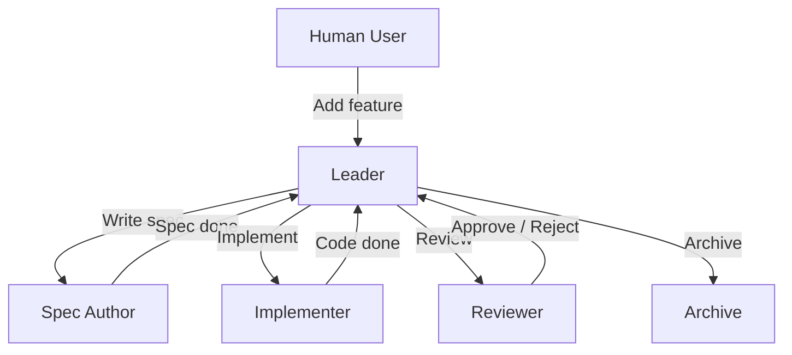
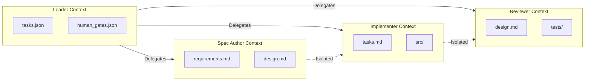
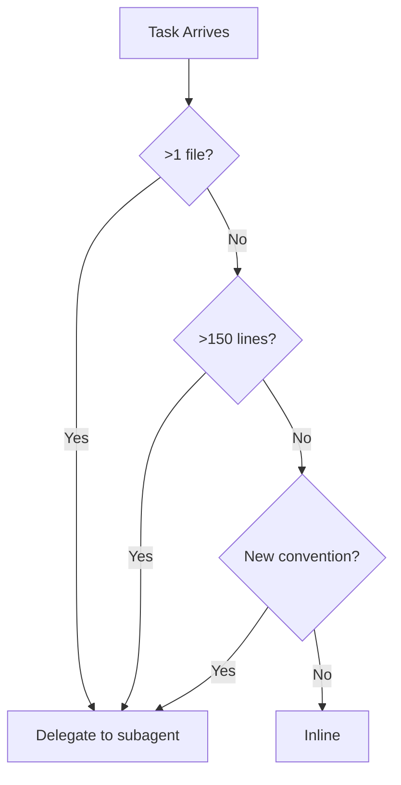

# 🤝 Multi-Agent Orchestration and Roles

## 🎯 Learning Objectives

- Design a four-role agent team (Leader, Spec Author, Implementer, Reviewer) with clear separation of concerns
- Implement context isolation so that each agent operates from curated memory, not full chat history
- Apply delegation heuristics to decide when to inline a task versus spawn a subagent
- Diagnose context leaking between agents and orchestrator bottlenecks
- Connect multi-agent orchestration to your Automated LLM Evaluation Suite

## Introduction

A single agent can write a function. A team of agents can build a system. But teams fail when every member has access to every conversation, when the tech lead also writes code, and when the reviewer has no objective standard to review against. Multi-agent orchestration is the discipline of assigning roles, isolating context, and managing handoffs so that a team of AI agents produces coherent, traceable, and verifiable output.

This note defines the four canonical roles — Leader, Spec Author, Implementer, and Reviewer — and explains why each must have independent external memory. We introduce delegation heuristics: when to inline a task and when to spawn a dedicated subagent. The concepts here build on [[02 - SDD: The Specification-First Workflow]], where the spec author produces the three files that shape the implementer's world, and on [[03 - Agent Loop Architecture: Building the Core]], where each agent runs its own REPL loop. Your Automated LLM Evaluation Suite is a direct application: a judge agent and an executor agent must not share context, or the judge will be biased by the executor's reasoning.

For ML/AI engineers in Medellín, multi-agent orchestration is the scaling factor. One agent is a curiosity. A harnessed team of agents is a production pipeline. This note connects to [[04 - AI Agents y Agentic Systems]] for agentic fundamentals and to [[10 - Cloud, Infra y Backend]] for deploying orchestrated teams.

---

## Module 4: Agent Roles and Orchestration Patterns

### 4.1 Theoretical Foundation 🧠

The case for multi-agent teams comes from a fundamental limit: a single context window cannot hold the requirements, design, implementation, and verification details of a complex feature simultaneously. When you force one agent to do everything, you get the three harness problems in concentrated form. The agent contaminates its own context by mixing spec writing with code writing. It executes unpredictably because it has no clear mode. It produces zero traceability because its reasoning is scattered across a hundred turns.

The Gentle framework solves this by dividing labor into four roles. The **Leader** is the tech lead. It coordinates, decides phase transitions, and delegates. It never writes code. The **Spec Author** translates human intent into machine-readable contracts: `requirements.md`, `design.md`, `tasks.md`. The **Implementer** reads only the curated spec and writes code. It does not see the full chat history, the architecture debates, or the rejected ideas. The **Reviewer** validates the implementation against the spec and the conventions. It has veto power.

Each role has its own external memory. The Leader reads `tasks.json`. The Spec Author writes to `specs/<feature>/`. The Implementer reads from `specs/<feature>/tasks.md` and writes to `src/`. The Reviewer reads from `src/` and `specs/` and writes review cards to `memory/reviews/`. This separation is not bureaucratic; it is the only way to prevent context contamination. When the Implementer does not know about the architecture debate, it cannot be influenced by it. When the Reviewer has no access to the Implementer's draft thoughts, it judges objectively.

Delegation heuristics answer the question: when should the Leader inline a task versus spawn a subagent? Inline when the task is small (< 150 lines), requires no spec, and touches only one file. Delegate when the task crosses module boundaries, requires verification, or introduces new conventions. The threshold is not arbitrary; it is derived from the observation that agents lose coherence when asked to perform multiple modes in one session.

The economic logic is compelling. A single agent working on a complex feature might take 30 minutes and produce code that needs three rounds of revision. A team of agents with clear roles might take 45 minutes total — but produce code that passes review on the first try. The extra time is spent on spec and review; the savings are in rework and debugging. For production systems, first-pass correctness is cheaper than fast failure.

Role boundaries are enforced by the harness, not by trust. When the harness grants the Implementer write access only to `src/` and read access only to `specs/<feature>/`, the agent literally cannot violate the boundary even if it tries. This is the principle of least privilege applied to AI agents. The Leader does not ask the Implementer to be good; the harness makes it impossible for the Implementer to be bad.

### 4.2 Mental Model 📐

The agent org chart with context firewalls:

```
┌─────────────────────────────────────────┐
│           Human User                    │
└─────────────┬───────────────────────────┘
              │
┌─────────────▼───────────────────────────┐
│           Leader                         │
│  ├─ Reads tasks.json                     │
│  ├─ Decides phase transitions            │
│  ├─ Delegates to subagents               │
│  └─ NEVER writes code                     │
└──────┬────────┬────────┬────────────────┘
       │        │        │
┌──────▼──┐  ┌─▼───────┐  ┌─▼──────────┐
│  Spec   │  │Implement│  │  Reviewer    │
│  Author │  │   er    │  │              │
│  writes │  │ reads   │  │ validates    │
│  specs/ │  │ tasks.md│  │ against spec │
│         │  │ writes  │  │ writes review│
│         │  │ src/    │  │ cards        │
└─────────┘  └─────────┘  └──────────────┘
```

Context isolation as memory firewalls:

```
┌─────────────────────────────────────────┐
│  Leader Memory                          │
│  ├─ tasks.json                          │
│  ├─ human_gates.json                    │
│  └─ project_status.md                   │
├─────────────────────────────────────────┤
│  Spec Author Memory                     │
│  ├─ requirements.md (EARS)              │
│  ├─ design.md (tech decisions)          │
│  └─ tasks.md (atomic steps)             │
├─────────────────────────────────────────┤
│  Implementer Memory                     │
│  ├─ tasks.md (curated)                  │
│  ├─ design.md (relevant sections)       │
│  └─ src/ (write only)                   │
├─────────────────────────────────────────┤
│  Reviewer Memory                        │
│  ├─ design.md (acceptance criteria)     │
│  ├─ src/ (read only)                    │
│  └─ tests/ (read only)                  │
└─────────────────────────────────────────┘
```

Delegation decision tree:

```
┌─────────────────────────────────────────┐
│  Task arrives at Leader                 │
└─────────────┬───────────────────────────┘
              │
      ┌───────▼────────┐
      │ Single file?   │
      │ <150 lines?    │
      │ No new conv?   │
      └───────┬────────┘
         Yes  │  No
      ┌───────┘      └───────┐
      ▼                      ▼
┌──────────┐          ┌──────────────┐
│ INLINE   │          │ DELEGATE     │
│ (same    │          │ (spawn sub-  │
│  agent)  │          │  agent)      │
└──────────┘          └──────────────┘
```

### 4.3 Syntax and Semantics 📝

An orchestrator prompt template that enforces role separation. This is the system prompt the Leader uses to decide delegation.

```markdown
# System Prompt: Leader / Orchestrator

## Role
You are the tech lead. You coordinate the SDD workflow. You do NOT write code.

## Memory
- Read `tasks.json` to know current project state.
- Read `human_gates.json` to know which phases are approved.
- Read `harness.json` to know stack and conventions.

## Rules
1. If a task touches >1 file or >150 lines, delegate to a subagent.
2. If a task requires a new spec, delegate to the Spec Author.
3. If a task is a bug fix in a single file, inline to the Implementer.
4. Always record delegation decisions in `memory/decisions.json`.
```

A Python orchestrator that spawns subagents with isolated context. The key is that each subagent receives only the files it needs.

```python
from pathlib import Path
from typing import List, Dict

# WHY: The orchestrator is a function, not a monolithic agent.
def delegate_task(task: str, feature: str, role: str) -> str:
    spec_dir = Path(f"specs/{feature}")
    memory = {
        "leader": ["tasks.json", "human_gates.json"],
        "spec-author": [spec_dir / "requirements.md"],
        "implementer": [spec_dir / "tasks.md", spec_dir / "design.md"],
        "reviewer": [spec_dir / "design.md", "src/", "tests/"],
    }
    # WHY: If role memory is undefined, reject delegation.
    if role not in memory:
        return f"ERROR: Unknown role {role}"
    # WHY: Return the curated file list, not the full chat history.
    return f"Delegated {task} to {role} with files: {memory[role]}"
```

A review card template. Structured output prevents prose drift.

```markdown
<!-- memory/reviews/001-cache-eviction.md -->
# Review Card: LRU Eviction

## Spec Compliance
- [x] `TestLRUEviction` passes
- [x] Only `internal/cache/*` modified
- [ ] p99 latency < 50ms (measured 62ms)

## Architecture Conventions
- [x] Uses `Evictor` interface
- [ ] Missing docstring on `Evict`

## Verdict
REJECT — fix latency and docstring before merge.
```

A Go struct for role configuration. This makes the role definitions machine-readable.

```go
// WHY: Roles are data, not just prompts.
type RoleConfig struct {
    Name           string   `json:"name"`
    CanWriteCode   bool     `json:"can_write_code"`
    CanApprove     bool     `json:"can_approve"`
    MemoryPaths    []string `json:"memory_paths"`
    MaxContextTokens int    `json:"max_context_tokens"`
}
```

A Python dataclass that the orchestrator uses to validate role permissions before delegation.

```python
from dataclasses import dataclass
from typing import List

# WHY: Making roles data-driven lets the harness enforce boundaries.
@dataclass
class RoleConfig:
    name: str
    can_write_code: bool
    can_approve: bool
    memory_paths: List[str]
    max_context_tokens: int = 4000  # default to safe threshold

    # WHY: The orchestrator checks this before every delegation.
    def validate_action(self, action: str, target: str) -> bool:
        if action == "write_code" and not self.can_write_code:
            return False
        if action == "approve" and not self.can_approve:
            return False
        if any(target.startswith(p) for p in self.memory_paths):
            return True
        return False
```

### 4.4 Visual Representation 🖼️

Multi-agent message flow with context isolation:



Context isolation layers:



Delegation heuristics as a decision table:



### 4.5 Application in ML/AI Systems 🤖

Real case: **Automated LLM Evaluation Suite** — Your Python asyncio + Gemma 4 Golden Judge system is a multi-agent orchestration problem. The **Executor Agent** runs the model under test against a dataset. The **Judge Agent** (Gemma 4) scores the outputs against a rubric. The **Leader Agent** coordinates which dataset slice to evaluate next and records results in `tasks.json`. If the Judge and Executor share context, the Judge sees the Executor's reasoning and becomes biased. Context isolation means the Judge receives only the prompt, the response, and the rubric — nothing else.

The Reviewer role in this system is automated: a `reviewer.py` script checks that every evaluation entry has a Judge score, an Executor latency metric, and a traceability log. If any are missing, the Reviewer rejects the batch and sends it back to the Leader for re-evaluation.

In the Multi-Agent Research System, the Leader delegates research queries to the Researcher subagent. The Researcher runs its own inner tool loop with Tavily. The Writer subagent receives only the curated source list, not the raw Tavily JSON. This prevents the Writer from hallucinating citations. The Reviewer subagent validates that every claim in the final report has a corresponding source. Without role separation, the single agent would mix retrieval, writing, and review, producing unreliable research.

For StayBot, the Leader delegates booking logic to the Booking Implementer and notification logic to the Notification Implementer. The Reviewer checks that the Booking Implementer never touches notification code and vice versa. This separation prevents feature creep and keeps the state machine clean.

In the LLM Edge Gateway, the Leader delegates middleware changes to the Middleware Implementer and cache changes to the Cache Implementer. The Reviewer validates that the Middleware Implementer does not modify Redis configuration files. This is critical because a misconfigured `maxmemory-policy` could drop semantic cache entries and break the gateway's latency guarantees.

| ML Use Case | Orchestration Concept | Impact |
|-------------|-----------------------|--------|
| Eval Suite | Context isolation | Judge unbiased by executor reasoning |
| Research System | Delegation heuristic | Researcher spawned only for complex queries |
| StayBot | Leader as tech lead | Booking logic never mixed with notification logic |
| LLM Gateway | Reviewer gate | Every middleware change validated against spec |

### 4.6 Common Pitfalls ⚠️

⚠️ **Context leaking between agents** — Passing the full chat history to a subagent is like giving a juror the defendant's diary. The root cause is convenience: it is easier to forward everything than to curate. The harness must explicitly strip chat history and construct a fresh context for each subagent.
💡 **Mnemonic: "Curate, don't forward."**

⚠️ **Orchestrator becoming a bottleneck** — If the Leader must approve every line change, the team slows to a crawl. The root cause is distrust. The solution is to give the Implementer autonomy within the spec boundaries and to let the Reviewer catch deviations. The Leader should only intervene at phase transitions.
💡 **Mnemonic: "Lead the orchestra, not every instrument."**

⚠️ **Role confusion** — When the Spec Author starts writing code or the Implementer starts changing requirements, the contract breaks. The root cause is unclear role boundaries. The fix is explicit system prompts for each role and automated checks that enforce them.
💡 **Mnemonic: "A role is a contract, not a suggestion."**

### 4.7 Knowledge Check ❓

1. List the four canonical agent roles and state which one writes code.
2. Explain why the Implementer should not see the full chat history.
3. Write a delegation rule: when should the Leader inline versus delegate?
4. Design a review card template for a new RAG retriever feature.
5. What happens if the Judge and Executor share context in the Eval Suite?

---

## 📦 Compression Code

```python
#!/usr/bin/env python3
"""Orchestrator prompt template and delegation logic."""
from pathlib import Path
from typing import List, Dict

LEADER_PROMPT = """
You are the tech lead. You coordinate SDD. You do NOT write code.
Read tasks.json and harness.json before making decisions.
Delegate tasks >150 lines or touching >1 file to subagents.
"""

# WHY: Curated memory prevents context contamination.
ROLE_MEMORY: Dict[str, List[str]] = {
    "leader": ["tasks.json", "human_gates.json", "harness.json"],
    "spec-author": ["specs/{feature}/requirements.md"],
    "implementer": ["specs/{feature}/tasks.md", "specs/{feature}/design.md"],
    "reviewer": ["specs/{feature}/design.md", "src/", "tests/"],
}

def delegate(task: str, feature: str, role: str) -> str:
    files = [f.format(feature=feature) for f in ROLE_MEMORY.get(role, [])]
    if not files:
        return f"ERROR: Unknown role {role}"
    return f"Delegated '{task}' to {role} with files: {files}"

# WHY: Structured review cards replace prose reviews with checklists.
def generate_review_card(feature: str, checks: dict) -> str:
    lines = [f"# Review Card: {feature}", "", "## Spec Compliance"]
    for item, passed in checks.get("spec", {}).items():
        mark = "[x]" if passed else "[ ]"
        lines.append(f"- {mark} {item}")
    lines.append("", "## Architecture Conventions")
    for item, passed in checks.get("architecture", {}).items():
        mark = "[x]" if passed else "[ ]"
        lines.append(f"- {mark} {item}")
    lines.append("", f"## Verdict\n{checks.get('verdict', 'PENDING')}")
    return "\n".join(lines)
```

## 🎯 Documented Project

### Description
A multi-agent orchestration layer for the Automated LLM Evaluation Suite. The system spawns an Executor agent, a Judge agent, and a Reviewer agent, each with isolated context and a structured review card output. The Leader agent records all decisions in `tasks.json` and enforces that no agent operates outside its role boundaries.

### Functional Requirements
- Spawn Executor with dataset slice and model config only
- Spawn Judge with prompt, response, and rubric only
- Spawn Reviewer with scores and acceptance criteria only
- Leader records all decisions in `tasks.json`
- Reject any batch where Judge and Executor share context
- Validate role boundaries via automated check before each delegation

### Main Components
- `orchestrator.py` — Leader delegation logic
- `context_builder.py` — Curates per-agent file lists
- `review_card.py` — Structured review output generator
- `isolation_validator.py` — Detects context leaks between agents
- `role_enforcer.py` — Blocks agents from writing outside their scope

### Success Metrics
- Zero context leaks detected between Judge and Executor
- Leader delegation latency < 100ms per task
- Review card generation is 100% automated
- Batch rejection rate < 5% due to missing review criteria
- Role boundary violations caught 100% before code execution

## 🎯 Key Takeaways

- Four roles: Leader (coordinates), Spec Author (writes spec), Implementer (writes code), Reviewer (validates).
- Each role has independent external memory; context isolation is mandatory.
- The Leader never writes code; separation of concerns prevents bottlenecks.
- Delegate when tasks cross boundaries; inline when they are small and self-contained.
- Review cards replace prose reviews with structured, verifiable checklists.
- Context leaking is the silent killer of multi-agent reliability.
- Your Eval Suite depends on Judge-Executor isolation for objective scoring.
- The orchestrator is a function that curates memory, not a monolithic prompt.
- Role confusion destroys contracts; automated enforcement preserves them.

## References

1. Gentle Framework / Alan Buscalas — "Agent Harness course" (5Q7jV8TpMXA)
2. Fazt Code — "Harness para SDD" (ElGlTv2A_bM) — agent roles and delegation
3. [[02 - SDD: The Specification-First Workflow]] — The spec author role in action
4. [[03 - Agent Loop Architecture: Building the Core]] — Each agent runs its own loop
5. [[05 - External Memory and Context Management]] — How memory isolation works
6. [[04 - AI Agents y Agentic Systems]] — Agentic system fundamentals
