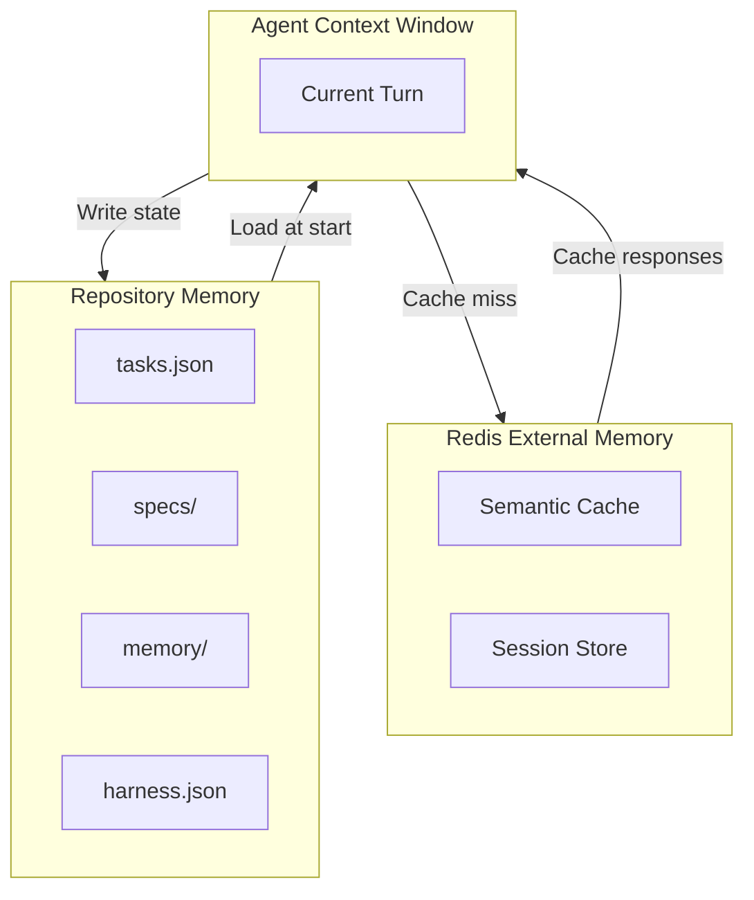
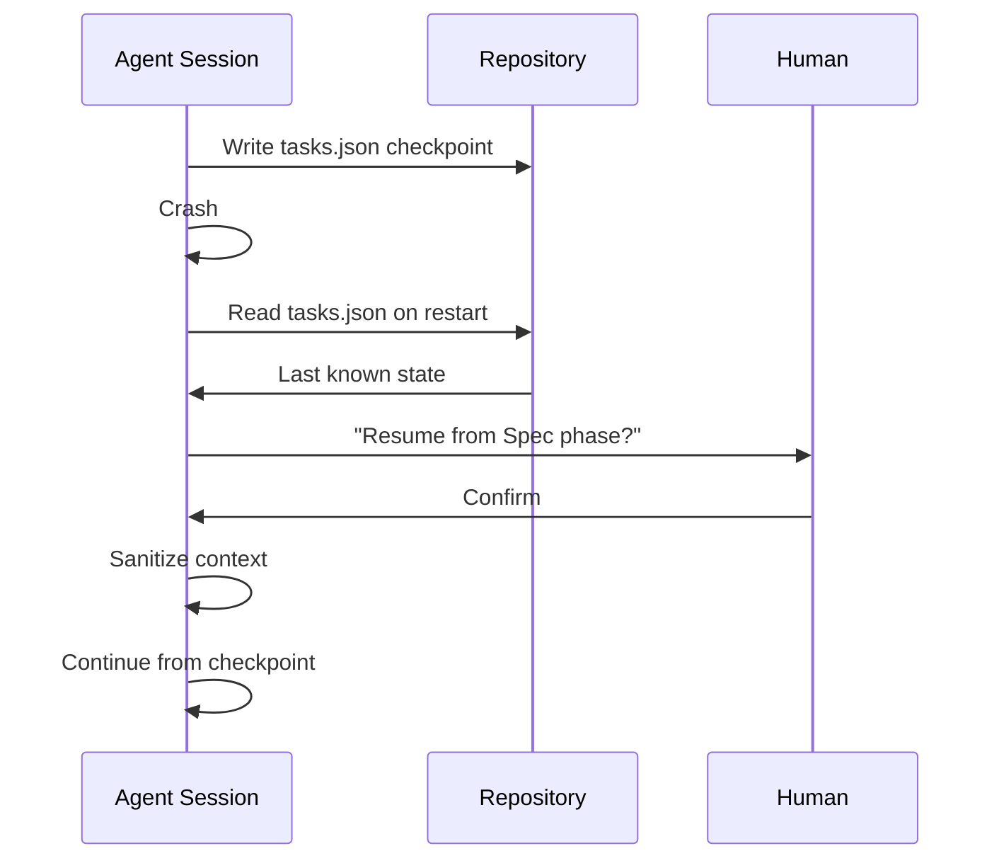
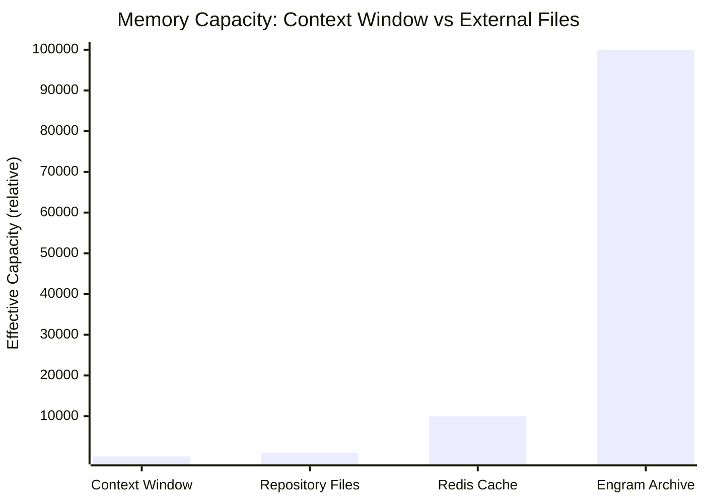

# 🧠 External Memory and Context Management

## 🎯 Learning Objectives

- Quantify context window degradation and its impact on agent output quality
- Design a file-based external memory system that replaces chat history as the source of truth
- Implement `tasks.json` as a project state tracker and session recovery mechanism
- Apply context sanitization between SDD phases to prevent contamination
- Connect external memory to your LLM Edge Gateway's Redis semantic cache

## Introduction

The most expensive real estate in AI engineering is not GPU time; it is the context window. Every token of conversation history, every tool result, and every abandoned idea competes for limited space. When the window fills beyond twenty to forty percent, performance degrades measurably. Agents begin to forget early instructions, mix unrelated decisions, and hallucinate facts. The solution is not a larger model; it is a smaller context. External memory moves the source of truth out of the chat window and into the repository, where it is persistent, searchable, and versioned.

This note explains why the context window is a liability, how to build a file-based memory system, and what to store in `tasks.json`, `memory/decisions.json`, and per-agent spec directories. We introduce the Engram concept for long-term memory persistence and show how session recovery works after a crash. The concepts here are the bedrock of [[01 - Harness Engineering Fundamentals]] and [[02 - SDD: The Specification-First Workflow]], because without external memory, neither harness nor SDD can function. Your LLM Edge Gateway is the perfect application: Redis semantic cache is external memory for model responses, and `tasks.json` is external memory for agent state.

For ML/AI engineers building production systems, external memory is the difference between a demo that works once and a pipeline that works forever. This note connects to [[10 - Cloud, Infra y Backend]] for deploying memory-backed systems and to [[13 - Go Engineering]] for implementing high-performance cache layers.

---

## Module 5: File-Based Memory and Context Sanitization

### 5.1 Theoretical Foundation 🧠

Context window degradation is not a theoretical risk; it is an empirically measured phenomenon. The Vercel D0 team observed that agent performance begins to degrade when the context window reaches twenty to forty percent of capacity. By sixty percent, the agent is effectively guessing. By eighty percent, it is hallucinating. The reason is not mysterious: attention mechanisms dilute across longer sequences, and system instructions — the most important tokens — are pushed toward the middle where they receive less weight.

External memory is the systematic response to this limitation. Instead of asking the agent to remember, you write the memory to a file and ask the agent to read. This has three advantages. First, files survive session crashes; context does not. Second, files can be versioned, diffed, and reviewed; context cannot. Third, files can be curated: the implementer reads only `tasks.md`, not the full debate about why the feature was proposed. The repository becomes the memory system, and the agent becomes a stateless processor.

The Engram concept, introduced in the Gentle framework, extends external memory beyond task tracking. An Engram is a persistent record of decisions, sessions, and learnings. It includes `decisions.json` (why did we choose this architecture?), `sessions/` (what happened in each agent session?), and `learnings.md` (what did we discover that should apply to future specs?). The Engram is not a log file; it is a knowledge base that agents query before starting new work.

Context sanitization is the active process of cleaning the context window before each phase. When the Spec Author finishes, its context is discarded. The Implementer starts with a fresh window containing only the spec files. The Reviewer starts with a fresh window containing only the design and the code. Sanitization is not optional; it is the wall that prevents contaminated context from leaking into the next phase.

Why does this matter for ML/AI systems specifically? Because the systems we build are recursive. A RAG pipeline retrieves documents, summarizes them, and generates answers. An agentic system orchestrates subagents, each with their own context. If the orchestrator's context window degrades, it forgets which subagent is doing what. If the retriever's context degrades, it retrieves the wrong documents. External memory breaks the recursion by giving each component a persistent, external source of truth.

The practical consequence is that your RAG system, your agent orchestrator, and your evaluation suite all share the same memory architecture. `tasks.json` tracks the state of every component. `memory/decisions.json` records why each component was built the way it was. `specs/` stores the contracts between components. This uniformity reduces cognitive load: you do not need a different memory strategy for each subsystem.

### 5.2 Mental Model 📐

The context window as a shrinking workspace:

```
┌─────────────────────────────────────────┐
│  Context Window (100k tokens)           │
│  ┌─────────────────────────────────┐  │
│  │  System Prompt  ████              │  │
│  │  User History   ██████████████    │  │
│  │  Tool Results   ██████████████████│  │
│  │  Available      ░░░░░░░░░░░░░░░░  │  │
│  │  (degraded)                      │  │
│  └─────────────────────────────────┘  │
│  Degradation starts at 20-40% fill      │
└─────────────────────────────────────────┘
```

External memory architecture: files replace context.

```
┌─────────────────────────────────────────┐
│  External Memory Hierarchy               │
│  ├─ tasks.json       ← Project state     │
│  ├─ specs/           ← Feature specs     │
│  ├─ memory/                            │
│  │  ├─ decisions.json ← Why we chose X   │
│  │  ├─ sessions/      ← Per-session logs │
│  │  └─ learnings.md   ← Accumulated wisdom│
│  ├─ agents/          ← Role definitions  │
│  └─ harness.json     ← Stack config      │
└─────────────────────────────────────────┘
```

Context sanitization between phases:

```
┌────────┐    ┌────────┐    ┌────────┐    ┌────────┐    ┌────────┐
│ SPEC   │───→│ SANITIZE│───→│ DESIGN │───→│ SANITIZE│───→│ APPLY  │
│ Context│    │ Window  │    │ Context│    │ Window  │    │ Context│
│ (full) │    │ (flush) │    │ (clean)│    │ (flush) │    │ (clean)│
└────────┘    └────────┘    └────────┘    └────────┘    └────────┘
```

Engram memory as a persistent knowledge base:

```
┌─────────────────────────────────────────┐
│  Engram Memory                          │
│  ├─ decisions.json                      │
│  │  ├─ "2026-05-20: Chose Pydantic v2"  │
│  │  └─ "2026-05-21: Added async routes"  │
│  ├─ sessions/                           │
│  │  ├─ session-001.json                  │
│  │  └─ session-002.json                  │
│  └─ learnings.md                        │
│     ├─ "Avoid ORM for read-heavy paths" │
│     └─ "Cache embeddings for 1 hour"    │
└─────────────────────────────────────────┘
```

### 5.3 Syntax and Semantics 📝

The `tasks.json` schema is the project state tracker. It replaces the agent's memory of what is done and what is next.

```json
{
  "version": "1.0",
  "tasks": [
    {
      "id": "001-cache-eviction",
      "title": "LRU Eviction Policy",
      "status": "spec",
      "feature_dir": "specs/001-cache-eviction",
      "assigned_role": "spec-author",
      "human_approved": false,
      "created_at": "2026-05-25T10:00:00Z",
      "updated_at": "2026-05-25T10:30:00Z"
    }
  ]
}
```

A Python reader that loads `tasks.json` and reports stale tasks. This is the entry point for every agent session.

```python
import json
from datetime import datetime, timedelta
from pathlib import Path

# WHY: Agents must know project state before they act.
def load_tasks(path: str = "tasks.json"):
    data = json.loads(Path(path).read_text())
    return data["tasks"]

# WHY: Stale tasks indicate a crashed session that needs recovery.
def find_stale_tasks(tasks, threshold_hours: int = 24):
    stale = []
    now = datetime.utcnow()
    for task in tasks:
        updated = datetime.fromisoformat(task["updated_at"].replace("Z", "+00:00"))
        if (now - updated) > timedelta(hours=threshold_hours) and task["status"] not in ("verified", "archived"):
            stale.append(task)
    return stale
```

A context sanitization function. This is called by the Leader before delegating to the next phase.

```python
# WHY: Sanitization prevents phase-to-phase contamination.
def sanitize_context(current_phase: str, next_phase: str, chat_history: list) -> list:
    allowed = {
        "spec": ["harness.json", "CLAUDE.md"],
        "design": ["specs/*/requirements.md"],
        "apply": ["specs/*/tasks.md", "specs/*/design.md"],
        "verify": ["src/", "tests/", "specs/*/design.md"],
    }
    # WHY: Return only system prompts and allowed files.
    return [msg for msg in chat_history if msg.get("source") in allowed.get(next_phase, [])]
```

An Engram writer that appends decisions with timestamps. This is the long-term memory that survives session crashes.

```python
import json
from datetime import datetime
from pathlib import Path

# WHY: Decisions must persist beyond any single agent session.
def record_decision(decision: str, rationale: str, path: str = "memory/decisions.json"):
    p = Path(path)
    entries = json.loads(p.read_text()) if p.exists() else []
    entries.append({
        "timestamp": datetime.utcnow().isoformat(),
        "decision": decision,
        "rationale": rationale,
    })
    p.write_text(json.dumps(entries, indent=2))
```

### 5.4 Visual Representation 🖼️

Memory architecture with Redis as external cache:



Session recovery after crash:



Context window vs external memory capacity:



### 5.5 Application in ML/AI Systems 🤖

Real case: **LLM Edge Gateway** — Your Go/Fiber gateway uses Redis as external memory for semantic caching. When a request arrives, the gateway hashes the prompt and queries Redis. If cached, it returns immediately, skipping the upstream LLM call. If not cached, it calls the LLM, stores the response in Redis with a TTL, and returns it. This is external memory in action: the model's previous outputs live outside the model's context window.

The same gateway uses `tasks.json` as external memory for agent-driven feature work. When an agent adds a new middleware, the task status is updated in `tasks.json` before any code is committed. If the agent crashes mid-session, the next agent reads `tasks.json` and resumes from the last checkpoint. Without this, the second agent would have to reconstruct state from Git history and chat logs — an expensive and error-prone process.

In the Automated LLM Evaluation Suite, the Engram stores the evolution of judge rubrics. When the Gemma 4 Golden Judge is replaced by a newer model, the `memory/learnings.md` file tells the next Spec Author which rubric dimensions worked and which did not. This prevents the team from repeating past mistakes.

For the Multi-Agent Research System, `memory/sessions/` stores per-query research contexts. If a user asks a follow-up question two days later, the system loads the previous session, sanitizes it, and appends the new query. The agent does not need to re-research the background; it reads the session file.

For StayBot, external memory means that a booking session interrupted by a server restart can be recovered without data loss. The `tasks.json` entry for the booking workflow contains the current step, the tenant ID, and the last action timestamp. When the service restarts, the orchestrator reads this entry and resumes the workflow from the exact step where it stopped.

| ML Use Case | Memory Concept | Impact |
|-------------|----------------|--------|
| LLM Gateway | Redis semantic cache | Sub-10ms cache hits, reduced upstream costs |
| StayBot | tasks.json recovery | Resume booking workflow after session crash |
| Eval Suite | memory/decisions.json | Judge rubric evolution is tracked across versions |
| Research System | sessions/ directory | Per-query research context is recoverable |

### 5.6 Common Pitfalls ⚠️

⚠️ **Over-relying on chat history** — Treating the conversation as a task list is like using a whiteboard as a filing cabinet. The root cause is habit. Chat feels natural, but it is ephemeral and unsearchable. The fix is to write every decision to a file within three turns of making it.
💡 **Mnemonic: "If it is not in a file, it does not exist."**

⚠️ **Forgetting to externalize decisions** — An agent that decides "we will use Pydantic v2" but does not write it to `harness.json` will cause the next agent to use v1. The root cause is assuming the next agent reads the full chat. It does not. The fix is a `decisions.json` append-only log.
💡 **Mnemonic: "Decay is default; persistence is a choice."**

⚠️ **Sanitizing too aggressively** — Stripping all context between phases can leave the next agent without critical background. The root cause is treating sanitization as deletion rather than curation. The fix is an allow-list, not a block-list: explicitly preserve what the next phase needs.
💡 **Mnemonic: "Curate, don't amnesiate."**

### 5.7 Knowledge Check ❓

1. At what context window fill percentage does degradation typically begin?
2. Write a Python function that appends a decision to `memory/decisions.json` with a timestamp.
3. Explain why `tasks.json` is better than chat history for session recovery.
4. How does Redis semantic cache in the LLM Gateway act as external memory?
5. What is the difference between a log file and an Engram?

---

## 📦 Compression Code

```python
#!/usr/bin/env python3
"""tasks.json reader, stale task detector, context sanitizer, and Engram writer."""
import json
from datetime import datetime, timedelta
from pathlib import Path

def load_tasks(path: str = "tasks.json") -> list:
    return json.loads(Path(path).read_text())["tasks"]

def find_stale(tasks: list, hours: int = 24) -> list:
    now = datetime.utcnow()
    stale = []
    for t in tasks:
        updated = datetime.fromisoformat(t["updated_at"].replace("Z", "+00:00"))
        if (now - updated) > timedelta(hours=hours) and t["status"] not in ("verified", "archived"):
            stale.append(t)
    return stale

def append_decision(decision: str, rationale: str, path: str = "memory/decisions.json"):
    p = Path(path)
    data = json.loads(p.read_text()) if p.exists() else []
    data.append({"decision": decision, "rationale": rationale, "timestamp": datetime.utcnow().isoformat()})
    p.write_text(json.dumps(data, indent=2))

def sanitize(chat: list, allowed: list) -> list:
    return [msg for msg in chat if msg.get("source") in allowed]

# WHY: Engrams are queried before new specs to avoid repeated mistakes.
def query_engram(query: str, path: str = "memory/learnings.md") -> list:
    p = Path(path)
    if not p.exists():
        return []
    lines = p.read_text().splitlines()
    return [line for line in lines if query.lower() in line.lower()]

# WHY: Session recovery rebuilds context from files, not chat history.
def recover_session(tasks_path: str = "tasks.json", memory_dir: str = "memory/sessions") -> dict:
    tasks = load_tasks(tasks_path)
    stale = find_stale(tasks, hours=0)  # any non-archived task
    if not stale:
        return {"status": "clean", "resume_from": None}
    latest = max(stale, key=lambda t: t["updated_at"])
    session_file = Path(memory_dir) / f"{latest['id']}.json"
    context = json.loads(session_file.read_text()) if session_file.exists() else {}
    return {
        "status": "recovered",
        "resume_from": latest["status"],
        "feature_dir": latest["feature_dir"],
        "context": context,
    }
```

## 🎯 Documented Project

### Description
An external memory system for the LLM Edge Gateway that uses Redis for semantic caching and `tasks.json` for agent session state. The system guarantees that no agent session loses progress on crash and that cache hits never rely on model context windows. The Engram stores long-term learnings that inform future spec writing.

### Functional Requirements
- Hash incoming prompts and query Redis for semantic matches
- Store LLM responses in Redis with configurable TTL
- Update `tasks.json` atomically after every agent phase completion
- Detect stale tasks (>24h) and flag them for human review
- Append every architectural decision to `memory/decisions.json`
- Sanitize agent context between phases using an allow-list
- Query Engram before starting a new spec to avoid repeated mistakes

### Main Components
- `redis_cache.go` — Semantic cache with vector similarity
- `tasks_manager.py` — CRUD operations for `tasks.json`
- `decision_logger.py` — Append-only decision recorder
- `context_sanitizer.py` — Phase-to-phase context filter
- `session_recovery.sh` — Crash recovery script that reads last checkpoint
- `engram_query.py` — Pre-spec knowledge retrieval from `memory/learnings.md`

### Success Metrics
- Cache hit rate > 80% for repeated prompts
- Zero task state loss across 100 simulated session crashes
- Decision log grows by < 1MB per month
- Context sanitization removes > 90% of irrelevant tokens between phases
- Engram queries prevent > 50% of previously-discovered mistakes

## 🎯 Key Takeaways

- Context window degradation begins at 20–40% fill; external memory is mandatory.
- The repository is the memory system: `tasks.json`, `specs/`, and `memory/` replace chat history.
- Engram memory (decisions, sessions, learnings) survives crashes and informs future work.
- Context sanitization between phases is the wall that prevents contamination.
- Redis semantic cache in the LLM Gateway is external memory for model outputs.
- Session recovery reads `tasks.json`, not chat logs, to resume after crashes.
- "If it is not in a file, it does not exist" is the mantra of harnessed development.
- Your portfolio projects need external memory to scale from demo to production.
- Sanitization is curation, not amnesia; preserve what the next phase needs.

## References

1. Vercel D0 — Context degradation at 20-40% (q9Vaoz0hd0U)
2. Gentle Framework / Alan Buscalas — Engram memory and session recovery (5Q7jV8TpMXA)
3. [[01 - Harness Engineering Fundamentals]] — Repository-as-harness principle
4. [[02 - SDD: The Specification-First Workflow]] — Spec directories as persistent artifacts
5. [[03 - Agent Loop Architecture: Building the Core]] — Stateless loops need external memory
6. [[04 - Multi-Agent Orchestration and Roles]] — Per-agent memory isolation
7. [[13 - Go Engineering]] — Go implementation of Redis cache layer
