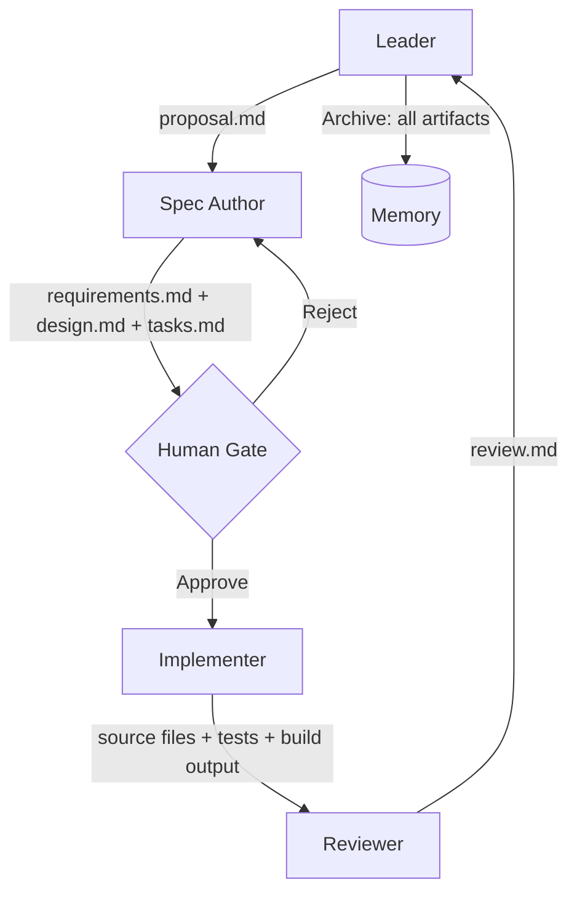
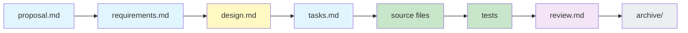

# 05 — Multi-Agent Orchestration and End-to-End Workflow

**Core thesis:** The complete system in motion. Harness + SDD + file architecture working together dynamically. This is where the pieces become a machine.

---

## Agent Roles as Runtime

Each agent is a runtime persona with a defined I/O contract. The contracts are validated at phase boundaries — if an agent produces invalid output, the next agent refuses to consume it.



| Agent | Inputs | Outputs | Validated At |
|-------|--------|---------|------------|
| **Leader** | `tasks.json`, user request | `proposal.md`, spawned subagents | Init phase |
| **Spec Author** | `proposal.md` | `requirements.md`, `design.md`, `tasks.md` | **Human Gate** ⚠️ |
| **Implementer** | `tasks.md`, `design.md`, source files | Modified code, tests, build output | Verify phase |
| **Reviewer** | Modified code, `design.md`, `tasks.md`, test output | `review.md` (pass/fail + findings) | Archive phase |

> ⚠️ Notice: the Implementer receives ONLY `tasks.md` + `design.md` + source files. It never sees the proposal, the alternative approaches considered, or the reviewer's thoughts from previous cycles. Context isolation is enforced by the harness at spawn time.

---

## Context Isolation Protocol

This is the most critical orchestration rule:

```
Spec Author context = proposal.md + codebase (for exploration)
Implementer context = tasks.md + design.md + listed source files ONLY
Reviewer context  = modified code + design.md + tasks.md + test results
```

**Information MUST be written down in artifacts, not passed through chat.** The Spec Author's internal reasoning about why Alternative B was rejected stays in the Spec Author's session — unless it's written to `design.md`. If it's not in `design.md`, the Implementer cannot know it, cannot use it, and should not care.

> ¡Sorpresa! The orchestrator is NOT an AI agent. It's a deterministic script reading `tasks.json`. AI is only in the subagents doing creative work — the Leader routes, but the Orchestrator enforces.

---

## Traceability Chain

Every link in the chain is a FILE. Walk forward to understand what was built. Walk backward to understand why.



| Link | Answers | Who reads it? |
|------|---------|---------------|
| `proposal.md` | What problem? What scope? | Spec Author, human reviewers |
| `requirements.md` | What MUST the system do? | Spec Author (for design), Reviewer (for validation) |
| `design.md` | HOW and WHERE? Which files? Why this approach? | **HUMAN GATE**, Implementer, Reviewer |
| `tasks.md` | What are the atomic implementation steps? | Implementer |
| Source files | The code that satisfies the design | Reviewer, future developers |
| `review.md` | Did implementation match design? | Human, Leader (for archive decision) |
| `archive/` | Complete record for auditing and learning | Future agents, post-mortem analysis |

---

## End-to-End Walkthrough: "Add OAuth2 to LLM Gateway"

### Phase 1: Init → Proposal

**Input:** Human request: "The LLM Edge Gateway needs OAuth2 authentication with Google and GitHub support."

**Leader agent spawns Spec Author with:** `tasks.json` entry, codebase structure overview (NOT full codebase).

**Output:** `proposal.md`
```markdown
# Proposal: Add OAuth2 Authentication

## Problem
LLM Gateway currently has no authentication. Any request reaches any model endpoint.

## Scope
- OAuth2 flow with Google and GitHub providers
- Token validation middleware
- Configuration for provider credentials

## Affected Areas
- `src/gateway/middleware.py` — new auth middleware
- `src/auth/` — new directory for OAuth2 logic
- `config/` — provider configuration
- `tests/auth/` — new test suite

## Out of Scope
- Rate limiting (existing system unaffected)
- User management UI
- Session management beyond token validation
```

### Phase 2: Spec → Design

**Spec Author** reads `proposal.md`, explores codebase, produces three files.

**`requirements.md`:**
```markdown
WHEN a request lacks an Authorization header THEN Gateway SHALL return HTTP 401.
WHEN a valid token is presented THEN Gateway SHALL extract user identity and forward request.
WHILE a token is expired THE Gateway SHALL return HTTP 401 with token_expired error code.
THE Gateway SHALL support Google OAuth2 and GitHub OAuth2 as identity providers.
IF provider config is missing THEN THE Gateway SHALL refuse to start with a clear error message.
```

**`design.md`:**
```markdown
## Files
- `src/auth/__init__.py` (NEW)
- `src/auth/base.py` (NEW) — OAuth2Provider ABC
- `src/auth/google.py` (NEW) — Google implementation
- `src/auth/github.py` (NEW) — GitHub implementation
- `src/auth/factory.py` (NEW) — ProviderFactory
- `src/gateway/middleware.py:42` — Inject auth middleware before rate limiter
- `config/providers.yaml` (NEW) — Provider configs

## Approach
Factory + Strategy. ProviderFactory reads providers.yaml, builds provider instances.
Middleware calls provider.validate(token). On success: inject user context. On failure: 401.
```

**`tasks.md`:**
```markdown
1. Create `src/auth/__init__.py` and `src/auth/base.py` with OAuth2Provider ABC.
2. Create `config/providers.yaml` with Google and GitHub stanzas.
3. Implement `src/auth/google.py` with Google token validation.
4. Implement `src/auth/github.py` with GitHub token validation.
5. Implement `src/auth/factory.py` with ProviderFactory.
6. Inject auth middleware into `src/gateway/middleware.py` before rate limiter.
7. Write tests in `tests/auth/` covering valid token, expired token, missing header, bad config.
```

### Phase 3: Human Gate

Human reviews `design.md`. Checks:
- Are the right files being modified? ✅
- Is middleware the right approach? ✅ (vs. decorators — rejected in alternatives)
- Are 7 tasks atomic and ordered correctly? ✅

**Human approves.** `tasks.json` updated: `"human_gate_approved": true`, `status: "active"`, `assignee: "implementer"`.

### Phase 4: Apply

**Implementer is spawned.** Context contains ONLY:
- `tasks.md`
- `design.md`
- Source files listed in `design.md` (pre-populated context)

The Implementer does NOT see the proposal, the requirements, or any abandoned alternatives. It executes task by task, writing code and tests.

### Phase 5: Verify

**Reviewer is spawned.** Context contains:
- Modified source files (diff against baseline)
- `design.md` (expected behavior)
- `tasks.md` (expected completion)
- Test output (pass/fail/coverage)

**`review.md`:**
```markdown
# Review: Add OAuth2 Authentication

## Pass/Fail: PASS

## Task Completion
- [x] Task 1: ABC defined correctly
- [x] Task 2: Config with both providers
- [x] Task 3: Google provider validates tokens
- [x] Task 4: GitHub provider validates tokens
- [x] Task 5: Factory builds correct provider
- [x] Task 6: Middleware injected at correct position
- [x] Task 7: Test coverage 92%

## Issues: None

## Recommendation: APPROVE
```

### Phase 6: Archive

All artifacts copied to `memory/sessions/2026-05-29-oauth2/`. `tasks.json` updated: `status: "archived"`. Feature complete. Traceability chain preserved forever.

---

## The Orchestrator: Not AI, Pure State Machine

> ¡Sorpresa! The orchestrator is NOT an AI agent. It's a deterministic script reading `tasks.json`. AI is only in subagents doing creative work.

The Gentle framework's orchestrator exemplifies this: YAML + bash. Zero intelligence. Pure state machine.

```
pseudocode:
  while tasks.json has tasks with status != "archived":
      for each task in ready state:
          if task.dependencies are satisfied:
              spawn subagent(task.assignee, curated_context(task))
              wait for completion
              validate output against task spec
              advance task.phase
              update tasks.json
```

The Orchestrator enforces:
1. Dependencies (Task B cannot start until Task A completes)
2. Phase transitions (cannot skip from proposal to apply)
3. Parallel limits (max 5 subagents at once)
4. Gate checks (human approval required at spec and design)
5. Artifact validation (output files must exist and parse)

---

## ❌/✅ Side by Side

❌ **Antipattern: Unorchestrated parallel agents**
```python
# Three subagents spawned simultaneously on same feature
# Agent 1 modifies auth.py
# Agent 2 modifies auth.py  # MERGE CONFLICT
# Agent 3 reads auth.py before Agent 1 wrote — based on STALE data
# Result: merge hell, lost changes, contradictory implementations
# Traceability: none — which agent decided what?
```

✅ **Pattern: Sequential SDD orchestration**
```python
# Phase 1: Spec Author (single) → writes requirements.md, design.md, tasks.md
# Phase 2: Human gate → approves design.md
# Phase 3: Implementer (single) → executes tasks.md sequentially
#   - Task 1 (auth ABC) must complete before Task 2 (Google)
#   - Tasks 2, 3, 4, 5 can run in sub-steps but all within ONE implementer session
# Phase 4: Reviewer (single) → validates against design.md
# Result: zero conflicts, complete traceability, auditable decisions
```

---

## Caso Real: Gentle Framework's Orchestrator

The Gentle framework's orchestrator is YAML + bash — a pure state machine:

```yaml
# harness.yaml (simplified)
orchestrator:
  engine: sequential
  max_parallel: 3
phases:
  - name: spec
    agent: spec-author
    gate: human
  - name: implement
    agent: implementer
    depends_on: [spec]
    context: [tasks.md, design.md]
  - name: review
    agent: reviewer
    depends_on: [implement]
    context: [diff, design.md, tasks.md]
```

The orchestrator reads this YAML, spawns subagents in order, validates outputs, advances state. **It has zero intelligence.** It doesn't "understand" code. It doesn't "decide" anything. It enforces rules, isolates context, and records state transitions.

This is the key insight: the creative work is in the subagents (AI). The control work is in the orchestrator (deterministic). Separation of concerns at the architectural level.


> *Like a conductor, the orchestrator doesn't play an instrument — it ensures every section enters at the right moment, with the right context, producing a coherent whole.*

---

## Código de Compresión

```python
"""Orchestrator state machine as Python dataclasses."""
from __future__ import annotations
from dataclasses import dataclass, field
from enum import Enum
from typing import Optional, Callable
import json
import time
from pathlib import Path


class Phase(str, Enum):
    PROPOSAL = "proposal"
    SPEC = "spec"
    DESIGN = "design"
    TASKS = "tasks"
    APPLY = "apply"
    VERIFY = "verify"
    ARCHIVE = "archive"


class Status(str, Enum):
    PENDING = "pending"
    ACTIVE = "active"
    BLOCKED = "blocked"
    DONE = "done"
    ARCHIVED = "archived"


PHASE_ORDER = list(Phase)


@dataclass
class Task:
    id: str
    title: str
    phase: Phase = Phase.PROPOSAL
    status: Status = Status.PENDING
    assignee: str = "spec-author"
    dependencies: list[str] = field(default_factory=list)
    human_gate_approved: bool = False
    artifacts: dict[str, str] = field(default_factory=dict)


@dataclass
class Orchestrator:
    tasks: dict[str, Task] = field(default_factory=dict)
    max_parallel: int = 5
    active_count: int = 0
    spawn_fn: Optional[Callable] = None  # injected for testability

    def add_task(self, task_id: str, title: str) -> Orchestrator:
        self.tasks[task_id] = Task(id=task_id, title=title)
        return self

    def can_transition(self, task: Task, next_phase: Phase) -> bool:
        current_idx = PHASE_ORDER.index(task.phase)
        next_idx = PHASE_ORDER.index(next_phase)
        return next_idx == current_idx + 1

    def advance(self, task_id: str) -> bool:
        task = self.tasks[task_id]
        current_idx = PHASE_ORDER.index(task.phase)
        if current_idx + 1 >= len(PHASE_ORDER):
            return False  # already at final phase
        next_phase = PHASE_ORDER[current_idx + 1]

        # Human gate at SPEC and DESIGN
        if next_phase == Phase.DESIGN and not task.human_gate_approved:
            print(f"  [GATE] {task_id}: Design requires human approval")
            return False

        deps_ready = all(
            self.tasks[d].status == Status.DONE for d in task.dependencies
        )
        if not deps_ready:
            return False

        if self.active_count >= self.max_parallel:
            return False

        task.phase = next_phase
        task.status = Status.ACTIVE

        if self.spawn_fn:
            self.spawn_fn(task_id, task)  # ¡Sorpresa! spawn_fn, not AI reasoning
            self.active_count += 1
        return True

    def complete(self, task_id: str) -> bool:
        task = self.tasks[task_id]
        task.status = Status.DONE
        self.active_count -= 1
        if task.phase == Phase.VERIFY:
            task.status = Status.ARCHIVED
        return True

    def state(self) -> dict:
        return {
            "total": len(self.tasks),
            "by_status": {s.value: sum(1 for t in self.tasks.values()
                           if t.status == s) for s in Status},
            "by_phase": {p.value: sum(1 for t in self.tasks.values()
                          if t.phase == p) for p in Phase},
            "active": self.active_count,
            "max_parallel": self.max_parallel,
        }


# Usage demo
if __name__ == "__main__":
    orch = Orchestrator()
    orch.add_task("t-001", "Add OAuth2 to LLM Gateway")

    # Walk through phases
    for phase in PHASE_ORDER[1:]:
        task = orch.tasks["t-001"]
        orch.advance("t-001")
        if phase == Phase.DESIGN:
            orch.tasks["t-001"].human_gate_approved = True
            print(f"  [HUMAN GATE] Approved: {task.title}")
            orch.advance("t-001")

    printed = False
    for phase in list(Phase):
        task = orch.tasks["t-001"]
        if not printed and phase.value == orch.tasks["t-001"].phase.value:
            print(f"\n{orch.tasks['t-001'].title}: {task.phase.value}/{task.status.value}")
            orch.complete("t-001")
            printed = True
        elif not printed:
            continue
        else:
            orch.advance("t-001")
            orch.complete("t-001")

    print(f"\nFinal state: {json.dumps(orch.state(), indent=2)}")
```

---

## The Complete Picture

```
Context Engineering (01) → Controls the MEDIUM (token budget, degradation, contamination)
    ↓
Harness Engineering (02) → Controls the STRUCTURE (onion layers, agent roles, file conventions)
    ↓
SDD (03) → Controls the PROTOCOL (DAG phases, EARS specs, human gates)
    ↓
File Architecture (04) → Controls the LAYOUT (where files live, agent definitions, memory)
    ↓
Orchestration (05) → Controls the MOTION (task routing, context isolation, state transitions)
```

**You now have the full stack.** The remaining question is execution:

1. Pick a project you're actively working on
2. Run the scaffold generator from Note 04
3. Pick ONE feature and run the full SDD cycle
4. Iterate — add agents, skills, memory only when you feel pain

---

[[01 - Context Engineering - The Physics of AI Attention]] | [[02 - Harness Engineering - Directing AI Force]] | [[03 - Specification-Driven Development - The Workflow Inside the Harness]] | [[04 - File Architecture - Organizing Harness Infrastructure]] | [[05 - Multi-Agent Orchestration and End-to-End Workflow]]
