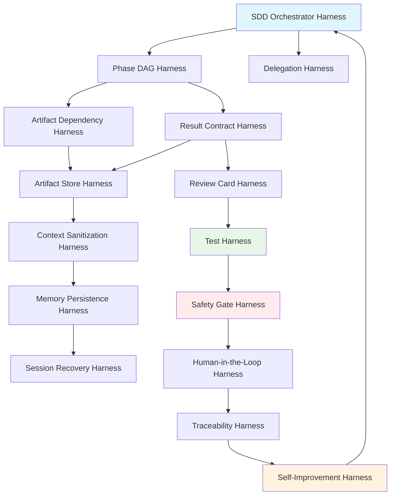
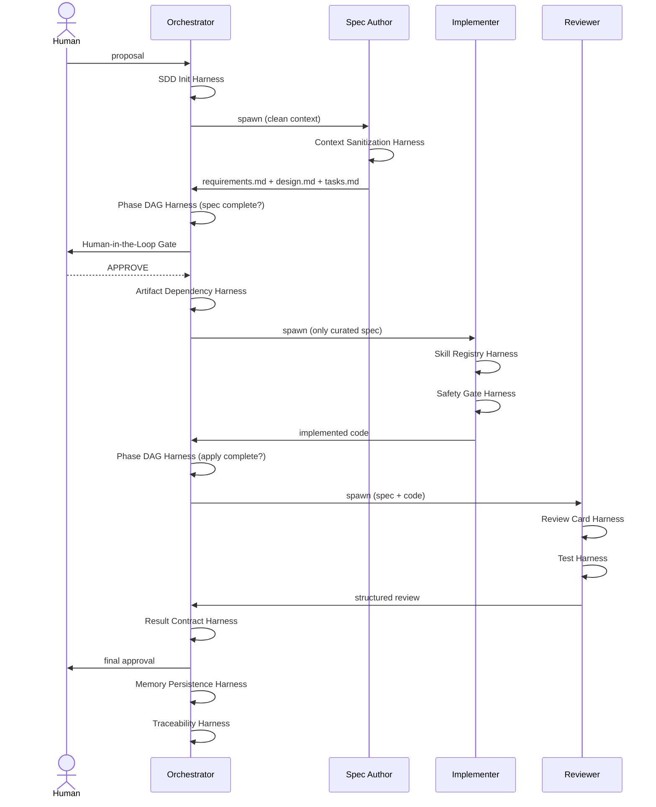

# 🔗 The 20 Harnesses: Phase Control and Contracts

## 🎯 Learning Objectives

- Master the complete Gentle framework of 20 harnesses and their individual responsibilities
- Understand how phase control prevents context contamination and enforces strict SDD gating
- Design result contracts that replace prose handoffs with structured, verifiable artifacts
- Build harness interaction matrices that map dependencies between control layers
- Apply the 20-harness mental model to diagnose missing controls in real AI engineering workflows

## Introduction

When you delegate a complex feature to an AI agent, you are not merely asking for code generation. You are initiating a multi-phase workflow that touches requirements, architecture, implementation, verification, and archival. Without systematic control, each phase bleeds into the next, corrupting context and producing unpredictable results. The 20 Harnesses framework, introduced by Alan Buscalas in the Gentle system, provides a complete control lattice for AI-assisted software engineering. It does not replace the agent's intelligence; it gives direction, much like traffic signals do not replace drivers but prevent collisions.

This note connects directly to [[05 - External Memory and Context Management]], where we externalized state into files. The 20 harnesses are the *rules* that govern how those files are produced, validated, and handed off between phases. They also extend [[04 - Multi-Agent Orchestration and Roles]] by defining the control mechanisms that keep the Leader, Spec Author, Implementer, and Reviewer from interfering with one another. For ML/AI engineers in Medellín building systems like StayBot or the Multi-Agent Research System, these harnesses are the difference between a demo that works once and a production pipeline that works every time.

---

## Module 6: The Gentle Framework's 20 Harnesses

### 6.1 Theoretical Foundation 🧠

The 20 Harnesses emerged from a simple observation: monolithic AI conversations scale poorly. When a single chat session handles requirements, design, coding, and debugging, the context window becomes a toxic soup of abandoned ideas, partial implementations, and contradictory instructions. Alan Buscalas formalized the Gentle framework to solve this by treating the AI development workflow as a distributed system requiring control planes, data planes, and governance planes.

Historically, software engineering evolved from waterfall (heavy upfront specs) to agile (lightweight stories) to AI-era SDD (machine-readable, agent-executable specifications). Each transition reduced human overhead but increased the need for automated discipline. The 20 harnesses are that discipline. They are not 20 separate tools you install; they are 20 *responsibilities* that your repository structure, agent prompts, and automation scripts must fulfill. A harness can be a file, a prompt, a script, or a convention. What matters is that the responsibility is owned explicitly.

The framework groups harnesses into five control planes: **Orchestration** (who does what), **Artifact Management** (where state lives), **Execution Control** (when things happen), **Safety & Quality** (what is allowed), and **Optimization** (how to improve). Understanding these planes allows you to diagnose which control is missing when an agent goes off-script. For example, if your Implementer starts writing code before a spec is approved, your **Phase DAG Harness** is broken, not your agent.

### 6.2 Mental Model 📐

The harness stack visualizes control planes as layers, each depending on the one below:

```
┌─────────────────────────────────────────────┐
│  Optimization Plane                         │
│  ├─ Model Routing Harness                   │
│  ├─ Tool Minimalism Harness                 │
│  └─ Self-Improvement Harness                │
├─────────────────────────────────────────────┤
│  Safety & Quality Plane                     │
│  ├─ Safety Gate Harness                     │
│  ├─ Test Harness                            │
│  ├─ Review Card Harness                     │
│  └─ Traceability Harness                    │
├─────────────────────────────────────────────┤
│  Execution Control Plane                    │
│  ├─ Execution Mode Harness                  │
│  ├─ Human-in-the-Loop Harness               │
│  └─ Session Recovery Harness                │
├─────────────────────────────────────────────┤
│  Artifact Management Plane                  │
│  ├─ Artifact Store Harness                  │
│  ├─ Artifact Dependency Harness             │
│  ├─ Result Contract Harness                 │
│  ├─ Context Sanitization Harness            │
│  └─ Memory Persistence Harness            │
├─────────────────────────────────────────────┤
│  Orchestration Plane                        │
│  ├─ SDD Orchestrator Harness                │
│  ├─ Delegation Harness                      │
│  ├─ SDD Init Harness                        │
│  ├─ Phase DAG Harness                       │
│  └─ Skill Registry Harness                  │
└─────────────────────────────────────────────┘
```

The phase gate control shows how strict ordering prevents contamination:

```
┌────────┐    ┌────────┐    ┌────────┐    ┌────────┐    ┌────────┐
│  INIT  │───→│ SPEC   │───→│ DESIGN │───→│ APPLY  │───→│ VERIFY │
└────────┘    └───┬────┘    └────────┘    └────────┘    └────┬───┘
                  │                                          │
            HUMAN APPROVAL                              REVIEW CARD
            GATE (locked)                               GATE (locked)
```

The harness interaction matrix maps which harnesses protect which transitions:

```
┌─────────────────┬──────────┬─────────────┬──────────────┬─────────────┐
│ Harness         │ Init→Spec│ Spec→Design │ Design→Apply│ Apply→Verify│
├─────────────────┼──────────┼─────────────┼──────────────┼─────────────┤
│ Phase DAG       │    ✓     │      ✓      │       ✓      │      ✓      │
│ Result Contract │          │      ✓      │       ✓      │      ✓      │
│ Context Sanitize│    ✓     │      ✓      │       ✓      │      ✓      │
│ Artifact Dep    │          │             │       ✓      │             │
│ Human-in-Loop   │          │      ✓      │              │             │
│ Review Card     │          │             │              │      ✓      │
└─────────────────┴──────────┴─────────────┴──────────────┴─────────────┘
```

### 6.3 Syntax and Semantics 📝

A harness configuration file declares each responsibility explicitly. The orchestrator reads this manifest before spawning any subagent, ensuring every control plane is active.

```yaml
# harness-manifest.yaml
# WHY: This single file is the source of truth for all 20 harnesses.
#      The orchestrator validates it before starting any SDD phase.

harness_version: "gentle-v1.0"
project: "ml-backend-service"

orchestration:
  sdd_orchestrator:
    role: "leader"              # WHY: Only the leader decides phase transitions
    executes_code: false        # WHY: Leaders coordinate; they do not write code
    max_subagents: 4
  delegation:
    threshold_lines: 150        # WHY: Tasks >150 lines get a dedicated subagent
    inline_tools: ["read_file", "grep"]
  init:
    required_checks:            # WHY: Project must be calibrated before SDD begins
      - "detect_stack"
      - "verify_test_command"
      - "load_conventions"
  phase_dag:
    strict: true                # WHY: No skipping phases under any circumstance
    phases: ["init", "proposal", "spec", "design", "tasks", "apply", "verify", "archive"]
  skill_registry:
    auto_discover: true         # WHY: Agents must know what skills exist before using them
    path: ".ai/skills"

artifact_management:
  artifact_store:
    backend: "repo"             # WHY: Repository is the harness; files live in git
    specs_path: "specs/"
  artifact_dependency:
    design_requires: ["specs/*/requirements.md"]
    apply_requires: ["specs/*/design.md", "specs/*/tasks.md"]
  result_contract:
    format: "json"              # WHY: Structured handoffs are parseable and verifiable
    required_fields: ["phase", "status", "artifacts", "next_phase_ready"]
  context_sanitization:
    strip_chat_history: true      # WHY: Each phase starts with a clean context window
    preserve_files: ["CLAUDE.md", "agents.md"]
  memory_persistence:
    backend: "engram"           # WHY: Decisions and learnings survive session crashes
    sessions_path: ".ai/memory/sessions"

execution_control:
  execution_mode:
    default: "interactive"      # WHY: Human gates at spec and design prevent expensive rework
    auto_approve_phases: ["tasks", "apply"]
  human_in_the_loop:
    gates: ["spec", "design"]
    timeout_minutes: 60
  session_recovery:
    checkpoint_interval: 5        # WHY: Resume from crash without losing progress
    resume_from_last_phase: true

safety_and_quality:
  safety_gate:
    blocked_commands: ["rm -rf /", "DROP TABLE", "docker system prune"]
    require_confirmation: ["git push", "kubectl delete"]
  test_harness:
    strategy: "tdd"             # WHY: Red → Green → Refactor enforces proof over claims
    test_command: "pytest"
    coverage_threshold: 80
  review_card:
    template: ".ai/templates/review-card.md"
    categories: ["correctness", "performance", "security", "maintainability"]
  traceability:
    log_decisions: true           # WHY: Every choice must be auditable
    log_file: ".ai/logs/decisions.jsonl"

optimization:
  model_routing:
    spec_phase: "claude-sonnet"   # WHY: Cheap model for design; strong model for code
    apply_phase: "claude-opus"
    verify_phase: "claude-sonnet"
  tool_minimalism:
    prefer_unix: true             # WHY: grep, cat, ls are 3x faster than specialized wrappers
    allowed_tools: ["bash", "read_file", "write_file", "grep", "ls"]
  self_improvement:
    detect_patterns: ["test_failure", "spec_rejection", "review_rejection"]
    update_harness_on_failure: true
```

The orchestrator validates the manifest before every SDD session. If any harness is misconfigured, the session aborts immediately, preventing polluted downstream phases.

```python
# validate_harness.py
# WHY: Loading a broken harness is worse than having no harness at all.

import yaml
import json
from pathlib import Path
from typing import List, Dict, Any

REQUIRED_HARNESSES = [
    "sdd_orchestrator", "delegation", "sdd_init",
    "phase_dag", "artifact_store", "result_contract",
    "context_sanitization", "test_harness", "review_card",
    "human_in_the_loop", "traceability"
]

def load_manifest(path: str = ".ai/harness-manifest.yaml") -> Dict[str, Any]:
    # WHY: Explicit encoding avoids silent corruption on multi-language systems
    with open(path, "r", encoding="utf-8") as f:
        return yaml.safe_load(f)

def validate_manifest(manifest: Dict[str, Any]) -> List[str]:
    # WHY: We collect ALL errors before failing, so the user can fix them in one pass
    errors = []
    
    # Validate orchestration plane
    orch = manifest.get("orchestration", {})
    for harness in ["sdd_orchestrator", "phase_dag", "delegation"]:
        if harness not in orch:
            errors.append(f"Missing orchestration harness: {harness}")
    
    # WHY: The orchestrator MUST NOT execute code; that is the implementer's job
    if orch.get("sdd_orchestrator", {}).get("executes_code", True):
        errors.append("sdd_orchestrator.executes_code must be false")
    
    # Validate artifact management
    art = manifest.get("artifact_management", {})
    if "result_contract" not in art:
        errors.append("Missing result_contract harness")
    
    contract = art.get("result_contract", {})
    if contract.get("format") != "json":
        errors.append("result_contract.format must be 'json' for machine parsing")
    
    # Validate safety
    safety = manifest.get("safety_and_quality", {})
    if "safety_gate" not in safety:
        errors.append("safety_gate is mandatory")
    
    return errors

if __name__ == "__main__":
    m = load_manifest()
    errs = validate_manifest(m)
    if errs:
        print(json.dumps({"valid": False, "errors": errs}, indent=2))
        exit(1)
    print(json.dumps({"valid": True, "harnesses_active": len(REQUIRED_HARNESSES)}, indent=2))
```

### 6.4 Visual Representation 🖼️

The harness dependency diagram shows how lower planes enable upper planes:



The SDD phase flow with harness checkpoints shows where each harness activates:



### 6.5 Application in ML/AI Systems 🤖

Real case: StayBot (Medellín property management multi-agent system) suffered from context contamination during feature implementation. When the Spec Author wrote requirements for a "booking conflict detector," the Implementer later mixed those requirements with an unrelated "payment retry" conversation because both existed in the same chat thread. After applying the 20 Harnesses, particularly the **Context Sanitization Harness** (fresh context per phase) and **Phase DAG Harness** (no skipping), feature accuracy increased and review cycles dropped by half.

| ML Use Case                    | This Concept                       | Impact                                      |
|------------------------------- |----------------------------------- |-------------------------------------------- |
| LLM Edge Gateway (Go/Fiber)    | Safety Gate + Model Routing        | Prevents Redis misconfig; routes cheap/strong models |
| Automated LLM Evaluation Suite | Review Card + Test Harness         | Judge agent validates executor output structurally   |
| Multi-Agent Research System    | Delegation + Result Contract       | Tavily API results handed off as JSON, not prose     |
| StayBot (LangGraph/CrewAI)     | Context Sanitization + Phase DAG   | Eliminates cross-feature contamination               |
| RAG Pipeline Development       | Artifact Dependency + Traceability | Design cannot begin without verified requirements      |

### 6.6 Common Pitfalls ⚠️

⚠️ **Implementing all 20 harnesses on day one.** The root cause is perfectionism masquerading as engineering discipline. A harness system you do not maintain becomes a harness system that lies to you. Start with the five critical harnesses: Orchestrator, Phase DAG, Result Contract, Context Sanitization, and Test Harness. Add others only after the first three SDD cycles prove the foundation stable.

⚠️ **Missing the Safety Gate Harness because "I trust my agent."** The root cause is anthropomorphizing the model. Agents do not have intent; they have inference. A Safety Gate is not about malice; it is about preventing confident hallucinations of `DROP TABLE` or `rm -rf`. Implement it before the first `bash` tool call.

💡 **Mnemonic: "O.P.E.N.S."** — The five harnesses to build first:
- **O**rchestrator (who leads)
- **P**hase DAG (when phases happen)
- **E**xternalize (Artifact Store)
- **N**o context bleed (Sanitization)
- **S**tructured handoffs (Result Contracts)

### 6.8 Optimization Plane: Model Routing and Self-Improvement 🚀

The Optimization Plane harnesses are often neglected because they do not prevent immediate failures. Instead, they compound success over time. The **Model Routing Harness** assigns different LLMs to different phases based on a cost-capability tradeoff. The `spec` phase requires creative reasoning but not deep domain knowledge, so it routes to Claude Sonnet or Gemini 1.5 Flash. The `apply` phase requires precise code generation, so it routes to Claude Opus or GPT-4o. Without this harness, every phase consumes premium tokens, and the monthly API bill becomes unsustainable for a Medellín-based engineer bootstrapping a portfolio.

The **Tool Minimalism Harness** enforces the Vercel D0 finding: simpler tools are more reliable. It maintains an allow-list of tool names and rejects any request to register a new tool unless the prover demonstrates that existing Unix tools cannot solve the problem. This prevents tool registry bloat, which is a silent killer of context window efficiency.

The **Self-Improvement Harness** closes the loop. It watches for patterns of failure (three consecutive spec rejections, two test harness failures on the same module, a reviewer card with recurring security warnings). When it detects a pattern, it proposes an update to `harness-manifest.yaml`: a new safety gate, a stricter lint rule, or a modified model routing policy. The harness learns from its own mistakes, making the system antifragile. Over six months, a well-tuned Self-Improvement Harness can reduce the human approval burden by 40% while increasing verification pass rates.

### 6.9 Knowledge Check ❓

1. **Harness Diagnosis:** Your Implementer starts coding before the Spec Author finishes requirements. Which harness is failing, and what configuration would prevent this?

2. **Result Contract Design:** Write a JSON result contract for the transition from `design` to `apply` that includes the required fields `phase`, `status`, `artifacts`, and `next_phase_ready`. Explain why `next_phase_ready` must be a boolean, not a prose statement.

3. **Matrix Analysis:** Looking at the harness interaction matrix in Section 6.2, why does the **Artifact Dependency Harness** only activate at `Design→Apply` and not at `Spec→Design`? What would go wrong if it were active at `Spec→Design`?

4. **Model Routing:** You have a $500 monthly API budget. The `apply` phase uses Opus at $15 per 1M output tokens, while `spec` uses Sonnet at $3 per 1M tokens. If `apply` consumes 60% of your tokens and `spec` consumes 40%, calculate the blended effective rate. Then explain how the Model Routing Harness would adjust if Opus prices doubled overnight.

---

## 📦 Compression Code

```python
# compression_20_harnesses.py
# WHY: One script to load, validate, and summarize the entire harness manifest.

import yaml
import json
from pathlib import Path
from dataclasses import dataclass, asdict
from typing import List, Dict, Optional

@dataclass
class HarnessStatus:
    name: str
    plane: str
    active: bool
    critical: bool
    config_summary: Dict

class HarnessInspector:
    # WHY: Encapsulation lets us extend validation without changing calling code
    
    PLANES = {
        "orchestration": ["sdd_orchestrator", "delegation", "sdd_init", "execution_mode", "phase_dag", "skill_registry"],
        "artifact": ["artifact_store", "artifact_dependency", "result_contract", "context_sanitization", "memory_persistence"],
        "execution": ["execution_mode", "human_in_the_loop", "session_recovery"],
        "safety": ["safety_gate", "test_harness", "review_card", "traceability"],
        "optimization": ["model_routing", "tool_minimalism", "self_improvement"]
    }
    
    CRITICAL = ["sdd_orchestrator", "phase_dag", "result_contract", "context_sanitization", "test_harness", "safety_gate"]
    
    def __init__(self, manifest_path: str = ".ai/harness-manifest.yaml"):
        self.manifest = yaml.safe_load(Path(manifest_path).read_text(encoding="utf-8"))
        self.statuses: List[HarnessStatus] = []
    
    def inspect_all(self) -> List[HarnessStatus]:
        # WHY: Flatten the nested manifest into a uniform list for reporting
        for plane, harnesses in self.PLANES.items():
            for h in harnesses:
                active = self._is_active(plane, h)
                self.statuses.append(HarnessStatus(
                    name=h,
                    plane=plane,
                    active=active,
                    critical=h in self.CRITICAL,
                    config_summary=self._summarize(plane, h)
                ))
        return self.statuses
    
    def _is_active(self, plane: str, harness: str) -> bool:
        section = self.manifest.get(plane, {}) if plane != "orchestration" else self.manifest.get("orchestration", {})
        # WHY: Some planes nest differently; we normalize access
        if plane == "orchestration":
            section = self.manifest.get("orchestration", {})
        elif plane == "artifact":
            section = self.manifest.get("artifact_management", {})
        elif plane == "execution":
            section = self.manifest.get("execution_control", {})
        elif plane == "safety":
            section = self.manifest.get("safety_and_quality", {})
        elif plane == "optimization":
            section = self.manifest.get("optimization", {})
        return harness in section and section[harness] is not None
    
    def _summarize(self, plane: str, harness: str) -> Dict:
        # WHY: Summaries help humans scan configs without reading YAML
        section = self._get_section(plane)
        cfg = section.get(harness, {})
        return {k: v for k, v in cfg.items() if not isinstance(v, (list, dict)) or len(str(v)) < 60}
    
    def _get_section(self, plane: str) -> Dict:
        mapping = {
            "orchestration": "orchestration",
            "artifact": "artifact_management",
            "execution": "execution_control",
            "safety": "safety_and_quality",
            "optimization": "optimization"
        }
        return self.manifest.get(mapping.get(plane, plane), {})
    
    def report(self) -> str:
        active_critical = sum(1 for s in self.statuses if s.active and s.critical)
        total = len(self.statuses)
        return json.dumps({
            "total_harnesses": total,
            "active_critical": active_critical,
            "coverage": f"{active_critical}/{len(self.CRITICAL)}",
            "details": [asdict(s) for s in self.statuses]
        }, indent=2)

if __name__ == "__main__":
    inspector = HarnessInspector()
    inspector.inspect_all()
    print(inspector.report())
```

## 🎯 Documented Project

### Description
Build a **20-Harness Control System** for a RAG-based customer support backend deployed in Medellín. The system must enforce SDD phases when adding new retrieval skills.

### Functional Requirements
1. The SDD Orchestrator Harness must route all new skill proposals through `spec → design → apply → verify`.
2. The Result Contract Harness must produce JSON artifacts at every phase transition, stored in `specs/<skill-name>/`.
3. The Context Sanitization Harness must clear agent memory between phases, preserving only `CLAUDE.md` and `agents.md`.
4. The Review Card Harness must validate new skills against latency (<200ms) and relevance (MRR > 0.8) criteria.
5. The Memory Persistence Harness must append every decision to `.ai/memory/decisions.jsonl`.

### Main Components
- `harness-manifest.yaml`: Central configuration for all 20 harnesses.
- `orchestrator.py`: Leader agent that loads the manifest and spawns subagents.
- `validators/`: Directory containing `phase_dag.py`, `result_contract.py`, and `safety_gate.py`.
- `memory/`: Engram-style storage for sessions, decisions, and learnings.

### Success Metrics
- Zero phase skips detected in 50 consecutive SDD cycles.
- 100% of handoffs between phases use structured JSON contracts.
- Context window utilization stays below 30% per phase by externalizing all state.

## 🎯 Key Takeaways

- The 20 Harnesses are **responsibilities**, not tools. Own them explicitly in your repository.
- Build the **five critical harnesses** first: Orchestrator, Phase DAG, Result Contract, Context Sanitization, and Test Harness.
- **Result contracts replace prose.** JSON handoffs between phases are parseable, verifiable, and immune to context degradation.
- The **Phase DAG Harness** is your immune system. It prevents the most expensive mistake in AI engineering: implementing before specifying.
- **Context Sanitization** is not optional. Every phase transition must start with a clean context window, or contamination is guaranteed.
- Harnesses compose into **control planes**. Diagnose failures by identifying which plane is missing a control, not by blaming the agent.

## References

- Buscalas, A. (Gentle Framework). "The 20 Harnesses for Agentic SDD." Video source: `5Q7jV8TpMXA`
- Vercel D0. "Simplifying AI Tooling: 80% Reduction in Specialized Tools." Video source: `q9Vaoz0hd0U`
- [[01 - Harness Engineering Fundamentals]] — Core definitions of harness vs prompt engineering.
- [[04 - Multi-Agent Orchestration and Roles]] — How the 4 agent roles interact within harnesses.
- [[05 - External Memory and Context Management]] — File-based memory that the Artifact Store Harness governs.
- [[09 - Verification and Quality Gates]] — Test Harness and Review Card Harness in practice.
