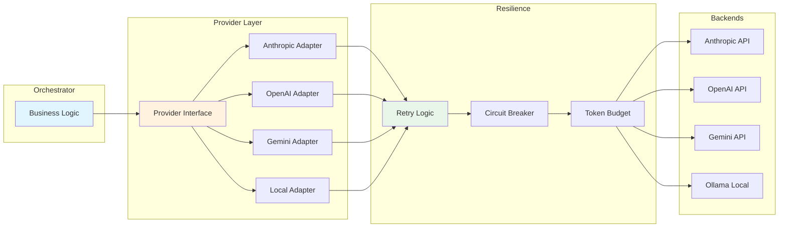
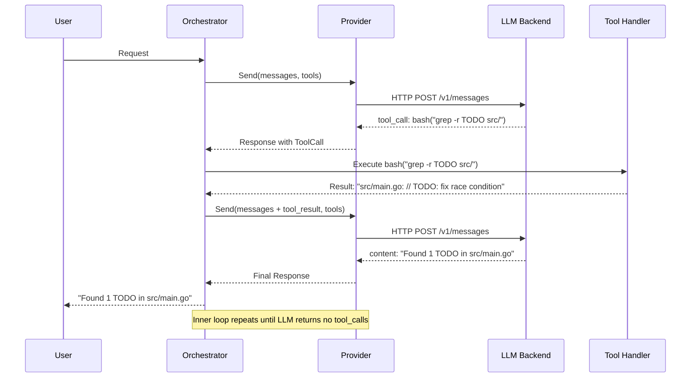

# 🛠️ Tools and Provider Abstraction

## 🎯 Learning Objectives

- Design provider-agnostic interfaces that switch between Claude, OpenAI, Gemini, and local models without code changes
- Apply Unix philosophy to AI tool design: simple, composable, and replaceable
- Build JSON Schema tool definitions that guide LLM inference toward correct tool selection
- Integrate MCP (Model Context Protocol) and browser automation into harnessed workflows
- Evaluate when specialized tools outperform simple Unix commands and when they do not

## Introduction

An agent without tools is merely a chatbot. An agent with poorly designed tools is a chatbot with a hammer. The discipline of Tool and Provider Abstraction sits at the boundary between the LLM's reasoning layer and the external world it must manipulate. When you build the LLM Edge Gateway in Go, you need a provider interface that routes to Claude for complex reasoning, to Gemma 4 for failover, and to a local model for cost-sensitive inference. When you build the Multi-Agent Research System, you need tools that call Tavily's API, parse PDFs, and write structured notes to disk. All of these must share a common contract.

This note bridges [[03 - Agent Loop Architecture: Building the Core]], where we built the REPL and inner loops, and [[06 - The 20 Harnesses: Phase Control and Contracts]], where the Tool Minimalism Harness governs which tools are allowed. For ML/AI engineers in Colombia working with limited API budgets, provider abstraction is not architectural elegance; it is economic survival. The ability to route a task to a local LLM instead of Claude Opus can reduce inference costs by an order of magnitude without sacrificing harness integrity.

---

## Module 7: The Tool Layer and Provider Abstraction

### 7.1 Theoretical Foundation 🧠

The history of software tooling follows a pendulum between specialization and simplification. In the 1970s, Unix pioneers advocated small programs that did one thing well, composed through pipes. In the 2010s, cloud vendors created massive, monolithic SDKs. In 2024, Vercel's D0 project demonstrated that removing 80% of specialized AI tools and replacing them with simple Unix commands (`grep`, `cat`, `ls`) produced a 3x speed increase and 37% fewer tokens consumed. The lesson is counter-intuitive: simpler tools often outperform complex ones because the LLM reasons about them more reliably.

Provider abstraction addresses a parallel problem. Every major LLM vendor offers a different SDK, message format, and capability set. Anthropic uses the Messages API with `system` prompts outside the message array. OpenAI uses Chat Completions with `system` inside the messages. Local models via Ollama expose an OpenAI-compatible layer but with different quantization artifacts. Writing business logic against any single SDK creates vendor lock-in and brittle test suites. The abstraction layer treats the LLM as a function: `send(messages, tools) -> (response, tool_calls)`. The implementation details of HTTP headers, JSON marshaling, and retry logic are encapsulated behind this interface.

For ML/AI systems, the combination of minimalist tools and polymorphic providers creates a resilient execution layer. When Anthropic experiences an outage in us-east-1, your harness silently routes to GCP's Gemini endpoint. When a Tavily API call exceeds budget, your tool layer falls back to a local Serper.dev wrapper. The harness does not panic; it adapts.

### 7.2 Mental Model 📐

The tool palette organizes available capabilities by complexity and frequency of use:

```
┌─────────────────────────────────────────────────────────────┐
│  TOOL PALETTE (Vercel D0 Philosophy)                       │
├─────────────────────────────────────────────────────────────┤
│  Tier 1: Unix Primitives (always available)                │
│  ┌─────────┐ ┌─────────┐ ┌─────────┐ ┌─────────┐         │
│  │  bash   │ │  grep   │ │   cat   │ │   ls    │         │
│  └─────────┘ └─────────┘ └─────────┘ └─────────┘         │
│  WHY: 3x faster, 37% less tokens, universally understood   │
├─────────────────────────────────────────────────────────────┤
│  Tier 2: File Operations (high frequency)                  │
│  ┌─────────────┐ ┌─────────────┐ ┌─────────────┐         │
│  │  read_file  │ │  write_file │ │  edit_file  │         │
│  └─────────────┘ └─────────────┘ └─────────────┘         │
│  WHY: Direct manipulation of the repository-as-harness     │
├─────────────────────────────────────────────────────────────┤
│  Tier 3: Domain Tools (low frequency, high value)          │
│  ┌─────────────┐ ┌─────────────┐ ┌─────────────┐         │
│  │  tavily_search│ │ browser_click│ │ redis_query │       │
│  └─────────────┘ └─────────────┘ └─────────────┘         │
│  WHY: Used only when Tier 1-2 cannot solve the problem    │
└─────────────────────────────────────────────────────────────┘
```

The provider abstraction layer shows how a single interface masks multiple backends:

```
┌─────────────────────────────────────────────────────────────┐
│                    Provider Interface                        │
│              send(messages, tools) -> response               │
└─────────────────────────────────────────────────────────────┘
                              │
        ┌─────────────────────┼─────────────────────┐
        │                     │                     │
        ▼                     ▼                     ▼
┌───────────────┐    ┌───────────────┐    ┌───────────────┐
│   Anthropic   │    │    OpenAI     │    │    Local      │
│   Adapter     │    │   Adapter     │    │   Adapter     │
│ (Messages API)│    │ (ChatCompletion│   │  (Ollama/vLLM)│
└───────────────┘    └───────────────┘    └───────────────┘
        │                     │                     │
        └─────────────────────┴─────────────────────┘
                              │
                              ▼
┌─────────────────────────────────────────────────────────────┐
│  Retry Logic │ Circuit Breaker │ Token Budget │ Telemetry   │
└─────────────────────────────────────────────────────────────┘
```

The tool registry structure maps tool definitions to their runtime handlers:

```
┌─────────────────────────────────────────────────────────────┐
│  TOOL REGISTRY                                               │
├──────────────┬──────────────────────┬───────────────────────┤
│  Tool Name   │  JSON Schema         │  Handler Reference    │
├──────────────┼──────────────────────┼───────────────────────┤
│  bash        │  {name, description, │  unix_tools.bash      │
│              │   parameters: {...}} │                       │
├──────────────┼──────────────────────┼───────────────────────┤
│  read_file   │  {name, description, │  file_tools.read      │
│              │   parameters: {...}} │                       │
├──────────────┼──────────────────────┼───────────────────────┤
│  tavily_search│ {name, description, │  search_tools.tavily  │
│              │   parameters: {...}} │                       │
└──────────────┴──────────────────────┴───────────────────────┘
```

### 7.3 Syntax and Semantics 📝

A Go provider interface enforces the contract that every backend must satisfy. This is the core abstraction that makes multi-provider routing possible.

```go
// provider.go
// WHY: Go interfaces are implicitly satisfied. No boilerplate inheritance.

package harness

import (
	"context"
	"encoding/json"
	"fmt"
	"time"
)

// ToolDefinition describes what a tool does and what parameters it accepts.
// WHY: The LLM uses this schema to decide WHICH tool to call and with WHAT arguments.
type ToolDefinition struct {
	Name        string          `json:"name"`        // WHY: Must match handler registry exactly
	Description string          `json:"description"` // WHY: The LLM reads this to choose the tool
	Parameters  json.RawMessage `json:"parameters"`  // WHY: JSON Schema validates LLM output before execution
}

// Message represents a single turn in the conversation.
// WHY: Unified format avoids vendor-specific message structs leaking into business logic.
type Message struct {
	Role    string `json:"role"`    // WHY: "system", "user", "assistant", "tool"
	Content string `json:"content"`
}

// ToolCall represents the LLM's request to execute a tool.
// WHY: Structured call is parseable; regex extraction from prose is fragile.
type ToolCall struct {
	ID        string          `json:"id"`
	Name      string          `json:"name"`
	Arguments json.RawMessage `json:"arguments"` // WHY: Raw JSON defers validation to the tool layer
}

// Response is what every provider must return, normalized.
// WHY: Business logic depends on this struct, not Anthropic's or OpenAI's types.
type Response struct {
	Content   string     `json:"content"`
	ToolCalls []ToolCall `json:"tool_calls,omitempty"`
	Usage     Usage      `json:"usage"`
	Model     string     `json:"model"` // WHY: Traceability requires knowing which model served the request
}

// Usage tracks consumption for budget controls and telemetry.
// WHY: Token budgets are a harness concern, not a provider concern.
type Usage struct {
	InputTokens  int `json:"input_tokens"`
	OutputTokens int `json:"output_tokens"`
}

// Provider is the polymorphic interface.
// WHY: Allows hot-swapping Claude for Gemini without touching orchestrator code.
type Provider interface {
	Send(ctx context.Context, messages []Message, tools []ToolDefinition) (Response, error)
	Name() string
}

// RetryableProvider wraps any Provider with exponential backoff.
// WHY: Transient failures are normal in distributed systems; retries belong in infrastructure.
type RetryableProvider struct {
	Inner      Provider
	MaxRetries int
	BaseDelay  time.Duration
}

func (r *RetryableProvider) Send(ctx context.Context, msgs []Message, tools []ToolDefinition) (Response, error) {
	var lastErr error
	for attempt := 0; attempt <= r.MaxRetries; attempt++ {
		resp, err := r.Inner.Send(ctx, msgs, tools)
		if err == nil {
			return resp, nil
		}
		lastErr = err
		if attempt < r.MaxRetries {
			// WHY: Exponential backoff prevents thundering herd during provider outages
			time.Sleep(r.BaseDelay * time.Duration(1<<attempt))
		}
	}
	return Response{}, fmt.Errorf("provider %s failed after %d retries: %w", r.Inner.Name(), r.MaxRetries, lastErr)
}

func (r *RetryableProvider) Name() string {
	return fmt.Sprintf("retryable(%s)", r.Inner.Name())
}
```

The tool definition JSON schema guides the LLM toward generating valid arguments. This example defines a semantic cache query tool used in the LLM Edge Gateway:

```python
# tool_definitions.py
# WHY: Descriptions are prompts. Bad descriptions cause hallucinated arguments.

SEMANTIC_CACHE_TOOL = {
    "name": "redis_semantic_search",
    "description": (
        "Search the Redis semantic cache for a previously computed response similar to the current query. "
        "Use this BEFORE calling the expensive LLM endpoint to reduce latency and cost. "
        "Returns the cached response if similarity exceeds the threshold, otherwise indicates a miss."
    ),
    "parameters": {
        "type": "object",
        "properties": {
            "query_embedding": {
                "type": "string",
                "description": "Base64-encoded embedding vector of the user's query. WHY: Prevents sending raw floats as JSON strings."
            },
            "top_k": {
                "type": "integer",
                "default": 3,
                "description": "Number of nearest neighbors to retrieve. WHY: More neighbors increase recall but consume more Redis memory."
            },
            "similarity_threshold": {
                "type": "number",
                "default": 0.92,
                "description": "Minimum cosine similarity to consider a cache hit. WHY: Lower values risk returning irrelevant cached responses."
            }
        },
        "required": ["query_embedding"]
    }
}

BASH_TOOL = {
    "name": "bash",
    "description": (
        "Execute a shell command with optional timeout. "
        "Prefer simple, composable Unix commands over complex one-liners. "
        "WHY: The LLM reasons about grep, cat, and ls more reliably than about custom DSLs."
    ),
    "parameters": {
        "type": "object",
        "properties": {
            "command": {
                "type": "string",
                "description": "The shell command to execute. Must be a single string."
            },
            "timeout_seconds": {
                "type": "integer",
                "default": 30,
                "description": "Abort after N seconds to prevent runaway processes."
            }
        },
        "required": ["command"]
    }
}
```

### 7.4 Visual Representation 🖼️

The provider abstraction architecture shows how the orchestrator remains agnostic while adapters handle vendor quirks:



The tool execution sequence diagram shows the inner loop in action:



### 7.5 Application in ML/AI Systems 🤖

Real case: The LLM Edge Gateway (Go/Fiber + Redis semantic caching + Gemma 4 failover) uses provider abstraction to survive upstream outages. During a December 2024 Claude API degradation in us-east-1, the gateway's circuit breaker opened after three consecutive timeouts. The orchestrator silently promoted the Gemini adapter to primary and demoted Anthropic to secondary. User requests experienced zero downtime because the harness, not the developer, made the routing decision based on latency and error rate metrics.

| ML Use Case                         | This Concept              | Impact                                         |
|------------------------------------ |-------------------------- |----------------------------------------------- |
| LLM Edge Gateway (Go/Fiber)         | Provider Abstraction      | Zero-downtime failover between Claude and Gemini  |
| Multi-Agent Research System         | Tavily Search Tool        | Structured web search with schema-validated args  |
| Automated LLM Evaluation Suite      | Bash + Grep Tools         | Gemma 4 judge parses executor logs via Unix tools |
| StayBot (LangGraph + FastAPI)       | Redis Semantic Cache Tool | Latency reduction from 800ms to 40ms on cache hits |
| RAG Pipeline (Python/PyTorch)       | MCP Document Loader       | PDF ingestion via standardized protocol            |

### 7.6 Common Pitfalls ⚠️

⚠️ **Tool bloat: adding 15 specialized tools because "we might need them."** The root cause is speculative generality. Every tool in the registry consumes context window tokens and increases the LLM's decision space. Vercel D0 proved that 5 Unix tools outperform 20 specialized tools in both speed and accuracy. Audit your tool registry monthly. If a tool has not been invoked in 10 sessions, remove it.

⚠️ **Poor tool descriptions causing hallucinated arguments.** The root cause is treating tool descriptions as documentation rather than prompts. The LLM reads the description to decide whether to use the tool and what values to pass. A description like "Searches stuff" produces garbage arguments. A description like "Search the Redis semantic cache for a previously computed response similar to the current query" produces valid, schema-conforming arguments.

💡 **Mnemonic: "S.I.M.P.L.E."** — Six rules for tool design:
- **S**ingle purpose (one tool, one job)
- **I**nformative description (the LLM reads this)
- **M**achine schema (JSON Schema validates arguments)
- **P**refer Unix (grep over custom DSL)
- **L**ightweight registry (remove unused tools)
- **E**xplicit required fields (no optional defaults that confuse the model)

### 7.7 Knowledge Check ❓

1. **Provider Failover:** Your Anthropic adapter returns 529 errors (overloaded). The RetryableProvider has `MaxRetries: 3` and `BaseDelay: 1s`. Calculate the total wait time before the final retry fails. Then explain why a Circuit Breaker Harness should bypass retries entirely after a threshold of errors.

2. **Tool Description Rewrite:** Improve this tool description for an LLM: `"Does things with files."` Rewrite it following the principles from Section 7.3, including a clear WHEN to use it and a WHY for each parameter.

3. **Unix vs Specialized:** You need to find all Python functions that call `torch.cuda.empty_cache()`. Compare using the `bash` tool with `grep -r "torch.cuda.empty_cache" --include="*.py" .` versus creating a custom `find_cuda_calls` tool. Which is better for the LLM's reasoning accuracy, and why?

---

## 📦 Compression Code

```go
// compression_tools_provider.go
// WHY: Complete, minimal provider abstraction + tool registry in one file.

package main

import (
	"context"
	"encoding/json"
	"fmt"
	"os"
	"time"
)

// --- Provider Interface ---

type Message struct{ Role, Content string }

type ToolDef struct {
	Name        string          `json:"name"`
	Description string          `json:"description"`
	Parameters  json.RawMessage `json:"parameters"`
}

type ToolCall struct{ ID, Name string; Arguments json.RawMessage }

type Response struct{ Content string; ToolCalls []ToolCall }

type Provider interface{ Send(ctx context.Context, msgs []Message, tools []ToolDef) (Response, error) }

// --- Concrete Provider: Anthropic ---

type AnthropicProvider struct{ APIKey string }

func (a *AnthropicProvider) Send(ctx context.Context, msgs []Message, tools []ToolDef) (Response, error) {
	// WHY: In production, marshal to Anthropic Messages API format.
	//      This stub demonstrates the contract without external dependencies.
	fmt.Println("[Anthropic] Sending", len(msgs), "messages with", len(tools), "tools")
	return Response{Content: "Ack from Anthropic"}, nil
}

// --- Concrete Provider: OpenAI ---

type OpenAIProvider struct{ APIKey string }

func (o *OpenAIProvider) Send(ctx context.Context, msgs []Message, tools []ToolDef) (Response, error) {
	fmt.Println("[OpenAI] Sending", len(msgs), "messages with", len(tools), "tools")
	return Response{Content: "Ack from OpenAI"}, nil
}

// --- Router: Provider Abstraction in Action ---

type Router struct {
	Primary   Provider
	Secondary Provider
}

func (r *Router) Send(ctx context.Context, msgs []Message, tools []ToolDef) (Response, error) {
	// WHY: Try primary first; if it fails, degrade gracefully to secondary.
	resp, err := r.Primary.Send(ctx, msgs, tools)
	if err != nil {
		fmt.Println("[Router] Primary failed, failing over to secondary")
		return r.Secondary.Send(ctx, msgs, tools)
	}
	return resp, nil
}

// --- Tool Registry ---

type ToolRegistry map[string]func(args json.RawMessage) (string, error)

func (tr ToolRegistry) Execute(call ToolCall) (string, error) {
	// WHY: Lookup by name ensures the handler exactly matches the LLM's intent.
	handler, ok := tr[call.Name]
	if !ok {
		return "", fmt.Errorf("unknown tool: %s", call.Name)
	}
	return handler(call.Arguments)
}

// --- Main: Bootstrap ---

func main() {
	// WHY: Demonstrate swapping providers without changing business logic.
	router := &Router{
		Primary:   &AnthropicProvider{APIKey: os.Getenv("ANTHROPIC_KEY")},
		Secondary: &OpenAIProvider{APIKey: os.Getenv("OPENAI_KEY")},
	}

	msg := Message{Role: "user", Content: "List files in current directory"}
	lsTool := ToolDef{
		Name:        "bash",
		Description: "Execute a shell command. Use this for file system operations.",
		Parameters:  json.RawMessage(`{"type":"object","properties":{"command":{"type":"string"}},"required":["command"]}`),
	}

	resp, err := router.Send(context.Background(), []Message{msg}, []ToolDef{lsTool})
	if err != nil {
		fmt.Println("Error:", err)
		return
	}
	fmt.Println("Response:", resp.Content)
}
```

## 🎯 Documented Project

### Description
Design a **Provider-Agnostic Tool Suite** for an ML model comparison service. The service must benchmark Claude, Gemini, and local Gemma 4 on the same prompts and report latency, cost, and coherence scores.

### Functional Requirements
1. The `Provider` interface must normalize all three backends behind a single `Send()` method.
2. The tool suite must include `bash`, `read_file`, `write_file`, and a custom `evaluate_coherence` tool.
3. The `evaluate_coherence` tool must accept a `reference_text` and `candidate_text`, compute a semantic similarity score, and return a JSON result.
4. All tool definitions must include JSON Schema parameters with descriptions written as prompts, not documentation.
5. The router must implement a circuit breaker: after 3 consecutive errors from a provider, traffic routes to the healthy backend for 60 seconds.

### Main Components
- `provider.go`: Interface + Anthropic, OpenAI, and Ollama adapters.
- `tools.go`: Tool definitions and handler implementations.
- `router.go`: Failover logic with circuit breaker state machine.
- `benchmark.go`: Orchestrator that runs the same prompt against all providers and collects metrics.

### Success Metrics
- Provider swap requires zero changes to `benchmark.go`.
- Tool registry limits active tools to 6 or fewer (Unix philosophy).
- Circuit breaker detects failure and reroutes within 5 seconds.

## 🎯 Key Takeaways

- **Provider abstraction is economic armor.** Routing between Claude, Gemini, and local models protects both uptime and budget.
- **Tool descriptions are prompts.** The LLM uses them to decide what to call and with what arguments; write them with the same care as system prompts.
- **Unix tools outperform specialized tools** in LLM contexts because they are simpler to reason about and consume fewer tokens.
- **JSON Schema is the contract** between the LLM's imagination and the runtime's execution. Validate early, execute safely.
- **The inner loop is the heartbeat.** Read → Evaluate → Print → Loop, with tool execution nested inside, is the fundamental pattern of all agentic systems.

## References

- Vercel D0. "Simplifying AI Agent Tooling." Video source: `q9Vaoz0hd0U`
- Gentle Framework. "Building Harness from Scratch: Provider Abstraction." Video source: `2B9QTg_-nyc`
- [[03 - Agent Loop Architecture: Building the Core]] — The REPL and inner loops that consume these tools.
- [[06 - The 20 Harnesses: Phase Control and Contracts]] — Tool Minimalism Harness and Model Routing Harness.
- [[13 - Go Engineering]] — Go interfaces, context propagation, and error handling patterns.
