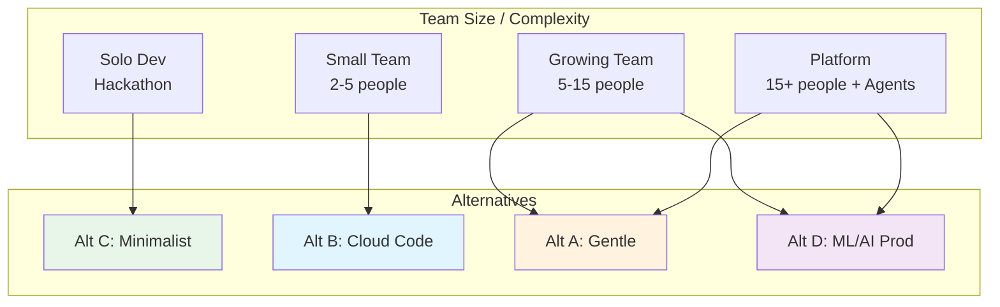
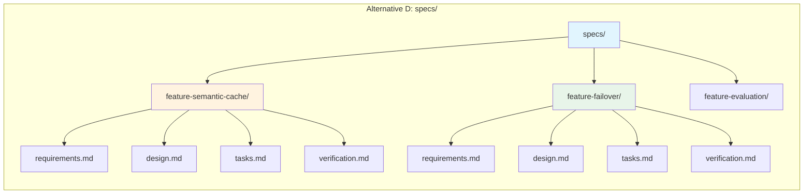

# 📁 File Structures and Repository Harnesses

## 🎯 Learning Objectives

- Compare four production-ready harness file structures and select the right one based on project maturity and team size
- Design migration paths from minimal harnesses to full 20-harness Gentle frameworks
- Build repository structures that treat files as external memory, not just source code
- Apply the Repository-as-Harness principle to ML/AI projects with diverse deployment targets
- Create bootstrap scripts that generate complete harness structures on demand

## Introduction

The repository is not merely a place to store code. In Harness Engineering, the repository *is* the harness. Every file, directory, and convention in your project communicates constraints, history, and intent to the AI agent that works within it. When you open a project and the agent sees `CLAUDE.md`, `agents.md`, `.ai/agents/leader.md`, and `specs/`, it immediately understands that this project operates under SDD discipline. When the agent sees only `src/` and `README.md`, it must guess your conventions, often incorrectly. This note presents four validated file structure alternatives, each optimized for a different stage of project maturity and organizational complexity.

This is the architectural capstone of [[06 - The 20 Harnesses: Phase Control and Contracts]] and [[07 - Tools and Provider Abstraction]]. The harnesses and tools you design need a physical home. The structure you choose determines whether new team members (human or agent) can onboard in minutes or wander lost for hours. For ML/AI engineers shipping to AWS from Medellín, the right structure also determines whether your deployment harnesses (like a `deployer` agent) have clear targets for Dockerfiles, Terraform, and CI/CD configurations.

---

## Module 8: Repository as Harness

### 8.1 Theoretical Foundation 🧠

File structure is the most underrated form of documentation. A well-structured repository speaks before any `README` is read. The concept of "Repository as Harness" extends the Unix philosophy: files are the universal interface. An agent can `cat` a spec, `ls` a directory, and `grep` a convention. These operations require no specialized SDK, no context-window-heavy explanations, and no brittle prompt engineering. The files themselves are the prompts.

The evolution of harness structures mirrors the evolution of software teams. A solo developer in a hackathon needs speed, not ceremony. A mid-size startup needs repeatability. A production ML platform needs governance, audit trails, and multi-agent orchestration. Each stage demands a different structural answer. The error most teams make is choosing a structure designed for a 50-engineer company when they are two people, or worse, keeping a two-person structure when they have grown to twenty agents and five human engineers.

The four alternatives presented here are not theoretical. Alternative A (Gentle-Style) powers the Gentle framework by Alan Buscalas. Alternative B (Cloud Code Native) is derived from Fazt Code's Claude-specific project structure. Alternative C (Minimalist Unix Harness) is inspired by Vercel D0's aggressive simplification. Alternative D (ML/AI Production Harness) is aligned with the portfolio of an AI/ML engineer building LLM gateways, evaluation suites, and multi-agent research systems in Colombia. Each has a domain of validity. Your job is to match the structure to the problem, not the problem to the structure.

### 8.2 Mental Model 📐

The four directory trees presented side by side show how complexity grows with organizational needs:

```
┌─────────────────────────────┐  ┌─────────────────────────────┐
│ Alternative A: Gentle-Style │  │ Alternative B: Cloud Code   │
│ (Full-Featured, 20 Harness) │  │ Native (Claude-Specific)    │
├─────────────────────────────┤  ├─────────────────────────────┤
│ .ai/                        │  │ .claude/                    │
│ ├── agents/                 │  │ ├── CLAUDE.md               │
│ │   ├── leader.md           │  │ ├── skills/                 │
│ │   ├── spec-author.md      │  │ │   └── test/SKILL.md       │
│ │   ├── implementer.md      │  │ ├── docs/                   │
│ │   └── reviewer.md         │  │ │   ├── architecture.md     │
│ ├── skills/                 │  │ │   ├── decisions/          │
│ │   └── ...                 │  │ │   └── runbooks/           │
│ ├── harnesses/              │  │ ├── tools/                  │
│ │   └── ...                 │  │ │   └── scripts/          │
│ specs/                      │  │ src/                        │
│ ├── <task>/                 │  │ tests/                      │
│ │   ├── requirements.md     │  │                             │
│ │   ├── design.md           │  │                             │
│ │   └── tasks.md            │  │                             │
│ tasks.json                  │  │                             │
│ init.sh                     │  │                             │
│ agents.md                   │  │                             │
│ CLAUDE.md                   │  │                             │
└─────────────────────────────┘  └─────────────────────────────┘
```

```
┌─────────────────────────────┐  ┌─────────────────────────────┐
│ Alternative C: Minimalist   │  │ Alternative D: ML/AI Prod   │
│ Unix Harness (Vercel-Insp)  │  │ Harness (Portfolio-Aligned) │
├─────────────────────────────┤  ├─────────────────────────────┤
│ .harness/                   │  │ .ai-harness/                │
│ ├── agents/                 │  │ ├── agents/                 │
│ │   ├── leader.md           │  │ │   ├── leader.md           │
│ │   ├── spec.md             │  │ │   ├── spec-author.md      │
│ │   └── review.md           │  │ │   ├── implementer.md      │
│ ├── tools.json              │  │ │   ├── reviewer.md         │
│ └── config.yaml             │  │ │   └── deployer.md         │
│ specs/                      │  │ ├── memory/                 │
│ ├── 001-feature/            │  │ │   ├── decisions.json      │
│ │   ├── req.md              │  │ │   ├── sessions/           │
│ │   ├── design.md           │  │ │   └── learnings.md      │
│ │   └── verify.md           │  │ ├── specs/                │
│ tasks.json                  │  │ │   └── <feature>/        │
│ init.sh                     │  │ │       ├── requirements.md │
│                             │  │ │       ├── design.md       │
│                             │  │ │       ├── tasks.md        │
│                             │  │ │       └── verification.md │
│                             │  │ tasks.json                  │
│                             │  │ init.sh                     │
│                             │  │ agents.md                   │
│                             │  │ CLAUDE.md                   │
│                             │  │ Dockerfile                  │
│                             │  │ k8s/                        │
│                             │  │ └── deployment.yaml           │
└─────────────────────────────┘  └─────────────────────────────┘
```

The harness maturity ladder shows when to migrate between alternatives:

```
┌─────────────────────────────────────────────────────────────┐
│  HARNESS MATURITY LADDER                                    │
│                                                             │
│  Stage 1: Experiment          Stage 2: Product            │
│  ┌─────────────┐              ┌─────────────┐             │
│  │  Solo Dev   │─────────────→│  Small Team │             │
│  │  Prototype  │              │  Repeatable │             │
│  │  Alt C      │              │  Alt B      │             │
│  └─────────────┘              └─────────────┘             │
│         │                            │                      │
│         │    Stage 3: Platform       │                      │
│         │    ┌─────────────┐         │                      │
│         └───→│  Multi-Agent│←────────┘                      │
│              │  Governed   │                                 │
│              │  Alt A or D │                                 │
│              └─────────────┘                                 │
│                                                             │
│  Migration triggers:                                        │
│  C→B: First production user, need runbooks                  │
│  B→A/D: Second agent added, need orchestration              │
│  A↔D: Deploy to K8s/cloud vs local inference                │
└─────────────────────────────────────────────────────────────┘
```

The migration path shows how to move from simple to complex without losing work:

```
┌─────────────────────────────────────────────────────────────┐
│  MIGRATION PATH: C → B → D                                  │
├─────────────────────────────────────────────────────────────┤
│  Step 1: Rename .harness/ → .ai-harness/                    │
│  Step 2: Move config.yaml values into agents/ prompts       │
│  Step 3: Add memory/ directory for Engram persistence       │
│  Step 4: Add deployer.md agent for CI/CD orchestration      │
│  Step 5: Convert specs/ from flat to per-feature nesting    │
│  Step 6: Add verification.md to each spec directory         │
│  Step 7: Add Dockerfile and k8s/ for production harness   │
│  Step 8: Update init.sh to validate new structure           │
└─────────────────────────────────────────────────────────────┘
```

### 8.3 Syntax and Semantics 📝

A Python bootstrap script creates any of the four structures based on a single argument. This is the harness for your harness: it generates the repository structure that will later generate your code.

```python
# bootstrap_harness.py
# WHY: Generating structure from a template prevents human error and ensures consistency.

import argparse
import os
import shutil
from pathlib import Path
from typing import Dict, List

# WHY: Each structure is defined as data, not code, so adding Alternative E is trivial.
STRUCTURES: Dict[str, Dict[str, List[str]]] = {
    "gentle": {
        "description": "Full-featured 20-harness Gentle framework",
        "dirs": [
            ".ai/agents",
            ".ai/skills",
            ".ai/harnesses",
            "specs",
        ],
        "files": {
            ".ai/agents/leader.md": "# Leader Agent\n\nRole: Orchestrator. Does NOT execute code.\n",
            ".ai/agents/spec-author.md": "# Spec Author\n\nRole: Writes requirements.md, design.md, tasks.md.\n",
            ".ai/agents/implementer.md": "# Implementer\n\nRole: Writes code following spec. Receives ONLY curated spec.\n",
            ".ai/agents/reviewer.md": "# Reviewer\n\nRole: Validates against spec and architecture.\n",
            "tasks.json": '{"tasks": [], "version": "1.0"}\n',
            "init.sh": "#!/bin/bash\n# WHY: Verify environment before any agent runs.\necho 'Harness initialized.'\n",
            "agents.md": "# Agent Entry Point\n\nRules for all agents working in this repo.\n",
            "CLAUDE.md": "# Project Context\n\nStack, conventions, and architecture overview.\n",
        }
    },
    "cloudcode": {
        "description": "Simple Claude-specific structure",
        "dirs": [
            ".claude/skills/test",
            ".claude/docs/decisions",
            ".claude/docs/runbooks",
            ".claude/tools/scripts",
            "src",
            "tests",
        ],
        "files": {
            ".claude/CLAUDE.md": "# Project Context + Rules\n\n## Stack\n- Python 3.11\n- FastAPI\n\n## Commands\n- /test: Run pytest\n- /build: Build Docker image\n",
            ".claude/skills/test/SKILL.md": "# Skill: /test\n\nExecute: pytest -xvs tests/\n",
            ".claude/docs/architecture.md": "# 00-Overview\n\nSystem architecture.\n",
        }
    },
    "minimalist": {
        "description": "Vercel-inspired minimal Unix harness",
        "dirs": [
            ".harness/agents",
            "specs",
        ],
        "files": {
            ".harness/agents/leader.md": "# Leader\n\nOrchestrator. Minimal context.\n",
            ".harness/agents/spec.md": "# Spec Agent\n\nWrites requirements.\n",
            ".harness/agents/review.md": "# Review Agent\n\nValidates output.\n",
            ".harness/tools.json": '[{"name":"bash","description":"Run shell commands"}]',
            ".harness/config.yaml": "stack: python\ntest_command: pytest\n",
            "tasks.json": '{"tasks":[]}\n',
            "init.sh": "#!/bin/bash\necho 'Minimal harness ready.'\n",
        }
    },
    "mlprod": {
        "description": "ML/AI Production Harness with deployer agent",
        "dirs": [
            ".ai-harness/agents",
            ".ai-harness/memory/sessions",
            ".ai-harness/specs",
            "k8s",
        ],
        "files": {
            ".ai-harness/agents/leader.md": "# Leader\n\nOrchestrates SDD phases.\n",
            ".ai-harness/agents/spec-author.md": "# Spec Author\n\nEARS requirements + design + tasks.\n",
            ".ai-harness/agents/implementer.md": "# Implementer\n\nCode generation from tasks.md.\n",
            ".ai-harness/agents/reviewer.md": "# Reviewer\n\nStructured review cards.\n",
            ".ai-harness/agents/deployer.md": "# Deployer\n\nCI/CD and K8s deployment.\nWHY: Separates production concerns from development.\n",
            ".ai-harness/memory/decisions.json": '{"decisions":[]}\n',
            ".ai-harness/memory/learnings.md": "# Learnings\n\nAccumulated insights across sessions.\n",
            "tasks.json": '{"tasks":[],"version":"1.0"}\n',
            "init.sh": "#!/bin/bash\n# WHY: Validate Docker, kubectl, and Python before agent runs.\n",
            "agents.md": "# Entry Point\n\nAll agents read this first.\n",
            "CLAUDE.md": "# ML Backend Service\n\nPyTorch + FastAPI + Redis + Kubernetes.\n",
            "Dockerfile": "FROM python:3.11-slim\nWORKDIR /app\nCOPY . .\nRUN pip install -r requirements.txt\n",
            "k8s/deployment.yaml": "apiVersion: apps/v1\nkind: Deployment\nmetadata:\n  name: ml-backend\n",
        }
    }
}

def bootstrap(structure_name: str, target_dir: str = ".") -> None:
    # WHY: Idempotency: running twice should not duplicate files unexpectedly.
    cfg = STRUCTURES.get(structure_name)
    if not cfg:
        raise ValueError(f"Unknown structure: {structure_name}. Choose from: {list(STRUCTURES.keys())}")
    
    root = Path(target_dir)
    print(f"Bootstrapping '{structure_name}': {cfg['description']}")
    
    for d in cfg["dirs"]:
        (root / d).mkdir(parents=True, exist_ok=True)
        print(f"  [DIR]  {d}")
    
    for filepath, content in cfg["files"].items():
        fpath = root / filepath
        if not fpath.exists():
            fpath.write_text(content, encoding="utf-8")
            # WHY: init.sh must be executable to serve as the environment verification entry point.
            if filepath.endswith(".sh"):
                os.chmod(fpath, 0o755)
            print(f"  [FILE] {filepath}")
        else:
            print(f"  [SKIP] {filepath} (exists)")

if __name__ == "__main__":
    parser = argparse.ArgumentParser(description="Bootstrap a harness structure.")
    parser.add_argument("structure", choices=list(STRUCTURES.keys()), help="Structure type")
    parser.add_argument("--target", default=".", help="Target directory")
    args = parser.parse_args()
    bootstrap(args.structure, args.target)
```

### 8.4 Visual Representation 🖼️

The comparison diagram shows which alternatives serve which team topology:



The per-feature spec directory structure in Alternative D shows how artifacts nest under version control:



### 8.5 Application in ML/AI Systems 🤖

Real case: The Automated LLM Evaluation Suite began as a single Python script with no harness (pre-Alternative C). As it grew to compare Claude, Gemini, and Gemma 4 across 50 test cases, the lack of structure caused the evaluation agent to confuse test configurations from different model runs. Migrating to Alternative D (ML/AI Production Harness) added per-evaluation `specs/`, a `deployer.md` agent for pushing results to Supabase, and a `memory/learnings.md` file that accumulated insights about which models hallucinated on specific prompt types. The migration took one afternoon and eliminated cross-evaluation contamination permanently.

| ML Use Case                          | Recommended Alternative | Why                                                     |
|------------------------------------- |------------------------ |-------------------------------------------------------- |
| LLM Edge Gateway (Go/Fiber + Redis)  | Alternative D           | Needs deployer agent for K8s + Docker                 |
| Automated LLM Evaluation Suite     | Alternative D           | Per-evaluation specs + memory/learnings accumulation  |
| Multi-Agent Research System          | Alternative A or D      | Complex agent orchestration needs full harnesses      |
| StayBot (LangGraph + FastAPI)        | Alternative A           | Multi-agent property management with spec-driven features |
| Weekend RAG prototype                | Alternative C           | Speed matters; structure can migrate later            |
| Team of 3 humans + 2 AI agents       | Alternative B           | Cloud Code native skills integrate with Claude Desktop |

### 8.6 Common Pitfalls ⚠️

⚠️ **Choosing Alternative A for a solo weekend project.** The root cause is premature optimization of process over product. A 20-harness Gentle structure adds cognitive overhead. If you spend more time maintaining `tasks.json` than writing features, you have chosen the wrong alternative. Start with Alternative C and migrate upward when pain appears, not before.

⚠️ **Staying on Alternative C when you have three agents and production users.** The root cause is attachment to simplicity that has become technical debt. When an Implementer agent accidentally reads an old chat session and implements the wrong feature, the cost of migration is suddenly cheaper than the cost of another bug. The maturity ladder exists precisely to signal when it is time to grow.

💡 **Mnemonic: "R.I.G.H.T."** — Five questions to choose your structure:
- **R**epository size: <5 files → C; >50 files → A or D
- **I**nference target: Local only → C; K8s/cloud → D
- **G**overnance needed: None → C; Audit trails → A or D
- **H**umans + Agents: 1 person → C; 2+ agents → B, A, or D
- **T**eam growth: Static → B; Scaling → D

### 8.7 Knowledge Check ❓

1. **Structure Selection:** You are a solo AI/ML engineer in Medellín building a FastAPI prototype for a local startup. You expect to ship in 3 weeks with one AI agent. Which alternative do you choose, and which three files do you create first? Justify using the R.I.G.H.T. mnemonic.

2. **Migration Planning:** Your Cloud Code Native project (Alternative B) just signed an enterprise client requiring SOC 2 audit trails for every agent decision. Draw the migration path from B to D, listing which directories you add and which existing files you refactor.

3. **Bootstrap Extension:** Modify `bootstrap_harness.py` to add a new file `.ai-harness/agents/monitor.md` to the `mlprod` structure. This agent watches production metrics and triggers the `deployer.md` agent on anomaly. What description do you write in `monitor.md` to ensure it does not overlap with `deployer.md`?

---

## 📦 Compression Code

```python
# compression_file_structures.py
# WHY: One script to analyze, validate, and recommend a harness structure.

import json
from pathlib import Path
from typing import Dict, List, Tuple

STRUCTURE_SIGNATURES = {
    "gentle": {
        "required_dirs": [".ai/agents", ".ai/skills", ".ai/harnesses", "specs"],
        "required_files": ["tasks.json", "init.sh", "agents.md", "CLAUDE.md"],
        "score": 0,
    },
    "cloudcode": {
        "required_dirs": [".claude/skills", ".claude/docs", "src", "tests"],
        "required_files": [".claude/CLAUDE.md"],
        "score": 0,
    },
    "minimalist": {
        "required_dirs": [".harness/agents", "specs"],
        "required_files": [".harness/tools.json", ".harness/config.yaml", "tasks.json", "init.sh"],
        "score": 0,
    },
    "mlprod": {
        "required_dirs": [".ai-harness/agents", ".ai-harness/memory", "k8s"],
        "required_files": ["Dockerfile", "tasks.json", "init.sh", "agents.md", "CLAUDE.md"],
        "score": 0,
    }
}

def detect_structure(root: str = ".") -> Tuple[str, float]:
    # WHY: Detect existing structure so we don't recommend a migration to the same structure.
    root_path = Path(root)
    scores: Dict[str, int] = {k: 0 for k in STRUCTURE_SIGNATURES}
    totals: Dict[str, int] = {k: 0 for k in STRUCTURE_SIGNATURES}
    
    for name, sig in STRUCTURE_SIGNATURES.items():
        items = sig["required_dirs"] + sig["required_files"]
        totals[name] = len(items)
        for item in items:
            if (root_path / item).exists():
                scores[name] += 1
    
    best = max(scores, key=lambda k: scores[k] / totals[k])
    confidence = scores[best] / totals[best]
    return best, confidence

def recommend(structure: str, team_size: int, has_k8s: bool) -> str:
    # WHY: Logic encodes the decision matrix from Section 8.5.
    if team_size == 1 and not has_k8s:
        return "minimalist"
    if team_size <= 3 and not has_k8s:
        return "cloudcode"
    if has_k8s:
        return "mlprod"
    return "gentle"

if __name__ == "__main__":
    detected, conf = detect_structure()
    rec = recommend(detected, team_size=2, has_k8s=True)
    print(json.dumps({
        "detected": detected,
        "confidence": f"{conf:.0%}",
        "recommended": rec,
        "action": "migrate" if detected != rec else "maintain"
    }, indent=2))
```

## 🎯 Documented Project

### Description
Design the **complete file structure** for a new ML backend service that serves fine-tuned embeddings via FastAPI, runs semantic caching against Redis, and deploys to Google Kubernetes Engine from Medellín. The structure must support three AI agents (Spec Author, Implementer, Deployer) and preserve decisions for SOC 2 audits.

### Functional Requirements
1. Use **Alternative D** as the base structure with per-feature spec directories.
2. Each feature (embedding endpoint, semantic cache, auth middleware) must have its own `specs/<feature>/` directory containing `requirements.md`, `design.md`, `tasks.md`, and `verification.md`.
3. The `deployer.md` agent must have read access to `k8s/`, `Dockerfile`, and `.github/workflows/` but must NOT have write access to `src/`.
4. `memory/decisions.json` must be append-only and include timestamps, agent name, and decision rationale for every architectural choice.
5. `init.sh` must verify Docker, `kubectl`, `gcloud`, and Python 3.11 before allowing any agent to proceed.

### Main Components
- `.ai-harness/agents/`: {leader, spec-author, implementer, reviewer, deployer}.md
- `.ai-harness/memory/`: decisions.json (append-only), sessions/, learnings.md
- `specs/`: Per-feature SDD artifacts.
- `src/`: FastAPI application code (generated by Implementer, validated by Reviewer).
- `k8s/`: Deployment manifests generated and applied by Deployer.
- `Dockerfile` and `.github/workflows/ci.yml`: CI/CD infrastructure.

### Success Metrics
- New feature onboarding (from proposal to deployed K8s pod) completes in one SDD cycle with zero human intervention after spec approval.
- All 20 harnesses have a physical file or script representation in the repository.
- Audit trail in `memory/decisions.json` is queryable by `jq` and contains 100% of architectural decisions.

## 🎯 Key Takeaways

- **The repository is the harness.** Files are not storage; they are the control plane that agents read before acting.
- **Match structure to maturity, not ambition.** Alternative C is correct for prototypes; Alternative D is correct for production ML platforms.
- **Migration is a feature, not a failure.** The maturity ladder gives you permission to start simple and grow. Pain indicates the right time to migrate.
- **Alternative D adds `deployer.md` and `k8s/`** because ML/AI systems that stay in `src/` are experiments; systems that ship to Kubernetes are products.
- **Per-feature spec directories** prevent cross-contamination and make git history readable. A directory named `specs/semantic-cache/` tells more than a commit message ever could.

## References

- Fazt Code. "Si programas con IA, necesitas esta estructura de proyecto." Video source: CLAUDE.md, skills, docs/architecture, decisions, runbooks.
- Gentle Framework (Alan Buscalas). "Agent Harness Course: File Structures." Video source: `5Q7jV8TpMXA`
- Vercel D0. "Minimalist Harness Philosophy." Video source: `q9Vaoz0hd0U`
- [[06 - The 20 Harnesses: Phase Control and Contracts]] — Where the 20 harnesses find their physical home.
- [[09 - Verification and Quality Gates]] — How `verification.md` in each spec directory enforces quality.
- [[10 - Cloud, Infra y Backend]] — Kubernetes and CI/CD context for the deployer agent.
