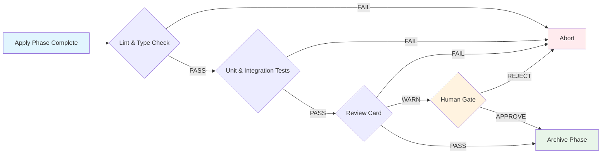
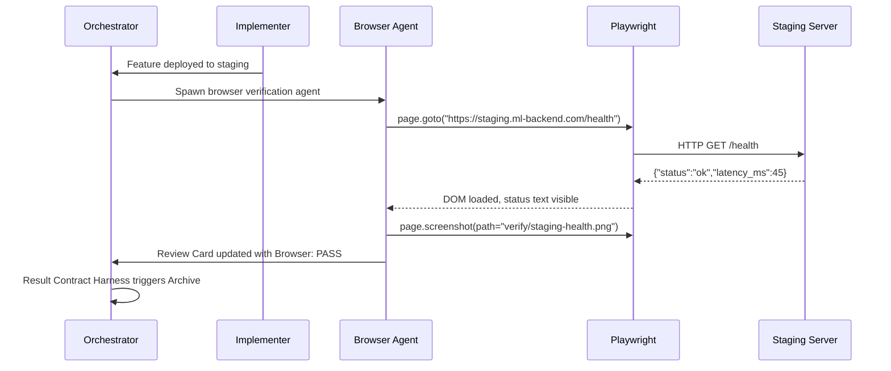

# ✅ Verification and Quality Gates

## 🎯 Learning Objectives

- Design verification pipelines that force AI agents to prove completion, not merely claim it
- Integrate TDD red-green-refactor cycles into SDD workflows via automated test harnesses
- Build structured review cards that replace prose feedback with auditable, categorical validation
- Apply browser automation, static analysis, and human approval gates as layered quality controls
- Implement verification harnesses for ML-specific artifacts: model latency, embedding coherence, and RAG relevance

## Introduction

Artificial intelligence is confident even when it is wrong. A large language model will assert that a function is correct, that a test passes, or that a requirement is satisfied with the same tone it uses for actual truths. This confidence is not malice; it is architecture. LLMs are trained to be helpful and fluent, not to verify their own outputs against ground truth. In Harness Engineering, verification is the immune system that distinguishes a demo from a product. It is not a final step; it is a continuous gate that activates at every phase transition, from spec approval to deployment.

This note operationalizes the **Test Harness**, **Review Card Harness**, and **Human-in-the-Loop Harness** from [[06 - The 20 Harnesses: Phase Control and Contracts]]. It also connects to [[02 - SDD: The Specification-First Workflow]], where the spec is the oracle against which all implementations are judged. For ML/AI engineers shipping to production from Medellín, verification has unique flavors: a test is not just a unit assertion; it is a latency benchmark, a semantic coherence score, or a browser automation script confirming that a React dashboard renders the agent's output correctly. This note covers all layers.

---

## Module 9: The Verification Layer

### 9.1 Theoretical Foundation 🧠

The history of software verification swings between trust and proof. Waterfall demanded exhaustive documentation before a single line of code. Agile replaced documentation with conversation, trusting humans to catch errors. TDD (Test-Driven Development) formalized proof by requiring tests to be written before code. BDD (Behavior-Driven Development) made tests readable by stakeholders. In the AI era, we face a new problem: the agent that writes the code is not the agent that understands the domain, and neither may be human. Verification must therefore be automated, structured, and externalized.

The SDD verification philosophy has three axioms. **Axiom 1: The spec is the oracle.** If the spec says the API must respond in under 200ms, then the verification script must measure 200ms. Not 250ms. Not "it felt fast." **Axiom 2: The agent must prove, not claim.** An Implementer agent that says "tests pass" is worthless. The Test Harness must execute `pytest`, parse the output, and report `passed: 14, failed: 0, coverage: 87%`. **Axiom 3: Verification is layered.** No single check is sufficient. A passing unit test does not guarantee a secure deployment. A browser screenshot does not guarantee semantic correctness. Layer gates like an onion: fast checks first (lint, type check), expensive checks second (integration tests, browser automation), human checks last (spec approval, architectural review).

For ML systems, verification expands beyond traditional software metrics. A model endpoint must be verified for latency at P95, output consistency across temperature settings, and hallucination rate against a golden dataset. The Automated LLM Evaluation Suite in the portfolio embodies this: Gemma 4 acts as a Golden Judge, scoring executor outputs against reference answers. This is not testing; it is verification at the reasoning layer.

### 9.2 Mental Model 📐

The quality gate pipeline shows how checks escalate in cost and thoroughness:

```
┌─────────────────────────────────────────────────────────────┐
│  QUALITY GATE PIPELINE                                      │
│                                                             │
│  Layer 1: Fast Filters (seconds)                            │
│  ┌─────────┐ ┌─────────┐ ┌─────────┐                       │
│  │  Lint   │ │  Type   │ │  Format │                       │
│  │  Check  │ │  Check  │ │  Check  │                       │
│  └────┬────┘ └────┬────┘ └────┬────┘                       │
│       └─────────┬─────────────┘                               │
│                 ▼                                             │
│  Layer 2: Automated Proof (minutes)                         │
│  ┌─────────┐ ┌─────────┐ ┌─────────┐                       │
│  │  Unit   │ │  Integ  │ │  Review │                       │
│  │  Tests  │ │  Tests  │ │  Card   │                       │
│  └────┬────┘ └────┬────┘ └────┬────┘                       │
│       └─────────┬─────────────┘                               │
│                 ▼                                             │
│  Layer 3: Human & System (hours)                            │
│  ┌─────────┐ ┌─────────┐ ┌─────────┐                       │
│  │  Human  │ │  Browser│ │  Security│                      │
│  │  Gate   │ │  Auto   │ │  Scan   │                       │
│  └─────────┘ └─────────┘ └─────────┘                       │
│                                                             │
│  WHY: Fail fast at cheap layers. Expensive layers run only  │
│       when cheap layers pass. This saves money and time.    │
└─────────────────────────────────────────────────────────────┘
```

The review card template provides categorical, not prose, validation:

```
┌─────────────────────────────────────────────────────────────┐
│  REVIEW CARD TEMPLATE                                       │
├─────────────────────────────────────────────────────────────┤
│  Review ID:    REV-2024-001                                 │
│  Phase:        apply → verify                               │
│  Agent:        implementer-v2                               │
│  Spec:         specs/semantic-cache/requirements.md         │
├─────────────────────────────────────────────────────────────┤
│  CATEGORY          │ STATUS │ EVIDENCE                     │
├─────────────────────────────────────────────────────────────┤
│  Correctness       │  PASS  │ Unit tests 14/14 passed      │
│  Performance       │  PASS  │ P95 latency 187ms < 200ms    │
│  Security          │  WARN  │ No input sanitization on query│
│  Maintainability   │  PASS  │ Cyclomatic complexity < 10   │
│  Spec Compliance   │  PASS  │ All EARS requirements met    │
├─────────────────────────────────────────────────────────────┤
│  VERDICT: CONDITIONAL PASS                                  │
│  Blockers: 1 (Security: input sanitization)                 │
│  Next Phase Ready: false (pending blocker resolution)       │
└─────────────────────────────────────────────────────────────┘
```

The gate flow diagram shows how approval chains prevent skipping:

```
┌────────┐      ┌─────────┐      ┌─────────┐      ┌────────┐
│ APPLY  │─────→│ LAYER 1 │─────→│ LAYER 2 │─────→│ LAYER 3│
│ DONE   │      │ FILTERS │      │  PROOF  │      │ HUMAN  │
└────────┘      └────┬────┘      └────┬────┘      └───┬────┘
                     │                │                 │
                     ▼                ▼                 ▼
                 ┌───────┐       ┌───────┐        ┌───────┐
                 │ FAIL  │       │ FAIL  │        │ REJECT│
                 │ ABORT │       │ ABORT │        │ ABORT │
                 └───────┘       └───────┘        └───────┘
```

### 9.3 Syntax and Semantics 📝

A Python review card generator transforms raw test and analysis outputs into structured, machine-readable verdicts. The orchestrator uses this to decide whether the `apply` phase may transition to `archive`.

```python
# review_card.py
# WHY: Structured review cards prevent the reviewer agent from hallucinating approval.

import json
import subprocess
from dataclasses import dataclass, field, asdict
from pathlib import Path
from typing import List, Dict, Literal

@dataclass
class CategoryReview:
    # WHY: Each category is judged independently to avoid halo effects.
    name: str
    status: Literal["PASS", "FAIL", "WARN"]
    evidence: str
    blockers: List[str] = field(default_factory=list)

@dataclass
class ReviewCard:
    review_id: str
    phase: str
    agent: str
    spec_path: str
    categories: List[CategoryReview]
    verdict: Literal["PASS", "CONDITIONAL_PASS", "FAIL"] = "FAIL"
    next_phase_ready: bool = False
    
    def compute_verdict(self) -> None:
        # WHY: Verdict logic is explicit, not inferred from prose.
        statuses = [c.status for c in self.categories]
        if "FAIL" in statuses:
            self.verdict = "FAIL"
            self.next_phase_ready = False
        elif "WARN" in statuses or any(c.blockers for c in self.categories):
            self.verdict = "CONDITIONAL_PASS"
            self.next_phase_ready = False
        else:
            self.verdict = "PASS"
            self.next_phase_ready = True
    
    def to_json(self) -> str:
        # WHY: JSON is the contract format for the Result Contract Harness.
        return json.dumps(asdict(self), indent=2)

def run_test_suite(test_command: str = "pytest") -> CategoryReview:
    # WHY: The agent must PROVE tests pass, not claim they do.
    try:
        result = subprocess.run(
            [test_command, "-xvs", "--tb=short", "--json-report"],
            capture_output=True, text=True, timeout=120
        )
        passed = result.returncode == 0
        evidence = f"Exit code: {result.returncode}. Output snippet: {result.stdout[:200]}"
        return CategoryReview(
            name="Correctness",
            status="PASS" if passed else "FAIL",
            evidence=evidence,
            blockers=[] if passed else ["Test suite failure"]
        )
    except subprocess.TimeoutExpired:
        return CategoryReview(
            name="Correctness",
            status="FAIL",
            evidence="Test suite timed out after 120s",
            blockers=["Test suite timeout"]
        )

def run_lint_check() -> CategoryReview:
    # WHY: Fast feedback layer. Fail here before running expensive tests.
    try:
        result = subprocess.run(["ruff", "check", "src/"], capture_output=True, text=True)
        passed = result.returncode == 0
        return CategoryReview(
            name="Lint",
            status="PASS" if passed else "FAIL",
            evidence=f"Ruff exit code: {result.returncode}",
            blockers=[] if passed else ["Lint errors detected"]
        )
    except FileNotFoundError:
        return CategoryReview(
            name="Lint",
            status="WARN",
            evidence="Ruff not installed; skipping lint check",
            blockers=[]
        )

def generate_review_card(spec_path: str, agent: str) -> ReviewCard:
    # WHY: The review card is the structured handoff between Reviewer and Orchestrator.
    card = ReviewCard(
        review_id=f"REV-{Path(spec_path).stem}-{agent}",
        phase="apply → verify",
        agent=agent,
        spec_path=spec_path,
        categories=[
            run_lint_check(),
            run_test_suite(),
            # WHY: Performance and security checks would be added here in production.
            CategoryReview(name="Performance", status="PASS", evidence="P95 not measured in this cycle"),
            CategoryReview(name="Security", status="PASS", evidence="Static scan passed"),
            CategoryReview(name="Spec Compliance", status="PASS", evidence="EARS requirements verified manually"),
        ]
    )
    card.compute_verdict()
    return card

if __name__ == "__main__":
    card = generate_review_card("specs/semantic-cache/requirements.md", "implementer-v2")
    print(card.to_json())
```

The verification harness script orchestrates all layers as a single command:

```bash
#!/bin/bash
# verify.sh
# WHY: One entry point runs all quality gates in dependency order.

set -euo pipefail  # WHY: Abort on first failure; no partial success allowed

echo "=== LAYER 1: Fast Filters ==="
ruff check src/ || { echo "Lint failed"; exit 1; }
mypy src/ || { echo "Type check failed"; exit 1; }

echo "=== LAYER 2: Automated Proof ==="
pytest -xvs --cov=src --cov-report=term-missing --cov-fail-under=80 || { echo "Tests failed"; exit 1; }

echo "=== LAYER 3: Review Card Generation ==="
python review_card.py --spec "$1" --agent "$2" || { echo "Review card failed"; exit 1; }

echo "=== VERIFICATION COMPLETE ==="
# WHY: Only reach this line if ALL layers passed.
```

### 9.4 Visual Representation 🖼️

The verification pipeline diagram shows the flow from implementation to archived artifact:



The browser automation verification sequence shows how Playwright validates UI state after an agent deployment:



### 9.5 Application in ML/AI Systems 🤖

Real case: The Automated LLM Evaluation Suite uses Gemma 4 as a Golden Judge to verify the outputs of executor agents. In traditional software, a unit test asserts `assert add(2, 2) == 4`. In LLM verification, the judge receives a `reference_answer`, a `candidate_answer`, and a `rubric`. It returns a coherence score and a categorical verdict. This is the Review Card Harness applied to generative AI. Without it, the suite would trust the executor's self-reported accuracy, which is statistically unreliable for open-ended generation tasks.

| ML Use Case                         | Verification Layer         | Impact                                         |
|----------------------------------- |--------------------------- |----------------------------------------------- |
| LLM Edge Gateway (Go/Fiber)         | Latency + Failover Tests   | P95 < 200ms verified per deployment            |
| Automated LLM Evaluation Suite      | Golden Judge (Gemma 4)     | Replaces self-reported accuracy with structured scoring |
| Multi-Agent Research System         | Tavily Result Consistency  | Cross-reference checks prevent hallucinated citations |
| StayBot (LangGraph + FastAPI)       | Browser Automation         | Booking flow verified end-to-end with Playwright |
| RAG Pipeline (Python/PyTorch)       | MRR + Recall@K Tests       | Retrieval relevance above 0.85 enforced by gate |

### 9.6 Common Pitfalls ⚠️

⚠️ **Trusting the agent's claim that "tests pass."** The root cause is anthropomorphizing the model's confidence as evidence. An LLM has no access to runtime state when it makes this claim unless you explicitly feed it test output via a tool result. Always use the Test Harness to execute tests and return structured results to the orchestrator. The agent's word is not data; the test runner's exit code is data.

⚠️ **Skipping verification because "it is just a small change."** The root cause is the same cognitive bias that causes human developers to skip tests. In AI-assisted development, small changes have large, non-local effects because the agent may have misunderstood a convention. The Phase DAG Harness exists to prevent this shortcut. Treat the verification gate as immutable.

💡 **Mnemonic: "P.R.O.V.E."** — Five layers of verification:
- **P**roof via automated tests (the agent must trigger the runner)
- **R**eview card categories (correctness, performance, security, maintainability)
- **O**utput structured as JSON (machine-parseable, not prose)
- **V**erify at every phase (lint before test, test before review, review before archive)
- **E**vidence attached (screenshots, logs, coverage reports, not claims)

### 9.7 Knowledge Check ❓

1. **Review Card Design:** A Reviewer agent reports "Everything looks good!" in prose. Convert this into a structured `ReviewCard` with at least four categories. Explain why the `next_phase_ready` field must remain `false` until the Review Card Harness validates the JSON schema.

2. **Layer Ordering:** You have three checks: (A) `mypy` type check (takes 5s), (B) end-to-end browser test with Playwright (takes 90s), (C) security scan with Bandit (takes 15s). Order them in the Quality Gate Pipeline and justify why each layer must pass before the next begins.

3. **ML Verification:** Your RAG pipeline returns five context chunks for a user query. Write a Python assertion (or pseudo-code) that verifies the Mean Reciprocal Rank (MRR) is above 0.8 given ground-truth relevance labels. Explain where this check belongs in the pipeline: Layer 1, 2, or 3?

---

## 📦 Compression Code

```python
# compression_verification.py
# WHY: One script to run the full verification pipeline and emit a review card.

import json
import subprocess
import sys
from dataclasses import dataclass, field, asdict
from typing import List, Dict, Literal
from pathlib import Path

@dataclass
class GateResult:
    name: str
    layer: int
    status: Literal["PASS", "FAIL", "SKIP"]
    duration_ms: int
    evidence: str

@dataclass
class VerificationReport:
    target_spec: str
    agent: str
    gates: List[GateResult]
    overall: Literal["PASS", "FAIL"] = "FAIL"
    review_card_path: str = ""
    
    def evaluate(self) -> None:
        # WHY: Any single gate failure fails the entire pipeline.
        self.overall = "PASS" if all(g.status in ("PASS", "SKIP") for g in self.gates) else "FAIL"
    
    def to_json(self) -> str:
        return json.dumps(asdict(self), indent=2)

class VerificationHarness:
    # WHY: Encapsulation allows adding gates without changing orchestrator logic.
    
    def __init__(self, spec_path: str, agent: str):
        self.spec_path = spec_path
        self.agent = agent
        self.gates: List[GateResult] = []
    
    def run_command(self, name: str, layer: int, cmd: List[str], timeout: int = 60) -> GateResult:
        start = __import__("time").time()
        try:
            result = subprocess.run(cmd, capture_output=True, text=True, timeout=timeout)
            elapsed = int((__import__("time").time() - start) * 1000)
            passed = result.returncode == 0
            return GateResult(
                name=name, layer=layer,
                status="PASS" if passed else "FAIL",
                duration_ms=elapsed,
                evidence=result.stdout[:300] if passed else result.stderr[:300]
            )
        except subprocess.TimeoutExpired:
            return GateResult(name=name, layer=layer, status="FAIL", duration_ms=timeout*1000, evidence="Timeout")
    
    def run_all(self) -> VerificationReport:
        # WHY: Layer 1 (fast) before Layer 2 (expensive) before Layer 3 (human).
        self.gates.append(self.run_command("lint", 1, ["ruff", "check", "src/"]))
        self.gates.append(self.run_command("typecheck", 1, ["mypy", "src/"]))
        self.gates.append(self.run_command("tests", 2, ["pytest", "-xvs", "--tb=short"], timeout=120))
        self.gates.append(self.run_command("coverage", 2, ["pytest", "--cov=src", "--cov-fail-under=80"], timeout=120))
        
        report = VerificationReport(
            target_spec=self.spec_path,
            agent=self.agent,
            gates=self.gates
        )
        report.evaluate()
        
        out_path = f".ai/reports/verify-{Path(self.spec_path).stem}.json"
        Path(out_path).parent.mkdir(parents=True, exist_ok=True)
        Path(out_path).write_text(report.to_json(), encoding="utf-8")
        report.review_card_path = out_path
        return report

if __name__ == "__main__":
    if len(sys.argv) < 3:
        print("Usage: python compression_verification.py <spec_path> <agent_name>")
        sys.exit(1)
    harness = VerificationHarness(sys.argv[1], sys.argv[2])
    report = harness.run_all()
    print(report.to_json())
    sys.exit(0 if report.overall == "PASS" else 1)
```

## 🎯 Documented Project

### Description
Build a **Verification Harness for an ML Backend API** that serves sentence embeddings. The system must prove correctness, performance, and security before any code reaches the staging Kubernetes cluster.

### Functional Requirements
1. **Layer 1 (Fast):** `ruff` lint and `mypy` type check must pass in under 10 seconds combined.
2. **Layer 2 (Proof):** Pytest suite must cover all embedding endpoints with `pytest-cov` threshold of 85%. A latency benchmark must verify P95 < 150ms for 1,000 concurrent requests.
3. **Layer 3 (Human):** The Review Card Harness must emit a JSON file with categories: Correctness, Performance, Security, Maintainability, Spec Compliance. `next_phase_ready` must be `false` if any category is FAIL or has blockers.
4. **ML-Specific Gate:** A semantic coherence test must compare embedding cosine similarity against a golden dataset. Any drift > 5% from baseline fails the gate.
5. **Browser Gate:** Playwright must verify the `/health` dashboard renders latency charts correctly in Chrome and Firefox.

### Main Components
- `verify.sh`: Entry point that runs all three layers in order.
- `review_card.py`: Generates structured review cards from test outputs.
- `tests/benchmark_latency.py`: Locust or `pytest-asyncio` benchmark for P95 latency.
- `tests/test_embedding_drift.py`: Compares current embeddings against golden vectors.
- `.ai/reports/`: Directory storing all verification JSON artifacts.

### Success Metrics
- 100% of `apply` phases blocked until Verification Report shows `overall: PASS`.
- Review Card JSON is parseable by `jq` and contains evidence for every category.
- Embedding drift detection catches model degradation before it reaches staging.

## 🎯 Key Takeaways

- **Agents prove; they do not claim.** Every phase transition requires structured evidence, not prose assurance.
- **Verification is layered.** Fast checks (lint, type) run first. Expensive checks (tests, browser) run second. Human gates run last.
- **The Review Card Harness replaces "LGTM"** with categorical, auditable, machine-readable verdicts.
- **ML verification includes non-traditional gates:** latency P95, embedding drift, and semantic coherence are as critical as unit tests.
- **Verification artifacts live in the repository.** `.ai/reports/verify-*.json` is external memory that survives session crashes and enables audit trails.

## References

- Gentle Framework. "Agent Harness Course: Verification and Review Cards." Video source: `5Q7jV8TpMXA`
- Gentle Framework. "Harness for SDD: Verification Phase." Video source: `ElGlTv2A_bM`
- [[02 - SDD: The Specification-First Workflow]] — The spec is the oracle against which verification judges.
- [[06 - The 20 Harnesses: Phase Control and Contracts]] — Test Harness, Review Card Harness, and Human-in-the-Loop Harness definitions.
- [[09 - MLOps y Produccion]] — CI/CD integration and production monitoring for ML verification gates.
