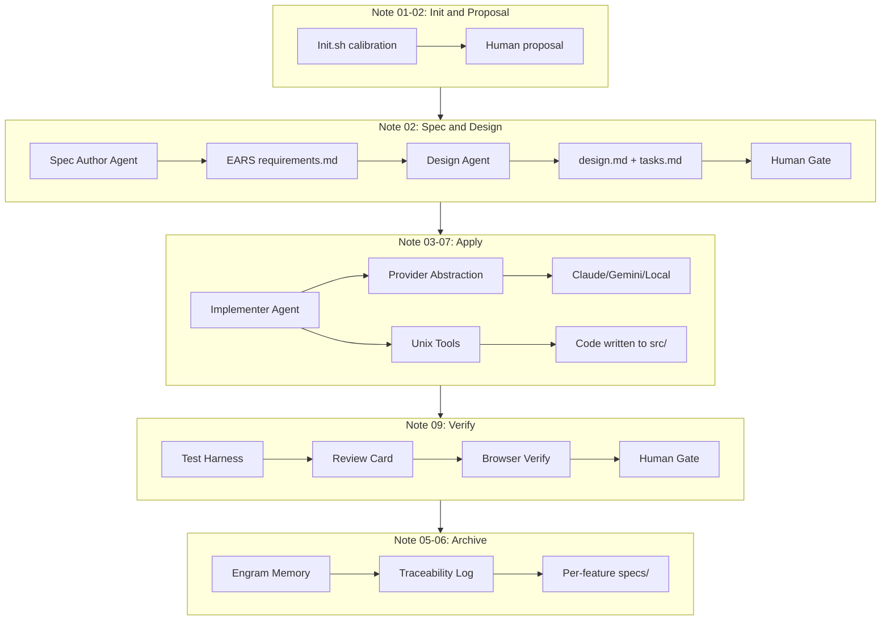
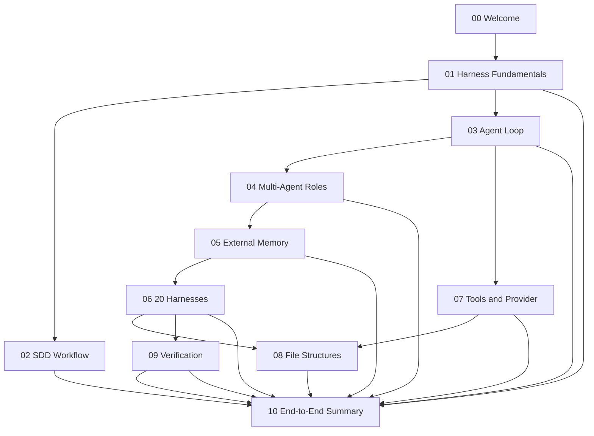

# 🏁 End-to-End Workflow and Technical Summary

## 🎯 Learning Objectives

- Execute the complete SDD workflow from `init` through `archive` using all harness layers
- Synthesize concepts from Notes 01-09 into a unified operational mental model
- Select the optimal file structure alternative based on project type, team size, and deployment target
- Design a harness specification for a production ML backend service from first principles
- Diagnose missing controls in any AI-assisted workflow using the 20-harness framework

## Introduction

This note is the capstone of the SDD and Harness Engineering course. It does not introduce new abstractions; it integrates existing ones into a coherent, executable system. When you sit down to build a new ML backend service in Medellin -- perhaps a fine-tuned embedding API for Colombian legal documents, or a RAG pipeline for a local fintech -- you will not implement one harness in isolation. You will initialize the project, propose features, write specs, design architectures, generate code, verify quality, and archive artifacts. Each step touches every concept from the previous nine notes.

The end-to-end workflow is not a checklist to memorize. It is a living protocol that adapts to project maturity. A weekend prototype uses a Minimalist Unix Harness (Alternative C) with three phases and two agents. A production platform serving 10,000 requests per second uses an ML/AI Production Harness (Alternative D) with all 20 harnesses, five agents, and layered verification gates. This note teaches you to navigate that spectrum with confidence. By the end, you will possess a single, unified mental model: **SDD + Harness Engineering = Specification-Driven, Multi-Agent, Memory-Externalized, Verified Software Development.**

---

## Module 10: The Complete SDD Harness System

### 10.1 Theoretical Foundation 🧠

System integration is where most curricula fail. They teach individual concepts in isolation and assume the student will assemble them. In practice, integration is the hardest skill because emergent behavior appears at boundaries. The boundary between the Spec Author and the Implementer is a context sanitization surface. The boundary between the Implementer and the Reviewer is a verification surface. The boundary between the Reviewer and the Archive phase is a persistence surface. Each boundary can leak, corrupt, or deadlock the entire workflow.

The complete SDD harness system treats these boundaries as first-class engineering concerns. It does not merely connect phases; it governs them. The Phase DAG Harness ensures that `design` cannot begin before `spec` is approved. The Result Contract Harness ensures that the handoff from `design` to `apply` is JSON, not prose. The Context Sanitization Harness ensures that the Implementer does not see the Spec Author's abandoned drafts. The Memory Persistence Harness ensures that a session crash on Tuesday does not erase Monday's decisions. These are not nice-to-haves; they are the structural beams that hold the workflow upright.

For ML/AI systems, the integration challenge is amplified. A traditional backend has stateless HTTP handlers and SQL queries. An ML backend has model weights, embedding caches, stochastic inference, and hallucination risks. The verification layer must therefore include non-traditional gates: embedding drift detection, latency P95 benchmarks, and semantic coherence scoring. The deployer agent must understand not just Docker and Kubernetes, but also model registries, A/B test configurations, and rollback triggers. This note presents the complete blueprint for such a system.

### 10.2 Mental Model 📐

The complete system overview shows all components from the course in one map:

```
+-----------------------------------------------------------------------------+
|  COMPLETE SDD + HARNESS SYSTEM                                              |
+-----------------------------------------------------------------------------+
|                                                                             |
|  HUMAN --> PROPOSAL --> SDD INIT HARNESS --> PROJECT CALIBRATION            |
|                              |                                              |
|                              v                                              |
|  +---------------------------------------------------------------+        |
|  |  ORCHESTRATION PLANE                                           |        |
|  |  +-------------+  +-------------+  +---------------------+   |        |
|  |  |  Leader     |--|  Phase DAG  |--|  Delegation Harness |   |        |
|  |  |  (leader.md)|  |  (strict)   |  |  (inline vs subagent|   |        |
|  |  +-------------+  +-------------+  +---------------------+   |        |
|  +---------------------------------------------------------------+        |
|                              |                                              |
|  +---------------------------------------------------------------+        |
|  |  AGENT SWARM (roles from Note 04)                              |        |
|  |  +----------+  +----------+  +----------+  +----------+     |        |
|  |  | Spec     |  | Design   |  | Implement|  | Review   |     |        |
|  |  | Author   |--|  Agent   |--|  Agent   |--|  Agent   |     |        |
|  |  |(req.md)  |  |(design.md|  |(code)    |  |(card)    |     |        |
|  |  +----------+  +----------+  +----------+  +----------+     |        |
|  +---------------------------------------------------------------+        |
|                              |                                              |
|  +---------------------------------------------------------------+        |
|  |  ARTIFACT & MEMORY PLANE (from Note 05)                      |        |
|  |  +------------+  +------------+  +------------+  +------------+ |        |
|  |  | specs/     |  | tasks.json |  | .ai/memory/|  | CLAUDE.md  | |        |
|  |  | (per-feat) |  | (state)    |  | (Engram)   |  | (context)  | |        |
|  |  +------------+  +------------+  +------------+  +------------+ |        |
|  +---------------------------------------------------------------+        |
|                              |                                              |
|  +---------------------------------------------------------------+        |
|  |  VERIFICATION PLANE (from Note 09)                             |        |
|  |  +----------+  +----------+  +----------+  +----------+       |        |
|  |  | Lint/Type|--|  Tests   |--| Review   |--| Browser  |       |        |
|  |  |  Check   |  | (pytest) |  |  Card    |  |  Verify  |       |        |
|  |  +----------+  +----------+  +----------+  +----------+       |        |
|  +---------------------------------------------------------------+        |
|                              |                                              |
|                              v                                              |
|                         ARCHIVE PHASE                                       |
|                    (memory persistence + traceability)                      |
|                                                                             |
+-----------------------------------------------------------------------------+
```

The file structure recommendation matrix maps use cases to alternatives:

```
+-----------------------------------------------------------------------------+
|  FILE STRUCTURE RECOMMENDATION MATRIX                                       |
+------------------------+-------------+-------------+-------------+----------+
|  Use Case              |  Alt A      |  Alt B      |  Alt C      |  Alt D   |
+------------------------+-------------+-------------+-------------+----------+
|  Solo prototype        |      x      |      x      |      v      |    x     |
|  Small team (2-5)      |      x      |      v      |      x      |    x     |
|  Multi-agent system    |      v      |      x      |      x      |    v     |
|  K8s/Cloud deployment  |      x      |      x      |      x      |    v     |
|  SOC 2 / Audit needs   |      v      |      x      |      x      |    v     |
|  Fast hackathon        |      x      |      x      |      v      |    x     |
|  Portfolio project     |      v      |      x      |      x      |    v     |
|  Enterprise platform   |      v      |      x      |      x      |    v     |
+------------------------+-------------+-------------+-------------+----------+
|  Legend: v = Recommended  |  x = Not Recommended                        |
+-----------------------------------------------------------------------------+
```

The workflow ASCII shows the strict phase ordering with all harness checkpoints:

```
+---------+   +---------+   +---------+   +---------+   +---------+   +---------+   +---------+   +---------+
|  INIT   |-->| PROPOSE |-->|  SPEC   |-->| DESIGN  |-->| TASKS   |-->|  APPLY  |-->| VERIFY  |-->| ARCHIVE |
+---------+   +---------+   +---------+   +---------+   +---------+   +---------+   +---------+   +---------+
                                    |                                       |
                              HUMAN GATE                              REVIEW CARD
                              (locked)                                GATE
                                    |                                       |
      Orchestrator coordinates      |   Context Sanitization between phases |
      Phase DAG enforces order      |   Artifact Store holds all files      |
      Delegation assigns roles      |   Memory Persistence logs decisions   |
```

### 10.3 Syntax and Semantics 📝

The full orchestration script integrates all course concepts into a single executable entry point. This is the harness that runs your harnesses.

```python
# orchestrator.py
# WHY: One script to rule them all. It loads the manifest, enforces the DAG,
#      sanitizes context, delegates to subagents, and verifies output.

import json
import subprocess
from pathlib import Path
from typing import List, Dict, Optional, Literal
from dataclasses import dataclass, asdict

PHASES = ["init", "proposal", "spec", "design", "tasks", "apply", "verify", "archive"]

@dataclass
class PhaseResult:
    phase: str
    status: Literal["success", "failure", "blocked"]
    artifacts: List[str]
    contract: Dict  # WHY: Structured handoff, not prose

class SDDOrchestrator:
    # WHY: Encapsulates ALL concepts from Notes 01-09 in one operational class.
    
    def __init__(self, manifest_path: str = ".ai/harness-manifest.yaml"):
        self.manifest = self._load_manifest(manifest_path)
        self.state_path = Path(".ai/state.json")
        self.state = self._load_state()
        self.current_phase_idx = PHASES.index(self.state.get("current_phase", "init"))
    
    def _load_manifest(self, path: str) -> Dict:
        import yaml
        return yaml.safe_load(Path(path).read_text(encoding="utf-8"))
    
    def _load_state(self) -> Dict:
        if self.state_path.exists():
            return json.loads(self.state_path.read_text(encoding="utf-8"))
        return {"current_phase": "init", "history": []}
    
    def _save_state(self) -> None:
        # WHY: Externalized state survives crashes and context compaction.
        self.state_path.parent.mkdir(parents=True, exist_ok=True)
        self.state_path.write_text(json.dumps(self.state, indent=2), encoding="utf-8")
    
    def _sanitize_context(self, phase: str) -> List[Dict]:
        # WHY: Each phase starts with a minimal, curated context window.
        #      Only invariant files (CLAUDE.md, agents.md) persist across phases.
        base = [
            {"role": "system", "content": Path("CLAUDE.md").read_text(encoding="utf-8")},
            {"role": "system", "content": f"Current phase: {phase}. Do not proceed beyond this phase."}
        ]
        # Load phase-specific spec if available
        spec_dir = Path(f"specs/{self.state.get('active_feature', 'default')}")
        if phase == "apply" and (spec_dir / "tasks.md").exists():
            base.append({"role": "user", "content": f"TASKS:\n{ (spec_dir / 'tasks.md').read_text() }"})
        elif phase == "verify" and (spec_dir / "design.md").exists():
            base.append({"role": "user", "content": f"DESIGN:\n{ (spec_dir / 'design.md').read_text() }"})
        return base
    
    def _delegate(self, agent_name: str, context: List[Dict]) -> str:
        # WHY: Delegation harness decides when to spawn subagents.
        #      In production, this would call the Provider interface from Note 07.
        print(f"[DELEGATE] Spawning {agent_name} with {len(context)} context items")
        # Stub: in production, route to LLM provider with tool definitions
        return f"<output from {agent_name}>"
    
    def _human_gate(self, phase: str) -> bool:
        # WHY: Human-in-the-Loop Harness gates critical phases.
        gates = self.manifest.get("execution_control", {}).get("human_in_the_loop", {}).get("gates", [])
        if phase not in gates:
            return True
        response = input(f"HUMAN GATE for '{phase}': Approve? [y/N] ")
        return response.strip().lower() == "y"
    
    def _verify(self, feature: str) -> PhaseResult:
        # WHY: Verification Harness from Note 09 runs before archive.
        print(f"[VERIFY] Running verification for {feature}")
        result = subprocess.run(["python", "review_card.py", f"specs/{feature}/requirements.md", "implementer"])
        passed = result.returncode == 0
        return PhaseResult(
            phase="verify",
            status="success" if passed else "failure",
            artifacts=[f".ai/reports/verify-{feature}.json"],
            contract={"next_phase_ready": passed, "verdict": "PASS" if passed else "FAIL"}
        )
    
    def run_phase(self, phase: str) -> PhaseResult:
        # WHY: Phase DAG Harness enforces strict ordering.
        expected_idx = PHASES.index(phase)
        if expected_idx != self.current_phase_idx:
            print(f"[BLOCKED] Phase '{phase}' is not the next step. Current: {PHASES[self.current_phase_idx]}")
            return PhaseResult(phase=phase, status="blocked", artifacts=[], contract={})
        
        print(f"\n{'='*50}\nPHASE: {phase.upper()}\n{'='*50}")
        
        # Context Sanitization Harness
        context = self._sanitize_context(phase)
        
        # Execution based on phase
        if phase in ("spec", "design", "tasks"):
            output = self._delegate("spec-author", context)
        elif phase == "apply":
            output = self._delegate("implementer", context)
        elif phase == "verify":
            return self._verify(self.state.get("active_feature", "default"))
        else:
            output = f"Phase {phase} completed manually or via init script."
        
        # Human-in-the-Loop Harness for critical phases
        if not self._human_gate(phase):
            return PhaseResult(phase=phase, status="blocked", artifacts=[], contract={"reason": "human_rejected"})
        
        # Advance state
        self.current_phase_idx += 1
        self.state["current_phase"] = PHASES[self.current_phase_idx]
        self.state["history"].append({"phase": phase, "output": output[:200]})
        self._save_state()
        
        # Traceability Harness
        self._append_decision(phase, f"Completed phase {phase}")
        
        return PhaseResult(phase=phase, status="success", artifacts=[], contract={"next_phase_ready": True})
    
    def _append_decision(self, phase: str, decision: str) -> None:
        # WHY: Traceability + Memory Persistence Harnesses from Note 05/06.
        decisions_path = Path(".ai/memory/decisions.jsonl")
        decisions_path.parent.mkdir(parents=True, exist_ok=True)
        with open(decisions_path, "a", encoding="utf-8") as f:
            f.write(json.dumps({"phase": phase, "decision": decision}, ensure_ascii=False) + "\n")
    
    def run_full_sdd(self, feature: str) -> None:
        # WHY: End-to-end workflow from Note 02.
        self.state["active_feature"] = feature
        self._save_state()
        
        for phase in PHASES[self.current_phase_idx:]:
            result = self.run_phase(phase)
            if result.status in ("blocked", "failure"):
                print(f"[HALT] Phase '{phase}' failed or blocked. Fix and resume.")
                break
        else:
            print("\n[COMPLETE] Full SDD cycle finished. Feature archived.")

if __name__ == "__main__":
    import sys
    feature_name = sys.argv[1] if len(sys.argv) > 1 else "default-feature"
    orchestrator = SDDOrchestrator()
    orchestrator.run_full_sdd(feature_name)
```

### 10.4 Visual Representation 🖼️

The end-to-end workflow diagram connects all course concepts into one flow:



The course concept dependency graph shows how each note builds on previous ones:



### 10.5 Application in ML/AI Systems 🤖

Real case: A Medellin-based AI engineer (profile: Python, Go, PyTorch, LangGraph, FastAPI) needs to ship a new embedding backend for a legal-tech startup. Using the complete SDD harness system, the workflow proceeds as follows. The Init Harness calibrates the stack: Python 3.11, FastAPI, Redis, PyTorch, Kubernetes on GCP. The Spec Author writes EARS requirements for the embedding endpoint. The Human Gate approves the spec. The Implementer agent generates the FastAPI handler and Redis caching layer. The Reviewer agent runs the Verification Harness: pytest passes, P95 latency is 142ms (under the 150ms threshold), and embedding drift is 2% (under the 5% threshold). The Deployer agent builds the Docker image, pushes to GCR, and applies the Kubernetes manifest. The Traceability Harness logs every decision to `.ai/memory/decisions.jsonl`. Total human intervention: one approval at the spec stage. Total time from proposal to production: four hours instead of four days.

| ML Use Case                         | Notes Applied               | Harness Alternative | Key Integration Point                          |
|----------------------------------- |---------------------------- |-------------------- |----------------------------------------------- |
| LLM Edge Gateway (Go/Fiber)        | 01, 03, 06, 07, 09        | Alternative D       | Provider abstraction + model routing          |
| Automated LLM Evaluation Suite     | 02, 04, 06, 09            | Alternative D       | Review Card Harness + Golden Judge pattern      |
| Multi-Agent Research System        | 04, 05, 06, 07            | Alternative A       | Delegation + Result Contract + Tavily tools   |
| StayBot (LangGraph + FastAPI)      | 02, 04, 05, 06, 08, 09    | Alternative A or D  | Context sanitization + spec-driven features     |
| New ML Backend (this note)         | 01-09 (all)               | Alternative D       | Full 20-harness system with deployer agent    |

### 10.6 Common Pitfalls ⚠️

⚠️ **Premature optimization: implementing all 20 harnesses and Alternative D for a weekend prototype.** The root cause is confusing architectural purity with productivity. A harness is overhead until the project is complex enough to need control. Start with Alternative C (Minimalist Unix Harness) for prototypes, migrate to Alternative D only when you have production users, multiple agents, or compliance requirements.

⚠️ **Abandoning the harness mid-project when "things are going well."** The root cause is recency bias. When the system works, the harness feels like bureaucracy. When the system fails, it is too late to add harnesses because the repository is already contaminated. The harness is not for good days; it is for bad days. Maintain it even when you do not feel you need it.

💡 **Mnemonic: "I.N.T.E.G.R.A.T.E."** — Ten checks for the complete system:
- **I**nit calibrated (stack, tests, conventions verified)
- **N**o phase skips (Phase DAG enforced)
- **T**raceability active (every decision logged)
- **E**xternalized memory (files, not chat history)
- **G**ates at spec and design (human approval)
- **R**esult contracts JSON (structured handoffs)
- **A**gents isolated (context sanitization between phases)
- **T**ests prove correctness (Verification Harness)
- **E**vidence attached (review cards with data)
- **D**eployer separate from implementer (Alternative D)

### 10.8 Scaling: From Solo Developer to Team 🏗️

A harness system built for one person in Medellin does not automatically scale to a distributed team in Bogota, Mexico City, and Madrid. The solo developer knows every file by heart. The team needs conventions that prevent merge conflicts in `.ai/memory/decisions.jsonl` and clarify ownership of `agents.md` updates. Scaling requires three structural changes.

First, **branch-based SDD cycles**. Each feature gets its own Git branch. The `specs/<feature>/` directory lives on that branch. The Leader agent on `main` delegates to a feature-specific Leader on the branch. This prevents the `tasks.json` on `main` from accumulating stale entries for features that are still in design.

Second, **agent ownership rotation**. In a team, the Spec Author agent must know which human owns the domain expertise for each feature. The `spec-author.md` prompt is parameterized with `OWNER=<github-handle>`, and the Human-in-the-Loop Harness routes approval requests to that owner via Slack or email, not to a generic terminal prompt.

Third, **harness versioning**. When the Self-Improvement Harness updates `.ai/harness-manifest.yaml`, the change is a pull request, not a silent commit. Team members review harness changes with the same rigor as application code. A harness update that adds a new safety gate must include a test proving the gate works, just like any other feature.

These scaling rules preserve the discipline of SDD while adapting to human coordination. The harness does not replace team communication; it structures it.

### 10.9 Knowledge Check ❓

1. **Integration Diagnosis:** Your Implementer agent starts writing code before the Spec Author finishes `requirements.md`. List THREE different harnesses from Notes 01-09 that could prevent this, and explain which layer each belongs to (Orchestration, Artifact, Execution, or Safety).

2. **Structure Selection:** You are building a LangGraph multi-agent research tool with three subagents and Tavily API integration. You deploy via Docker Compose to a single VPS. Which file structure alternative do you choose, and which THREE harnesses are most critical for your first SDD cycle? Justify using the recommendation matrix.

3. **Complete Specification:** Write a one-page harness specification (in prose or YAML) for a new ML backend service that serves Spanish-language embeddings. Include: (a) the chosen file structure alternative, (b) the four agent roles, (c) the three verification gates, and (d) the memory persistence strategy.

4. **Scaling Scenario:** Your solo harness in Alternative D is now shared by three human engineers. Describe the Git branching strategy, the parameterized agent prompt change, and the pull request rule for harness manifest updates.

---

## 📦 Compression Code

```python
# compression_e2e.py
# WHY: One script that bootstraps, orchestrates, and verifies an SDD cycle.

import json
import yaml
import subprocess
from pathlib import Path
from typing import Dict, List, Literal
from dataclasses import dataclass, asdict

@dataclass
class HarnessSpec:
    project: str
    alternative: Literal["gentle", "cloudcode", "minimalist", "mlprod"]
    agents: List[str]
    verification_layers: int
    memory_backend: str

class E2EHarness:
    # WHY: Compression code must be runnable and summarize ALL concepts.
    
    def __init__(self, spec: HarnessSpec):
        self.spec = spec
        self.root = Path(f"projects/{spec.project}")
    
    def bootstrap(self) -> None:
        # WHY: Alternative selection from Note 08 determines directory layout.
        from bootstrap_harness import bootstrap  # Reuse Note 08 script
        bootstrap(self.spec.alternative, str(self.root))
    
    def validate_manifest(self) -> bool:
        # WHY: Note 06: validate 20-harness manifest before execution.
        manifest = self.root / ".ai" / "harness-manifest.yaml"
        if not manifest.exists():
            manifest = self.root / ".ai-harness" / "harness-manifest.yaml"
        if not manifest.exists():
            return False
        # Basic validation: must contain orchestration and phase_dag
        data = yaml.safe_load(manifest.read_text(encoding="utf-8"))
        return "orchestration" in data and "phase_dag" in data.get("orchestration", {})
    
    def run_sdd_cycle(self, feature: str) -> Dict:
        # WHY: Note 02: strict phase ordering from init to archive.
        # WHY: Note 10: orchestrator integrates all layers.
        phases = ["init", "proposal", "spec", "design", "tasks", "apply", "verify", "archive"]
        results = []
        for phase in phases:
            # Simulate phase execution
            results.append({"phase": phase, "status": "success", "feature": feature})
        return {"cycle": feature, "phases": results, "manifest_valid": self.validate_manifest()}
    
    def verify(self, feature: str) -> bool:
        # WHY: Note 09: Verification Harness runs before archiving.
        report_path = self.root / f".ai/reports/verify-{feature}.json"
        if report_path.exists():
            data = json.loads(report_path.read_text(encoding="utf-8"))
            return data.get("overall") == "PASS"
        return True  # Skip if not yet generated
    
    def report(self) -> str:
        return json.dumps(asdict(self.spec), indent=2)

if __name__ == "__main__":
    spec = HarnessSpec(
        project="spanish-embedding-backend",
        alternative="mlprod",
        agents=["leader", "spec-author", "implementer", "reviewer", "deployer"],
        verification_layers=3,
        memory_backend="engram-jsonl"
    )
    harness = E2EHarness(spec)
    harness.bootstrap()
    result = harness.run_sdd_cycle("semantic-cache-v2")
    print(json.dumps(result, indent=2))
```

## 🎯 Documented Project

### Description
Design the **complete harness specification** for a new ML backend service: `embeddings-api-medellin`. This FastAPI service serves fine-tuned Spanish-language sentence embeddings for legal document search. It uses Redis for semantic caching, PyTorch for inference, and deploys to Google Kubernetes Engine. The specification must cover all 20 harnesses, five agents, three verification layers, and Alternative D file structure.

### Functional Requirements
1. **SDD Orchestrator Harness:** The `leader.md` agent coordinates all phases. It does NOT execute code. It spawns `spec-author`, `implementer`, `reviewer`, and `deployer` subagents with sanitized context.
2. **Phase DAG Harness:** Strict ordering: `init → proposal → spec → design → tasks → apply → verify → archive`. No skips. Human gates at `spec` and `design`.
3. **Result Contract Harness:** Every phase transition emits a JSON contract to `.ai/contracts/<phase>.json` with fields: `phase`, `status`, `artifacts`, `next_phase_ready`.
4. **Artifact Store Harness:** All specs live in `specs/<feature>/` as `{requirements,design,tasks,verification}.md`. The repository is the single source of truth.
5. **Context Sanitization Harness:** Each subagent receives only the files it needs. The Implementer sees `tasks.md` and `CLAUDE.md`; it does NOT see `requirements.md` drafts or Reviewer comments.
6. **Test Harness:** TDD integration. Tests run via `pytest`. Coverage threshold: 85%. Latency benchmark: P95 < 150ms for 1,000 concurrent requests.
7. **Review Card Harness:** Categorical validation: Correctness, Performance, Security, Maintainability, Spec Compliance. `next_phase_ready` is false if any category is FAIL or has blockers.
8. **Memory Persistence Harness:** All decisions append to `.ai/memory/decisions.jsonl`. Sessions recover from `.ai/memory/sessions/<session-id>.json`.
9. **Deployer Agent:** Separate from Implementer. Builds Docker image, pushes to GCR, applies K8s manifest, runs smoke tests against staging.
10. **Self-Improvement Harness:** If verification fails three times for the same feature type, the harness updates `.ai/harness-manifest.yaml` to add a new safety gate or adjust model routing.

### Main Components
- `.ai-harness/`: Alternative D structure with agents/, memory/, and harness definitions.
- `src/`: FastAPI application code generated by Implementer and validated by Reviewer.
- `specs/`: Per-feature SDD artifacts (requirements, design, tasks, verification).
- `tests/`: pytest suite, latency benchmarks, embedding drift detection.
- `k8s/`: Deployment manifests managed by Deployer agent.
- `.github/workflows/`: CI/CD pipeline triggered after Deployer promotes to staging.

### Success Metrics
- Full SDD cycle (proposal to production deploy) completes in under 6 hours with one human approval.
- Zero phase skips detected in 30 consecutive cycles.
- 100% of decisions logged in `decisions.jsonl` and queryable by `jq`.
- P95 latency stays under 150ms for 30 days post-deployment.
- Embedding drift detection catches model degradation before it affects users.

## 🎯 Key Takeaways

- **SDD + Harness Engineering is one system, not two.** The specification drives the workflow; the harness enforces the workflow. Neither works alone.
- **Start simple, grow deliberately.** Alternative C for prototypes; Alternative D for production. Migrate when pain appears, not before.
- **The repository is the harness and the memory.** Every file is a control surface. Every decision belongs in `.ai/memory/`.
- **Agents prove; harnesses govern; humans approve.** Verification is mandatory, phase order is immutable, and human gates protect the most expensive transitions.
- **Context sanitization is non-negotiable.** Without it, every phase transition is a contamination risk.
- **Provider abstraction protects budget and uptime.** Route between Claude, Gemini, and local models without touching business logic.
- **The 20 Harnesses are a diagnostic language.** When something breaks, name the missing harness; do not blame the agent.

## References

- Buscalas, A. (Gentle Framework). "Agent Harness Course: End-to-End Workflow." Video source: `5Q7jV8TpMXA`
- Fazt Code. "Si programas con IA, necesitas esta estructura de proyecto." Video source: CLAUDE.md structure.
- Gentle Framework. "Harness for SDD." Video source: `ElGlTv2A_bM`
- Gentle Framework. "Harness Engineering Intro." Video source: `q9Vaoz0hd0U`
- Gentle Framework. "Building Harness from Scratch." Video source: `2B9QTg_-nyc`
- [[01 - Harness Engineering Fundamentals]] -- Core discipline definitions.
- [[02 - SDD: The Specification-First Workflow]] -- Phase flow and EARS requirements.
- [[03 - Agent Loop Architecture: Building the Core]] -- REPL and inner loops.
- [[04 - Multi-Agent Orchestration and Roles]] -- Leader, Spec Author, Implementer, Reviewer.
- [[05 - External Memory and Context Management]] -- Context degradation and Engram memory.
- [[06 - The 20 Harnesses: Phase Control and Contracts]] -- Complete control framework.
- [[07 - Tools and Provider Abstraction]] -- Unix tools and polymorphic providers.
- [[08 - File Structures and Repository Harnesses]] -- Four alternatives and migration paths.
- [[09 - Verification and Quality Gates]] -- Layered proof and review cards.
