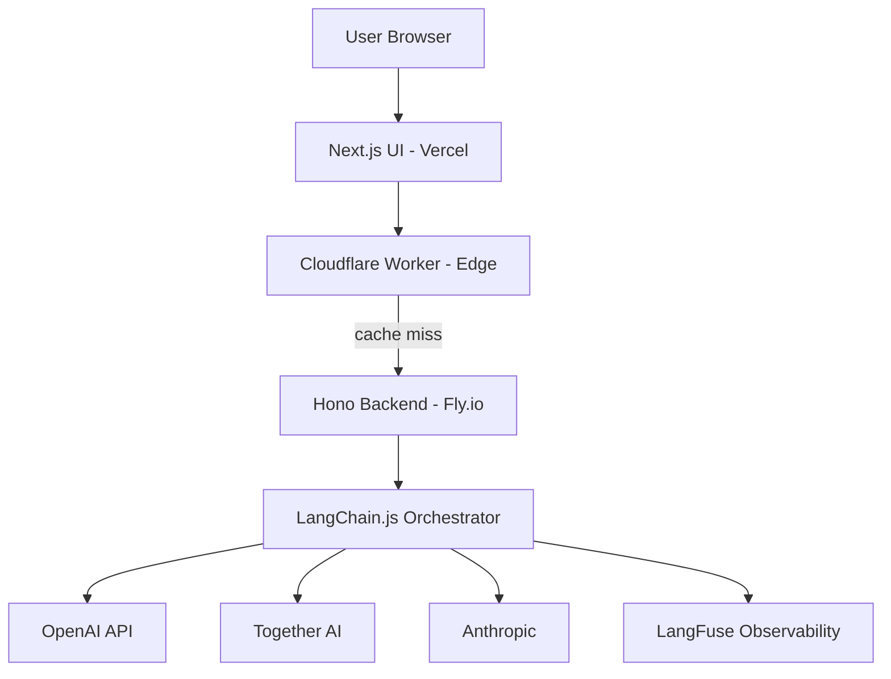
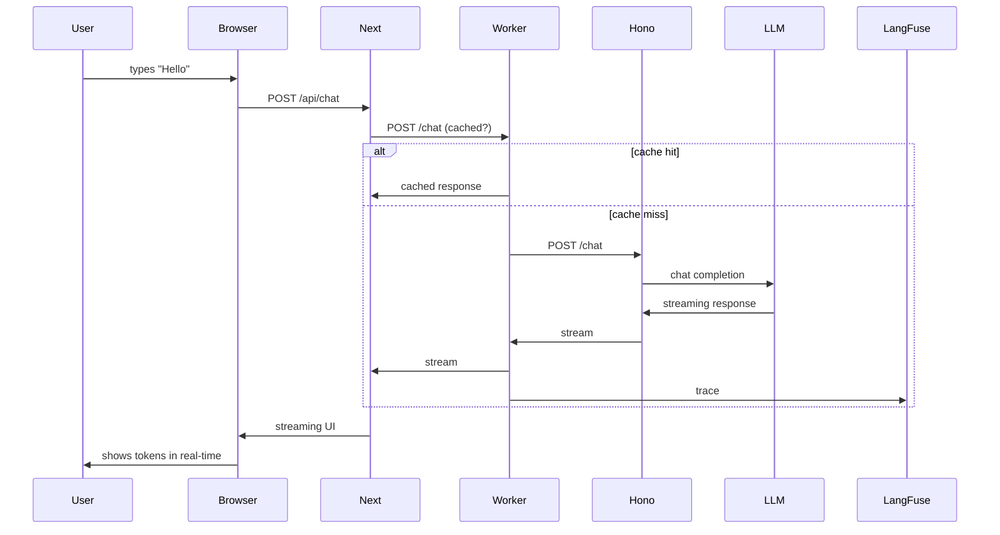

# 🎯 05 - Capstone — Building a Full-Stack TypeScript AI App

> **The fifteenth portfolio project. End-to-end TypeScript AI app: Next.js frontend + Hono backend + Cloudflare Workers edge proxy + LangChain.js orchestrator. Deploy with one command.**

## 🎯 Learning Objectives
- Build a complete full-stack AI application in TypeScript
- Use Next.js for the frontend with streaming chat UI
- Build a Hono backend with LangChain.js for orchestration
- Deploy a Cloudflare Worker as an edge proxy
- Connect to multiple LLM providers with cost-aware routing
- Add observability with LangFuse TypeScript SDK
- Deploy the entire stack with one command

## Introduction

The capstone is the **synthesis** of all four notes. You will build a complete production-shaped AI application:

```
                    ┌─────────────────┐
   Browser ────────►│  Next.js 15 UI   │ (Vercel)
                    │ (Streaming Chat) │
                    └────────┬────────┘
                             │ HTTPS
                             ▼
                    ┌─────────────────┐
   Browser ────────►│ Cloudflare Worker│ (Edge <50ms)
   Edge Cache       │ (LLM Proxy + KV) │
                    └────────┬────────┘
                             │ HTTPS
                             ▼
                    ┌─────────────────┐
                    │  Hono Backend    │ (Fly.io / Railway)
                    │ (LangChain.js)   │
                    └────────┬────────┘
                             │
              ┌──────────────┼──────────────┐
              ▼              ▼              ▼
         ┌────────┐    ┌──────────┐    ┌──────────┐
         │OpenAI  │    │Together  │    │ Anthropic│
         └────────┘    └──────────┘    └──────────┘
```

The capstone is the **fifteenth portfolio project**: full-stack AI engineering.



---

## 1. Project Layout

```
typescript-ai-app/
├── apps/
│   ├── web/                    # Next.js frontend
│   │   ├── app/
│   │   ├── package.json
│   │   └── tsconfig.json
│   ├── worker/                 # Cloudflare Worker
│   │   ├── src/
│   │   ├── wrangler.toml
│   │   └── package.json
│   └── api/                    # Hono backend
│       ├── src/
│       ├── package.json
│       └── tsconfig.json
├── packages/
│   └── shared/                 # Shared types
│       ├── src/
│       └── package.json
├── docker-compose.yml
├── package.json
└── pnpm-workspace.yaml
```

---

## 2. The Shared Types (`packages/shared`)

```typescript
// packages/shared/src/types.ts
import { z } from "zod";

export const ChatMessageSchema = z.object({
    role: z.enum(["user", "assistant", "system"]),
    content: z.string(),
});

export const ChatRequestSchema = z.object({
    messages: z.array(ChatMessageSchema),
    model: z.enum(["gpt-4o", "gpt-4o-mini", "claude-3-5-sonnet", "llama-3-70b"]).default("gpt-4o-mini"),
    stream: z.boolean().default(true),
});

export type ChatRequest = z.infer<typeof ChatRequestSchema>;

export const ChatResponseSchema = z.object({
    content: z.string(),
    model: z.string(),
    usage: z.object({
        inputTokens: z.number(),
        outputTokens: z.number(),
    }),
    costUsd: z.number(),
    latencyMs: z.number(),
});

export type ChatResponse = z.infer<typeof ChatResponseSchema>;
```

---

## 3. The Next.js Frontend (`apps/web`)

```typescript
// apps/web/app/page.tsx
"use client";

import { useChat } from "ai/react";
import { useState } from "react";

export default function ChatPage() {
    const [model, setModel] = useState("gpt-4o-mini");
    
    const { messages, input, handleInputChange, handleSubmit, isLoading, error } = useChat({
        api: "/api/chat",
        body: { model },
    });
    
    return (
        <div className="flex flex-col h-screen max-w-4xl mx-auto p-4">
            <header className="border-b pb-4 mb-4">
                <h1 className="text-2xl font-bold">TypeScript AI Chat</h1>
                <select 
                    value={model} 
                    onChange={(e) => setModel(e.target.value)}
                    className="mt-2 p-2 border rounded"
                >
                    <option value="gpt-4o-mini">GPT-4o Mini (cheap)</option>
                    <option value="gpt-4o">GPT-4o (quality)</option>
                    <option value="claude-3-5-sonnet">Claude 3.5 Sonnet</option>
                    <option value="llama-3-70b">Llama 3 70B (Together)</option>
                </select>
            </header>
            
            <div className="flex-1 overflow-y-auto">
                {messages.map(m => (
                    <div
                        key={m.id}
                        className={`mb-4 p-3 rounded-lg ${m.role === "user" ? "bg-blue-100" : "bg-gray-100"}`}
                    >
                        <div className="text-xs text-gray-500">{m.role}</div>
                        <div>{m.content}</div>
                    </div>
                ))}
                
                {isLoading && (
                    <div className="text-gray-500 animate-pulse">Thinking...</div>
                )}
                {error && (
                    <div className="text-red-500">Error: {error.message}</div>
                )}
            </div>
            
            <form onSubmit={handleSubmit} className="border-t pt-4">
                <div className="flex">
                    <input
                        value={input}
                        onChange={handleInputChange}
                        placeholder="Ask anything..."
                        className="flex-1 p-2 border rounded-l"
                        disabled={isLoading}
                    />
                    <button
                        type="submit"
                        disabled={isLoading}
                        className="p-2 bg-blue-500 text-white rounded-r"
                    >
                        Send
                    </button>
                </div>
            </form>
        </div>
    );
}
```

The Next.js API route:
```typescript
// apps/web/app/api/chat/route.ts
export async function POST(req: Request) {
    const { messages, model } = await req.json();
    
    // Forward to the Hono backend (or worker, depending on routing)
    const response = await fetch(process.env.API_URL + "/chat", {
        method: "POST",
        headers: {
            "Content-Type": "application/json",
            "Authorization": `Bearer ${process.env.API_TOKEN}`,
        },
        body: JSON.stringify({ messages, model }),
    });
    
    // Stream the response back
    return new Response(response.body, {
        headers: {
            "Content-Type": "text/event-stream",
            "Cache-Control": "no-cache",
        },
    });
}
```

---

## 4. The Cloudflare Worker (Edge Proxy)

```typescript
// apps/worker/src/index.ts
import { Hono } from "hono";

export interface Env {
    AI: Ai;
    KV: KVNamespace;
    CACHE_TTL: string;
    BACKEND_URL: string;
}

const app = new Hono<{ Bindings: Env }>();

app.post("/chat", async (c) => {
    const { messages, model } = await c.req.json();
    
    // Cache key based on messages hash
    const cacheKey = await hashMessages(messages, model);
    
    // Check cache
    const cached = await c.env.KV.get(cacheKey);
    if (cached) {
        return c.json(JSON.parse(cached), 200, { "X-Cache": "HIT" });
    }
    
    // Cache miss: forward to backend
    const response = await fetch(c.env.BACKEND_URL + "/chat", {
        method: "POST",
        headers: { "Content-Type": "application/json" },
        body: JSON.stringify({ messages, model }),
    });
    
    // Stream response
    const body = response.body!;
    
    // Cache the response (after streaming, harder; do async)
    const clonedBody = body.pipeThrough(new TransformStream({
        transform(chunk, controller) {
            controller.enqueue(chunk);
        },
    }));
    
    // Cache asynchronously (best effort)
    response.json().then(json => {
        c.env.KV.put(cacheKey, JSON.stringify(json), {
            expirationTtl: parseInt(c.env.CACHE_TTL),
        });
    }).catch(() => {});
    
    return new Response(clonedBody, {
        headers: {
            "Content-Type": "text/event-stream",
            "Cache-Control": "no-cache",
        },
    });
});

async function hashMessages(messages: any[], model: string): Promise<string> {
    const text = JSON.stringify({ messages, model });
    const hash = await crypto.subtle.digest("SHA-256", new TextEncoder().encode(text));
    return Array.from(new Uint8Array(hash))
        .map(b => b.toString(16).padStart(2, "0"))
        .join("");
}

export default app;
```

---

## 5. The Hono Backend (LangChain.js Orchestrator)

```typescript
// apps/api/src/index.ts
import { Hono } from "hono";
import { ChatOpenAI } from "@langchain/openai";
import { ChatAnthropic } from "@langchain/anthropic";
import { ChatOpenAI as ChatTogether } from "@langchain/community/chat_models/openai";
import { ChatPromptTemplate } from "@langchain/core/prompts";
import { StringOutputParser } from "@langchain/core/output_parsers";
import { LangChainAdapter } from "ai/langchain";
import { Langfuse } from "langfuse";

export interface Env {
    OPENAI_API_KEY: string;
    ANTHROPIC_API_KEY: string;
    TOGETHER_API_KEY: string;
    LANGFUSE_PUBLIC_KEY: string;
    LANGFUSE_SECRET_KEY: string;
}

const langfuse = new Langfuse({
    publicKey: process.env.LANGFUSE_PUBLIC_KEY!,
    secretKey: process.env.LANGFUSE_SECRET_KEY!,
});

const app = new Hono<{ Bindings: Env }>();

app.post("/chat", async (c) => {
    const { messages, model } = await c.req.json();
    
    const start = Date.now();
    
    // Choose model
    let llm;
    let costMultiplier: number;
    
    switch (model) {
        case "gpt-4o":
            llm = new ChatOpenAI({ model: "gpt-4o" });
            costMultiplier = 1.0;
            break;
        case "gpt-4o-mini":
            llm = new ChatOpenAI({ model: "gpt-4o-mini" });
            costMultiplier = 0.04;
            break;
        case "claude-3-5-sonnet":
            llm = new ChatAnthropic({ model: "claude-3-5-sonnet-20241022" });
            costMultiplier = 1.2;
            break;
        case "llama-3-70b":
            llm = new ChatTogether({
                model: "meta-llama/Llama-3.3-70B-Instruct-Turbo",
                apiKey: c.env.TOGETHER_API_KEY,
                configuration: { baseURL: "https://api.together.xyz/v1" },
            });
            costMultiplier = 0.06;
            break;
        default:
            return c.json({ error: "Unknown model" }, 400);
    }
    
    // RAG-friendly prompt
    const prompt = ChatPromptTemplate.fromMessages([
        ["system", "You are a helpful AI assistant. Answer concisely."],
        ...messages,
    ]);
    
    const chain = prompt.pipe(llm).pipe(new StringOutputParser());
    
    // Stream to client
    const stream = await chain.stream({});
    
    // Trace to LangFuse
    const trace = langfuse.trace({
        name: "chat-completion",
        metadata: { model, costMultiplier },
    });
    
    return LangChainAdapter.toDataStreamResponse(stream);
});

export default app;
```

Deployment:
```bash
# Deploy to Fly.io or Railway
fly deploy
```

---

## 6. The Single Docker Compose (Local Dev)

```yaml
version: "3.9"

services:
  web:
    build: ./apps/web
    ports:
      - "3000:3000"
    environment:
      - API_URL=http://api:8000
    depends_on:
      - api

  worker:
    build: ./apps/worker
    ports:
      - "8787:8787"
    environment:
      - BACKEND_URL=http://api:8000
      - CACHE_TTL=3600
    depends_on:
      - api

  api:
    build: ./apps/api
    ports:
      - "8000:8000"
    environment:
      - OPENAI_API_KEY=${OPENAI_API_KEY}
      - ANTHROPIC_API_KEY=${ANTHROPIC_API_KEY}
      - TOGETHER_API_KEY=${TOGETHER_API_KEY}
      - LANGFUSE_PUBLIC_KEY=${LANGFUSE_PUBLIC_KEY}
      - LANGFUSE_SECRET_KEY=${LANGFUSE_SECRET_KEY}
```

```bash
docker compose up
```

The full stack runs locally:
- Frontend: http://localhost:3000
- Worker: http://localhost:8787
- API: http://localhost:8000

---

## 7. Deployment to Production

```bash
# Frontend: Vercel
cd apps/web
vercel deploy --prod

# Worker: Cloudflare
cd apps/worker
wrangler deploy

# Backend: Fly.io
cd apps/api
fly deploy
```

Three commands, three clouds. The exact production deployment.

---

## 8. The Production Workflow



---

## 9. Production Deployment Checklist

- [ ] OpenAI + Anthropic + Together API keys in Vault
- [ ] LangFuse cloud account for observability
- [ ] Vercel project for web; Cloudflare for worker; Fly.io for API
- [ ] CORS configured properly
- [ ] Rate limiting at the worker (token bucket per tenant)
- [ ] Cost tracking via LangFuse metadata
- [ ] Error handling + retry logic in API
- [ ] Health checks for all services
- [ ] TLS certificates (automatic via Vercel/Cloudflare/Fly)
- [ ] Monitoring with Sentry or similar

---

## 🎯 Key Takeaways

- The capstone composes all four notes into a full-stack TypeScript AI app.
- Three deployments: Next.js (Vercel), Worker (Cloudflare), API (Fly.io).
- Single docker-compose for local dev with all three services.
- Streaming chat UI with `useChat` + LangChainAdapter.
- Cost-aware routing across OpenAI, Anthropic, Together AI.
- LangFuse TypeScript SDK for observability.
- The capstone is the **fifteenth portfolio project**: full-stack AI engineering.

## References

- Next.js — [nextjs.org](https://nextjs.org)
- Cloudflare Workers — [developers.cloudflare.com/workers](https://developers.cloudflare.com/workers)
- Hono — [hono.dev](https://hono.dev)
- LangChain.js — [js.langchain.com](https://js.langchain.com)
- Vercel AI SDK — [sdk.vercel.ai](https://sdk.vercel.ai)
- LangFuse TypeScript — [langfuse.com/docs/sdk/typescript](https://langfuse.com/docs/sdk/typescript)
- [[17 - TypeScript Engineering/01 - TypeScript for AI Engineers/01 - TypeScript Fundamentals|Note 01 — TS Fundamentals]]
- [[17 - TypeScript Engineering/01 - TypeScript for AI Engineers/02 - Next.js + Vercel AI SDK|Note 02 — Next.js]]
- [[17 - TypeScript Engineering/01 - TypeScript for AI Engineers/03 - Cloudflare Workers for Edge AI|Note 03 — Cloudflare Workers]]
- [[17 - TypeScript Engineering/01 - TypeScript for AI Engineers/04 - LangChain.js + AI SDK Integration|Note 04 — LangChain.js]]
- [[06 - Large Language Models/19 - LLM Gateway Patterns and LiteLLM|LLM Gateway Patterns]] — Python counterpart
- [[09 - MLOps y Produccion/36 - LangFuse - Open-Source LLM Observability|LangFuse Deep Dive]]