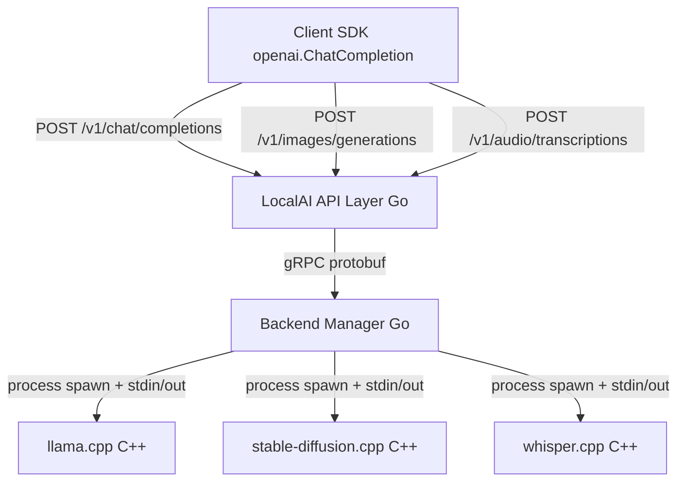
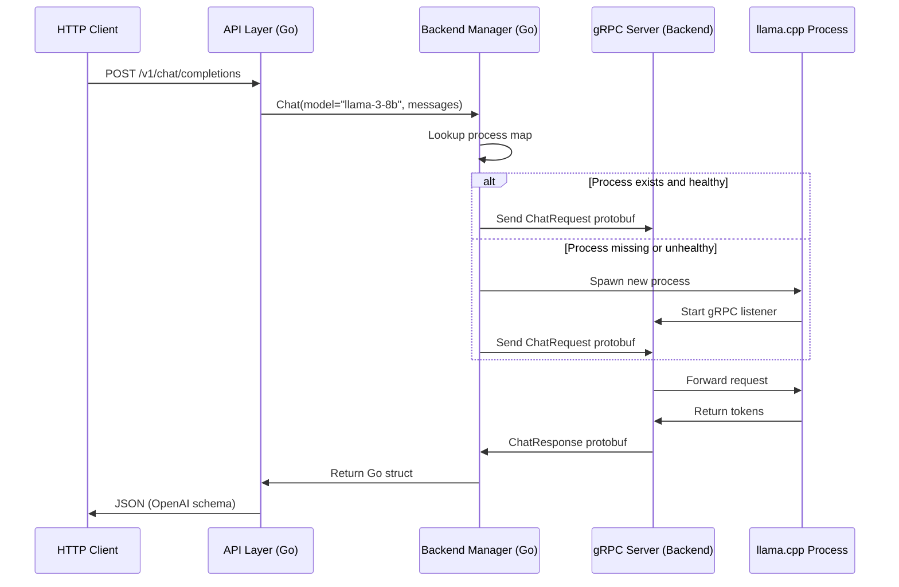

# Architecture and OpenAI API Compatibility 🏗️

## 🎯 Learning Objectives
- Understand the layered architecture of LocalAI and how each layer isolates concerns
- Learn how Go's standard library and gRPC provide the foundation for backend orchestration
- Master the design rationale behind API compatibility: why mirroring OpenAI unlocks ecosystem portability
- Connect LocalAI's design to [[01 - Go Fundamentals]] concurrency patterns and [[Docker Profesional]] container strategies

---

## Introduction

When engineering ML systems, the most expensive decision is often not the model choice but the integration surface. Every custom API requires new client libraries, authentication logic, retry policies, and documentation. LocalAI's central architectural bet is that **API compatibility is a form of portability**: by speaking the exact same REST dialect as OpenAI, it inherits an ecosystem of thousands of clients, agents, and frameworks without writing a single additional SDK line. This module deconstructs how LocalAI achieves this compatibility through a clean, layered architecture written in Go.

This matters deeply for ML/AI engineering because production systems rarely run a single model. They run a constellation of models—chat, embeddings, vision, audio—each with different resource requirements. LocalAI's architecture uses a backend manager pattern to isolate these concerns. If you have studied [[01 - Go Fundamentals]], you will recognize how interfaces and goroutines enable this decoupling. If you are familiar with [[M02 - Large Language Models]], you will appreciate why quantization-aware backends like llama.cpp need a thin, language-agnostic wrapper to fit into a larger service mesh.

---

## Module 1: The API Layer

### 1.1 Theoretical Foundation 🧠

The concept of API compatibility as architectural strategy has roots in the Liskov Substitution Principle and platform economics. In software engineering, an interface is a contract. When an ecosystem builds millions of lines of code against a contract (the OpenAI API), any new implementation satisfying that contract can substitute the original without breaking downstream consumers. This is not merely technical convenience; it is a network effect. LocalAI leverages this effect by re-implementing the OpenAI REST surface area, effectively becoming a "drop-in" node in an existing graph of tools.

Historically, local inference tools were fragmented. llama.cpp had its own server format, stable-diffusion had another, and whisper yet another. Developers wishing to self-host had to maintain multiple client libraries or write brittle adapters. LocalAI's API layer solves this fragmentation by providing a single ingress point. The design motivation is **unification through emulation**: rather than forcing the world to adopt a new standard, adopt the dominant standard and implement it locally. This is the same strategy that made Linux successful (POSIX compatibility) and that makes WebAssembly compelling (WASM compatibility).

```
┌─────────────────────────────────────────────┐
│  API Compatibility as Substitution           │
├─────────────────────────────────────────────┤
│                                             │
│   Client Code (Python, JS, Go)              │
│         │                                   │
│         ▼                                   │
│   ┌─────────────┐                           │
│   │ OpenAI SDK  │                           │
│   └──────┬──────┘                           │
│          │                                  │
│   ┌──────┴──────┐      ┌──────────────┐    │
│   │   OpenAI    │  or  │   LocalAI    │    │
│   │   Cloud     │      │   Server     │    │
│   └──────┬──────┘      └──────┬───────┘    │
│          │                    │             │
│     ┌────┴────┐          ┌────┴────┐       │
│     │  GPT-4  │          │ llama.cpp│       │
│     └─────────┘          └─────────┘       │
│                                             │
│  Same client code works with both because  │
│  the API contract (REST schema) is identical│
│                                             │
└─────────────────────────────────────────────┘
```

### 1.2 Mental Model 📐

Think of LocalAI as a **universal translator** that receives requests in "OpenAI language" and forwards them to backends that speak "C++ inference dialects." The translator never changes the meaning; it only changes the transport and format.

```
┌─────────────────────────────────────────────┐
│  Universal Translator Pattern               │
├─────────────────────────────────────────────┤
│                                             │
│   REQUEST  ──►  ┌──────────────┐            │
│   (OpenAI      │   LocalAI     │            │
│    JSON)       │   API Layer   │            │
│                └──────┬───────┘            │
│                       │                     │
│           ┌───────────┼───────────┐         │
│           ▼           ▼           ▼         │
│      ┌────────┐  ┌────────┐  ┌────────┐    │
│      │ llama  │  │stable- │  │whisper │    │
│      │ .cpp   │  │diffusion│  │ .cpp   │    │
│      └────────┘  └────────┘  └────────┘    │
│                                             │
│   RESPONSE ◄──  (translated back to         │
│   (OpenAI       OpenAI JSON schema)         │
│    JSON)                                    │
│                                             │
└─────────────────────────────────────────────┘
```

### 1.3 Syntax and Semantics 📝

LocalAI's API layer is written in Go. It uses standard `net/http` handlers to parse OpenAI-shaped JSON and translate it into internal protobuf messages for backends.

```go
// pkg/api/openai.go
package api

import (
	"encoding/json"
	"net/http"
)

// ChatCompletionRequest mirrors OpenAI's request schema.
// WHY: struct tags enforce JSON field names identical to OpenAI's spec,
// allowing any SDK deserializing OpenAI responses to work unmodified.
type ChatCompletionRequest struct {
	Model    string  `json:"model"`    // e.g., "llama-3-8b"
	Messages []Message `json:"messages"` // conversation history
	Stream   bool    `json:"stream"`   // WHY: SSE streaming for real-time UX
	Temperature float32 `json:"temperature"` // sampling randomness
}

// Message represents a single chat turn.
type Message struct {
	Role    string `json:"role"`    // "system", "user", "assistant"
	Content string `json:"content"` // prompt text
}

// HandleChatCompletions is the HTTP handler for POST /v1/chat/completions.
// WHY: the route string matches OpenAI exactly so clients need zero config changes.
func (a *API) HandleChatCompletions(w http.ResponseWriter, r *http.Request) {
	var req ChatCompletionRequest
	if err := json.NewDecoder(r.Body).Decode(&req); err != nil {
		http.Error(w, err.Error(), http.StatusBadRequest)
		return
	}

	// WHY: delegate to the backend manager rather than calling llama.cpp directly.
	// This keeps the API layer agnostic of which C++ backend is active.
	resp, err := a.BackendManager.Chat(req.Model, req.Messages, req.Stream)
	if err != nil {
		http.Error(w, err.Error(), http.StatusInternalServerError)
		return
	}

	w.Header().Set("Content-Type", "application/json")
	// WHY: write the response using the same JSON shape OpenAI uses.
	json.NewEncoder(w).Encode(resp)
}
```

### 1.4 Visual Representation 🖼️




### 1.5 Application in ML/AI Systems 🤖

Real case: A mid-sized legal-tech company in Berlin built a contract-review assistant using LangChain and OpenAI. When client contracts grew in sensitivity, they could not risk sending clauses to the cloud. By switching their `OPENAI_BASE_URL` to an internal LocalAI instance running Mistral-7B-Instruct, the entire LangChain pipeline continued to work without a single line of code change. The only migration task was converting the model weights to GGUF and writing a YAML configuration file.

| ML Use Case | This Concept | Impact |
|-------------|-------------|--------|
| LangChain agent migration | OpenAI-compatible REST surface | Zero client-code changes |
| Multi-tenant SaaS | Single API schema across all tenants | Unified billing and logging |
| On-premise RAG pipeline | `/v1/embeddings` + `/v1/chat/completions` | End-to-end local retrieval-augmented generation |

### 1.6 Common Pitfalls ⚠️

⚠️ **Assuming 100% feature parity** — LocalAI covers the common OpenAI endpoints, but niche features like function-calling schemas may lag. Always verify the endpoint support matrix in the official documentation.

⚠️ **Ignoring streaming semantics** — OpenAI uses Server-Sent Events (SSE) for streaming. If your client expects `data: {...}\n\n` chunks and LocalAI sends plain JSON, the client parser will break.

💡 **Mnemonic: REST-pect the contract** — If you respect the JSON schema and HTTP status codes, the ecosystem respects you back.

### 1.7 Knowledge Check ❓

1. Why does LocalAI choose to emulate OpenAI's API rather than invent a new REST schema?
2. In the Go code above, why does `HandleChatCompletions` delegate to `BackendManager` instead of importing llama.cpp directly?
3. Draw the data flow from a Python client to the llama.cpp process, naming each layer.

---

## Module 2: The Backend Manager

### 2.1 Theoretical Foundation 🧠

The Backend Manager is the beating heart of LocalAI. It solves a classic systems problem: **how do you multiplex access to scarce, stateful, heavyweight resources?** Each backend process (llama.cpp, whisper.cpp, etc.) loads gigabytes of model weights into RAM or VRAM. Spawning a new process per request is prohibitively expensive. The Backend Manager therefore implements a process-pool pattern with gRPC communication, keeping backends alive and routing requests to the correct one based on the model name.

This concept has deep roots in operating systems. The Backend Manager is essentially a user-space scheduler. It maintains a registry of running backends, their health, and their resource usage. When a request arrives for model "llama-3-8b," the manager checks if a backend process is already warmed up. If yes, it reuses it. If no, it spawns one according to the YAML configuration. This design avoids the cold-start latency that plagues serverless inference platforms.

```
┌─────────────────────────────────────────────┐
│  Backend Manager as User-Space Scheduler    │
├─────────────────────────────────────────────┤
│                                             │
│   Request for "llama-3-8b"                  │
│         │                                   │
│         ▼                                   │
│   ┌──────────────┐                          │
│   │   Backend    │                          │
│   │   Manager    │                          │
│   └──────┬───────┘                          │
│          │                                  │
│    Is process running?                      │
│         /          \                        │
│      YES            NO                      │
│       │              │                      │
│       ▼              ▼                      │
│   ┌────────┐    ┌──────────┐               │
│   │ Route  │    │  Spawn   │               │
│   │ gRPC   │    │  Process │               │
│   │ Request│    │  + Model │               │
│   └────────┘    └──────────┘               │
│                                             │
│   Pool size = 1 per model (default)         │
│   WHY: model weights are memory-heavy;      │
│   running duplicates wastes VRAM            │
│                                             │
└─────────────────────────────────────────────┘
```

### 2.2 Mental Model 📐

Think of the Backend Manager as a **concierge at a hotel**. Guests (HTTP requests) arrive asking for different rooms (models). The concierge knows which rooms are occupied (running processes) and which need cleaning (cold start). The concierge speaks both the guest's language (OpenAI JSON) and the hotel staff's language (gRPC protobuf).

```
┌─────────────────────────────────────────────┐
│  Concierge Analogy                          │
├─────────────────────────────────────────────┤
│                                             │
│   Guest: "Room llama-3-8b, please"          │
│         │                                   │
│         ▼                                   │
│   ┌──────────────┐                          │
│   │  Concierge   │                          │
│   │(Backend Mgr) │                          │
│   └──────┬───────┘                          │
│          │                                  │
│   ┌──────┴──────┐      ┌──────────────┐    │
│   │ Room Ready  │      │ Prepare Room │    │
│   │  (gRPC)     │      │ (spawn proc) │    │
│   └─────────────┘      └──────────────┘    │
│                                             │
│   WHY: the guest never talks to housekeeping│
│   directly; the concierge abstracts it      │
│                                             │
└─────────────────────────────────────────────┘
```

### 2.3 Syntax and Semantics 📝

```go
// pkg/backend/manager.go
package backend

import (
	"fmt"
	"sync"
)

// ModelProcess represents a running backend for a specific model.
// WHY: we wrap the process in a struct so we can attach health,
// last-used time, and gRPC client in one place.
type ModelProcess struct {
	ModelName   string
	ProcessID   int
	GRPCClient  interface{} // gRPC client stub (simplified)
	LastUsed    int64       // Unix timestamp for LRU eviction
	Healthy     bool
}

// Manager is the singleton orchestrator for all backends.
// WHY: a single manager ensures we do not accidentally spawn
// duplicate processes for the same model, wasting GPU memory.
type Manager struct {
	mu       sync.RWMutex
	processes map[string]*ModelProcess // key = model name
}

// NewManager creates a backend manager.
func NewManager() *Manager {
	return &Manager{
		processes: make(map[string]*ModelProcess),
	}
}

// GetOrCreateProcess returns a warm backend or starts a new one.
// WHY: this is the core multiplexing logic. It turns stateful,
// heavy C++ processes into a reusable service pool.
func (m *Manager) GetOrCreateProcess(modelName string) (*ModelProcess, error) {
	m.mu.RLock()
	p, exists := m.processes[modelName]
	m.mu.RUnlock()

	if exists && p.Healthy {
		// WHY: update last-used so LRU eviction knows this is active
		p.LastUsed = time.Now().Unix()
		return p, nil
	}

	m.mu.Lock()
	defer m.mu.Unlock()

	// Double-check after acquiring write lock
	if p, exists := m.processes[modelName]; exists && p.Healthy {
		return p, nil
	}

	// WHY: spawn via gRPC because C++ backends expose protobuf services.
	// Go manages the lifecycle; C++ handles the math.
	newProc, err := m.spawnProcess(modelName)
	if err != nil {
		return nil, fmt.Errorf("failed to spawn backend for %s: %w", modelName, err)
	}
	m.processes[modelName] = newProc
	return newProc, nil
}

func (m *Manager) spawnProcess(modelName string) (*ModelProcess, error) {
	// Simplified: in reality, this reads YAML config, picks the binary,
	// sets env vars, and starts the gRPC server inside the backend.
	return &ModelProcess{
		ModelName: modelName,
		Healthy:   true,
	}, nil
}
```

### 2.4 Visual Representation 🖼️




### 2.5 Application in ML/AI Systems 🤖

Real case: An AI photo-editing startup runs stable-diffusion.cpp for image generation and llama.cpp for prompt refinement. Without a backend manager, every request would spawn a new 4GB process, causing Out-Of-Memory (OOM) kills on their 16GB GPU nodes. LocalAI's Backend Manager keeps one process per model alive, reducing startup latency from 12 seconds to 200ms and stabilizing GPU memory usage.

| ML Use Case | This Concept | Impact |
|-------------|-------------|--------|
| Multi-model inference | Process pool per model | Prevents OOM and cold starts |
| A/B testing models | Manager routes to different backends | Seamless model swaps |
| GPU cluster sharing | Single manager per node | Centralized resource accounting |

### 2.6 Common Pitfalls ⚠️

⚠️ **Deadlocks from nested locks** — The Manager uses `RLock` then `Lock`. If another goroutine holds `Lock` while trying `RLock`, you can deadlock. Always acquire locks in the same order everywhere.

⚠️ **Ignoring zombie processes** — If a C++ backend crashes, the Go manager must reap the zombie with `Wait()` or `Process.Kill()`. Otherwise, PID exhaustion will eventually crash the server.

💡 **Tip: `sync.RWMutex` for hot paths** — Read-heavy workloads (checking if a process exists) benefit from `RLock` because multiple goroutines can hold it simultaneously.

### 2.7 Knowledge Check ❓

1. Why does the Manager use `sync.RWMutex` instead of a plain `sync.Mutex`?
2. What happens if two simultaneous requests arrive for the same model and no process is running yet?
3. Why is gRPC preferred over REST for communication between the Manager and C++ backends?

---

## 📦 Compression Code

```go
// Compression: LocalAI architecture distilled
package main

import "fmt"

// LocalAI architecture in one Go program:
// 1. HTTP handlers parse OpenAI JSON (compatibility)
// 2. Backend Manager multiplexes to C++ processes (orchestration)
// 3. gRPC bridges the Go/C++ boundary (interop)
// 4. YAML config declares models declaratively (config-as-code)

func main() {
	fmt.Println("Architecture: OpenAI JSON -> Go API -> Manager -> gRPC -> C++ Backend")
}
```

## 🎯 Documented Project

### Description

Implement a miniature backend manager in Go that exposes a REST endpoint `/v1/models` listing all currently loaded models and their health status. This project reinforces the architecture concepts: HTTP layer, in-memory process registry, and goroutine-safe access patterns.

### Functional Requirements

1. `GET /v1/models` returns a JSON array of loaded models with fields `name`, `backend`, `healthy`, and `last_used`.
2. `POST /v1/chat/completions` accepts an OpenAI-shaped JSON body and routes to a backend selected by `model` field.
3. The backend registry must be safe for concurrent access from multiple HTTP handlers.
4. A background goroutine must mark backends as unhealthy if they have not been used in 60 seconds.
5. Startup must read a `models.yaml` file to pre-warm configured models.

### Main Components

- **HTTP Router** — Standard library `net/http` with route handlers
- **Backend Registry** — Map protected by `sync.RWMutex`
- **Health Checker** — Background goroutine with `time.Ticker`
- **YAML Loader** — Reads model definitions at boot time
- **gRPC Stub** — Simulated client for backend communication

### Success Metrics

- Concurrent requests to `/v1/models` complete without race conditions (`go test -race` passes)
- Pre-warmed models appear in the registry within 5 seconds of startup
- Unhealthy backends are automatically removed after the TTL expires
- YAML changes require only a server restart (no code changes)

### References

- Official docs: https://localai.io/docs/getting-started/
- Paper/library: https://github.com/mudler/LocalAI
- Go concurrency: [[01 - Go Fundamentals]]
