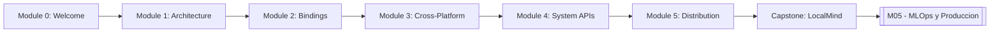
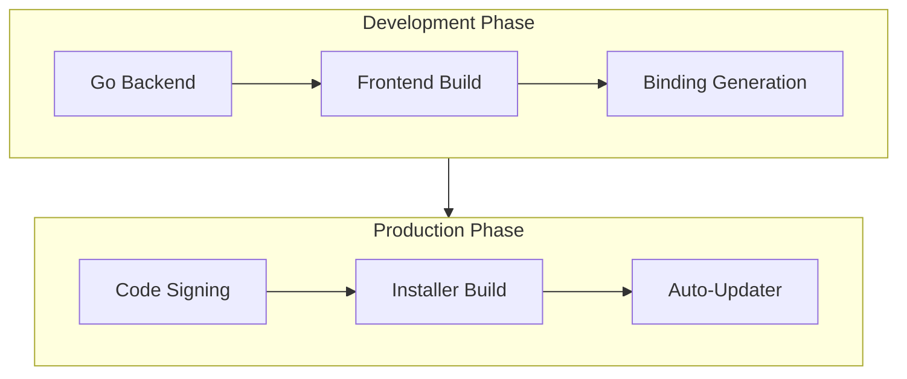

# 🖥️ Welcome to Wails

## 🎯 Learning Objectives
- Understand why Wails represents a paradigm shift in desktop application development by combining Go's systems performance with modern web frontends.
- Map the five-module learning trajectory from low-level bridge mechanics to production signing and distribution pipelines.
- Articulate how local AI tooling on the desktop connects to broader [[M05 - MLOps y Produccion]] workflows and data privacy requirements.

---

## Introduction

The history of desktop application development is a pendulum swinging between native performance and developer ergonomics. In the 1990s, developers wrote Win32 MFC or Cocoa applications in C++ and Objective-C, achieving bare-metal efficiency at the cost of brutal complexity. The 2010s saw Electron democratize desktop development by bundling Chromium and Node.js, but at a catastrophic cost: 150MB+ bundles, gigabytes of RAM consumption, and a security surface area measured in millions of lines of C++. For ML engineers shipping local AI tools — where users expect instant startup, offline resilience, and direct GPU access — Electron's trade-offs are increasingly untenable.

Wails v2 occupies a unique position in this landscape. It compiles a Go backend into a native binary, pairs it with any modern JavaScript frontend framework via the operating system's native WebView, and generates type-safe bindings at compile time. This course dives deep into the theoretical underpinnings of that architecture: why native WebViews are a superior distribution strategy, how the Go-JavaScript bridge avoids reflection overhead, and how cross-platform abstraction layers map to OS-specific APIs. We assume you have completed [[01 - Go Fundamentals]] and possess basic frontend literacy (HTML, JavaScript, and a framework like Svelte or Vue). Throughout, we connect back to the broader [[Go Engineering]] vault, showing how desktop apps serve as the final mile for ML pipelines built in earlier modules.

---

## Module 0: Course Overview and Learning Path

### 0.1 Theoretical Foundation 🧠

The desktop GUI toolkit has undergone three distinct evolutionary epochs. The first epoch (1984–2000) was dominated by native widget libraries: Win32, Cocoa, and GTK. These toolkits rendered pixels directly via the operating system's display server, yielding perfect native aesthetics and minimal memory footprints. However, they demanded platform-specific expertise, making cross-platform development prohibitively expensive. The second epoch (2000–2015) introduced cross-platform abstraction layers like Qt and wxWidgets, which wrapped native widgets behind a common C++ API. While these improved portability, they still required compilation per platform and struggled to keep pace with the web's rapid UI innovation.

The third epoch — the hybrid desktop era — began with Electron in 2013. By embedding a full web browser (Chromium), Electron allowed developers to use HTML, CSS, and JavaScript for the UI while Node.js provided OS access. The cost was astronomical: each Electron app ships with an entire browser engine, duplicating code already present on the user's machine. Wails v2 represents a fourth epoch: the *system-native hybrid*. Rather than bundling a browser, Wails leverages the web renderer already installed on the host OS: WebKit on macOS, WebView2 on Windows, and WebKitGTK on Linux. This is not merely an optimization; it is a fundamentally different distribution theory. The application binary contains only the Go backend and compressed frontend assets, yielding bundles under 20MB and memory footprints an order of magnitude smaller than Electron. For ML tools that run alongside memory-hungry models, this efficiency is not a luxury — it is a survival constraint.

### 0.2 Mental Model 📐

The course is structured as a pipeline from theory to production:

```
┌─────────────────────────────────────────────────────────────┐
│  Wails Course Learning Pipeline                             │
├─────────────────────────────────────────────────────────────┤
│                                                             │
│   ┌──────────┐    ┌──────────┐    ┌──────────┐            │
│   │ Module 1 │───►│ Module 2 │───►│ Module 3 │            │
│   │  Bridge  │    │ Bindings │    │  Build   │            │
│   └──────────┘    └──────────┘    └──────────┘            │
│        │                │                │                  │
│        ▼                ▼                ▼                  │
│   ┌──────────┐    ┌──────────┐    ┌──────────┐            │
│   │ Module 4 │    │ Module 5 │    │  FINAL   │            │
│   │  System  │───►│  Distro  │───►│  PROJECT │            │
│   │   APIs   │    │  Ship    │    │ LocalMind│            │
│   └──────────┘    └──────────┘    └──────────┘            │
│                                                             │
└─────────────────────────────────────────────────────────────┘
```

Each module feeds the next, culminating in a production-ready AI desktop utility.

```
┌─────────────────────────────────────────────────────────────┐
│  Wails Positioning in the Desktop Stack                     │
├─────────────────────────────────────────────────────────────┤
│                                                             │
│   ┌─────────────┐  ┌─────────────┐  ┌─────────────┐       │
│   │   Electron  │  │    Tauri    │  │    Wails    │       │
│   │  (Node+Chrm)│  │  (Rust+WebV)│  │  (Go+WebV)  │       │
│   │  ~150 MB    │  │   ~5 MB     │  │  ~15 MB     │       │
│   └─────────────┘  └─────────────┘  └─────────────┘       │
│          │                │                │                │
│          ▼                ▼                ▼                │
│   ┌─────────────────────────────────────────────────┐      │
│   │         Native OS WebView Engine                │      │
│   │   WebKit (macOS)  WebView2 (Win)  WebKitGTK(L)  │      │
│   └─────────────────────────────────────────────────┘      │
│                                                             │
└─────────────────────────────────────────────────────────────┘
```

Prerequisites flow into this course and onward to production engineering:

```
┌─────────────────────────────────────────────────────────────┐
│  Prerequisites and Vault Connections                        │
├─────────────────────────────────────────────────────────────┤
│                                                             │
│   [[01 - Go Fundamentals]]                                  │
│          │                                                  │
│          ▼                                                  │
│   Basic Frontend (JS / HTML)                                │
│          │                                                  │
│          ▼                                                  │
│   ┌─────────────────────────────┐                          │
│   │  Wails — Desktop Apps with Go│                          │
│   │      (This Course)          │                          │
│   └─────────────────────────────┘                          │
│          │                                                  │
│          ▼                                                  │
│   [[M05 - MLOps y Produccion]]                              │
│                                                             │
└─────────────────────────────────────────────────────────────┘
```

### 0.3 Syntax and Semantics 📝

Before diving into theory, let us establish the minimal Wails project structure. This is not merely boilerplate; it encodes the separation of concerns that defines the framework's philosophy.

```go
// main.go — Application entry point and WebView configuration
package main

import (
	"embed" // Enables static asset embedding at compile time

	"github.com/wailsapp/wails/v2"
	"github.com/wailsapp/wails/v2/pkg/options"
	"github.com/wailsapp/wails/v2/pkg/options/assetserver"
)

//go:embed all:frontend/dist
// Directive tells the Go compiler to embed the entire frontend build directory
// into the resulting binary as a virtual filesystem. This is zero-cost at runtime
// because embed.FS is backed by the binary's read-only data segment.
var assets embed.FS

func main() {
	// wails.Run blocks forever, starting the message loop and WebView.
	err := wails.Run(&options.App{
		Title:  "LocalMind",
		Width:  1024,
		Height: 768,
		AssetServer: &assetserver.Options{
			Assets: assets, // Serves embedded assets over a loopback HTTP server
		},
		Bind: []interface{}{
			NewApp(), // Registers Go methods for JavaScript invocation
		},
	})
	if err != nil {
		panic(err) // Fatal: WebView initialization failed
	}
}
```

### 0.4 Visual Representation 🖼️

The course modules interlock to cover the full lifecycle of a Wails application:




The progression mirrors a real production pipeline, from prototype to signed binary:




### 0.5 Application in ML/AI Systems 🤖

Desktop applications are experiencing a renaissance in the AI era because they solve three critical problems that browser-based ML tools cannot. First, **local model hosting**: tools like Ollama and llama.cpp run as local daemons; a desktop app provides the intuitive interface that non-technical users need to interact with them. Second, **data sovereignty**: enterprises in healthcare and finance cannot send patient records or transaction data to cloud APIs. A local desktop app keeps inference on-premise. Third, **systems integration**: desktop apps can access the clipboard, filesystem, and global hotkeys — essential for AI coding assistants that need to read the active IDE selection and suggest refactors via native notifications.

| ML Use Case | Desktop Advantage | Impact |
|-------------|-------------------|--------|
| Local LLM chat interface | Zero network latency, full privacy | 100% data retention on-device |
| AI coding assistant | Global hotkeys, clipboard access, native OS notifications | IDE-adjacent workflow integration |
| Internal model management | Direct filesystem access for model weights, GPU monitoring | Enterprise compliance |

Real case: **Independent developers building AI coding assistants** use Wails for IDE-adjacent tools. These utilities monitor the system clipboard for code snippets, query local Ollama instances via the Go backend, and stream suggestions back through the WebView frontend — all while maintaining a memory footprint under 100MB, compared to 800MB+ for an equivalent Electron wrapper.

### 0.6 Common Pitfalls ⚠️

⚠️ **Assuming WebView feature parity across platforms:** macOS WebKit supports certain CSS properties and ES2022 features that WebView2 on older Windows builds does not. Always test on your minimum supported Windows version, not just the latest.

⚠️ **Treating Wails as "Electron with Go":** This mental model leads to architectural mistakes. Wails does not provide Node.js APIs; filesystem access must go through Go bindings or the runtime package. Frontend code cannot use `fs` or `os` modules.

💡 **Mnemonic — The Wails Triangle:** *Go does the work, JS paints the pixels, and the Bridge carries the messages.* If you find yourself putting business logic in the frontend, you have inverted the triangle.

### 0.7 Knowledge Check ❓

1. **Architecture Comparison:** List three theoretical reasons why bundling a browser engine (Electron) increases security surface area compared to using the OS native WebView (Wails).
2. **Prerequisites Audit:** Before proceeding to Module 1, verify you can explain how `//go:embed` works at the linker level. What section of the ELF/Mach-O binary stores embedded data?
3. **Use Case Mapping:** Identify one ML workflow from your current work that would benefit from a desktop interface over a web application. What native OS features (notifications, file dialogs, global hotkeys) would it require?

---

## 📦 Compression Code

```go
// welcome_compression.go
// A minimal, production-ready Wails v2 application skeleton.
// This code compresses the core concepts: embedding, binding, and WebView startup.

package main

import (
	"embed"
	"github.com/wailsapp/wails/v2"
	"github.com/wailsapp/wails/v2/pkg/options"
	"github.com/wailsapp/wails/v2/pkg/options/assetserver"
)

//go:embed all:frontend/dist
var assets embed.FS // Frontend assets compiled into the binary

// App is the single source of truth for application state
type App struct{}

// NewApp constructs the application struct that will be bound to JS
func NewApp() *App { return &App{} }

// Greet is exposed to JavaScript because the App struct is listed in Bind
func (a *App) Greet(name string) string {
	return "Welcome to Wails, " + name + "!"
}

func main() {
	wails.Run(&options.App{
		Title:            "LocalMind",
		Width:            1024,
		Height:           768,
		BackgroundColour: &options.RGBA{R: 27, G: 38, B: 54, A: 1},
		AssetServer:      &assetserver.Options{Assets: assets},
		Bind:             []interface{}{NewApp()},
	})
}
```

## 🎯 Documented Project

### Description

**LocalMind** is the capstone project for this course: a cross-platform desktop application that serves as a universal interface to local LLM daemons (Ollama, llama.cpp). Built entirely in Wails with a Go backend and Svelte frontend, it demonstrates every concept from the Go-JS bridge to production code signing. The application targets ML engineers and technical writers who require private, offline access to generative models.

### Functional Requirements

1. Display a scrollable chat history with markdown rendering for assistant responses.
2. Allow users to select models from a dropdown populated by the Ollama `/api/tags` endpoint.
3. Stream LLM token responses in real time from Go to the frontend via Wails events.
4. Persist conversation history to a local SQLite database managed by the Go backend.
5. Support native file dialogs for exporting conversations to Markdown and PDF.

### Main Components

- **Wails App Shell:** `main.go` and `app.go` containing bindings, lifecycle hooks, and asset server configuration.
- **Chat Service:** Go struct managing HTTP/SSE connections to Ollama and token buffering.
- **History Repository:** SQLite abstraction using `database/sql` with `modernc.org/sqlite` for pure-Go builds.
- **Svelte Frontend:** Components for `ChatBubble`, `ModelSelector`, `Sidebar`, and `SettingsPanel`.

### Success Metrics

- Final bundle size under 25MB for all three target platforms.
- Cold startup time under 500ms on macOS Apple Silicon and Windows 11.
- Time-to-first-token under 1 second for Llama 3 8B running locally.
- Supports 10,000 messages in conversation history without UI frame drops.

### References

- Official docs: https://wails.io/docs/introduction
- Wails v2 Architecture Deep Dive: https://wails.io/docs/howdoesitwork
- Go embed package: https://pkg.go.dev/embed
