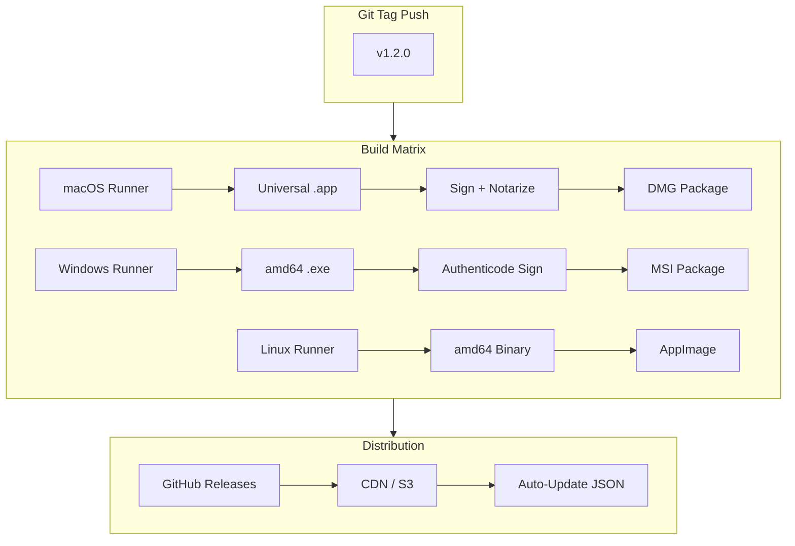
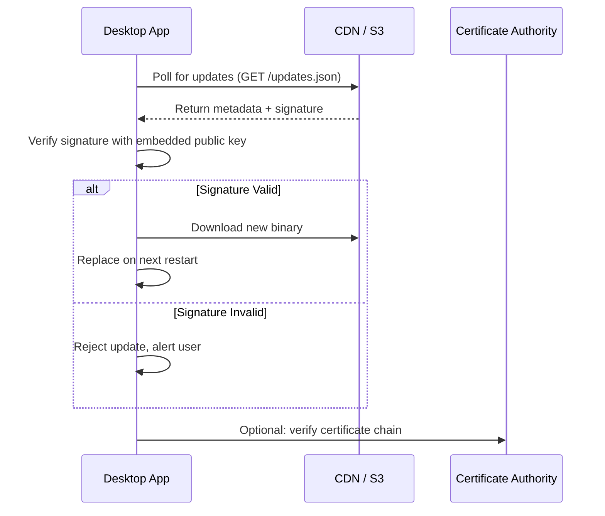

# 📦 Production Packaging and Distribution

## 🎯 Learning Objectives
- Explain the cryptographic theory behind code signing, certificate chains, and trust anchors.
- Design CI/CD pipelines that automate notarization, installer generation, and delta updates.
- Evaluate auto-updater architectures and their security implications for ML desktop tooling.

---

## Introduction

Writing the code is the beginning; shipping it is the hard part. In the era of operating system hardening, users can no longer double-click an arbitrary binary and expect it to run. macOS Gatekeeper will quarantine unsigned applications. Windows SmartScreen will display a scarlet "Unknown Publisher" warning. Linux distributions expect packages signed with GPG keys. For ML desktop tools — which often process sensitive data and run local servers — these security barriers are not obstacles to circumvent; they are trust signals that validate your software supply chain. This module examines the full production pipeline: code signing with asymmetric cryptography, Apple's notarization as a malware scan and stapling service, installer formats (MSI, DMG, AppImage), and auto-updater mechanisms that keep users on the latest model weights and inference engines. We connect these practices to [[M05 - MLOps y Produccion]], where reproducible builds and artifact provenance are first-class concerns.

Finally, consider the legal dimension of distribution. Every open-source dependency in your Wails application carries a license obligation. The Go backend may use MIT-licensed libraries, the frontend may depend on BSD-licensed npm packages, and the WebView itself is governed by the LGPL or proprietary terms. While these licenses are generally permissive for commercial use, they require attribution. A LICENSES.third_party file, automatically generated by tools like go-licenses and license-checker, should be included in every installer. For ML tools that incorporate academic research code, the license may impose citation requirements or non-commercial restrictions. Failing to comply can result in copyright infringement claims or forced open-sourcing of your proprietary application.

---

## Module 5: Security, Installers, and Auto-Updates

### 5.1 Theoretical Foundation 🧠

**Asymmetric Cryptography and Code Signing:** Code signing relies on public-key cryptography. The developer holds a private key and obtains an X.509 certificate from a Certificate Authority (CA) like Apple, DigiCert, or Let's Encrypt (for GPG on Linux). The certificate binds the developer's public key to their identity. When signing, the build pipeline computes a cryptographic hash (SHA-256) of the binary, encrypts that hash with the private key, and embeds the resulting signature plus the certificate into the binary's header (PE Authenticode on Windows, Code Directory and CMS signature on macOS). When the OS loads the binary, it verifies the certificate chain against its trust store, recomputes the hash, and decrypts the signature using the public key. If the hashes match and the chain is trusted, the binary is accepted. This prevents both tampering (any modification invalidates the hash) and spoofing (only the private key holder can produce a valid signature).

**Notarization as a Supply-Chain Service:** Apple notarization extends code signing with a cloud-based malware scan. When you upload your signed `.app` or `.dmg` to Apple's notary service, it is executed in a sandboxed environment, scanned for known malware signatures, and checked against a set of heuristics. If it passes, Apple issues a **notarization ticket** — a cryptographically signed attestation that the binary was scanned and approved. On macOS 10.15+, Gatekeeper requires this ticket (or an internet connection to fetch it) for software launched outside the App Store. Developers can **staple** the ticket to the binary so offline users can validate it without phoning home. This is a form of **transitive trust**: Apple vouches for the developer, and the developer vouches for the binary.

**Installer Formats and Distribution Economics:** An installer is more than a compressed archive; it is a **transaction** that places files, registers components, and configures the system.
- **MSI (Windows Installer)** is a relational database (`*.msi` files are COM Structured Storage) containing tables for files, registry entries, shortcuts, and custom actions. It supports transactional installation (rollback on failure) and integrates with Windows Add/Remove Programs.
- **DMG (Apple Disk Image)** is a filesystem image that mounts as a virtual disk. It is not an installer per se, but it provides a branded drag-and-drop experience that is idiomatic for macOS.
- **AppImage** on Linux mounts a SquashFS image via FUSE, executing the contained binary without system-wide installation. It solves the "dependency hell" problem by bundling libraries.
- **Debian `.deb` packages** use `dpkg` and `apt` for dependency resolution, fitting into the Linux distribution ecosystem.

**Auto-Updaters:** Desktop applications cannot rely on users to manually download updates. Auto-updaters like **Squirrel** (Windows), **Sparkle** (macOS), and **Tauri Updater** (cross-platform) poll a JSON endpoint or RSS feed for new versions, download the delta or full binary, verify its signature, and replace the running executable on next launch. The security critical path is the signature verification: if an attacker compromises the update server, they must still forge the developer's private key to push a malicious update. For ML tools, auto-updaters are essential for distributing new model architectures and security patches.

### 5.2 Mental Model 📐

Trust chain for a signed binary:

```
┌─────────────────────────────────────────────────────────────┐
│  Code Signing Trust Chain                                   │
├─────────────────────────────────────────────────────────────┤
│                                                             │
│   Root CA (Apple, DigiCert)                                 │
│      │                                                      │
│      ▼                                                      │
│   Intermediate CA                                           │
│      │                                                      │
│      ▼                                                      │
│   Developer Certificate (Your Identity)                     │
│      │                                                      │
│      ▼                                                      │
│   Private Key ──► Signs ──► Binary Hash                     │
│      │                          │                           │
│      └──────────────────────────┘                           │
│              Embedded Signature                             │
│                                                             │
└─────────────────────────────────────────────────────────────┘
```

The packaging pipeline from build to user:

```
┌─────────────────────────────────────────────────────────────┐
│  Production Pipeline                                        │
├─────────────────────────────────────────────────────────────┤
│                                                             │
│   Build                                                     │
│      │                                                      │
│      ▼                                                      │
│   ┌──────────┐    ┌──────────┐    ┌──────────┐            │
│   │  Compile │───►│  Sign    │───►│ Notarize │            │
│   │  Binary  │    │  Binary  │    │ (macOS)  │            │
│   └──────────┘    └──────────┘    └──────────┘            │
│      │                                                      │
│      ▼                                                      │
│   ┌──────────┐    ┌──────────┐    ┌──────────┐            │
│   │  Package │───►│  Upload  │───►│  Update  │            │
│   │  Installer│   │  CDN     │    │  Server  │            │
│   └──────────┘    └──────────┘    └──────────┘            │
│      │                                                      │
│      ▼                                                      │
│   User Download → Install → Launch → Auto-Update Check      │
│                                                             │
└─────────────────────────────────────────────────────────────┘
```

Installer format selection matrix:

```
┌─────────────────────────────────────────────────────────────┐
│  Installer Format Economics                                 │
├─────────────────────────────────────────────────────────────┤
│                                                             │
│   Format    │  OS      │  Size │  Admin? │  Uninstall      │
│   ──────────┼──────────┼───────┼─────────┼──────────────── │
│   .exe      │ Windows  │ Small │ Maybe   │ Manual          │
│   .msi      │ Windows  │ Med   │ Yes     │ Control Panel   │
│   .dmg      │ macOS    │ Large │ No      │ Drag to Trash   │
│   .app      │ macOS    │ Med   │ No      │ Drag to Trash   │
│   .AppImage │ Linux    │ Large │ No      │ Delete file     │
│   .deb      │ Linux    │ Small │ Yes     │ apt remove      │
│                                                             │
└─────────────────────────────────────────────────────────────┘
```

### 5.3 Syntax and Semantics 📝

Below is a conceptual GitHub Actions workflow that automates the full pipeline. The YAML syntax encodes the dependency graph between build, sign, notarize, and release.

```yaml
# .github/workflows/release.yml
# Conceptual CI/CD pipeline for Wails production release.
# In production, secrets (certificates, passwords) live in GitHub Secrets.

name: Release Wails App

on:
  push:
    tags: ["v*"]

jobs:
  build-macos:
    runs-on: macos-latest
    steps:
      - uses: actions/checkout@v4
      - uses: actions/setup-go@v5
        with: { go-version: '1.22' }
      - uses: wailsapp/setup-wails@v1

      # Build the universal binary (amd64 + arm64)
      - run: wails build -platform darwin/universal -ldflags "-s -w"

      # Sign with Developer ID Application certificate from keychain
      # codesign uses the private key in the macOS keychain to create
      # a CMS signature embedded in the Mach-O binary.
      - run: |
          codesign --deep --force --verify --verbose \
            --sign "Developer ID Application: YourName" \
            --options runtime \
            build/bin/LocalMind.app

      # Notarize: submit to Apple, staple the ticket to the .app,
      # then package into a DMG.
      - run: |
          xcrun notarytool submit build/bin/LocalMind.app \
            --apple-id ${{ secrets.APPLE_ID }} \
            --team-id ${{ secrets.APPLE_TEAM_ID }} \
            --password ${{ secrets.APPLE_APP_PASSWORD }} \
            --wait
          xcrun stapler staple build/bin/LocalMind.app
          hdiutil create -volname "LocalMind" -srcfolder build/bin/LocalMind.app -ov -format UDZO LocalMind.dmg

  build-windows:
    runs-on: windows-latest
    steps:
      - uses: actions/checkout@v4
      - uses: actions/setup-go@v5
        with: { go-version: '1.22' }
      - uses: wailsapp/setup-wails@v1

      # Build Windows binary with ldflags to strip debug info (-s -w).
      - run: wails build -platform windows/amd64 -ldflags "-s -w -H windowsgui"

      # Sign with Authenticode using DigiCert certificate.
      # signtool signs the PE header's certificate table.
      - run: |
          signtool sign /f ${{ secrets.WIN_CERT_PATH }} /p ${{ secrets.WIN_CERT_PASS }} /tr http://timestamp.digicert.com /td sha256 /fd sha256 build/bin/LocalMind.exe

      # Package with WiX Toolset into an MSI for corporate deployment.
      - run: |
          candle LocalMind.wxs
          light LocalMind.wixobj -o LocalMind.msi
```

For auto-updates, a minimal Sparkle `appcast.xml` on macOS:

```xml
<?xml version="1.0" encoding="utf-8"?>
<rss version="2.0" xmlns:sparkle="http://www.andymatuschak.org/xml-namespaces/sparkle">
  <channel>
    <title>LocalMind Updates</title>
    <item>
      <title>Version 1.2.0</title>
      <pubDate>Wed, 06 May 2026 12:00:00 +0000</pubDate>
      <enclosure url="https://cdn.localmind.app/LocalMind-1.2.0.dmg"
                 sparkle:version="1.2.0"
                 sparkle:edSignature="base64signaturehere..."
                 length="18432000"
                 type="application/octet-stream" />
    </item>
  </channel>
</rss>
```

### 5.4 Visual Representation 🖼️

CI/CD pipeline architecture:



Auto-updater security flow:




### 5.5 Application in ML/AI Systems 🤖

**MediGuard Local AI** is a HIPAA-compliant desktop application deployed to 400 clinicians' workstations at a regional hospital network. The application runs a local LLM for clinical note summarization; because patient data never leaves the machine, the hospital's compliance officer approved it where cloud-based tools were rejected. The problem: clinical IT requires all software to be signed, notarized (on macOS), and distributed through a managed update channel.

The Wails application uses a CI/CD pipeline identical to the conceptual YAML above. On macOS, the `.app` is signed with an Apple Developer ID and notarized; the stapled ticket allows clinicians on locked-down machines to launch without admin intervention. On Windows, the `.msi` is signed with an Extended Validation (EV) code signing certificate, which immediately satisfies SmartScreen (standard certificates require a reputation build-up period). The auto-updater checks a hospital-internal S3 bucket signed with a GPG key. When the biotech team releases an updated summarization model (packaged as a `.gguf` file), the new app version downloads the model weights alongside the binary update. Because the update mechanism verifies Ed25519 signatures on both the binary and the model weights, the supply chain is protected end-to-end.

| ML Use Case | This Concept | Impact |
|-------------|-------------|--------|
| Hospital LLM summarization tool | Code signing + notarization | HIPAA-compliant deployment without IT exceptions |
| Enterprise model weight distribution | Signed auto-updater | Prevents model poisoning via compromised CDN |
| Cross-platform clinical tool | MSI + DMG + GPG | Single CI pipeline serves all hospital workstations |

### 5.6 Common Pitfalls ⚠️

⚠️ **Losing the private key:** If your code signing private key is lost or leaked, you cannot sign updates that existing users will trust. On macOS, this forces you to change your bundle identifier and abandon the old app's update channel. Use Hardware Security Modules (HSMs) or cloud signing services (e.g., DigiCert KeyLocker) to protect keys.

⚠️ **Notarizing after packaging:** Apple notarizes the `.app` bundle, not the `.dmg`. If you notarize the `.app`, then modify it while building the `.dmg` (e.g., adding a background image to the DMG layout), the stapled ticket becomes invalid. Always notarize the final, immutable artifact.

💡 **Mnemonic — Sign First, Staple Last, Ship Once:** *Sign the binary, staple the ticket, then never touch the bits again. Any modification after stapling breaks the chain of trust.*

### 5.7 Knowledge Check ❓

1. **Certificate Chain:** A hospital IT department adds your app's certificate to their internal trust store. Six months later, the intermediate CA that issued your certificate is revoked due to a security incident. Will existing installations of your app still launch? Will new installations? What mechanism prevents or allows this?
2. **Delta Updates:** Your ML model weights are 4GB and update weekly, but the application binary is only 15MB. How would you design an auto-updater that minimizes bandwidth? Should the model weights be embedded in the binary, shipped as a separate download, or managed via a package manager?
3. **Notarization Stapling:** A clinician downloads your stapled `.app` onto a laptop, then boards a flight with no internet access. They launch the app for the first time. Explain why Gatekeeper accepts or rejects the launch, referencing the difference between ticket stapling and online ticket lookup.

4. **Certificate Revocation:** An intermediate CA in your certificate chain is compromised. Apple publishes a Certificate Revocation List (CRL) update. How does macOS Gatekeeper handle this for already-stapled applications? What is the difference between CRL and OCSP stapling?

5. **Offline Notarization:** A user launches your stapled app on an air-gapped military network. Three years later, the certificate has expired. Will Gatekeeper allow the launch? What Apple mechanism (if any) prevents this scenario?

---


### 5.8 Reproducible Builds and SBOMs 🔬

In regulated industries — healthcare, finance, defense — software is not merely shipped; it is **audited**. A reproducible build is one where compiling the same source code with the same toolchain always produces a bitwise-identical binary. This property allows third-party auditors to verify that the binary you distributed was indeed built from the claimed source, without hidden backdoors. Go supports reproducible builds through `-trimpath` (removing host-specific paths from debug info) and controlled `GOFLAGS`. Wails adds complexity because the frontend build (Node.js/npm) is not inherently reproducible: package managers may resolve dependencies differently depending on lockfile discipline.

To achieve end-to-end reproducibility, a Wails project must:
1. Pin Go module versions using `go.mod` and `go.sum`.
2. Pin npm dependencies using `package-lock.json` or `pnpm-lock.yaml`.
3. Use a deterministic build environment, such as a Nix derivation or a locked Docker image (`wailsapp/xgo` at a specific digest).
4. Record a **Software Bill of Materials (SBOM)** listing every dependency, its version, its license, and its hash.

For ML tools, SBOMs are particularly important because they often link against CUDA libraries, ONNX Runtime, or proprietary SDKs whose licenses may prohibit redistribution. An SBOM generated with tools like `syft` or `fossology` provides legal defensibility and ensures that your auto-updater does not silently pull in a dependency with a viral license like GPL-3.0 that would force you to open-source your entire application.

### 5.9 Delta Updates and Model Weight Management 🌐

Auto-updating a 15MB binary is trivial; auto-updating a 4GB model weights file is not. Most auto-updater frameworks support **delta patches**: binary diffs between versions that contain only the changed bytes. For a Go binary compiled with `-buildmode=exe`, a minor code change typically produces a 50KB–200KB delta. However, delta patches are ineffective for model weights, which are opaque binary tensors that change entirely when replaced.

The architectural solution is to **decouple application updates from model updates**. The Wails binary should contain only the application logic and a manifest file listing available models, their versions, and their cryptographic hashes. A separate **model manager** service (written in Go and bound to the frontend) downloads model weights on demand, verifies their hashes, and stores them in a versioned cache directory (`~/.local/share/LocalMind/models/`). This design mirrors the MLOps pattern of separating code artifacts from data artifacts, allowing the application to update weekly while models update quarterly or on demand. The model manager should also support **garbage collection**: deleting old versions when disk space is low, a common scenario on clinician laptops with 256GB SSDs.


### 5.10 Telemetry and Privacy Compliance 📊

Production desktop applications often include telemetry to diagnose crashes and measure feature usage. However, ML tools processing sensitive data face heightened scrutiny under GDPR, HIPAA, and SOC 2. Wails does not include built-in telemetry, giving developers full control over data collection. Best practices include:

1. **Opt-in consent:** The first launch should present a privacy dialog explaining what is collected (e.g., crash logs, update checks) and requiring explicit consent before enabling telemetry.
2. **Anonymization:** If usage metrics are collected, hash the user ID with a salt rotated daily to prevent longitudinal tracking.
3. **Local-first logging:** Write diagnostic logs to a local file (`~/Library/Logs/LocalMind/` on macOS, `%APPDATA%\LocalMind\logs` on Windows). Only upload them when the user explicitly clicks "Send Report."
4. **No model data leakage:** Telemetry must never include prompt text, model outputs, or file paths. A single leaked patient record in a crash log can trigger a HIPAA breach notification costing millions of dollars.

For the auto-updater, the poll request to the update server should include only the current version number and OS architecture — no user identifiers, no installation timestamps. This minimal metadata respects privacy while allowing the server to return the correct binary artifact.

## 📦 Compression Code

```go
// packaging_compression.go
// This Go file is paired with the CI/CD pipeline above.
// It demonstrates runtime version checking for update prompts.

package main

import (
	"context"
	"embed"
	"fmt"
	"runtime"

	"github.com/wailsapp/wails/v2"
	"github.com/wailsapp/wails/v2/pkg/options"
	"github.com/wailsapp/wails/v2/pkg/options/assetserver"
)

//go:embed all:frontend/dist
var assets embed.FS

// BuildVersion is injected at link time via -ldflags.
// Example: go build -ldflags "-X main.BuildVersion=1.2.0"
var BuildVersion = "dev"

type App struct{ ctx context.Context }

func NewApp() *App { return &App{} }
func (a *App) startup(ctx context.Context) { a.ctx = ctx }

// GetVersion returns the compiled version and platform info.
// The frontend polls this on startup to compare against the update server.
func (a *App) GetVersion() map[string]string {
	return map[string]string{
		"version":   BuildVersion,
		"goos":      runtime.GOOS,
		"goarch":    runtime.GOARCH,
		"webview":   "native", // In production, query actual WebView version
	}
}

func main() {
	app := NewApp()
	wails.Run(&options.App{
		Title:       fmt.Sprintf("LocalMind %s", BuildVersion),
		Width:       1024,
		Height:      768,
		AssetServer: &assetserver.Options{Assets: assets},
		OnStartup:   app.startup,
		Bind:        []interface{}{app},
	})
}
```

## 🎯 Documented Project

### Description

**MediGuard Local AI** is a HIPAA-compliant desktop application for clinical note summarization using local LLMs. Deployed across 400 workstations in a hospital network, it demonstrates production-grade packaging: Apple notarization, Windows EV code signing, Linux GPG-signed AppImages, and an auto-updater that distributes both application binaries and model weight files through a signed channel. The project serves as the capstone integration of all five course modules.


MediGuard's packaging pipeline is audited quarterly by an external security firm. The audit scope includes verifying that the CI/CD runner environment matches the documented Dockerfile, that code signing keys are stored in a FIPS 140-2 Level 3 HSM, and that the SBOM accurately reflects all transitive dependencies. These audits have uncovered two outdated TLS certificate bundles and one unnecessary network permission, demonstrating that rigorous packaging discipline is inseparable from security posture.

### Functional Requirements

1. Package the application as a signed `.app` (macOS), signed `.msi` (Windows), and GPG-signed `.AppImage` (Linux).
2. Implement an auto-updater that checks a hospital-internal S3 endpoint for new versions and verifies Ed25519 signatures before installation.
3. Bundle or download updated model weights (`.gguf` files) securely alongside application updates.
4. Display code signing certificate information in an "About" dialog for IT audit compliance.
5. Support offline launch after initial installation by stapling notarization tickets and embedding GPG public keys.

### Main Components

- **CI/CD Pipeline:** GitHub Actions matrix with macOS, Windows, and Linux runners executing `wails build`, signing, notarization, and packaging.
- **Update Server:** Hospital-internal S3 bucket serving version metadata JSON, signed binaries, and model weight manifests.
- **Signature Verifier:** Go module using `crypto/ed25519` to verify binary and model signatures before applying updates.
- **IT Audit Panel:** Frontend component displaying certificate issuer, notarization status, and last update timestamp.

### Success Metrics

- 100% of macOS workstations launch without Gatekeeper warnings or admin prompts.
- Windows SmartScreen shows "Verified Publisher" on first launch in all 200 Windows deployments.
- Auto-updater bandwidth usage under 50MB per week via delta binary patches.
- Zero successful supply-chain attacks during 12-month deployment period.

### References

- Official docs: https://wails.io/docs/guides/crossplatform-build
- Apple Code Signing: https://developer.apple.com/documentation/security/code_signing
- Windows Authenticode: https://learn.microsoft.com/en-us/windows-hardware/drivers/install/authenticode
- Sparkle Framework: https://sparkle-project.org/documentation/
